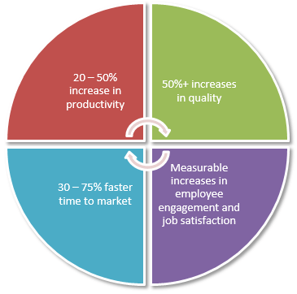
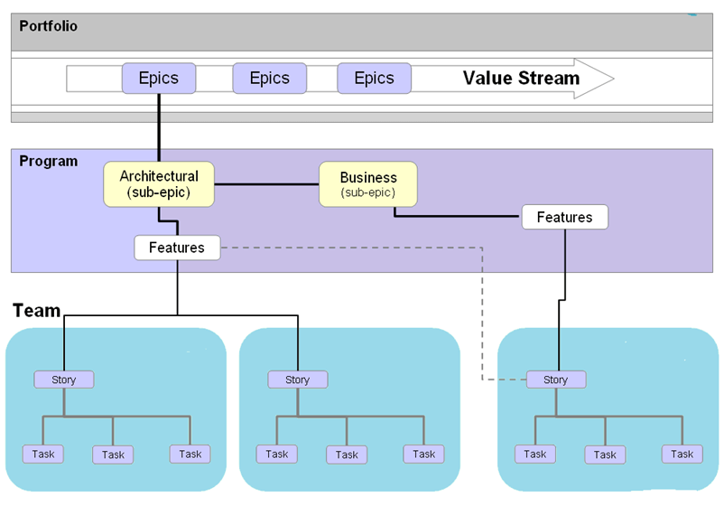
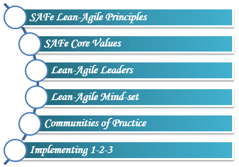

###### [Home](https://github.com/RyKaj/Documentation/blob/master/README.md) | [Agile](https://github.com/RyKaj/Documentation/tree/master/Agile/README.md) |
------------

Information Technology : 1.0 Agile Standards and Process 
========================================================

{.confluence-embedded-image
.confluence-external-resource .confluence-content-image-border
height="250"}  {.confluence-embedded-image
.confluence-external-resource .confluence-content-image-border
height="250"}
{.confluence-embedded-image
.confluence-content-image-border width="282" height="250"}
{.confluence-embedded-image
.confluence-external-resource .confluence-content-image-border
height="250"}

{.confluence-embedded-image
.confluence-external-resource .confluence-content-image-border
height="250"}

\

 
 {.panelHeader style="border-bottom-width: 1px;"}
**Methodology**

 {#expander-588334661 .expand-container}
 {#expander-control-588334661 .expand-control}
[]{.expand-icon .aui-icon .aui-icon-small .aui-iconfont-chevron-down}

Agile Methodology

 {#expander-content-588334661 .expand-content}
[Author: [Ryan
Kajiura](https://wiki.pinnacle.com/display/~ryank){.confluence-userlink
.user-mention .current-user-mention} ]{style="color: rgb(0,51,102);"}

>     “agile” is a state of being, not a process. It is a feeling that drives development and delivery. In teams I would consider agile, none of them operated exactly like the others; and some actions that would improve agility in one team would harm it in another. Some companies are able to mimic that feeling by embracing agile principles, and others aren’t. The important part isn’t the specific methodology that others say will help you achieve max productivity for your team, it’s the process that aligns with your culture and your software and your customer.

Agile {#id-1.0AgileStandardsandProcess-Agile}
=====

Agile is an umbrella term used to describe a project management
methodology which breaks down large complex projects into smaller
manageable chunks. Agile project management has been used in software
development to speed up the completion of projects, but now, we see
these practices being applied in a multitude of industries. \"[Agile is
a set of guiding principles developed in 2001 published as
the ][[Agile
Manifesto](http://agilemanifesto.org/)][.
Scrum and Kanban, on the other hand, are two methodologies which are
considered to be Agile. Or to put it another way, if you want to work in
an agile fashion, Scrum and Kanban are two ways to do it.]"
said Nicholas Carrier, Associate Partner at
London-based [Prophet](https://www.prophet.com/).\

A structured and iterative approach to project management and product
development. It recognizes the volatility of product development, and
provides a methodology for self-organizing teams to respond to change
without going off the rails. Today, agile is hardly a competitive
advantage. No one has the luxury to develop a product for years or even
months in a black box. This means it's more important than ever to get
it right.

Agile software development is based on an incremental, iterative
approach. Instead of in-depth planning at the beginning of the project,
Agile methodologies are open to changing requirements over time and
encourages constant feedback from the end users. Cross-functional teams
work on iterations of a product over a period of time, and this work is
organized into a backlog that is prioritized based on business or
customer value. The goal of each iteration is to produce a working
product.

In Agile methodologies, leadership encourages teamwork, accountability,
and face-to-face communication. Business stakeholders and developers
must work together to align the product with customer needs and company
goals.

\

 
 {.panelHeader style="border-bottom-width: 1px;"}
**Agile Manifesto**

*We are uncovering better ways of developing software by doing it and
helping others do it.*

*Through this work we have come to value:*

***Individuals and interactions** over processes and tools*

***Working software** over comprehensive documentation*

***Customer collaboration** over contract negotiation*

***Responding to change** over following a plan*

*That is, while there is value in the items on the right, we value the
items on the left more.*

*\
*

*{.confluence-embedded-image
.confluence-external-resource height="150"}
{.confluence-embedded-image
.confluence-external-resource .confluence-content-image-border
width="762" height="154"}\
*

*\
*

 {#expander-567442533 .expand-container}
 {#expander-control-567442533 .expand-control}
[]{.expand-icon .aui-icon .aui-icon-small .aui-iconfont-chevron-down}

Human Resource Manifesto

 {#expander-content-567442533 .expand-content}
We follow these principles:

\

Support people to engage, grow,

and be happy in their workplace.

\

Encourage people to welcome change

and adapt when needed.

\

Help to build and support networks of empowered,

self-organising and collaborative teams.

\

Nourish and support the people's and team's motivation

and capabilities, help them build the environment they need,

and trust them to get the job done.

\

Facilitate and nurture personal growth,

to harness employee's different strengths and talents.

\

\

 
 {.panelHeader style="border-bottom-width: 1px;"}
**12 Principles**

1.  Our highest priority is to satisfy the customer through early and
    continuous delivery of valuable software.
2.  Welcome changing requirements, even late in development. Agile
    processes harness change for the customer's competitive advantage.
3.  Deliver working software frequently, from a couple of weeks to a
    couple of months, with a preference to the shorter timescale.
4.  Business people and developers must work together daily throughout
    the project.
5.  Build projects around motivated individuals. Give them the
    environment and support they need, and trust them to get the job
    done.
6.  The most efficient and effective method of conveying information to
    and within a development team is face-to-face conversation.
7.  Working software is the primary measure of progress.
8.  Agile processes promote sustainable development. The sponsors,
    developers, and users should be able to maintain a constant pace
    indefinitely.
9.  Continuous attention to technical excellence and good design
    enhances agility.
10. Simplicity--the art of maximizing the amount of work not done--is
    essential.
11. The best architectures, requirements, and designs emerge from
    self-organizing teams.
12. At regular intervals, the team reflects on how to become more
    effective, then tunes and adjusts its behavior accordingly.

\

{.confluence-embedded-image
.confluence-external-resource .confluence-content-image-border
height="250"}

\

 
 {.panelHeader style="border-bottom-width: 1px;"}
**Agile Leadership**

1.  When there are leadership and guidance, not command & control.
2.  When there is alignment across the organization instead of the
    pursuit of local optimization efforts or personal agendas.
3.  When the collaboration of all participants beyond hierarchies is the
    norm, not an exception.
4.  When we acknowledge that management principles of the 19th century
    are unsuited to solve complex problems of the 21st century.
5.  When managers become servant leaders.

The following paragraphs focus on the main concepts related to agile
leadership: from servant leadership to the agile mindset to creating a
learning organization. The lists are not supposed to be comprehensive
but provide the interested reader with a starting point for further
research.

 {#expander-1547289756 .expand-container}
 {#expander-control-1547289756 .expand-control}
[]{.expand-icon .aui-icon .aui-icon-small .aui-iconfont-chevron-down}

Servant Leadership

 {#expander-content-1547289756 .expand-content}
"A Servant Leader shares power puts the needs of the employees first and
helps people develop and perform as highly as possible. Instead of the
people working to serve the leader, the leader exists to serve the
people."

Source: [Wikipedia on Servant
Leadership](https://en.wikipedia.org/wiki/Servant_leadership "Wikipedia on Servant Leadership").

Servant leadership is a suitable approach to dealing with complexity.
Complexity --- the unknown unknowns --- determines decision-making
processes and is characterized by:

-   More unpredictability than predictability.
-   Emergent answers.
-   Many competing ideas.
-   Cause and effect can only be determined in retrospect.

For a much more elaborate approach to complexity, see the [Cynefin
framework by Dave
Snowden](https://cognitive-edge.com/ "Agile Leadership: Cynefin framework").

Servant leadership is not a new concept:

"A leader is best when people barely know he exists when his work is
done, his aim fulfilled, they will say: we did it ourselves." ([Lao Tzu,
4th century BC.](https://en.wikipedia.org/wiki/Laozi))

Servant leadership is characterized by:

-   Service to others.
-   Promotion of community.
-   Creation of a shared vision.
-   A holistic approach to work.
-   A shared decision-making process.

Servant leadership thus seems suited to overcome the industrial
paradigm.
Source: [Wikipedia](https://en.wikipedia.org/wiki/Servant_leadership "Wikipedia on Servant Leadership").

 {#expander-464067530 .expand-container}
 {#expander-control-464067530 .expand-control}
[]{.expand-icon .aui-icon .aui-icon-small .aui-iconfont-chevron-down}

Intent-based Leadership

 {#expander-content-464067530 .expand-content}
The principles of intent-based leadership according to David Marquet are
as follows:

-   Create leaders, not followers.
-   Resist the urge to resolve the problems of your people.
-   Take deliberate action.
-   Learn everywhere at any time.
-   Specify goals, not methods.
-   Don't empower, emancipate.

Source: [10 Insights on Intent-Based Leadership --- David
Marquet](https://www.slideshare.net/InspirationalMoments/10-insights-on-intentbased-leadership-david-marquet).

Reading tip: [Turn the Ship
Around](https://www.amazon.com/Turn-Your-Ship-Around-Implementing/dp/1591847532).

 
 {.panelHeader style="border-bottom-width: 1px;"}
**Agile Mindset**

As to what "having an Agile mindset" means, things were initially
unclear. Some resorted to the Supreme Court's approach to defining
pornography: "You know it when you see it." Yet over time, the nature
and content of the Agile mindset have clarified, particularly by way of
contrast to the *bureaucratic mindset* that is still prevalent in many
large organizations.

Practitioners are thus said to have *an Agile mindset* when they are
preoccupied---and sometimes obsessed---with innovating and delivering
steadily more *customer* value, with getting work done in small
self-organizing *teams*, and with collaborating together in an
interactive *network*. Such organizations have been shown to have the
capacity to adapt rapidly to a quickly shifting marketplace.

The bureaucracy that ensues from such a mindset often finds it hard to
adapt to a world in massive rapid change.

The two different kinds of mindsets exert a powerful influence on the
behavior of their respective organizations and can be seen as having
the *de facto* force of organizational laws, as shown here.

{.confluence-embedded-image
.confluence-external-resource .confluence-content-image-border
height="250"}

\

It's not that those with a *bureaucratic mindset* don't care about the
customer: it's just that they generally focus more on making money for
the company and its shareholders. Nor do they never use teams; it's that
in a bureaucracy, self-organizing teams are the exception, not the rule.
Nor is operating as a network unknown in a bureaucracy: it's just that
maintaining the pyramid of layers and divisions is seen as more
important.

\

A bureaucratic mindset, when shared by tens of thousands of staff, tends
to create a radically different---and less adaptable---kind of
organization than one peopled by those with an Agile mindset.

Agile As A Professional Mindset {#id-1.0AgileStandardsandProcess-AgileAsAProfessionalMindset}
-------------------------------

It may be better to think of the Agile mindset as something akin to the
mindset of a profession, such as that of a lawyer, a doctor or an
economist. Thus, lawyers, doctors, and economists think about certain
problems in characteristic ways. They notice certain kinds of
information, data, and concerns in their respective subjects. They
analyze the issues in their respective ways. They pursue their
respective kinds of solutions. These different ways of thinking,
perceiving and acting as lawyers, doctors, and economists, are acquired
over years of training and practice, which in turn generate
characteristic attitudes, values, modes of thought and approaches to
problems. Professional mindsets are not things that can be acquired
overnight or a two-day training course.

Similarly, those managers with an Agile mindset also pay attention to
certain kinds of information, data, and concerns. They analyze problems
in particular ways. They tend to pursue certain kinds of
solutions---focusing on value for customers, working in small teams and
operating as a network. Their ways of thinking, perceiving and acting
are often acquired over a period of years of practice. We should not be
surprised that the Agile mindset too isn't something that can be
acquired overnight or a two-day training course.

What we are talking about with the Agile mindset is the emergence of
management itself---finally---becoming a real profession.

The Nature Of The Agile Mindset {#id-1.0AgileStandardsandProcess-TheNatureOfTheAgileMindset}
-------------------------------

The Agile mindset is an attribute of practitioners more than theorists.
It is pragmatic and action-oriented more than a theoretical philosophy.
It goes beyond a set of beliefs and becomes a tool for diagnosis and the
basis for action. It tends to be built on the hard-won knowledge of
experience and crafted from the lessons of trying to cope with massive
change in the face of incomprehensible complexity.

The Agile mindset might also be called a framework, a paradigm, or a
common model. Yet "mindset" seems a better choice of word, reflecting a
coherent tradition of exploration, paths of analysis and patterns of
reasoning.

The Agile mindset reflects ways of thinking that have developed over
time. It is a certain cast of mind that emphasizes some things over
others. It should continue to grow and evolve. It reflects attitudes and
viewpoints that tend to endure. Over time, it leads to people being seen
as having a certain makeup or character. Once we have understood the
Agile mindset, we can anticipate types of behavior that should occur.

The 'agile mindset' discussion seems to be centered around five areas:
complexity and planning, delivering value, self-organization, fostering
collaboration, and cross-functionality of teams:

 {#expander-1860304572 .expand-container}
 {#expander-control-1860304572 .expand-control}
[]{.expand-icon .aui-icon .aui-icon-small .aui-iconfont-chevron-down}

Mindset, Complexity, and Planning

 {#expander-content-1860304572 .expand-content}
-   The definition of mindset: "[The established set of attitudes held
    by
    someone](https://en.oxforddictionaries.com/definition/mindset "The Oxford Disctionaries on Mindset")."
-   [The complexity challenge:]{style="color: rgb(0,0,0);"}
    -   The [scientific management
        methodology](https://en.wikipedia.org/wiki/Scientific_management "Wikipedia on Scientific Management") of
        Frederick Taylor does not apply to "creative work."
    -   Problem-solving in a complex environment cannot be achieved with
        "more" planning.
    -   The future in the complex or chaotic domain cannot be predicted.
    -   Hence different approaches need to be employed when dealing with
        creative solutions in unchartered territory, for
        example, [Empiricism](https://www.britannica.com/topic/empiricism "The Encyclopedia Britannica on Empiricism") or [Lean](https://www.lean.org/WhatsLean/).

 {#expander-564700336 .expand-container}
 {#expander-control-564700336 .expand-control}
[]{.expand-icon .aui-icon .aui-icon-small .aui-iconfont-chevron-down}

Focus on Delivering Value

 {#expander-content-564700336 .expand-content}
-   Continuous value delivery to customers; outcome over output.
    (Manifesto of Agile Software Development: "[Working software is the
    primary measure of
    progress](https://agilemanifesto.org/principles.html "Principles behind the Agile Manifesto").")
-   [Continuous learning & applying
    empiricism:]{style="color: rgb(0,0,0);"}
    -   Deming: [PDCA
        cycle](https://en.wikipedia.org/wiki/PDCA).
    -   Empiricism: Transparency, inspection, adaptation.
    -   Iterative, incremental.
    -   Accepting that failure is more than an option but inevitable.
    -   Willingness to adapt to change.

 {#expander-1642833160 .expand-container}
 {#expander-control-1642833160 .expand-control}
[]{.expand-icon .aui-icon .aui-icon-small .aui-iconfont-chevron-down}

Self-Organization

 {#expander-content-1642833160 .expand-content}
-   Teams can best decide how to accomplish work and achieve the goal.
-   Teams outperform individuals.
-   Team building is a crucial success factor: The team wins, the team
    fails.
-   [Optimize for flow not
    utilization](https://www.youtube.com/watch?v=CostXs2p6r0),
    and move from push to flow.
-   The importance of values: [courage, commitment, focus, openness,
    respect](https://scrumguides.org/scrum-guide.html#values "The Scrum Guide on Scrum Values").

 {#expander-1249265989 .expand-container}
 {#expander-control-1249265989 .expand-control}
[]{.expand-icon .aui-icon .aui-icon-small .aui-iconfont-chevron-down}

Fostering collaboration

 {#expander-content-1249265989 .expand-content}
-   Creating psychological safety and equal speaking opportunity.
-   Respect for individuals.
-   Inclusion and diversity.
-   [Core
    Protocols](https://liveingreatness.com/core-protocols/ "Jim and Michele McCarthy: The Core Protocols"):
    Opt-in, opt-out, law of 2 feet --- creative work requires voluntary
    participation.
-   Prime directive: stop protecting the organization by assuming people
    come to the office to "rip you off."
-   [Give people a voice, provide an opportunity to be
    heard](https://management30.com/podcast/the-secret-to-creating-high-performing-teams/).

Further reading: [How to build the perfect
team](https://www.nytimes.com/2016/02/28/magazine/what-google-learned-from-its-quest-to-build-the-perfect-team.html "What Google Learned From Its Quest to Build the Perfect Team").
\[NYTimes.\]

 {#expander-1367083224 .expand-container}
 {#expander-control-1367083224 .expand-control}
[]{.expand-icon .aui-icon .aui-icon-small .aui-iconfont-chevron-down}

Cross-functional Teams

 {#expander-content-1367083224 .expand-content}
-   End-to-end (value) delivery capability of teams.
-   The autonomous pursuit of customer value balanced with
    accountability.
-   Abandoning functional silos in favor of focusing on delivering
    value.
-   Avoidance of local optimization.
-   A cornerstone on the path to achieving business agility.

\

#### More Articles on Agile Leadership: {#id-1.0AgileStandardsandProcess-MoreArticlesonAgileLeadership:}

-   [What Exactly is the Agile
    Mindset](https://www.infoq.com/articles/what-agile-mindset)?
-   [A Leader's Framework for Decision
    Making](https://hbr.org/2007/11/a-leaders-framework-for-decision-making).
-   [The New New Product Development
    Game](https://hbr.org/1986/01/the-new-new-product-development-game "Hirotaka Takeuchi and Ikujiro Nonaka: The New New Product Development Game").

\

 
 {.panelHeader style="border-bottom-width: 1px;"}
**Creating a Learning Organization**

Peter Senge is a Senior Lecturer in Leadership and Sustainability at the
MIT Sloan School of Management and coined the term 'learning
organization' in his book '[The Fifth
Discipline](https://www.amazon.com/Fifth-Discipline-Practice-Learning-Organization/dp/0385517254/ref=sr_1_fkmr2_1 "Peter Senge: The Fifth Discipline: The Art & Practice of The Learning Organization"):'

-   "[The only sustainable competitive advantage is an organization\'s
    ability to learn faster than the
    competition](https://www.goodreads.com/author/quotes/21072.Peter_M_Senge "Peter Senge on the Learning Organization")."
-   "People working together at their best. It's a continuous,
    relentless process."
-   There are two mindsets that can infiltrate an organization: control
    and learning.

These are the characteristics of a learning organization according to
Peter Senge:

-   System thinking: assessing businesses as a system of bounded
    objects.
-   Personal mastery: the commitment of an individual to the process of
    learning.
-   Mental models: assumptions and generalizations held by individuals
    and organizations.
-   Shared vision: Creating a collective identity to provide focus and
    energy for learning.
-   Team learning: The accumulation of individual learning.

Harvard Business School professor David A. Garvin defines a learning
organization as follows:

-   "A learning organization is an organization skilled at creating,
    acquiring, and transferring knowledge, and at modifying its behavior
    to reflect new knowledge and insights."
-   New ideas, insights or moments of creativity are necessary to
    trigger organizational change. They are not sufficient, though to
    create a learning organization. The changes to the way work are
    accomplished need to follow suit.

-   Sources: [Building a Learning
    Organization](https://hbr.org/1993/07/building-a-learning-organization "David A. Garvin: Building a Learning Organization"),
    and [Wikipedia](https://en.wikipedia.org/wiki/Learning_organization "Wikipedia on the learning organization").

 
 {.panelHeader style="border-bottom-width: 1px;"}
**Traditional vs. Agile Leadership Behaviour - A Cheat Sheet**

We can aggregate and condense the before mentioned concepts and
principles into a comparison of the traditional management style and
agile leadership:

 {#expander-628826646 .expand-container}
 {#expander-control-628826646 .expand-control}
[]{.expand-icon .aui-icon .aui-icon-small .aui-iconfont-chevron-down}

Traditional Management \<=\> Agile Leadership

 {#expander-content-628826646 .expand-content}
1.  Predictive, long-term planning \<=\> Provision of vision, strategy,
    and direction
2.  Control of work, task assignment \<=\> Fostering self-organization
3.  Maximize utilization and capacity \<=\> Supporting teams by removing
    what is impeding them
4.  The go-to problem fixer for subordinates \<=\> Let those closest to
    the problem figure out a solution
5.  Motivating others by extrinsic incentives (bonuses, titles, etc.)
    \<=\> Motivating others by enabling autonomy, mastery, and purpose
6.  Information flows up the hierarchy (reports, meetings) \<=\>
    Management moves to where the information is, for example, by
    participation in Sprint Reviews.

 {#expander-154995030 .expand-container}
 {#expander-control-154995030 .expand-control}
[]{.expand-icon .aui-icon .aui-icon-small .aui-iconfont-chevron-down}

Subway Map to Agile Practices

 {#expander-content-154995030 .expand-content}
{.confluence-embedded-image
.confluence-content-image-border width="359" height="250"}

\

\

 {#expander-924020596 .expand-container}
 {#expander-control-924020596 .expand-control}
[]{.expand-icon .aui-icon .aui-icon-small .aui-iconfont-chevron-down}

References

 {#expander-content-924020596 .expand-content}
-   [Agile Manifesto](https://agilemanifesto.org/)
-   [Agile
    Alliance](https://www.agilealliance.org/agile101/)
-   [Innovify - how agile is redefining mobile app
    development](https://www.innovify.com/blogs/how-agile-is-redefining-mobile-app-development)
-   [Agile HR
    Manifesto](https://www.agilehrmanifesto.org/)
-   [George Stocker - agile cant save
    us](https://georgestocker.com/2019/10/30/agile-cant-save-us/?utm_source=rss&utm_medium=rss&utm_campaign=agile-cant-save-us)
-   [Medium techcatch - modern agile is the agile manifesto
    outdated](https://medium.com/techcatch/modern-agile-is-the-agile-manifesto-outdated-c207bb960606)
-   
-   

 {#expander-1890630088 .expand-container}
 {#expander-control-1890630088 .expand-control}
[]{.expand-icon .aui-icon .aui-icon-small .aui-iconfont-chevron-down}

Frameworks

 {#expander-content-1890630088 .expand-content}
[Author: [Ryan
Kajiura](https://wiki.pinnacle.com/display/~ryank){.confluence-userlink
.user-mention .current-user-mention} ]{style="color: rgb(0,51,102);"}

\

 
 {.panelHeader style="border-bottom-width: 1px;"}
**Frameworks**

{.confluence-embedded-image
.confluence-external-resource .confluence-content-image-border
height="250"}
{.confluence-embedded-image
.confluence-external-resource .confluence-content-image-border
height="250"}

\

 {#expander-1671754296 .expand-container}
 {#expander-control-1671754296 .expand-control}
[]{.expand-icon .aui-icon .aui-icon-small .aui-iconfont-chevron-down}

Scrum

 {#expander-content-1671754296 .expand-content}
\

{.confluence-embedded-image
.confluence-content-image-border width="231" height="250"}

Teams commit to ship working software through set intervals called
sprints. Their goal is to create learning loops to quickly gather and
integrate customer feedback. Scrum teams adopt specific roles, create
special artifacts, and hold regular ceremonies to keep things moving
forward. Scrum is best defined in [The Scrum
Guide](https://www.scrumguides.org/scrum-guide.html).

Scrum is a framework that helps teams work together. Which enables
people to address complex adaptive problem. It aims to productively and
creatively deliver products of the highest possible value through
iterations and increments in a time-box setting.\

Much like a rugby team (where it gets its name) training for the big
game, Scrum encourages teams to learn through experiences, self-organize
while working on a problem, and reflect on their wins and losses to
continuously improve.

Scrum is a subset of Agile and one of the most popular process
frameworks for implementing Agile. It is an iterative software
development model used to manage complex software and product
development. Fixed-length iterations, called sprints lasting one to two
weeks long, allow the team to ship software on a regular cadence. At the
end of each sprint, stakeholders and team members meet to plan next
steps. 

Scrum follows a set of roles, responsibilities, and meetings that never
change. For example, Scrum calls for four ceremonies that provide
structure to each sprint: sprint planning, daily stand-up, sprint demo,
and sprint retrospective. During each sprint, the team will use visual
artifacts like task boards or burndown charts to show progress and
receive incremental feedback.

Jeff Sutherland created the Scrum process in 1993, taking the term
"Scrum" from an analogy in a 1986 study by Takeuchi and Nonaka published
in the Harvard Business Review. In the study, Takeuchi and Nonaka
compare high-performing, cross-functional teams to the Scrum formation
used by Rugby teams. The original context for this was manufacturing,
but Sutherland, along with John Scumniotales and Jeff McKenna, adapted
the model for software development.

{.confluence-embedded-image
.confluence-external-resource .confluence-content-image-border
height="150"}

The mind map diagram below outlines some of the main concepts of Scrum

{.confluence-embedded-image
.confluence-external-resource .confluence-content-image-border
height="150"}

\

\

 {#expander-792127243 .expand-container}
 {#expander-control-792127243 .expand-control}
[]{.expand-icon .aui-icon .aui-icon-small .aui-iconfont-chevron-down}

Scrum Values

 {#expander-content-792127243 .expand-content}
Scrum is a simple yet incredibly powerful set of principles and
practices that help teams deliver products in short cycle, enabling fast
feedback, continual improvement, and rapid adaption to change.

{.confluence-embedded-image
.confluence-external-resource .confluence-content-image-border
height="150"}

\

 {#expander-131933130 .expand-container}
 {#expander-control-131933130 .expand-control}
[]{.expand-icon .aui-icon .aui-icon-small .aui-iconfont-chevron-down}

Scrum Principles

 {#expander-content-131933130 .expand-content}
Scrum is a prescriptive, incremental and iterative framework for
developing software that applies Agile principles. The Scrum values and
principles are outlined in the charts below and have significant
alignment with Lean and Agile values and principles

{.confluence-embedded-image
.confluence-external-resource .confluence-content-image-border
height="150"}

\

 {#expander-919313839 .expand-container}
 {#expander-control-919313839 .expand-control}
[]{.expand-icon .aui-icon .aui-icon-small .aui-iconfont-chevron-down}

Cadence

 {#expander-content-919313839 .expand-content}
[Scrum ](https://www.atlassian.com/agile/scrum)moves
fast, with sprints of two to at most four weeks with clear start and
finish dates. The short time frame forces complex tasks to be split into
smaller stories, and helps your team learn quickly. A key question is
this: Can your team ship useable code that fast?

Sprints are punctuated by the [sprint
planning](https://www.atlassian.com/agile/scrum/sprint-planning), [sprint
review](https://www.atlassian.com/agile/scrum/sprint-reviews),
and [retrospective](https://www.atlassian.com/agile/scrum/retrospectives) meetings
and peppered with daily
scrum([standup](https://www.atlassian.com/agile/scrum/standups))
meetings. These [scrum
ceremonies](https://www.atlassian.com/agile/scrum/ceremonies) are
lightweight and run on a continuous basis.

{.confluence-embedded-image
.confluence-external-resource .confluence-content-image-border
height="150"}{.confluence-embedded-image
.confluence-thumbnail .confluence-content-image-border height="150"}

Product backlog {#id-1.0AgileStandardsandProcess-Productbacklog}
---------------

The Product Owner and Scrum Team meet to prioritize the items on the
product backlog (the work on the product backlog comes from user stories
and requirements). The product backlog is not a list of things to be
completed, but rather it is a list of all the desired features for the
product. The development team then pulls work from the product backlog
to complete during each sprint.

Sprint planning {#id-1.0AgileStandardsandProcess-Sprintplanning}
---------------

Before each sprint, the Scrum Master facilitates a meeting iwth the
scrum team and product owner, where the product owner identifies the
objectives of tehupcoming sprint, and the team then plans their work
according to the objectives. Product Owner presents the top items on the
backlog to the team in a sprint planning meeting. The team then chooses
which work they can complete during the sprint and moves the work from
the product backlog to the sprint backlog (which is a list of tasks to
complete in the sprint).

Backlog refinement/grooming {#id-1.0AgileStandardsandProcess-Backlogrefinement/grooming}
---------------------------

At the end of one sprint, the team and Product Owner meet to make sure
the backlog is ready for the next sprint. The team may remove user
stories that aren't relevant, create new stories, reassess the priority
of stories, or split user stories into smaller tasks. The purpose of
this "grooming" meeting is to ensure the backlog only contains items
that are relevant and detailed, and that meet the project's objectives.

Daily Scrum meetings {#id-1.0AgileStandardsandProcess-DailyScrummeetings}
--------------------

The Daily Scrum is a 15-minute stand-up meeting where each team member
talks about their goals and any issues that have come up. The Daily
Scrum happens every day during the sprint and helps keep the team on
track. Three questions each scrum team member answers:\

1.  What did you do yesterday
2.  What are you planning to do today
3.  Are there any impediments preventing you from completing your work

Sprint review meeting {#id-1.0AgileStandardsandProcess-Sprintreviewmeeting}
---------------------

At the end of each sprint, the team presents the work they have
completed at a sprint review meeting. This meeting should feature a live
demonstration, not a report or a PowerPoint presentation.

Sprint retrospective meeting {#id-1.0AgileStandardsandProcess-Sprintretrospectivemeeting}
----------------------------

Also at the end of each sprint, the team reflects on how well Scrum is
working for them and talks about any changes that need to be made in the
next sprint. The team may talk about what went well during the sprint,
what went wrong, and what they could do differently.\

 {#expander-630760217 .expand-container}
 {#expander-control-630760217 .expand-control}
[]{.expand-icon .aui-icon .aui-icon-small .aui-iconfont-chevron-down}

Scrum Roles

 {#expander-content-630760217 .expand-content}
[Author: [Ryan
Kajiura](https://wiki.pinnacle.com/display/~ryank){.confluence-userlink
.user-mention .current-user-mention} ]{style="color: rgb(0,51,102);"}

\

{.confluence-embedded-image
.confluence-content-image-border width="315" height="250"} {.confluence-embedded-image
.confluence-external-resource .confluence-content-image-border
height="250"}  {.confluence-embedded-image
.confluence-external-resource .confluence-content-image-border
height="250"}

\

 
 {.panelHeader style="border-bottom-width: 1px;"}
**Scrum Master (close reference in Waterfall role Project Manager)**

\

{.confluence-embedded-image
.confluence-external-resource .confluence-content-image-border
height="150"}

\

Often considered the coach for the team, the Scrum Master helps the team
do their best possible work. This means organizing meetings, dealing
with roadblocks and challenges, and working with the Product Owner to
ensure the product backlog is ready for the next sprint. The Scrum
Master also makes sure the team follows the Scrum process. He or she
doesn't have authority over the team members, but he or she does have
authority over the process. The scrum master help to keep the team
accountable to their commitments to the business and also remove any
roadblocks that might impede the team's productivity. They met with the
team on a regular basis to review work and deliverables, most often in a
weekly cadence. The role of a scrum master is to coach and motivate team
member, not enforce rules to them.  The scrum master is the team role
responsible for ensuring the team lives agile values and principles and
follows the processes and practices that the team agreed they would use.

The responsibilities of this role include:

-   Clearing obstacles
-   Establishing an environment where the team can be effective
-   Addressing team dynamics
-   Ensuring a good relationship between the team and [product
    owner](https://www.agilealliance.org/glossary/product-owner/) as
    well as others outside the team
-   Protecting the team from outside interruptions and distractions
-   To facilitate daily scrum, sprint planning, sprint demo, and
    retrospective meeting
-   Resolve conflicts by focusing on scrum values of openness, honesty,
    and respect
-   Forecast the number of deliverable possible in an iteration based on
    evidence
-   Estimate and plan for the whole software development project
-   Coach the team in agile practices; emphasize on individuals &
    interactions over process & tools
-   Help the team members in clarifying goals and actions to achieve the
    goals
-   Shield the team from any distractions and interference
-   Ensure the correct application of the scrum process
-   Scrum Master serves his team rather than direct the team\
    \

The scrum master role was created as part of the Scrum framework.  The
name was initially intended to indicate someone who is an expert
at [Scrum ](https://www.agilealliance.org/glossary/scrum/)and
can therefore coach others.

The role does not generally have any actual authority. People filling
this role have to lead from a position of influence, often taking a
servant-leadership stance.

Scrum master is typically the term used to refer to this role, even by
teams not explicitly following Scrum.  Other terms used infrequently
include iteration manager, agile coach, or team coach.\

 
 {.panelHeader style="border-bottom-width: 1px;"}
**Product Owner ( closes reference in Waterfall role Business
Analysis)**

As the product owner, you should directly interact with the customers
and users, the development team, and other key stakeholders, as the
picture below shows.

{.confluence-embedded-image
.confluence-external-resource .confluence-content-image-border
height="250"}

\

The Product Owner has the vision of what he or she wants to build and
conveys that vision to the team. The Product Owner focuses on business
and market requirements, prioritizing all the work that needs to be
done. He or she builds and manages the backlog, provides guidance on
which features to ship next, and interacts with the team and other
stakeholders to make sure everyone understands the items in the product
backlog. The Product Owner is not a project manager. Instead of managing
the status and progress, his or her job is to motivate the team with a
goal and vision. The Product Owner is the Team member who knows what the
customer wants and the relative business value of those wants. He or she
can then translate the customer's wants and values back to the Scrum
team. The Product Owner must know the business case for the product and
what features the customers' wants. He must be available to consult with
the team to make sure they are correctly implementing the product
vision.

The product owner is a role on a product development team responsible
for managing the product backlog in order to achieve the desired outcome
that a product development team seeks to accomplish.  Key activities to
accomplish this include:

-   Clearly identify and describe product backlog items in order to
    build a shared understanding of the problem and solution with the
    product development team
-   Make decisions regarding the priority of product backlog items in
    order to deliver maximum outcome with minimum output
-   Determine whether a product backlog item was satisfactorily
    delivered
-   Ensure transparency into the upcoming work of the product
    development team.

The product owner role was created as part of the Scrum framework in
order to address challenges that product development teams had with
multiple, conflicting direction, or no direction at all with respect to
what to build.

Many infer that a product owner is someone who can spend a considerable
amount of time with the product development team providing clarification
on product backlog items, and making decisions about which product
backlog items to do and regarding the specifics of those particular
product backlog items.

The Product Backlog is dynamic and constantly evolves in \"an ongoing
process in which the Product Owner and the Development Team collaborate
on the details of Product Backlog items\". This means that the Product
Owner and Development team can prioritize the backlog, should have the
oversight of Product Owner to ensure the team does not veer to far off
course.\

\

 
 {.panelHeader style="border-bottom-width: 1px;"}
**Scrum Teams**

{.confluence-embedded-image
.confluence-external-resource .confluence-content-image-border
height="250"}  {.confluence-embedded-image
.confluence-external-resource .confluence-content-image-border
height="250"}

\

The Scrum Team is comprised of five to seven members. Everyone on the
project works together, helps each other, and shares a deep sense of
camaraderie. Unlike traditional development teams, there are not
distinct roles like programmer, designer, or tester. Everyone completes
the set of work together. The Scrum Team owns the plan for each sprint;
they anticipate how much work they can complete in each iteration.

The Development Team consists of professionals who do the work of
delivering a potentially releasable Increment of \"Done\" product at the
end of each Sprint. A \"Done\" increment is required at the Sprint
Review. Only members of the Development Team create the Increment.

Development Teams are structured and empowered by the organization to
organize and manage their own work. The resulting synergy optimizes the
Development Team's overall efficiency and effectiveness.

Development Teams have the following characteristics:

-   They are self-organizing. No one (not even the Scrum Master) tells
    the Development Team how to turn Product Backlog into Increments of
    potentially releasable functionality;
-   Development Teams are cross-functional, with all the skills as a
    team necessary to create a product Increment;
-   Scrum recognizes no titles for Development Team members, regardless
    of the work being performed by the person;
-   Scrum recognizes no sub-teams in the Development Team, regardless of
    domains that need to be addressed like testing, architecture,
    operations, or business analysis; and,
-   Individual Development Team members may have specialized skills and
    areas of focus, but accountability belongs to the Development Team
    as a whole.

\

 {#expander-1382907794 .expand-container}
 {#expander-control-1382907794 .expand-control}
[]{.expand-icon .aui-icon .aui-icon-small .aui-iconfont-chevron-down}

Self-Organizing

 {#expander-content-1382907794 .expand-content}
Choose how to best accomplish their work, rather than being directed by
others outside the team

To building a self-organizing team, the organization should ensure that
it provides the necessary infrastructure, training, and incentive system
to keep employees motivated at work. Creating a self-organizing team can
be considered a three-step process

{.confluence-embedded-image
.confluence-external-resource .confluence-content-image-border
height="250"}

Training {#id-1.0AgileStandardsandProcess-Training}
--------

Proper training can help satisfy many of the principles that
self-organizing teams require. Specifically, hard skills training can
ensure competency and provide the necessary framework to conduct tests
that lead to regular improvements. Meanwhile, soft skills training can
help lay the groundwork for high levels of communication, collaboration,
commitment, and confidence.

Coaching {#id-1.0AgileStandardsandProcess-Coaching}
--------

Before becoming a true self-organizing team, groups need coaching. They
may require more support and guidance at the beginning. These are the
indicators of your team getting more and more mature such as: Scrum
ceremonies are productive, the team enjoys the work and members help
each other, new ideas are forthcoming, and teams are pulling work for
themselves. Finally, the role of the coach should diminish over time as
team members learn how to take ownership and begin to collaborate with
and trust one another in a self-organizing way.

Mentoring {#id-1.0AgileStandardsandProcess-Mentoring}
---------

Once a team starts self-organizing, the journey has only just begun.
Assign mentors who can help the team go to the next level, so that the
growth of the team will to be sustain in longer run. For example, job
rotations can be an important aspect of keeping employees involved and
of encouraging continuous learning, as this kind of mentoring could help
with continuity by ensuring everyone grows together and remains
motivated.

 {#expander-1880899716 .expand-container}
 {#expander-control-1880899716 .expand-control}
[]{.expand-icon .aui-icon .aui-icon-small .aui-iconfont-chevron-down}

Cross-Functional

 {#expander-content-1880899716 .expand-content}
Have all competencies needed to accomplish the work without depending on
others not part of the team. The team model in Scrum is designed to
optimize flexibility, creativity, and productivity.

Traditionally, a project is organized around component teams (i.e. UX,
Dev, Business, Tester, and ...), any release that requires a range of
component expertise will need to involve multiple component teams.
Typically, different teams will have different sets of priorities, which
inevitably leads to bottlenecks in the product release cycle.

According to Wikipedia, a cross-functional team is a group of people
with different functional expertise working toward a common goal. One of
the best ways to improve the quality of your team is to make it cross
functional.  A cross functional team has all the necessary skills to
turn an idea into a working product.

The [Scrum](https://www.visual-paradigm.com/scrum/scrum-in-3-minutes/) Guide
indicates "The [Scrum
Team](https://www.visual-paradigm.com/scrum/what-is-scrum-team/) consists
of a [Product
Owner](https://www.visual-paradigm.com/scrum/what-is-project-owner-role-in-scrum/),
the Development Team, and a [Scrum
Master](https://www.visual-paradigm.com/scrum/what-is-scrum-master/).
Scrum Teams are self-organizing and cross-functional. In contrast to the
component team approach, a cross functional teams are groups consisting
of people from different functional areas of the company. -- it should
be formed not only with technical specialists (Back-end, Front-end
developers, QA engineers, etc.), but also consists of member like
Business Analysts, Marketing and UX specialists or anyone else taking an
active part in the project.

{.confluence-embedded-image
.confluence-external-resource .confluence-content-image-border
height="250"}

Cross functional teams are one of the key ingredients that help make
scrum teams successful and productive.  Cross functional teams have more
flexibility, can react faster to changing needs, and can better handle
ongoing support and maintenance.

According to Mike Cohn, "Perhaps the most prevalent and persistent myth
in [agile](https://www.visual-paradigm.com/scrum/what-is-agile-software-development/) is
that a cross-functional team is one on which each person possesses every
skill necessary to complete the work. This is simply not true ... A
cross-functional team has members with a variety of skills, but that
does not mean each member has all of the skills"

In reality, Agile cross functional teams not only means that the team
itself is cross functional, but also that each team members can
preferably play
multiple [roles](https://www.visual-paradigm.com/scrum/what-are-the-three-scrum-roles/) as
well.  Being a specialist does not mean a member know one thing at the
expense of knowing other things, ideally, the talent profile should be T
shaped, in that he / she have depth in one area of expertise, and
breadth across other areas.

{.confluence-embedded-image
.confluence-external-resource .confluence-content-image-border
height="250"}

\

 
 {.panelHeader style="border-bottom-width: 1px;"}
**Dandys Agile Infographic**

 {#expander-955324886 .expand-container}
 {#expander-control-955324886 .expand-control}
[]{.expand-icon .aui-icon .aui-icon-small .aui-iconfont-chevron-down}

Enabling Business Agility in a Nutshell -- Free Infographic Poster

 {#expander-content-955324886 .expand-content}
How to create human and flexible organizations for more value {#id-1.0AgileStandardsandProcess-Howtocreatehumanandflexibleorganizationsformorevalue}
-------------------------------------------------------------

In this poster we cover the combination of the people perspective and
the business perspective and how new perspectives and ways of working
can enable business agility. Only once these two perspectives are in
sync we can truly empower people and build learning organizations that
not just handle complexity better -- but even uses it as a business
advantage.

To create this poster I have worked with two of the front runners within
both of the areas (together with Managers) that most of all have to
change to enable Business Agility, [Bjarte
Bogsnes](https://www.linkedin.com/in/bjarte-bogsnes-41557910/) within
Finance and [Pia-Maria
Thorén](https://www.linkedin.com/in/piamia/) within HR.

Here you can download the [Enabling Business Agility
Poster](http://bit.ly/2TkHwyS)

[{.confluence-embedded-image
.alignright .size-full .wp-image-12868 .confluence-external-resource
.confluence-content-image-border
height="250"}](http://bit.ly/2TkHwyS)

Pia-Maria Thorén - Inspiration Director at Agile People and Bjarte
Bogsnes - Chairman Beyond Budgeting Roundtable. [Björn
Sandberg](https://www.linkedin.com/in/btjsandberg/) has
also contributed with his elegant model for learning organizations.

**TRAINING:** Don´t miss learning all about how to do this at
the [awesome training "Enabling Business
Agility"](https://dandypeople.com/training/enabling-business-agility-through-finance-and-hr-1-day-training/) with
Pia-Maria and Bjarte Bogsnes at Dandy People in Stockholm!

Beyond Budgeting Principles** {.confluence-embedded-image .alignright .size-full .wp-image-12877 .confluence-external-resource .confluence-content-image-border height="150"} ** {#id-1.0AgileStandardsandProcess-BeyondBudgetingPrinciples style="margin-left: 30.0px;"}
------------------------------------------------------------------------------------------------------------------------------------------------------------------------------------------------------------------------------------------------------------------------------------

Separating Business processes to enable Business Agility {#id-1.0AgileStandardsandProcess-SeparatingBusinessprocessestoenableBusinessAgility}
--------------------------------------------------------

Separate conflicting purposes into different processes and then improve
each one\
{.confluence-embedded-image
.alignright .size-full .wp-image-12878 .confluence-external-resource
.confluence-content-image-border height="150"}

People Perspective -- Theory X and Y {#id-1.0AgileStandardsandProcess-PeoplePerspective–TheoryXandY}
------------------------------------

{.confluence-embedded-image
.alignright .size-full .wp-image-12880 .confluence-external-resource
.confluence-content-image-border height="150"}

If we have an X view on people we believe they are lazy and don't want
to do a good job. They need to be managed and controlled to do their
work and have very little creativity. This is reflecting how traditional
management processes are set up.

If we have an Y view on people we believe that under the right
conditions people like to work and that they are creative. People are
motivated when they take ownership and set their own goals. This is a
modern management view for the knowledge era of today.

 {#expander-1887661886 .expand-container}
 {#expander-control-1887661886 .expand-control}
[]{.expand-icon .aui-icon .aui-icon-small .aui-iconfont-chevron-down}

Agile Coaching in a Nutshell

 {#expander-content-1887661886 .expand-content}
The content of the Agile Coaching in a Nutshell poster {#id-1.0AgileStandardsandProcess-ThecontentoftheAgileCoachinginaNutshellposter}
------------------------------------------------------

**The Agile Coaching Competency Framework\
**The framework that I find best describe the complexity of the role in
a great way is the [Agile Coaching Competency
Framework](http://agilecoachinginstitute.com/agile-coaching-resources/) by
Lyssa Adkins and Michale Spayd at agile Coaching Institute. I have
tweaked it a bit  to be able to use it on a broader perspective then
within software

development. My hope is that it can be used by Agile Coaches across the
organization. The way they explain it is that every Agile Coach should
master at least one area within the 4 main areas.

**[{.confluence-embedded-image
.aligncenter .size-full .wp-image-12693 .confluence-external-resource
.confluence-content-image-border
height="150"}](https://media.dandypeople.com/2019/02/Ska%CC%88rmavbild-2019-02-03-kl.-17.58.09.png)**

**Choosing a Coaching Stance**\
This 9 grid is based on the orginal paper from 1985, Principles and
Dynamics of Matching Role to Situation. Douglas P. Champion, David H.
Kiel and Jean A. McLendon. This one has also been modified to better fit
our way of working today when our stances may vary all the way from
visionary Agile leaders to hands on experts.

 [{.confluence-embedded-image
.aligncenter .size-full .wp-image-12694 .confluence-external-resource
.confluence-content-image-border
height="150"}](https://media.dandypeople.com/2019/02/Ska%CC%88rmavbild-2019-02-03-kl.-17.58.58.png)

**Levels of Agile Coaching**\
This is a description of how we work at different levels in the
organization. When we combine our efforts and also work as a team in
paralell -- thats when we can get great results moving forward changing
the culture. The most important for all organizations who wants to
become Agile is to get leadership across the organization onboard and to
support the Agile teams to become high performing by removing hinders
continiously, this is often the focus for Enterprise Agile Coaches. Also
enabling Business Agility by transforming functions such as finance and
HR to support Agility -- strategic process improvement and leading the
Agile Coaches group. Agile coaches on teamlevel work with building high
performing teams as well as supporting needs in between teams in
organizations with several teams. Team facilitators handle the
facilitation of the team ceremonies. This is also orinally a model from
Lyssa Adkins and Michael Spayd that we have altered too and added the
strategic level.

[{.confluence-embedded-image
.aligncenter .size-full .wp-image-12695 .confluence-external-resource
.confluence-content-image-border
height="150"}](https://media.dandypeople.com/2019/02/Ska%CC%88rmavbild-2019-02-03-kl.-18.00.24.png)

**The Agile Coaches Group**\
The group of Agile Coaches work individually in their roles within
different areas, but also together as a team with shared goals to take a
organizational and long term strategic responsibility for improvements.
The group is named differently in different frameworks, but the purpose
is always the same; to work strategic and operational with process
improvements and do coaching, training and mentoring.

\
[{.confluence-embedded-image
.aligncenter .size-full .wp-image-12696 .confluence-external-resource
.confluence-content-image-border
height="150"}](https://media.dandypeople.com/2019/02/Ska%CC%88rmavbild-2019-02-03-kl.-18.00.17.png)

**Areas of Agile Coaching**\
In Agile organisations a leader is responsible only in one area. Either
PEOPLE, PRODUCT, TECHNOLOGY or PROCESS. Agile coaches coach in the
process in all areas to improve value and flow continuously. This is
something we both often see as a subject of misunderstanding and fear to
many traditional leaders where they previously in their line manager
role might have had managing both strategy, people and technology. This
does not mean they will loose their job, or become less valuable, it
just means they can focus more, become better leaders who are less
stressed, enabling the organizational to be more innovative and people
friendly.

[{.confluence-embedded-image
.aligncenter .size-full .wp-image-12702 .confluence-external-resource
.confluence-content-image-border
height="150"}](https://media.dandypeople.com/2019/02/Ska%CC%88rmavbild-2019-02-03-kl.-17.59.29.png)

**Shu-Ha-Ri\
**This is a classic way to visualize the different levels of Lean Agile
maturity on an individual level that I use a lot in my coaching. We
often work to get as many as possible up to HA-level, thats when we get
a strong foundation for an Agile Mindset in an organization. If too many
people stay on SHU-level and the Agile Coaches leave, thats when the
organization starts to fall back to previously behaviours and
structures.

-   **SHU -- Follow the rules** The student who is starting to learn and
    practices by the book.
-   ***HA -- Bending the rules*** The practitioner who reflect on Agile
    values and principles. Can choose when to use what for best result.

***RI -- Is the rule* **The master who adapts and invent emerging
practices for new contexts and situations.\
\

1.  [{.confluence-embedded-image
    .aligncenter .size-full .wp-image-12709
    .confluence-external-resource .confluence-content-image-border
    height="150"}](https://media.dandypeople.com/2019/02/Ska%CC%88rmavbild-2019-02-03-kl.-19.12.13.png)

**Some last coaching advice**

-   Listen to understand, not to answer
-   Be tough on the problem, but kind to the people
-   Support those who want support
-   Inspire to change, never use force

\

 {#expander-747099554 .expand-container}
 {#expander-control-747099554 .expand-control}
[]{.expand-icon .aui-icon .aui-icon-small .aui-iconfont-chevron-down}

Agile HR in a Nutshell

 {#expander-content-747099554 .expand-content}
We've teamed up with the talented *Riina Hallström* and *Natal
Dank* --co-founders of the **Agile HR Community** --  to create the
first Agile HR in a Nutshell free infographic resource.

Here you can download the [Agile HR in a Nutshell
poster](http://bit.ly/2Klxjgs)

[{.confluence-embedded-image
.aligncenter .size-full .wp-image-13712 .confluence-external-resource
.confluence-content-image-border
height="150"}](http://bit.ly/2Klxjgs)

\

\

 {#expander-258550157 .expand-container}
 {#expander-control-258550157 .expand-control}
[]{.expand-icon .aui-icon .aui-icon-small .aui-iconfont-chevron-down}

Customer Journey Product Organization

 {#expander-content-258550157 .expand-content}
The Over all Structure of the Customer Journey Product Organization {#id-1.0AgileStandardsandProcess-TheOverallStructureoftheCustomerJourneyProductOrganization}
-------------------------------------------------------------------

We have captured the over all visualization of how the organization can
work hoping to give you a goal picture and a common understanding.

Here you can download [Customer Journey Product
Organziation](http://bit.ly/2VyNFVA)

\

[{.confluence-embedded-image
.aligncenter .size-full .wp-image-12422 .confluence-external-resource
.confluence-content-image-border
height="150"}](http://bit.ly/2VyNFVA)

At Dandy People we support teams and organizations to become Agile to be
able to focus on the business strategies and to mobilize the brain power
in the teams to deliver value continuously. We call these value driven
Agile teams for "*Lean Teams*" since they own the process end 2 end to
deliver value, and that they also own the part of the service or product
end 2 end. These teams work hypothesis based and have clear missions for
6-12 months with clear KPIs that gives them mandate to decide what to do
when and enables them to have a ongoing learning process -- all which is
needed in a fast paced world if you desire to be the leading product or
service within your niche. Crucial for these teams are of course the
T-shape of the team members. The T-shape is something that enables the
team to work as a team and it creates a really strong teams without
dependencies to people within the team -- and it also prevents the team
to not do mini-waterfall in the team (just doing their part and handing
over to the next). You can read more about [T-shape here and how to grow
it as a
leader](https://dandypeople.com/blog/t-shaped-employees-and-how-to-grow-it-as-an-agile-leader/).\
**\
In this post you can download the poster for free and learn more
about:**

-   Lean Teams Connected to the Customer Journey with Missions
-   User research, Planning and Delivery across the Organization --
    connects as never before
-   Slicing for Value with User Story Mapping to create Alignment
-   The different type of teams
-   Cross-functional competences is needed in the Lean Team
-   Modern Agile and Continuous improvement of the System
-   Choosing what type of Organization you want to have Together
-   Avanza Leads the way with Lean Teams and Customer Journey
    Organization
-   Presentation on the Customer Journey Product Organization

Lean Teams Connected to the Customer Journey with Missions {#id-1.0AgileStandardsandProcess-LeanTeamsConnectedtotheCustomerJourneywithMissions}
----------------------------------------------------------

{.confluence-embedded-image .alignright .size-full .wp-image-12052 .confluence-external-resource .confluence-content-image-border height="150"} {#id-1.0AgileStandardsandProcess- style="margin-left: 30.0px;"}
-------------------------------------------------------------------------------------------------------------------------------------------------------------------------------------------------------------------------------------

The Lean Teams *(as in Lean UX and Lean Startup)* are connected to the
most important business strategies via the customer journey -- or they
take ownership of specific products. These teams will need support from
other teams, such as a platform team and support teams who's mission is
to support the needs from the Lean Teams and when needed enable self
service so the Lean Teams can work as independently as possible
delivering fast with high quality. This makes the organization and the
teams fast at delivering whats needed, when it´s needed without having
to have someone to tell them what to do when. "Lean" in Lean Team also
refers to Lean UX and Lean Startup, the team works with both discovery
AND delivery end to end to always learn what solutions are needed, with
a long term mission, they can stop delivering on one idea when they see
a change on connecting KPI´s and move on to the next thing that now is
the most important opportunity. This approach creates truly high
performing team with all skills needed, that can work really well
together in all different parts of the process as well as great product
ownership (as in the process).\
Many organizations will have to start to transform from a silos based
organization to cross functional Lean Teams -- and that journey must
start both top down and bottom up. If the leadership (management) don't
enable this and start changing the system surrounding the teams, the
people in the teams will not be able to do the changes needed.

User research, Planning and Delivery across the Organization -- connects as never before {#id-1.0AgileStandardsandProcess-Userresearch,PlanningandDeliveryacrosstheOrganization–connectsasneverbefore}
----------------------------------------------------------------------------------------

{.confluence-embedded-image
.alignright .wp-image-12053 .confluence-external-resource
.confluence-content-image-border height="150"}

The Customer Journey Product Organization with Lean Teams is a way to
scale an organization to support customer focus, agile mindset and
principles -- increasing speed AND value to the max. This type of
organization done well, is always on it´s toes to understand and learn
about the users needs, experimenting and learning about new behaviors,
as well as taking car of existing customers. The Customer Journey
organization format is by default well connected with user research
methods such as Service Design, Customer Journey Mapping and Design
Thinking enabling the teams to align as well keeping the teams
autonomous. To plan the work needed to solve customer pain points found
in the user research (in the customer journey) the organization can
easily use [User Story
Mapping](https://dandypeople.com/blog/lean-kravstallning-av-kungliga-operans-planeringssystem/) to
plan all the work needed across the organization in a visual and
adaptive way to enable agile sliced deliveries based on customer
scenarios. This is the wet dream for any control freak -- so yes, you
too should get super exited. No more worries about if the organization
is working on the right things. This way of working will save the
organization so much work not having to do any project management, not
doing any reports on progress (because that is visual to everyone in the
organization
on [storysonboard.com)](https://storiesonboard.com/) or
doing any estimates with story points (if the teams don´t want too).
Visualization like this gives focus and enables collaboration to solve
tricky customer problems in complex technical and restricted domains. If
you once have worked like this, I can promise you never wan´t to go back
to any other way of working. Here you can download the[ Agile User
Experience
poster](https://dandypeople.com/blog/agile-user-experience-with-a-dash-of-lean-ux-free-poster/) for
free for more on this topic.

Slicing for Value with User Story Mapping to create Alignment {#id-1.0AgileStandardsandProcess-SlicingforValuewithUserStoryMappingtocreateAlignment}
-------------------------------------------------------------

The User Scenario is the core in the Customer Journey -- we tell the
story of the user. The Scenarios are the base for the planning. All
scenarios belong to a role or a persona. This helps to understand the
context, as well as to slice for value. The same scenarios are also used
as a base for testing.

The Backbone of the User Story Map goes across the timeline. Its the
high level process, usually it stays the same year after year, the only
thing that changes is the solution in how we serve our customers.

User Story Mapping is a method created by Jeff Patton. It can be
digitzed in
[storiesonboard.com](http://storiesonboard.com) and
imported slice by slice to Trello or Jira if needed still keeping the
big picture intact.

When working like this it´s easy for the team to get an overview of what
they are delivering on as a team, but also across teams. Make sure to
involve the teams in creating the user story map too so that you can use
their brain power in actually solving the user problems and finding the
best solutions doing so, then everyone knows why they are doing what and
for who, and they can all help out to make smart tactical and
operational decisions.

{.confluence-embedded-image
.alignright .size-full .wp-image-12069 .confluence-external-resource
.confluence-content-image-border height="150"}

The different type of teams {#id-1.0AgileStandardsandProcess-Thedifferenttypeofteams}
---------------------------

{.confluence-embedded-image
.aligncenter .size-full .wp-image-12015 .confluence-external-resource
.confluence-content-image-border height="150"}

-   **Customer Journey Teams** -- Delivers on Strategies connected to
    the customer journey, such as Increasing New Customers, LTV or
    Increased Usage.
-   **Product Teams** -- Delivers on Strategies connected to specific
    products & maintain the platform for long term high quality & speed.
-   **Platform Teams** -- Platform Teams delivers functionality in the
    platform to support needs from the Customer Journey -- & Product
    Teams.
-   **Support Teams** -- Support Teams acts to deliver self service for
    all other teams. Could also coach, train, mentor and support in
    alignment and strategic input.

Cross-functional competences is needed in the Lean Team {#id-1.0AgileStandardsandProcess-Cross-functionalcompetencesisneededintheLeanTeam}
-------------------------------------------------------

{.confluence-embedded-image
.wp-image-12057 .alignright .confluence-external-resource
.confluence-content-image-border height="150"}

The competences needed in a Lean Team is based on what Mission the team
has. It will differ from team to team, and from organization to
organization. Compared with a traditional silos organization, this
organization is a matrix organization. It might not even be needed to do
a "re-organization" to shift to this organization. Of course you have to
change who you sit and work with, but you might could keep the same
manager. Managers who take care of the people are preferably put within
a "skill".

Since the team in "on a Mission" they need to be really great at team
work. Therefore roles and titles are usually removed from the team.
What´s is important is to solve the mission together, not who is doing
what. This creates the environment for really high performance teams.
The roles in a Lean Team (just as in a normal Scrum Team) is the Product
Owner, The Scrum Master (yes, you probably still will work in Scrum) and
then, all the rest is simply -- the team. The Scrum Master Role might
though be a rotating "hat", meaning the team might have several team
members that can act as Scrum Master and rotate as they like. Perhaps
these teams also might come up with new "hats" or in the future. Since
Lean UX and Design Thinking together with facilitation skills will be
highly important for these teams, that might also be a "hat" in the team
to be able to coach and facilitate these activities in the team.

The Managers job is first of all to take care of the needs of the people
and supporting the skill to learn from each other between the teams,
gain new knowledge and to remove obstacles for the teams to enable
mastery and high performance. The manager in a skill does not need to be
expert herself within that area of expertise but rather have a growth
mindset, helping people to grow and support them when they need support
outside the team. The manager does not have anything to do with WHY,
WHAT or HOW the teams do their product development work. Having managers
horizontally across teams makes it easier for team members to join new
teams, otherwise the employees need to change manager to move between
teams, and that usually makes the organization less flexible over time.
Also it makes the transformation from a traditional organization more
smooth.

The Manager too belong to a team, the Leadership Team, having stand-ups
and working to always improve the system in the organization. In the
long run though, the role of the Leadership Team can perhaps grow in to
a Agile coaching unit that coaches in between teams and supports in
removing impediments outside the team. But then there need to be support
teams to supporting the full needs of the teams, or the teams take on
those tasks as well. You should always view it as an emerging process,
start where you are at and work together to create a safe environment,
mobilize the brain power in the organization and improve as you go
along.

Support Teams {#id-1.0AgileStandardsandProcess-SupportTeams}
-------------

If the teams are in need of more support within a specific skill a
support team should be created. Such a support teams Mission is to
enable self service to the teams, to support in competence development
across all teams and to improve what´s going on "in-between-teams". An
example on such a team could be Design Ops.

**Example of a mission for a Design Ops Team**\
*"We make it easy for all Teams to see the "big picture" for the
customer, to quickly create usable design on all platforms and to
support an aligned user experience across teams".*

**Example of activities for a Design Ops Team**

-   Create and update design framework to align the user experience and
    make it easier for the teams
-   Visualize data and insights from all teams
-   Coach and train all teams and leaders in design activities and skill
    set if needed
-   Input and support for Strategic Company Bets or to teams when needed

Modern Agile and Continuous improvement of the System {#id-1.0AgileStandardsandProcess-ModernAgileandContinuousimprovementoftheSystem}
-----------------------------------------------------

{.confluence-embedded-image
.alignright .wp-image-12059 .confluence-external-resource
.confluence-content-image-border height="150"}

The values of Modern Agile works really well with this type of customer
focused organization and with the way of working in the Lean Teams. Lean
teams will not work without the 4 values in place.

Modern Agile together with the Lean Team concept also gives a freshness
to the view on Agile that can be needed in many organizations today who
might have been struggling with making the Scrum Teams on IT work
smoothly with the customer.

At Dandy People we created a visualization around Modern Agile to make
it easier for  Leaders to see how they can apply this in their daily
work to enable the values of Modern Agile. We call it the Modern Agile
Flower. It aims to show the big picture from a leadership perspective.

**What the organization need to focus on to enable Modern Agile is:**

-   Leadership
-   Way of Working
-   Organization
-   Competence Development
-   Improvement of Everything

Choosing what type of Organization you want to have Together {#id-1.0AgileStandardsandProcess-ChoosingwhattypeofOrganizationyouwanttohaveTogether}
------------------------------------------------------------

About a year and half ago we had a couple of workshops together with
Avanza where we supported them in creating an understanding about the
different type of organizations you can have, how they work and how the
different ways to organize would affect their own deliveries. We had
about 35-40 people signing up and joining in doing experienced based
learnings and theory to enable them to make the decision together. They
visualized their customer journey and all their products together as a
basis for shared knowledge. One of the things we also did was to
facilitate a session where they came up with 7 guiding principles on how
they wanted their perfect organization to work. The day after we used
these guiding principles to evaluate how well their current organization
would perform in delivering 3 different type of common deliveries. The
different type of organizations evaluated was value stream based,
customer journey based and component team based organization -- as well
as their current silos based. All work was done in small cross
functional groups: We could see that all groups thought that their
current organization performed really bad on all principles as well on
all deliveries, and that customer journey based organization with Lean
Teams would be the best 🙂 Here you can rad about the [specific workshop
where they compared the different
organizations](https://dandypeople.com/blog/transforming-to-a-people-and-innovation-friendly-organisation-using-agile/)

Avanza Leads the way with Lean Teams and Customer Journey Organization {#id-1.0AgileStandardsandProcess-AvanzaLeadsthewaywithLeanTeamsandCustomerJourneyOrganization}
----------------------------------------------------------------------

Now we have also seen the results at one of our lovely and brave
clients, Avanza (FinTech product company), who has managed to do this.
They have reached their vision with the change, that the team feels like
they are a startup! Avanza recently shared their story on how they
managed to do the transformation at a meet-up in their office here in
Stockholm. They have also shared the video from the presentation which
you can watch here too (thank you every one at Avanza, we love you!).
They have gone from having a normal organization with Marketing, IT,
Product, Operations in separate silos giving them too long lead times
and inability to deliver value as they wanted, having and average of 5.8
teams involved in a normal release -- to now after the transformation
only 1.2 teams! This is truly amazing since it means these teams can
truly deliver customer value end to end without dependencies. The
organization now has Lean Teams that are truly cross-functional, that
work with Lean UX having as short feedback loops as possible and the
mandate to deliver what they find valuable to the customer based on the
teams mission. Employee happiness index too has gone up and people feel
much more engaged.

Presentation on the Customer Journey Product Organization {#id-1.0AgileStandardsandProcess-PresentationontheCustomerJourneyProductOrganization}
---------------------------------------------------------

The presentation that I have had around this topic "Customer focus with
an Agile mindset" is describing why old organizations with silos cant
deliver value any more, why that is, and what you can do about it.  I
talk about how to go from being a snail to becoming a shark. The seminar
has been very popular with fully booked monthly breakfast seminars at
our HQ in Stockholm for over a year as well as talks at conferences such
as Agile Days Istanbul, Agila Örebro, Sundsvall 42 and Agile Islands.
I´ve also been invited to speak internally at organizations across
Sweden to inspire and give new perspectives of what Agility means for
the entire organization, on a organizational as well as strategic level,
and what leadership is needed to support this. This is clear signals on
how important this is for many organizations right now.

 {#expander-1480265942 .expand-container}
 {#expander-control-1480265942 .expand-control}
[]{.expand-icon .aui-icon .aui-icon-small .aui-iconfont-chevron-down}

Seated for Agile

 {#expander-content-1480265942 .expand-content}
Activity Based Seating vs Flexible Seating {#id-1.0AgileStandardsandProcess-ActivityBasedSeatingvsFlexibleSeating}
------------------------------------------

### Activity Based Seating {#id-1.0AgileStandardsandProcess-ActivityBasedSeating}

-   Flow optimized, aligned with Lean & Agile thinking.
-   If there are Agile Teams, one activity the office is optimized for
    is Agile Teamwork.
-   {.confluence-embedded-image
    .aligncenter .size-full .wp-image-11168
    .confluence-external-resource .confluence-content-image-border
    height="150"}More desks than people to optimize for flow.
-   Can be re-arranged quickly for new team members or team
    collaboration.
-   The goal is high performance teams.

### Flexible Seating {#id-1.0AgileStandardsandProcess-FlexibleSeating}

-   Resource optimization, against Lean & Agile thinking.
-   No personal desks, fewer seats than employees, clean desk & wall
    policy.
-   Optimized for individual work, not team work.
-   Many organizations say they do ABS, but it is in fact FS.
-   The organization is "blind" and teamwork is banned.
-   The goal is to save space, and money, but deliveries from teams will
    fail and stress will increase.

The Optimal Seating for an Agile Team {#id-1.0AgileStandardsandProcess-TheOptimalSeatingforanAgileTeam}
-------------------------------------

\
[{.confluence-embedded-image
.aligncenter .size-full .wp-image-11181 .confluence-external-resource
.confluence-content-image-border
height="150"}](https://media.dandypeople.com/2018/06/team-home-zone.png)

Shared Learnings {#id-1.0AgileStandardsandProcess-SharedLearnings}
----------------

{.confluence-embedded-image
.alignright .wp-image-11171 .confluence-external-resource
.confluence-content-image-border height="150"}

\

-   Have more seats than team members to enable collaboration with
    people outside of the team.
-   Get teams their own Home Zones for min. 6 months.
-   Let the teams decide how they want their Home Zone.
-   Have few rules, and don't punish everyone if someone can't follow
    them.
-   If teams can move around, it makes it easy to get team seated next
    to each other if close collaboration is needed -- and they can
    easily self organize.
-   The problems you think you will get, are not what will trouble you
    in the end, so think of it as a starting point, not the end
    solution, always improve.
-   Make sure to optimize for the type of activity the organization will
    have, team zones, quiet rooms, conference call rooms, workshop areas
    etc.
-   It's important that people feel they can influence their situation
    or they will get demotivated & stressed.
-   Invest in really good digital tools for visualization and
    collaboration if you want the teams to be able to move around.
-   Get both monitors and white boards on wheels if you want the teams
    to be able to move around as a team.
-   Show this to your Manager or the HR department, and ask them to
    involve people with Agile Mindset in the process to ensure securing
    delivery.

The truth -- numbers from the survey -- 1 Positive and 9 Negative {#id-1.0AgileStandardsandProcess-Thetruth–numbersfromthesurvey–1Positiveand9Negative}
-----------------------------------------------------------------

[{.confluence-embedded-image .alignright .wp-image-11180 .confluence-external-resource .confluence-content-image-border height="150"}](https://media.dandypeople.com/2018/06/result-1-pos-vs-9-neg.png) {#id-1.0AgileStandardsandProcess-https://media.dandypeople.com/2018/06/result-1-pos-vs-9-neg.png style="margin-left: 30.0px;"}
-------------------------------------------------------------------------------------------------------------------------------------------------------------------------------------------------------------------------------------------------------------------------------------------

What we learned about how Flexible Seating affect our ability to do a
good job

Is it a Success or Failure? {#id-1.0AgileStandardsandProcess-IsitaSuccessorFailure?}
---------------------------

Saved \$ on space shows instantly, but decreasing deliveries and quality
as well as stressed employees takes about 6-9 months.

The True Purpose is Important {#id-1.0AgileStandardsandProcess-TheTruePurposeisImportant}
-----------------------------

The positive examples of ABS we've see has been made from other reasons
then savings. If you are doing Flexible Seating to save money, be open
and clear about that. Don't make excuses to try to convince people
otherwise.

 {#expander-2118935130 .expand-container}
 {#expander-control-2118935130 .expand-control}
[]{.expand-icon .aui-icon .aui-icon-small .aui-iconfont-chevron-down}

Leadership

 {#expander-content-2118935130 .expand-content}
To Lead in Complexity {#id-1.0AgileStandardsandProcess-ToLeadinComplexity}
---------------------

The basis for Agile leadership is that we need to have a leadership that
works in complexity -- that support flexibility, transparency,
collaboration and authonomy to enable the "workers" to make smart
tactical and operative decisions to reach well defined impact goals.
There are several common leadership concepts that support this kind of
leadership;

-   Catalyst Leadership
-   Management 3.0
-   Systems Thinking
-   Servant Leadership

Three leadership Styles {#id-1.0AgileStandardsandProcess-ThreeleadershipStyles}
-----------------------

In the poster there are three leadership styles visualized;

-   Catalyst Leadership (Best for Agile)
-   Achiever
-   Expert

The infographic contains numerous of illustrations to visualize some of
the behaviours of each leadership style. I believe (without perhaps any
support from research) that you can change leadership style to become a
Catalyst Leader if  you make this decision, practice and work on it. I
also believe that the environment we live and act in shapes how we
behave and what we might see as good leadership.

Agile Mindset and what it might mean in Reality {#id-1.0AgileStandardsandProcess-AgileMindsetandwhatitmightmeaninReality}
-----------------------------------------------

When you understand that Agile actually is a way of thinking, a mindset,
and not a process ot tools, it usually unlocks the "next level" in your
game. But many leaders might find it quite difficult to put the Agile
mindset to practice in reality. What does it really mean for governance?
How do we build organizations, create good salary models, plan our
projects, grow our staffs knowledge, build teams...? I have covered just
a tiny part of that in this poster, the list could go on forever I know.

Need Coaching and Training for Agile Leadership? {#id-1.0AgileStandardsandProcess-NeedCoachingandTrainingforAgileLeadership?}
------------------------------------------------

\
{.confluence-embedded-image
.aligncenter .size-full .wp-image-10264 .confluence-external-resource
.confluence-content-image-border height="150"}

If you need help to reshape the leadership in your organization to
support your Agile journey, let us know and we'll happily join forces
with you to coach and train your managers and every one else who can
become leaders.

 {#expander-2070181106 .expand-container}
 {#expander-control-2070181106 .expand-control}
[]{.expand-icon .aui-icon .aui-icon-small .aui-iconfont-chevron-down}

User Experience

 {#expander-content-2070181106 .expand-content}
What does UX mean? {#id-1.0AgileStandardsandProcess-WhatdoesUXmean?}
------------------

UX stands for ***User Experience***. Basically, the expected and needed
user experience of the service or digital product to meet user and
business goals. To connect user needs and business goals is basic when
working with user experience, it is basic to meet users and understand
who they are -- and involve and understand stakeholders. Any team can
work with UX as long as they get to do this, and have the methods and
processes to do it in a structured and effective way.

What does Agile UX mean? {#id-1.0AgileStandardsandProcess-WhatdoesAgileUXmean?}
------------------------

***Agile UX*** is about the collaboration between humans to find usable
and feasible solutions. The collaboration in Agile teams is key to find
good solutions. the more diverge the team is doing ideating, the better
the solutions will be.

What does Lean UX mean? {#id-1.0AgileStandardsandProcess-WhatdoesLeanUXmean?}
-----------------------

***Lean UX*** is about getting quick feedback, work hypothesis driven,
do user centric experiments, work data driven and deliver in really
small batches and often. It works very well wth Agile, and the Agile
cadence in Scrum, and brings a lot of intelligence to the team to make
smart decisions. It often means that a Scrum teams needs to change they
idea of the solution more often than an "old school Scrum team". That's
why I call it a "Agile Lean Team" instead of a "Scrum Team" or an "Agile
Team".

To be able to work with Lean UX and be data driven, an organization
needs to be mature in the sense it has to set clear measurable goals, be
transparent and give mandate and support to teams to meet the goals --
an Agile Lean team working with Lean UX knows the solution will change
quickly, but the goal and the problem will not, and it´s up to the teams
to solve the puzzle.

Do you do "UX" and then development? {#id-1.0AgileStandardsandProcess-Doyoudo“UX”andthendevelopment?}
------------------------------------

Many Agile teams also struggle with how to combine the discovery work
(user research, finding solutions and testing) with delivery (building,
coding, and designing solutions) when working in Scrum, and because this
is often difficult to integrate without friction,  many designers and
design teams find them selves cut of from the agile process, leaving
them to work in their own silo with their own process -- just as the
development team find them self cut of from ideating and becoming more
or less development robots. This is usually never a good situation for
anyone -- and especially not for the user who usually experience bad
user experience when there is hand offs in the process.

When design teams are places in silos they usually deliver design,
strategy and prototypes that are well thought through in usability and
look and feel -- but it might not be feasible, which makes it bad user
experience in the end anyway. This also makes it difficult to do
incremental and iterative delivery -- and usually very little
collaboration between competences and learning what solution solves user
problems or not.

Is UX a Role? {#id-1.0AgileStandardsandProcess-IsUXaRole?}
-------------

***UX, or User Experience*** is not a role, it´s a competence, and a
responsibility for the full Agile Lean Team. It´s the teams responsible
to meet users to understand needs and behaviors and to find and build
usable, feasible, and sellable solutions. Though there are as we know
many product designers calling them selves UXers, and these people
usually have a wide spread of competences from strategy, user research,
information architecture, interaction design, graphic design, art
direction, A/B testing, and front end development. But to have a user
perspective you also need to meet the user, have empathy for users or
have some way to understand the user. Designers have a basic need to
understand needs to design solutions, and this process needs to be
combined with Agile to become collaborative and effectively generate
feedback to the team.

 {#expander-2111957052 .expand-container}
 {#expander-control-2111957052 .expand-control}
[]{.expand-icon .aui-icon .aui-icon-small .aui-iconfont-chevron-down}

Product Ownership

 {#expander-content-2111957052 .expand-content}
As Agile practices proves to work better than other practices and
spreads, it starts to involve the organization outside of IT or the
development department. When companies start moving towards a more Agile
organization across the silos, they might realize they are missing
actual product owners and a product owner organization with
representation from the business, and they bring in people from the
business side to the PO role. What might strike many new product owners
is how different the Agile way of working is (usually they love it), and
how different the PO role is from their earlier experiences, maybe as a
mid level manager. The product ownership is about NOT managing the
details, NOR the people. It´s NOT EVEN about knowing what the solution
should be. It might off course seem a bit frightening and confusing to
some people, depending of the company culture off course, to focus on
vision and learning along the way what is the right thing to do.

The Agile Product Ownership (not role) is about trusting in the
capabilities of the team, and the process of learning as a team,
prototyping and testing to find what is valuable and deliver piece by
piece. The every day of Agile business and working as a Product Owner is
about delivering value. And it is so rewarding when you know that you
can do that, even though you in the early stages had no idea what the
solution would feel like or look like, and that was probably the only
thing you could agree about 🙂 Being able to trust that process and using
proper methods to learn and deliver valuable solutions piece by piece,
and doing it over and over again. That is what good product ownership is
about -- and it´s teamwork, not a one mans job.

As you already understand I don´t see the product ownership as A role, I
see it as a process. I know a share that with my colleague Tomer Shalit
(maybe you as well), who co created this poster with me as a result of
many discussions, trainings and workshops.

The product ownership process goes all the way from being a Agile leader
with a catalyst leadership, creating a vision, clear and measurable
goals, to learning what problems needed to be solved to reach the goals,
for who and in what context. To planning and breaking it down to smaller
releases that can be supported by the technical infrastructure and then
following up if you reached the goals or not. In contrary from what many
might say, I don´t think the the Product Owner has nothing to do with
the actual solution. The solution is up to the team to create. To manage
this, obviously, the team need have a clear picture of what problem they
are solving, and for who... otherwise the team can´t learn what is a
good solution or not, or even what´s a good enough solution, and they
definitely can´t innovate. If this works, the PO and the team can manage
in uncertainty and deliver early business value and do continuous
discovery and delivery. Giving them the super powers to always being
able to deliver on time and creating valuable solutions that over time
that can be scaled and cater for all type of business and user needs. As
I see it, this is the ultimate goal for Agile teams, and the Product
Owner is the enabler for that.

 {#expander-859620847 .expand-container}
 {#expander-control-859620847 .expand-control}
[]{.expand-icon .aui-icon .aui-icon-small .aui-iconfont-chevron-down}

Change Management

 {#expander-content-859620847 .expand-content}
While many change management methodologies contain proven methods based
on substantial experience and research, not enough is done to cater for
the highly complex nature of change where you can't simply
"plan-and-execute" and get it right the first time. An iterative
approach with rapid feedback and gradual learning is therefore suggested
here.

Similarly, lean or agile methods risk being not deep enough if only
focusing on basic PDCA. We want to include best practice in defining the
problem to be solved together with assessment of the change capability
of the people and organization going through the change. To assert that
improvement has happened beyond a shadow of a doubt in a high-variation
environments, statistical significance between baseline and new
performance data should be established.

At Dandy People we have therefore combined the best parts of both
approaches into what we label Agile Change Management and condensed it
into one poster. At the center is the Agile Change Process which is made
up of an outer circle representing a change that is needed. It contains
both a **people track** and a **system** **track** as both dimensions
are needed for change to happen quickly and ensure return on investment.
The inner circle is the iterative discovery of what **actually **works
in terms of bringing people and system to work in a new and improved
way. The poster is based on concepts from Lean, Agile, DMAIC and the
Standard by ACMP.

 {#expander-1181940069 .expand-container}
 {#expander-control-1181940069 .expand-control}
[]{.expand-icon .aui-icon .aui-icon-small .aui-iconfont-chevron-down}

Monotasking

 {#expander-content-1181940069 .expand-content}
\

 {#expander-841109044 .expand-container}
 {#expander-control-841109044 .expand-control}
[]{.expand-icon .aui-icon .aui-icon-small .aui-iconfont-chevron-down}

Agile in a Nutshell

 {#expander-content-841109044 .expand-content}
\

\

\

\

\

\

 
 {.panelHeader style="border-bottom-width: 1px;"}
**References**

 {#expander-1756950847 .expand-container}
 {#expander-control-1756950847 .expand-control}
[]{.expand-icon .aui-icon .aui-icon-small .aui-iconfont-chevron-down}

URLs

 {#expander-content-1756950847 .expand-content}
-   [Waterfall vs. Agile: Which is the Right Development Methodology for
    Your
    Project?](https://www.seguetech.com/waterfall-vs-agile-methodology/)
-   [Smartsheet - What\'s the Difference? Agile vs Scrum vs Waterfall vs
    Kanban](https://www.smartsheet.com/agile-vs-scrum-vs-waterfall-vs-kanban)
-   [Scrum Guides - Scrum
    Guides](https://www.scrumguides.org/scrum-guide.html#team-sm)
-   [CMS Wire - Agile vs Scrum vs Kanban Weighing the
    Differences](https://www.cmswire.com/information-management/agile-vs-scrum-vs-kanban-weighing-the-differences/)
-   [Scrum Org - Agile
    Leadership](https://www.scrum.org/resources/blog/agile-leadership-brief-overview-concepts-and-ideas)
-   [Agile Alliance - Scrum
    Master](https://www.agilealliance.org/glossary/scrum-master/#q=~(infinite~false~filters~(postType~(~%27page~%27post~%27aa_book~%27aa_event_session~%27aa_experience_report~%27aa_glossary~%27aa_research_paper~%27aa_video)~tags~(~%27scrum*20master))~searchTerm~%27~sort~false~sortDirection~%27asc~page~1))
-   [Scrum Guides - Scrum
    Guides](https://www.agilealliance.org/glossary/scrum-master/#q=~(infinite~false~filters~(postType~(~%27page~%27post~%27aa_book~%27aa_event_session~%27aa_experience_report~%27aa_glossary~%27aa_research_paper~%27aa_video)~tags~(~%27scrum*20master))~searchTerm~%27~sort~false~sortDirection~%27asc~page~1))
-   [Visual Paradigm - what is scrum
    team](https://www.visual-paradigm.com/scrum/what-is-scrum-team/)
-   [Visual Paradigm - How scrum team
    works](https://www.visual-paradigm.com/scrum/how-scrum-team-works/)
-   [Visual Paradigm - how to be good product owner in
    scrum](https://www.visual-paradigm.com/scrum/how-to-be-good-product-owner-in-scrum/)
-   [Visual Paradigm - what is project owner role in
    scrum](https://www.visual-paradigm.com/scrum/what-is-project-owner-role-in-scrum/)\
-   [Visual Paradigm - how to become qualified scrum
    master](https://www.visual-paradigm.com/scrum/how-to-become-qualified-scrum-master/)
-   [Visual Paradigm  - What are the three scrum
    roles](https://www.visual-paradigm.com/scrum/what-are-the-three-scrum-roles/)
-   [Visual Paradigm - what is scrum
    master](https://www.visual-paradigm.com/scrum/what-is-scrum-master/)
-   [Visual Paradigm - what is cross functional team in
    agile](https://www.visual-paradigm.com/scrum/what-is-cross-functional-team-in-agile/)
-   [Visual Paradigm - project manager vs scrum master vs project
    owner](https://www.visual-paradigm.com/scrum/project-manager-vs-scrum-master-vs-project-owner/)\
-   [Rothman  - agile project manager scrum master or product
    owne](https://www.jrothman.com/mpd/2019/12/agile-project-manager-scrum-master-or-product-owner/?utm_source=feedburner&utm_medium=feed&utm_campaign=Feed%3A+ManagingProductDevelopment+%28Managing+Product+Development%29)
-   \

\

eBooks

{#expander-1286461987 .expand-container}
 {#expander-control-1286461987 .expand-control}
[]{.expand-icon .aui-icon .aui-icon-small .aui-iconfont-chevron-down}

Key Metrics

 {#expander-content-1286461987 .expand-content}
Velocity---the number of [story
points](https://www.atlassian.com/agile/project-management/estimation) completed
in a sprint---is the central metric for scrum teams. It guides future
sprint commitments, or how much work the scrum team takes on in future
sprints. If the team completes an average of 35 story points per sprint
(Velocity = 35), it won't agree to a sprint backlog that contains 45
points.

 {#expander-1299649746 .expand-container}
 {#expander-control-1299649746 .expand-control}
[]{.expand-icon .aui-icon .aui-icon-small .aui-iconfont-chevron-down}

Change Philosophy

 {#expander-content-1299649746 .expand-content}
Teams strive to not make scope changes during a sprint. Scrum teams
sometimes get feedback and learn that what they're working on isn't as
valuable to the customer as they thought. In such cases, the scope of
the sprint *should *change to reflect the importance of shipping value
to the customer first and foremost. During the sprint retrospective,
scrum teams should discuss how to limit change in future, as changes put
the potentially shippable increment at risk.

 {#expander-1732545926 .expand-container}
 {#expander-control-1732545926 .expand-control}
[]{.expand-icon .aui-icon .aui-icon-small .aui-iconfont-chevron-down}

Release Methodology

 {#expander-content-1732545926 .expand-content}
Nowadays, it\'s common to have ad-hoc releases in scrum, but it\'s long
been a best practice to release at the end of each sprint. Teams set an
objective for each sprint, the sprint goal, and either approves it for
release in the [sprint review
meeting](https://www.atlassian.com/agile/scrum/sprint-reviews),
or don't.

 {#expander-1149921733 .expand-container}
 {#expander-control-1149921733 .expand-control}
[]{.expand-icon .aui-icon .aui-icon-small .aui-iconfont-chevron-down}

Tools & Artifacts

 {#expander-content-1149921733 .expand-content}
Scrum board {#id-1.0AgileStandardsandProcess-Scrumboard}
-----------

You can visualize your sprint backlog with a Scrum task board. The board
can have different forms; it traditionally involves index cards, Post-It
notes, or a whiteboard. The Scrum board is usually divided into three
categories: to do, work in progress, and done. The Scrum Team needs to
update the board throughout the entire sprint. For example, if someone
comes up with a new task, she would write a new card and put it in the
appropriate column. 

User stories {#id-1.0AgileStandardsandProcess-Userstories}
------------

A user story describes a software feature from the customer's
perspective. It includes the type of user, what they want, and why they
want it. These short stories follow a similar structure: as a \<type of
user\>, I want to \<perform some task\> so that I can \<achieve some
goal.\> The development team uses these stories to create code that will
meet the requirements of the stories.

Burndown chart {#id-1.0AgileStandardsandProcess-Burndownchart}
--------------

A burndown chart represents all outstanding work. The backlog is usually
on the vertical axis, with time along the horizontal axis. The work
remaining can be represented by story points, ideal days, team days, or
other metrics. A burndown chart can warn the team if things aren't going
according to plan and helps to show the impact of decisions. 

Large-Scale Scrum (LeSS) {#id-1.0AgileStandardsandProcess-Large-ScaleScrum(LeSS)}
------------------------

If you want to scale elements of Scrum to hundreds of developers, the
Large-Scale Scrum (LeSS) framework helps extend the rules and guidelines
without losing the core of Scrum. The principles are taken directly from
Scrum, however focuses on scaling up without adding additional overhead
(like adding more roles, artifacts, or processes).

Timeboxing {#id-1.0AgileStandardsandProcess-Timeboxing}
----------

A timebox is a set period of time during which a team works towards
completing a goal. Instead of letting a team work until the goal is
reached, the timebox approach stops work when the time limit is reached.
Time-boxed iterations are often used in Scrum and Extreme Programming.

Icebox {#id-1.0AgileStandardsandProcess-Icebox}
------

 Any user stories that are recorded but not moved to development are
stored in the icebox.\
The term "icebox" was created by Pivotal Tracker, an Agile project
management tool. 

Scrum vs RUP {#id-1.0AgileStandardsandProcess-ScrumvsRUP}
------------

While both Scrum and Rational Unified Process (RUP) follow the Agile
framework, RUP involves more formal definition of scope, major
milestones, and specific dates (Scrum uses a project backlog instead of
scope). In addition, RUP involves four major phases of the project
lifecycle (inception, elaboration, construction, and transition),
whereas Scrum dictates that the whole "traditional lifecycle" fits into
one iteration. 

Lean vs Scrum {#id-1.0AgileStandardsandProcess-LeanvsScrum}
-------------

Scrum is a software development framework, while Lean helps optimize
that process. Scrum's primary goal is on the people, while Lean focuses
on the process. They are both considered Agile techniques, however Lean
introduces two major concepts: eliminating waste and improving flow.

 {#expander-2142364403 .expand-container}
 {#expander-control-2142364403 .expand-control}
[]{.expand-icon .aui-icon .aui-icon-small .aui-iconfont-chevron-down}

Advantages / Disadvantages

 {#expander-content-2142364403 .expand-content}
Advantages {#id-1.0AgileStandardsandProcess-Advantages}
----------

-   **Greater predictability:** Scrum involves more planning, so
    depending on your personality, you may find this to be an advantage
    or a disadvantage. As a product manager, I wanted to control the
    release of various software features to align with specific business
    goals for each quarter. Scrum also requires work to be completed
    within the sprint, so you have more visibility into when work will
    get done. It's possible to do this in kanban, but the greater
    coordination in scrum meant I could better prep other teams, such as
    sales and marketing, on upcoming features.
-   **Rapid improvement:** Scrum allows for fast iterations and rapid
    improvement because of its sprint structure. A piece of work is
    completed, released, and if real-world data suggests changes are
    required, they can be made in a subsequent sprint.
-   **Greater collaboration:** Because teams are coordinating on the
    work throughout the process, team members are routinely
    communicating and collaborating to get the work done within the time
    constraints of the sprint.
-   **Self-organizing:** Scrum teams are self-organizing, meaning that
    they manage themselves and the work they do. There isn't a need for
    management oversight, allowing for faster decision-making. So scrum
    works well in a structure where less oversight is desired.

Disadvantages {#id-1.0AgileStandardsandProcess-Disadvantages}
-------------

-   **Involves a specific structure:** Scrum has more meetings and
    specific processes than kanban, so it's not as easily applicable to
    every business scenario. Its use of specific roles and processes,
    such as sprint reviews and scrum masters, means a team will have to
    retool their approach to accommodate scrum. Also, since sprints are
    clearly defined, adding and removing work during a sprint is not
    possible.
-   **Meeting overkill:** Each sprint is short yet involves many
    check-in points, so if these meetings are taken too far, it can sap
    team bandwidth for the work that needs to be completed. For
    instance, I worked on a scrum team where the daily stand-ups could
    go for an hour. A stand-up is meant to take no more than 15 minutes.
    It's a chance for teams to align on work for the day. If it goes too
    long, team members are taken away from time to actually do the work.
-   **Requires ramp up:** Scrum requires ramp up time. If you've never
    used its concepts, such as estimating the level of effort required
    for a piece of work, it will take a few sprints to work through the
    kinks and become familiar with the process.
-   **Necessitates proper workload planning:** If work is not properly
    broken down into small enough components to fit the timeframe of a
    sprint, it won't get done when anticipated, causing delays in the
    project. So scrum requires rigor at the sprint planning phase to
    provide the right balance to the team's workload.

\

 {#expander-1657086311 .expand-container}
 {#expander-control-1657086311 .expand-control}
[]{.expand-icon .aui-icon .aui-icon-small .aui-iconfont-chevron-down}

Kanban

 {#expander-content-1657086311 .expand-content}
It is all about visualizing your work, limiting [work in
progress](https://www.atlassian.com/agile/kanban/wip-limits),
and maximizing efficiency(or flow). Kanban teams focus on reducing the
time it takes to take a project (or [user
story](https://www.atlassian.com/agile/project-management/user-stories))
from start to finish. They do this by using a [kanban
board](https://www.atlassian.com/agile/kanban/boards) and
continuously improving their flow of work.

A strategy for optimizing the flow of stakeholder value through a
process that uses a visual, work - in - progress limited pull system.
Central to the definition of Kanban is the concept of \"flow.\" Flow is
the movement of customer value throughout the product development
system. Kanban optimizes flow by improving the overall efficiency,
effectiveness, and predictability of a process.

These same ideas apply to software teams and IT projects today. In this
context, development work-in-progress (WIP) takes the place of
inventory, and new work can only be added when there is an "empty space"
on the team's visual Kanban board. Kanban matches the amount of WIP to
the team's capacity, improving flexibility, transparency, and output.

A Kanban board is a tool to implement the Kanban method for projects.
Traditionally, this tool has been a physical board, with magnets,
plastic chips, or sticky notes on a whiteboard to represent work items.
However, in recent years, more and more project management software
tools have created online Kanban boards.

A Kanban board, whether it is physical or online, is made up of
different swim lanes or columns. The simplest boards have three columns:
to do, in progress, and done. The columns for a software development
project may consist of backlog, ready, coding, testing, approval, and
done columns.

Kanban cards (like sticky notes) represent the work and each card is
placed on the board in the lane that represents the status of that work.
These cards communicate status at a glance. You could also use different
color cards to represent different details. For example, green cards
could represent a feature and orange cards could represent a task. 
Kanban is a workflow management method designed to help you maximise
efficiency through continuous visualisation of your work. The word
literally translates to "*billboard"*, in Japanese*.* Originating from
manufacturing, it later made its way into agile software development
teams.

{.confluence-embedded-image
.confluence-external-resource .confluence-content-image-border
height="150"}{.confluence-embedded-image
.confluence-content-image-border height="150"}

\

 {#expander-622380338 .expand-container}
 {#expander-control-622380338 .expand-control}
[]{.expand-icon .aui-icon .aui-icon-small .aui-iconfont-chevron-down}

Cadence

 {#expander-content-622380338 .expand-content}
Kanban is based on a continuous workflow structure that keeps teams
nimble and ready to adapt to changing priorities. Work
items---represented by cards--- are organized on a [kanban
board ](https://www.atlassian.com/agile/kanban/boards)where
they flow from one stage of the workflow(column) to the next. Common
workflow stages are *To Do, In Progress, In Review,
Blocked,* and *Done*. But that's boring.

The best part of Kanban is making custom columns for how your team
works. My team ships content, so our columns(simplified) go
from *Backlog*, to *Prioritized*, to *Outlines Ready*,
to *Writing*, *Designing*, *Technical Review*, and *Shipped*. Our board
helped us learn that we ship about one piece of content per week, and
where our bottlenecks are (looking at you *Technical Review!).*

Visualize the workflow {#id-1.0AgileStandardsandProcess-Visualizetheworkflow}
----------------------

A visual representation of your work allows you to understand the big
picture and see how the flow of work progresses. By making all the work
visible, including blockers and queues, you can identify issues early on
and improve collaboration.

Limit work in progress (WIP) {#id-1.0AgileStandardsandProcess-Limitworkinprogress(WIP)}
----------------------------

Work in progress limits (WIP limits) determine the minimum and maximum
amount of work for each column on the board or for each workflow. By
putting a limit on WIP, you can increase speed and flexibility, and
reduce the need for prioritizing tasks.

Manage and enhance the flow {#id-1.0AgileStandardsandProcess-Manageandenhancetheflow}
---------------------------

The flow of work (the movement of work) throughout the Kanban board
should be monitored and improved upon. Ideally, you want a fast, smooth
flow, which shows that the team is creating value quickly. The team
should analyze problems in the flow then implement changes.

Make process policies explicit {#id-1.0AgileStandardsandProcess-Makeprocesspoliciesexplicit}
------------------------------

In order for collaborative change to occur in the Kanban system, the
processes need to be explicit. Everyone needs to understand how things
work or what "done" really means. You can modify the board to make these
processes more clear; for example, you could redesign it to specify how
the work should flow.

Continuously improve {#id-1.0AgileStandardsandProcess-Continuouslyimprove}
--------------------

The Kanban method encourages small, continuous changes that stick. Once
the Kanban system is in place, the team will be able to identify and
understand issues and suggest improvements. Teams measure their
effectiveness by tracking flow, measuring cycle time, and increasing
quality of work.

 {#expander-967142694 .expand-container}
 {#expander-control-967142694 .expand-control}
[]{.expand-icon .aui-icon .aui-icon-small .aui-iconfont-chevron-down}

Key Metrics

 {#expander-content-967142694 .expand-content}
Lead time and cycle time are important metrics for kanban teams. The
deal with the average amount of time that it takes for a task to move
from start to finish. Improving cycle times indicates the success of
kanban teams.

The Cumulative Flow Diagram (CFD) is another analytical tool used by
kanban teams to understand the number of work items in each state. CFDs
help identify specific bottlenecks that need to be resolved for better
throughput.

Another way to deal with bottlenecks is through [Work In Progress(WIP)
limits](https://www.atlassian.com/agile/kanban/wip-limits).
A WIP limit caps the number of cards that can be in any one column at
one time. When you reach your WIP limit, a tool like Jira Software caps
that column and the team swarms on those items to move them forward.

 {#expander-1870616244 .expand-container}
 {#expander-control-1870616244 .expand-control}
[]{.expand-icon .aui-icon .aui-icon-small .aui-iconfont-chevron-down}

Kanban Roles

 {#expander-content-1870616244 .expand-content}
The whole team owns the kanban board. Some teams enlist an agile
coach but, unlike scrum, there is no single "kanban master" who keeps
everything running smoothly. It's the collective responsibility of the
entire team to collaborate on and deliver the tasks on the board.

 {#expander-135705775 .expand-container}
 {#expander-control-135705775 .expand-control}
[]{.expand-icon .aui-icon .aui-icon-small .aui-iconfont-chevron-down}

Change Philosophy

 {#expander-content-135705775 .expand-content}
A kanban workflow can change at any time. New work items can get added
to the backlog and existing cards can get blocked or removed all
together based on prioritization. Also, if the team capacity changes,
WIP limit can be recalibrated and work items adjusted accordingly. It's
all about being flexible in kanban.

 {#expander-79096060 .expand-container}
 {#expander-control-79096060 .expand-control}
[]{.expand-icon .aui-icon .aui-icon-small .aui-iconfont-chevron-down}

Release Medthology

 {#expander-content-79096060 .expand-content}
In kanban, updates are released whenever they are ready, without a
regular schedule or predetermined due dates.

In theory, kanban does not prescribe a fixed time to deliver a task. If
the task gets completed earlier (or later), it can be released as needed
without having to wait for a release milestone like sprint review.

 {#expander-1589256448 .expand-container}
 {#expander-control-1589256448 .expand-control}
[]{.expand-icon .aui-icon .aui-icon-small .aui-iconfont-chevron-down}

Advantages / Disadvantages

 {#expander-content-1589256448 .expand-content}
Advantages {#id-1.0AgileStandardsandProcess-Advantages.1}
----------

-   **Increased throughput:** Because team members are not waiting for
    work to be assigned, there's no idle time. Kanban provides an
    optimal way to generate high throughput and efficiency from a team.
-   **Improved communication:** Team members can see status across the
    group on the board easily. Also, the daily stand-ups ensure frequent
    team check-ins and a forum for surfacing workflow challenges,
    allowing the team to collaboratively find solutions.
-   **High flexibility:** Kanban is a very flexible framework. You can
    add and remove work items at any time so long as it's not already in
    progress. It's also designed to fit into existing company workflows.
    There are not a lot of rules in the system so it's easy to apply. No
    formal roles exist, so it can accommodate your existing team
    structure. As a result, it can be applied to many types of projects.
    Moreover, once applied, it can be revised and molded as you see fit
    to make it work in your specific scenario.
-   **Reduced waste:** Because team members are working efficiently, the
    process reduces time wasted on activities that do not relate to
    getting tasks done. This is one of the benefits my software
    developers enjoyed about kanban.

Disadvantages {#id-1.0AgileStandardsandProcess-Disadvantages.1}
-------------

-   **Can break down quickly:** You've got to have a well-defined
    process, and everyone on the team must know their roles to make
    kanban work. If you don't have these two components, kanban will
    fall apart quickly. If a team member is unclear about their role,
    work may sit unattended, causing a domino effect on other team
    members.
-   **Necessitates constant work:** Because throughput is high, the team
    requires a constant flow of work. Otherwise, again, the process
    starts to break down. So if the project has intervals of uneven
    work, it can leave team members with nothing to do.
-   **No time constraints:** Kanban has no time parameters, so a task
    takes as long as necessary to finish. This can create problems for
    project deadlines. To combat this, your team can estimate a
    timeframe for each piece of work on a card, and deadlines can be
    added to each card.
-   **High priority work can be missed:** Because the team grabs their
    own tasks, they may choose work that is low priority to the
    business. So work provided to the team must be thoroughly vetted and
    prioritized correctly to avoid working on tasks that are not
    important to the business.

\

 {#expander-1877914085 .expand-container}
 {#expander-control-1877914085 .expand-control}
[]{.expand-icon .aui-icon .aui-icon-small .aui-iconfont-chevron-down}

Extreme Programming - XP / Par Programming (PP or Paring)

 {#expander-content-1877914085 .expand-content}
Extreme Programming (XP) is an agile software development framework that
aims to produce higher quality software, and higher quality of life for
the development team. XP is the most specific of the agile frameworks
regarding appropriate engineering practices for software development.

Pair programming (also known as "pairing") is part of the Extreme
Programming (XP) practices. It is when two programmers share a single
workstation, which includes sharing one screen, keyboard, and mouse. The
purpose of this technique is to encourage better communication,
clarification of the problem, and understanding of the solution. Pairing
is often used in Agile projects to quickly deliver high-quality
products, but is it always required? 

The answer depends on your programmers, company, and goals. For some
projects and programmers, pairing might improve productivity. However,
it may not always be appropriate for every project. The best thing to do
is experiment and see if it works for you.

{.confluence-embedded-image
.confluence-external-resource .confluence-content-image-border
height="250"}\

 {#expander-282793861 .expand-container}
 {#expander-control-282793861 .expand-control}
[]{.expand-icon .aui-icon .aui-icon-small .aui-iconfont-chevron-down}

Cadence

 {#expander-content-282793861 .expand-content}
XP (and Scrum) are founded on the notion of iterations (or Sprints),
fixed length time boxes within which a chunk of development is done.
Their creators believed that a short fixed time box is an enabling
constraint, in that teams learn to slice out just enough work to fit in
the time box, and that they learn to ship a running increment that's
ready to go. I do agree with that, at least in part. The iteration time
box often does enable teams to learn to build an Increment.

 {#expander-92212904 .expand-container}
 {#expander-control-92212904 .expand-control}
[]{.expand-icon .aui-icon .aui-icon-small .aui-iconfont-chevron-down}

Key Metrics

 {#expander-content-92212904 .expand-content}
Increased Productivity {#id-1.0AgileStandardsandProcess-IncreasedProductivity}
----------------------

Team achieves more in the given time, as they are working with
collective knowledge, more focus, varied experience on the
project/domain.

Reduced Defects {#id-1.0AgileStandardsandProcess-ReducedDefects}
---------------

Continuous review of the work, debugging and testing the code together
produce fewer errors.

Improved Quality {#id-1.0AgileStandardsandProcess-ImprovedQuality}
----------------

Enforcing the coding standards and best practices during the Pair
programming process helps the team to avoid rework. Pair could
discuss/debate and implement the best design patterns, data structures,
and optimal logic to produce a high-quality product.

Reduced time {#id-1.0AgileStandardsandProcess-Reducedtime}
------------

When there is a critical need to finish the work quickly like
troubleshooting a production issue or analyzing a tricky scenario, PP
helped to solve the puzzles in an easy way.

Learning for better {#id-1.0AgileStandardsandProcess-Learningforbetter}
-------------------

During Pair Programming, when a member uses some tricks and techniques
to achieve the goal, that helps the other person to learn those concepts
and use them in the future.

Training/On-boarding {#id-1.0AgileStandardsandProcess-Training/On-boarding}
--------------------

PP helps in transitioning the knowledge and works great when you have
new members on the team. Navigator plays a contributor role while the
driver is the receiver. This approach indirectly reduces the training
cost of the new members.

Knowledge sharing {#id-1.0AgileStandardsandProcess-Knowledgesharing}
-----------------

Team members with heavy knowledge of the project tend to have more
dependency, as they are knowledge-towers. It is always a good idea to
spread that knowledge to others to reduce the dependency of those
people. When these heavy-lifters pair with others, it helps to spread
the knowledge easily.

Team bonding {#id-1.0AgileStandardsandProcess-Teambonding}
------------

Pair programming done positively works like a team-building activity as
well and creates team bonding.

Better communication {#id-1.0AgileStandardsandProcess-Bettercommunication}
--------------------

PP encourages breaking the silence and communicates more about code,
project, company, client, workflow and anything required. This helps the
team to improve their communication skills and soft skills.

Increased confidence {#id-1.0AgileStandardsandProcess-Increasedconfidence}
--------------------

Increased quality and productivity has a positive effect on the team
members - Their confidence levels have increased multi-fold.

Increased satisfaction {#id-1.0AgileStandardsandProcess-Increasedsatisfaction}
----------------------

Complex issues are solved in a systematic way by the right pair of
people and it gives them great satisfaction.

 {#expander-293557977 .expand-container}
 {#expander-control-293557977 .expand-control}
[]{.expand-icon .aui-icon .aui-icon-small .aui-iconfont-chevron-down}

Change Philosophy

 {#expander-content-293557977 .expand-content}
-   **Pair-Jelling:** The initial period may take more time when the
    programmers are adjusting to working together.
-   **Scheduling:** Programmers find it difficult to find a common time
    to meet and perform because of their time preferences.
-   **Partner Compatibility:** Most commonly observed because of partner
    personality clash, habits, different skill level, experience level,
    programming style, self-esteem, etc.,
-   **Personal Space: **Some developers feel they are losing their
    personal space and also can't concentrate well.
-   **Adaptation:** When the team does not buy the concept of
    pair-programming, it seems like a waste of time.
-   **Co-location**: Pair programming requires a lot of communication
    and expression to code, review, debug and test the work. When teams
    are distributed and working remotely and there are no right tools to
    collaborate, it becomes difficult to progress the work.
-   **Role**-P**reference**: Some prefer being a navigator all the time
    and just want to provide the guidance to the driver and it may
    frustrate the driver to play that role always.
-   **Pair-Pressure**: When one of the partners is rushing to complete
    the task and do a poor job, it results in errors and low quality,
    which leads to dissatisfaction.
-   Management needs to realize the benefits of the Pair programming
    practice to implement it in the organization. There will be a
    learning and adaptation phases for the teams and Managers need to
    support the teams during these phases.
-   Pair programming doesn't have to be for an entire team --- the team
    can decide the right percentage of the practice in a sprint or a
    day.
-   Conduct training sessions on the [Pair
    Programming ](https://solutions.pyramidci.com/services/quality-assurance/rigorous-qa-analysis/)concepts
    and the ways to benefit from this practice.
-   The schedule of the team members play a good role in implementing
    this so, find a common time for this activity. Acquire the right
    communication tools for collaboration when the team is distributed.
    One advantage of the distributed team is that the schedule may
    become easy.
-   What type of work is qualified for Pair programming?
-   What are the best times in the day for activity?
-   Mock/Experiment sessions of Pair programming helps the team to
    understand the approach and can clarify their doubts for readiness.
-   As there will be a lot of conversation between the pair of members,
    the team needs to be prepared for a certain level of noise.
    Alternatively, a specific desk/room can be allocated for the pair
    programming activity to reduce the noise levels.
-   Both partners should take ownership to finish the work.
-   Understand that there will be a slight increase in the development
    costs (20%+) in this approach but there are long term benefits with
    it.
-   Take feedback from the pairs to improve/change the process for
    better results.
-   Define the ground rules on how to do pair programming. Some of the
    aspects to be included in the rules:
    -   What activities are allowed?

    -   What activities are not allowed?

    -   What are the expectations of the pair?

    -   How long a session can go?

    -   How to define the goal for the session?

    -   How to find a partner?

 {#expander-1209077715 .expand-container}
 {#expander-control-1209077715 .expand-control}
[]{.expand-icon .aui-icon .aui-icon-small .aui-iconfont-chevron-down}

Release Methodology

 {#expander-content-1209077715 .expand-content}
Start with the smallest useful feature set. Release early and often,
adding a few features each time.

 {#expander-219896519 .expand-container}
 {#expander-control-219896519 .expand-control}
[]{.expand-icon .aui-icon .aui-icon-small .aui-iconfont-chevron-down}

Feature-Driven Development - FDD

 {#expander-content-219896519 .expand-content}
This iterative and incremental software development process blends
industry best practices into one approach. There are five basic
activities in FDD: develop overall model, build feature list, plan by
feature, design by feature, and build by feature.Feature Driven
Development (FDD) is a production process which highly oriented on
resulting out small blocks of client valued functionality. This drives
developers to come up with working features once every two weeks
typically and it can track down the project progress with precision.
FDD, which is one of a number of agile development processes, is an
iterative and incremental software development process having the main
purpose of delivering tangible working software repeatedly in a timely
manner.\

 {#expander-549097557 .expand-container}
 {#expander-control-549097557 .expand-control}
[]{.expand-icon .aui-icon .aui-icon-small .aui-iconfont-chevron-down}

Candence

 {#expander-content-549097557 .expand-content}
\

\

 {#expander-1707478226 .expand-container}
 {#expander-control-1707478226 .expand-control}
[]{.expand-icon .aui-icon .aui-icon-small .aui-iconfont-chevron-down}

Key Metrics

 {#expander-content-1707478226 .expand-content}
\

 {#expander-1798486276 .expand-container}
 {#expander-control-1798486276 .expand-control}
[]{.expand-icon .aui-icon .aui-icon-small .aui-iconfont-chevron-down}

Change Philosophy

 {#expander-content-1798486276 .expand-content}
Develop Overall Model {#id-1.0AgileStandardsandProcess-DevelopOverallModel}
---------------------

The modeling team comprises development members, domain experts and the
chief programmers. Development members are guided by an experienced
Chief Architect. Initially a high-level walkthrough is done followed by
a detailed walk-through which gives an overview of the domain.

Small groups should be formed which each group is responsible in
composing a model. The Chief Architect can propose a \"strawman\" model
to make possible the progress of the teams. A member from each small
group presents that groups proposed model for the domain area. The Chief
Architect may also propose further model alternatives. The modeling team
selects a proposed model or composes a model by merging ideas from the
proposed models.

Outcome

-   Class diagrams with Methods and attributes identified
-   Sequence Diagrams

Build Feature List {#id-1.0AgileStandardsandProcess-BuildFeatureList}
------------------

The team needs to identify the features. Features are rough functions
expressed\
in client-valued terms using this naming template:\
\<action\> \<result\> \<object\>\
For example, calculate the total quantity sold by a retail outlet\
A feature will not take more than two weeks to complete. When a business
activity step looks larger than two weeks, the step is broken into
smaller steps that then become features.

Outcome

-   Features List
-   A list of subject areas and list the corresponding business
    activities

Plan By Feature {#id-1.0AgileStandardsandProcess-PlanByFeature}
---------------

The project manager, development manager and the chief programmers plan
the order that the features to be implemented. It is decided considering
the feature dependencies; load across the development team and also on
the complexity of the features to be implemented.\
Chief programmers are the owners of business activities. They are
assigned considering the development sequence , dependencies between
features in terms of classes involved , balancing load across class
owners , complexity of the features to be implemented.\
The planning team can assign developers as class owners. Developers may
own multiple classes.

Outcome

-   Business activities with completion dates
-   Chief programmers assigned to business activities
-   Subject areas with completion dates
-   The list of classes and the developers that own them

Design By Feature {#id-1.0AgileStandardsandProcess-DesignByFeature}
-----------------

The features that need to be developed can be assigned to the Chief
Programmer. The Chief Programmer selects features for development from
the assigned features. He can choose multiple features which use the
same classes.\
The Chief Programmer forms a Feature Team by identifying the owners of
the classes likely to be involved in the development of the features
which was selected for development. Then the team produces the Sequence
Diagrams for the features. The Chief Programmer refines the\
Object Model based on the sequence diagrams.

Outcome

-   Successfully inspected Design Package.( The design package includes
    a covering memo, or paper, that integrates and describes the design
    package)

Build By Feature {#id-1.0AgileStandardsandProcess-BuildByFeature}
----------------

The development class owners implement the items necessary for their
class to support the design for the feature. Once the code is developed,
carry on unit testing and code inspection. After a successful code
inspection, the code can be build.

Outcome

-   Successfully code inspected classes and/or methods
-   Classes that have been promoted to the build

 {#expander-1307872179 .expand-container}
 {#expander-control-1307872179 .expand-control}
[]{.expand-icon .aui-icon .aui-icon-small .aui-iconfont-chevron-down}

Release Methodology

 {#expander-content-1307872179 .expand-content}
\

\

 {#expander-593291506 .expand-container}
 {#expander-control-593291506 .expand-control}
[]{.expand-icon .aui-icon .aui-icon-small .aui-iconfont-chevron-down}

Adaptive System Development - ASD

 {#expander-content-593291506 .expand-content}
Adaptive system development represents the idea that projects should
always be in a state of continuous adaptation. ASD has a cycle of three
repeating series: speculate, collaborate, and learn.

Adaptive Software Development is a move towards adaptive practices,
leaving the deterministic practices in the context of complex systems
and complex environments. Adaptive Software Development focuses on
collaboration and learning as a technique to build complex systems. It
is evolved from the best practices of Rapid Application Development
(RAD) and Evolutionary Life Cycles. Adaptive Software Development was
then extended to include adaptive approaches for the management, with
speculation replacing Planning.\

 {#expander-633276238 .expand-container}
 {#expander-control-633276238 .expand-control}
[]{.expand-icon .aui-icon .aui-icon-small .aui-iconfont-chevron-down}

Candence

 {#expander-content-633276238 .expand-content}
\

 

 {#expander-1639543129 .expand-container}
 {#expander-control-1639543129 .expand-control}
[]{.expand-icon .aui-icon .aui-icon-small .aui-iconfont-chevron-down}

Key Metrics

 {#expander-content-1639543129 .expand-content}
\

 {#expander-65422218 .expand-container}
 {#expander-control-65422218 .expand-control}
[]{.expand-icon .aui-icon .aui-icon-small .aui-iconfont-chevron-down}

Change Philosophy

 {#expander-content-65422218 .expand-content}
Adaptive Software Development is cyclical like the Evolutionary model,
with the phase names reflecting the unpredictability in the complex
systems. The phases in the Adaptive development life cycle are −

-   Speculate
-   Collaborate
-   Learn

These three phases reflect the dynamic nature of Adaptive Software
Development. The Adaptive Development explicitly replaces Determinism
with Emergence. It goes beyond a mere change in lifecycle to a deeper
change in management style. Adaptive Software Development has a dynamic
Speculate-Collaborate-Learn Lifecycle.

The Adaptive Software Development Lifecycle focuses on results, not
tasks, and the results are identified as application features.

{.confluence-embedded-image
.confluence-external-resource .confluence-content-image-border
height="150"}

\

 {#expander-1297414456 .expand-container}
 {#expander-control-1297414456 .expand-control}
[]{.expand-icon .aui-icon .aui-icon-small .aui-iconfont-chevron-down}

Speculate

 {#expander-content-1297414456 .expand-content}
The term plan is too deterministic and indicates a reasonably high
degree of certainty about the desired result. The implicit and explicit
goal of conformance to plan, restricts the manager\'s ability to steer
the project in innovative directions.

In Adaptive Software Development, the term plan is replaced by the term
speculate. While speculating, the team does not abandon planning, but it
acknowledges the reality of uncertainty in complex problems. Speculate
encourages exploration and experimentation. Iterations with short cycles
are encouraged.

 {#expander-318686184 .expand-container}
 {#expander-control-318686184 .expand-control}
[]{.expand-icon .aui-icon .aui-icon-small .aui-iconfont-chevron-down}

Collaborate

 {#expander-content-318686184 .expand-content}
Complex applications are not built, they evolve. Complex applications
require that a large volume of information be collected, analyzed, and
applied to the problem. Turbulent environments have high rates of
information flow. Hence, complex applications require that a large
volume of information be collected, analyzed, and applied to the
problem. This results in diverse Knowledge requirements that can only be
handled by team collaboration.

Collaborate would require the ability to work jointly to produce
results, share knowledge or make decisions.

In the context of project management, Collaboration portrays a balance
between managing with traditional management techniques and creating and
maintaining the collaborative environment needed for emergence.

 {#expander-1438855228 .expand-container}
 {#expander-control-1438855228 .expand-control}
[]{.expand-icon .aui-icon .aui-icon-small .aui-iconfont-chevron-down}

Lean

 {#expander-content-1438855228 .expand-content}
The Learn part of the Lifecycle is vital for the success of the project.
Team has to enhance their knowledge constantly, using practices such as

-   Technical Reviews
-   Project Retrospectives
-   Customer Focus Groups

Reviews should be done after each iteration. Both, the developers and
customers examine their assumptions and use the results of each
development cycle to learn the direction of the next. The team learns −

-   About product changes

-   More fundamental changes in underlying assumptions about how the
    products are being developed

The iterations need to be short, so that the team can learn from small
rather than large mistakes.

 {#expander-1900265471 .expand-container}
 {#expander-control-1900265471 .expand-control}
[]{.expand-icon .aui-icon .aui-icon-small .aui-iconfont-chevron-down}

Release Medthology

 {#expander-content-1900265471 .expand-content}
\

\

 {#expander-1594305300 .expand-container}
 {#expander-control-1594305300 .expand-control}
[]{.expand-icon .aui-icon .aui-icon-small .aui-iconfont-chevron-down}

Dynamic System Development Method - DSDM

 {#expander-content-1594305300 .expand-content}
his Agile project delivery framework is used for developing software and
non-IT solutions. It addresses the common failures of IT projects, like
going over budget, missing deadlines, and lack of user involvement. The
eight principles of DSDM are: focus on the business need, deliver on
time, collaborate, never compromise quality, build incrementally from
firm foundations, develop iteratively, communicate continuously and
clearly, and demonstrate control.

 {#expander-1311752030 .expand-container}
 {#expander-control-1311752030 .expand-control}
[]{.expand-icon .aui-icon .aui-icon-small .aui-iconfont-chevron-down}

Candence

 {#expander-content-1311752030 .expand-content}
\

\

 {#expander-965407917 .expand-container}
 {#expander-control-965407917 .expand-control}
[]{.expand-icon .aui-icon .aui-icon-small .aui-iconfont-chevron-down}

Key Metrics

 {#expander-content-965407917 .expand-content}
\

 {#expander-860783277 .expand-container}
 {#expander-control-860783277 .expand-control}
[]{.expand-icon .aui-icon .aui-icon-small .aui-iconfont-chevron-down}

Change Philosophy

 {#expander-content-860783277 .expand-content}
\

 {#expander-1466799170 .expand-container}
 {#expander-control-1466799170 .expand-control}
[]{.expand-icon .aui-icon .aui-icon-small .aui-iconfont-chevron-down}

Release Medthology

 {#expander-content-1466799170 .expand-content}
\

\

 {#expander-1291687296 .expand-container}
 {#expander-control-1291687296 .expand-control}
[]{.expand-icon .aui-icon .aui-icon-small .aui-iconfont-chevron-down}

Lean Software Development - LSD

 {#expander-content-1291687296 .expand-content}
{.confluence-embedded-image
.confluence-thumbnail .confluence-content-image-border height="150"}\

Lean Software Development takes Lean manufacturing and Lean IT
principles and applies them to software development. It can be
characterized by seven principles: eliminate waste, amplify learning,
decide as late as possible, deliver as fast as possible, empower the
team, build integrity in, and see the whole.

{.confluence-embedded-image
.confluence-external-resource .confluence-content-image-border
height="150"}

\

 {#expander-2020543650 .expand-container}
 {#expander-control-2020543650 .expand-control}
[]{.expand-icon .aui-icon .aui-icon-small .aui-iconfont-chevron-down}

Candence

 {#expander-content-2020543650 .expand-content}
\

\

 {#expander-624194901 .expand-container}
 {#expander-control-624194901 .expand-control}
[]{.expand-icon .aui-icon .aui-icon-small .aui-iconfont-chevron-down}

Key Metrics

 {#expander-content-624194901 .expand-content}
\

 {#expander-1462480015 .expand-container}
 {#expander-control-1462480015 .expand-control}
[]{.expand-icon .aui-icon .aui-icon-small .aui-iconfont-chevron-down}

Change Philosophy

 {#expander-content-1462480015 .expand-content}
\

 {#expander-1445453891 .expand-container}
 {#expander-control-1445453891 .expand-control}
[]{.expand-icon .aui-icon .aui-icon-small .aui-iconfont-chevron-down}

Release Medthology

 {#expander-content-1445453891 .expand-content}
\

 {#expander-2076033843 .expand-container}
 {#expander-control-2076033843 .expand-control}
[]{.expand-icon .aui-icon .aui-icon-small .aui-iconfont-chevron-down}

test111

 {#expander-content-2076033843 .expand-content}
This model places Agile in context to the wider Product lifecycle and
provides organisations a simple way to observe and orient where they are
and form a plan to take the next steps to improve their product
delivery.

The LEAN Enterprise approach helps you maximise value from your existing
business models over the immediate term utilising Lean and Agile
techniques. Design Thinking and Lean start-up can assist organisations
to innovate by exploring new markets and business models for the
longer-term horizon through rapid experimentation and validated learning
cycles.

As new products and features cross the chasm ([The
Chasm](https://www.amazon.com/Crossing-Chasm-Marketing-High-Tech-Mainstream/dp/0066620023))between
an early adoption stage and mainstream majority in the Technology
Adoption lifecycle (see below), DevOps becomes the means to achieve
reliability and quality as we grow.

{.confluence-embedded-image
.confluence-external-resource .confluence-content-image-border
height="150"}

Let's look at the product lifecycle in more detail and why these
practices can help.

 {#expander-200534491 .expand-container}
 {#expander-control-200534491 .expand-control}
[]{.expand-icon .aui-icon .aui-icon-small .aui-iconfont-chevron-down}

Discover

 {#expander-content-200534491 .expand-content}
During product discovery, we explore the customer problem. Design
thinking can help us remove our own confirmation bias as we identify,
empathise and engage with our customers. As we observe their behaviours
we can quickly ideate through their real customer problems to form
prototypes. Ideally, we find a connection between a strong customer
problem (desirable), and a technically feasible value creation
opportunity (viability) for the enterprise.

Design thinking can reduce the risk of taking the wrong ideas forward
and fleshes out unmet needs that may generate completely new business
models.

 {#expander-333994383 .expand-container}
 {#expander-control-333994383 .expand-control}
[]{.expand-icon .aui-icon .aui-icon-small .aui-iconfont-chevron-down}

Define

 {#expander-content-333994383 .expand-content}
Define ensures the right tools are applied to gain a whole-of-business
perspective on the problem and that solutions address the right areas of
the value stream.

Lean problem solving provides a rapid and systematic method to develop
solution ideas to identified problems and opportunities. The technique
of Value Stream Mapping enables the organisation to collaboratively
visualise the combination of people, processes, technology and
information which come together to deliver value to the customer. Root
cause analysis tools discourage superficial treatment and look to
prevent problems from recurring, particularly from the customer's
standpoint.

> "Improvement means doing something we have not done before" --- Shigeo
> Shingo

Collaboration across the entire value stream translates into an
optimisation of the overall system with investment being directed to the
areas that will provide the greatest return. Kaizen blitzes or events
can lead to incremental process-based improvements which build the
organisation's confidence and ability to deliver change successfully,
whilst working towards transformational change or a new operating model.

 {#expander-1627400705 .expand-container}
 {#expander-control-1627400705 .expand-control}
[]{.expand-icon .aui-icon .aui-icon-small .aui-iconfont-chevron-down}

Solve

 {#expander-content-1627400705 .expand-content}
LEAN start-up assists us to take the right product to market and
focusses on testing that we have the correct problem-solution fit (Value
hypotheses). In other words, will our customers use the product? Equally
important we must validate we have the correct product-market fit
(Growth Hypotheses). Will our customers recommend the product to others?

**"**MVP (minimal viable product) is that version of the product that
enables a full turn of the Build-Measure-Learn loop with a minimum
amount of effort and the least amount of development time." Eric Ries,
Lean Start-Up

> "The goal of the MVP is to **begin** the process of learning, not end
> it."** **Eric Ries, Lean Start-Up

As the risk decreases and confidence increases, experiments can be
scaled until eventually, the products create new business models
generating both revenue and cash flow. More and more organisations are
seeing the value of a Test and learn capability and adjusting budgets,
culture, goals and metrics to accommodate for these high growth
businesses inside the enterprise portfolio.

 {#expander-705282759 .expand-container}
 {#expander-control-705282759 .expand-control}
[]{.expand-icon .aui-icon .aui-icon-small .aui-iconfont-chevron-down}

Deliver

 {#expander-content-705282759 .expand-content}
Agile enables teams to collaborate on increments of value across a
series of timeboxes. Iterative delivery techniques can be applied
anywhere in the product life cycle and provides the rigour required to
learn and adapt quickly. Agile builds on many of the LEAN principles
including prioritising based on value from the customers perspective,
pull versus push work, and working solutions early and continuously. A
number of commercial frameworks such as SCRUM and SAFE have led to Agile
practises, techniques and to some extent, values being widely adopted.
When combined with product discovery and experimentation techniques your
organisation can ensure you get the right products efficiently into the
hands of your customers sooner.

 {#expander-466672194 .expand-container}
 {#expander-control-466672194 .expand-control}
[]{.expand-icon .aui-icon .aui-icon-small .aui-iconfont-chevron-down}

Grow

 {#expander-content-466672194 .expand-content}
Reliability and quality become increasingly important as you scale your
customer base. If your company is going to succeed it is important to
continuously innovate faster than your competitors to retain those
customers. DevOps can assist by reducing delivery cycles, increasing
team ownership of the whole software development process and increasing
quality.

> Market changes and tech disruption requires us to move 10 times faster
> at 10 times the scale while holding operations teams stable ---
> Accelerate by Nicole Forsgren, Jez Humble, and Gene Kim

DevOps relies on the integration of development and operations which
requires the establishment of shared goals across teams. Historically
development teams were measured on speed to market and operations teams
were measured on the ability to keep systems stable. One of the
foundations for DevOps is introducing a culture of shared responsibility
which means common business goals for both development and operations
teams.

The CALMS conceptual framework (credited to Jez Humble, co-author of The
DevOps Handbook) emphasises culture alongside four other pillars
required for an organisation to be ready for the adoption of DevOps. The
five pillars of the CALMS framework include:

*Culture*: There exists a culture of shared responsibility for the
customer value chain.

*Automation*: The team explores ways to automate as much of the software
pipeline as possible. Automation plays a key role in keeping operations
costs down as you scale. Automating the process to move software from
code check-in to running reliably in production means teams have full
visibility of the release pipeline and can respond proactively to
defects detected as close to the source of creation as possible.

*Lean*: Lean brings attention to the flow of changes through the whole
system and looks to visualise WIP(Work in progress), limit batch sizes,
and manage queue lengths.

*Measurement*: Monitoring across applications and infrastructure allows
data to be collected across everything and system health to be
proactively checked and maintained. While there are many metrics that
can be valuable to customers, the organisation research and extensive
data analysis completed as part of the book *Accelerate *by Forsgren, et
al., describe four key software delivery performance metrics:

-   Lead time for changes
-   Deployment frequency
-   Time to restore service
-   Change failure rate

*Sharing*: A sharing focus means removing barriers to effective
communication and increasing collaboration. This could mean co-location
of your teams, common collaboration tools, and common ways of working.

[Whiteboard
people](http://www.whiteboardpeople.com/) exists to help
Enterprise move their Ideas to Value sooner. Collaboration and co-design
are at the heart of how we work and as such we have collaborated on this
article with [S3 Consult](http://www.s3consult.com.au/).
S3 Consult specialises in the application of Lean methods across a
variety of business sectors.

\

\

\

 {#expander-1991797154 .expand-container}
 {#expander-control-1991797154 .expand-control}
[]{.expand-icon .aui-icon .aui-icon-small .aui-iconfont-chevron-down}

Crystal Clear

 {#expander-content-1991797154 .expand-content}
Crystal Clear is part of the Crystal family of methodologies. It can be
used with teams of six to eight developers and it focuses on the people,
not processes or artifacts. Crystal Clear requires the following:
frequent delivery of usable code to users, reflective improvement, and
osmotic communication preferably by being co-located.

 {#expander-2014541101 .expand-container}
 {#expander-control-2014541101 .expand-control}
[]{.expand-icon .aui-icon .aui-icon-small .aui-iconfont-chevron-down}

Candence

 {#expander-content-2014541101 .expand-content}
\

 {#expander-1776303783 .expand-container}
 {#expander-control-1776303783 .expand-control}
[]{.expand-icon .aui-icon .aui-icon-small .aui-iconfont-chevron-down}

Key Metrics

 {#expander-content-1776303783 .expand-content}
\

\

 {#expander-1021486104 .expand-container}
 {#expander-control-1021486104 .expand-control}
[]{.expand-icon .aui-icon .aui-icon-small .aui-iconfont-chevron-down}

Change Philosophy

 {#expander-content-1021486104 .expand-content}
\

 {#expander-1781861868 .expand-container}
 {#expander-control-1781861868 .expand-control}
[]{.expand-icon .aui-icon .aui-icon-small .aui-iconfont-chevron-down}

Release Medthology

 {#expander-content-1781861868 .expand-content}
\

\

 
 {.panelHeader style="border-bottom-width: 1px;"}
**Difference Between Fameworks**

{.confluence-embedded-image
.confluence-content-image-border width="228" height="250"}

 {#expander-1695986754 .expand-container}
 {#expander-control-1695986754 .expand-control}
[]{.expand-icon .aui-icon .aui-icon-small .aui-iconfont-chevron-down}

Scrum & Kanban

 {#expander-content-1695986754 .expand-content}
Differences Between Scrum & Kanban {#id-1.0AgileStandardsandProcess-DifferencesBetweenScrum&Kanban}
----------------------------------

Scrum and Kanban are two terms that are often (incorrectly) used
interchangeably or thought to be two sides of the same coin. In reality,
there are significant differences between these two Agile methodologies.
Understanding these differences is key to choosing the path that will
work best for your environment. In a nutshell, [what is
Scrum](https://www.cprime.com/resources/what-is-agile-what-is-scrum/)?
Without getting too detailed, Scrum is a tool used to organize work into
small, manageable pieces that can be completed by a cross-functional
team within a prescribed time period (called a sprint, generally 2-4
weeks long). To plan, organize, administer, and optimize this process,
Scrum relies on at least three prescribed roles: the Product Owner
(responsible for initial planning, prioritizing, and communication with
the rest of the company), the [Scrum
Master](https://www.cprime.com/training/certified-scrum-master/) (responsible
for overseeing the process during each sprint), and the Team Members
(responsible to carry out the purpose of each sprint, such as producing
software code.) Another common tool used by scrum teams is the Scrum
Board -- a visual representation of the work flow, broken down into
manageable chunks called "stories", with each story moved along the
board from the "Backlog" (the to-do list), into work-in-progress (WIP),
and on to completion.

Both Scrum and Kanban break down large and complex tasks to complete
them efficiently. Both place extreme importance on continual
improvement, optimization of the work and the process. And both share
the very similar focus on a highly visible workflow that keeps all team
membe3rs in the loop on the \"Work In Progress\".

\

 {.table-wrap}
+----------------------+----------------------+----------------------+
| Scrum                | \                    | Kanban               |
+======================+======================+======================+
| A Scrum Master,      | Team Roles           | No set roles are     |
| Product Owner and    |                      | defined. Roles are   |
| Team Members make up |                      | not required to be   |
| a Scrum Team.        |                      | cross functional.    |
+----------------------+----------------------+----------------------+
| -   Columns are      | Work Boards          | -   Columns are      |
|     labeled to       |                      |     likewise labeled |
|     reflect periods  |                      |     to show work     |
|     in the work flow |                      |     flow states, but |
|     from beginning   |                      |     also publish the |
|     through the      |                      |     max number of    |
|     team's           |                      |     stories allowed  |
|     definition of    |                      |     in column at     |
|     done             |                      |     once             |
| -   A Scrum board is |                      | -   A kanban board   |
|     reset between    |                      |     is persistent    |
|     each sprint      |                      |                      |
+----------------------+----------------------+----------------------+
| Scrum processes      | Scheduling/ Cadence  | There are no         |
| place heavy emphasis |                      | required time boxes  |
| on schedule with a   |                      | or iterations. While |
| prioritized list of  |                      | the Kanban method is |
| story points. This   |                      | iterative in nature, |
| iterative process    |                      | the continual        |
| enables accurate     |                      | improvement is       |
| estimations of work  |                      | expected to occur in |
| flow and effective   |                      | an evolutionary      |
| management of        |                      | fashion as work is   |
| multiple projects.   |                      | continually          |
|                      |                      | completed.           |
| Regular fixed length |                      |                      |
| sprints (ie, 2       |                      | Continuous flow\     |
| weeks)\              |                      |                      |
+----------------------+----------------------+----------------------+
| At the end of each   | Release methodology  | Continuous delivery  |
| sprint               |                      |                      |
+----------------------+----------------------+----------------------+
| -   Velocity         | Key Metrics          | -   Lead time        |
| -   Uses Velocity as |                      | -   cycle time       |
|     default metric   |                      | -   WIP              |
|     for planning and |                      | -   Uses Lead time   |
|     process          |                      |     as default       |
|     improvement      |                      |     metric for       |
| -   Burndown chart   |                      |     planning and     |
|     prescribed       |                      |     process          |
| -   WIP limited      |                      |     improvement\     |
|     indirectly (per  |                      | -   No particular    |
|     sprint)          |                      |     type of diagram  |
|                      |                      |     is prescribed    |
+----------------------+----------------------+----------------------+
| -   Every member of  | Roles &              | -   Kanban does not  |
|     the scrum team   | Responsibilities     |     have set roles   |
|     has a fixed job  |                      |     and it portrays  |
|     description and  |                      |     complete         |
|     responsibilities |                      |     flexibility in   |
|     that come with   |                      |     terms of         |
|     it               |                      |     individual       |
| -   Prescribes 3     |                      |                      |
|     roles            |                      |    responsibilities. |
|     (PO/SM/Team)     |                      | -   Doesn't          |
|                      |                      |     prescribe any    |
| \                    |                      |     roles            |
+----------------------+----------------------+----------------------+
| -   Members are      | Teams & Commitment / | -   Commitment is an |
|     required to      | Timebox\             |     option and not a |
|     commit to a      |                      |     compulsion for   |
|     specific amount  |                      |     teams            |
|     of work          |                      | -   Timeboxed        |
| -   Timeboxed        |                      |     iterations       |
|     iterations       |                      |     optional. Can    |
|     prescribed       |                      |     have separate    |
| -   Team commits to  |                      |     cadences for     |
|     a specific       |                      |     planning,        |
|     amount of work   |                      |     release, and     |
|     for this         |                      |     process          |
|     iteration        |                      |     improvement. Can |
| -   Items must be    |                      |     be event-driven  |
|     broken down so   |                      |     instead of       |
|     they can be      |                      |     timeboxed        |
|     completed within |                      | -   Commitment       |
|     1 sprint         |                      |     optional         |
|                      |                      | -   No particular    |
|                      |                      |     item size is     |
|                      |                      |     prescribed       |
+----------------------+----------------------+----------------------+
| Any obstacles or     | Addressing           | Hurdles are avoided  |
| challenges that      | Challenges           | to ensure smooth     |
| arise need to be     |                      | flow of work.        |
| immediately dealt    |                      |                      |
| with.                |                      |                      |
+----------------------+----------------------+----------------------+
| Cross-functional     | Types of Teams /     | In Kanban,           |
| teams are necessary  | Cross-functional\    | specialized teams    |
| for Scrum.           |                      | are encouraged.      |
|                      |                      | Cross-functional     |
|                      |                      | teams optional.      |
|                      |                      | Specialist teams     |
|                      |                      | allowed\             |
+----------------------+----------------------+----------------------+
| Teams focus to       | Objective of the     | Teams strive to      |
| collaborate and      | Team                 | achieve goals and    |
| complete the tasks   |                      | reduce the amount of |
| to produce something |                      | time taken to        |
| of greater value.    |                      | complete the entire  |
|                      |                      | process.             |
+----------------------+----------------------+----------------------+
| One cannot add new   | Iterations           | New items can be     |
| items to ongoing     |                      | continuously added   |
| iterations           |                      | whenever additional  |
|                      |                      | capacity is          |
|                      |                      | available            |
+----------------------+----------------------+----------------------+
| One team owns the    | Ownership            | Kanban boards have   |
| backlog at a time    |                      | no ownership         |
+----------------------+----------------------+----------------------+
| Estimation           | Estimation           | Estimation optional  |
| prescribed           |                      |                      |
+----------------------+----------------------+----------------------+
| A sprint backlog is  | Backlog              | A kanban board may   |
| owned by one         |                      | be shared by         |
| specific team        |                      | multiple teams or    |
|                      |                      | individuals          |
+----------------------+----------------------+----------------------+
| Prescribes a         | Priority             | Prioritization is    |
| prioritized product  |                      | optional             |
| backlog              |                      |                      |
+----------------------+----------------------+----------------------+

{.confluence-embedded-image .confluence-external-resource .confluence-content-image-border height="250"} {#id-1.0AgileStandardsandProcess-.1 style="margin-left: 30.0px;"}
-----------------------------------------------------------------------------------------------------------------------------------------------------------------------------------------------------

\

\

 {#expander-1650860140 .expand-container}
 {#expander-control-1650860140 .expand-control}
[]{.expand-icon .aui-icon .aui-icon-small .aui-iconfont-chevron-down}

Lean, Agile and Scrum

 {#expander-content-1650860140 .expand-content}
LEAN and AGILE are not exactly methodologies. The LEAN and AGILE
principles are a basis that can be applied to different methods (e.g.
SCRUM and Kanban), so it would be wiser to refer to them as
philosophies.

Lean, Agile and Scrum concepts {#id-1.0AgileStandardsandProcess-Lean,AgileandScrumconcepts}
------------------------------

Agile, Scrum and Lean are names that are already part of the day to day
of several managers. And in this sense, knowing how to handle the
differences between agile methodologies is fundamental so that the
company can make the most appropriate choice for its profile.

Whenever you talk about Agile methods, many associate it with those
colorful post-its, which are stuck to a whiteboard when tasks are
assigned and removed once completed. In fact, this is just one of many
ways to conduct and apply Agile methodology in a project, team and
business management.

{.confluence-embedded-image
.confluence-external-resource .confluence-content-image-border
height="150"}

In general, the objective of Agile methods is to reach the goals
through **continuous, easy to measure processes**, integrating the
participants and the tools in a collaborative way, always remembering
the needs of the final client and exchanging feedback so that everyone
can always be on the same page.

We have listed below the concepts of LEAN, AGILE and SCRUM, to better
clarify their concepts, values, principles, and processes.

### Definition of Lean {#id-1.0AgileStandardsandProcess-DefinitionofLean}

**Management philosophy** inspired by Toyota system practices and
results is characterized by a process structure where there is an
attempt to **minimize risk and waste** while maximizing customer value.
Lean is the foundation of Agile and can be perfectly applied across
multiple business areas.

### Definition of Agile {#id-1.0AgileStandardsandProcess-DefinitionofAgile}

Iterative **philosophy focused on time** that makes it possible to build
a product incrementally, step-by-step, delivering it in smaller pieces.
The main focus of Agile is to make processes more** flexible and capable
of adapting to change quickly**. Thus, the delivery of results becomes
faster and starts to be made from Agile decision-making routines and
communicated in a simple way.

In other words, Agile creates a work environment that adapts and
embraces change quickly. A system of "prioritization" of what will be
delivered is adopted and all steps are structured in a simpler way. In
Agile, teams have more autonomy and work with a smaller number of
members.

Integration is a key step since it facilitates the exchange of
information and enables problem resolution with agility. Thus, everyone
can act to achieve the expected goals.

### Definition of Scrum {#id-1.0AgileStandardsandProcess-DefinitionofScrum}

Agile, incremental and iterative development method, documented in the
Scrum framework, which is a **set of practices, roles, events,
artifacts, and rules** designed to guide the team in the execution of
the project.

Scrum is one of the most used methods in the IT environment. Thus,
through lean teams, Scrum intends to give more agility to the execution
of IT processes avoiding problems such as gaps, conflicts and lack of
integration. In addition, Scrum seeks to create a solid division of
roles.

There is the position of Product Owner (which acts as the point between
the enterprise and the client), Team Member (related to the development
team) and** Scrum Master** (responsible for managing the routines of all
teams), for example.

The origin of Agile methods {#id-1.0AgileStandardsandProcess-TheoriginofAgilemethods}
---------------------------

The Agile methods are more than a set of rules or procedures, it is
a** way of thinking**, almost a philosophy. Basically, the agile methods
are based on 3 main aspects:

-   **Customer focus** (which must be constantly consulted)
-   **Working with small incremental advances**, called iterations
-   **Testing progress** **and validation** before proceeding

Agile thinking proposes to organize productive efforts in order to
generate value in advance, to facilitate adherence to changing
requirements and to maintain constant and accurate visibility during the
execution of a project. As a result of this thinking, organizations are
able to significantly reduce the risk associated with product
development and maximize return on investment.

{.confluence-embedded-image
.confluence-external-resource .confluence-content-image-border
height="150"}

In fact, Agile came out of the Agile Manifesto, an initiative by
software developers who were tired of casting and unproductive methods
for their industry.

We can say that the Agile method would be an **"umbrella" under which
are Scrum**, Kanban, and other methodologies, with **Lean**, for
example.

The Agile Manifesto was created by software developers who were tired of
working under rigid corporate rules that were holding back their
creativity and making the process bureaucratic and predictable.

Therefore, they created the manifesto for Agile development, which
preaches 4 premises that establish what should be really valued:

-   Individuals and interactions rather than processes and tools
-   Software in operation rather than comprehensive documentation
-   Collaboration with the client rather than contract negotiation
-   Responding to changes more than following a plan

Although it was originally created for software development, the concept
has been adapted and evolved to the development of any type of product
or service.

The key is to **stay focused** on customer needs, **test** every stage
of project evolution, and **make changes** if necessary, only to take
one more step and add one more improvement to the product or service
being developed.

Over the time, Agile began to be adopted in several areas, such as team
and project management, product development and even so-called agile
marketing management.

The objective of Lean methods {#id-1.0AgileStandardsandProcess-TheobjectiveofLeanmethods}
-----------------------------

In fact, Lean came much earlier than the Agile Manifesto. It emerged in
postwar Japan in automobile factories that wanted to be more productive.

It turns out that Lean projects are quite effective if they incorporate
Agile concepts into their execution. After all, Lean means lean, without
excess or waste, something that meets all that the Agile methodologies
propose.

There are a number of Lean tools (such as the *5S* and *Just-in-time*)
that should be used to combat the 8 wastes that bring inefficiency and
reduce productivity in companies.

See what these 8 wastes are:

1.  Wait
2.  Defect
3.  Transport
4.  Movement
5.  Excess Inventory
6.  Excess production
7.  Unnecessary processing
8.  Unused talent

Later, the Lean concept was adapted by Eric Ries in his famous
book, Lean Startup.

{.confluence-embedded-image
.confluence-external-resource .confluence-content-image-border
height="150"}

Scrum -- framework, not methodology {#id-1.0AgileStandardsandProcess-Scrum–framework,notmethodology}
===================================

The Agile Scrum framework is more an evolution of previous methods and
is also widely used in software development.

Scrum and Agile often get confused, but should not because Scrum is a
framework tested and consolidated by the market **to structure Agile
development** teams.

The main characteristics of Scrum are:

-   Set up multidisciplinary teams
-   Working as a team
-   Create a list of tasks that must be fulfilled (backlog)
-   Adopt a regular and daily feedback routine
-   Organize for "sprints" of work, with determined time to finish

In this case, incremental iterations and customer validation are taken
to their extreme, by some rules and procedures, here are some of them:

-   **Product Owner**: a member of the team that must act as a supporter
    of clients and do everything to ensure that the project meets their
    interests.
-   **Scrum Master**: responsible for compliance with Scrum procedures
    without deviations or shortcuts.
-   **Daily Scrum**: a quick meeting in the morning, before starting
    work, so that everyone can discuss the challenges of the previous
    day.
-   **Sprint Review**: The iterations in Scrum are divided into sprints.
    In a sprint review, everything that was implemented by the team
    members in that period is presented to the rest of the group.
-   **Sprint Retrospective**: Planning the next sprint based on the
    learning acquired in the previous one.

{.confluence-embedded-image
.confluence-external-resource .confluence-content-image-border
height="150"}

As you have seen, Scrum is quite specific and well structured, but the
important thing is to understand that, regardless of your workflow,
there will be a more appropriate way to employ these methodologies or
others, more suitable for your business.

Remember, in all of them the important thing is to stay true to the
customer's needs and make the tasks flow without unnecessary
disruptions.

Lean, Agile and Scrum benefits! {#id-1.0AgileStandardsandProcess-Lean,AgileandScrumbenefits!}
-------------------------------

Regardless of the differences between these three terms, we can say that
the benefits of adopting agile concepts are great.

When the organization reaches a certain level of maturity in Lean and
Agile adoption, it begins to enjoy the benefits below:

-   **Reducing development and maintenance costs**: By significantly
    reducing the incidence of bugs, effectively identifying risks and
    ensuring better assertiveness, it is possible to significantly
    reduce the cost of a project over its lifetime;
-   **Anticipation of return on investment**: the proposed model is
    based on the frequent delivery of functional software, ready to be
    used in production. Combined with reliable prioritization and
    planning techniques, it is possible to extract value from the
    software delivered in the first development iterations;
-   **Productivity 2 to 3 times greater compared to traditional
    approaches**: elimination of waste, reduction of complexity and
    improvement in the quality of the code allows a considerable
    increase in the productivity of the development team;
-   **Total control, visibility, and manageability of the development
    cycle**: the process provides accurate information about the
    progress of projects at any time, enhancing management and enabling
    better decision making;
-   **Greater assertiveness and adherence**: changes are always welcome
    and your project is constantly adapted to your business needs;
-   **Less uncertainty**: short planning and delivery cycles, more
    assertive estimates, and a build with integrity at all stages of the
    development process make it possible to increase predictability and
    decrease uncertainty in software development;
-   **Better quality of the final product**: the quality management
    processes that take place from the early stages of product design
    and through the entire development guarantee a final product with
    superior quality.
-   **Continuous improvement**: in addition to being a resilient process
    that adapts to the needs of different types of projects, the
    proposed process is based on a continuous cycle of improvement,
    through retrospectives and methods of inspection and adaptation
    applied throughout the entire lifecycle of the project.

\

\

\

 {#expander-2093864829 .expand-container}
 {#expander-control-2093864829 .expand-control}
[]{.expand-icon .aui-icon .aui-icon-small .aui-iconfont-chevron-down}

References

 {#expander-content-2093864829 .expand-content}
-   [Atlassian - Kanban vs
    Scrum](https://www.atlassian.com/agile/kanban/kanban-vs-scrum)
-   [Cprime - 3 Differences Between Scrum & Kanban You Need To
    Know](https://www.cprime.com/2015/02/3-differences-between-scrum-and-kanban-you-need-to-know/)
-   [Smartsheet - What\'s the Difference? Agile vs Scrum vs Waterfall vs
    Kanban](https://www.smartsheet.com/agile-vs-scrum-vs-waterfall-vs-kanban)
-   [DZone - How to Practice Pair Programming for Great
    Results](https://dzone.com/articles/how-to-practice-pair-programming-for-great-results?utm_medium=feed&utm_source=feedpress.me&utm_campaign=Feed:%20dzone%2Fagile)
-   [Medium rebecca.harris1 - A lean organisation underpinned by trust
    and validated
    learning](https://medium.com/@rebecca.harris1/a-lean-organisation-underpinned-by-trust-and-validated-learning-e6787d487fac)
-   [Medium techcatch - modern agile is the agile manifesto
    outdated](https://medium.com/techcatch/modern-agile-is-the-agile-manifesto-outdated-c207bb960606)
-   [Edureka - scrum vs
    kanban](https://www.edureka.co/blog/scrum-vs-kanban/)
-   [infoq - kniberg kanban v
    scrum](https://www.infoq.com/news/2009/05/kniberg-kanban-v-scrum/)
-   B[rainhub.eu -  differences lean agile
    scrum](https://brainhub.eu/blog/differences-lean-agile-scrum/)
-   <https://www.fool.com/the-blueprint/kanban-vs-scrum/>

 {#expander-1965927265 .expand-container}
 {#expander-control-1965927265 .expand-control}
[]{.expand-icon .aui-icon .aui-icon-small .aui-iconfont-chevron-down}

Terminology

 {#expander-content-1965927265 .expand-content}
[Author: [Ryan
Kajiura](https://wiki.pinnacle.com/display/~ryank){.confluence-userlink
.user-mention .current-user-mention} ]{style="color: rgb(0,51,102);"}

\

1.  **Acceptance Criteria**: The conditions under which a piece of work
    may be held to be complete and fit for potential release.
2.  **Acceptance Test Driven Development (ATDD)**: A development
    approach in which acceptance criteria are validated by testing. The
    necessary tests are implemented first, and development work must
    then be done which is sufficient to satisfy them.
3.  **Actionable Metrics**: Empirical measures which are taken in order
    to assess value, and which may be used to inspect and adapt a
    product and/or a development process so that better value can be
    delivered. Compare Vanity Metrics.
4.  **Adaptation**: The modification of a product, role, event, or
    artefact in light of inspection. In an agile way of working,
    adaptation ought to occur as close as possible to the time and place
    of inspection in order to minimise waste.
5.  **Agile Coach**: A suitably skilled person, such as a Scrum Master,
    who can teach, train, mentor, or otherwise communicate agile change
    and its associated ways-of-working to others. Compare Agile Sponsor.
6.  **Agile Sponsor**: An authoritative person within an organisation
    who communicates the necessity for deep and pervasive change, and
    who thus ensures that an agile transformation and its associated
    coaching initiatives are able to overcome organisational gravity.
7.  **Agile Transformation**: The process of realigning an organisation
    towards the timely and empirical delivery of emergent value, in
    order that innovative potential might be harnessed. The change
    required is typically deep and pervasive. See also Agile Coach,
    Agile Sponsor.
8.  **Anti-pattern**: A behavioural or organisational pattern or
    practice which is contrary to an agile way of working, and which
    suggests the need for more appropriate patterns or practices.
9.  **Artefact**: An input or output of an agile process. In Scrum there
    are three artefacts: the Sprint Increment, the Sprint Backlog, and
    the Product Backlog.
10. **Automation**: The elimination of manual work, particularly with
    regard to the building, integration, testing, and deployment of
    product increments.
11. **Automated Build**: The compilation and linking of system elements
    without need for manual initiation or intervention, typically in
    response to a trigger such as a code check-in or a timed event.
12. **Automated Testing**: The testing of system elements, including
    functional and integration tests, without need for manual initiation
    or intervention. The execution of an automated test harness may be
    triggered by the completion of an automated build. A high degree of
    test automation is usually needed to make regression testing
    practicable. See also: Regression Testing
13. **Avatar**: A motif, image, or other symbol which designates a
    particular team member, and which is attached to a representation of
    work in progress in order to communicate that the individual is
    helping to complete it.
14. **Backlog**: An ordered list of items to be worked on by one or more
    teams, and which thus allows requirements to be satisfied in a
    timely and effective manner.
15. **Backlog Refinement**: The process of adding detail, order, and
    estimates to items of inventory in a backlog. Items will have been
    refined to a sufficient degree once they are ready to be worked on.
    Refinement is best conducted by those who will eventually do the
    work.
16. **Batch**: A group of items drawn from a backlog which are processed
    jointly, rather than individually. Small batch sizes allow work to
    be processed comparatively quickly and for value to be evidenced
    earlier. Limiting inventory, such as work-in-progress, to a certain
    number of items is a common way of restricting batch size.
17. **Behavior Driven Development (BDD)**: An approach to development in
    which the satisfaction of practical usage scenarios and their
    corresponding acceptance criteria is paramount. See also: Acceptance
    Test Driven Development.
18. **Blocked**: The state of a work item when it can no longer be
    progressed due to an impediment which team members are unable to
    resolve. A Scrum Master will pro-actively seek to remove impediments
    which block team progress.
19. **Burn-down Chart**: A chart which shows the amount of work which is
    thought to remain in a backlog. Time is shown on the horizontal axis
    and work remaining on the vertical axis. As time progresses and
    items are drawn from the backlog and completed, a plot line showing
    work remaining may be expected to fall. The amount of work may be
    assessed in any of several ways such as user story points or task
    hours. Work remaining in Sprint Backlogs and Product Backlogs may be
    communicated by means of a burn-down chart. See also: Burn-up chart.
20. **Burn-up Chart**: A chart which shows the amount of work which has
    been completed. Time is shown on the horizontal axis and work
    completed on the vertical axis. As time progresses and items are
    drawn from the backlog and completed, a plot line showing the work
    done may be expected to rise. The amount of work may be assessed in
    any of several ways such as user story points or task hours. The
    amount of work considered to be in-scope may also be plotted as a
    line; the burn-up can be expected to approach this line as work is
    completed.
21. **Business as Usual (BAU)**: Work which is not temporary in nature,
    and which is thus not typical of a project. Ongoing product and
    service support, including maintenance tasks, are often considered
    to be BAU.
22. **Cadence**: A regular cycle of inspection and adaptation.
    Artefacts, progress towards a goal, engineering practices, and
    market conditions may be inspected and adapted on cadence. Scrum
    teams observe a daily cadence marked by a Daily Scrum in which
    progress towards a Sprint Goal is inspected, and the Sprint Backlog
    may be adapted accordingly. The Sprint itself is a longer cadence
    during which a product increment may be released, and the conditions
    and engineering practices in which it is delivered may be evaluated.
    See also: Daily Scrum, Sprint Planning, Sprint Review, Sprint
    Retrospective.
23. **Champion**: A Development Team member who is competent to
    represent a parent organisation\'s stake in engineering practices
    and standards. Security considerations, data integrity, branding,
    and test quality may be significant to the wider organisation or its
    stakeholders.
24. **Coherence**: The quality of the relationship between certain work
    items which may make them worthy of consideration as a whole, such
    as a Minimum Viable Product, Minimum Usable Subset, or other feature
    worthy of release. A Sprint Goal should give coherence to those
    items planned from a Product Backlog into a Sprint Backlog.
25. **Collaboration**: The quality of teamwork which allows a goal to be
    focused on and achieved by self-organising team members, by means of
    their joint effort.
26. **Commitment**: The inviolable and indivisible purpose behind
    collaborative work. In Scrum, Development Teams will commit to a
    Sprint Goal, during Sprint Planning, and which will not change
    throughout the duration of the Sprint time-box.
27. **Continuous Delivery**: The automated elevation of increments of
    release quality into a production environment. See also: continuous
    deployment, continuous integration.
28. **Continuous Deployment**: The automated elevation of work done into
    successive environments which approach production quality. See also:
    automation, automated build, automated testing. See also: continuous
    delivery, continuous integration.
29. **Continuous Integration**: The automated integration of work done
    into an increment of potential release quality. See also continuous
    delivery, continuous deployment.
30. **Cross Functional**: The quality of a team which allows them to
    complete work-in-progress by themselves, and without recourse to
    skills or resources outside the team. Compare with Skills Silo.
31. **Daily Scrum**: A daily inspect-and-adapt event conducted by Scrum
    Development Teams, in which they re-plan their progress towards
    their Sprint Goal.
32. **Defect**: A non-conformance of system performance with expected
    results. A form of waste which can be minimised by test-driven
    development.
33. **Definition of Done**: Stipulated conditions which must hold for a
    product increment to be considered finished, and of release
    quality.\
    **Story**: A story is a software system requirement formulated as a
    few sentences in the everyday language of the user that can be
    completed within an Sprint A story is *done* when:
    -   All code is checked in
    -   All developer tests pass
    -   All acceptance tests pass
    -   Help text is written
    -   Product Owner accepted

    **Sprint**: An iteration is a theme-driven timebox of requests to be
    worked on and accepted within a release of a product, it is defined
    in an iteration planning meeting and is completed with an iteration
    demo and review meeting. The terms iteration and sprintare used
    synonymously. An iteration is *done* when:
    -   Product backup is complete
    -   Performance tested
    -   Defects fixed or postponed

    **Release**: A release is milestone representing the internal or
    external delivery of a working, tested version of the system. A
    release is *done* when:
    -   Stress tested
    -   Performance tuned
    -   Security validation passes
    -   Disaster recovery plan tested
34. **Definition of Ready**: Stipulated conditions which must hold for a
    work item to be actioned by a team, such as the quality of its
    acceptance criteria or its degree of scope.
35. **Dependency**: The relationship between artefacts, roles, or items
    of work which may inhibit their progress unless they are decoupled,
    or those relationships are taken into consideration.
36. **Development Team**: Those persons who, by collaborative effort and
    shared commitment, may develop an increment of value and of usable
    quality. A Scrum Development Team ought to be cross-functional and
    should number between three and nine members.
37. **DevOps**: The bridging of development work and operational support
    responsibilities in a cross-functional team. A DevOps capability is
    typically facilitated through a high level of automation.
38. **Emergence**: The incremental process through which complex
    qualities are better understood and gradually brought into focus. In
    an agile way-of-working, an emergent system is understood by the
    inspection and adaptation of empirical evidence, including that
    presented by the incremental delivery of value, often on cadence.
39. **Empiricism**: The evaluation of a system in terms of real-world
    impact and the value it is observed to provide, rather than by an
    alternative or proxy measure. Compare with Vanity Metrics.
40. **Empowerment**: The removal of restrictions on a team's ability to
    collaborate and self-organise, including dependencies and
    skill-silos, so that they can meet an agreed goal or commitment.
41. **Engineering Practices**: The ways-of-working used by a Development
    Team to build a product increment in an agile manner.
42. **Engineering Standards**: The best practices which one or more
    Development Teams will observe in order to create an increment of
    release quality.
43. **Epic**: A user story or requirement which aggregates multiple
    other such items in a way which gives them coherence.
44. **Escalation**: The raising of a problem, such as an impediment, to
    an authority which is in a position to resolve it. Agile teams ought
    to be self-organising and sufficiently empowered to render
    escalation beyond the team unnecessary. A Scrum Development Team may
    escalate impediments to their Scrum Master for resolution. 
45. **Estimation**: The sizing of work, typically on a backlog, by those
    who are likely to perform that work. In Scrum, estimation allows a
    Development Team to ascertain how much work it can plan into a
    Sprint, and for forecasts to be made regarding how much work is
    thought to remain at any given point.
46. **Exploratory Testing**: The testing of work with the intention of
    uncovering defects which have not yet been exposed by automated
    means. Exploratory testing is typically manual and ad-hoc in nature.
47. **Fail Early**: The elimination of future waste by calling a halt to
    an initiative which has failed to demonstrate empirical value, and
    before any further waste is allowed to accumulate.
48. **Fibonacci Sequence**: A sequence of numbers commonly used or
    approximated for estimation purposes, in which each successive
    number beyond the second number is the sum of the two prior numbers,
    viz: 1, 2, 3, 5, 8, 13. The use of this sequence reduces the
    opportunity for false precision when estimating large pieces of
    work.
49. **Forecast**: A plan or projection based on empirical evidence, such
    as the rate of work completed.
50. **Huddle**: See Daily Scrum.
51. **Increment**: A usable implementation of an emergent product which
    is made available at a certain point in time. In Scrum, product
    increments are held to be cumulative, such that the latest increment
    will incorporate the value of all prior increments.
52. **Incremental Development**: The provision of an emergent product or
    service by means of successive development efforts, often on
    cadence, each of which provides a usable increment of value.
53. **Information Radiator**: A mechanism through which timely and
    useful information can be pulled on-demand by interested observers,
    and relied on for its transparency and accuracy. The most common
    type of information radiator found in agile practice is a Scrum
    Board or Kanban Board.
54. **Innovation**: The process of discovering or creating new market
    opportunities and satisfying them. Such opportunities may become
    apparent through emergence, and their exploitation may require the
    use of agile practices. Innovation which compromises existing
    markets is sometimes referred to as being disruptive.
55. **Inspection**: The process of assessing the condition of a product,
    role, event, or artefact in response to a triggering condition, so
    that it may be adapted and improved. Inspection may be triggered by
    the detection of an error or by the completion of work; either
    condition may represent an opportunity to reflect and improve. In an
    agile way of working, adaptation ought to occur as close as possible
    to the time and place of inspection in order to minimise waste.
56. **Integration**: The combining of completed work items from various
    sources into an increment of demonstrable release quality. At scale,
    the deliverables of multiple teams may need to be integrated before
    a product increment can be released. See also: automation.
57. **Inventory**: Work which is being held in a batch, such as a
    backlog or as work-in-progress, and which is subject to depreciation
    until the value of that work is released. See also: batch.
58. **INVEST Criteria**: The qualities of a user story or similar item
    of inventory which make it independent of other items, negotiable as
    an element of scope, valuable to stakeholders, estimable by those
    doing the corresponding work, small enough to be completed by them
    in a timely manner, and testable in order to prove its fitness for
    release.
59. **Iteration**: A time-box of fixed duration and regular occurence
    during which one or more increments of value are developed and made
    available for immediate release, and at least one opportunity for
    inspection and adaptation is presented.
60. **Just-in-Time**: The synchronisation of demand with supply so that
    batch sizes are minimised, and waste caused by inventory
    depreciation is reduced.
61. **Kaizen**: Improvement, usually taken to mean improvement in a
    gradual sense by means of empiricism, transparency, inspection, and
    adaptation.
62. **Kanban**: A closed economy of production in which work in progress
    is represented by a finite number of tokens, and the delivery of
    value is optimised by inspection, adaptation, and the ongoing
    reduction of waste.
63. **Kanban Board**: An information radiator which shows items of
    inventory being processed in Kanban-fashion, typically by
    representing them by means of cards, and showing their progress
    through work stations in which value is added. Uneven flow and other
    forms of waste can thereby be highlighted and acted upon.
64. **Latency**: The time it takes for a work item, following its
    acceptance by a Development Team, to be delivered as a usable
    increment of value.
65. **Lean Startup**: An organisation developing a product, service, or
    business model which enables sustainable growth, and which minimises
    waste in order to do so before resources expire.
66. **Leap-of-Faith**: The time, money, or other resources which must be
    invested in a development effort before empirical proof of value is
    delivered. In Scrum, the leap-of-faith is minimised to one Sprint's
    worth of investment.
67. **Little's Law**: The relationship between latency, throughput, and
    work-in-progress, such that WIP = latency x throughput
68. **Management by Exception**: The empowering of teams to
    self-organise and otherwise operate within certain tolerances. If
    those tolerances are exceeded then management will be notified and
    only at that point will they become actively involved. A Scrum
    Master may notify management by exception if he or she is
    unauthorised or otherwise unable to resolve impediments which affect
    the team.
69. **Metrics**: The key indicators and measures which allow progress to
    be assessed, and for inspection and adaptation to occur. The best
    metrics are based on empirical evidence and allow improving action
    to be taken.
70. **Minimum Usable Subset**: The fewest work items which must be
    completed in order to have an increment which, when released, is
    usable by stakeholders for a coherent purpose.
71. **Minimum Viable Product**: Either a Minimum Usable Subset, or in
    Lean Startup terms, the smallest increment which must be released in
    order to frame and test an hypothesis about the value which really
    ought to be delivered.
72. **Nexus**: A collaborative group of Scrum Teams who work together on
    the same product, planning and drawing work from the same Product
    Backlog, and who create an integrated and tested increment of
    release quality with respect to a commonly observed Sprint cadence.
73. **Non-Functional Requirements**: Those requirements germane to a
    system's scope which are held to be invariant, which cannot be
    prioritised in relation to functional requirements for incremental
    delivery, and which, being applicable to every increment, may be
    indicative of the system's overarching qualities.
74. **One Point One Card**: A very simple estimation technique in which
    each item of backlog inventory is held to be of equivalent magnitude
    (in effect, one point). The use of this technique can encourage the
    refinement of small pieces of inventory which are less likely to be
    impeded, and which may thus allow value to be made available
    earlier. However, it may also encourage a technical focus which
    makes business prioritisation of such items difficult. Where this
    estimation technique is used, throughput and velocity can be
    expected to resolve to the same measure.
75. **Operating Model**: The model with reference to which an
    organisation delivers value to its stakeholders. In an agile way of
    working, an agile framework such as Scrum may be used to define an
    operating model or an essential part of one.
76. **Organisational Gravity**: The tendency of people within an
    organisation to revert to traditional ways-of-working in response to
    an agile transformation initiative, and to present defensive
    behaviours when faced with the expectation of such change. The
    strength of agile sponsorship is a critically important factor in
    overcoming organisational gravity. See also: agile transformation,
    agile sponsor.
77. **Pair Programming**: An engineering practice in which two
    Development Team members will collaborate in the same programming
    activity, constantly checking and assisting each other's work,
    discussing design decisions, and providing mutual encouragement and
    immediate peer review.
78. **Pattern**: A common behaviour or way-of-working which can be
    abstracted and reused in order to improve agile practice.
79. **Peer Review**: An engineering practice in which a Development Team
    member will review the work done by another team member, in order to
    provide a quality check. Delay and depreciation can be reduced if
    this occurs in a pair programming context.
80. **Personas**: A personification of a system stakeholder, either real
    or imaginary, by means of which system requirements can be elicited
    and described.
81. **Pivot**: A significant adaptation to a new value proposition,
    architecture, technology, or market, in light of inspection and
    empirical evidence obtained, and which requires validation by a new
    MVP. Commonly associated with Lean Startup practices, a pivot ought
    to minimise any leap-of-faith assumptions regarding the adaptation.
82. **Planning Poker**: A relative estimation technique using playing
    cards enumerated with a Fibonacci-like sequence. Each member of the
    Development Team will get a set of cards, and will use them to
    indicate the relative size of the backlog items being considered.
    See also: product backlog refinement.
83. **Potentially Releasable**: The quality of an increment which
    asserts that no further work need be done for its use by
    stakeholders in the manner intended.
84. **Prime Directive**: A pre-condition which must hold for a Sprint
    Retrospective to be conducted, in which team members acknowledge
    each other's competence to be there and agree to respect each
    other's opinions without rancour. See also: Scrum values.
85. **Product Backlog**: A backlog placed under the stewardship of a
    Product Owner, who uses it to frame and order the scope of an
    emergent product so that maximum value can be delivered by one or
    more development teams.
86. **Product Backlog Refinement**: See backlog refinement.
87. **Product Owner**: The authoritative voice representing a product,
    and the person who is responsible for maximising the value it
    provides. The Product Owner is accountable to stakeholders for
    product value, and represents and balances their interests.
88. **Proxy Product Owner**: An authority to whom a Product Owner may
    choose to delegate certain responsibilities. Proxy Product Ownership
    has the potential to cloud authority regarding product scope and/or
    accountability for product value, and is thus sometimes considered
    to be an anti-pattern.
89. **Pull**: The demand exerted by consumers of value for completed
    work, and which encourages development teams to release usable
    increments at a sustainable pace and which maximises the value
    delivered.
90. **Quality**: The characteristics of a product increment or service
    which render it fit for use by stakeholders.
91. **Quality of Service**: The degree of quality which is appropriate
    for a particular service provided to stakeholders, such as may be
    defined by a service level agreement.
92. **Ready**: The state of a backlog item when it is capable of being
    brought into progress and worked on. See also: backlog refinement.
93. **Refactoring**: The re-organising of code, system components, or
    corresponding design elements to improve transparency and ease of
    understanding. Refactoring does not change the functional
    characteristics of the system.
94. **Regression Testing**: The execution of all of test cases which
    assert that a product is fit for use, including those test cases
    which verify the functionality delivered in earlier product
    increments.
95. **Release**: The delivery of a product or service increment into a
    production-quality environment, such that it is available for
    immediate use by stakeholders.
96. **Release Plan**: A forecast which indicates the increments of value
    which may reasonably be expected in the future. Stakeholders, or a
    representative authority such as a Product Owner, may make such
    forecasts based on the empirical evidence of delivery and the work
    which is currently thought to remain in a Product Backlog.
97. **Relative Estimation**: The sizing of backlog items in terms of
    their comparative scale. This contrasts to absolute estimation in
    terms of projected cost or likely time to complete. Relative
    estimation can be accomplished qualitatively, such as by T-Shirt
    Sizing (e.g. XS, S, M, L, XL, XXL) or quantitatively, such as by
    story points. See also: Planning Poker, Fibonacci sequence.
98. **Requirements**: The characteristics which a product or service is
    expected to demonstrate, including its functional scope, its
    non-functional properties, and its degree of quality. Where the
    complexity of a product or service domain is high, requirements may
    be emergent.
99. **Scope**: The functional and non-functional requirements of a
    product or service which are expected to be satisfied.
100. **Scrum**: A huddle of team members who have assembled temporarily
     in order to collaborate and solve a problem, or to otherwise reach
     a joint agreement (e.g. a Daily Scrum). The Scrum Framework is an
     agile development approach based on this technique, and which is
     used for building complex products.
101. **Scrum Board**: An information radiator which shows the progress
     of a team's work as it is drawn, actioned, and completed from their
     Sprint Backlog. A Scrum board may show user stories and/or planned
     tasks, or both, or some other meaningful representation of the
     team's work.
102. **Scrum Master**: The servant-leader for a Scrum Team, who removes
     impediments to their work, facilitates their progress towards the
     Sprint Goal, and coaches them and the wider organisation in the
     best use of the Scrum Framework.
103. **Scrum of Scrums**: A Scrum held between multiple Scrum Teams or
     their representatives, often for the purpose of ensuring that
     mutual dependencies are resolved and that product integration is
     not impeded.
104. **Scrum Team**: A self-organising team of professionals, consisting
     of a Scrum Master, Product Owner, and a Development Team, who
     deliver increments of value every Sprint and who inspect and adapt
     their progress.
105. **Scrum Values**: The characteristics which Scrum Team members seek
     to internalise and demonstrate as a cultural norm, including
     Commitment, Focus, Respect, Openness, and Courage. See also: prime
     directive.
106. **Self-Organisation**: The quality of a team which allows it to
     inspect and adapt its behaviours, without external guidance, so
     that a goal or purpose can be met. A self-organising team must be
     sufficiently cross-functional in terms of the skills it
     incorporates for planned work to be done. Team members may exhibit
     a degree of cross-skilling so that each is capable of doing more
     than one kind of activity.
107. **Skills Silo**: A constraint upon team self-organisation which
     restricts individual team members to performing only one type of
     activity.
108. **Sponsorship**: The momentum provided by stakeholders for
     implementing change across an organisation. Agile transformation
     typically requires deep and pervasive change, and a correspondingly
     strong sponsorship which is communicated across multiple levels.
     See also: organisational gravity.
109. **Sprint**: A time-box of no more than one calendar month during
     which a Scrum Team will frame a Sprint Goal, and satisfy that goal
     by delivering a product increment of release quality. Sprints occur
     on a regular cadence and permit the inspection and adaptation of
     progress.
110. **Sprint Backlog**: A forecast of the work a Development Team plans
     to do in order to meet an agreed Sprint Goal. The backlog may be
     revised during the Sprint in order to better meet the Goal.
111. **Sprint Goal**: The purpose for conducting a Sprint, framed and
     agreed during Sprint Planning between the Development Team and the
     Product Owner. A Sprint Goal will give coherence to the Product
     Backlog Items selected and planned into the Sprint Backlog. In
     order for the Sprint Goal to be met, a corresponding increment of
     value must be developed and made available for release.
112. **Sprint Planning**: The act of negotiating a coherent selection of
     Product Backlog Items into an achievable Sprint Backlog of work,
     and the framing of a corresponding valuable Sprint Goal. A Sprint
     Plan must be agreed by the Development Team and the Product Owner.
113. **Sprint Retrospective**: The inspection and adaptation of a Scrum
     Team's way-of-working, at the end of a Sprint, so that future
     Sprints might be improved. The whole Scrum Team is expected to
     participate. See also: prime directive.
114. **Sprint Review**: The inspection and adaptation of a Product
     Increment and the Product Backlog, at the end of a Sprint, so that
     the characteristics of the product can be evaluated and better
     understood.
115. **Sprint Zero**: A common anti-pattern in which a false Sprint is
     conducted for project initialisation purposes, and without the
     delivery of an increment of value. A Sprint must always deliver an
     increment of value, no matter how small.
116. **Stakeholder**: A party with an interest in a Development Team's
     output. In the Scrum Framework, product stakeholder interests are
     represented by a Product Owner.
117. **Stand-up**: See Daily Scrum.
118. **Station**: A discrete point during the flow of work-in-progress
     at which value is added. Stations may include test authoring,
     development, review, and integration. Clear stations can improve
     transparency over work-in-progress and expose irregularities in
     flow and other instances of waste. An efficient, self-organising
     team will reduce skill-silos so that members can move freely over
     stations and smooth the progress of work.
119. **Stewardship**: The demonstration by a team member that he or she
     is a responsible custodian. A Product Owner should demonstrate good
     stewardship of the Product Backlog, while a Scrum Master should
     demonstrate good stewardship of the Development Team and its
     implementation of the Scrum Framework.
120. **Stop-the-line**: An event which triggers immediate
     inspection-and-adaptation once a problem is detected, and which
     stops the problem from compounding. Work-in progress is suspended
     until remedy; the team will focus on providing that remedy and on
     eliminating the chance of the problem recurring. The ability of
     self-organising team members to halt work and correct errors in
     this manner is instrumental in limiting waste.
121. **Story Mapping**: The correlation of user stories to epics,
     features, and/or time-boxed opportunities for delivery, such as
     Sprints. Story mapping techniques can be used to frame Minimum
     Viable Products or Minimum Usable Subsets, or to propose tentative
     Sprint Goals. See also: backlog refinement.
122. **Story Points**: A measure used to estimate the relative size of
     backlog items, such as user stories. See also: relative estimation,
     Planning Poker, Fibonacci sequence.
123. **Studio**: A creative environment within which the agile delivery
     of value is fully supported. Stakeholders who wish to use the
     studio must agree to its terms of engagement.
124. **Sustainable Pace**: The quality of a team to work in a
     predictable manner at a regular cadence, such that useful
     stakeholder forecasts can be made regarding progress through a
     backlog of work.
125. **Task Board**: An information radiator showing the breakdown of
     work into technical tasks, and the progress of that work over
     various stations towards completion. See also: Scrum board.
126. **TDD**: Test Driven Development. The authoring of a test prior to
     the development of a capability which satisfies the condition. The
     test case can be assumed to fail when first executed. If it passes
     then it suggests either an error in the test, or the prior
     existence of a satisfactory capability. Enough development work is
     then done in order to ensure that the test passes. The code may
     then be refactored, and the test relied on to make sure that
     functionality has not been compromised. Also known as
     Red-Green-Refactor. See also: refactoring.
127. **Team**: A collaborative group of people with a joint sense of
     purpose, and who are able to demonstrate teamwork. As well as a
     Scrum Master and a Product Owner, a Scrum Team will further contain
     a Development Team.
128. **Technical Debt**: The longer-term consequence of poor design
     decisions. Technical debt is often incurred for the sake of
     expediency. A robust Definition of Done is instrumental in keeping
     technical debt under control.
129. **The Three C's**: Card, Conversation and Confirmation. The three
     essential properties of a user story, which may be written on a
     "card\". A user story is not a requirement, but rather a
     placeholder for one or more "conversations" which are held in order
     to satisfy the requirement. The implementation of the requirement
     must then be "confirmed", such as by means of validated acceptance
     criteria or the successful execution of corresponding tests.
130. **Three Questions**: The planning considerations which each member
     of a Scrum Development Team must elicit during a Daily Scrum:
     namely, what they did yesterday to help the team meet the Sprint
     Goal, what they intend to do today to help meet that goal, and any
     impediments to their doing so.
131. **Throughput**: The rate at which increments of value are delivered
     by a Development Team.
132. **Time-box**: A period of fixed maximum duration in which team
     activities may be carried out. In Scrum there are five time-boxed
     events: Sprint Planning, the Daily Scrum, the Sprint Review, the
     Sprint Retrospective, and the Sprint itself which is a time-box
     containing all other events.
133. **Tolerances**: The remit within which a self-organising team is
     empowered to operate. See also: management by exception.
134. **Transparency**: The degree of openness which is afforded to those
     who have a stake in a process. A transparent process is of critical
     importance to team members if they are to be able to inspect and
     adapt it. Transparency, along with inspection and adaptation, is
     fundamental to an agile way-of-working.
135. **T-Shirt Sizing**: A relative estimation technique which uses
     qualitative measures rather than quantitative ones to assert the
     projected size of backlog items. Typical sizes include XS, S, M, L,
     XL, and XXL. The use of T-Shirt sizing may make the elicitation of
     metrics, such as a burn-down chart, difficult unless they are
     mapped to a numerical scheme such as story points. See also:
     relative estimation.
136. **Unit Testing**: The authoring and execution of test cases which
     verify the functional correctness of specific units of code, such
     as functions or methods and their modules or classes. See also:
     TDD.
137. **Usability Testing**: The verification of system functionality by
     end-users or their representatives, thereby increasing the degree
     of assurance that an increment will prove to be of usable quality
     should it be released.
138. **User Story**: A placeholder for one or more conversations about a
     possible requirement. User stories are commonly used to represent
     the functional characteristics of a system from the perspective of
     an end-user, and will assert one or more acceptance criteria. A
     Product Backlog may consist largely or entirely of user stories.
     See also: The Three C's, acceptance criteria, INVEST.
139. **Value**: The quality of a product or service which makes an
     investment in it worthwhile. Stakeholders in products or services
     can have different perspectives regarding the value which ought to
     be provided. A Product Owner will represent and arbitrate those
     interests, and seek to maximise the value delivered. A Product
     Owner has authority over what value means for a product.
140. **Value Stream**: The flow of work-in-progress across discrete
     stations where value is added. A product or service may incorporate
     one or more value streams. Development Teams may restrict their
     work to one value stream at a time in order to achieve focus and
     reduce waste.
141. **Vanity Metrics**: Measurements which are taken to show progress
     or value in the best possible light, and which thus fail to provide
     adequate transparency for the purposes of inspection and
     adaptation. Compare with actionable metrics.
142. **Velocity**: The rate at which work, expressed in terms of work
     items which have been relatively sized, is completed by a
     Development Team. In Scrum, a common measure of velocity is the
     number of story points which are, on average, reduced from the
     Product Backlog each Sprint.
143. **Waste**: The avoidable loss of value in a development and
     delivery process. Seven wastes are frequently attested for:
     transport costs (i.e. the handover of work), the cost of
     maintaining concurrently held inventory, the cost of moving
     work-in-progress around unnecessarily, time spent waiting and being
     unproductive, overproduction, the over-engineering of work, and
     depreciation.
144. **Work in Progress**: The work which has been accepted by a team
     and is pending completion. The limitation of WIP is generally
     desirable in order to improve throughput and to limit depreciation.
     See also: Little's Law

\

\

\

\

 {#expander-2044544892 .expand-container}
 {#expander-control-2044544892 .expand-control}
[]{.expand-icon .aui-icon .aui-icon-small .aui-iconfont-chevron-down}

References

 {#expander-content-2044544892 .expand-content}
-   [Scrum Org -
    Definitions](https://www.scrum.org/resources/blog/gross-definitions-144-agile-terms-you-simply-have-know)
-   [CA Technology - Definition
    Done](https://docs.ca.com/en-us/ca-agile-central/saas/definition-done)\

 {#expander-1982311742 .expand-container}
 {#expander-control-1982311742 .expand-control}
[]{.expand-icon .aui-icon .aui-icon-small .aui-iconfont-chevron-down}

Metrics

 {#expander-content-1982311742 .expand-content}
Author: [Ryan
Kajiura](https://wiki.pinnacle.com/display/~ryank){.confluence-userlink
.user-mention .current-user-mention}

Metrics are useful if you're doing a marketing experiment, production
analysis, lead time evaluation and others. It's a way to evaluate if the
adoption of different methodologies within the company are bearing fruit
and producing the expected outcomes.

On one hand, some people might see this as a way to control what's going
on but on the other hand, others understand metrics as an opportunity to
have conversations so that they can understand what's happening and then
implement the necessary changes to seek their expected outcomes.

 
 {.panelHeader style="border-bottom-width: 1px;"}
**Business Metrics**

Metrics for business are very consolidated nowadays. They usually
reflect the company's ability to generate profit.
**Revenue**, **expenses** and **cash flow** are important in this
scenario but are not the only ones available. Venture capital and other
institutions might evaluate **return on equity** (ROE), **profit
margin**, **asset turnover**, **financial leverage** and others. An
interesting framework to use is the [DuPont
Analysis](https://www.investopedia.com/articles/fundamental-analysis/08/dupont-analysis.asp).
It was created in the 1920s and essentially evaluates how the
organization creates value for its shareholders.

 {#expander-1873309932 .expand-container}
 {#expander-control-1873309932 .expand-control}
[]{.expand-icon .aui-icon .aui-icon-small .aui-iconfont-chevron-down}

Return On Equity (ROE)

 {#expander-content-1873309932 .expand-content}
Is a closely-watched number among knowledgeable investors. It is a
strong measure of how well a company\'s management creates value for its
shareholders. The number can be misleading, however, as it is vulnerable
to measures that increase its value while also making the stock riskier.
Without a way of breaking down ROE components, investors could be duped
into believing a company is a good investment when it\'s not.

The beauty of ROE is that it is an important measure that only requires
two numbers to compute:

> ROE = Shareholder Equity / Net Income

There are two variants of DuPont analysis: the original three-step
equation, and an extended five-step equation. The three-step equation
breaks up ROE into three very important components:

>     ROE = NPM × Asset Turnover × Equity Multiplier where:
>
>     NPM = Net profit margin, the measure of operating efficiency
>     Asset Turnover = Measure of asset use efficiency
>     Equity Multiplier = Measure of financial leverage

 
 {.panelHeader style="border-bottom-width: 1px;"}
**The Three-Step DuPont Calculations**

Taking the ROE equation: ROE = net income / shareholder\'s equity and
multiplying the equation by (sales / sales), we get:

ROE = (Net Income / Sales ) ​× ( Sales / Shareholders' Equity )

We now have ROE broken into two components:

ROE = ( Net Income / Sales ) x ( Sales / Assets ) x ( Assets /
Shareholders\' Equity )

This equation for ROE breaks it into three widely used and studied
components:

ROE = NPM x  Asset Turnover x Equity Multiplier

 
 {.panelHeader style="border-bottom-width: 1px;"}
**The Five-Step DuPont Calculations**

​ROE = ( EBT / S ) x ( S / A ) x ( A / E ) x ( 1 - TR )\

EBT = Earnings before tax\
S = Sales\
A = Assets\
E = Equity\
TR = Tax Rate

​We can break this down one more time since earnings before taxes is
simply earnings before interest and taxes (EBIT) minus the company\'s
interest expense. So, if there is a substitution for the interest
expense, we get:

ROE = ( ( EBIT / S ) x ( S / A ) x ( IE / A ) ) x A / E x ( 1 - TR )

IE = Interest Expense

The practicality of this breakdown is not as clear as the three-step,
but this identity provides us with:

ROE = ( OPM x AT - IER ) x EM x TRR

OPM = Operating Profit Margin\
AT = Asset Turnover\
IER = Interest Expense RateEM = Equity MultiplierTRR = Tax Retention
Rate

\
\
\

 
 {.panelHeader style="border-bottom-width: 1px;"}
**Performance Metrics**

These metrics are commonly referred to as **Key Performance
Indicators** (KPIs). KPIs provide a perspective on how the organization
is doing its work.

Good KPIs are the ones that can relate to the business metrics to either
monitor if we're performing as expected or to provide insights for
better decision making.

These indicators can support the evaluation of new technology, a new
process, a new method or a newly adopted framework.

Agile, like other frameworks, when adopted in the organization can
leverage business results but the question is usually how do you
evaluate if you're doing it well?

There are some metrics that can be used to answer that question. Some of
them have their origin in other methodologies but still very useful for
this evaluation

-   **Story Points Delivery Rate:** it measures how many story points
    are delivered on each sprint. A burndown chart can help you identify
    it.
-   **Work in Progress:** it's the remaining work to be finished.
-   **Lead Time:** this is the time passing between two milestones. It
    can measure the necessary time to develop a story or the elapsed
    time between two stages. It can be calculated with the division of
    Work in Progress by Story Points Delivery Rate.
-   **Cycle Time:** it's a subset of the Lead Time that focuses on one
    specific step. Lead time can be the sum of many steps of cycle time.
-   **Velocity:** it provides an average of how many story points were
    completed over the previous sprints.
-   **Number of Defects:** it provides information on how many defects
    were found in the development process. It's useful metric for the
    team to gauge the complexity of their work.
-   **Availability:** it provides an overview of how much time was used
    to work divided by the available time.
-   **Performance:** it provides a ratio between what was delivered and
    what was expected.
-   **Quality Rate:** it provides a ratio between the non-defective
    developed stories between what was delivered.
-   **Overall System Effectiveness (OSE):** it is the ratio between the
    non-defective developed stories by expected stories in the sprint.

\

\

\

\

 {#expander-1471923970 .expand-container}
 {#expander-control-1471923970 .expand-control}
[]{.expand-icon .aui-icon .aui-icon-small .aui-iconfont-chevron-down}

References

 {#expander-content-1471923970 .expand-content}
-   [Berteig - Agile metrics for
    business](https://berteig.com/how-to-apply-agile/agile-metrics-for-business/)
-   [Investopedia - Dupont
    Analysis](https://www.investopedia.com/articles/fundamental-analysis/08/dupont-analysis.asp)

 
 {.panelHeader style="border-bottom-width: 1px;"}
**Agile Duties**

 {#expander-576595414 .expand-container}
 {#expander-control-576595414 .expand-control}
[]{.expand-icon .aui-icon .aui-icon-small .aui-iconfont-chevron-down}

Roles and Responsibilities

 {#expander-content-576595414 .expand-content}
[Author: [Ryan
Kajiura](https://wiki.pinnacle.com/display/~ryank){.confluence-userlink
.user-mention .current-user-mention} ]{style="color: rgb(0,51,102);"}

\

{.confluence-embedded-image
.confluence-content-image-border width="315" height="250"} {.confluence-embedded-image
.confluence-external-resource .confluence-content-image-border
height="250"}  {.confluence-embedded-image
.confluence-external-resource .confluence-content-image-border
height="250"}

\

 
 {.panelHeader style="border-bottom-width: 1px;"}
**Scrum Master (close reference in Waterfall role Project Manager)**

\

{.confluence-embedded-image
.confluence-external-resource .confluence-content-image-border
height="150"}

\

Often considered the coach for the team, the Scrum Master helps the team
do their best possible work. This means organizing meetings, dealing
with roadblocks and challenges, and working with the Product Owner to
ensure the product backlog is ready for the next sprint. The Scrum
Master also makes sure the team follows the Scrum process. He or she
doesn't have authority over the team members, but he or she does have
authority over the process. The scrum master help to keep the team
accountable to their commitments to the business and also remove any
roadblocks that might impede the team's productivity. They met with the
team on a regular basis to review work and deliverables, most often in a
weekly cadence. The role of a scrum master is to coach and motivate team
member, not enforce rules to them.  The scrum master is the team role
responsible for ensuring the team lives agile values and principles and
follows the processes and practices that the team agreed they would use.

The responsibilities of this role include:

-   Clearing obstacles
-   Establishing an environment where the team can be effective
-   Addressing team dynamics
-   Ensuring a good relationship between the team and [product
    owner](https://www.agilealliance.org/glossary/product-owner/) as
    well as others outside the team
-   Protecting the team from outside interruptions and distractions
-   To facilitate daily scrum, sprint planning, sprint demo, and
    retrospective meeting
-   Resolve conflicts by focusing on scrum values of openness, honesty,
    and respect
-   Forecast the number of deliverable possible in an iteration based on
    evidence
-   Estimate and plan for the whole software development project
-   Coach the team in agile practices; emphasize on individuals &
    interactions over process & tools
-   Help the team members in clarifying goals and actions to achieve the
    goals
-   Shield the team from any distractions and interference
-   Ensure the correct application of the scrum process
-   Scrum Master serves his team rather than direct the team\
    \

The scrum master role was created as part of the Scrum framework.  The
name was initially intended to indicate someone who is an expert
at [Scrum ](https://www.agilealliance.org/glossary/scrum/)and
can therefore coach others.

The role does not generally have any actual authority. People filling
this role have to lead from a position of influence, often taking a
servant-leadership stance.

Scrum master is typically the term used to refer to this role, even by
teams not explicitly following Scrum.  Other terms used infrequently
include iteration manager, agile coach, or team coach.\

 
 {.panelHeader style="border-bottom-width: 1px;"}
**Product Owner ( closes reference in Waterfall role Business
Analysis)**

As the product owner, you should directly interact with the customers
and users, the development team, and other key stakeholders, as the
picture below shows.

{.confluence-embedded-image
.confluence-external-resource .confluence-content-image-border
height="250"}

\

The Product Owner has the vision of what he or she wants to build and
conveys that vision to the team. The Product Owner focuses on business
and market requirements, prioritizing all the work that needs to be
done. He or she builds and manages the backlog, provides guidance on
which features to ship next, and interacts with the team and other
stakeholders to make sure everyone understands the items in the product
backlog. The Product Owner is not a project manager. Instead of managing
the status and progress, his or her job is to motivate the team with a
goal and vision. The Product Owner is the Team member who knows what the
customer wants and the relative business value of those wants. He or she
can then translate the customer's wants and values back to the Scrum
team. The Product Owner must know the business case for the product and
what features the customers' wants. He must be available to consult with
the team to make sure they are correctly implementing the product
vision.

The product owner is a role on a product development team responsible
for managing the product backlog in order to achieve the desired outcome
that a product development team seeks to accomplish.  Key activities to
accomplish this include:

-   Clearly identify and describe product backlog items in order to
    build a shared understanding of the problem and solution with the
    product development team
-   Make decisions regarding the priority of product backlog items in
    order to deliver maximum outcome with minimum output
-   Determine whether a product backlog item was satisfactorily
    delivered
-   Ensure transparency into the upcoming work of the product
    development team.

The product owner role was created as part of the Scrum framework in
order to address challenges that product development teams had with
multiple, conflicting direction, or no direction at all with respect to
what to build.

Many infer that a product owner is someone who can spend a considerable
amount of time with the product development team providing clarification
on product backlog items, and making decisions about which product
backlog items to do and regarding the specifics of those particular
product backlog items.

The Product Backlog is dynamic and constantly evolves in \"an ongoing
process in which the Product Owner and the Development Team collaborate
on the details of Product Backlog items\". This means that the Product
Owner and Development team can prioritize the backlog, should have the
oversight of Product Owner to ensure the team does not veer to far off
course.\

\

 
 {.panelHeader style="border-bottom-width: 1px;"}
**Scrum Teams**

{.confluence-embedded-image
.confluence-external-resource .confluence-content-image-border
height="250"}  {.confluence-embedded-image
.confluence-external-resource .confluence-content-image-border
height="250"}

\

The Scrum Team is comprised of five to seven members. Everyone on the
project works together, helps each other, and shares a deep sense of
camaraderie. Unlike traditional development teams, there are not
distinct roles like programmer, designer, or tester. Everyone completes
the set of work together. The Scrum Team owns the plan for each sprint;
they anticipate how much work they can complete in each iteration.

The Development Team consists of professionals who do the work of
delivering a potentially releasable Increment of \"Done\" product at the
end of each Sprint. A \"Done\" increment is required at the Sprint
Review. Only members of the Development Team create the Increment.

Development Teams are structured and empowered by the organization to
organize and manage their own work. The resulting synergy optimizes the
Development Team's overall efficiency and effectiveness.

Development Teams have the following characteristics:

-   They are self-organizing. No one (not even the Scrum Master) tells
    the Development Team how to turn Product Backlog into Increments of
    potentially releasable functionality;
-   Development Teams are cross-functional, with all the skills as a
    team necessary to create a product Increment;
-   Scrum recognizes no titles for Development Team members, regardless
    of the work being performed by the person;
-   Scrum recognizes no sub-teams in the Development Team, regardless of
    domains that need to be addressed like testing, architecture,
    operations, or business analysis; and,
-   Individual Development Team members may have specialized skills and
    areas of focus, but accountability belongs to the Development Team
    as a whole.

\

 {#expander-1062824704 .expand-container}
 {#expander-control-1062824704 .expand-control}
[]{.expand-icon .aui-icon .aui-icon-small .aui-iconfont-chevron-down}

Self-Organizing

 {#expander-content-1062824704 .expand-content}
Choose how to best accomplish their work, rather than being directed by
others outside the team

To building a self-organizing team, the organization should ensure that
it provides the necessary infrastructure, training, and incentive system
to keep employees motivated at work. Creating a self-organizing team can
be considered a three-step process

{.confluence-embedded-image
.confluence-external-resource .confluence-content-image-border
height="250"}

Training {#id-1.0AgileStandardsandProcess-Training.1}
--------

Proper training can help satisfy many of the principles that
self-organizing teams require. Specifically, hard skills training can
ensure competency and provide the necessary framework to conduct tests
that lead to regular improvements. Meanwhile, soft skills training can
help lay the groundwork for high levels of communication, collaboration,
commitment, and confidence.

Coaching {#id-1.0AgileStandardsandProcess-Coaching.1}
--------

Before becoming a true self-organizing team, groups need coaching. They
may require more support and guidance at the beginning. These are the
indicators of your team getting more and more mature such as: Scrum
ceremonies are productive, the team enjoys the work and members help
each other, new ideas are forthcoming, and teams are pulling work for
themselves. Finally, the role of the coach should diminish over time as
team members learn how to take ownership and begin to collaborate with
and trust one another in a self-organizing way.

Mentoring {#id-1.0AgileStandardsandProcess-Mentoring.1}
---------

Once a team starts self-organizing, the journey has only just begun.
Assign mentors who can help the team go to the next level, so that the
growth of the team will to be sustain in longer run. For example, job
rotations can be an important aspect of keeping employees involved and
of encouraging continuous learning, as this kind of mentoring could help
with continuity by ensuring everyone grows together and remains
motivated.

 {#expander-2088120930 .expand-container}
 {#expander-control-2088120930 .expand-control}
[]{.expand-icon .aui-icon .aui-icon-small .aui-iconfont-chevron-down}

Cross-Functional

 {#expander-content-2088120930 .expand-content}
Have all competencies needed to accomplish the work without depending on
others not part of the team. The team model in Scrum is designed to
optimize flexibility, creativity, and productivity.

Traditionally, a project is organized around component teams (i.e. UX,
Dev, Business, Tester, and ...), any release that requires a range of
component expertise will need to involve multiple component teams.
Typically, different teams will have different sets of priorities, which
inevitably leads to bottlenecks in the product release cycle.

According to Wikipedia, a cross-functional team is a group of people
with different functional expertise working toward a common goal. One of
the best ways to improve the quality of your team is to make it cross
functional.  A cross functional team has all the necessary skills to
turn an idea into a working product.

The [Scrum](https://www.visual-paradigm.com/scrum/scrum-in-3-minutes/) Guide
indicates "The [Scrum
Team](https://www.visual-paradigm.com/scrum/what-is-scrum-team/) consists
of a [Product
Owner](https://www.visual-paradigm.com/scrum/what-is-project-owner-role-in-scrum/),
the Development Team, and a [Scrum
Master](https://www.visual-paradigm.com/scrum/what-is-scrum-master/).
Scrum Teams are self-organizing and cross-functional. In contrast to the
component team approach, a cross functional teams are groups consisting
of people from different functional areas of the company. -- it should
be formed not only with technical specialists (Back-end, Front-end
developers, QA engineers, etc.), but also consists of member like
Business Analysts, Marketing and UX specialists or anyone else taking an
active part in the project.

{.confluence-embedded-image
.confluence-external-resource .confluence-content-image-border
height="250"}

Cross functional teams are one of the key ingredients that help make
scrum teams successful and productive.  Cross functional teams have more
flexibility, can react faster to changing needs, and can better handle
ongoing support and maintenance.

According to Mike Cohn, "Perhaps the most prevalent and persistent myth
in [agile](https://www.visual-paradigm.com/scrum/what-is-agile-software-development/) is
that a cross-functional team is one on which each person possesses every
skill necessary to complete the work. This is simply not true ... A
cross-functional team has members with a variety of skills, but that
does not mean each member has all of the skills"

In reality, Agile cross functional teams not only means that the team
itself is cross functional, but also that each team members can
preferably play
multiple [roles](https://www.visual-paradigm.com/scrum/what-are-the-three-scrum-roles/) as
well.  Being a specialist does not mean a member know one thing at the
expense of knowing other things, ideally, the talent profile should be T
shaped, in that he / she have depth in one area of expertise, and
breadth across other areas.

{.confluence-embedded-image
.confluence-external-resource .confluence-content-image-border
height="250"}

\

 
 {.panelHeader style="border-bottom-width: 1px;"}
**Dandys Agile Infographic**

 {#expander-2055119589 .expand-container}
 {#expander-control-2055119589 .expand-control}
[]{.expand-icon .aui-icon .aui-icon-small .aui-iconfont-chevron-down}

Enabling Business Agility in a Nutshell -- Free Infographic Poster

 {#expander-content-2055119589 .expand-content}
How to create human and flexible organizations for more value {#id-1.0AgileStandardsandProcess-Howtocreatehumanandflexibleorganizationsformorevalue.1}
-------------------------------------------------------------

In this poster we cover the combination of the people perspective and
the business perspective and how new perspectives and ways of working
can enable business agility. Only once these two perspectives are in
sync we can truly empower people and build learning organizations that
not just handle complexity better -- but even uses it as a business
advantage.

To create this poster I have worked with two of the front runners within
both of the areas (together with Managers) that most of all have to
change to enable Business Agility, [Bjarte
Bogsnes](https://www.linkedin.com/in/bjarte-bogsnes-41557910/) within
Finance and [Pia-Maria
Thorén](https://www.linkedin.com/in/piamia/) within HR.

Here you can download the [Enabling Business Agility
Poster](http://bit.ly/2TkHwyS)

[{.confluence-embedded-image
.alignright .size-full .wp-image-12868 .confluence-external-resource
.confluence-content-image-border
height="250"}](http://bit.ly/2TkHwyS)

Pia-Maria Thorén - Inspiration Director at Agile People and Bjarte
Bogsnes - Chairman Beyond Budgeting Roundtable. [Björn
Sandberg](https://www.linkedin.com/in/btjsandberg/) has
also contributed with his elegant model for learning organizations.

**TRAINING:** Don´t miss learning all about how to do this at
the [awesome training "Enabling Business
Agility"](https://dandypeople.com/training/enabling-business-agility-through-finance-and-hr-1-day-training/) with
Pia-Maria and Bjarte Bogsnes at Dandy People in Stockholm!

Beyond Budgeting Principles** {.confluence-embedded-image .alignright .size-full .wp-image-12877 .confluence-external-resource .confluence-content-image-border height="150"} ** {#id-1.0AgileStandardsandProcess-BeyondBudgetingPrinciples.1 style="margin-left: 30.0px;"}
------------------------------------------------------------------------------------------------------------------------------------------------------------------------------------------------------------------------------------------------------------------------------------

Separating Business processes to enable Business Agility {#id-1.0AgileStandardsandProcess-SeparatingBusinessprocessestoenableBusinessAgility.1}
--------------------------------------------------------

Separate conflicting purposes into different processes and then improve
each one\
{.confluence-embedded-image
.alignright .size-full .wp-image-12878 .confluence-external-resource
.confluence-content-image-border height="150"}

People Perspective -- Theory X and Y {#id-1.0AgileStandardsandProcess-PeoplePerspective–TheoryXandY.1}
------------------------------------

{.confluence-embedded-image
.alignright .size-full .wp-image-12880 .confluence-external-resource
.confluence-content-image-border height="150"}

If we have an X view on people we believe they are lazy and don't want
to do a good job. They need to be managed and controlled to do their
work and have very little creativity. This is reflecting how traditional
management processes are set up.

If we have an Y view on people we believe that under the right
conditions people like to work and that they are creative. People are
motivated when they take ownership and set their own goals. This is a
modern management view for the knowledge era of today.

 {#expander-1774159420 .expand-container}
 {#expander-control-1774159420 .expand-control}
[]{.expand-icon .aui-icon .aui-icon-small .aui-iconfont-chevron-down}

Agile Coaching in a Nutshell

 {#expander-content-1774159420 .expand-content}
The content of the Agile Coaching in a Nutshell poster {#id-1.0AgileStandardsandProcess-ThecontentoftheAgileCoachinginaNutshellposter.1}
------------------------------------------------------

**The Agile Coaching Competency Framework\
**The framework that I find best describe the complexity of the role in
a great way is the [Agile Coaching Competency
Framework](http://agilecoachinginstitute.com/agile-coaching-resources/) by
Lyssa Adkins and Michale Spayd at agile Coaching Institute. I have
tweaked it a bit  to be able to use it on a broader perspective then
within software

development. My hope is that it can be used by Agile Coaches across the
organization. The way they explain it is that every Agile Coach should
master at least one area within the 4 main areas.

**[{.confluence-embedded-image
.aligncenter .size-full .wp-image-12693 .confluence-external-resource
.confluence-content-image-border
height="150"}](https://media.dandypeople.com/2019/02/Ska%CC%88rmavbild-2019-02-03-kl.-17.58.09.png)**

**Choosing a Coaching Stance**\
This 9 grid is based on the orginal paper from 1985, Principles and
Dynamics of Matching Role to Situation. Douglas P. Champion, David H.
Kiel and Jean A. McLendon. This one has also been modified to better fit
our way of working today when our stances may vary all the way from
visionary Agile leaders to hands on experts.

 [{.confluence-embedded-image
.aligncenter .size-full .wp-image-12694 .confluence-external-resource
.confluence-content-image-border
height="150"}](https://media.dandypeople.com/2019/02/Ska%CC%88rmavbild-2019-02-03-kl.-17.58.58.png)

**Levels of Agile Coaching**\
This is a description of how we work at different levels in the
organization. When we combine our efforts and also work as a team in
paralell -- thats when we can get great results moving forward changing
the culture. The most important for all organizations who wants to
become Agile is to get leadership across the organization onboard and to
support the Agile teams to become high performing by removing hinders
continiously, this is often the focus for Enterprise Agile Coaches. Also
enabling Business Agility by transforming functions such as finance and
HR to support Agility -- strategic process improvement and leading the
Agile Coaches group. Agile coaches on teamlevel work with building high
performing teams as well as supporting needs in between teams in
organizations with several teams. Team facilitators handle the
facilitation of the team ceremonies. This is also orinally a model from
Lyssa Adkins and Michael Spayd that we have altered too and added the
strategic level.

[{.confluence-embedded-image
.aligncenter .size-full .wp-image-12695 .confluence-external-resource
.confluence-content-image-border
height="150"}](https://media.dandypeople.com/2019/02/Ska%CC%88rmavbild-2019-02-03-kl.-18.00.24.png)

**The Agile Coaches Group**\
The group of Agile Coaches work individually in their roles within
different areas, but also together as a team with shared goals to take a
organizational and long term strategic responsibility for improvements.
The group is named differently in different frameworks, but the purpose
is always the same; to work strategic and operational with process
improvements and do coaching, training and mentoring.

\
[{.confluence-embedded-image
.aligncenter .size-full .wp-image-12696 .confluence-external-resource
.confluence-content-image-border
height="150"}](https://media.dandypeople.com/2019/02/Ska%CC%88rmavbild-2019-02-03-kl.-18.00.17.png)

**Areas of Agile Coaching**\
In Agile organisations a leader is responsible only in one area. Either
PEOPLE, PRODUCT, TECHNOLOGY or PROCESS. Agile coaches coach in the
process in all areas to improve value and flow continuously. This is
something we both often see as a subject of misunderstanding and fear to
many traditional leaders where they previously in their line manager
role might have had managing both strategy, people and technology. This
does not mean they will loose their job, or become less valuable, it
just means they can focus more, become better leaders who are less
stressed, enabling the organizational to be more innovative and people
friendly.

[{.confluence-embedded-image
.aligncenter .size-full .wp-image-12702 .confluence-external-resource
.confluence-content-image-border
height="150"}](https://media.dandypeople.com/2019/02/Ska%CC%88rmavbild-2019-02-03-kl.-17.59.29.png)

**Shu-Ha-Ri\
**This is a classic way to visualize the different levels of Lean Agile
maturity on an individual level that I use a lot in my coaching. We
often work to get as many as possible up to HA-level, thats when we get
a strong foundation for an Agile Mindset in an organization. If too many
people stay on SHU-level and the Agile Coaches leave, thats when the
organization starts to fall back to previously behaviours and
structures.

-   **SHU -- Follow the rules** The student who is starting to learn and
    practices by the book.
-   ***HA -- Bending the rules*** The practitioner who reflect on Agile
    values and principles. Can choose when to use what for best result.

***RI -- Is the rule* **The master who adapts and invent emerging
practices for new contexts and situations.\
\

1.  [{.confluence-embedded-image
    .aligncenter .size-full .wp-image-12709
    .confluence-external-resource .confluence-content-image-border
    height="150"}](https://media.dandypeople.com/2019/02/Ska%CC%88rmavbild-2019-02-03-kl.-19.12.13.png)

**Some last coaching advice**

-   Listen to understand, not to answer
-   Be tough on the problem, but kind to the people
-   Support those who want support
-   Inspire to change, never use force

\

 {#expander-330884231 .expand-container}
 {#expander-control-330884231 .expand-control}
[]{.expand-icon .aui-icon .aui-icon-small .aui-iconfont-chevron-down}

Agile HR in a Nutshell

 {#expander-content-330884231 .expand-content}
We've teamed up with the talented *Riina Hallström* and *Natal
Dank* --co-founders of the **Agile HR Community** --  to create the
first Agile HR in a Nutshell free infographic resource.

Here you can download the [Agile HR in a Nutshell
poster](http://bit.ly/2Klxjgs)

[{.confluence-embedded-image
.aligncenter .size-full .wp-image-13712 .confluence-external-resource
.confluence-content-image-border
height="150"}](http://bit.ly/2Klxjgs)

\

\

 {#expander-558789578 .expand-container}
 {#expander-control-558789578 .expand-control}
[]{.expand-icon .aui-icon .aui-icon-small .aui-iconfont-chevron-down}

Customer Journey Product Organization

 {#expander-content-558789578 .expand-content}
The Over all Structure of the Customer Journey Product Organization {#id-1.0AgileStandardsandProcess-TheOverallStructureoftheCustomerJourneyProductOrganization.1}
-------------------------------------------------------------------

We have captured the over all visualization of how the organization can
work hoping to give you a goal picture and a common understanding.

Here you can download [Customer Journey Product
Organziation](http://bit.ly/2VyNFVA)

\

[{.confluence-embedded-image
.aligncenter .size-full .wp-image-12422 .confluence-external-resource
.confluence-content-image-border
height="150"}](http://bit.ly/2VyNFVA)

At Dandy People we support teams and organizations to become Agile to be
able to focus on the business strategies and to mobilize the brain power
in the teams to deliver value continuously. We call these value driven
Agile teams for "*Lean Teams*" since they own the process end 2 end to
deliver value, and that they also own the part of the service or product
end 2 end. These teams work hypothesis based and have clear missions for
6-12 months with clear KPIs that gives them mandate to decide what to do
when and enables them to have a ongoing learning process -- all which is
needed in a fast paced world if you desire to be the leading product or
service within your niche. Crucial for these teams are of course the
T-shape of the team members. The T-shape is something that enables the
team to work as a team and it creates a really strong teams without
dependencies to people within the team -- and it also prevents the team
to not do mini-waterfall in the team (just doing their part and handing
over to the next). You can read more about [T-shape here and how to grow
it as a
leader](https://dandypeople.com/blog/t-shaped-employees-and-how-to-grow-it-as-an-agile-leader/).\
**\
In this post you can download the poster for free and learn more
about:**

-   Lean Teams Connected to the Customer Journey with Missions
-   User research, Planning and Delivery across the Organization --
    connects as never before
-   Slicing for Value with User Story Mapping to create Alignment
-   The different type of teams
-   Cross-functional competences is needed in the Lean Team
-   Modern Agile and Continuous improvement of the System
-   Choosing what type of Organization you want to have Together
-   Avanza Leads the way with Lean Teams and Customer Journey
    Organization
-   Presentation on the Customer Journey Product Organization

Lean Teams Connected to the Customer Journey with Missions {#id-1.0AgileStandardsandProcess-LeanTeamsConnectedtotheCustomerJourneywithMissions.1}
----------------------------------------------------------

{.confluence-embedded-image .alignright .size-full .wp-image-12052 .confluence-external-resource .confluence-content-image-border height="150"} {#id-1.0AgileStandardsandProcess-.2 style="margin-left: 30.0px;"}
-------------------------------------------------------------------------------------------------------------------------------------------------------------------------------------------------------------------------------------

The Lean Teams *(as in Lean UX and Lean Startup)* are connected to the
most important business strategies via the customer journey -- or they
take ownership of specific products. These teams will need support from
other teams, such as a platform team and support teams who's mission is
to support the needs from the Lean Teams and when needed enable self
service so the Lean Teams can work as independently as possible
delivering fast with high quality. This makes the organization and the
teams fast at delivering whats needed, when it´s needed without having
to have someone to tell them what to do when. "Lean" in Lean Team also
refers to Lean UX and Lean Startup, the team works with both discovery
AND delivery end to end to always learn what solutions are needed, with
a long term mission, they can stop delivering on one idea when they see
a change on connecting KPI´s and move on to the next thing that now is
the most important opportunity. This approach creates truly high
performing team with all skills needed, that can work really well
together in all different parts of the process as well as great product
ownership (as in the process).\
Many organizations will have to start to transform from a silos based
organization to cross functional Lean Teams -- and that journey must
start both top down and bottom up. If the leadership (management) don't
enable this and start changing the system surrounding the teams, the
people in the teams will not be able to do the changes needed.

User research, Planning and Delivery across the Organization -- connects as never before {#id-1.0AgileStandardsandProcess-Userresearch,PlanningandDeliveryacrosstheOrganization–connectsasneverbefore.1}
----------------------------------------------------------------------------------------

{.confluence-embedded-image
.alignright .wp-image-12053 .confluence-external-resource
.confluence-content-image-border height="150"}

The Customer Journey Product Organization with Lean Teams is a way to
scale an organization to support customer focus, agile mindset and
principles -- increasing speed AND value to the max. This type of
organization done well, is always on it´s toes to understand and learn
about the users needs, experimenting and learning about new behaviors,
as well as taking car of existing customers. The Customer Journey
organization format is by default well connected with user research
methods such as Service Design, Customer Journey Mapping and Design
Thinking enabling the teams to align as well keeping the teams
autonomous. To plan the work needed to solve customer pain points found
in the user research (in the customer journey) the organization can
easily use [User Story
Mapping](https://dandypeople.com/blog/lean-kravstallning-av-kungliga-operans-planeringssystem/) to
plan all the work needed across the organization in a visual and
adaptive way to enable agile sliced deliveries based on customer
scenarios. This is the wet dream for any control freak -- so yes, you
too should get super exited. No more worries about if the organization
is working on the right things. This way of working will save the
organization so much work not having to do any project management, not
doing any reports on progress (because that is visual to everyone in the
organization
on [storysonboard.com)](https://storiesonboard.com/) or
doing any estimates with story points (if the teams don´t want too).
Visualization like this gives focus and enables collaboration to solve
tricky customer problems in complex technical and restricted domains. If
you once have worked like this, I can promise you never wan´t to go back
to any other way of working. Here you can download the[ Agile User
Experience
poster](https://dandypeople.com/blog/agile-user-experience-with-a-dash-of-lean-ux-free-poster/) for
free for more on this topic.

Slicing for Value with User Story Mapping to create Alignment {#id-1.0AgileStandardsandProcess-SlicingforValuewithUserStoryMappingtocreateAlignment.1}
-------------------------------------------------------------

The User Scenario is the core in the Customer Journey -- we tell the
story of the user. The Scenarios are the base for the planning. All
scenarios belong to a role or a persona. This helps to understand the
context, as well as to slice for value. The same scenarios are also used
as a base for testing.

The Backbone of the User Story Map goes across the timeline. Its the
high level process, usually it stays the same year after year, the only
thing that changes is the solution in how we serve our customers.

User Story Mapping is a method created by Jeff Patton. It can be
digitzed in
[storiesonboard.com](http://storiesonboard.com) and
imported slice by slice to Trello or Jira if needed still keeping the
big picture intact.

When working like this it´s easy for the team to get an overview of what
they are delivering on as a team, but also across teams. Make sure to
involve the teams in creating the user story map too so that you can use
their brain power in actually solving the user problems and finding the
best solutions doing so, then everyone knows why they are doing what and
for who, and they can all help out to make smart tactical and
operational decisions.

{.confluence-embedded-image
.alignright .size-full .wp-image-12069 .confluence-external-resource
.confluence-content-image-border height="150"}

The different type of teams {#id-1.0AgileStandardsandProcess-Thedifferenttypeofteams.1}
---------------------------

{.confluence-embedded-image
.aligncenter .size-full .wp-image-12015 .confluence-external-resource
.confluence-content-image-border height="150"}

-   **Customer Journey Teams** -- Delivers on Strategies connected to
    the customer journey, such as Increasing New Customers, LTV or
    Increased Usage.
-   **Product Teams** -- Delivers on Strategies connected to specific
    products & maintain the platform for long term high quality & speed.
-   **Platform Teams** -- Platform Teams delivers functionality in the
    platform to support needs from the Customer Journey -- & Product
    Teams.
-   **Support Teams** -- Support Teams acts to deliver self service for
    all other teams. Could also coach, train, mentor and support in
    alignment and strategic input.

Cross-functional competences is needed in the Lean Team {#id-1.0AgileStandardsandProcess-Cross-functionalcompetencesisneededintheLeanTeam.1}
-------------------------------------------------------

{.confluence-embedded-image
.wp-image-12057 .alignright .confluence-external-resource
.confluence-content-image-border height="150"}

The competences needed in a Lean Team is based on what Mission the team
has. It will differ from team to team, and from organization to
organization. Compared with a traditional silos organization, this
organization is a matrix organization. It might not even be needed to do
a "re-organization" to shift to this organization. Of course you have to
change who you sit and work with, but you might could keep the same
manager. Managers who take care of the people are preferably put within
a "skill".

Since the team in "on a Mission" they need to be really great at team
work. Therefore roles and titles are usually removed from the team.
What´s is important is to solve the mission together, not who is doing
what. This creates the environment for really high performance teams.
The roles in a Lean Team (just as in a normal Scrum Team) is the Product
Owner, The Scrum Master (yes, you probably still will work in Scrum) and
then, all the rest is simply -- the team. The Scrum Master Role might
though be a rotating "hat", meaning the team might have several team
members that can act as Scrum Master and rotate as they like. Perhaps
these teams also might come up with new "hats" or in the future. Since
Lean UX and Design Thinking together with facilitation skills will be
highly important for these teams, that might also be a "hat" in the team
to be able to coach and facilitate these activities in the team.

The Managers job is first of all to take care of the needs of the people
and supporting the skill to learn from each other between the teams,
gain new knowledge and to remove obstacles for the teams to enable
mastery and high performance. The manager in a skill does not need to be
expert herself within that area of expertise but rather have a growth
mindset, helping people to grow and support them when they need support
outside the team. The manager does not have anything to do with WHY,
WHAT or HOW the teams do their product development work. Having managers
horizontally across teams makes it easier for team members to join new
teams, otherwise the employees need to change manager to move between
teams, and that usually makes the organization less flexible over time.
Also it makes the transformation from a traditional organization more
smooth.

The Manager too belong to a team, the Leadership Team, having stand-ups
and working to always improve the system in the organization. In the
long run though, the role of the Leadership Team can perhaps grow in to
a Agile coaching unit that coaches in between teams and supports in
removing impediments outside the team. But then there need to be support
teams to supporting the full needs of the teams, or the teams take on
those tasks as well. You should always view it as an emerging process,
start where you are at and work together to create a safe environment,
mobilize the brain power in the organization and improve as you go
along.

Support Teams {#id-1.0AgileStandardsandProcess-SupportTeams.1}
-------------

If the teams are in need of more support within a specific skill a
support team should be created. Such a support teams Mission is to
enable self service to the teams, to support in competence development
across all teams and to improve what´s going on "in-between-teams". An
example on such a team could be Design Ops.

**Example of a mission for a Design Ops Team**\
*"We make it easy for all Teams to see the "big picture" for the
customer, to quickly create usable design on all platforms and to
support an aligned user experience across teams".*

**Example of activities for a Design Ops Team**

-   Create and update design framework to align the user experience and
    make it easier for the teams
-   Visualize data and insights from all teams
-   Coach and train all teams and leaders in design activities and skill
    set if needed
-   Input and support for Strategic Company Bets or to teams when needed

Modern Agile and Continuous improvement of the System {#id-1.0AgileStandardsandProcess-ModernAgileandContinuousimprovementoftheSystem.1}
-----------------------------------------------------

{.confluence-embedded-image
.alignright .wp-image-12059 .confluence-external-resource
.confluence-content-image-border height="150"}

The values of Modern Agile works really well with this type of customer
focused organization and with the way of working in the Lean Teams. Lean
teams will not work without the 4 values in place.

Modern Agile together with the Lean Team concept also gives a freshness
to the view on Agile that can be needed in many organizations today who
might have been struggling with making the Scrum Teams on IT work
smoothly with the customer.

At Dandy People we created a visualization around Modern Agile to make
it easier for  Leaders to see how they can apply this in their daily
work to enable the values of Modern Agile. We call it the Modern Agile
Flower. It aims to show the big picture from a leadership perspective.

**What the organization need to focus on to enable Modern Agile is:**

-   Leadership
-   Way of Working
-   Organization
-   Competence Development
-   Improvement of Everything

Choosing what type of Organization you want to have Together {#id-1.0AgileStandardsandProcess-ChoosingwhattypeofOrganizationyouwanttohaveTogether.1}
------------------------------------------------------------

About a year and half ago we had a couple of workshops together with
Avanza where we supported them in creating an understanding about the
different type of organizations you can have, how they work and how the
different ways to organize would affect their own deliveries. We had
about 35-40 people signing up and joining in doing experienced based
learnings and theory to enable them to make the decision together. They
visualized their customer journey and all their products together as a
basis for shared knowledge. One of the things we also did was to
facilitate a session where they came up with 7 guiding principles on how
they wanted their perfect organization to work. The day after we used
these guiding principles to evaluate how well their current organization
would perform in delivering 3 different type of common deliveries. The
different type of organizations evaluated was value stream based,
customer journey based and component team based organization -- as well
as their current silos based. All work was done in small cross
functional groups: We could see that all groups thought that their
current organization performed really bad on all principles as well on
all deliveries, and that customer journey based organization with Lean
Teams would be the best 🙂 Here you can rad about the [specific workshop
where they compared the different
organizations](https://dandypeople.com/blog/transforming-to-a-people-and-innovation-friendly-organisation-using-agile/)

Avanza Leads the way with Lean Teams and Customer Journey Organization {#id-1.0AgileStandardsandProcess-AvanzaLeadsthewaywithLeanTeamsandCustomerJourneyOrganization.1}
----------------------------------------------------------------------

Now we have also seen the results at one of our lovely and brave
clients, Avanza (FinTech product company), who has managed to do this.
They have reached their vision with the change, that the team feels like
they are a startup! Avanza recently shared their story on how they
managed to do the transformation at a meet-up in their office here in
Stockholm. They have also shared the video from the presentation which
you can watch here too (thank you every one at Avanza, we love you!).
They have gone from having a normal organization with Marketing, IT,
Product, Operations in separate silos giving them too long lead times
and inability to deliver value as they wanted, having and average of 5.8
teams involved in a normal release -- to now after the transformation
only 1.2 teams! This is truly amazing since it means these teams can
truly deliver customer value end to end without dependencies. The
organization now has Lean Teams that are truly cross-functional, that
work with Lean UX having as short feedback loops as possible and the
mandate to deliver what they find valuable to the customer based on the
teams mission. Employee happiness index too has gone up and people feel
much more engaged.

Presentation on the Customer Journey Product Organization {#id-1.0AgileStandardsandProcess-PresentationontheCustomerJourneyProductOrganization.1}
---------------------------------------------------------

The presentation that I have had around this topic "Customer focus with
an Agile mindset" is describing why old organizations with silos cant
deliver value any more, why that is, and what you can do about it.  I
talk about how to go from being a snail to becoming a shark. The seminar
has been very popular with fully booked monthly breakfast seminars at
our HQ in Stockholm for over a year as well as talks at conferences such
as Agile Days Istanbul, Agila Örebro, Sundsvall 42 and Agile Islands.
I´ve also been invited to speak internally at organizations across
Sweden to inspire and give new perspectives of what Agility means for
the entire organization, on a organizational as well as strategic level,
and what leadership is needed to support this. This is clear signals on
how important this is for many organizations right now.

 {#expander-1781481348 .expand-container}
 {#expander-control-1781481348 .expand-control}
[]{.expand-icon .aui-icon .aui-icon-small .aui-iconfont-chevron-down}

Seated for Agile

 {#expander-content-1781481348 .expand-content}
Activity Based Seating vs Flexible Seating {#id-1.0AgileStandardsandProcess-ActivityBasedSeatingvsFlexibleSeating.1}
------------------------------------------

### Activity Based Seating {#id-1.0AgileStandardsandProcess-ActivityBasedSeating.1}

-   Flow optimized, aligned with Lean & Agile thinking.
-   If there are Agile Teams, one activity the office is optimized for
    is Agile Teamwork.
-   {.confluence-embedded-image
    .aligncenter .size-full .wp-image-11168
    .confluence-external-resource .confluence-content-image-border
    height="150"}More desks than people to optimize for flow.
-   Can be re-arranged quickly for new team members or team
    collaboration.
-   The goal is high performance teams.

### Flexible Seating {#id-1.0AgileStandardsandProcess-FlexibleSeating.1}

-   Resource optimization, against Lean & Agile thinking.
-   No personal desks, fewer seats than employees, clean desk & wall
    policy.
-   Optimized for individual work, not team work.
-   Many organizations say they do ABS, but it is in fact FS.
-   The organization is "blind" and teamwork is banned.
-   The goal is to save space, and money, but deliveries from teams will
    fail and stress will increase.

The Optimal Seating for an Agile Team {#id-1.0AgileStandardsandProcess-TheOptimalSeatingforanAgileTeam.1}
-------------------------------------

\
[{.confluence-embedded-image
.aligncenter .size-full .wp-image-11181 .confluence-external-resource
.confluence-content-image-border
height="150"}](https://media.dandypeople.com/2018/06/team-home-zone.png)

Shared Learnings {#id-1.0AgileStandardsandProcess-SharedLearnings.1}
----------------

{.confluence-embedded-image
.alignright .wp-image-11171 .confluence-external-resource
.confluence-content-image-border height="150"}

\

-   Have more seats than team members to enable collaboration with
    people outside of the team.
-   Get teams their own Home Zones for min. 6 months.
-   Let the teams decide how they want their Home Zone.
-   Have few rules, and don't punish everyone if someone can't follow
    them.
-   If teams can move around, it makes it easy to get team seated next
    to each other if close collaboration is needed -- and they can
    easily self organize.
-   The problems you think you will get, are not what will trouble you
    in the end, so think of it as a starting point, not the end
    solution, always improve.
-   Make sure to optimize for the type of activity the organization will
    have, team zones, quiet rooms, conference call rooms, workshop areas
    etc.
-   It's important that people feel they can influence their situation
    or they will get demotivated & stressed.
-   Invest in really good digital tools for visualization and
    collaboration if you want the teams to be able to move around.
-   Get both monitors and white boards on wheels if you want the teams
    to be able to move around as a team.
-   Show this to your Manager or the HR department, and ask them to
    involve people with Agile Mindset in the process to ensure securing
    delivery.

The truth -- numbers from the survey -- 1 Positive and 9 Negative {#id-1.0AgileStandardsandProcess-Thetruth–numbersfromthesurvey–1Positiveand9Negative.1}
-----------------------------------------------------------------

[{.confluence-embedded-image .alignright .wp-image-11180 .confluence-external-resource .confluence-content-image-border height="150"}](https://media.dandypeople.com/2018/06/result-1-pos-vs-9-neg.png) {#id-1.0AgileStandardsandProcess-https://media.dandypeople.com/2018/06/result-1-pos-vs-9-neg.png.1 style="margin-left: 30.0px;"}
-------------------------------------------------------------------------------------------------------------------------------------------------------------------------------------------------------------------------------------------------------------------------------------------

What we learned about how Flexible Seating affect our ability to do a
good job

Is it a Success or Failure? {#id-1.0AgileStandardsandProcess-IsitaSuccessorFailure?.1}
---------------------------

Saved \$ on space shows instantly, but decreasing deliveries and quality
as well as stressed employees takes about 6-9 months.

The True Purpose is Important {#id-1.0AgileStandardsandProcess-TheTruePurposeisImportant.1}
-----------------------------

The positive examples of ABS we've see has been made from other reasons
then savings. If you are doing Flexible Seating to save money, be open
and clear about that. Don't make excuses to try to convince people
otherwise.

 {#expander-559786176 .expand-container}
 {#expander-control-559786176 .expand-control}
[]{.expand-icon .aui-icon .aui-icon-small .aui-iconfont-chevron-down}

Leadership

 {#expander-content-559786176 .expand-content}
To Lead in Complexity {#id-1.0AgileStandardsandProcess-ToLeadinComplexity.1}
---------------------

The basis for Agile leadership is that we need to have a leadership that
works in complexity -- that support flexibility, transparency,
collaboration and authonomy to enable the "workers" to make smart
tactical and operative decisions to reach well defined impact goals.
There are several common leadership concepts that support this kind of
leadership;

-   Catalyst Leadership
-   Management 3.0
-   Systems Thinking
-   Servant Leadership

Three leadership Styles {#id-1.0AgileStandardsandProcess-ThreeleadershipStyles.1}
-----------------------

In the poster there are three leadership styles visualized;

-   Catalyst Leadership (Best for Agile)
-   Achiever
-   Expert

The infographic contains numerous of illustrations to visualize some of
the behaviours of each leadership style. I believe (without perhaps any
support from research) that you can change leadership style to become a
Catalyst Leader if  you make this decision, practice and work on it. I
also believe that the environment we live and act in shapes how we
behave and what we might see as good leadership.

Agile Mindset and what it might mean in Reality {#id-1.0AgileStandardsandProcess-AgileMindsetandwhatitmightmeaninReality.1}
-----------------------------------------------

When you understand that Agile actually is a way of thinking, a mindset,
and not a process ot tools, it usually unlocks the "next level" in your
game. But many leaders might find it quite difficult to put the Agile
mindset to practice in reality. What does it really mean for governance?
How do we build organizations, create good salary models, plan our
projects, grow our staffs knowledge, build teams...? I have covered just
a tiny part of that in this poster, the list could go on forever I know.

Need Coaching and Training for Agile Leadership? {#id-1.0AgileStandardsandProcess-NeedCoachingandTrainingforAgileLeadership?.1}
------------------------------------------------

\
{.confluence-embedded-image
.aligncenter .size-full .wp-image-10264 .confluence-external-resource
.confluence-content-image-border height="150"}

If you need help to reshape the leadership in your organization to
support your Agile journey, let us know and we'll happily join forces
with you to coach and train your managers and every one else who can
become leaders.

 {#expander-537981010 .expand-container}
 {#expander-control-537981010 .expand-control}
[]{.expand-icon .aui-icon .aui-icon-small .aui-iconfont-chevron-down}

User Experience

 {#expander-content-537981010 .expand-content}
What does UX mean? {#id-1.0AgileStandardsandProcess-WhatdoesUXmean?.1}
------------------

UX stands for ***User Experience***. Basically, the expected and needed
user experience of the service or digital product to meet user and
business goals. To connect user needs and business goals is basic when
working with user experience, it is basic to meet users and understand
who they are -- and involve and understand stakeholders. Any team can
work with UX as long as they get to do this, and have the methods and
processes to do it in a structured and effective way.

What does Agile UX mean? {#id-1.0AgileStandardsandProcess-WhatdoesAgileUXmean?.1}
------------------------

***Agile UX*** is about the collaboration between humans to find usable
and feasible solutions. The collaboration in Agile teams is key to find
good solutions. the more diverge the team is doing ideating, the better
the solutions will be.

What does Lean UX mean? {#id-1.0AgileStandardsandProcess-WhatdoesLeanUXmean?.1}
-----------------------

***Lean UX*** is about getting quick feedback, work hypothesis driven,
do user centric experiments, work data driven and deliver in really
small batches and often. It works very well wth Agile, and the Agile
cadence in Scrum, and brings a lot of intelligence to the team to make
smart decisions. It often means that a Scrum teams needs to change they
idea of the solution more often than an "old school Scrum team". That's
why I call it a "Agile Lean Team" instead of a "Scrum Team" or an "Agile
Team".

To be able to work with Lean UX and be data driven, an organization
needs to be mature in the sense it has to set clear measurable goals, be
transparent and give mandate and support to teams to meet the goals --
an Agile Lean team working with Lean UX knows the solution will change
quickly, but the goal and the problem will not, and it´s up to the teams
to solve the puzzle.

Do you do "UX" and then development? {#id-1.0AgileStandardsandProcess-Doyoudo“UX”andthendevelopment?.1}
------------------------------------

Many Agile teams also struggle with how to combine the discovery work
(user research, finding solutions and testing) with delivery (building,
coding, and designing solutions) when working in Scrum, and because this
is often difficult to integrate without friction,  many designers and
design teams find them selves cut of from the agile process, leaving
them to work in their own silo with their own process -- just as the
development team find them self cut of from ideating and becoming more
or less development robots. This is usually never a good situation for
anyone -- and especially not for the user who usually experience bad
user experience when there is hand offs in the process.

When design teams are places in silos they usually deliver design,
strategy and prototypes that are well thought through in usability and
look and feel -- but it might not be feasible, which makes it bad user
experience in the end anyway. This also makes it difficult to do
incremental and iterative delivery -- and usually very little
collaboration between competences and learning what solution solves user
problems or not.

Is UX a Role? {#id-1.0AgileStandardsandProcess-IsUXaRole?.1}
-------------

***UX, or User Experience*** is not a role, it´s a competence, and a
responsibility for the full Agile Lean Team. It´s the teams responsible
to meet users to understand needs and behaviors and to find and build
usable, feasible, and sellable solutions. Though there are as we know
many product designers calling them selves UXers, and these people
usually have a wide spread of competences from strategy, user research,
information architecture, interaction design, graphic design, art
direction, A/B testing, and front end development. But to have a user
perspective you also need to meet the user, have empathy for users or
have some way to understand the user. Designers have a basic need to
understand needs to design solutions, and this process needs to be
combined with Agile to become collaborative and effectively generate
feedback to the team.

 {#expander-854211153 .expand-container}
 {#expander-control-854211153 .expand-control}
[]{.expand-icon .aui-icon .aui-icon-small .aui-iconfont-chevron-down}

Product Ownership

 {#expander-content-854211153 .expand-content}
As Agile practices proves to work better than other practices and
spreads, it starts to involve the organization outside of IT or the
development department. When companies start moving towards a more Agile
organization across the silos, they might realize they are missing
actual product owners and a product owner organization with
representation from the business, and they bring in people from the
business side to the PO role. What might strike many new product owners
is how different the Agile way of working is (usually they love it), and
how different the PO role is from their earlier experiences, maybe as a
mid level manager. The product ownership is about NOT managing the
details, NOR the people. It´s NOT EVEN about knowing what the solution
should be. It might off course seem a bit frightening and confusing to
some people, depending of the company culture off course, to focus on
vision and learning along the way what is the right thing to do.

The Agile Product Ownership (not role) is about trusting in the
capabilities of the team, and the process of learning as a team,
prototyping and testing to find what is valuable and deliver piece by
piece. The every day of Agile business and working as a Product Owner is
about delivering value. And it is so rewarding when you know that you
can do that, even though you in the early stages had no idea what the
solution would feel like or look like, and that was probably the only
thing you could agree about 🙂 Being able to trust that process and using
proper methods to learn and deliver valuable solutions piece by piece,
and doing it over and over again. That is what good product ownership is
about -- and it´s teamwork, not a one mans job.

As you already understand I don´t see the product ownership as A role, I
see it as a process. I know a share that with my colleague Tomer Shalit
(maybe you as well), who co created this poster with me as a result of
many discussions, trainings and workshops.

The product ownership process goes all the way from being a Agile leader
with a catalyst leadership, creating a vision, clear and measurable
goals, to learning what problems needed to be solved to reach the goals,
for who and in what context. To planning and breaking it down to smaller
releases that can be supported by the technical infrastructure and then
following up if you reached the goals or not. In contrary from what many
might say, I don´t think the the Product Owner has nothing to do with
the actual solution. The solution is up to the team to create. To manage
this, obviously, the team need have a clear picture of what problem they
are solving, and for who... otherwise the team can´t learn what is a
good solution or not, or even what´s a good enough solution, and they
definitely can´t innovate. If this works, the PO and the team can manage
in uncertainty and deliver early business value and do continuous
discovery and delivery. Giving them the super powers to always being
able to deliver on time and creating valuable solutions that over time
that can be scaled and cater for all type of business and user needs. As
I see it, this is the ultimate goal for Agile teams, and the Product
Owner is the enabler for that.

 {#expander-568157973 .expand-container}
 {#expander-control-568157973 .expand-control}
[]{.expand-icon .aui-icon .aui-icon-small .aui-iconfont-chevron-down}

Change Management

 {#expander-content-568157973 .expand-content}
While many change management methodologies contain proven methods based
on substantial experience and research, not enough is done to cater for
the highly complex nature of change where you can't simply
"plan-and-execute" and get it right the first time. An iterative
approach with rapid feedback and gradual learning is therefore suggested
here.

Similarly, lean or agile methods risk being not deep enough if only
focusing on basic PDCA. We want to include best practice in defining the
problem to be solved together with assessment of the change capability
of the people and organization going through the change. To assert that
improvement has happened beyond a shadow of a doubt in a high-variation
environments, statistical significance between baseline and new
performance data should be established.

At Dandy People we have therefore combined the best parts of both
approaches into what we label Agile Change Management and condensed it
into one poster. At the center is the Agile Change Process which is made
up of an outer circle representing a change that is needed. It contains
both a **people track** and a **system** **track** as both dimensions
are needed for change to happen quickly and ensure return on investment.
The inner circle is the iterative discovery of what **actually **works
in terms of bringing people and system to work in a new and improved
way. The poster is based on concepts from Lean, Agile, DMAIC and the
Standard by ACMP.

 {#expander-894071623 .expand-container}
 {#expander-control-894071623 .expand-control}
[]{.expand-icon .aui-icon .aui-icon-small .aui-iconfont-chevron-down}

Monotasking

 {#expander-content-894071623 .expand-content}
\

 {#expander-135526106 .expand-container}
 {#expander-control-135526106 .expand-control}
[]{.expand-icon .aui-icon .aui-icon-small .aui-iconfont-chevron-down}

Agile in a Nutshell

 {#expander-content-135526106 .expand-content}
\

\

\

\

\

\

 
 {.panelHeader style="border-bottom-width: 1px;"}
**References**

 {#expander-919564216 .expand-container}
 {#expander-control-919564216 .expand-control}
[]{.expand-icon .aui-icon .aui-icon-small .aui-iconfont-chevron-down}

URLs

 {#expander-content-919564216 .expand-content}
-   [Waterfall vs. Agile: Which is the Right Development Methodology for
    Your
    Project?](https://www.seguetech.com/waterfall-vs-agile-methodology/)
-   [Smartsheet - What\'s the Difference? Agile vs Scrum vs Waterfall vs
    Kanban](https://www.smartsheet.com/agile-vs-scrum-vs-waterfall-vs-kanban)
-   [Scrum Guides - Scrum
    Guides](https://www.scrumguides.org/scrum-guide.html#team-sm)
-   [CMS Wire - Agile vs Scrum vs Kanban Weighing the
    Differences](https://www.cmswire.com/information-management/agile-vs-scrum-vs-kanban-weighing-the-differences/)
-   [Scrum Org - Agile
    Leadership](https://www.scrum.org/resources/blog/agile-leadership-brief-overview-concepts-and-ideas)
-   [Agile Alliance - Scrum
    Master](https://www.agilealliance.org/glossary/scrum-master/#q=~(infinite~false~filters~(postType~(~%27page~%27post~%27aa_book~%27aa_event_session~%27aa_experience_report~%27aa_glossary~%27aa_research_paper~%27aa_video)~tags~(~%27scrum*20master))~searchTerm~%27~sort~false~sortDirection~%27asc~page~1))
-   [Scrum Guides - Scrum
    Guides](https://www.agilealliance.org/glossary/scrum-master/#q=~(infinite~false~filters~(postType~(~%27page~%27post~%27aa_book~%27aa_event_session~%27aa_experience_report~%27aa_glossary~%27aa_research_paper~%27aa_video)~tags~(~%27scrum*20master))~searchTerm~%27~sort~false~sortDirection~%27asc~page~1))
-   [Visual Paradigm - what is scrum
    team](https://www.visual-paradigm.com/scrum/what-is-scrum-team/)
-   [Visual Paradigm - How scrum team
    works](https://www.visual-paradigm.com/scrum/how-scrum-team-works/)
-   [Visual Paradigm - how to be good product owner in
    scrum](https://www.visual-paradigm.com/scrum/how-to-be-good-product-owner-in-scrum/)
-   [Visual Paradigm - what is project owner role in
    scrum](https://www.visual-paradigm.com/scrum/what-is-project-owner-role-in-scrum/)\
-   [Visual Paradigm - how to become qualified scrum
    master](https://www.visual-paradigm.com/scrum/how-to-become-qualified-scrum-master/)
-   [Visual Paradigm  - What are the three scrum
    roles](https://www.visual-paradigm.com/scrum/what-are-the-three-scrum-roles/)
-   [Visual Paradigm - what is scrum
    master](https://www.visual-paradigm.com/scrum/what-is-scrum-master/)
-   [Visual Paradigm - what is cross functional team in
    agile](https://www.visual-paradigm.com/scrum/what-is-cross-functional-team-in-agile/)
-   [Visual Paradigm - project manager vs scrum master vs project
    owner](https://www.visual-paradigm.com/scrum/project-manager-vs-scrum-master-vs-project-owner/)\
-   [Rothman  - agile project manager scrum master or product
    owne](https://www.jrothman.com/mpd/2019/12/agile-project-manager-scrum-master-or-product-owner/?utm_source=feedburner&utm_medium=feed&utm_campaign=Feed%3A+ManagingProductDevelopment+%28Managing+Product+Development%29)
-   \

\

 {#expander-172653788 .expand-container}
 {#expander-control-172653788 .expand-control}
[]{.expand-icon .aui-icon .aui-icon-small .aui-iconfont-chevron-down}

eBooks

 
 {.panelHeader style="border-bottom-width: 1px;"}
**Agile vs. Waterfall**

 {#expander-386675664 .expand-container}
 {#expander-control-386675664 .expand-control}
[]{.expand-icon .aui-icon .aui-icon-small .aui-iconfont-chevron-down}

Estimation

 {#expander-content-386675664 .expand-content}
Author: [Ryan
Kajiura](https://wiki.pinnacle.com/display/~ryank){.confluence-userlink
.user-mention .current-user-mention}

\

 
 {.panelHeader style="border-bottom-width: 1px;"}
**Time Spent Vs Accuracy**

The longer we spend estimating a project, the more accurate the estimate
will be. With a low-level, detailed estimation we are likely to get
the [most] accurate result possible. However, even then it
is nearly impossible to create a quote that is 100% accurate and the
time that is spent can come at a price. A lot of effort will go into
this process, sometimes weeks of scoping and research and this cost will
be factored into the overall price.

However, there are ways of arriving at an acceptable estimate. Consider
the following:

-   A low-level, detailed, estimate might take 2 weeks of requirements
    gathering, boot camps, and could be 90% reliable -- at most.
-   A 2-hour, high-level, ball-park estimate might still be 80%
    reliable!

Was the 2-week investment of time and effort really worth it? It took 20
times longer to get the level of accuracy up from 80% to 90%. It all
depends on how precise the estimate needs to be.

 
 {.panelHeader style="border-bottom-width: 1px;"}
**Estimation Theory**

{.confluence-embedded-image
.confluence-external-resource .confluence-content-image-border
height="250"}    {.confluence-embedded-image
.confluence-external-resource .confluence-content-image-border
height="250"}\
\

\

 {#expander-34436131 .expand-container}
 {#expander-control-34436131 .expand-control}
[]{.expand-icon .aui-icon .aui-icon-small .aui-iconfont-chevron-down}

Traditional Waterfall Approach

 {#expander-content-34436131 .expand-content}
### Bottom-Up Estimation {#id-1.0AgileStandardsandProcess-Bottom-UpEstimation}

Following this, we might estimate each feature one at a time, consider
testing, deployment, project management and other tasks that might not
sit within the functional spec.  Finally, we arrive at a cost! But it's
taken a lot of planning and research to get there.

This type of estimation process is sometimes referred to as 'Bottom-Up'
and is usually what's required with the 'waterfall' methodology. We
start with the smallest tasks at the bottom, in order to determine the
cost of each feature. With waterfall, everyone agrees on what will be
delivered, the schedule, and the end cost. Most of the detail has been
thought through in advance, and there is a commitment to delivering all
the features to the client for a single price.

One problem with this approach, is that the end-design solution may
start to change as the work progresses. This might uncover problems or
weaknesses with the original spec. Changes will result in additional
costs to the client as they will likely result in additional effort
which was not accounted for in the original agreed cost. These hidden
costs might come as a shock to the client.

Another problem here is lack of contingency. If the cost/time and
features are fixed, where is the wiggle-room? Quality will suffer. If
the project is running behind schedule and the number of features is set
in stone, the quality of code will suffer. This results in more bugs,
and a code base that might not be as maintainable in the longer term.

{.confluence-embedded-image
.confluence-external-resource .confluence-content-image-border
width="300" height="253"}

{.confluence-embedded-image
.confluence-external-resource .confluence-content-image-border
width="300" height="276"}

An Agile project will turn this 'Golden Triangle' on its head.

{.confluence-embedded-image
.confluence-external-resource .confluence-content-image-border
width="300" height="276"}

 {#expander-1616495691 .expand-container}
 {#expander-control-1616495691 .expand-control}
[]{.expand-icon .aui-icon .aui-icon-small .aui-iconfont-chevron-down}

Agile Approach

 {#expander-content-1616495691 .expand-content}
Agile methodology at its core uses the technique of breaking down the
work into small batch sizes and uses continuous market feedback to guide
progress. Unlike the assembly line where the customer does not see the
product till the end, in Agile, a small increment of the product is
available for a "show and tell" at short intervals. Decisions can be
made if the plan is adhered to, or if there are course corrections.
Build what is needed not what was planned.

The cost involved in this methodology is essentially the cost of the
dedicated team that comes together to deliver.

{.confluence-embedded-image
.confluence-external-resource .confluence-content-image-border
height="250"}

\

{.confluence-embedded-image
.confluence-external-resource .confluence-content-image-border
height="250"}

To offset these risks, it's essential that Agile teams:

-   calculate an accurate budget that takes into account all key
    elements required by the stakeholder, in terms of both cost and time
    commitments
-   establish processes that enable the budget to be flexible, in terms
    of swapping features/elements in and out following stakeholder
    feedback, so the project can remain Agile without going over budget

\

The discovery phase unfolds as follows:

1. Stakeholder interviews {#id-1.0AgileStandardsandProcess-1.Stakeholderinterviews}
-------------------------

The Business Analyst (BA) assigned to the discovery team revisits any
existing documentation you share initially and extracts the gaps and
queries. The BA then conducts regular workshops with the stakeholders,
to discuss the gaps and clarify doubts in the system workflow. These
workshops can be conducted over a call with the client, or with client
visits to our premises, to have one-on-one sessions.

2. Define high-level product backlog {#id-1.0AgileStandardsandProcess-2.Definehigh-levelproductbacklog}
------------------------------------

The BA, along with the Technical Architect, frames an initial outcome
that the stakeholders are looking for, with a feasible solution or
product. A high-level [product
backlog](https://www.scrum.org/resources/what-is-a-product-backlog) is
defined in terms of epics and story titles, which describe the bare
bones of the application. We then validate if the backlog addresses the
scope of the project for you.

3. Information architecture {#id-1.0AgileStandardsandProcess-3.Informationarchitecture}
---------------------------

Depending upon the complexity of the problem the application is intended
to solve, a UX anchor is taken onboard along with the BA, for the
discovery phase. The [UX
analyst's](https://www.netsolutions.com/user-experience) prime
deliverable is to understand not just you, but your customer as well.
The UX analyst works on personas of the possible user group who might
use the application, the ecosystem in which the personas will be using
it, and touchpoints of the user personas with the system. The
deliverables here would be ecosystem maps, personas, user journeys &
storyboards. The primary deliverable from the UX anchor, would be to
provide complete information architecture for the application, giving an
overview of the system.

4. Prioritization {#id-1.0AgileStandardsandProcess-4.Prioritization}
-----------------

The discovery team works on the high-level backlog, once validated by
the stakeholder. The analysis is employed with the prioritization
method, in order to decide which requirements to complete first, which
ones can come later, and which ones to exclude. The backlog items are
divided into 'must haves', 'should haves', 'could haves' & 'won't have':

-   The items with the highest business value and lowest effort involved
    are often the items that qualify the 'must haves' criteria.
-   The items that are of higher priority, and will need some effort to
    be delivered, are deemed, as 'should haves'.
-   All the backlog items that might be desirable in terms of scope, but
    are of lower business value are segmented, as 'could haves'.

\

The items that are agreed upon to be moved to later releases, are
filtered out as 'won't haves' for now.

{.confluence-embedded-image
.confluence-external-resource .confluence-content-image-border
height="250"}

5. MVP backlog {#id-1.0AgileStandardsandProcess-5.MVPbacklog}
--------------

Based on the prioritization activity, the BA assembles the requirements
as 'must-haves' to the backlog, and sections it as the requirements for
achieving a [Minimum Viable Product
(MVP)](https://www.netsolutions.com/insights/how-to-build-an-mvp-minimum-viable-product-a-step-by-step-guide/).
The MVP backlog might also contain a few items from the 'should haves'
list, making sure that the product is sufficiently competitive in the
market.

6. Estimation {#id-1.0AgileStandardsandProcess-6.Estimation}
-------------

The discovery team estimates the MVP backlog, to define the estimated
cost and timeline for the first release.

This is followed by build, rinse, and repeat, until we arrive at an
estimate that fits the business needs. This also allows flexibility to
load and off-load features, as [product
development](https://www.netsolutions.com/product-engineering) starts.
Remember, we committed to endorsing change, as we get closer to the
horizon.

Deriving an estimate {#id-1.0AgileStandardsandProcess-Derivinganestimate}
--------------------

Listed below are important techniques for estimating:

1.  Expert opinion
2.  Analogy
3.  Disaggregation

\

The team might agree a fixed cost and schedule with the client whilst
building contingency into the number of features. Although this might
seem scary for clients at first, there are many benefits. There is less
need to research and devise a scope or functional spec and no need to
put together a detailed estimate since the costs are agreed, based upon
time and resource.

Projects are again divided into features or user stories. The functional
spec might not need to exist in any detail. This means there is less
time investment in the early stages, reducing the need for detailed
research and requirements gathering and there is much more scope for the
software design to evolve during the sprints.

The risks are identified early in the project when the velocity of the
team can be calculated, perhaps at the end of the first sprint.  This
gives the business plenty time to shuffle stories around and according
to feature priority and business value.

Top-Down Estimation and Relative Sizing with Story Points {#id-1.0AgileStandardsandProcess-Top-DownEstimationandRelativeSizingwithStoryPoints}
---------------------------------------------------------

In an agile project user stories are often estimated using 'effort
points' based upon the Fibonacci sequence. It is called a top-down
approach because we not interested in the detail of the tasks, instead
we are much more interested in quick-fire estimates of higher level
features, or even epics.

Typically the features are estimated by the entire team. Everyone is
involved in the process, but it can happen much more rapidly with a
'poker planning session'. This could last an hour or two, rather than
days/ weeks as with the traditional approach above. Having everybody
involved means that the combined expertise of the whole team can be
utilised. The precision decreases with larger features which might mean
breaking the feature into smaller stories or tasks.

{.confluence-embedded-image
.confluence-external-resource .confluence-content-image-border
width="300" height="253"}

\

 {#expander-1842799947 .expand-container}
 {#expander-control-1842799947 .expand-control}
[]{.expand-icon .aui-icon .aui-icon-small .aui-iconfont-chevron-down}

Agile - Estimation

 {#expander-content-1842799947 .expand-content}
[Author: [Ryan
Kajiura](https://wiki.pinnacle.com/display/~ryank){.confluence-userlink
.user-mention .current-user-mention} ]{style="color: rgb(0,51,102);"}

 
 {.panelHeader style="border-bottom-width: 1px;"}
**User Story Points**

\

Agile story points estimation is not like Waterfall mythology just
providing numeric value to represent duration in different units (hours,
days, weeks, months) to complete the ticket.  Story points estimation is
a comparative analysis to roughly estimate the product backlog items
with relative sizing. The team members for estimation user stories
include: Product Owner, Scrum Master, Developers, Testers, and
Stakeholders (UAT sign off).

Traditional software teams give estimates in a time format: days, weeks,
months. Many agile teams, however, have transitioned to story points.
Story points rate the relative effort of work in a Fibonacci-like
format: 0, 0.5, 1, 2, 3, 5, 8, 13, 20, 40, 100. It may sound
counter-intuitive, but that abstraction is actually helpful because it
pushes the team to make tougher decisions around the difficulty of work.

Fibonacci Sequence {#id-1.0AgileStandardsandProcess-FibonacciSequence}
------------------

*½, 1, 3, 5, 8, 13, 20, 40, 100, infinity, ?, coffee break*

A large number of stories can be estimated using this method. The idea
here is not to arrive at an accurate estimate of time, the aim is to
group the stories into those of similar sizes. In fact, the Fibonacci
sequence forces us to take a ball-park approach. Since we are forced to
find the nearest grouping, there will be 'winners and losers' and it
will balance itself out in the end!

The reasoning behind using points rather than hours, is that it might be
difficult to estimate in units of time at speed. Also the speed at which
the team can deliver points of effort will depend on the skills of the
individuals in the team. Team A might not be as fast as Team B but the
relative size of the stories remains the same.

Here are few reasons to use story points:

-   Dates don't account for the non-project related work that inevitably
    creeps into our days: emails, meetings, and interviews that a team
    member may be involved in.
-   Dates have an emotional attachment to them. Relative estimation
    removes the emotional attachment.
-   Each team will estimate work on a slightly different scale, which
    means their velocity (measured in points) will naturally be
    different. This, in turn, makes it impossible to play politics using
    velocity as a weapon.
-   Once you agree on the relative effort of each story point value, you
    can assign points quickly without much debate. 
-   Story points reward team members for solving problems based on
    difficulty, not time spent. This keeps team members focused on
    shipping value, not spending time. 

A few steps to reach the final decision of relative sizing:

Analyze all users stories and identify the base or reference story. It
is important for doing relative sizing. This story can be chosen from
the current product backlog or the one, that we have done earlier. This
story should be chosen as the reference story upon agreement of all
members.

Pick another story from the current Product Backlog and the team members
are free to discuss any questions or doubts with the Product Owner,
while understanding the requirements of the story. Product Owner is
responsible for clarifying all their queries and doubts.

Make a list of the things to be taken care while implementing the user
story. These can be done by writing notes in the notes section of the
tool or by adding bullet points on the story card. This is mostly done
by the Scrum Master.

Stated below are few common questions among the participants:

-   Design: What is the prior and mandatory knowledge that we should
    have before starting to work on it?
-   Coding: How much coding is required for implementing this user
    story. Have we come across any similar user story previously?
-   Unit Testing: Are any mock objects required for doing unit testing
    for this user story?
-   Integration Testing: Does this story impact the other
    functionalities of the same module and other modules also?
-   Acceptance Testing: What are the points to be taken care to deliver
    the desired product as desired by the Customers?
-   Expertise: Does any of the participants have done similar story
    before and is an expert in it?\
    \

Do relative sizing for the story selected. If it requires same amount of
work and effort, then assign it the same no. of points, as assigned to
the reference story. If it requires more effort, assign it some higher
value. If it requires less effort, assign it some lower value.

Reach a consensus with all the participants to finalize the relative
size for selected user story as per the definition of done.

After relative sizing of all the product backlog items have been done,
ensure that if all the user stories with same no. of points assigned to
them, require same effort and size to be consistent.

Fibonacci Value Representation {#id-1.0AgileStandardsandProcess-FibonacciValueRepresentation}
------------------------------

 {.table-wrap}
  ------------------------------------------------------------------------------------------------------------------------------------------------------------------------------
   Fibonacci Value  Meaning / Definition                                                                                                                                     \
  ----------------- -------------------------------------------------------------------------------------------------------------------------------------------------------- ---
          0         A zero value indicates that nothing has to be done to finish the story. It\'s mostly used when a deployment is pending.                                  \

         0.5        It\'s not zero, but it\'s a piece of cake that can be made with almost blind eyes.                                                                       \

          1         It\'s a small story with very low complexity or effort.                                                                                                  \

          2         Doubling up what a 1 means.                                                                                                                              \

          3         A little bit more than a 2.                                                                                                                              \

          5         This is an interesting card. There are some brainpower and effort involved to achieve this story. Widely used when the story starts to become serious.   \

          8         Much more than a five, but still somehow manageable.                                                                                                     \

         13         This number indicates that the user story is at a sharp edge to become too complex to be treated as just one story. Consider story splitting.            \

         20         This card mostly just express some desperation of the team member. As a team, you should consider story splitting.                                       \

         40         These cards mostly just express some desperation of the team member. As a team, you should consider story splitting.                                     \

         100        These cards mostly just express some desperation of the team member. As a team, you should consider story splitting.                                     \

          ?         The question mark card shows up, that a developer has no clue how to estimate the story.                                                                 \
  ------------------------------------------------------------------------------------------------------------------------------------------------------------------------------

 
 {.panelHeader style="border-bottom-width: 1px;"}
**Estimation Technique**

 {#expander-1892982675 .expand-container}
 {#expander-control-1892982675 .expand-control}
[]{.expand-icon .aui-icon .aui-icon-small .aui-iconfont-chevron-down}

T-Shirt Sizing Technique

 {#expander-content-1892982675 .expand-content}
-   Just as in the case of T-shirts, we see sizes: XS (Extra Small), S
    (Small), M (Medium), L (Large), XL (Extra Large). A similar approach
    is followed here. Items are estimated in T-shirt sizes.  Of course
    the size of the t-shirts are unisex.
-   This is a perfect technique to give a rough estimation of the large
    backlog of items.
-   Useful when quick and rough estimation needs to be done. Later these
    sizes can be converted into no's as per the requirement.
-   A relative size (mostly Medium) is decided after mutual discussion
    and agreement of the team members or estimators. Then, the no's are
    assigned to the items according to the relative size that is
    assigned to Medium size.
-   Disadvantage: What seems L to someone may seem to be XL for someone.
-   All estimators assign their own size to the items. After discussions
    and resolving the mismatches, a consensus is reached to get the
    final estimate.

There are many Agile estimating techniques that do not require putting
an actual hours estimating on a Story.  A simple method is to separate
them into Small, Medium, and Large stories. The team can use this
technique to evaluate a large backlog in a short period of time and
expand estimates to mimic T-shirt sizes: XS, S, M, L, XL, 2X, 3X, etc.

This estimating style is comparatively easy but does not quantify the
work to be completed. Assigning a relative number to your estimates will
be useful for computing velocity (how much work a particular team can
accomplish in a sprint).

Story point represents the effort required to put that single Story
production.

T-Shirt size to Fibonacci {#id-1.0AgileStandardsandProcess-T-ShirtsizetoFibonacci}
-------------------------

 {.table-wrap}
+---------+-----------+------------------------------------+
| T-Shirt | Fibonacci | Notes                              |
+=========+===========+====================================+
| S       | 1         | \                                  |
+---------+-----------+------------------------------------+
| M       | 5         | \                                  |
+---------+-----------+------------------------------------+
| L       | 8         | \                                  |
+---------+-----------+------------------------------------+
| XL      | ∞         | Epic/Story needs to be broken down |
+---------+-----------+------------------------------------+

 {#expander-106579255 .expand-container}
 {#expander-control-106579255 .expand-control}
[]{.expand-icon .aui-icon .aui-icon-small .aui-iconfont-chevron-down}

Planning Poker

 {#expander-content-106579255 .expand-content}
Planning Poker is an agile estimating and planning technique that is
consensus based. To start a poker planning session, the product owner or
customer reads an agile user story or describes a feature to the
estimators. 

Each estimator is holding a deck of Planning Poker cards with values
like 0, 1, 2, 3, 5, 8, 13, 20, 40 and 100, which is the sequence we
recommend. The values represent the number of story points, ideal days,
or other units in which the team estimates.

The estimators discuss the feature, asking questions of the product
owner as needed. When the feature has been fully discussed, each
estimator privately selects one card to represent his or her estimate.
All cards are then revealed at the same time.

If all estimators selected the same value, that becomes the estimate. If
not, the estimators discuss their estimates. The high and low estimators
should especially share their reasons. After further discussion, each
estimator reselects an estimate card, and all cards are again revealed
at the same time.

The poker planning process is repeated until consensus is achieved or
until the estimators decide that agile estimating and planning of a
particular item needs to be deferred until additional information can be
acquired.

 
 {.panelHeader style="border-bottom-width: 1px;"}
**Rituals**

How Does Poker Planning Work {#id-1.0AgileStandardsandProcess-HowDoesPokerPlanningWork}
----------------------------

Someone will read the user story.

The estimator discuss the feature and, if needed, ask the product owner
questions. When the estimators have finished their discussion, they each
select one card privately to represent his or her estimate. The cards
are then revealed simultaneously. If all the estimators select the same
value, that number becomes the estimate. If their values differ, the
estimators discuss their rational. Those who chose the highest or lowest
value should share their reasoning with the group before each estimator
selects another estimate card, repeating the process. The estimators
continue the poker planning process until a consensus on the value is
achieved. If they cannot agree, the estimators may opt to defer the
agile estimating and planning of a particular item, pending additional
information.

When should Planning Poker (or Scrum Poker) be engaged {#id-1.0AgileStandardsandProcess-WhenshouldPlanningPoker(orScrumPoker)beengaged}
------------------------------------------------------

Most teams will hold a poker planning session shortly after an initial
product backlog is written. These sessions, which can take several days,
are used to create initial estimates which are useful in scoping or
sizing the project. Because product backlog items -- often in user
stories form -- will continue to be added throughout the project, most
teams find it helpful to conduct subsequent agile estimating and
planning sessions once per iteration.They are typically held a few days
before the end of the iteration and immediately following a daily
standup because the whole team is still together.

Tips on Planning Poker in Scrum {#id-1.0AgileStandardsandProcess-TipsonPlanningPokerinScrum}
-------------------------------

-   **Keep discussions productive:** A two-minute sand timer is a
    helpful tool used to teach teams how to estimate more rapidly. To
    use the timer, the timer is set when someone in the group starts a
    round. When the sand runs out, the next round of planning poker
    cards is played.

-   **Break out into smaller sessions:** It is ideal, whenever possible,
    to break a larger group down into smaller sub-teams. This is a good
    option for running sessions when there are many stories to be
    estimated; often occurring at the start of a new project.

-   **When to play:**  Typically, estimating teams need to play planning
    poker on two different occasions: during the first iterations before
    the project begins and when new stories are identified during an
    ongoing iteration.

Reason Why Planning Poker is Great {#id-1.0AgileStandardsandProcess-ReasonWhyPlanningPokerisGreat}
----------------------------------

-   It fosters collaboration by engaging the entire team.
-   It uses consensus estimates rather than single person estimates.
-   Through discussion of each user story, it exposes issues early in
    the project.

Who should Vote {#id-1.0AgileStandardsandProcess-WhoshouldVote}
---------------

Too often, agile teams have everyone vote, regardless of their role in
the project. Only those actively involved in the story should vote.

Managers don\'t Vote {#id-1.0AgileStandardsandProcess-Managersdon'tVote}
--------------------

Managers usually want the work to take less time, so they often vote
very low.  However, they have more experience than the average team
member. By giving a manager veto power over the team consensus in one
specific circumstance, they can then ask the team to consider something
that may INCREASE the size.

Never allow managers to give low sizes or persuade the team to decrease
its size because their opinion carries too much weight. A manager's
views will act as an anchor and drag the size down as they vigorously
defend their position

Process Flow Chart {#id-1.0AgileStandardsandProcess-ProcessFlowChart style="text-align: justify;"}
------------------

{.confluence-embedded-image
.confluence-external-resource .confluence-content-image-border
height="250"}

 {#expander-39912758 .expand-container}
 {#expander-control-39912758 .expand-control}
[]{.expand-icon .aui-icon .aui-icon-small .aui-iconfont-chevron-down}

Online Planning Poker

 {#expander-content-39912758 .expand-content}
-   <https://scrumpoker.online/>
-   <https://www.planitpoker.com/>
-   <https://www.planningpoker.com/>
-   <https://www.pointingpoker.com/>

 
 {.panelHeader style="border-bottom-width: 1px;"}
**Estimation**

 {#expander-1835123949 .expand-container}
 {#expander-control-1835123949 .expand-control}
[]{.expand-icon .aui-icon .aui-icon-small .aui-iconfont-chevron-down}

Review Estimations

 {#expander-content-1835123949 .expand-content}
The Agile Project Manager will review estimating ideas, including the
Keys to Estimation:

-   "A story is a promise to have a conversation" --- it does not
    specify all details that are needed to implement the story.
-   An estimation is not a promise to complete the work in a certain
    amount of time.
-   Team members should take no more than two minutes to estimate a
    story.
-   A story that takes more than one sprint is too long and must be
    broken up into smaller stories --- you won't know this until the
    estimation phase.
-   Do estimation in a short meeting (90 min) with engineers *and* story
    authors in the same room.
-   Avoid rating your abstract story units to calendar time until you
    can measure from the velocity of a [burndown
    chart](https://www.agilegovleaders.org/general-resources/burndown-charts/)
    for at least three sprints.

\

 
 {.panelHeader style="border-bottom-width: 1px;"}
**Recording Story Points Estimation in JIRA**

 {#expander-333506317 .expand-container}
 {#expander-control-333506317 .expand-control}
[]{.expand-icon .aui-icon .aui-icon-small .aui-iconfont-chevron-down}

Creating new ticket or first time populating Story Point field

 {#expander-content-333506317 .expand-content}
Refer to section Providing Estimation - Agile Methodology

[Author: [Ryan
Kajiura](https://wiki.pinnacle.com/display/~ryank){.confluence-userlink
.user-mention .current-user-mention}]{style="letter-spacing: 0.0px;"}

\

 
 {.panelHeader style="border-bottom-width: 1px;"}
**Concepts about Estimation**

 {#expander-864435689 .expand-container}
 {#expander-control-864435689 .expand-control}
[]{.expand-icon .aui-icon .aui-icon-small .aui-iconfont-chevron-down}

Estimations Theory

 {#expander-content-864435689 .expand-content}
Estimation is different from Tracking {#id-1.0AgileStandardsandProcess-EstimationisdifferentfromTracking}
-------------------------------------

In Scrum, there is a distinction between estimation and
tracking. *Estimation* is typically performed against Primary Backlog
Items (PBIs, usually stories), and is used to work out how long portions
of the backlog might take to be delivered. *Tracking* refers to
monitoring the progress of a sprint, to be sure that all stories
included in the sprint will be delivered.

Tracking is often performed by breaking down stories into tasks, and
applying hour estimates to them during sprint planning, then monitoring
the remaining time in a burndown during the sprint.

How is estimation done in traditional development environment {#id-1.0AgileStandardsandProcess-Howisestimationdoneintraditionaldevelopmentenvironment}
-------------------------------------------------------------

In traditional development environments, estimation is done this way:

1.  A team estimates items in \'man-hours\' -- and these estimates are
    assumed to be accurate.
2.  The team then calculates the total number of man-hours for the
    backlog of a project.
3.  The team then divides the total number of man-hours by the number of
    people on the team, and the man-hours in a week. This becomes the
    forecast date for the project.

These estimates are often inaccurate because they don\'t consider the
following:

-   The natural estimation characteristics of the team -- meaning, over-
    and under-estimation are not considered
-   Unexpected interruptions during the man-hours allocated to the items
-   The performance of the team members themselves over time

When the estimates become inaccurate, the team then exerts time and
effort in trying to \'force\' the estimates to be accurate. This makes
the man-hour approach difficult, if not impossible.

Estimation in Scrum works is all about velocity {#id-1.0AgileStandardsandProcess-EstimationinScrumworksisallaboutvelocity}
-----------------------------------------------

In the Scrum world, teams don\'t try to achieve estimation accuracy.
Instead, they aim to achieve \'reliable velocity\'.

*Velocity* is a measure of the number of estimation units that a team
tends to complete from sprint to sprint. After their first few sprints,
most teams will achieve a reasonably consistent velocity. Armed with
velocity and estimates on the PBIs in the backlog, teams can predict
more accurately how long portions of the backlog will take to complete.

The key is, the estimation unit doesn\'t matter -- as long as it becomes
reasonably predictable from sprint to sprint. For example, teams can use
\'ideal hour\' estimates, but it\'s neither necessary or expected that
those hours will have any relationship to elapsed time. If a team has a
\'man-hour\' capacity of 120h in each sprint but a velocity of 60h, that
makes no difference because you can still use the 60h velocity to
estimate the number of sprints that portions of the backlog will take to
complete --- and therefore, the elapsed time.

Many people then start wondering where \'the other 60 hours\' went,
thereby implying that there is something wrong with team productivity.
But that\'s usually got nothing to do with it: a team\'s estimates
merely represent their view of how hard items will be, taking into
consideration the team\'s natural behavior (such as over- and
under-estimation), as well as organizational overhead, etc. The velocity
is all that matters from a planning perspective. 

Since the units are not related to time, most teams now choose to use
story points as their estimation unit. A story point is an arbitrary
number that measures the complexity of one story relative to others. In
effect, story points clearly break the mental link with time.

Inaccurate estimates are good, as long as they are equally inaccurate {#id-1.0AgileStandardsandProcess-Inaccurateestimatesaregood,aslongastheyareequallyinaccurate}
---------------------------------------------------------------------

For a team\'s velocity to reach a stable state, the team must estimate
each backlog item with the same level of accuracy. At the risk of
repeating the obvious, the goal of velocity is to be able to look at a
backlog of not particularly well-understood stories, and understand how
many sprints it will take to complete. This requires a similar level of
uncertainty for all of the estimates in the backlog.

There is a counter-intuitive implication here --- that teams should
estimate each item once, and not change that estimate even if they
discover new information about the item that makes them feel their
Original Estimate was wrong. If the team were to go ahead and update
estimates, this \'discovery of new information\' will happen regularly.
This leads to the backlog having some items that have higher accuracy,
but most that don\'t. This would pollute velocity because sprints with a
larger percentage of high accuracy estimates will complete a different
number of units compared to those with a lower percentage of high
accuracy estimates. As a result, the velocity could not be used for its
primary purpose --- that is, for estimating the number of sprints it
will take for a team to complete a set of not-well-understood stories in
the backlog. Therefore, it\'s critical to use the first estimates so
that the team\'s velocity realistically represents their ability
to *complete* a certain number of units of not-well-understood work far
ahead into the future.

But what about when teams realize they\'ve gotten it wrong {#id-1.0AgileStandardsandProcess-Butwhataboutwhenteamsrealizethey'vegottenitwrong}
----------------------------------------------------------

Consider the following scenario:

-   Issue X has an Original Estimate of 5 days.
-   Before the next sprint is planned, the team realizes that the
    Original Estimate was too optimistic, and that the issue actually
    takes 15 days. 

Some people would argue that using the Original Estimate will endanger
the sprint\'s success, because the team will take in what they think is
5 days of work into the next sprint when it\'s actually 15 days of work.

However, the inaccurate estimate of 5 days is unlikely to be an isolated
occurrence. In fact, the estimates are always going to be wrong (some
very little, some wildly so). This will often be discovered after the
sprint has started rather than before. As long as the team estimates the
same way across the whole backlog, this will work itself out over time.
For example, if they always underestimate, they may find that for a
10-day sprint with 4 team members, they can only really commit to 20
days of their estimation unit. If they have established a stable
velocity, then this has no effect. From a planning perspective, we can
still reliably estimate how much work we\'ll get done in upcoming
Sprints.

But doesn\'t that break sprint commitment {#id-1.0AgileStandardsandProcess-Butdoesn'tthatbreaksprintcommitment}
-----------------------------------------

When the team is about to start a sprint, they can use the velocity as
an indication of items from the backlog that they can realistically
complete. The velocity here is based on the number of items they have
successfully completed in the past. However, some people may question
how this can be right when the Original Estimates won\'t include
information about work that may have already been done, or information
about how hard a particular item of work is.

As an example, consider the following scenario: 

-   An issue has an Original Estimate of 10 days.
-   The team works 5 days on the issue in the current sprint.
-   The team discovers a bad bug somewhere else in the project, and they
    decide that fixing that bug in the current sprint is far more
    important than completing issue X as planned.
-   The sprint gets finished, and the issue returns to the backlog.

In the next sprint, the team would be tempted to update the estimate for
the issue to 5 days, and use that to make their decision whether or not
to include it in the sprint. The implication is that they might not
include enough work in the next sprint if they used the issue\'s
Original Estimate of 10 days. However, the reason that the task was not
completed previously is because of unplanned work --- and it\'s
unrealistic to assume that this won\'t happen again in the future,
perhaps even in the next sprint. Thus, the 10-day estimate is a
realistic number to use in the absence of certainty. As a result, the
cost of the unplanned work that may happen is eventually accounted for
in the Original Estimate. Even if the work does turn out to be
insufficient for the next sprint, the team will correct that by dragging
more work into the sprint.

In the same example, consider if this were the only issue in that sprint
and will be the only issue in the next. If the issue is completed in the
second sprint, and we use the remaining estimate, then the velocity will
be (0d + 5d) / 2 = 2.5d. However, the team can clearly complete more
work than that in future sprints. If we use the Original Estimate, then
the velocity will be (0d + 10d) / 2 = 5d. The use of the Original
Estimate accounts for the fact that the team cannot commit to 10d in
every sprint because unplanned work will likely make that impossible. It
also realistically accounts for the fact that unplanned work will not
happen in every sprint.

Why not estimate on subtask and roll that up for Velocity and Commitment {#id-1.0AgileStandardsandProcess-WhynotestimateonsubtaskandrollthatupforVelocityandCommitment}
------------------------------------------------------------------------

Many teams break down stories into subtasks shortly before the sprint
begins so they can use the stories for tracking. This raises the
possibility of using the sum of the estimates on the subtasks as a way
to decide which issues to commit to in the sprint (and potentially for
velocity). 

As described above, tracking is really a separate process from
estimation and velocity. The estimates that are applied to subtasks
clearly have higher accuracy than those that were originally applied to
the story. Using them for velocity would cause the velocity to have both
high and low accuracy estimates, making it unusable for looking further
out in the backlog where stories have only low accuracy estimates.

In addition, only items at the top of the backlog are likely to have
been broken into tasks. Using task estimates for velocity means that the
velocity value could only predict the time to complete the backlog up to
the last story that has been broken into tasks.

Lastly, using subtask roll-up to decide sprint commitment is risky
because, unlike velocity value, it doesn\'t consider the overhead of
unplanned work and interruptions.

Story points are highly recommitted - but use what works for your team {#id-1.0AgileStandardsandProcess-Storypointsarehighlyrecommitted-butusewhatworksforyourteam}
----------------------------------------------------------------------

More and more industry leaders are moving away from hour estimates, and
are now using the story point approach. This makes sense because in a
sprint, the main questions to be answered are:

-   How much work can we realistically commit to completing this sprint?
-   How long will this part of the backlog take to deliver?

The story point approach based on original estimates can deliver the
answers to these questions without the anxiety around \'accuracy\' that
teams feel when asked to estimate in hours.

The Jira Software team itself uses the approach described in this
article, and has established a reliable velocity that we use to plan
work months in advance --- even when new work has been encountered
during those months. We recommend this approach because while it is
sometimes counter-intuitive, it is also powerful, fast, and simple. 

All of that said, one of the key precepts of agile is finding the way
that works for you. So Jira Software does support the alternatives
described above, including the use of remaining estimates for sprint
commitment, hours for estimation, and hour estimates on sub-tasks.

 {#expander-628946349 .expand-container}
 {#expander-control-628946349 .expand-control}
[]{.expand-icon .aui-icon .aui-icon-small .aui-iconfont-chevron-down}

Estimation: Waterfall Estimation vs Agile Story Points

 {#expander-content-628946349 .expand-content}
 {.error}
Unable to render {include} Already included page \'Waterfall vs Agile -
Estimation\', stopping.

 
 {.panelHeader style="border-bottom-width: 1px;"}
**Providing Estimation - Agile Methodology**

 {#expander-1588921525 .expand-container}
 {#expander-control-1588921525 .expand-control}
[]{.expand-icon .aui-icon .aui-icon-small .aui-iconfont-chevron-down}

Input Estimation in Jira

 {#expander-content-1588921525 .expand-content}
 

Creating new ticket or first time populating Story Point field {#id-1.0AgileStandardsandProcess-CreatingnewticketorfirsttimepopulatingStoryPointfield}
--------------------------------------------------------------

This is only applicable to PW Project Portfolio and Development boards
(Customer Development Team, Integration Development Team, Website
Development Team)

Screen must be in edit view - scroll down

{.confluence-embedded-image
.confluence-content-image-border height="150"}

Updating Story Point value {#id-1.0AgileStandardsandProcess-UpdatingStoryPointvalue}
--------------------------

You have two options to update the Story Point field.

1.  in Edit mode (Above)
2.  When you view the ticket (not summary view). You can edit the value
    directly, when you hover over the value\
    \
    

 {#expander-1786476081 .expand-container}
 {#expander-control-1786476081 .expand-control}
[]{.expand-icon .aui-icon .aui-icon-small .aui-iconfont-chevron-down}

View Estimation vs Actual

 {#expander-content-1786476081 .expand-content}
[Document contributed by [Ryan
Kajiura](https://wiki.pinnacle.com/display/~ryank){.confluence-userlink
.user-mention .current-user-mention} ]{style="color: rgb(0,51,102);"}

\

**Velocity** is how a scrum team measures the amount of work they can
complete in a typical sprint. Velocity is measured historically, from
one sprint to the next. By tracking the number of story points the team
can complete according to their own definition of done, they can build
up a reliable and predictable sense of how long it will take them to
complete new stories based on their relative point value.

Keeping track of the velocity is the responsibility of the scrum master.
At the end of each sprint demo, the scrum master should calculate the
number of points that were estimated for the stories that were accepted
as done during that sprint. This number should be added as a data point
on the velocity chart for that sprint.

Velocity charts tend to start out jumping around from very high numbers
to very low numbers, as the team learns how much work they can do in a
sprint, and how to estimate stories. The longer a team works together,
the better they get at estimating stories consistently relative to each
other. That skill leads to a better sense of how many stories, and how
many points, the team can accomplish in a single sprint.

Over time, if the composition of the team stays consistent, a velocity
chart that started off very erratic will start to find itself averaging
toward a consistent value. Unlike many charts in a business environment,
the point of the velocity chart isn't to see a constant increase, but
rather to see the values converging around a consistent horizontal line.
That line represents the amount of work the team can realistically and
sustainably accomplish in a single sprint.

Velocity is a Tool for Estimation, not a KPI {#id-1.0AgileStandardsandProcess-VelocityisaToolforEstimation,notaKPI .title}
--------------------------------------------

People outside the scrum process may be confused about the nature of the
velocity chart. From a management perspective, there may be an impulse
to favor an increase in the amount of work a team is doing, and look for
velocity to grow over time. But a velocity chart is intended to trend
toward a horizontal average. You may hear executives talking about
trying to increase the team's velocity, or celebrating a sprint in which
the velocity was higher than typical sprints. Get ahead of these
conversations by reminding everyone that the point of velocity tracking
is to improve the team's ability to estimate how much work they can get
done consistently and reliably. A velocity chart that shows a constant
increase (or decrease) over time usually reflects a problem in the
process.

 {#expander-1579366929 .expand-container}
 {#expander-control-1579366929 .expand-control}
[]{.expand-icon .aui-icon .aui-icon-small .aui-iconfont-chevron-down}

Cumulative Flow Diagram

 {#expander-content-1579366929 .expand-content}
### What is a Cumulative Flow Diagram? {#id-1.0AgileStandardsandProcess-WhatisaCumulativeFlowDiagram?}

One of charts that give you a quick overview of what's happening in a
project or product work is Cumulative Flow Diagram (CFD). On one hand,
in CFD you can find typical information about status of work: how much
work is done, ongoing and in backlog, what is the pace of progress, etc.
This is the basic stuff. On the other hand, once you understand the
chart, it will help you to spot all sorts of issues that a team may be
facing. This is where Cumulative Flow Diagram shows its real value.

Before we move to all the specific cases let me start with the basic
stuff though (feel free to scroll down if you're familiar with this
part).

The mechanism of Cumulative Flow Diagram is very simple. On a vertical
axis we have a number of tasks. On a horizontal one we have a timeline.
The curves are basically a number of items in any possible state shown
in a time perspective. The whole trick is that they are shown
cumulatively.

If the green curve shows stuff that is done it will naturally grow over
time -- that's simple. If the blue line shows tasks that are in
progress, and we have stable amount of work in progress it will still go
up as it adds to the green line. In other words work in progress would
be represented by the gap between the blue and the green lines... We'll
come back to that in a while.

Any line on CFD represents a specific stage. In the simplest example
we'd have items that are to be done, stuff that is ongoing and things
that are done.

For the sake of the rest of this article I'm going to use a simple
process as a reference.

We have a backlog, items that are in development or testing and stuff
that is done. For the sake of Cumulative Flow Diagram examples it
doesn't matter whether tasks in development are ongoing or done and
waiting for testing. However, as we will find later, there may be some
indicators that would make tracking these two stages separately
valuable.

CFD is one of the most advanced [analytics for Lean
management](https://kanbanize.com/kanban-resources/kanban-analytics/).
It provides a concise visualization of the three most important metrics
of your flow:

-   Cycle time
-   Throughput
-   Work in progress

Its main purpose is to show you how stable your flow is and help you
understand where you need to focus in order to make your process more
predictable. It gives you both quantitative and qualitative insight into
both past and existing problems and can visualize massive amounts of
data.

\

{.confluence-embedded-image
.confluence-external-resource .confluence-content-image-border
width="600" height="240"}

### How to read a Cumulative Flow Diagram (CFD) {#id-1.0AgileStandardsandProcess-HowtoreadaCumulativeFlowDiagram(CFD)}

The chart tracks the total number of work items that are in the columns
of the \'In Progress\' section on your Kanban board each day.

The horizontal axis of the CFD represents the time frame for which the
chart is visualizing data. The vertical axis shows the cumulative number
of cards that are in the workflow at the various points in time.

The differently colored bands that divide sections of the upward flow
are the different stages of your workflow as they appear on the Kanban
board itself. The bands always go up or sideways in accordance to the
assignments that go through your process.

The top line of each band on the cumulative flow chart represents the
entry point of tasks in the respective stage of your Kanban board while
the bottom one shows when it leaves it. If a line becomes flat, that
means nothing is arriving in the corresponding stage or nothing is
leaving it.

Using a CFD, you can get an idea of how long is the approximate cycle
time of your tasks in just a single glance.

This is possible by measuring the horizontal distance between the top
line of the first stage on the cumulative flow diagram and the bottom
line of the last in progress stage.

The number of days/weeks/months that have passed is the approximate
average cycle time of your team's assignments for the time frame.

> ***The distance between the lines of a CFD will show you the problems
> of your workflow.***

{.confluence-embedded-image
.confluence-content-image-border width="333" height="250"}

\

 {#expander-186021415 .expand-container}
 {#expander-control-186021415 .expand-control}
[]{.expand-icon .aui-icon .aui-icon-small .aui-iconfont-chevron-down}

Team Velocity

 {#expander-content-186021415 .expand-content}
### Team Velocity {#id-1.0AgileStandardsandProcess-TeamVelocity}

For each Kanban board there is a Cumulative Flow Diagram. [How to can be
found here -
https://goo.gl/yh3ZNH](https://goo.gl/yh3ZNH)

To view the project\'s Cumulative Flow Diagram

1.  Go to the Kanban board
2.  On the Left navigation - click Reports
3.  Click Cumulative Flow Diagram.

Keep in mind that these build-in reports within the project can not be
saved.

sss\

 {#expander-500551086 .expand-container}
 {#expander-control-500551086 .expand-control}
[]{.expand-icon .aui-icon .aui-icon-small .aui-iconfont-chevron-down}

How should it look?

 {#expander-content-500551086 .expand-content}
The best diagram you want to see is an evenly rising one, with bands
staying more-less even, except for the \"completed tasks\" ban, which
shall be continuously getting taller, as the number of tasks done is
hopefully always growing.

{.confluence-embedded-image
.confluence-external-resource .confluence-content-image-border
width="650" height="410"}

\

 {#expander-319797392 .expand-container}
 {#expander-control-319797392 .expand-control}
[]{.expand-icon .aui-icon .aui-icon-small .aui-iconfont-chevron-down}

What to look out for

 {#expander-content-319797392 .expand-content}
What you don\'t want to see is a sudden rise within any band of tasks.
This will undoubtedly point to an issue.

From successive accumulation of tasks in a certain band you can also
foresee bottlenecks - and by this make an effort to try to stop them.

Another thing you do not want to see is the band related to tasks \"in
progress\" widen vertically - as this means that the number of tasks
being handled at present is too large and therefore the whole project
will most likely be delayed.

 {#expander-1612543256 .expand-container}
 {#expander-control-1612543256 .expand-control}
[]{.expand-icon .aui-icon .aui-icon-small .aui-iconfont-chevron-down}

Benefits

 {#expander-content-1612543256 .expand-content}
The CFD only requires 3 basic things from the process - a Backlog, an
\'In Progress\' column and a Done section - using this division allows
you to see the information in the diagram well. Therefore, any team that
utilizes this kind of workflow division can benefit from Cumulative Flow
information. Whether you use **Scrum**, **Kanban** or any other custom
project management method, as long as you organize it in task groups,
the CFD will be helpful to you.

\

\

\

\

\

\

\

\

\

\

 {#expander-1184923616 .expand-container}
 {#expander-control-1184923616 .expand-control}
[]{.expand-icon .aui-icon .aui-icon-small .aui-iconfont-chevron-down}

References

 {#expander-content-1184923616 .expand-content}
-   [CA Technology Breaking Stories
    Down](https://docs.ca.com/en-us/ca-agile-central/saas/breaking-stories-down)
-   [Sitepoint - Velocity and burndown
    charts](https://www.sitepoint.com/scrum-artifacts-velocity-and-burndown-charts/)

 
 {.panelHeader style="border-bottom-width: 1px;"}
**Providing Estimation - Waterfall Methodology**

 {#expander-582045722 .expand-container}
 {#expander-control-582045722 .expand-control}
[]{.expand-icon .aui-icon .aui-icon-small .aui-iconfont-chevron-down}

Input Estimation in Jira

 {#expander-content-582045722 .expand-content}
When you edit a Story. Search for these fields Original Estimate and
Remaining Estimate

{.confluence-embedded-image
.confluence-content-image-border height="150"}

Enter your estimation in the Original Estimate field.

 {#expander-1054346388 .expand-container}
 {#expander-control-1054346388 .expand-control}
[]{.expand-icon .aui-icon .aui-icon-small .aui-iconfont-chevron-down}

Logging Time

 {#expander-content-1054346388 .expand-content}
As you work on issues during the sprint, you can [log
time](https://confluence.atlassian.com/jirasoftwarecloud/logging-time-on-issues-902499028.html) and
adjust the remaining time estimate if necessary. Logging time provides
valuable info you can use
for [reporting](https://confluence.atlassian.com/jirasoftwarecloud/reporting-764478415.html) in
Jira.**\
**

1.  Go to your board

2.  Select an issue and choose ••• \> **Log work** (or click on
    the **time tracking** field).\
    \
    
    \

3.  Enter your time spent and time remaining, then click **Save**.\
    \
    
4.  Update Remaining Estimate section

5.   Add Work Description information. Make sure you cover topics such
    has

    -   Any blocks/impediments from
    -   Any blocks/impediments from
    -   Add any obstetrical you encounter that was not part of your
        estimation

 {.table-wrap}
+----------------------------------+----------------------------------+
| Field                            | Description                      |
+==================================+==================================+
| Working hours per day            | The number of hours in your      |
|                                  | working day (decimal values are  |
|                                  | accepted).                       |
+----------------------------------+----------------------------------+
| Working days per week            | The number of days in a working  |
|                                  | week (decimal values are         |
|                                  | accepted).                       |
+----------------------------------+----------------------------------+
| Time display format              | Select the *Pretty*, *Days*,     |
|                                  | or *Hours* format that\'ll       |
|                                  | appear on an issue\'s *Time      |
|                                  | Spent* field.                    |
+----------------------------------+----------------------------------+
| Default unit                     | Select the unit (Minute, Hour,   |
|                                  | Day, or Week) that will be       |
|                                  | applied to logged time if the    |
|                                  | user doesn\'t specify one.       |
+----------------------------------+----------------------------------+
| Copying of comments to work      | When enabled, comments added     |
| description                      | when transitioning an issue will |
|                                  | be copied to the *Work           |
|                                  | Description*. User time log      |
|                                  | entries will only be visible to  |
|                                  | members of the project role or   |
|                                  | group selected.                  |
|                                  |                                  |
|                                  | Disabling this option will make  |
|                                  | user time log entires visible to |
|                                  | anyone by default.               |
+----------------------------------+----------------------------------+

\

When using the Burndown Chart, note that subtask behavior can vary,
depending on whether or not *remaining estimate and time spent* is
enabled for your board.

 {.table-wrap}
+----------------------------------+----------------------------------+
| Subtask behavior when *remaining | Subtask behavior when *remaining |
| estimate and time spent* is      | estimate and time spent* is      |
| enabled                          | disabled                         |
+==================================+==================================+
| If you add a subtask to an issue | If you add a subtask to an issue |
| that\'s already in an active     | that\'s already in an active     |
| sprint, the subtask is treated   | sprint, the subtask is also      |
| as scope change.                 | treated as scope change.         |
|                                  |                                  |
| The scope change is also         | However, scope change is not     |
| indicated in the Burndown Chart. | indicated in the Burndown Chart  |
|                                  | for the subtask.                 |
+----------------------------------+----------------------------------+
| Time estimates of subtasks are   | Time estimates are tracked       |
| rolled up to the parent task.    | individually across the subtasks |
|                                  | and the parent task itself.      |
| This means that the parent task  |                                  |
| will have the total sum of all   |                                  |
| remaining estimates of the       |                                  |
| subtasks.                        |                                  |
+----------------------------------+----------------------------------+

See [Agile - Burn Down
Chart](https://wiki.pinnacle.com/display/IT/Agile+-+Burn+Down+Chart) for
more details.

 {#expander-866680505 .expand-container}
 {#expander-control-866680505 .expand-control}
[]{.expand-icon .aui-icon .aui-icon-small .aui-iconfont-chevron-down}

View Estimation vs Actual

 {#expander-content-866680505 .expand-content}
Once you enter your estimation onto the Story, you can see the Time
Tracking section in the detail view on the right side

{.confluence-embedded-image
.confluence-content-image-border width="242" height="250"}

When you start entering actual hours you worked on a card

{.confluence-embedded-image
.confluence-content-image-border width="329" height="250"}

You will see the Time Tracking information change and in the Activity
section under the tab Work Log.

{.confluence-embedded-image
.confluence-content-image-border height="250"}

{.confluence-embedded-image
.confluence-content-image-border height="150"}

\

 
 {.panelHeader style="border-bottom-width: 1px;"}
**Jira Configuration Time Tracking**

 {#expander-494332504 .expand-container}
 {#expander-control-494332504 .expand-control}
[]{.expand-icon .aui-icon .aui-icon-small .aui-iconfont-chevron-down}

Administrator

 {#expander-content-494332504 .expand-content}
Enabling/Disabling Time Tracking {#id-1.0AgileStandardsandProcess-Enabling/DisablingTimeTracking}
--------------------------------

If time tracking is disabled, this is how you can enable time tracking
in Jira:

1.  Go to Settings 
2.  Click Issues 
3.  Click Issue Features 
4.  Click Time Tracking 
5.  Click Activate or Deactivate button

Current configuration

{.confluence-embedded-image
.confluence-content-image-border height="150"}

\

 {#expander-2122176494 .expand-container}
 {#expander-control-2122176494 .expand-control}
[]{.expand-icon .aui-icon .aui-icon-small .aui-iconfont-chevron-down}

Manager / Team Leads / Other Users

 {#expander-content-2122176494 .expand-content}
Refer to [Create Jira
Dashboards](https://wiki.pinnacle.com/pages/viewpage.action?pageId=416092800)

\

Here are

[Ryan K - Time Log -
Customer](https://support.pinnaclesports.com/issues/?filter=12621)

[Ryan K - Time Log -
Integration](https://support.pinnaclesports.com/issues/?filter=12622)

[Ryan K - Time Log -
Website](https://support.pinnaclesports.com/issues/?filter=12624)

\

\

\

\

\

Ryan\'s temporary Notes {#id-1.0AgileStandardsandProcess-Ryan'stemporaryNotes}
=======================

Creating Report without Jira Add-on {#id-1.0AgileStandardsandProcess-CreatingReportwithoutJiraAdd-on}
-----------------------------------

Search for new issue

For the current month

worklogAuthor in (membersOf(\"IT Customer\")) OR worklogAuthor in
(membersOf(\"Integrations Team\")) or worklogAuthor in (ryank) AND
worklogDate \>= startOfMonth() AND status not in (Closed) ORDER BY
assignee ASC, created DESC

For the current week

worklogAuthor in (membersOf(\"IT Customer\")) OR worklogAuthor in
(membersOf(\"Integrations Team\")) or worklogAuthor in (ryank) AND
worklogDate \>= startOfWeek() AND status not in (Closed) ORDER BY
assignee ASC, created DESC

For the current year

worklogAuthor in (membersOf(\"IT Customer\")) OR worklogAuthor in
(membersOf(\"Integrations Team\")) or worklogAuthor in (ryank) AND
worklogDate \>= startOfYear() AND status not in (Closed) ORDER BY
assignee ASC, created DESC

Select columns

-   Key
-   Summary
-   Assignee
-   Time Spent
-   Remaining Estimate
-   Original Estimate
-   the \"sum\" column is not required, task should not have estimation

I created filters

[Ryan K - Time Log -
Customer](https://support.pinnaclesports.com/issues/?filter=12621)

[Ryan K - Time Log -
Integration](https://support.pinnaclesports.com/issues/?filter=12622)

[Ryan K - Time Log -
Website](https://support.pinnaclesports.com/issues/?filter=12624)

\

\

\

\

\

\

\

\

\

\

 {#expander-1865513022 .expand-container}
 {#expander-control-1865513022 .expand-control}
[]{.expand-icon .aui-icon .aui-icon-small .aui-iconfont-chevron-down}

References

 {#expander-content-1865513022 .expand-content}
-   [Atlassian - Estimating an
    issue](https://confluence.atlassian.com/jirasoftwarecloud/estimating-an-issue-777002736.html)
-   [Atlassian - Configuring time
    tracking](https://confluence.atlassian.com/adminjiracloud/configuring-time-tracking-818578858.html)
-   [Idalko - Enable/Disable Jira time
    tracking](https://www.idalko.com/jira-time-tracking/)

\

\

\

\

\

\

\

\

\

\

 
 {.panelHeader style="border-bottom-width: 1px;"}
**Cross Function Skills**

 {#expander-935307092 .expand-container}
 {#expander-control-935307092 .expand-control}
[]{.expand-icon .aui-icon .aui-icon-small .aui-iconfont-chevron-down}

I Shape

 {#expander-content-935307092 .expand-content}
The vertical stroke of the "I" is a depth of skill that allows someone
to contribute to the creative process. They can be from any number of
different fields to include: a developer, an architect, a tester, or an
analyst.  In organizations still utilizing a Waterfall model for
application development, one can find specialists in functional phased
groups.

 {#expander-1862534323 .expand-container}
 {#expander-control-1862534323 .expand-control}
[]{.expand-icon .aui-icon .aui-icon-small .aui-iconfont-chevron-down}

T Shape

 {#expander-content-1862534323 .expand-content}
T-shaped skills is a metaphor used to describe a person with deep
vertical skills in a specialized area (such as database design) as well
as broad but not necessarily very deep skills in other relevant areas
(such as testing and documentation). For example, John is an expert
Oracle DBA. This is his specialty and where be prefers to do work.
However, John can also work outside of his core specialty area by doing
some testing and documentation work. John doesn't have deep skills in
testing and documentation like people who specialize in testing and
documentation do.

The concept of **T-shaped skills**, or **T-shaped persons** is
a [metaphor](https://en.wikipedia.org/wiki/Metaphor "Metaphor") used
in
job [recruitment](https://en.wikipedia.org/wiki/Recruitment "Recruitment") to
describe the abilities of persons in
the [workforce](https://en.wikipedia.org/wiki/Workforce "Workforce").
The vertical bar on the letter *T* represents the depth of related
skills and expertise in a single field, whereas the horizontal bar is
the ability to collaborate across disciplines with experts in other
areas and to apply knowledge in areas of expertise other than one\'s
own.

 {#expander-1246971173 .expand-container}
 {#expander-control-1246971173 .expand-control}
[]{.expand-icon .aui-icon .aui-icon-small .aui-iconfont-chevron-down}

E Shape

 {#expander-content-1246971173 .expand-content}
I note the term "E-shaped" was first referenced in the
2010 [DaVanzo](https://culturecartography.wordpress.com/2012/07/26/business-trend-e-shaped-people-not-t-shaped/) post.
From there, I'm going to take some liberty to redefine it as the next
generation (NextGen) of specialist for an Agile team.The vertical stroke
of the "E" is **expertise** in a few areas, to allow the specialist to
contribute to the team. That can be from any number of different fields,
just as we noted for the vertical stroke of the T-shaped people.The
first horizontal stroke of the "E" is **experience**.  Not only do we
want people with expertise in a few areas, but we also want experience
in several areas.The second horizontal stroke of the "E"
is **execution**. We need a specialist with proven execution skills.The
last horizontal stroke of the "E" is **exploration**. These people
should always be looking for ways to improve their craft or learn new
skills.

\

\

\

\

\

 {#expander-1834905014 .expand-container}
 {#expander-control-1834905014 .expand-control}
[]{.expand-icon .aui-icon .aui-icon-small .aui-iconfont-chevron-down}

Reference

 {#expander-content-1834905014 .expand-content}
-   [Kanbanize - Cumulative Flow Diagram for Best Process
    Stability](https://kanbanize.com/kanban-resources/kanban-analytics/cumulative-flow-diagram/)
-   [Pawel Brodzinski - Cumulative Flow
    Diagram](http://brodzinski.com/2013/07/cumulative-flow-diagram.html)
-   [Kanban Tool - Cumulative Flow
    Diagram](https://kanbantool.com/cumulative-flow-diagram)
-   [Delta Matrix - Agile
    Estimation](http://www.deltamatrix.com/agile-estimation/)
-   [Agile Government Leadership - Lesson 2, Workshop 1: Writing User
    Stories](https://www.agilegovleaders.org/academy/project-manager/lesson-2/workshop-1/)
-   [Agile Government Leadership - Lesson 2, Workshop 2: Agile
    Estimating](https://www.agilegovleaders.org/academy/project-manager/lesson-2/workshop-2/)
-   [Leading Agile - 10 TIPS FOR BETTER STORY
    ESTIMATION](https://www.leadingagile.com/2014/01/10-tips-better-story-estimation/)
-   [Leading Agile - BREAK ORGANIZATIONAL DEPENDENCIES WITH AN
    "E-SHAPED"
    STAFF](https://www.leadingagile.com/2017/02/e-shaped-staff/)
-   [12 common mistakes made when using Story
    Points](https://medium.com/bynder-tech/12-common-mistakes-made-when-using-story-points-f0bb9212d2f7)
-   [Story points mapping for T-shirt
    sizes](https://yodiz.com/help/story-points-mapping-for-t-shirt-sizes/)
-   [Agile Estimation Techniques: A True Estimation In An Agile
    Project](https://www.softwaretestinghelp.com/agile-estimation-techniques/)
-   [Atlassian - The secrets behind story points and agile
    estimation](https://www.atlassian.com/agile/project-management/estimation)
-   [How to Estimate Story Points in
    Agile?](http://www.tothenew.com/blog/how-to-estimate-story-points-in-agile/)
-   [10 ways to ramp up automation test
    coverage](https://www.thoughtworks.com/insights/blog/10-ways-ramp-automation-test-coverage)
-   [T-shaped Skills and Swarming Make for Flexible Scrum and Agile
    Teams](https://www.scrumexpert.com/knowledge/t-shaped-skills-and-swarming-make-for-flexible-scrum-and-agile-teams/)
-   [Wikipedia -
    T-shaped\_skills](https://en.wikipedia.org/wiki/T-shaped_skills)
-   [Swarm Online - How do waterfall and agile project estimates
    differ](https://www.swarmonline.com/how-do-waterfall-and-agile-project-estimates-differ/)
-   [Luis Goncalves - Planning Poker Scrum
    Poker](https://luis-goncalves.com/planning-poker-scrum-poker/)
-   [Software Testing Help - Planning poker scrum poker cards agile
    estimation](https://www.softwaretestinghelp.com/planning-poker-scrum-poker-cards-agile-estimation/amp/)
-   [Explain Agile - planning
    poker](https://explainagile.com/amp/blog/planning-poker/)

\

\

\

\

 
 {.panelHeader style="border-bottom-width: 1px;"}
**Budget**

{.confluence-embedded-image
.confluence-external-resource .confluence-content-image-border
height="250"} 
{.confluence-embedded-image
.confluence-external-resource .confluence-content-image-border
height="250"}{.confluence-embedded-image
.confluence-external-resource .confluence-content-image-border
height="250"}

These three dimensions of scope, cost, and schedule are interdependent.
In any scenario, it is only possible to make one of these three
dimensions constant. For developing software within a certain cost, the
scope and schedule will have to be kept variable. Similarly, if the
schedule or a deadline is constant, the scope and cost need to be
variable. It is impossible to fix more than one. It would elude the DNA
of software development.

\

 {#expander-551588422 .expand-container}
 {#expander-control-551588422 .expand-control}
[]{.expand-icon .aui-icon .aui-icon-small .aui-iconfont-chevron-down}

Waterfall

 {#expander-content-551588422 .expand-content}
The iron triangle models constraints of [project
management ](https://www.atlassian.com/agile/project-management)and
these constraints are considered \"iron\" because you can\'t change one
constraint without impacting the others. 

The purpose of the iron triangle is to give product teams the necessary
information to make trade-offs that will help the business. For example,
if teams are faced with a fixed scope, they might be halfway through a
project and realize that they won\'t hit their release date. The only
variables they can play with are: 1) Time - they can accept a later
release date or 2) Resources - they can add some more people to the
project, which will increase costs. As software development evolved in
the 21st century, the need for better collaboration and the ability to
respond quickly to customer feedback became crucial, and thus, the agile
methodology was born.  

> CONSTRAINTS OF THE IRON TRIANGLE

-   Scope is the work to be done -- such as features and functionalities
    -- to deliver a working product.
-   Resources include budget and team members working to deliver and
    execute.
-   Time is when teams will deliver to the market such as releases and
    milestones.

{.confluence-embedded-image
.confluence-external-resource .confluence-content-image-border
height="250"}

\

 {#expander-1367571702 .expand-container}
 {#expander-control-1367571702 .expand-control}
[]{.expand-icon .aui-icon .aui-icon-small .aui-iconfont-chevron-down}

Agile

 {#expander-content-1367571702 .expand-content}
4 strategies for establishing accurate project budgeting {#id-1.0AgileStandardsandProcess-4strategiesforestablishingaccurateprojectbudgeting}
--------------------------------------------------------

The following four strategies will assist Agile teams in being flexible,
incorporating input from all stakeholders at every iteration, and
delivering a refined product within budget.

### 1. Ensure all key elements are in the shared project scope {#id-1.0AgileStandardsandProcess-1.Ensureallkeyelementsareinthesharedprojectscope}

Creating a realistic project budget requires your team to first
establish the expectations and requirements of your stakeholders. In
order to do this, U.K. software development company [IT
Enterprise](http://itenterprise.co.uk/) creates a
project mind map for each new project, which they share with their
client during the project consultation stage.

"Having client requirements displayed in a visual way immediately
demonstrates the complexity of the project to both us and the client,"
IT Enterprise founder Thomas De Vos shares. "Linking different sections
of the mind map allows the team to visualize interactions between
different project areas, while defining the client's user story and how
we will go about achieving it."

{.confluence-embedded-image
.confluence-external-resource .confluence-content-image-border
height="250"}  {.confluence-embedded-image
.confluence-external-resource .confluence-content-image-border
height="250"}

*An Agile budget mind map*

Prior to taking this approach, the team found that client requirements
would occasionally slip between the gaps at this initial planning stage.
This meant that some features could be missed from the initial project
plan and subsequent budget, leading to some difficult conversations and
cost recalculations further down the line.

By sharing a visual idea of project scope with the client ahead of any
agreements being signed, your project team can ensure that what is
included within your project scope (and budget) aligns with your
stakeholders' expectations.

You can then go on to provide a realistic project budget, ensuring that
all key features have been considered in that price.

### 2. Establish a process for refining the budget {#id-1.0AgileStandardsandProcess-2.Establishaprocessforrefiningthebudget}

Once you have a clear idea of the project requirements, you can begin to
calculate what you expect the work to cost.

U.S. Agile development
company [Praxent](https://praxent.com/) uses the cone of
uncertainty to develop a realistic budget for their software projects.

{.confluence-embedded-image
.confluence-external-resource .confluence-content-image-border
height="250"}

*A cone of uncertainty from Praxent*

"We use the [Fibonacci
sequence](https://www.livescience.com/37470-fibonacci-sequence.html) to
size new feature requests," Praxent CEO Tim Hamilton shares. "But
staying within scope begins with accurately pricing the product from the
very beginning."

Praxent's process for establishing a realistic budget begins with three
phases covering product definition, product requirements, and UX design:

1.  **Product definition phase**: In this phase, no prices are provided
    but the concept behind the project is established.
2.  **Detailed requirements phase**: In this phase, the team estimates
    the general cost of product development, based both off the client's
    ability to pay and the perceived difficulty of the project.
3.  **User interface design phase:** In this phase, Praxent creates a
    clickable software product prototype within the estimated budget,
    then re-prioritizes project objectives where appropriate, in
    collaboration with the client. Finally, the team can provide a
    finalized quote, using the findings from the prototype discovery and
    usability testing.

The three-phase process enables the team to not only establish the key
criteria for the budget, but also set up a collaborative approach, which
puts the stakeholders in the driving seat for objective and feature
prioritization.

All of this will help towards creating both a realistic budget and a
refined product, enabling the stakeholders to swap in and out features
while keeping an eye on the budget. But we'll come back to this in the
next point.

As a result, with their budgeting process, Hamilton shares that the
Praxent team has been able to manage and even exceed budget and scope
expectations for their projects.

### 3. Use a collaborative solution to manage feature prioritization {#id-1.0AgileStandardsandProcess-3.Useacollaborativesolutiontomanagefeatureprioritization}

One of the key values of the Agile Manifesto is that "changing
environments are embraced at every stage of the process to provide the
customer with a competitive advantage."

The ability to adapt to evolving markets and changing business
requirements is what makes Agile unique.

However, in order to evolve the project and welcome stakeholder feedback
at every project iteration, it's essential to build a collaborative
workflow with your stakeholders for feature prioritization. By enabling
your stakeholders to witness project progression transparently, and
providing them the power to 'swap in' and 'swap out' features from
sprints, you'll ensure you provide a product they love, without spilling
over budget due to additional features.

Below are two options for collaborating on features.

#### Track via a physical Scrum board for sprints {#id-1.0AgileStandardsandProcess-TrackviaaphysicalScrumboardforsprints}

Agile development
company [AndPlus](https://www.andplus.com/) enables
stakeholders to manage features via a physical [Kanban
board](https://blog.capterra.com/5-standout-online-kanban-software/) for
their Scrum task cards, which is shared with clients to track project
progression:

> "We keep track of scope with our clients by using different colored
> task cards on our project management wallboard to represent items that
> were added after a release plan was created. This makes it visually
> easy (for both us and the client) to identify items or features that
> were added after the initial project scope, so need to be traded with
> another feature of equivalent development hours in order to stay
> within budget, or postponed to a later release." -Jonathan Roger,
> operations director and certified Scrum master at AndPlus

{.confluence-embedded-image
.confluence-external-resource .confluence-content-image-border
width="500" height="250"}

     A Kanban board

#### Manage project scope via an online collaboration tool {#id-1.0AgileStandardsandProcess-Manageprojectscopeviaanonlinecollaborationtool}

Software team Praxent takes a similarly visual and transparent approach
to scope management by using an online collaboration tool. Their
solution displays all data needed to keep clients up-to-date on project
momentum, budget health, scope management, and rate of spending.

"The dashboard provides a play-by-play on feature development progress,
allowing clients to see the impact it would have on production should
they decide to shift direction or re-prioritize," Hamilton says.

By enabling your clients to track project progress transparently, while
controlling feature and budget management, you can ensure their opinion
is integrated at every stage, while still ensuring that the project
won't spiral out of hand.

Look for an [online task management
tool](https://www.capterra.com/task-management-software/) that
enables you to include details within each task, such as time
estimations, in order to enable transparency over time and budget
commitments. That way, you can provide your client with the ability to
manage feature prioritization while remaining informed of how the
changes will affect the budget.

### 4. Use your budget as a means to create a refined product {#id-1.0AgileStandardsandProcess-4.Useyourbudgetasameanstocreatearefinedproduct}

By taking the former steps to ensure your team develops a clear project
scope and budget, accompanied with workflows that enable features to be
swapped in and out of that scope, you can ensure that your stakeholder
does not go overboard with feature requests. This will, in turn, help
you to develop a more refined product.

Jói Sigurdsson, founder
of [CrankWheel](http://crankwheel.com/), found that
cutting back on unnecessary features actually enabled their team to
align their business and user priorities.

Through customer feedback, Sigurdsson says, "We discovered that many of
our intended features were actually unwanted by our prospects. We'd hear
the phrase 'we could turn off that feature' a lot, so we did, and ended
building a much simpler, more targeted product than we would have
otherwise."

Once you have strong feedback from your stakeholders on the essential
features, a Kanban board can assist with feature management. By laying
out all tasks within a project sprint, and sharing this sprint roadmap
with your stakeholders, you can define a limit on the amount of feature
tasks per sprint. This will ensure that the project is not overloaded
with tasks, helping you to keep your product both refined and targeted.

\

 
 {.panelHeader style="border-bottom-width: 1px;"}
**Conclusion**

 {#expander-1224316709 .expand-container}
 {#expander-control-1224316709 .expand-control}
[]{.expand-icon .aui-icon .aui-icon-small .aui-iconfont-chevron-down}

Waterfall

 {#expander-content-1224316709 .expand-content}
-   A waterfall method is a 'plan drive approach' which creates
    cost/time estimates.
-   Waterfall is subject to cost, time and quality risks. This is
    factored into the estimate.
-   We typically try to reduce the risk by spending much more time on
    upfront research, detailed specifications with cost/time estimates.

 {#expander-195090777 .expand-container}
 {#expander-control-195090777 .expand-control}
[]{.expand-icon .aui-icon .aui-icon-small .aui-iconfont-chevron-down}

Agile

 {#expander-content-195090777 .expand-content}
-   An agile method is a 'change driven approach' which creates feature
    estimates.
-   The risk decreases as the project progresses
-   We typically spend less time on up-front requirements, specification
    and cost estimations.

\

\

\

 {#expander-1214239897 .expand-container}
 {#expander-control-1214239897 .expand-control}
[]{.expand-icon .aui-icon .aui-icon-small .aui-iconfont-chevron-down}

References

 {#expander-content-1214239897 .expand-content}
-   [Swarm Online - How do waterfall and agile project estimates
    differ](https://www.swarmonline.com/how-do-waterfall-and-agile-project-estimates-differ/)
-   [Olivia Jardine - how to calculate agile project budgets and stick
    to
    them](https://blog.capterra.com/how-to-calculate-agile-project-budgets-and-stick-to-them/)
-   [Net Solutions  - How to estimate projects in
    agile](https://www.netsolutions.com/insights/how-to-estimate-projects-in-agile/)
-   [Atlassian - agile iron
    triangle](https://www.atlassian.com/agile/agile-at-scale/agile-iron-triangle)
-   [Net Solution -  how to estimate projects in
    agile](https://www.netsolutions.com/insights/how-to-estimate-projects-in-agile/)

\

\

\

\

\

\

\

\

\

\

 {#expander-942439554 .expand-container}
 {#expander-control-942439554 .expand-control}
[]{.expand-icon .aui-icon .aui-icon-small .aui-iconfont-chevron-down}

Project Management Methodology

 {#expander-content-942439554 .expand-content}
Author: [Ryan
Kajiura](https://wiki.pinnacle.com/display/~ryank){.confluence-userlink
.user-mention .current-user-mention}

{.confluence-embedded-image
.confluence-content-image-border width="408" height="250"}

 
 {.panelHeader style="border-bottom-width: 1px;"}
**Software Development - Agile versus Waterfall**

Agile software development and waterfall software development are
software development approaches. But to differentiate both of these, it
is important to learn the basic concepts of these approaches first. So,
let's understand first what is waterfall software development approach
and what is an agile software development approach.

What is Waterfall Software Development Approach {#id-1.0AgileStandardsandProcess-WhatisWaterfallSoftwareDevelopmentApproach}
-----------------------------------------------

Waterfall development follows a sequential process where the entire
project is broken into different stages and executed sequentially to
complete the project. Here each stage is dependent on its previous
stage. Hence, it is like a steady downward flow as the name suggests
"waterfall."\

Waterfall approach consists of eight consecutive steps.

-   Conception
-   Initiation.
-   Analysis
-   Design.
-   Construction.
-   Testing
-   Implementation.
-   Maintenance.

Based on the above-described classic framework, traditional
methodologies take a step-by-step approach to the project execution.
Thus, the project goes through the initiation, planning, execution,
monitoring straight to its closure in consecutive stages.

Often called **linear**, this approach includes a number of internal
phases which are sequential and executed in a chronological order.
Applied most commonly within the construction or manufacturing industry,
where little or no changes are required at every stage, traditional
project management has found its application in the software engineering
as well.

From a software development point of view the above eight steps are
combined in a linear sequential life cycle model and follow the below
stages:

{.confluence-embedded-image
.confluence-external-resource .confluence-content-image-border
height="250"}

What is Agile Development Approach {#id-1.0AgileStandardsandProcess-WhatisAgileDevelopmentApproach .p9 style="text-align: justify;"}
----------------------------------

Agile development follows iterative methods where the project is divided
into small chunks of deliverables which are called sprints. Unlike the
waterfall model, it is a continuous development approach where planning,
development, testing, integration goes hand in hand. This is a better
approach for development as it gives better risk evaluation and control
over the project and reduces the chances of complete project failure.
Interestingly each sprint of agile can adapt the steps of the waterfall
model as mentioned above.

Agile sprints always pace up with requirements. Once a sprint is
completed, it is reviewed and based on that, decisions are taken which
can be used to update the existing requirements. Furthermore, this
updated information can be used for the next iteration.

{.confluence-embedded-image
.confluence-content-image-border width="529" height="250"}

At the end of each sprint, a potentially shippable product increment is
delivered. Thus, with every iteration new features are added to the
product, which results in the gradual project growth. With the features
being validated early in the development, the chances of delivering a
potentially failed product are significantly lower. Let's summarize the
main Agile aspects:

**Flexibility:** The scope of work may change according to new
requirements.

**Work breakdown:** The project consists of small cycles (known as
Sprints in Scrum).

**Value of teamwork:** The team members work closely together and have a
clear vision about their responsibilities.

**Iterative improvements:** There is frequent reassessment of the work
done within a cycle to make the final product better.

**Cooperation with a client:** A customer is closely engaged in the
development and can change the requirements or accept the team's
suggestions.

\

\

 
 {.panelHeader style="border-bottom-width: 1px;"}
**Agile versus Waterfall Comparison Table**

 {.table-wrap}
  **Parameter**               **         Agile**                                                                                                                                                                                                                                                                                                                                                                                                                    **          Waterfall**
  --------------------------- ------------------------------------------------------------------------------------------------------------------------------------------------------------------------------------------------------------------------------------------------------------------------------------------------------------------------------------------------------------------------------------------------------------------------------------- ---------------------------------------------------------------------------------------------------------------------------------------------------------------------------------------------------------------------------------------------------------------------------------------------------------------------------------------------------------------------------------------------------------------------------------------------------------------------------------------------------------------------------------------------------
  **Quality**                 Agile is a continuous and iterative development approach. Thus it provides the scope of iterative testing throughout the process which helps to improve the deliverables throughout the process and ensures quality. Backed by open communication between the teams and clients it assures quality deliverables.                                                                                                                      In Waterfall development testing is an entirely separate phase after development and all the testing like unit testing, functional, non-functional, integration, and system testing happen sequentially and takes place near the end of the project life cycle. Thus fixing bugs sometimes become an overhead for the development team.
  **Communication**           Agile manifesto principles stress over face to face communication rather than documentation. Thus agile gives quick turnaround time for resolving any issue than the waterfall process. However, communication should be effective rather than aimless. It should be aligned with the teamwork.                                                                                                                                       Waterfall method highly dependent on documentation and charts like Gantt charts. This is very helpful in case of government projects which are strictly regulated. As the waterfall method follows a rigorous documentation process if the existing team discontinues for some reasons, the new team can take over the remaining task easily.
  **Flexibility**             Agile is so popular, and one of the main reasons behind it is its flexibility. The iterative delivery model of agile allows both the project team and customers to foreseeing the shape of the product gradually before it is finalized. Furthermore, the flexible nature of agile considerably prevents scope creep. An agile project is a contract with the flexibility of modifications.                                           The steps of the waterfall depend sequentially on each other. If one step is not finished successfully, you cannot start the next step. Moreover, if anything goes wrong at any step post-execution, you need to reiterate all the previous steps. This enhances the possibility of scope creep. Besides, in the waterfall, a contract is inflexible as the project team, and stakeholders agree upon the final product beforehand. Thus any significant change or introducing new requirement in the project is a hiccup for project management.
  **Customer Satisfaction**   Customer involvement is a critical criterion in an agile project. As a result, they can actively participate in development. From a developer's perspective, it is an advantage as they can get clarification promptly due to the onsite availability of the customers. Whereas, it gives cost benefit from a project management perspective as any additional requirement from client end during development will cost the client.   Waterfall model is advantageous for clients. As the entire contract is signed off at the upfront, any change during the project it is an overhead for the project management because the client expects to get the final product within budget and on time.

{.confluence-embedded-image
.confluence-external-resource .confluence-content-image-border
height="250"} 
{.confluence-embedded-image
.component__image .confluence-external-resource
.confluence-content-image-border height="250"}

 
 {.panelHeader style="border-bottom-width: 1px;"}
**Agile versus Waterfall - Which One has More Advantages**

{.confluence-embedded-image
.confluence-external-resource .confluence-content-image-border
height="250"}

Advantages of Waterfall Development {#id-1.0AgileStandardsandProcess-AdvantagesofWaterfallDevelopment .p28 style="text-align: justify;"}
-----------------------------------

-   A waterfall is sequential hence it is a well-structured process.
-   As work for each step of the waterfall process is predefined and
    agreed, so it is consistent and easy to manage.
-   It follows a simple and conventional development model.
-   Requirements are clear and predefined and less likely to change
    during development. Hence, it is easier for a development team to
    continue their work based on the design.
-   The project timeline is usually more extended, and each team gets
    enough time to finish their tasks.
-   Waterfall model follows a linear pattern. Hence, project
    implementation is straightforward.
-   Waterfall model does not require many resources to execute the
    project.
-   Waterfall model maintains proper documentation. Thus anybody can
    take charges easily even in the mid of the project.
-   In Waterfall model project team size, cost and timeline are
    predefined.
-   This approach is ideal for government regulatory projects.

Advantages of Agile Development {#id-1.0AgileStandardsandProcess-AdvantagesofAgileDevelopment .p6 style="text-align: justify;"}
-------------------------------

Agile means "moving quickly" indicating the dynamic approach of Agile.

-   Agile is a dynamic approach
-   Agile is a flexible
-   Agile is very adaptive to changes.
-   Agile approach synchronizes with ever-changing requirements.
-   Agile delivers rapidly which helps to satisfy customers.
-   Onsite availability of customers eliminates guesswork in case of
    issue.
-   Face to face communication among the teams and clients ease the
    process
-   It is collaborative.
-   Agile gives the scope of continuous improvements due to prompt and
    frequent reviews.
-   Agile gives the scope to include new requirements and accepting
    change requirements during the process.
-   Testing for an agile process is more rigorous and also opens up
    scope for automated testing.
-   The progress of the project is easily measurable in this Agile by
    the amount of completed work.
-   Due to the continuous improvement process, agile process meets the
    clients' expectation at a higher rate.
-   Sprints in the agile process are executed based on priorities set by
    the clients. Thus clients can quickly evaluate and provide their
    feedback about the development status and product.
-   Bugs are resolved In Agile in each sprint, so there are very fewer
    chances that you face any error at the end of the development cycle.
-   Agile encourages self-motivated team and cross-functionality.
-   Quality control is also easier in an agile process.
-   Using backlogs, progress monitoring is also easy in this process.
-   Agile helps to save time and reduces waste of workforce by less
    documentation process.

 
 {.panelHeader style="border-bottom-width: 1px;"}
**When to Use the Waterfall Model and When the Agile?**

In one sentence it depends on the project requirements, size, and
capability of the team. Besides, waterfall vs agile factors is not the
best answer for this. However, here are some of the common scenarios
that tell you when to use the waterfall model and when you should go for
agile.

### Waterfall {#id-1.0AgileStandardsandProcess-Waterfall .p14 style="text-align: justify;"}

-   If the project and client have a clear vision of the final product.
-   When fast turn-around is not required.
-   When the project is a large project.
-   Government projects which maintain strict regulations.

### Agile {#id-1.0AgileStandardsandProcess-Agile.1 .p14 style="text-align: justify;"}

-   When there is a need for rapid delivery.
-   If the clients have the ability to change the scope of the project
    in between.
-   When there isn't a clear picture regarding the final product.
-   When you have skilled developers, who are adaptable and able to
    think independently.
-   If the product has the possibility to change the standards
    frequently.

 
 {.panelHeader style="border-bottom-width: 1px;"}
**Waterfall and Agile Project Management -- A Comparison**

Iteratively, managing detailed work is much effective than managing it
for the long term. Thus effectiveness in agile project management is
higher than traditional waterfall project management. One of the main
reasons behind it is the sprints in agile development as it brings a
rhythm in the whole process. Additionally, project managers often fail
to prevent the chances of scope creep in the waterfall method due to
less flexibility and involvement from clients.

On the contrary, as agile project management allows stakeholders,
product owners, and the development team to communicate openly,
assessing the progress of the project along with risk analysis to become
easier. This also helps in budgeting and scheduling the project more
accurately.

However, the efficiency of the project manager in an agile project
matters a lot if you consider the waterfall vs agile point of view. The
project manager in an agile project works as a middleman between the
developers and customers. Thus making open communication effective
between the two parties, the project manager must play a key role.
Additionally, the project manager must keep an eye on the project length
and make sure that it should not consist of a large series of sprints
and within budget.

An efficient team is a must for an agile project, and the project
manager must be ready to handle the unpredictable nature of the project
as agile does not define the final product during the planning stage.
Though frequent communication makes the process more manageable, it has
an inherent possibility to bring up complaints and pressure from clients
due to frequent reviews. No such overheads are there in waterfall
project management.

Hence, overall if you compare the complexity between waterfall and agile
project management, then a waterfall project is much easier to manage
than an agile project. As it strictly follows deadlines and budget, so
total planning of a waterfall project happens at the upfront which makes
a waterfall project management much structured than the agile one.

 
 {.panelHeader style="border-bottom-width: 1px;"}
**A Negotiation between Agile and Waterfall -- Agile-Waterfall Hybrid**

Though agile is an excellent development process in the ever-changing
business world but making a project truly agile is a real challenge. And
the final answer for the agile vs waterfall is agile waterfall hybrid
which is the combination of the best of waterfall and agile. The result
of the long debate on agile vs waterfall gathers the key features of
both the methods and concludes in agile waterfall hybrid. Some of these
are:

-   The agile-waterfall hybrid approach follows the agile approach where
    the entire task is broken into several stories based on the planning
    and requirement and then prioritize them as per the client need.
-   Though the overall process follows an agile approach, however, the
    hardware aspects of the project can be followed using the
    traditional waterfall method.
-   This model increases the speed of project execution maintaining the
    quality of the product but decreases the cost.
-   The agile waterfall development model follows agile principles.
-   The agile waterfall hybrid approach is ideal when the requirements
    frequently change within a limited timeframe.
-   To make this model a success both the agile and waterfall team must
    collaborate properly. Otherwise, the emergence of the two processes
    at the later stage can create a problem in the project.

\

\

\

\

 {#expander-1174024907 .expand-container}
 {#expander-control-1174024907 .expand-control}
[]{.expand-icon .aui-icon .aui-icon-small .aui-iconfont-chevron-down}

References

 {#expander-content-1174024907 .expand-content}
-   [Whizlabs - Agile vs
    Waterfall](https://www.whizlabs.com/blog/agile-vs-waterfall/)
-   [Toptal - project management blueprint part 1 agile scrum kanban
    lean](https://www.toptal.com/project-managers/agile/project-management-blueprint-part-1-agile-scrum-kanban-lean)
-   [Toptal - project management blueprint part 2 agile waterfall
    hybrid](https://www.toptal.com/project-managers/agile/project-management-blueprint-part-2-agile-waterfall-hybrid)
-   [Use Journal - Agile isnt new its just common sense
    rebranded](https://blog.usejournal.com/agile-isnt-new-it-s-just-common-sense-rebranded-d4238a40c800)
-   [Atlassian - agile iron
    triangle](https://www.atlassian.com/agile/agile-at-scale/agile-iron-triangle)
-   [Quick Scrum - Why Agile Can Be A Popular Software Development
    Framework](https://www.quickscrum.com/Article/ArticleDetails/2003/3/Why-Agile-Can-Be-A-Popular-Software-Development-Framework)

 {#expander-878774096 .expand-container}
 {#expander-control-878774096 .expand-control}
[]{.expand-icon .aui-icon .aui-icon-small .aui-iconfont-chevron-down}

Roles

 {#expander-content-878774096 .expand-content}
Author: [Ryan
Kajiura](https://wiki.pinnacle.com/display/~ryank){.confluence-userlink
.user-mention .current-user-mention}

\

 {#expander-604037872 .expand-container}
 {#expander-control-604037872 .expand-control}
[]{.expand-icon .aui-icon .aui-icon-small .aui-iconfont-chevron-down}

Project Manager vs Scrum Master

 {#expander-content-604037872 .expand-content}
In Waterfall, the Project Manager takes a leadership role in leading the
team and developing and managing the plan. But what about all those
project management activities if the team is Agile?

-   A project manager helps manage the project timeline, resources, and
    scope in order to meet business requirements. A Scrum Master,
    however, helps ensure the [scrum
    team](https://www.visual-paradigm.com/scrum/what-is-scrum-team/) is
    successful.
-   A Product Owner works with the customer and team to set direction.
-   A Scrum Master is a coach and facilitator and coaches the
    development team in executing Agile practices to complete the work
    the Product Owner prioritizes.
-   The Scrum Master works with the Product Owner and the development
    team to ensure the team members can move forward with development
    with no impediments, and that the Scrum practices are carried out.

{.confluence-embedded-image
.confluence-external-resource .confluence-content-image-border
height="150"}

**Note That:**

There is a time or place for a project manager in the large projects.
The Project manager can cover multiple teams and can work with other
dependent teams as well. Project manager can coordinate with multiple
teams, help them to meet project timelines and collaborate when
resources are required.

Project Manager {#id-1.0AgileStandardsandProcess-ProjectManager}
---------------

The traditional Project Manager is a leader, a decision maker, a planner
who manages the project and his team and is the person accountable to
the business for accomplishing the project objectives. Project manager's
role is to manage the projects and ensure that the project meets the
requirements.

{.confluence-embedded-image
.confluence-external-resource .confluence-content-image-border
height="250"}

Project Manager Roles

The roles and responsibilities of the Project Manager are as follows:

-   Define project scope
-   Gather requirements
-   Identify activities, dependencies, sequencing, and time estimates.
-   Identify resources needed
-   Manages the budget
-   Reports to business leadership on project progress
-   Focuses on process
-   Allocates tasks
-   Prioritizes features
-   Ensure quality
-   Manage vendors
-   Manages risk

Scrum Master {#id-1.0AgileStandardsandProcess-ScrumMaster}
------------

The Scrum Master doesn't manage the team that produces the work, instead
he supports the [Product
Owner](https://www.visual-paradigm.com/scrum/what-is-project-owner-role-in-scrum/),
coaches the team and makes sure that Scrum processes are adhered to. The
Scrum Master is responsible for the Scrum process, its correct
implementation, and the maximization of its benefits.

{.confluence-embedded-image
.confluence-external-resource .confluence-content-image-border
height="250"}

The role of the Scrum Master is more a coaching and facilitation role, a
role that sits between the project and the customer and the roles and
mainly includes the followings:

-   Lead [Sprint
    Planning](https://www.visual-paradigm.com/scrum/what-is-sprint-planning/)
-   Lead / Organize the [daily Scrum
    Meeting](https://www.visual-paradigm.com/scrum/daily-scrum-meeting-quick-guide/)
-   Coaches the product owner
-   Monitoring the progress of
    the [sprint](https://www.visual-paradigm.com/scrum/what-is-sprint-in-scrum/)
-   Helps team estimate and
    increase [velocity](https://www.visual-paradigm.com/scrum/what-is-scrum-velocity/)
-   Promotes continuous communication
-   Reduce team disruptions
-   Monitors and helps improve team dynamics
-   Assist with Reporting
-   Motivates the team
-   Acts as the glue that holds the team together

 {#expander-1204022126 .expand-container}
 {#expander-control-1204022126 .expand-control}
[]{.expand-icon .aui-icon .aui-icon-small .aui-iconfont-chevron-down}

Business Analysis vs Product Owner

 {#expander-content-1204022126 .expand-content}
ToDo:

<https://thinkthyme.com/blog/product-owner-vs-business-analysts>

<http://rgalen.com/agile-training-news/2016/7/16/back-to-the-role-of-the-product-owner-vs-business-analyst>

<https://agilepainrelief.com/notesfromatooluser/2012/10/product-owner-isn-business-analyst-steroids.html#.XcFwGdVOmMo>

\

\

\

\

\

\

\

 {#expander-1140015431 .expand-container}
 {#expander-control-1140015431 .expand-control}
[]{.expand-icon .aui-icon .aui-icon-small .aui-iconfont-chevron-down}

References

 {#expander-content-1140015431 .expand-content}
-   [Visual Paradigm - what is scrum
    master](https://www.visual-paradigm.com/scrum/what-is-scrum-master/)
-   [Visual Paradigm - project manager vs scrum master vs project
    owner](https://www.visual-paradigm.com/scrum/project-manager-vs-scrum-master-vs-project-owner/)

\

\

 
 {.panelHeader style="border-bottom-width: 1px;"}
**Adaptation / Transition**

 {#expander-776110732 .expand-container}
 {#expander-control-776110732 .expand-control}
[]{.expand-icon .aui-icon .aui-icon-small .aui-iconfont-chevron-down}

Transformation

 {#expander-content-776110732 .expand-content}
Author:[ [[Ryan Kajiura
]{style="color: rgb(0,0,0);"}](https://wiki.pinnacle.com/display/~ryank){.confluence-userlink
.user-mention .current-user-mention}]{style="color: rgb(0,0,0);"}

Agile is more about a change in mindset than
yet-another-process-definition and it encourages the empowerment of
individuals, self-organization, shared responsibility and focus.
Becoming Agile as an organization goes beyond focussing only on Product
Development and Delivery dimensions. It permeates the whole
organization.

Becoming Agile is the way to continuous improvement for any
organization. It enables you to deliver better products, create a
motivative and innovative work environment, achieve a faster time to
market and improve communication with your customers. However, you
cannot buy Agile! It is an individual journey that each organization and
each team within this organization needs to take.

As a companion to this video, we have created a poster with the key
processes of the ETF™. You can hang it on the wall in front of your team
and know that you are never alone. All your little steps are part of a
larger process, all parts of your journey!

Creating the agile transformation roadmap is not an as easy as assuming
it's a "once size fits all" roadmap. While it is ideal to reference
another company's agile transformation roadmap, it important to
recognize that every organization or team has their own unique
challenges, culture, impediments that must be taken into consideration
when creating an agile transformation roadmap.

There are various techniques organizations use to create their roadmaps
and the same technique can be applied when creating an agile
transformation plan. In fact, it is recommended that an agile coach or
champion be present to assist in the creation of the roadmap to help
guide the discussions and to help ensure the most appropriate milestones
are included. When creating the agile transformation roadmap, some
important items that could be included and are listed in no particular
order:

-   Initial Assessment
-   Include a "why" and/or "vision" statement
-   Training of Stakeholders and other members of the organization at
    all team levels
-   What is the scope of the initiative? Organization level or team
    level?
-   Creating the Agile Teams and Champions
-   Creation of subsequent agile transformation project plans, where
    appropriate
-   Define Metrics for Success
-   Creation of an Agile PMO
-   On-Going coaching
-   Inspection and Adaptation
-   Reinforcement
-   When and how to introduce agile adoption
-   Will the organization restructure?
-   Which framework is most appropriate for the organization or team
-   A reasonable date range of the roadmap items
-   Retrospectives at various levels (a plan on how to respond to
    change)
-   Product and project plans
-   Purchasing and training on tools

Once the content of the roadmap items are identified it will be
important to prioritize, but it's equally important to consider the
agile transformation roadmap to be a "temporary" roadmap that can evolve
over time. Much like the agile transformation project plan, the road map
should incorporate feedback collected from frequent retrospection
meaning a roadmap should be inspected and adapted according to change or
newly identified needs that could only be identified once the agile
transformation begins.

After an agile transformation roadmap has been established, subsequent
agile transformation project plans can begin to develop to help define
and plan additional details and requirements for each of the roadmap
items.

The agile transformation plan in addition to an overarching agile
transformation project plan will ensure that an organization and/or team
has properly planned for an agile transformation.

 
 {.panelHeader style="border-bottom-width: 1px;"}
**Agile is Tools or Culture**

 {#expander-1291864763 .expand-container}
 {#expander-control-1291864763 .expand-control}
[]{.expand-icon .aui-icon .aui-icon-small .aui-iconfont-chevron-down}

Agile as a Tool

 {#expander-content-1291864763 .expand-content}
Organizations that use agile as a tool often have their processes formed
and deeply embedded. It doesn't mean that they have excellent processes
in place, but they exist, and their people follow them. In this
scenario, the use of independent techniques and tools, such as SCRUM,
Kanban, XP, generate some specific results. Increasing work visibility
using boards, speeding up the process with ceremonies, use of charts
focused on user stories, frameworks to manage activities or programming
techniques is often a gate to something much bigger.

If you are in this state today and want to go further, try to have the
support of someone who knows and has lived through these processes. The
experience of an Agile Coach can help your company see opportunities,
and to invest in improvements to its processes, products, services and
employees.

 {#expander-713901513 .expand-container}
 {#expander-control-713901513 .expand-control}
[]{.expand-icon .aui-icon .aui-icon-small .aui-iconfont-chevron-down}

Agile as a Culture

 {#expander-content-713901513 .expand-content}
We can describe any culture in terms of tangible and intangible
elements. In the tangible elements, there is technology, furniture,
lighting, infrastructure, etc. In the intangible part, we see how people
dress, style of interaction between people, hierarchical structure, and
mindset, among others. For some, focusing on the interaction of
individuals rather than methods and tools may be natural, but for
others, some ongoing support is needed to see this invisible part.
Focusing on the collaborative process rather than contractual
negotiation is a challenge as well. In looking at creating an agile
culture, evolution is not direct, but it is consistent. It requires
discipline and focus, and in the end, the result is transformational.

The five key elements for a culture of change to be evaluated in an
organization before implementing any strategy, are Improvement, Focus,
Urgency, Vision, and Teamwork.

-   **Improvement Culture:** corresponds to how well people in a company
    (including management) take the initiative to improve.
-   **Urgency Culture:** refers to how urgently people care about
    delivering results now, not later.
-   **Teamwork Culture:** refers to how strong people's mutual
    commitment is for working and collaborating together.
-   **Focus Culture:**  evaluates how likely people are to remain
    focused on their tasks, projects and commitments to getting things
    done.
-   **Vision Culture:** is everyone united around a common vision?

These five elements analyzed together, allow a deeper understanding of
organizational culture and how to change it.

The advantage of analyzing all these elements beforehand will enable an
organization to define what results they want after the transformation
stabilizes. Some results should be an increase in quality of their
products and services, greater speed to market, and increased efficiency
in their retention of employees, among others.

Depending on the type of organization, less intense approaches with
gradual changes could be chosen instead of very intense approaches that
may generate some business disruption.

 {#expander-1243854695 .expand-container}
 {#expander-control-1243854695 .expand-control}
[]{.expand-icon .aui-icon .aui-icon-small .aui-iconfont-chevron-down}

Implimentation

 {#expander-content-1243854695 .expand-content}
A guide with three possible approaches is offered to the reader to
reflect on the best way of helping your organization become agile.

1.  **Train and Launch:** Consists essentially of training a group of
    people to teach them some practices and start the work. In this
    model of low intervention, it is expected that the processes are
    gradually improved because those who receive the training will
    gradually experiment with the new ways in their day to day work. On
    the other hand, this approach takes more time to be adopted in the
    organization, and often the necessary changes in the structure of
    the organization do not happen.
2.  **Assess and Coach:** This second approach is often one of the best
    strategies. It allows the organization to define the best
    implementation pace.  The concepts will be customized for each group
    and/or team, and training will be conducted as needed, allowing
    people to learn and develop structural changes to overcome
    obstacles.
3.  **Intensive Implementation:** An intensive implementation will bring
    on the greatest benefits in the short-term. This type of approach is
    recommended when the organization goes through a critical moment of
    survival or wants the changes to be rapidly incorporated into its
    day-to-day operations. In this case, external teams will support
    internal teams so that organizational designs are implemented with
    the results measured over time.

You do not have to choose either agile tools or agile culture to get
started. You can choose both and have the greatest benefits of
everything.

To start, it's important to have a clear objective in mind. Any and all
agile changes need to have a clear context and focus so that the
techniques can be a means and not an end.

In summary, there are several ways to implement agile in organizations.
The best approach is one that can leverage the current status quo and
enable the organization to adopt new practices through existing
resources and knowledge.

 
 {.panelHeader style="border-bottom-width: 1px;"}
**Stretagy**

 {#expander-814130646 .expand-container}
 {#expander-control-814130646 .expand-control}
[]{.expand-icon .aui-icon .aui-icon-small .aui-iconfont-chevron-down}

Agile Strategy Map

 {#expander-content-814130646 .expand-content}
The Agile Strategy Map can be a stand-alone tool for your organization
or it can be used in the context of an approach inspired by the
principles of ORGANIC Agility. In this case, it corresponds to the basic
principle of validating changes in small increments. In this document we
are going to first present some arguments for the importance of
delivering value in small increments to an agile way of working. We will
then discuss engaging people in the process of an agile transformation
and the risks of pushing change. In the rest of the document we will
present instead an alternative way to map and design the desired changes
that make the whole process transparent, incremental, available to
everyone, and based on continuous experimentation and adaptation.

{.confluence-embedded-image
.confluence-external-resource .confluence-content-image-border
height="150"}

### Agile teams deliver in small and frequent increments {#id-1.0AgileStandardsandProcess-Agileteamsdeliverinsmallandfrequentincrements}

One of the strengths of any team or organization working in an agile way
is their capability to deliver value in frequent iterations and in
smaller increments. This capability has significant advantages compared
to a more common "large batch" approach. First of all, it allows teams
to go through the problems they will face from top to bottom and deal
with all technical and functional difficulties very early. Moreover, it
enables faster feedback loops, which contribute to maintaining focus and
directing the team towards what matters to customers and stakeholders. 

{.confluence-embedded-image
.confluence-external-resource .confluence-content-image-border
height="150"}

In a nutshell, this means that working with smaller and frequent
releases significantly helps reduce business and technical risk, by
delivering what the customers expect and constantly ensuring that we are
using the appropriate technical approach. Moreover, the frequent release
of value-focused increments also helps mitigate social risk, by
fostering the need for collaboration and trust between team members from
the early phases, which avoids stress down the line. Finally, the
frequent involvement of customers and stakeholders allows teams to
better control both costs and value delivered and enables better
expectation management and an agreement on what to invest in next,
reducing cost and schedule risk. These benefits apply whether we are
developing a new product or introducing an organizational change.

### Engaging people with a change initiative {#id-1.0AgileStandardsandProcess-Engagingpeoplewithachangeinitiative}

The advantages of an agile approach have often led to Agile being
considered as a goal in itself rather than a means of achieving your
business goals. Even if this problem is known in theory, in helping many
organizations start the journey towards becoming more agile, we have
often seen a push towards "making the organization agile" in practice.

When the [Agile
Manifesto](http://agilemanifesto.org/) was written, the
underlying thought was never about working faster, or being more
efficient, or writing more code lines per hour. In fact, the manifesto
tells us quite the opposite, by proclaiming the importance of achieving
what is called a "sustainable pace". This is of course relative to the
context and the people involved, and it is something to aim for, not a
given, or something that can be calculated, exploited, or standardized
across an organization. Every team will normally find their own
sustainable pace over time, a working speed at which nobody feels
stressed, but also not too relaxed. (This speed is, by the way,
something you measure, not something you define before you start). The
idea of the sustainable pace also has to do with the capability to
sustain that pace indefinitely. This last element is quite important, as
in most organizations the belief that we can push people to work above
their capacity, even if just for a while, seems to be accepted as the
norm. 

Pushing people in general is not a good choice, in particular when we
are dealing with knowledge work. It has been demonstrated that when
working under stress, our brain capabilities degrade significantly, and
a significant reason for people working over capacity is being planned
on multiple projects. Under stress, the part of our brain that takes
control is the instinctive one, also known as System 1 Thinking. System
1 is very efficient, but not very flexible, and normally resorts to
known patterns and mechanical reactions to known "threats". When we need
to be creative, we need the slower part of our brain to work for us,
which is part of System 2. This is the part that is in charge of our
analytical thinking, of our dreaming and creative ideas, the one that
allows us to invent new things, instead of efficiently processing known
ones.

If we understand the deep connection between the constraints and
structures that we build into an environment, and the behaviors these
structures produce - in terms of human reactions to stressors - then we
will want to make sure that changes happen without too much pressure.
Even though we all know the benefits of working without pressure, or
after a good night's sleep, as soon as we are again in an environment
where we are pushed to do things fast, we inevitably fall back into
compliance mode and retreat into behaviors and habits that are typical
of our traditional way of working. 

Let's assume for a moment that your organization is willing to go
through a change initiative, and the benefits are perceived as so
valuable that nobody doubts that it will be worth pursuing. Even in this
hypothetical and very unlikely thought experiment, how much could we
resist pushing people through it, instead of allowing people to
internalize the change at their own speed and co-evolve with the system?
Since we know the answer, we feel that allowing people to move towards
accepting the change, as a first step, would be a waste of time. 

This is the moment when, instead of being supportive and respectful of
everyone's need to understand and adapt, we inadvertently begin
generating what we call "resistance to change". Continuing with our
thought experiment, what if we were able to share a common and
measurable goal that everyone would understand and would be willing to
pursue over time? What if, instead of telling people what to do, we
would allow them to try safe-to-fail experiments geared toward achieving
that goal? Based on the results of these experiments, we would encourage
people to share their approaches and replicate these conditions across
the whole organization. As crazy as it sounds, you will be surprised
about how much faster and more sustainably these changes will grow
within your organization. 

Back to reality, we all know that finding ourselves in a situation in
which everyone within an organization, no matter the size, agrees to
change or to a common approach to change is very rare. This next section
is about identifying ways to create the sense of urgency that will allow
us to initiate change. Instead of making it explicit, or a mandate, we
will explore ways in which it can emerge by analyzing common needs or
dissatisfactions. Any change requires a motive, and this motive needs to
be internalized by as many people as possible in order to make the
change not only accepted, but also thoroughly lived. In this way we can
also avoid the risk of local optimization, which can be a result of
naive efforts to increase local efficiency, rather than focusing on
client value delivery by taking the client or market perspective. We
want to find ways in which we can engage step by step the whole
organization, and align it behind a common agreed direction.

### Managing uncertainty through experimentation {#id-1.0AgileStandardsandProcess-Managinguncertaintythroughexperimentation}

The idea of experimenting is quite interesting and engaging for most of
us coaches, but it is more often than not a tough sell for leadership
teams within organizations. It is really hard to convince hard driven
managers, with targets and deadlines, to experiment on something without
knowing what the outcomes will be. It ultimately boils down to one of
the hardest things to accept: *uncertainty*. When talking to top
managers and C-Level people instead, the level of acceptance is much
higher due to their natural predisposition to keep multiple options
open. Paradoxically, it is easier to sell top managers a portfolio of
safe-to-fail experiments with different probabilities of success and a
clear strategy to manage the risk, than to discuss starting or not a
single experiment.

### A not so new approach to risk {#id-1.0AgileStandardsandProcess-Anotsonewapproachtorisk}

Nowadays it is very hard to base our risk management strategy on
robustness, in this case predicting and preventing failure. Risk used to
be visualized as a bell curve, which makes its management complicated
and slow, by focusing on what lies inside the bell curve alone. Rare,
one-off events (Black Swans, in Nassim Nicholas Taleb's terminology) are
impossible to predict that way, and are therefore especially destructive
--- they have a greater impact. If we rely on what we think we "know",
what will potentially hit us the most is what we actually don't know, or
what we think we know just "ain't" so. By accepting the possibility of
failure, an organization can instead orient its strategy towards early
detection, fast recovery and fast exploitation. Statistical techniques
are still valuable for ***probable*** events, and simulations and
scenario planning allow us to gain some clarity in the realm
of **possible** events, but when it comes to the enormous number
of **plausible** events, we need to use abductive logic to draw
connections between multiple events and seeking coherent (but not
necessarily true at this point) explanations. 

In order to broaden the spectrum of options available and to be able to
discover what might help and what not, we need to approach risk
management as a whole in a more experimental way. Focusing on
probability alone will not work; we will have to learn what is possible
and what is plausible. We can formulate hypotheses based on intuition,
but those hypotheses will not be used to make decisions, but rather to
start multiple parallel experiments to validate those hypotheses. This
approach requires us to be open to observing and listening to everything
that happens, especially if it is unexpected.

The comprehensive framework of the Agile Strategy Map has proven to
serve as a good catalyst for change and coordinating multiple, parallel
experiments.

### Roots of the Agile Strategy Map {#id-1.0AgileStandardsandProcess-RootsoftheAgileStrategyMap}

Now we have learned something about incremental and iterative change, we
have learned something about the importance of initiating change from
the customer's perspective, and about engaging people within the
organization from the early stages, so that the need for change will
emerge and will start to be "pulled" by volunteers who feel close to the
improvements and feel they can contribute. We have also described the
possibility of evolving incrementally, and using an experimental
approach to validate hypotheses before getting started. These options
are all built into the Agile Strategy Map. This framework has been
developed through our experiences with clients and the help of many
coaches who contributed over time to refine and improve its usability.

{.confluence-embedded-image
.confluence-external-resource .confluence-content-image-border
height="150"}

Agile Strategy Map's origins are rooted in [Eliyahu Goldratt's "Strategy
and Tactics
Tree"](https://www.toc-goldratt.com/tocweekly/2011/06/gst_a_step-by-step_guide_for_change/),
a thinking process codified in his Theory of Constraints. This provides
a model for aligning and synchronizing continuous improvement. The Agile
Strategy Map tool evolved into a framework that can be used in multiple
circumstances: it helps with maintaining coherence towards a common
goal, aligns everyone on the current state of affairs, and allows us to
straightforwardly track dependencies. It also merges strategic
priorities with tactical and operational needs, allowing for a more
focused approach. 

Additionally, the work of Peter Senge, presented in his book *[The Fifth
Discipline, the Art and Practice of a Learning
Organization](https://amzn.to/2DnI5i8)*, has been a
significant influence. Validating change in small increments is
essentially about building a culture and discipline of learning, rather
than simply defining a plan that we presume will result in achieving our
Goal. To quote Senge, *"In the long run, the only sustainable source of
competitive advantage is your organization's ability to learn faster
than its competition.\[...\] If there is one single thing a learning
organization does well, it is helping people embrace change"*.
Furthermore, Senge's "Wheel of Team Learning" provides a simple way to
consider the process of collective learning and reflects the set-up and
running of the Agile Strategy Map: we identify shared needs and goals
(Shared Meaning, in Senge's terms), co-create the Agile Strategy Map
(Joint Planning), agree on validating through collaborative actions
(Coordinated Action) and make it transparent for all to see (Public
Reflection). 

This is not the first iteration of the Agile Strategy Map, so you might
already be familiar with one of its previous versions. We have been
using it for many years with multiple clients and have learned through
these experiences. Common feedback included challenges of the map being
too abstract or being difficult to understand how to take action based
on it. Other feedback has included a sense that the organization feels
like they need to start from scratch, ignoring things they've done in
the past. As part of the response to this feedback, we have recently
incorporated the work of Simon Wardley into the conception of the
Strategy Map. The inclusion of new elements, such as Confirmed Success
Factors (explained below) also goes a long way towards addressing these
concerns.  By combining the thinking of Wardley with the strategy
mapping tool, we believe we have significantly enhanced its expressivity
and its ease of use. 

Wardley speaks of real maps not only
being **visual** and **context-specific**, but also
showing **positioning** in relation to an **anchor** and **movement**.
Many things that we use and call maps in the workplace are not maps at
all, lacking at least one of those elements. If they don't include an
anchor (that would be the North on a geographical map) to support clear
direction and positioning to show us where we are in relation to other
elements on the map, then how can we use the map to orientate ourselves?
Wardley has combined the thinking of OODA loops (the decision-making
cycle of observe, orient, decide, and act) from military strategist John
Boyd and "The Art of War" from Chinese general Sun Tzu (VI-V century
b.C.) to create a basic cycle for thinking about strategy.

Using this cycle we begin to see that the strategy changes based on the
needs and the maturity of the market and where we want to go next. This
has of course a significant impact on the way organizations are
structured and operate.

### Strategy tools {#id-1.0AgileStandardsandProcess-Strategytools}

To sum up, based on Wardley's insights, good strategy tools are:

-   Visual → easy and intuitive
-   Context specific → relevant to the context (different parts of the
    business might have a different strategy or different products and
    it is important to know what is universally applicable and what is
    not)
-   Positional → displaying connections  and current state to help
    navigate the map
-   Anchor → acts as a reference for direction
-   Movement → suggested changes and where are we going / where have we
    been

{.confluence-embedded-image
.confluence-external-resource .confluence-content-image-border
height="150"}

Working with the Agile Strategy Map {#id-1.0AgileStandardsandProcess-WorkingwiththeAgileStrategyMap}
-----------------------------------

### The Goal {#id-1.0AgileStandardsandProcess-TheGoal}

The Agile Strategy Map is a real visual map that includes the elements
of anchor, position, and movement. In principle it is a way to visualize
a goal, as well as the success factors and dependencies that are
relevant to moving in the right direction. The **anchor** of an Agile
Strategy Map is a Goal, which can be expressed as a specific target,
measurable and timed, or simply as a direction towards which to move. It
represents the business goal and creates focus for the strategy,
orienting all other elements. Since the Map is
also **context-specific**, the Goal will need to fit the context of
where the organization is and where it intends to go.

{.confluence-embedded-image
.confluence-external-resource .confluence-content-image-border
height="150"}

It is also very important for the Goal to be outcome-based, not
output-based, which means that it must be connected to creating value to
users, customers, and/or employees. Stakeholder value is a product of
the fact that customers and users are satisfied and employees are
engaged.

If the Goal is a specific target, it is possible to use different
techniques to formulate it, such as the [SMART
checklist](https://en.wikipedia.org/wiki/SMART_criteria).
An example of such a Goal can be: *"Strengthening our position in mobile
services by increasing the number of annual mobile service's customers
by 20% over the next 12 months"*. Alternatively, we have in the past
successfully used the ["Remember the future"
technique](https://www.innovationgames.com/remember-the-future/),
which is based on numerous studies in cognitive psychology investigating
how we think about the future: *"Imagine that you fall asleep now and
wake up in 12-18 months. What key changes do you see around that make
you happy?"* These kind of questions generate more richly detailed and
sensible goals, because it is easier to understand and describe a future
event in the past tense than a possible future event, even if neither
has occurred. By thinking of a future event as one that has already
occurred, we also pave the way for imagining possible factors that will
enable or accelerate generating the event.

*In the case of the Goal as a direction, according to complexity
thinking, it can be expressed and measured in terms of Vector Tracking
(as direction and speed of change). The target for the organization can
then be the direction and speed of change. For instance: *"We want to
increase our customer satisfaction 20% faster than it is currently
growing, so we will be outpace out competition and increase our market
share significantly".**

*Even if we have defined the Goal, we want a way of reminding ourselves
that we should challenge what we are trying to achieve as often as
possible, because reality and conditions around us change very quickly.
The volatility we are dealing with nowadays is such that it is very
risky to base medium- and long-term plans on current situational
analysis without planning for continuous adaptations. The Goal itself
might be discovered over time, or at least refined, if not reshaped, by
integrating new insights. The Agile Strategy Map process is supportive
of continuous adaptations and injections of new insights, allowing us to
maintain coherence and transparency at the same time.\
*

### Exploring the existing Landscape: Confirmed Success Factors {#id-1.0AgileStandardsandProcess-ExploringtheexistingLandscape:ConfirmedSuccessFactors}

Virtually every organization has some kind of strategy, or at least has
a plan to get to some definition of success. We recognize that most
organizations have achieved some level of success in the past, whether
intentionally or just out of luck. Even when these strategies are very
static and expose an underlying linear and mechanical thinking, it is
important to show appreciation for what the organization has achieved,
and identify what has helped the company be successful in the past.

**Confirmed Success Factors (CSFs)** are an expression of the successful
factors that have led company to its current state and will provide a
picture of the past Landscape and Patterns (to refer back to the concept
of the map). These - in line with the ORGANIC metaphor - could be
considered like an organism's acquired capabilities, which became part
of its DNA as a result of an evolutionary process. The CSFs might be in
the form of processes, rules, policies, constraints, approaches, in
short everything that is established as a way of working within the
organization, as well as established value propositions to existing
customers. All these things, learned over time and validated, are assets
to the organization, and are probably responsible for a significant part
of the overall revenue. Given the defined Goal, we may be able to
identify a subset of CSFs that will be enablers for achieving the goal.
We want to be clear about focusing on those that we believe to be
relevant to the Goal and its specific context. This might seem like a
hard decision, but if you want to achieve success you need to focus on
what is most important to you and relevant to your business.

{.confluence-embedded-image
.confluence-external-resource .confluence-content-image-border
height="150"}

The term "Confirmed Success Factor" emphasizes that we have attained
some knowledge and that this lesson has been retained and consolidated
into an organizational asset. A CSF is, then, always in
the *Obvious* or *Complicated* domain according to the Cynefin
framework. [Read more about the Cynefin framework
domains.](https://www.agile42.com/en/all-agile/agile-strategy-map/cynefin/)

A Confirmed Success Factor may be expressed in the following form:

### By \<...\> We learned \<...\> And this helped us \<\...\>  {#id-1.0AgileStandardsandProcess-By<…>Welearned<…>Andthishelpedus<...>}

As mentioned previously, it represents an acquired capability for the
organization that can act as  an enabler towards achieving the goal. The
fact that the CSF is achieved and known doesn't mean that we won't have
to do anything about it. On the contrary, a CSF is like a lever that we
can use to enable our organization to achieve success and needs to be
oiled and maintained, or it will decay and lose relevance. To maintain
and continuously evolve a CSF we require at least one **Necessary
Condition**. This can act as an anticipatory trigger, reacting to or
prompting specific events/needs, for example periodically reviewing a
policy to check how it's performing against some Key Performance
Indicators (KPIs). We can create triggers in the form of Necessary
Conditions, connected to the KPIs or to a specific moment in time. The
dimension of time is also integrated into the Strategy Map, so if the
NCs are connected to a date (likely at some point in the future), they
should be placed in the Future column of the strategy map, while still
being linked to the relevant CSF. If we are unable to define what is
necessary for maintaining the Confirmed Success Factors, this may be a
sign that they have not actually been confirmed/validated or perhaps
that they are no longer relevant.

### Define hypotheses to test explicitly: Potential Success Factors {#id-1.0AgileStandardsandProcess-Definehypothesestotestexplicitly:PotentialSuccessFactors}

Going back to the [Cynefin
framework](https://www.agile42.com/en/all-agile/agile-strategy-map/cynefin/),
and looking deeper into the *Unordered* Domains, or the domains in which
it is impossible to determine causality without uncertainty, we can
recognize two different domains: *Complex* and *Chaotic*. In
the *Complex Domain*, because we do not yet know what we don't know, the
path towards validating a Goal is never straightforward. Most of the
time we have to understand and analyze our hypotheses and challenge our
assumptions in order to figure out our next move. For this reason, the
next step in the creation of an Agile Strategy Map is the definition of
those hypotheses that might help us move towards the Goal. These
hypotheses need to be made explicit, so that through transparency
dependencies can be made visible. The primary purpose of declaring
explicitly what could be helpful towards achieving the goal, is to
identify changes or adaptations that can be used to our advantage.
Ideally we would want to have many alternative hypotheses available, and
we shouldn't discard them right away. At this level a good set of 10 to
14 different hypotheses, would provide  enough options to explore and
avoid focusing only on the obvious ones. Hypotheses can be naive, or
even completely stretched: as long as they are plausible and coherent,
they are good. These hypotheses are captured using **Potential Success
Factors (PSFs)**. The name is a reminder that they are still to be
validated.\

{.confluence-embedded-image
.confluence-external-resource .confluence-content-image-border
height="150"}\

A Potential Success Factor is expressed in the following form: 

### By \<...\> We expect \<...\> Which will help us \<\...\>  {#id-1.0AgileStandardsandProcess-By<…>Weexpect<…>Whichwillhelpus<...>}

Given the example of Goal: *"Increase by 20% the number of annual mobile
service's customers"*, an example of a PSF can be: *"By creating new
free services, we expect to attract more people to our platform, which
will help us increase the potential for conversion into paying
customers". *

PSFs are designed to be validated or invalidated through rapid
experimentation. After they are validated, they will provide more
insight into our strategy and increase or decrease the level of
confidence in moving forward in one direction or another. If we feel
confident about a PSF then it will eventually be converted into a
Confirmed Success Factor (CSF). Once we have defined the PSFs, we
visualize them underneath the goal to make them transparent and take
full advantage of the visual capabilities of the tool. Since it is
important to base decision-making on context, we have to make explicit
which kind of hypothesis is described in each PSF: The Potential Success
Factors either represent known unknowns (which then means we are in
the *Complicated* domain), or unknown unknowns (in which case we are in
a *Complex* domain).

### Decide what to focus on {#id-1.0AgileStandardsandProcess-Decidewhattofocuson}

As we said at the beginning, if we want to be able to focus on small
validated changes, we must decide which PSFs we want to work on first.
Contrary to a more traditional way, we don't want to actually prioritize
the PSFs but rather make them smaller so that we validate their impact
on the goal faster and more effectively. Every Success Factor (PSF or
CSF) should have a ***Champion***, who will work to build a cohort that
can collaborate and focus on moving the PSF forward, and who will remain
the Champion if the PSF becomes a CSF. The cohort is what we call
an ***Improvement Squad***, as its objective is to improve the
organization and the work of everyone involved, not to mention the
results, by exploiting new capabilities or leveraging existing ones.

### Validate the hypothesis: Necessary Conditions {#id-1.0AgileStandardsandProcess-Validatethehypothesis:NecessaryConditions}

We need to find ways to validate our hypotheses as fast as possible,
empirically, and without relying on assumptions that ultimately increase
risk. This can be achieved by designing small, safe-to-fail experiments.
Before getting there though, we need to identify what it is necessary in
order to be able to define such experiments. What do we need to have in
place or deal with in order to be able to validate the hypothesis? These
may be things we need to change or implement, or they may be constraints
that we must address in some way. These "necessities" will also be
captured using Necessary Conditions (NCs) which should also highlight
(in the Experiment Canvas capability of the Agile Strategy Map) what
could go wrong if they aren't fulfilled. This helps prioritizing and
identifying dependencies. Once all the NCs have been fulfilled, we
should be able to define one or more experiment(s). 

{.confluence-embedded-image
.confluence-external-resource .confluence-content-image-border
height="150"}

A Necessary Condition may be expressed in the following form: 

### We need to \<\....\> Otherwise \<...\>.  {#id-1.0AgileStandardsandProcess-Weneedto<....>Otherwise<…>.}

Given the example of the PSF above, an example of NC can be:* "We need
to create at least one additional free service in order to measure
increased subscriptions, otherwise we won't be able to understand the
impact"*, or* "We need to measure existing conversion rates, otherwise
we won't be able to set an appropriate target and measure the increased
conversion because of free services"*.

In short, the Necessary Conditions will bring the strategy to a tactical
level and allow operational work to start. They help in either
validating a PSF, in planning the roll-out of a newly identified CSF, or
in structuring the management of an existing CSF. 

Relationships between Necessary Conditions and PSFs/CSFs/Experiment
Canvas give different meaning to a NC depending on where it is
visualized on the Strategy Map. Here is a summary table defining the
meaning of each specific relationship.

{.confluence-embedded-image
.confluence-external-resource .confluence-content-image-border
height="150"}

### Tips {#id-1.0AgileStandardsandProcess-Tips}

1.  If we see the pattern of a NC being applicable across multiple PSFs,
    we can have a reasonably high level of confidence that we will get a
    high return on effort if we manage to effectively address that
    condition. In this case it doesn't matter in which order we tackle
    the Success Factors, because the first one will need to address the
    NC, and therefore the second one will need less work to move
    forward.\
2.  [ What level of granularity makes sense in the Agile Strategy Map?
    This is a very common question and there isn't a clear answer.
    However, there are some considerations that can help answer the
    question on a contextual basis:\
    ]{style="color: rgb(0,0,0);"}
    1.  If the level of granularity of Success Factors is too low, we
        might end up with uncertainty regarding whether we are dealing
        with a CSF or a PSF, because it might be both. To make it
        clearer, here is an example Success factor from a Car
        manufacturer: *"Cars with low emissions are easier to
        sell"*. *"We learned from experience that this is true"*, *"We
        have data backing this fact"*, *"We know how to reduce emissions
        today"*. The above three statements are verified. *"We need to
        keep researching how to make cars more efficient in the
        future"*. This is not verified and requires experimentation. We
        don't know yet the how but we know that this might be important
        for continuing to sell. So how would we represent this on the
        Agile Strategy Map? **\
        **

**Option A:** This could be a Confirmed Success Factor (known knowns)
with a Necessary condition that states the need to review the technology
every three months, which in turn could start a research initiative on
the portfolio. 

**Option B:** Break the CSF down into multiple and more specific CSFs,
which highlight what is currently known, and a PSF for the hypothesis.
Option A is preferable because this stays at a level where it avoids
getting bogged down in technical details. It would also allow the same
Champion and Improvement Squad to maintain control of what is known, but
also keep growing the acquired knowledge so that it never becomes
obsolete and irrelevant. 

### Safe-to-fail Experiments {#id-1.0AgileStandardsandProcess-Safe-to-failExperiments}

As soon as you have identified which are the Potential Success Factors
you want to focus on, you pull those from the Future/Potential position
to the Present/On going position of the Agile Strategy Map and start
creating experiments to validate those hypotheses. To get quick feedback
and make decisions, the recommended duration of the experiments is 4 to
12 weeks.

{.confluence-embedded-image
.confluence-external-resource .confluence-content-image-border
height="150"}

If we go back
to [Cynefin](https://www.agile42.com/en/all-agile/agile-strategy-map/cynefin/) and
complexity thinking, we can see that experiments in the complicated
domain are meant to evaluate possible options, while experiments in the
complex domain are meant to let new options emerge. Therefore, for the
complicated domain, we run one experiment and validate it. When dealing
with situations in the complex domain, we suggest running multiple
parallel experiments, as the context in which the experiments are
executed might change quite rapidly. By having multiple parallel
experiments, we will be able to recognize recurring pattern(s) across
those experiments, identify the possible catalysts that sustain those
patterns, and finally validate that what we have identified are actual
catalysts by testing those on all the experiments in parallel. This type
of approach isn't possible when running a single experiment. The quality
of the situational analysis will also be greatly amplified by having
multiple different datasets. The recurring patterns might lead to
options (the identified catalysts) for which we want to define
additional experiments, now in the complicated domain, in order to
evaluate the most appropriate one(s). We use an Experiment Canvas,
integrated in the Agile Strategy Map framework, to help articulate what
are the things we need to know and measure when running an experiment.

#### Decide which experiments to start {#id-1.0AgileStandardsandProcess-Decidewhichexperimentstostart}

With small validated changes in mind, we probably won't start running
all experiments at once, but decide which are the most appropriate to
run first, pull them into the central column of the Agile Strategy Map,
which is the present/validation column, and place the others in the
future/potential column. The faster you can validate or invalidate your
hypotheses, the earlier you will have an understanding of how to develop
your strategy. In this phase more Necessary Conditions might emerge as
preconditions for experimentation, depending on the level of complexity
you are dealing with. As soon as you have fulfilled all the NCs required
for the current experiments, there should be no further delays. Every
experiment should have predefined success and failure conditions, as
well as amplifying and dampening actions. Identifying those before you
start helps you make validated choices without unnecessary interference
and track progress over time. It will also help to empower the team
which will run the experiment, by providing clear boundaries and
suggestions on what to do when specific success or failure conditions
are met. 

### Reporting on experiments' results {#id-1.0AgileStandardsandProcess-Reportingonexperiments’results}

When running an experiment we don't want to wait 8-12 weeks to assess
and communicate if it was a success or a failure. You can instead
visualize the real-time status for each experiment: Each time the
experiment team decides that one of the success conditions in the
experiment is fulfilled, they are empowered to tick it off. The same
applies to failure conditions. This is mapped by a line moving upwards
or downwards to indicate the level of success/failure over time, which
can increase confidence in making decisions on how to move forward. 

### Agile Strategy Map Roles {#id-1.0AgileStandardsandProcess-AgileStrategyMapRoles}

The following roles connected to the Agile Strategy Map are not
mandatory, but we have found them critical for the success of any
strategic change: 

**Sponsor:** The Sponsor is usually at the C-level or an executive
leader. The Agile Strategy Map Sponsor is the person responsible for the
budget the organization needs to invest in change. She advocates for the
overall strategy and supports the Champions and the Improvement Squads
in their initiatives. In some cases, depending on the size and
complexity of the organization, we may form a Guiding Coalition of
leaders who are responsible for dealing with large organizational
constraints and insuring overall strategic coherence. 

**Champions: **Each PSF or CSF has a Champion who advocates for it and
ensures that it is getting the proper attention. They are usually a
senior leader or an opinion maker, who can influence others and help
create the proper environments for feedback and learning. Champions will
recruit an Improvement Squad as they feel appropriate. All Champions
together will form a team to collaborate on the overall strategy map,
focusing on individual Success Factors as well as overall map design and
movement. 

**Improvement squad: **In most cases, the Success Factor Champion will
need help to define and accomplish the NCs, design any experiments
needed, or deal with constraints or prerequisites for an experiment to
start. Each Champion should recruit an Improvement Squad, a cohort of
people who can contribute to moving forward with the necessary actions.
Notice that it is a Squad and not a Team because it will change
composition over time, depending on what is necessary for supporting the
change. 

**Experiment team:** Once an Experiment Canvas is designed, a
volunteer-based experiment team is formed to carry out the experiment.
This team remains stable for the whole duration of the experiment. While
they run the experiment, the Improvement Squad supports the process and
monitors the outcome. The same experiment team may be able to run more
than one experiment as long as they aren't dependent on each other.

### Evaluate and Validate {#id-1.0AgileStandardsandProcess-EvaluateandValidate}

{.confluence-embedded-image
.confluence-external-resource .confluence-content-image-border
height="150"}

### Collect data at regular intervals {#id-1.0AgileStandardsandProcess-Collectdataatregularintervals}

Make sure the Strategy Map is visible to the whole organization and set
up a system so that everyone can contribute. There are multiple ways to
leverage the collective intelligence and cognitive diversity in your
organization. For instance, create a straightforward way for anyone to
give feedback on the strategy in terms of Goals, PSFs/CSFs, and NCs.
The *Improvement Squad* discussed in "Roles" is an additional way to
involve more people. They can visualize the activities related to the
different NCs on a Tactical Board, which is both a way to move from
strategy to operations and a very powerful information radiator. 

Once the experiments have started, you should be able to collect
up-to-date metrics regularly. This can happen at very fast intervals, or
even in cycles of 1 to 2 weeks. The data should help us understand in
which direction and at which speed the experiments are moving (Vector
Tracking, as described above), which should allow us to make decisions
faster. 

In complex environments we have multiple safe-to-fail
experiments/options for each success factor. Here, we are trying to
understand what patterns emerge, so that we can start amplifying the
good (those that give us the results we are looking for) and dampening
the bad. Occasionally we discover unintended consequences or hidden
patterns that impact parts of the organization or factors that we did
not consider. We could end up solving additional problems in this way. 

In complicated environments we gather data and evaluate the options. We
can then decide if the Potential Success Factor can become a Confirmed
Success Factor and how to close the feedback loop to check on the
necessary conditions. 

### Observe the projects interfering as little as possible {#id-1.0AgileStandardsandProcess-Observetheprojectsinterferingaslittleaspossible}

We define amplifying actions and dampening actions before the experiment
starts. Note that some experiments might be designed to fail, so in that
case the "success conditions" will be about failing. The creation of
these conditions and actions provides a set of enabling constraints with
triggers to action, which helps create a safe-to-fail environment for
the experiment team.

### Validate the results and learnings  {#id-1.0AgileStandardsandProcess-Validatetheresultsandlearnings}

While experiments are running - particularly in the *Complex* Domain of
Cynefin - we have to constantly monitor the emerging patterns. To be
sure they are actual patterns, we need to evaluate their stability and
validate their repeatability by identifying which enabling constraints
can reproduce them. These constraints can take the form of catalysts,
which can both amplify the effects of positive patterns, as well as
dampen the effects of negative ones. Will these catalysts help to
reproduce the positive effects we have observed during the experiment?
How could we transfer those learnings and benefit to the organization as
a whole? The answer to these questions will help us make decisions about
whether to roll out the learnings or not. Remember that we are talking
about a Success Factor, which should be leveraged to achieve our goal,
so if we are unsure about it, then there is no benefit to rolling it
out. 

### Engage with all relevant stakeholders  {#id-1.0AgileStandardsandProcess-Engagewithallrelevantstakeholders}

Engage with all relevant stakeholders and parties in the organization to
initially set up the Agile Strategy Map and to understand the
implications of a roll-out. Make sure all necessary preparation is
complete before roll-out, so that the transition to the new system is as
quick as possible. Use the stakeholders to support the transition and
engage with all involved to increase acceptance and reduce resistance. 

### Roll out the change  {#id-1.0AgileStandardsandProcess-Rolloutthechange}

By supporting everyone involved, finding out fast what works and what
doesn't, and providing support where problems arise, you will make your
roll-out smoother and more effective. In this phase it is very important
to handle all impediments promptly by ensuring through frequent meetings
that they are removed as fast as possible to maintain momentum.

 {#expander-1711860825 .expand-container}
 {#expander-control-1711860825 .expand-control}
[]{.expand-icon .aui-icon .aui-icon-small .aui-iconfont-chevron-down}

Agile Teams - Squads, Chapters, Tribes, and Guilds

 {#expander-content-1711860825 .expand-content}
There is a growing trend around agile company organization
reorganization with Agile and Scrum.

Why Reorganise? {#id-1.0AgileStandardsandProcess-WhyReorganise? .kd .ke .fo .bs .br .gg .kf .kg .kh .ki .kj .kk .kl .km .kn .ko .kp}
---------------

Obviously building a product that is flexible, high quality and that can
react to market demand quickly is important, but for me having a process
and organization that emulates this is as equally as important.

"Don't just fix the product, fix the process too"

If we look at real life examples of company's who have failed, who cope
with legacy technology, and those who embrace change and innovate

One of the key reasons is scalability, as your company grows, you need
to be in a position to expand and grow easily and painlessly. Especially
in smaller companies. For example when you have a small startup, usually
roles are quite vague and people generally do what ever it takes to get
things done. This is fine in the early days because you need to move
fast and deliver, but as you grow this is not a sustainable model.

You will find there will start to be conflict, people stepping on each
others toes which is only resolved usually by assigning roles and
responsibleness.

Scrum promotes that you have feature teams, fully autonomous teams that
have end-to-end responsibility for what they build:

{.confluence-embedded-image
.confluence-external-resource .confluence-content-image-border
height="150"}

Many companies utilize this; Spotify being the most famous at the moment
and are currently the poster-boy for Agile, and even in my own
experience this is one of the most optimal ways to manage product
development. Spotify also renames their development teams 'Squads' which
is a cool idea to get over the stigma that a Development Team should
only contain developers. I have looked into other companies that have
adopted this naming convention, and some that have even come up with
their own such as:

-   Crew
-   Party
-   Unit
-   Faction
-   Troop
-   Lineup

Although renaming your team won't automatically change everything and
make your team instantly more effective, if you are making some
organizational changes, restructuring or adapting scrum from waterfall
--- its a good way to detach yourself from the old way of doing things
and can make the change more of an impact.

### Agile Team Have Strengths {#id-1.0AgileStandardsandProcess-AgileTeamHaveStrengths .kq .kr .fo .bs .ks .b .kt .le .kv .lf .kx .lg .kz .lh .lb .li .ld}

People sometimes ask me what it is that makes agile teams different? The
biggest difference is the strengths that such teams have, the qualities
that make them stand out.

Examples of strengths that I see in well-performing agile teams are:

-   Team members have the skills that help them to communicate and
    collaborate in multiple ways. If they run into difficulties, they
    try something else.
-   By being capable to manage themselves teams can get rid of
    micromanagement by product, project, or line managers.
-   Team members perceive less pressure, they are truly able to work at
    a constant pace. This also significantly reduces the risk of
    burn-out.
-   Teams are able to recognize impediments early, and deal with them
    effectively.
-   It's easier for such teams to stand up against unnecessary outside
    interference. They do take in feedback, but remain in control
    themselves.
-   Teams can live with things that are unclear as they are able to
    raise issues, clarify, and solve them themselves.

Organizations with teams that possess one or more of the skills listed
above might see significant improvement in team performance and the
value that is delivered by teams.

### Leveraging team strengths {#id-1.0AgileStandardsandProcess-Leveragingteamstrengths style=""}

Strong teams can get even stronger if they manage to leverage their
skills and the strengths that they have. This kind of positive
improvement can work wonders; the biggest advantage is that instead of
asking people to stop doing something and change you're asking them to
do more of what they are already doing and what they are good at.

If teams want to improve their performance and continuously become
better in the things that they are doing great, I recommend
doing [strengths-based
retrospectives](https://www.benlinders.com/2013/using-solution-focused-in-a-strengths-based-retrospective/).
Solution-focused retrospective techniques help teams to increase their
awareness of their strengths and exploit them to deal with the
challenges that they are facing.

### Improving strengths organizational-wide {#id-1.0AgileStandardsandProcess-Improvingstrengthsorganizational-wide style=""}

If you want to leverage strengths between teams to improve the
organization as a whole, then you can use one or more of the approaches
listed below:

-   Use Open Spaces to identify strengths and connect people who possess
    them with people who are interested in developing them.
-   Build Communities of Practice (CoP) where people share their
    experiences and learn from each other.
-   Arrange contests where people and teams can showcase their outcomes
    together with the strengths that enable them to produce them.
-   Play games with people from different teams to recognize strengths
    and arrange for people to pair up and help each other. A possible
    exercise is Learning by Sharing Challenges, described in my
    book [The Agile Self-assessment
    Game](https://www.benlinders.com/the-agile-self-assessment-game/).

There's a special edition of the Agile Self-assessment Game aimed at
organizational-wide improvement. With this serious card game,
organizations can discover how agile their teams are and what they can
do to increase their agility to deliver more value to their customers
and stakeholders.

How Can You Implement in your Team? {#id-1.0AgileStandardsandProcess-HowCanYouImplementinyourTeam? .kd .ke .fo .bs .br .gg .kf .kg .kh .ki .kj .kk .kl .km .kn .ko .kp}
-----------------------------------

This concept works well if you have a quite large organization, and you
have mature scrum teams. Spotify was born an agile company, so most of
these things are sewn into their DNA, but for companies or teams
transitioning to scrum it can be a lot more difficult, this concept
needs a not of buy-in and and motivation from the team.

Although you might not be able to implement this model, there are some
things that you can take away from it.

Renaming your 'Teams' / Squads {#id-1.0AgileStandardsandProcess-Renamingyour‘Teams’/Squads .kd .ke .fo .bs .br .gg .kf .kg .kh .ki .kj .kk .kl .km .kn .ko .kp}
------------------------------

As I said before, if you want to remove the stigma of 'Development
Teams' only containing developers, you can rename your team to one of
the suggestions earlier in the post. I like the idea of a crew; reminds
me of the crew on a ship --- each has their role to ensure the ship
stays on track to their destination; its a good metaphor to use.

However, your team must represent this, they need to be a fully
autonomous, cross functional team that has full responsibilities and
little to no dependencies on others. Ideally teams should be around 5 to
7 people in size. This ensures that they can be easily managed and any
meetings can be kept efficient, any smaller and there is no real value
and any larger the team becomes more difficult to manage.

{.confluence-embedded-image
.confluence-external-resource .confluence-content-image-border
height="250"}

Chapters {#id-1.0AgileStandardsandProcess-Chapters .kd .ke .fo .bs .br .gg .kf .kg .kh .ki .kj .kk .kl .km .kn .ko .kp}
--------

Most companies will probably have a smaller variation of this, you will
have a team of developers reporting to a manager, and a team of QA
reporting to a different manager. In the teams that I work with I
actually like to flatten the hierarchy and remove 'Manager' where
possible. You can adopt this model by having your front office
developers reporting to a 'lead', back office developers reporting to a
'lead' and testers / QA reporting to a 'lead'. If you have full stack
developers then it might be a little more difficult, but it can still be
done.

{.confluence-embedded-image
.confluence-external-resource .confluence-content-image-border
width="269" height="250"}

Guilds {#id-1.0AgileStandardsandProcess-Guilds .kd .ke .fo .bs .br .gg .kf .kg .kh .ki .kj .kk .kl .km .kn .ko .kp}
======

Guilds can be a little more difficult to implement, they require
motivation from the team and can require some degree of coordination. I
would advise to start with something small, identify a problem or
something that can be improved and get together a small group of team
members together to solve it. Assign a lead to the group (does not have
to be a 'lead' or management figure --- its actually better if its not
because it can give opportunity to team members) and use this as your
'pilot'. Chose something technical ideally, something that the team
would enjoy to work on, this way when other team members see the results
and outcome, other guilds would easier to form. You can start in such
areas as:

-   Performance monitoring / optimization
-   Testing automation
-   Security & vulnerabilities.
-   Services & Architecture
-   Documentation & Centralized information center (Wiki)

{.confluence-embedded-image
.confluence-external-resource .confluence-content-image-border
width="435" height="250"}

You can even add badges or logos for your teams to add a bit of 'fun' to
it.

Below are examples taken from an online gaming/betting website.

Clans {#id-1.0AgileStandardsandProcess-Clans .md .ke .fo .bs .br .gg .me .mf .mg .mh .mi .mj .mk .ml .mm .mn .mo}
-----

{.confluence-embedded-image
.confluence-external-resource .confluence-content-image-border
height="150"}

Teams {#id-1.0AgileStandardsandProcess-Teams}
-----

{.confluence-embedded-image
.confluence-external-resource height="150"}

Guilds {#id-1.0AgileStandardsandProcess-Guilds.1}
------

{.confluence-embedded-image
.confluence-external-resource .confluence-content-image-border
height="150"}

Tribes {#id-1.0AgileStandardsandProcess-Tribes .kd .ke .fo .bs .br .gg .kf .kg .kh .ki .kj .kk .kl .km .kn .ko .kp}
------

Tribes are a bit more difficult, and I would not advise you implement
unless you have a large complicated infrastructure that needs to be
split this way. If you have different applications such as web, mobile
web, native client / native application or native mobile application, do
not split these. You are introducing dependencies then, its for better
to have an autonomous team that can build a feature and deploy it on all
channels, and not have to wait for another team to complete. This may
require changes in your architecture or process, but in end I think its
the best way forward.

{.confluence-embedded-image
.confluence-external-resource .confluence-content-image-border
height="250"}

GUILD CON {#id-1.0AgileStandardsandProcess-GUILDCON .kd .ke .fo .bs .br .gg .kf .kg .kh .ki .kj .kk .kl .km .kn .ko .kp}
---------

If you really want to get creative, you can arrange events for your
guilds. One concept I came up with was 'Guild Con', this could be a day
where each of the guilds presents to the others on what they have been
working on, share tips and knowledge or even try to recruit people to
join.

{.confluence-embedded-image
.confluence-external-resource .confluence-content-image-border
height="250"}

You could also arrange 'hack days' or team challenges for your guilds,
to come up with a new concept, idea or prototype to be judged at the end
of the day for a prize.

By doing something like this, give the guilds more of a sense of
purpose, and can be great for team building

Summary {#id-1.0AgileStandardsandProcess-Summary .kd .ke .fo .bs .br .gg .kf .kg .kh .ki .kj .kk .kl .km .kn .ko .kp}
=======

There are many ways you can reorganize and restructure your teams, but
remember --- renaming and changing where people sit will not solve all
your problems. Your architecture and organization should dictate how you
want to work, not the other way around. Remember, the goal is to be able
to deliver quickly, high quality products and be able to scale. Model on
how you want your teams to behave and the culture you want to promote.

Some questions you should ask yourself are:

-   Can your teams scale with growth? Think about different scenarios;
    what id your company needs to produce a new type of product? What if
    your company goes into a new market? What if your company buys
    another company?
-   Can you make sure each one of your features or departments gets the
    attention and development capacity they deserve?
-   Can you keep bureaucracy at a minimum (see Spotify for MVB --- it's
    a great concept)? This is important for scaling so designing,
    releasing and developing doesn't become painful and political.
-   Can you ensure fast planning and a clean release process?

Although this method is great and very idealistic, it too comes with its
difficulties.

For example, with so many 'micro' teams, it can become difficult to
ensure knowledge does get transfered, and the teams don't become siloed.
This for sure is needed if for example one squad needs to do some work
on another squads code base, and even on a product level. Everyone still
needs to be in sync and going towards the same strategic goal. 10 squads
going in their own direction isn't going to help anyone. This is why
vision is so important, which I will cover in a separate post.

 {#expander-1585824812 .expand-container}
 {#expander-control-1585824812 .expand-control}
[]{.expand-icon .aui-icon .aui-icon-small .aui-iconfont-chevron-down}

Agile Iceberg

 {#expander-content-1585824812 .expand-content}
{.confluence-embedded-image
.confluence-external-resource .confluence-content-image-border
width="276" height="150"}

The true deepness of the model can only be found beneath the surface of
what is visible for the observer above the surface.

**Above the water there's every aspect that is** visible for the
observer:

Methods, tools, roles, frameworks, practices,

**Below** the surface:

Values & Principles.\
More impactful the deeper the stuff below the surface is. The more
stable it the iceberg on the top.

**What's new?**

The feedback loop surrounding the iceberg: We can only be agile when we
take both parts of the iceberg into consideration and learn via feedback
and iterations, where to improve and to change in order to get a more
fulfilling, fun and purpose driven, learning environment aka being
agile.

**How can the model be useful?**

Since we have our own iceberg visualization we used it in several
workshops. With our participants we do simulations like the ["Ball Point
Game" by Boris
Gloger](https://www.borisgloger.com/wp-content/uploads/Publikationen/Tools/Ball_Point_Game.pdf) and
use the model to debrief the exercise. By questions like "What do you
think was responsible for your productivity increase?" and then classify
the answers within our iceberg model. Like this, we can differentiate
their experiences between beneath and above the surface and explain
Agile in a nutshell. Whether you use it to debrief a simulation or you
just explain it or find a completely different way to integrate it in
your work, just do it!

**Use it --- Check out the template**

Find the
template [here!](https://docs.google.com/presentation/d/1owLm-nxH-bVql-Q7dLl43-rzmfT9ZFjitNVQgwPEfmY/edit?usp=sharing)\
You can exchange the terms and text elements and individualize for your
context!

{.confluence-embedded-image
.confluence-external-resource .confluence-content-image-border
width="288" height="150"}

\

 
 {.panelHeader style="border-bottom-width: 1px;"}
**PDF**

 {#expander-1701189060 .expand-container}
 {#expander-control-1701189060 .expand-control}
[]{.expand-icon .aui-icon .aui-icon-small .aui-iconfont-chevron-down}

Enterprice Transition Framework

 
 {.panelHeader style="border-bottom-width: 1px;"}
**Management Transformation**

 {#expander-1718524900 .expand-container}
 {#expander-control-1718524900 .expand-control}
[]{.expand-icon .aui-icon .aui-icon-small .aui-iconfont-chevron-down}

Management Transformation

 {#expander-content-1718524900 .expand-content}
Author: [Ryan
Kajiura](https://wiki.pinnacle.com/display/~ryank){.confluence-userlink
.user-mention .current-user-mention}

 
 {.panelHeader style="border-bottom-width: 1px;"}
**Transformation**

 {#expander-1814947012 .expand-container}
 {#expander-control-1814947012 .expand-control}
[]{.expand-icon .aui-icon .aui-icon-small .aui-iconfont-chevron-down}

Manager

 {#expander-content-1814947012 .expand-content}
As a manager, you are no longer able to tell the members of your team
(often called a squad) what to do and how to do it. You were also told
that the product manager is responsible for prioritizing activities and
that improving operational processes falls under the oversight of the
scrum master.

 {.table-wrap}
Transitioning to the Role of Agile Manager

Former Role - Traditional Manager

New Role - Agile Manager

A generalist manager responsible for the following activities:

-   Managing the members of their team - Business knowledge and/or
    technical expertise
-   Process or Project Management

A manager specialized in one (1) of the following areas of activity:

-   People / talent management
-   Product or business line management
-   Project or process management

\

**With unchanging responsibilities...**

-   Communicating the business's vision and keeping everything aligned
    with the company's values
-   Removing obstacles that impair the team
-   Defining the team's business objectives

\

**With changing responsibilities that need to be delegated to the
team...**

-   Choosing tools and methods
-   Hiring, integration (and firing)
-   Performance reviews (individual and team)
-   Skills development
-   Budget management

\

**And with new responsibilities to integrate...**

-   Implementing and supporting self-organization
-   Coaching and mentoring in your new area of expertise
-   Supporting the team's continual development
-   Creating a work environment that is conducive to motivation and
    performance
-   Being a facilitator (not a supervisor)

 
 {.panelHeader style="border-bottom-width: 1px;"}
**Different Roles of a Manager in a Traditional Business**

1.  **Managing the members of their team**. One of the main
    responsibilities of a manager consists of selecting, hiring,
    evaluating, promoting, supporting and developing the members of
    their team.
2.  **Business knowledge and/or technical expertise**. Many managers are
    contributors who, over the course of their career, have developed
    technical expertise or important business knowledge for the
    organization. Having demonstrated their expertise and contribution
    to the organization, they spend a significant amount of time using
    their skills (technical or business) to resolve problems encountered
    by their team.
3.  **Process or project management**. In addition to their other
    responsibilities, managers generally spend a significant amount of
    time managing their team members' projects. In a traditional
    context, they are often responsible for determining which team
    member is assigned to which activity and are therefore responsible
    for monitoring the progress of the various aspects of the project.
    Depending on their expertise, they might also design the business
    processes used by their team members.

 
 {.panelHeader style="border-bottom-width: 1px;"}
**New Roles of a Manager in an Agile Business**

While traditional managers contribute as generalists, in an agile
environment, managers must choose an area of specialization between
people management, product management, or process/project management.
Some of the manager's former responsibilities are transferred to the
self-organized team (see below), and the agile manager becomes a coach
for the members of their self-organized team. Therefore, the agile
manager helps their squad to acquire and develop new skills

People / Talent Management {#id-1.0AgileStandardsandProcess-People/TalentManagement}
--------------------------

In an agile organization, the people manager does not directly supervise
the members of their self-organized team, as they are not involved in
their team's daily work.

Consequently, the responsibilities for hiring, integrating, reviewing
and developing the members of a self-organized team are often
transferred to the team itself. The new position of people manager is to
support the team members through the integration of their new
responsibilities, and through the development of the skills they need to
succeed.

The challenge many traditional managers face when transitioning to this
role is detaching themselves from their involvement in the team's daily
activities and instead focusing on the development of skills for each of
the individual team members and of the squad as a whole.

Product or Business Line Management {#id-1.0AgileStandardsandProcess-ProductorBusinessLineManagement}
-----------------------------------

In an agile organization, technical expertise (architecture,
technological orientation, etc.) is generally repatriated to members of
the self-organized team. This expertise is distributed to the team
members or assigned to a specialist.

In parallel, the organization's business-related expertise---products or
services (financial management, business rules, product portfolio
management, etc.)---is centralized under the position of [product
owner](https://www.agilealliance.org/glossary/product-owner),
who ensures the evolution of the product (or service).

The traditional manager who opts for a product-based (or service-based)
specialization must develop market knowledge, strategic skills, and
product lifecycle knowledge in order to optimize the use of the
resources made available to them.

The manager therefore sets the priorities for the self-organized team.
As product owners become responsible for profitability management, they
need to develop business unit management skills and develop their
understanding of the needs of their market.

One of the greatest difficulties faced by traditional managers in this
new position is relinquishing the need to directly control the people
who work for them. They must evolve from a micromanagement role to the
daily management of a business line.

Project or Process Management {#id-1.0AgileStandardsandProcess-ProjectorProcessManagement}
-----------------------------

Organizational agility leads to an increase in project mode operations.
Consequently, the need for project management expertise increases. This
need for expertise is an opportunity for traditional managers.

Thus, in an agile environment, one of the roles which the traditional
manager can take on is that of project (or process) manager, or [scrum
master](https://www.agilealliance.org/glossary/scrum-master/).

This role revolves around the planning and organization of tasks that
must be carried out by the self-organized team, and around the support
and development of a healthy team dynamic. The project manager/scrum
master becomes an agile project management process expert. They support
the self-organized team by providing a framework that enables them to
attain their goals.

In sum, the role of traditional manager---the person who leads a team
(hiring, integrating, performance reviews, skills development, career
development, salary evaluation, etc.), who is a "job" expert (technical
or business domain knowledge), and who manages projects (assigning tasks
and monitoring the progress of employees)---evolves to one of the areas
of people, product, or project specialization in an agile organization.

The transition to a specialization in agile project management can bring
some challenges for traditional managers. They have to evolve from a
"[command-and-control](http://stephenjgill.typepad.com/performance_improvement_b/2010/05/commandandcontrol-leadership-vs-peoplecentered-leadership.html)"
type management mode to a role of influencer or "[servant
leader](https://en.wikipedia.org/wiki/Servant_leadership)"
who is there to help the self-organized team.

 
 {.panelHeader style="border-bottom-width: 1px;"}
**Responsibilities that Do not Change**

Assuming the role of traditional generalist manager disappears with the
implementation of self-organizing teams, many responsibilities do
change. However, regardless of the position of manager (people, product,
or project), some responsibilities remain unchanged.

-   **Communicating the business's vision and keeping everything aligned
    with the company's values.** In their new role, the agile manager
    continues to ensure that the self-organized team's work aligns with
    the vision and values of the company. The other managers working
    alongside the agile manager ensure that the team continues to
    function within these parameters.
-   **Removing obstacles that impair the team.** As agile managers are
    there to support self-organizing teams, they still bear the
    responsibility of removing obstacles that may prevent the team from
    completing their goals.
-   **Defining the team's business objectives.** We have already
    established that the difference between a self-organizing team and a
    self-managed team is that an external manager defines the objectives
    of the latter. In this sense, managers supporting self-organized
    teams must continue to define the people objectives (skills
    development), product objectives (content, schedules and budget),
    and the (agile) process objectives.

 
 {.panelHeader style="border-bottom-width: 1px;"}
**Responsibilities Must or Should Specifically Be Transferred to the
Self-Organizing Team**

Depending on how mature the team is, the following areas of
responsibility may be entirely transferred to the self-organizing team.
A game of [delegation
poker](https://management30.com/product/delegation-poker/) may
help determine the appropriate level of delegation for each area of
responsibility.

-   **Choosing tools and methods.** Choosing tools and methods is often
    one of the first elements transferred to the self-organizing team.
    As long as objectives are clearly defined, the team is left to
    establish the best methods of achieving their objectives and
    providing the tools necessary to do so.
-   **Hiring, integration (and firing).** Many of the activities linked
    to people management can be transferred to the self-organized team.
    With training and the necessary support, team members are usually
    able to take over the tasks linked to the formation of their team.
-   **Performance reviews (individual and team).** Given that agile
    managers are no longer involved in their team's daily activities,
    individual performance reviews can now become the team's
    responsibility. By implementing agile performance review methods,
    the team can develop the mechanisms needed to improve its
    performance.
-   **Skills development.** Like performance management, skills
    development is transferred to the team members. They are in the best
    position to determine the skills that are lacking within the team
    and those that need to be improved to reach greater levels of
    performance and efficiency.
-   **Budget management.** In a self-organized team with a pre-defined
    sandbox, management of the operating budget can be delegated to the
    team. However, setting the operating budget is normally the
    responsibility of the product owner.

 
 {.panelHeader style="border-bottom-width: 1px;"}
**New Skills for Agile Manager**

Within the context of organizational agility, people managers, product
managers, and project managers who support self-organizing teams take
charge of or contribute to these key skills:

-   **Implementing and supporting self-organization.** Very few
    employees have experienced being part of a self-organized team in a
    professional context. Consequently, acquiring the necessary skills
    to support the team in the effective implementation of
    self-organization is a specific skill. In this sense, agile managers
    have the opportunity to develop an expertise that is in demand in
    organizations taking the plunge towards agility in all their
    operations.
-   **Coaching and mentoring in their area of expertise
    (specialization).** Managers of self-organizing teams must develop
    coaching skills to evolve from manager-expert to manager-coach
    (or [servant
    leader](https://en.wikipedia.org/wiki/Servant_leadership)).
    It is unrealistic to think that the members of a self-organizing
    team have, from the moment the team is formed, the knowledge and
    skills necessary to be autonomous and effective. Consequently,
    traditional managers that have developed certain skills throughout
    the course of their careers (people management, product management,
    or project management) become coaches and mentors for the
    self-organizing team. They transmit their knowledge and share their
    expertise to help squads become autonomous and efficient.
-   **Supporting the team's continual development.** Yes, project
    managers/scrum masters directly support teams through their
    continued improvement, yet, agile managers can also have a positive
    impact on self-organizing teams. Beyond iteration retrospectives,
    agile managers contribute to the company's improved operations by
    supporting the integration of continuous improvement in all areas of
    activity.
-   **Creating a work environment that is conducive to motivation and
    performance.** Work environments significantly influence the
    performance of team members. Agile managers therefore must create an
    agile culture that fosters motivation and performance within their
    self-organized team.
-   **Being a facilitator (not a supervisor).** Making suggestions about
    how to overcome obstacles without imposing decisions. Supporting the
    squad when it faces obstacles and needs help.

\

 {.table-wrap}
New Skills Agile Manager Needs to Incorporate

Agile Manager do this

Not this

Are there to help their team and promote collaboration

Manager and control their team

Listen and use powerful questions

Tell their team what to do and/pr how to do it

Act as a coach and mentor

Act as an expert

Facilitate their team and treat its members as competent, autonomous
adults

Put themselves at the centre of the team\'s success

Trust their team and treat its members as competent, autonomous adults

Control their team and treat its members as (Incompetent, dependent)
\"children\"

See their roles as a complement to the role of the team members

See their roles as more important than the role of the team members

 {#expander-450056530 .expand-container}
 {#expander-control-450056530 .expand-control}
[]{.expand-icon .aui-icon .aui-icon-small .aui-iconfont-chevron-down}

Why Care about Agile

 {#expander-content-450056530 .expand-content}
 
 {.panelHeader style="border-bottom-width: 1px;"}
**Optimizing for flow Rather than resource utilization**

This change is counterintuitive for most of us. Work is no longer
assigned, it is prepared and made available to be pulled by individuals
or teams based on their capacity and competence. This comes across as a
radical shift in mindset that middle management needs to live, and upper
management needs to understand. There is no longer direct control over
who does what, or if they're doing anything at all. Are you ready to
trust that people will actually *choose *to do useful work?

 
 {.panelHeader style="border-bottom-width: 1px;"}
**Limiting work in progress**

To achieve flow, we need to do less stuff. Limiting work in progress has
moderate effect if nothing changes upstream. You need to limit the
number of initiatives or projects as well. This means you need a
different approach to portfolio management. Management must understand
why, and help share this understanding with all stakeholders.

 
 {.panelHeader style="border-bottom-width: 1px;"}
**Embracing uncertainty**

An agile team isn't stoked about estimates, deadlines or detailed
roadmaps. They still plan and analyze, but prefer to do small scale
tests and experiments to prove or disprove a theory. If unexpected
things happen during implementation, we see this as a valuable learning
experience instead of a threat. Adjusting course based on things we
learn during our journey, will help us build a better product.

The trade off is that at the beginning we know very little. Upfront
information about exact cost or delivery date is not available. This has
consequences above the team level. As a manager, it is difficult to see
uncertainty as a good thing. However, every decision made and date
promised, means less room to navigate in the future. To be agile means
to commit at the latest possible moment.

>  {.lv .lw .ef .aq .lx .b .ly .lz .ma .mb .mc .md .me .mf .mg .mh .mi}
> Every decision made and date promised, means less room to navigate in the future.
> 

 
 {.panelHeader style="border-bottom-width: 1px;"}
**Frequent delivery**

Instead of accepting large bodies of work with a fixed delivery date,
agile teams prefer to deliver small, frequent changes. «Save early, save
often.» If you screw up (and you will), going back isn't too hard (or
humiliating).

That big change you requested will be delivered in increments. The team
roll their eyes at the detailed specification you spent days writing,
but insist that you are available for questions and discussions
throughout. The customer may get incomplete features that provide some
value, but not all the functionality she requested. We mark some
features as *Beta*, others are only available to select customers until
they have been battle tested.

This requires good relations and good information flow between you and
your customers. To deliver incomplete stuff enables an opportunity for
feedback, and subsequently better products. Both customers and
management needs help understanding this.

 
 {.panelHeader style="border-bottom-width: 1px;"}
**Permanent teams**

Agile developers prefer to work in permanent (or at least semi
permanent) teams, and build technical and domain understanding over
time. The teams are often not just technical, but rather focused around
a product or service. The team include many if not all required roles.
This is difficult in a project organization that fund and staff every
effort individually. The organization should instead fund the permanent
capability to build products.

>     Instead of funding projects, you should fund the permanent capability to build products.

We've established that the model for funding and budgeting needs to
change. Needless to say, the team can't carry out this change alone, so
again management needs to get involved.

This shift also leads to an interesting effect during prioritization and
triage. The discussions are no longer about funding and cost, but about
value and cost of delay. How long are we willing to let this initiative
block our development pipeline? What is the consequence of delaying our
other options during this time, as opposed to delaying this option? Can
we do the most important part of this now, and the rest later (if we
still want to)?

 
 {.panelHeader style="border-bottom-width: 1px;"}
**Transparency**

Traditional companies are usually a bunch of silos with different goals
and objectives. Some even do internal invoicing (don't get me started).
Information is often seen as a valuable commodity used for politics and
rarely openly available.

An agile team value transparency and sharing above all. When everyone
involved share the same view of the world, we spend less time on
misunderstandings and wasted efforts. The transparent, inquisitive
nature and brutal honesty of a mature agile team can be uncomfortable
for managers. Suddenly the reply is *«Why»* or even *«No»* instead
of *«Yes, sir».* The project status is *«We are drowning in technical
debt and our speed is approaching zero»* instead of *«Green»*. The
brutal reality that middle management used to cover up, is suddenly
available to everyone including the CEO.

>  {.lv .lw .ef .aq .lx .b .ly .lz .ma .mb .mc .md .me .mf .mg .mh .mi}
> The brutal reality that middle management used to cover up, is suddenly available to everyone including the CEO.
> 

\

 
 {.panelHeader style="border-bottom-width: 1px;"}
**Key Takeaways**

-   There are things that technology managers need to start doing as
    agile leaders like creating space for co-location and letting teams
    self-organize. They need to let teams think for themselves.
-   Managers need to adopt their style to the maturity of the agile
    team. Asking the right questions is important.
-   Company policies and performance measures for managers can cause
    behaviors that conflict with agile. Managers also need to let teams
    think for themselves. Managers need to create an ecosystem where
    teams can thrive.
-   There are some dates that need to be met and managers should support
    teams to meet those dates by adjusting scope or team size.
-   The agile leader mindset is critical. Managers need to focus on
    changing the organization to create an environment so that teams can
    thrive and become productive.
-   Big bang agile transformation approaches are more difficult than a
    slower, staged, team by team transition. Rolling out two or three
    teams per quarter helps build success and momentum.
-   Scrum provides a mirror of the organization and all the current
    problems become visible.
-   It can take six months to ramp-up a new team and get them to steady
    state.
-   Individual performance goals need to be revised in agile to foster
    more of a team focus; incentives need to be aligned with helping
    team mates vs. individual performance and heroics.
-   Training for technology managers is critical if they are to succeed
    as agile leaders. Leaders need to understand the "why" behind agile
    ways of working. Agile Coaches should push for immersion training
    for leaders.
-   Agile teams need to have a strong, transparent relationship with the
    business to create trust.

\

\

\

\

\

\

 {#expander-917918465 .expand-container}
 {#expander-control-917918465 .expand-control}
[]{.expand-icon .aui-icon .aui-icon-small .aui-iconfont-chevron-down}

References

 {#expander-content-917918465 .expand-content}
-   [Noteworthy Journal Block - Im a manager why should i care about
    agile software
    development](https://blog.usejournal.com/im-a-manager-why-should-i-care-about-agile-software-development-1a318a056d20)
-   [Vitality Chicago - how technology managers can succeed as agile
    leaders](https://vitalitychicago.com/blog/how-technology-managers-can-succeed-as-agile-leaders/)

\

\

\

\

\

\

\

\

\

\

\

 {#expander-94292336 .expand-container}
 {#expander-control-94292336 .expand-control}
[]{.expand-icon .aui-icon .aui-icon-small .aui-iconfont-chevron-down}

References

 {#expander-content-94292336 .expand-content}
-   [Agile42 - Enterprise Transition
    Framework](https://www.agile42.com/en/all-agile/etf/)
-   [Agile42 - Agile strategy
    map](https://www.agile42.com/en/all-agile/agile-strategy-map/)
-   [Agile42 - Agile strategy map
    background](https://www.agile42.com/en/all-agile/agile-strategy-map/background/)
-   [Cast Software - Agile Transformation
    Roadmap](https://www.castsoftware.com/research-labs/agile-transformation-roadmap)
-   [Deloitte - Agile Transformation
    Approach.pdf](https://www2.deloitte.com/content/dam/Deloitte/global/Documents/About-Deloitte/gx-about-deloitte-agile-deloitte-agile-transformation-approach.pdf)
-   [Scrum Alliance - Global Scrum Gatherings 2018 Minneapolis
    Presentations \| Steps to a Successsful Enterprise Agile
    Transformation.pdf](https://www.scrumalliance.org/ScrumRedesignDEVSite/media/ScrumAllianceMedia/Global%20Scrum%20Gatherings/2018%20Minneapolis/Presentations/Mike-Hall-10-Steps-to-a-Successsful-Enterprise-Agile-Transformation-Global-Scrum-2018_1.pdf)
-   [Medium -  Agile team organisation squads chapters tribes and
    guilds](https://medium.com/@achardypm/agile-team-organisation-squads-chapters-tribes-and-guilds-80932ace0fdc)
-   [Medium - Tools for agile transformations agile
    iterative ](https://medium.com/@rm_26250/tools-for-agile-transformations-agile-iterative-iceberg-d1c2fff77479)
-   [Audacium - Transitioning to the role of agile manager what does it
    involve](https://audacium.com/en/transitioning-to-the-role-of-agile-manager-what-does-it-involve/)
-   [Berteig - Agile tool
    culture](https://berteig.com/how-to-apply-agile/agile-tool-culture/)
-   [Benlinders - the strengths of agile
    teams](https://www.benlinders.com/2020/the-strengths-of-agile-teams/)
-   \

 
 {.panelHeader style="border-bottom-width: 1px;"}
**Standards and Practices**

 
 {.panelHeader style="border-bottom-width: 1px;"}
**Product Roadmap**

 {#expander-445871615 .expand-container}
 {#expander-control-445871615 .expand-control}
[]{.expand-icon .aui-icon .aui-icon-small .aui-iconfont-chevron-down}

Roadmap

 {#expander-content-445871615 .expand-content}
[Document contributed b [Ryan
Kajiura](https://wiki.pinnacle.com/display/~ryank){.confluence-userlink
.user-mention .current-user-mention} ]{style="color: rgb(0,51,102);"}

\

A product roadmap is a plan of action for how a product or solution will
evolve over time. Product owners use roadmaps to outline future product
functionality and when new features will be released. When used in agile
development, a roadmap provides crucial context for the team\'s everyday
work, and should be responsive to shifts in the competitive landscape.
Multiple agile teams may share a single product roadmap.

As a Product Owner, you are responsible for Product Backlog management,
stakeholder management and forecasting. Therefore, you will probably use
a variety of tools and techniques to track progress, manage expectations
and keep people informed. One of the tools that may come in handy for
you is a product roadmap. Applying product roadmaps effectively can be
challenging however. The concept of a product roadmap however, is that
it is a high-level, strategic plan, that describes the likely
development of the product over the next period of time. The roadmap
should support the products\' purpose and vision and it helps the
Product Owners to keep their stakeholders aligned. The roadmap
also makes it easier to coordinate the development of different products
and it fosters transparency in order to manage customer expectations.

> As a methodology, agile says: forget about planning on timelines ---
> they're unhelpful and hard to meet! On the other hand, roadmaps help
> you visualize plans, often on a timeline. **So can you build an agile
> product roadmap? Or is this idea counterintuitive?**

**\
**

 
 {.panelHeader style="border-bottom-width: 1px;"}
**Building the Roadmap**

To build a roadmap, [product
owners](https://www.atlassian.com/agile/product-management) take
into account market trajectories, value propositions, and engineering
constraints. Once these factors are reasonably well-understood, they are
expressed in a roadmap as initiatives and timelines. Below is a very
simple roadmap for a product team. The initiatives are in blue and
timelines are indicated by the milestone-markers in red.

 
 {.panelHeader style="border-bottom-width: 1px;"}
**Sharing the Roadmap**

Once a roadmap is built, it needs to be shared with the entire product
team so everyone understands the vision and direction.

Before we talk about dynamic forecasting solutions, let\'s talk about
the steps to build a long-term agile plan using the metaphor of building
a house:

-   What are the relative priorities of each initiative?
-   When do we intend to work on each initiative?
    -   Are there particular dates the team needs to hit?
    -   What dependencies does the program have--either internal, or on
        other teams
-   Which [teams](https://www.atlassian.com/agile/teams) are
    working on each initiative?
    -   Do the current teams have availability in their schedules and
        enough capacity?
    -   Can we keep the current agile teams stable?
        -   If not\...
            -   How will teams be re-organized?
                -   Are we accounting for ramping-up newly-formed teams
                    in the project\'s timeline?

 
 {.panelHeader style="border-bottom-width: 1px;"}
**Sharing the Roadmap**

Using Roadmap {#id-1.0AgileStandardsandProcess-UsingRoadmap}
-------------

It\'s important to link your team\'s work back to the roadmap so you get
that whole \"context\" thing I mentioned above. A tried-and-true way of
doing this is to break initiatives down
into [epics](https://www.atlassian.com/agile/project-management/epics-stories-themes) in
the product backlog, then further decompose them
into [requirements](https://www.atlassian.com/agile/product-management/requirements) and
user stories. Tying it all together like that makes it easier for
product owners and the development team to make near-term decisions that
don\'t compromise future work. Let\'s look at an example to see how this
plays out.

Say, for instance, that we roll out an extensive user profile feature on
our website. If we find that our customers don\'t engage with the
feature, should we continue to invest in it? Maybe, maybe not. We need
to understand why engagement is low before we make this decision. So
instead of pressing forward, we might opt to implement some A/B tests in
the hopes of gaining some insight on the low engagement rate--which may
point us in a direction that would have been far more difficult (or
impossible) had we simply plowed ahead adding more bells n\' whistles.

The ability to take a step back and research before we make a pivotal
decision is the essence of an agile roadmap. It gives the team the
ability to evolve features as they learn more about a product, and the
market.\
Anti-patterns to watch out for

-   Future planning is completely ignored --- we\'re shootin\' from the
    hip!
-   The \"rest of the business\" is kept in the dark as to what the team
    is up to.
-   The roadmap is continuously updated (or never updated).
-   Detailed requirements are weighing down the roadmap.

Story Map {#id-1.0AgileStandardsandProcess-StoryMap}
---------

{.confluence-embedded-image
.confluence-external-resource .confluence-content-image-border
height="150"}

The story map is a really nice type of roadmap that I often use in the
beginning of new projects or products. The story map is an excellent way
to create a nice overview of all the features you and your stakeholders
can think of, which will be important to your product. Although the idea
is not to create an unlimited list of all the features and
functionalities that will likely be developed somewhere in the future,
it does provide a nice starting point to facilitate creative ideas for
your product. What I like most about the story map is that it provides
an overview of all the user activities that need to be covered by the
system, which in turn enables you to create small and valuable user
stories, which can be developed and delivered incrementally and
iteratively.

Another aspect I like a lot about the story map is that it starts with
the user activities, and thus taking a users\' perspective on the
product. I really like this concept, since it helps you
with brainstorming about the product from a users\' perspective, after
all, we develop our products for our users and customers right?

The main downside of the story map that I\'ve seen in practice is that
it creates the illusion that all the features for the product will be
developed. Since we\'re being Agile, it is **not** our goal to create a
complete plan or breakdown for the product, so my advice is to use the
story map at the start of your new product development project, but also
make it very explicit to stakeholders that you will not neccesarily
develop all of the stuff in your story map. So manage these expectations
well!

 
 {.panelHeader style="border-bottom-width: 1px;"}
**Evolving the Roadmap**

Waterfall projects require a huge upfront investment. As a result, team
members become emotionally attached to the roadmap and sacrifice making
the right decision because it\'s too painful to undo the work they have
done--a \"human\" sin, if ever there was one.

For it\'s part, agile development runs into three different risks:

-   The team may lose confidence in the ability of the leadership to
    make strategic decisions if the roadmap is updated too frequently.
-   The product might arrive too late on the market and miss out on
    pent-up demand if the roadmap is not updated frequently enough.
-   Long-term efforts can seem \"too big and too difficult\" for shorter
    iterations. The team over-compensates by breaking the work down into
    powder-fine granularity, and ends up focusing too heavily on
    short-term results.

To combat \"thrashing\", staleness, and nearsightedness, keep the
roadmap evenly focused on short-term tactics and strategic, long-term
goals. A great way to do this is to review roadmaps quarterly, adjust as
needed, and share. This works well in any size organization, but
remember: a single roadmap can span multiple agile teams, so inspect,
adapt, and communicate accordingly.

\

 
 {.panelHeader style="border-bottom-width: 1px;"}
**Tips for Agile Product Roadmaps**

I hope these different roadmap types are useful for you, but remember:
\"Being Agile is not about processes and tools but about individuals and
interactions\". Therefore, and thanks a to [Roman
Pichler](http://www.romanpichler.com/blog/10-tips-creating-agile-product-roadmap/) for
offering some inspiration, I would like to share the following 11
tips with you about creating Agile product roadmaps:

1.  Start with your product vision (tip: use [Roman\'s Product Vision
    board](http://www.romanpichler.com/tools/vision-board/));
2.  Describe and validate your [product
    strategy](http://www.romanpichler.com/blog/elements-definition-product-strategy/);
3.  Focus on goals and benefits, by creating a [goal oriented product
    roadmap](http://www.romanpichler.com/blog/goal-oriented-agile-product-roadmap/) (or
    one of the other types I\'ve explained before);
4.  Tell a coherent story about the likely growth of your product and
    don\'t oversell it;
5.  Keep it simple! Resist the temptation to add too much details to
    your roadmap;
6.  Actively collaborate with stakeholders to ensure buy-in;
7.  Have the courage to say no, to prevent an overload of features in
    your roadmap;
8.  Think twice about adding timelines, dates or deadlines to your
    roadmap;
9.  Make sure your roadmap is measurable, by adding measurable goals and
    KPI\'s;
10. Create a rough estimate for each feature (\#people + required
    skills) to determine the viability of a feature;
11. Review and adapt your product roadmap on a regular basis.

\

\

\

\

\

\

\

\

\

\

\

\

\

 {#expander-1632275751 .expand-container}
 {#expander-control-1632275751 .expand-control}
[]{.expand-icon .aui-icon .aui-icon-small .aui-iconfont-chevron-down}

References

 {#expander-content-1632275751 .expand-content}
-   [Easy Agile - Principles of an agile product
    roadmap](https://blog.easyagile.com/principles-of-an-agile-product-roadmap-a2480e4bb49d)
-   [Atlassian - Product management
    roadmaps](https://www.atlassian.com/agile/product-management/roadmaps)
-   [Scrum org - tips agile product roadmaps product roadmap
    examples](https://www.scrum.org/resources/blog/tips-agile-product-roadmaps-product-roadmap-examples)

 {#expander-29139310 .expand-container}
 {#expander-control-29139310 .expand-control}
[]{.expand-icon .aui-icon .aui-icon-small .aui-iconfont-chevron-down}

SAFe (Scaled Agile Framework)

 {#expander-content-29139310 .expand-content}
 
 {.panelHeader style="border-bottom-width: 1px;"}
**Kanban Hierarchy**

[Author:  [Ryan
Kajiura](https://wiki.pinnacle.com/display/~ryank){.confluence-userlink
.user-mention .current-user-mention} ]{style="color: rgb(0,51,102);"}

\

PROJ Board - Is the board where Product Owners/Business Analysis create
Epics.  Epics are large chunks of work that has one common objective -
business requirements / feature. Epics are also Corporation Portfolio.

CUS / WEB / PAY Boards - Examples of different development teams -
regardless of their department/specialties. This is where the Stories of
the Epics will managed and process.

\

{.confluence-embedded-image
.confluence-content-image-border height="400"}

As you can see from the diagram, all departments and teams have full
visibility on status, progress, and any dependency.

\

Source File - Visio 2016

\

[{height="150"}Kanban
Hierarchy.vsdx](/download/attachments/451819564/Kanban%20Hierarchy.vsdx?version=1&modificationDate=1574858013970&api=v2){.confluence-embedded-file}

\

 
 {.panelHeader style="border-bottom-width: 1px;"}
**SAFe (Scaled Agile Framework)**

[Author by: [Ryan
Kajiura](https://wiki.pinnacle.com/display/~ryank){.confluence-userlink
.user-mention .current-user-mention} ]{style="color: rgb(0,51,102);"}

{.confluence-embedded-image
.confluence-content-image-border width="316" height="250"}

\

 
 {.panelHeader style="border-bottom-width: 1px;"}
**What is a Scaled Agile Framework?**

Author: [Ryan
Kajiura](https://wiki.pinnacle.com/display/~ryank){.confluence-userlink
.user-mention .current-user-mention}

 {#expander-1727423900 .expand-container}
 {#expander-control-1727423900 .expand-control}
[]{.expand-icon .aui-icon .aui-icon-small .aui-iconfont-chevron-down}

SAFe

 {#expander-content-1727423900 .expand-content}
The Scaled Agile Framework is a framework that provides four different
layers of agile-lean adoptions.

Scaled agile framework abbreviated as SAFe is a framework of proven,
integrated principles, practices and competencies for Lean, Agile, and
DevOps.  SAFe is a scalable and configurable framework that helps
organizations in [scaling
agile](https://reqtest.com/agile-blog/scaling-agile-reqtest/) and
lean.

{.confluence-embedded-image
.confluence-external-resource .confluence-content-image-border
height="250"}{.confluence-embedded-image
.confluence-content-image-border width="252" height="250"}

Scaled Agile Framework addresses the problems encountered when scaling
agile beyond a single team.  SAFe promotes collaboration, coordination,
and delivery across a large number of agile teams. This framework
leverages three primary bodies of knowledge:

-   Agile software development
-   Lean product development
-   System thinking

Scaled Agile Framework SAFe, is a freely available online knowledge base
that allows you to apply lean-agile practices at the enterprise level.
It provides a simple, lightweight experience for the software
development team. The whole framework is divided into three
segments **Team, Program and Portfolio**. We will see this in detail
later on

-   Implementing Lean-Agile software and systems in enterprise level
-   It\'s based on Lean and Agile principles.
-   It gives detailed guidance for work at the enterprise Portfolio,
    Value Stream, Program, and Team.
-   It\'s designed to meet the needs of all stakeholders within an
    organization.

SAFe was first developed in the field and was elaborated in **Dean
Leffingwell\'**s books and blog. Version 1.0 is the first official
release in 2011. The latest version is 4.6, was released in October
2018. It provides guidance to work at enterprise Portfolio, Value
Stream, Program, and Team levels.

These five competencies are:

1.  **Lean agile leadership:** Leaders should drive and support
    organizational change and operational effectiveness. Ultimately, it
    is the leadership team that has the authority to influence
    individuals and teams to achieve their potential.
2.  **Team and technical agility:** Teams must possess certain vital
    skills and adhere to Lean agile practices to create well-designed
    solutions quickly. Ensuring the technical agility of teams is
    especially important as they are the ones who ultimately perform the
    actual work that will be delivered to your customers.
3.  **DevOps and release on demand:** The establishment of a continual,
    ongoing pipeline for deliverables is vital for creating value to
    meet your customers' needs.
4.  **Business solutions and Lean systems engineering:** The more
    organizations facilitate Lean agile practices to drive blueprints,
    development and deployment, the more innovative they can be.
5.  **Lean portfolio management:** A sound organizational strategy that
    includes financial considerations, portfolio management and
    compliance-related aspects is essential to SAFe success.

When to Use Scaled Agile Framework {#id-1.0AgileStandardsandProcess-WhentoUseScaledAgileFramework style=""}
----------------------------------

-   When a team is interested to implement an agile approach
    consistently across larger, multi-team programs and portfolios.
-   When multiple teams are running their own way of Agile
    implementation but regularly facing obstacles, delays, and failures.
-   When teams want to work independently.
-   When you want to scale Agile across the organization but not sure
    what new roles may be needed or what existing roles (i.e.,
    management) need to change and how.
-   When you have attempted to scale the Agile across your organization
    but struggling in alignment to achieve uniform or consistent
    strategy across business departments from portfolio to program and
    team levels.
-   When an organization needs to improve its product development lead
    time and want to know how other companies have succeeded in scaling
    Agile with SAFe.

How different than other Agile practices {#id-1.0AgileStandardsandProcess-HowdifferentthanotherAgilepractices style=""}
----------------------------------------

-   It\'s publicly available and free to use.
-   Available in a highly approachable and usable form.
-   It\'s lightweight, practically proven results and specific to level.
-   It constantly/regularly modifies/maintains most commonly used agile
    practices.
-   Offers useful extensions to common agile practices.
-   Grounds agile practices to an enterprise context.
-   Offers complete picture of software development.
-   Visibility or transparency is more on all the levels.
-   Continues or regular feedback on quality and improvement.

 {#expander-1081499515 .expand-container}
 {#expander-control-1081499515 .expand-control}
[]{.expand-icon .aui-icon .aui-icon-small .aui-iconfont-chevron-down}

SAFe Formation

 {#expander-content-1081499515 .expand-content}
Let\'s start our discussion on Scaled Agile Framework and its formation.
By now, we have clearly articulated and understood the need to have a
Scaled Agile Framework in an organization.

Now, conceptualize an environment where we have multiple teams working
under similar conditions to achieve the same objective. It is time for
us to move ahead and see how Agile Scaled Framework such as Scaled Scrum
works in this space.

-   All the stakeholders (Internal or External) and management come
    along together to create a very high-level Portfolio Vision Document
    which is also called as Portfolio Backlog. Portfolio Backlog is
    essentially consisting of multiple Business and architectural
    requirements which is also known as Epics. These business and
    architectural epics are aligned with priorities.

{.confluence-embedded-image
.confluence-external-resource .confluence-content-image-border
height="250"}

-   Based on the priorities, these epics are picked up by the Product
    Managers/Delivery Managers. They create a well-defined Roadmap and a
    Vision Document. They do this activity by discussing the release
    plan with the Release Management Team to align the roadmap with the
    production releases.
-   Once the Roadmap and Vision Document is created, the Product
    Manager's next step is to create a backlog of Program Backlog. A
    Program Backlog consists of Release Items, Functional bits and a
    pool of Non-Functional Requirements (NFRs).
-   The Release Management Team prepares a release plan to fit in the
    features in the release cycles.
-   The Release Management Team now works on the feature bits to fulfill
    the Release Plan and objectives. They also work on preparing the
    architecture and infrastructure to enable smooth releases.
-   From the Program Backlog, we move towards an individual Product
    Backlog which is also known as Team Backlog. Release/System Team
    have their own Product Backlog, similarly, all the Scrum Team
    working on the project will have their individual Product Backlog.
-   Product Backlog consists of both functional and non-functional
    stories. These stories are prioritized by the Product Owner who is
    working on that Scrum Team.
-   Typically there are 5-10 Scrum Teams that are working in a Scaled
    Agile Environment. Each of the Scrum Team has a Product Owner, Scrum
    Master, and a Development Team. The roles and responsibilities of
    each of the Scrum Team Member in Scaled Scrum are the same as that
    in the normal Scrum Environment.
-   The Scrum Team performs all the Scrum Ceremonies and works on
    developing the Increment to be delivered at the end of each sprint.

\

### Core Values {#id-1.0AgileStandardsandProcess-CoreValues}

Alignment, Built-in Quality, Alignment and Transparency

-   Communication and Collaboration between the Scrum Teams is the key
    to a successful Scaled Scrum in terms of productivity, quality and
    time to market.

A few tweaks here and there in a Scrum Framework can lead to incredible
results in the form of Scaled Scrum.

{.confluence-embedded-image
.confluence-external-resource .confluence-content-image-border
height="250"}

 {#expander-192859646 .expand-container}
 {#expander-control-192859646 .expand-control}
[]{.expand-icon .aui-icon .aui-icon-small .aui-iconfont-chevron-down}

SAFe Configuration

 {#expander-content-192859646 .expand-content}
The below image explains how agile process works. Epics are a large body
of work, which is further broken down into a number of smaller stories
or sub-epics. These sub-epics are allocated to the team as a story. Each
team then work on these stories or software features accordingly. SAFe
supports the full range of development environments with four
configurations,

{.confluence-embedded-image
.confluence-external-resource .confluence-content-image-border
height="250"} 
{.confluence-embedded-image
.confluence-content-image-border width="358" height="250"}

### 1. Essential SAFe {#id-1.0AgileStandardsandProcess-1.EssentialSAFe}

-   The Essential SAFe configuration is the heart of the Framework and
    is the simplest starting point for implementation.
-   It's the basic building block for all other SAFe configurations and
    describes the most critical elements that are required to realize
    the majority of the Framework's benefits.
-   The Team and Program Levels form an organizational structure called
    the Agile Release Train (ART), where Agile teams, key stakeholders,
    and other resources are dedicated to an important, ongoing solution
    mission.

### 2. Portfolio SAFe {#id-1.0AgileStandardsandProcess-2.PortfolioSAFe}

-   The Portfolio SAFe configuration helps to align portfolio execution
    to the enterprise strategy.
-   Organized around the flow of value.
-   Lean-Agile budgeting empowers decision makers.
-   Kanban system provides portfolio visibility and WIP limits.
-   Enterprise architecture guides larger technology decisions.
-   Objective metrics support governance and improvement.
-   Value delivery via Epics.

### 3. Large Solution SAFe {#id-1.0AgileStandardsandProcess-3.LargeSolutionSAFe}

-   Large Solution SAFe configuration is for developing the largest and
    most complex solutions that typically require multiple Agile release
    trains and Suppliers, but do not require portfolio-level
    considerations.
-   This is common for industries like aerospace, defense, automotive
    etc.
-   The Solution Train organizational construct of the Large Solution
    Level helps enterprises that face the biggest challenges---building
    large-scale, multidisciplinary software, hardware, and complex IT
    systems.
-   Building these solutions requires additional roles, artifacts,
    events, and coordination.

### 4. Full SAFe {#id-1.0AgileStandardsandProcess-4.FullSAFe}

-   The Full SAFe configuration is the most comprehensive version of the
    Framework.
-   It supports enterprises that build and maintain large integrated
    solutions, that require hundreds of people or more, and includes all
    levels of SAFe: team, program, large solution, and portfolio.
-   In largest enterprises, multiple instances of various SAFe
    configurations may be required.

 {#expander-499021251 .expand-container}
 {#expander-control-499021251 .expand-control}
[]{.expand-icon .aui-icon .aui-icon-small .aui-iconfont-chevron-down}

Foundation

 {#expander-content-499021251 .expand-content}
The Foundation contains the supporting principles, values, mindset,
implementation guidance, and leadership roles that are required to
deliver the value successfully at scale.

{.confluence-embedded-image
.confluence-content-image-border width="358" height="250"}

Lean-Agile Leaders  {#id-1.0AgileStandardsandProcess-Lean-AgileLeaders}
------------------

Management has the ultimate responsibility for business outcomes.
Leaders must be trained, and then become trainers of, these leaner ways
of thinking and operating. To this end, SAFe describes a new style of
leadership that is exhibited by the enterprise's leaders.

Lean-Agile leaders lead his\\her Organization in building better systems
through iterative and incremental ways of learning, coaching, developing
people and processes.

{.confluence-embedded-image
.confluence-external-resource .confluence-content-image-border
height="250"}

SAFe Lean-Agile Leaders are lifelong learners and teachers who help the
teams to build better systems through understanding and exhibiting the
Lean-Agile Mindset and SAFe Principles

Core Values  {#id-1.0AgileStandardsandProcess-CoreValues.1}
-----------

Four core values define the belief system for SAFe:

### Program Execution {#id-1.0AgileStandardsandProcess-ProgramExecution}

-   Program execution is the most important core values as it compares
    to other values without which the execution team cannot deliver any
    value to the customer.
-   Mainly it focuses on working software and great customer experience.
-   Complex software development is accomplished with the help of
    inspecting and adept at the end and performs better in every PI.
-   Not only the teams but with the help of Agile leaders, the
    leadership team can also perform customer satisfaction

### Transparency {#id-1.0AgileStandardsandProcess-Transparency}

-   At every level i.e. team, program, value stream, and portfolio level
    we have a whiteboard which displays information about project
    progress at any point of time.
-   The team follows agile scrum, hence all the team members trust each
    other and are free to take decisions which foster innovations.
-   Encourages open and honest communication with all stakeholders.
-   Value productivity, quality, transparency, and openness over
    internal politics.

### Built-in Quality {#id-1.0AgileStandardsandProcess-Built-inQuality}

-   Incrementally adopt the Built-in Quality practices for software,
    hardware, and firmware. Understand, teach, or sponsor technical
    skills development in support of high-quality code, components,
    systems, and solutions.
-   Foster Communities of Practice.
-   Understand, support, and apply Agile Architecture and Lean User
    Experience (UX)

Lean-Agile Mindset {#id-1.0AgileStandardsandProcess-Lean-AgileMindset}
------------------

 {#expander-1071141526 .expand-container}
 {#expander-control-1071141526 .expand-control}
[]{.expand-icon .aui-icon .aui-icon-small .aui-iconfont-chevron-down}

SAFe Manifesto

 {#expander-content-1071141526 .expand-content}
These basic principles and values for SAFe must be understood, exhibited
and continued in order to get the desired results.

-   Take an economic view
-   Apply systems thinking
-   Assume variability; preserve options
-   Build incrementally with fast, integrated learning cycles
-   Base milestones on an objective evaluation of working systems
-   Visualize and limit WIP, reduce batch sizes and manage queue lengths
-   Apply cadence, synchronize with cross-domain planning
-   Unlock the intrinsic motivation of knowledge workers
-   Decentralize decision-making

Lean-Agile Leaders are lifelong learners and teachers. They understand
and embrace Lean and Agile principles & practices.

{.confluence-embedded-image
.confluence-external-resource .confluence-content-image-border
height="250"}

**Our Lean-Agile mindset is represented in two things:**

**(i) The House of Lean:**

The House of Lean is the one which you see here.

**It has a number of elements:**

**Value,** as the goal of Lean is very simple, it has the shortest
sustainable lead time. That\'s accomplished by the pillars of **respect
for people and culture**, product development flow,
innovation---critical to long-term sustainability---and relentless
improvement. And it\'s supported by **leadership**.

That\'s the structure in which we tend to think about the Lean paradigm.

\

Everything else is the same as Agile Manifesto

 {#expander-157344899 .expand-container}
 {#expander-control-157344899 .expand-control}
[]{.expand-icon .aui-icon .aui-icon-small .aui-iconfont-chevron-down}

Agile Manifesto

 {#expander-content-157344899 .expand-content}
[Author: [Ryan
Kajiura](https://wiki.pinnacle.com/display/~ryank){.confluence-userlink
.user-mention .current-user-mention} ]{style="color: rgb(0,51,102);"}

>     “agile” is a state of being, not a process. It is a feeling that drives development and delivery. In teams I would consider agile, none of them operated exactly like the others; and some actions that would improve agility in one team would harm it in another. Some companies are able to mimic that feeling by embracing agile principles, and others aren’t. The important part isn’t the specific methodology that others say will help you achieve max productivity for your team, it’s the process that aligns with your culture and your software and your customer.

Agile {#id-1.0AgileStandardsandProcess-Agile.2}
=====

Agile is an umbrella term used to describe a project management
methodology which breaks down large complex projects into smaller
manageable chunks. Agile project management has been used in software
development to speed up the completion of projects, but now, we see
these practices being applied in a multitude of industries. \"[Agile is
a set of guiding principles developed in 2001 published as
the ][[Agile
Manifesto](http://agilemanifesto.org/)][.
Scrum and Kanban, on the other hand, are two methodologies which are
considered to be Agile. Or to put it another way, if you want to work in
an agile fashion, Scrum and Kanban are two ways to do it.]"
said Nicholas Carrier, Associate Partner at
London-based [Prophet](https://www.prophet.com/).\

A structured and iterative approach to project management and product
development. It recognizes the volatility of product development, and
provides a methodology for self-organizing teams to respond to change
without going off the rails. Today, agile is hardly a competitive
advantage. No one has the luxury to develop a product for years or even
months in a black box. This means it's more important than ever to get
it right.

Agile software development is based on an incremental, iterative
approach. Instead of in-depth planning at the beginning of the project,
Agile methodologies are open to changing requirements over time and
encourages constant feedback from the end users. Cross-functional teams
work on iterations of a product over a period of time, and this work is
organized into a backlog that is prioritized based on business or
customer value. The goal of each iteration is to produce a working
product.

In Agile methodologies, leadership encourages teamwork, accountability,
and face-to-face communication. Business stakeholders and developers
must work together to align the product with customer needs and company
goals.

\

 
 {.panelHeader style="border-bottom-width: 1px;"}
**Agile Manifesto**

*We are uncovering better ways of developing software by doing it and
helping others do it.*

*Through this work we have come to value:*

***Individuals and interactions** over processes and tools*

***Working software** over comprehensive documentation*

***Customer collaboration** over contract negotiation*

***Responding to change** over following a plan*

*That is, while there is value in the items on the right, we value the
items on the left more.*

*\
*

*{.confluence-embedded-image
.confluence-external-resource height="150"}
{.confluence-embedded-image
.confluence-external-resource .confluence-content-image-border
width="762" height="154"}\
*

*\
*

 {#expander-1682126097 .expand-container}
 {#expander-control-1682126097 .expand-control}
[]{.expand-icon .aui-icon .aui-icon-small .aui-iconfont-chevron-down}

Human Resource Manifesto

 {#expander-content-1682126097 .expand-content}
We follow these principles:

\

Support people to engage, grow,

and be happy in their workplace.

\

Encourage people to welcome change

and adapt when needed.

\

Help to build and support networks of empowered,

self-organising and collaborative teams.

\

Nourish and support the people's and team's motivation

and capabilities, help them build the environment they need,

and trust them to get the job done.

\

Facilitate and nurture personal growth,

to harness employee's different strengths and talents.

\

\

 
 {.panelHeader style="border-bottom-width: 1px;"}
**12 Principles**

1.  Our highest priority is to satisfy the customer through early and
    continuous delivery of valuable software.
2.  Welcome changing requirements, even late in development. Agile
    processes harness change for the customer's competitive advantage.
3.  Deliver working software frequently, from a couple of weeks to a
    couple of months, with a preference to the shorter timescale.
4.  Business people and developers must work together daily throughout
    the project.
5.  Build projects around motivated individuals. Give them the
    environment and support they need, and trust them to get the job
    done.
6.  The most efficient and effective method of conveying information to
    and within a development team is face-to-face conversation.
7.  Working software is the primary measure of progress.
8.  Agile processes promote sustainable development. The sponsors,
    developers, and users should be able to maintain a constant pace
    indefinitely.
9.  Continuous attention to technical excellence and good design
    enhances agility.
10. Simplicity--the art of maximizing the amount of work not done--is
    essential.
11. The best architectures, requirements, and designs emerge from
    self-organizing teams.
12. At regular intervals, the team reflects on how to become more
    effective, then tunes and adjusts its behavior accordingly.

\

{.confluence-embedded-image
.confluence-external-resource .confluence-content-image-border
height="250"}

\

 
 {.panelHeader style="border-bottom-width: 1px;"}
**Agile Leadership**

1.  When there are leadership and guidance, not command & control.
2.  When there is alignment across the organization instead of the
    pursuit of local optimization efforts or personal agendas.
3.  When the collaboration of all participants beyond hierarchies is the
    norm, not an exception.
4.  When we acknowledge that management principles of the 19th century
    are unsuited to solve complex problems of the 21st century.
5.  When managers become servant leaders.

The following paragraphs focus on the main concepts related to agile
leadership: from servant leadership to the agile mindset to creating a
learning organization. The lists are not supposed to be comprehensive
but provide the interested reader with a starting point for further
research.

 {#expander-300513855 .expand-container}
 {#expander-control-300513855 .expand-control}
[]{.expand-icon .aui-icon .aui-icon-small .aui-iconfont-chevron-down}

Servant Leadership

 {#expander-content-300513855 .expand-content}
"A Servant Leader shares power puts the needs of the employees first and
helps people develop and perform as highly as possible. Instead of the
people working to serve the leader, the leader exists to serve the
people."

Source: [Wikipedia on Servant
Leadership](https://en.wikipedia.org/wiki/Servant_leadership "Wikipedia on Servant Leadership").

Servant leadership is a suitable approach to dealing with complexity.
Complexity --- the unknown unknowns --- determines decision-making
processes and is characterized by:

-   More unpredictability than predictability.
-   Emergent answers.
-   Many competing ideas.
-   Cause and effect can only be determined in retrospect.

For a much more elaborate approach to complexity, see the [Cynefin
framework by Dave
Snowden](https://cognitive-edge.com/ "Agile Leadership: Cynefin framework").

Servant leadership is not a new concept:

"A leader is best when people barely know he exists when his work is
done, his aim fulfilled, they will say: we did it ourselves." ([Lao Tzu,
4th century BC.](https://en.wikipedia.org/wiki/Laozi))

Servant leadership is characterized by:

-   Service to others.
-   Promotion of community.
-   Creation of a shared vision.
-   A holistic approach to work.
-   A shared decision-making process.

Servant leadership thus seems suited to overcome the industrial
paradigm.
Source: [Wikipedia](https://en.wikipedia.org/wiki/Servant_leadership "Wikipedia on Servant Leadership").

 {#expander-351726074 .expand-container}
 {#expander-control-351726074 .expand-control}
[]{.expand-icon .aui-icon .aui-icon-small .aui-iconfont-chevron-down}

Intent-based Leadership

 {#expander-content-351726074 .expand-content}
The principles of intent-based leadership according to David Marquet are
as follows:

-   Create leaders, not followers.
-   Resist the urge to resolve the problems of your people.
-   Take deliberate action.
-   Learn everywhere at any time.
-   Specify goals, not methods.
-   Don't empower, emancipate.

Source: [10 Insights on Intent-Based Leadership --- David
Marquet](https://www.slideshare.net/InspirationalMoments/10-insights-on-intentbased-leadership-david-marquet).

Reading tip: [Turn the Ship
Around](https://www.amazon.com/Turn-Your-Ship-Around-Implementing/dp/1591847532).

 
 {.panelHeader style="border-bottom-width: 1px;"}
**Agile Mindset**

As to what "having an Agile mindset" means, things were initially
unclear. Some resorted to the Supreme Court's approach to defining
pornography: "You know it when you see it." Yet over time, the nature
and content of the Agile mindset have clarified, particularly by way of
contrast to the *bureaucratic mindset* that is still prevalent in many
large organizations.

Practitioners are thus said to have *an Agile mindset* when they are
preoccupied---and sometimes obsessed---with innovating and delivering
steadily more *customer* value, with getting work done in small
self-organizing *teams*, and with collaborating together in an
interactive *network*. Such organizations have been shown to have the
capacity to adapt rapidly to a quickly shifting marketplace.

The bureaucracy that ensues from such a mindset often finds it hard to
adapt to a world in massive rapid change.

The two different kinds of mindsets exert a powerful influence on the
behavior of their respective organizations and can be seen as having
the *de facto* force of organizational laws, as shown here.

{.confluence-embedded-image
.confluence-external-resource .confluence-content-image-border
height="250"}

\

It's not that those with a *bureaucratic mindset* don't care about the
customer: it's just that they generally focus more on making money for
the company and its shareholders. Nor do they never use teams; it's that
in a bureaucracy, self-organizing teams are the exception, not the rule.
Nor is operating as a network unknown in a bureaucracy: it's just that
maintaining the pyramid of layers and divisions is seen as more
important.

\

A bureaucratic mindset, when shared by tens of thousands of staff, tends
to create a radically different---and less adaptable---kind of
organization than one peopled by those with an Agile mindset.

Agile As A Professional Mindset {#id-1.0AgileStandardsandProcess-AgileAsAProfessionalMindset.1}
-------------------------------

It may be better to think of the Agile mindset as something akin to the
mindset of a profession, such as that of a lawyer, a doctor or an
economist. Thus, lawyers, doctors, and economists think about certain
problems in characteristic ways. They notice certain kinds of
information, data, and concerns in their respective subjects. They
analyze the issues in their respective ways. They pursue their
respective kinds of solutions. These different ways of thinking,
perceiving and acting as lawyers, doctors, and economists, are acquired
over years of training and practice, which in turn generate
characteristic attitudes, values, modes of thought and approaches to
problems. Professional mindsets are not things that can be acquired
overnight or a two-day training course.

Similarly, those managers with an Agile mindset also pay attention to
certain kinds of information, data, and concerns. They analyze problems
in particular ways. They tend to pursue certain kinds of
solutions---focusing on value for customers, working in small teams and
operating as a network. Their ways of thinking, perceiving and acting
are often acquired over a period of years of practice. We should not be
surprised that the Agile mindset too isn't something that can be
acquired overnight or a two-day training course.

What we are talking about with the Agile mindset is the emergence of
management itself---finally---becoming a real profession.

The Nature Of The Agile Mindset {#id-1.0AgileStandardsandProcess-TheNatureOfTheAgileMindset.1}
-------------------------------

The Agile mindset is an attribute of practitioners more than theorists.
It is pragmatic and action-oriented more than a theoretical philosophy.
It goes beyond a set of beliefs and becomes a tool for diagnosis and the
basis for action. It tends to be built on the hard-won knowledge of
experience and crafted from the lessons of trying to cope with massive
change in the face of incomprehensible complexity.

The Agile mindset might also be called a framework, a paradigm, or a
common model. Yet "mindset" seems a better choice of word, reflecting a
coherent tradition of exploration, paths of analysis and patterns of
reasoning.

The Agile mindset reflects ways of thinking that have developed over
time. It is a certain cast of mind that emphasizes some things over
others. It should continue to grow and evolve. It reflects attitudes and
viewpoints that tend to endure. Over time, it leads to people being seen
as having a certain makeup or character. Once we have understood the
Agile mindset, we can anticipate types of behavior that should occur.

The 'agile mindset' discussion seems to be centered around five areas:
complexity and planning, delivering value, self-organization, fostering
collaboration, and cross-functionality of teams:

 {#expander-298954424 .expand-container}
 {#expander-control-298954424 .expand-control}
[]{.expand-icon .aui-icon .aui-icon-small .aui-iconfont-chevron-down}

Mindset, Complexity, and Planning

 {#expander-content-298954424 .expand-content}
-   The definition of mindset: "[The established set of attitudes held
    by
    someone](https://en.oxforddictionaries.com/definition/mindset "The Oxford Disctionaries on Mindset")."
-   [The complexity challenge:]{style="color: rgb(0,0,0);"}
    -   The [scientific management
        methodology](https://en.wikipedia.org/wiki/Scientific_management "Wikipedia on Scientific Management") of
        Frederick Taylor does not apply to "creative work."
    -   Problem-solving in a complex environment cannot be achieved with
        "more" planning.
    -   The future in the complex or chaotic domain cannot be predicted.
    -   Hence different approaches need to be employed when dealing with
        creative solutions in unchartered territory, for
        example, [Empiricism](https://www.britannica.com/topic/empiricism "The Encyclopedia Britannica on Empiricism") or [Lean](https://www.lean.org/WhatsLean/).

 {#expander-844659093 .expand-container}
 {#expander-control-844659093 .expand-control}
[]{.expand-icon .aui-icon .aui-icon-small .aui-iconfont-chevron-down}

Focus on Delivering Value

 {#expander-content-844659093 .expand-content}
-   Continuous value delivery to customers; outcome over output.
    (Manifesto of Agile Software Development: "[Working software is the
    primary measure of
    progress](https://agilemanifesto.org/principles.html "Principles behind the Agile Manifesto").")
-   [Continuous learning & applying
    empiricism:]{style="color: rgb(0,0,0);"}
    -   Deming: [PDCA
        cycle](https://en.wikipedia.org/wiki/PDCA).
    -   Empiricism: Transparency, inspection, adaptation.
    -   Iterative, incremental.
    -   Accepting that failure is more than an option but inevitable.
    -   Willingness to adapt to change.

 {#expander-71977532 .expand-container}
 {#expander-control-71977532 .expand-control}
[]{.expand-icon .aui-icon .aui-icon-small .aui-iconfont-chevron-down}

Self-Organization

 {#expander-content-71977532 .expand-content}
-   Teams can best decide how to accomplish work and achieve the goal.
-   Teams outperform individuals.
-   Team building is a crucial success factor: The team wins, the team
    fails.
-   [Optimize for flow not
    utilization](https://www.youtube.com/watch?v=CostXs2p6r0),
    and move from push to flow.
-   The importance of values: [courage, commitment, focus, openness,
    respect](https://scrumguides.org/scrum-guide.html#values "The Scrum Guide on Scrum Values").

 {#expander-290610636 .expand-container}
 {#expander-control-290610636 .expand-control}
[]{.expand-icon .aui-icon .aui-icon-small .aui-iconfont-chevron-down}

Fostering collaboration

 {#expander-content-290610636 .expand-content}
-   Creating psychological safety and equal speaking opportunity.
-   Respect for individuals.
-   Inclusion and diversity.
-   [Core
    Protocols](https://liveingreatness.com/core-protocols/ "Jim and Michele McCarthy: The Core Protocols"):
    Opt-in, opt-out, law of 2 feet --- creative work requires voluntary
    participation.
-   Prime directive: stop protecting the organization by assuming people
    come to the office to "rip you off."
-   [Give people a voice, provide an opportunity to be
    heard](https://management30.com/podcast/the-secret-to-creating-high-performing-teams/).

Further reading: [How to build the perfect
team](https://www.nytimes.com/2016/02/28/magazine/what-google-learned-from-its-quest-to-build-the-perfect-team.html "What Google Learned From Its Quest to Build the Perfect Team").
\[NYTimes.\]

 {#expander-2141187047 .expand-container}
 {#expander-control-2141187047 .expand-control}
[]{.expand-icon .aui-icon .aui-icon-small .aui-iconfont-chevron-down}

Cross-functional Teams

 {#expander-content-2141187047 .expand-content}
-   End-to-end (value) delivery capability of teams.
-   The autonomous pursuit of customer value balanced with
    accountability.
-   Abandoning functional silos in favor of focusing on delivering
    value.
-   Avoidance of local optimization.
-   A cornerstone on the path to achieving business agility.

\

#### More Articles on Agile Leadership: {#id-1.0AgileStandardsandProcess-MoreArticlesonAgileLeadership:.1}

-   [What Exactly is the Agile
    Mindset](https://www.infoq.com/articles/what-agile-mindset)?
-   [A Leader's Framework for Decision
    Making](https://hbr.org/2007/11/a-leaders-framework-for-decision-making).
-   [The New New Product Development
    Game](https://hbr.org/1986/01/the-new-new-product-development-game "Hirotaka Takeuchi and Ikujiro Nonaka: The New New Product Development Game").

\

 
 {.panelHeader style="border-bottom-width: 1px;"}
**Creating a Learning Organization**

Peter Senge is a Senior Lecturer in Leadership and Sustainability at the
MIT Sloan School of Management and coined the term 'learning
organization' in his book '[The Fifth
Discipline](https://www.amazon.com/Fifth-Discipline-Practice-Learning-Organization/dp/0385517254/ref=sr_1_fkmr2_1 "Peter Senge: The Fifth Discipline: The Art & Practice of The Learning Organization"):'

-   "[The only sustainable competitive advantage is an organization\'s
    ability to learn faster than the
    competition](https://www.goodreads.com/author/quotes/21072.Peter_M_Senge "Peter Senge on the Learning Organization")."
-   "People working together at their best. It's a continuous,
    relentless process."
-   There are two mindsets that can infiltrate an organization: control
    and learning.

These are the characteristics of a learning organization according to
Peter Senge:

-   System thinking: assessing businesses as a system of bounded
    objects.
-   Personal mastery: the commitment of an individual to the process of
    learning.
-   Mental models: assumptions and generalizations held by individuals
    and organizations.
-   Shared vision: Creating a collective identity to provide focus and
    energy for learning.
-   Team learning: The accumulation of individual learning.

Harvard Business School professor David A. Garvin defines a learning
organization as follows:

-   "A learning organization is an organization skilled at creating,
    acquiring, and transferring knowledge, and at modifying its behavior
    to reflect new knowledge and insights."
-   New ideas, insights or moments of creativity are necessary to
    trigger organizational change. They are not sufficient, though to
    create a learning organization. The changes to the way work are
    accomplished need to follow suit.

-   Sources: [Building a Learning
    Organization](https://hbr.org/1993/07/building-a-learning-organization "David A. Garvin: Building a Learning Organization"),
    and [Wikipedia](https://en.wikipedia.org/wiki/Learning_organization "Wikipedia on the learning organization").

 
 {.panelHeader style="border-bottom-width: 1px;"}
**Traditional vs. Agile Leadership Behaviour - A Cheat Sheet**

We can aggregate and condense the before mentioned concepts and
principles into a comparison of the traditional management style and
agile leadership:

 {#expander-1544814951 .expand-container}
 {#expander-control-1544814951 .expand-control}
[]{.expand-icon .aui-icon .aui-icon-small .aui-iconfont-chevron-down}

Traditional Management \<=\> Agile Leadership

 {#expander-content-1544814951 .expand-content}
1.  Predictive, long-term planning \<=\> Provision of vision, strategy,
    and direction
2.  Control of work, task assignment \<=\> Fostering self-organization
3.  Maximize utilization and capacity \<=\> Supporting teams by removing
    what is impeding them
4.  The go-to problem fixer for subordinates \<=\> Let those closest to
    the problem figure out a solution
5.  Motivating others by extrinsic incentives (bonuses, titles, etc.)
    \<=\> Motivating others by enabling autonomy, mastery, and purpose
6.  Information flows up the hierarchy (reports, meetings) \<=\>
    Management moves to where the information is, for example, by
    participation in Sprint Reviews.

 {#expander-1171782731 .expand-container}
 {#expander-control-1171782731 .expand-control}
[]{.expand-icon .aui-icon .aui-icon-small .aui-iconfont-chevron-down}

Subway Map to Agile Practices

 {#expander-content-1171782731 .expand-content}
{.confluence-embedded-image
.confluence-content-image-border width="359" height="250"}

\

\

 {#expander-1231042821 .expand-container}
 {#expander-control-1231042821 .expand-control}
[]{.expand-icon .aui-icon .aui-icon-small .aui-iconfont-chevron-down}

References

 {#expander-content-1231042821 .expand-content}
-   [Agile Manifesto](https://agilemanifesto.org/)
-   [Agile
    Alliance](https://www.agilealliance.org/agile101/)
-   [Innovify - how agile is redefining mobile app
    development](https://www.innovify.com/blogs/how-agile-is-redefining-mobile-app-development)
-   [Agile HR
    Manifesto](https://www.agilehrmanifesto.org/)
-   [George Stocker - agile cant save
    us](https://georgestocker.com/2019/10/30/agile-cant-save-us/?utm_source=rss&utm_medium=rss&utm_campaign=agile-cant-save-us)
-   [Medium techcatch - modern agile is the agile manifesto
    outdated](https://medium.com/techcatch/modern-agile-is-the-agile-manifesto-outdated-c207bb960606)
-   
-   

### 4. SAFe Principles {#id-1.0AgileStandardsandProcess-4.SAFePrinciples}

SAFe practices are grounded in nine principles that synthesize Agile
methods, Lean product development, systems thinking, and decades of
field experience.

1.  Take an economic view
2.  Apply systems thinking
3.  Assume variability, preserve options
4.  Build incrementally with fast, integrated learning cycles.
5.  Base milestones on an objective evaluation of working systems
6.  Visualize and limit WIP, reduce batch sizes, and manage queue
    lengths
7.  Apply cadence, synchronize with cross-domain planning
8.  Unlock the intrinsic motivation of knowledge workers
9.  Decentralize decision-making

### 5. Implementation Roadmap  {#id-1.0AgileStandardsandProcess-5.ImplementationRoadmap}

Implementing the changes that are necessary to become a Lean-Agile
technology enterprise is a substantial change for most companies. SAFe
provides an implementation roadmap to help or guide organizations on
this journey.

Finally, let\'s discuss implementation. We\'ll describe that using our
Implementing SAFe 1-2-3 model.

Number 1 is to train the Lean-Agile change agents. We call those SAFe
Program Consultants. With a sufficient staff of Lean-Agile change agents
onsite, and working with your partners, you\'ll have the ability to
train the executives and leaders and managers who are the people
responsible for managing the people who deliver value.

They\'ll then be in a position to support the launch of the Agile
Release Trains. And with one train at a time, you\'ll build that Agile
portfolio.

\

 {#expander-1727073002 .expand-container}
 {#expander-control-1727073002 .expand-control}
[]{.expand-icon .aui-icon .aui-icon-small .aui-iconfont-chevron-down}

Conclusion

 {#expander-content-1727073002 .expand-content}
**SAFe **is a framework which gives us alignment not only with the
team(lower level) and program level but also helps us align to with
organization strategy(top level) and how a team's works in adding value
to customers right from the top level.

It is available in different configurations, and companies can take
advantage of it

It can be used by a big organization, and it has got a good feedback
from companies implemented in it, it has got it of rules, values and
principle's if used correctly, the organization can make customer
delighted and produce software in a shortest sustainable lead time which
adds value.

\

\

\

\

 {#expander-1015943206 .expand-container}
 {#expander-control-1015943206 .expand-control}
[]{.expand-icon .aui-icon .aui-icon-small .aui-iconfont-chevron-down}

References

 {#expander-content-1015943206 .expand-content}
-   [Software Testing Help - scaled agile
    framework](https://www.softwaretestinghelp.com/scaled-agile-framework/amp/)

\

\

\

\

\

\

 
 {.panelHeader style="border-bottom-width: 1px;"}
**Lean Portfolio Management**

[Author: [Ryan
Kajiura](https://wiki.pinnacle.com/display/~ryank){.confluence-userlink
.user-mention .current-user-mention}]{style="color: rgb(0,51,102);"}

{.confluence-embedded-image
.confluence-external-resource .confluence-content-image-border
height="250"}\

The Lean Portfolio Management (LPM) competency aligns strategy and
execution by applying Lean and systems thinking approaches to strategy
and investment funding, Agile portfolio operations, and governance.
These collaborations give the enterprise the ability to execute existing
commitments reliably and better enable innovation by building on the
foundation of the four other core competencies.\
\
The reason for Lean Portfolio Management is straightforward: traditional
approaches to portfolio management inhibit the flow of value and
innovation in the enterprise. They were not designed for a global
economy and the impact of digital disruption. This new reality puts
pressure on enterprises to work with a higher degree of uncertainty yet
deliver innovative solutions much faster. Despite this new reality, many
legacy portfolio practices remain. Typically, these include: Annual
planning and rigid budgeting cycles Measures of progress that focus on
document-driven deliverables and task completion, versus objective
measures of value Perpetual overload of demand versus capacity, which
decreases throughput and belies effective strategy Phase-gate approval
processes that don't mitigate risk and discourage incremental delivery
Project-based funding (moving people to the work) and cost accounting,
which causes friction and unnecessary overhead, finger pointing,
bureaucracy, and delays Overly detailed business cases based on highly
speculative and lagging ROI projections Centralizing and developing
requirements with people who will not be doing the actual implementation
Iron-triangle strangulation (fixed scope, cost, and date projects),
which limits agility and does not optimize the total economic value
Traditional Supplier management and coordination, which favors win-lose
contracts, and focuses on the lowest short-term cost, rather than the
highest lifecycle value Also, when portfolio management is unfamiliar
with software capitalization in Agile, it often impedes the
transformation to Lean-Agile approaches. Clearly, portfolio management
approaches must be modernized to support the new Lean-Agile way of
working. Fortunately, many enterprises have already gone down this path,
and the change patterns are fairly clear, as illustrated in Figure 1.
Most of these will occur naturally in a SAFe transformation, but change
is hard, indeed. Caution and awareness are warranted.

\
{.confluence-embedded-image
.confluence-external-resource .confluence-content-image-border
width="775" height="277"}

\

There are SAFe portfolios that manage a set of value streams for a
specific area of the business.  LPM function conducts its work with the
help of a series of three collaborations that include:

-   Strategy and investment funding
-   Agile portfolio operations
-   Lean governance

These collaborations provide the ability to execute existing commitments
reliably and enable innovation to the enterprise by building on the
foundation of four other competencies.

{.confluence-embedded-image
.confluence-external-resource .confluence-content-image-border
height="250"}

\

 
 {.panelHeader style="border-bottom-width: 1px;"}
**Scaled Agile Framework(SAFe): It stands on the foundations of its**

 {#expander-69715717 .expand-container}
 {#expander-control-69715717 .expand-control}
[]{.expand-icon .aui-icon .aui-icon-small .aui-iconfont-chevron-down}

1\. Lean-Agile Principles

 {#expander-content-69715717 .expand-content}
These basic principles and values for SAFe must be understood, exhibited
and continued in order to get the desired results.

-   Take an economic view
-   Apply systems thinking
-   Assume variability; preserve options
-   Build incrementally with fast, integrated learning cycles
-   Base milestones on an objective evaluation of working systems
-   Visualize and limit WIP, reduce batch sizes and manage queue lengths
-   Apply cadence, synchronize with cross-domain planning
-   Unlock the intrinsic motivation of knowledge workers
-   Decentralize decision-making

 {#expander-206516428 .expand-container}
 {#expander-control-206516428 .expand-control}
[]{.expand-icon .aui-icon .aui-icon-small .aui-iconfont-chevron-down}

2\. Core Values

 {#expander-content-206516428 .expand-content}
The SAFe agile is based on these four values.

#### Alignment {#id-1.0AgileStandardsandProcess-Alignment}

-   SAFe supports alignment.
-   Alignment starts at,
    -   Strategic Themes in Portfolio Backlog and
    -   Moves down to Vision and Roadmap of Program Backlogs and then
    -   Moves to the Team Backlogs.

#### Built-in Quality {#id-1.0AgileStandardsandProcess-Built-inQuality.1}

-   It ensures that every incremental delivery reflects the quality
    standards.
-   Quality is not \"added later\" is built in.
-   Built-in quality is a prerequisite of Lean and its mandatory

#### Transparency {#id-1.0AgileStandardsandProcess-Transparency.1}

-   Transparency is the enabler for trust.
-   SAFe helps the enterprise to achieve transparency at all levels-
    Executives, Portfolio Managers, and other stakeholders.
-   Everyone can see into the portfolio backlog/Kanban, program
    backlogs/Kanban, and Team Backlog/Kanban.
-   Each level has a clear understanding of the PI goals.
-   Train Programs have visibility into the team\'s backlogs, as well
    other program backlogs
-   Teams and programs have visibility into business and architecture
    Epics. They can see what might be headed their way.

#### Program Execution {#id-1.0AgileStandardsandProcess-ProgramExecution.1}

-   SAFe places great focus on working systems and resultant business
    outcomes.
-   SAFe is not useful if teams can\'t execute and continuously deliver
    value.

 {#expander-1933876748 .expand-container}
 {#expander-control-1933876748 .expand-control}
[]{.expand-icon .aui-icon .aui-icon-small .aui-iconfont-chevron-down}

3\. Lean-Agile Leadership

 {#expander-content-1933876748 .expand-content}
{.confluence-embedded-image
.confluence-external-resource .confluence-content-image-border
height="250"}

The Lean-Agile Leaders are lifelong learners and teachers. It helps
teams to build better systems through understanding and exhibiting the
Lean-Agile SAFe Principles.

As an enabler for the teams, the ultimate responsibility is adoption,
success and ongoing improvement of Lean-Agile developments. For the
change and continuous improvement, leaders must be trained.

Leaders need to adopt a new style of leadership. One that truly empowers
and engages individuals and teams to reach their highest potential.

#### Principles of these Lean-Agile Leaders {#id-1.0AgileStandardsandProcess-PrinciplesoftheseLean-AgileLeaders}

-   Lead the Change
-   Know the Way; Emphasize Lifelong Learning
-   Develop People
-   Inspire and Align with Mission; Minimize Constraints
-   Decentralize Decision-Making
-   Unlock the Intrinsic Motivation of Knowledge Workers

 {#expander-43765659 .expand-container}
 {#expander-control-43765659 .expand-control}
[]{.expand-icon .aui-icon .aui-icon-small .aui-iconfont-chevron-down}

4\. Lean-Agile Mind-set

 {#expander-content-43765659 .expand-content}
Lean-Agile mindset is represented in two things:

1.  The SAFe House of Lean
2.  Agile Manifesto

The SAFe House of Lean  {#id-1.0AgileStandardsandProcess-TheSAFeHouseofLean}
----------------------

SAFe is derived from Lean manufacturing principles and practices. Based
on these factors SAFe presents the \"SAFe House of Lean\". It is
inspired by \"house\" of lean Toyota.

The Goal of lean is unbeatable: To deliver maximum customer value in the
shortest lead time with the highest possible quality to customer

Below figure explains the Goal, Pillars, and Foundation of \"SAFe House
of Lean.\"

{.confluence-embedded-image
.confluence-external-resource .confluence-content-image-border
height="250"}

Agile Manifesto {#id-1.0AgileStandardsandProcess-AgileManifesto}
---------------

Refer to [Agile Methodology & Best
Practices](https://wiki.pinnacle.com/pages/viewpage.action?pageId=451817499)

### Different Levels of SAFe {#id-1.0AgileStandardsandProcess-DifferentLevelsofSAFe}

There are two different types of SAFe implementation:

1.  **SAFe 4.0 implementation**
2.  **SAFe 3.0 implementation**

[{.confluence-embedded-image
.confluence-external-resource .confluence-content-image-border
height="150"}](https://www.guru99.com/images/8-2016/090116_0956_WhatisScale8.png)

-   In SAFe 4.0 implementation we have 4-Levels: **Portfolio, Value
    Stream, Program, and Team.**
-   In SAFe 3.0 implementation we have 3-Levels: **Portfolio, Program,
    and Team**
-   3-Level SAFe is for smaller implementations with 100 or fewer
    people. Programs that do not require significant collaboration.
-   4-Level SAFe is for solutions that typically require many hundreds
    of practitioners to develop deploy and maintain software.

\

 {#expander-708280491 .expand-container}
 {#expander-control-708280491 .expand-control}
[]{.expand-icon .aui-icon .aui-icon-small .aui-iconfont-chevron-down}

Portfolio Level

 {#expander-content-708280491 .expand-content}
[Author: [Ryan
Kajiura](https://wiki.pinnacle.com/display/~ryank){.confluence-userlink
.user-mention .current-user-mention}]{style="color: rgb(0,51,102);"}

The Portfolio Level contains the principles, practices, and roles needed
to initiate and govern a set of development Value Streams. This is where
strategy and investment funding are defined for value streams and their
Solutions. This level also provides Agile portfolio operations and Lean
governance for the people and resources needed to deliver solutions. The
portfolio level aligns enterprise strategy to portfolio execution by
organizing the Lean-Agile Enterprise around the flow of value through
one or more value streams. Delivering the basic budgeting and necessary
governance mechanisms, including Lean Budget Guardrails, it help assures
that the Value Streams and its trains are focused on building the right
things with the appropriate level of investments to these solutions in
order for the portfolio to meet its strategic objectives. In the
small-to-midsize enterprise, one SAFe Portfolio can typically govern the
entire technical solution set. In larger enterprises---usually those
with more than 500 to 1,000 technical practitioners---there can be
multiple SAFe portfolios, typically one for each line of business, or as
otherwise structured around the business organization and funding model.

 {.table-wrap}
  **Roles/Teams**             **Events**                           **Artifacts**
  --------------------------- ------------------------------------ --------------------------------
  \* Enterprise Architect     \* Strategic Investment Planning     \* Strategic Themes
  \* Program Portfolio Mgmt   \* Kanban Portfolio(Epic) Planning   \* Enterprise
  \* Epic Owners                                                   \* Portfolio Backlog
                                                                   \* Portfolio Kanban
                                                                   \* Non-Functional Requirements
                                                                   \* Epic and Enabler
                                                                   \* Value Stream
                                                                   \* Budgets(CapEx and OpEx)

\

-   Highest level of interest/ concern /involvement/ in SAFe is **SAFe
    Portfolio**
-   The portfolio provides the basic blocks for organizing the
    Lean-Agile Enterprise flow of value via one or more Value Streams.
-   The portfolio helps to develop systems and solutions which are
    described in strategic themes (links a SAFe portfolio to the
    changing business strategy of an enterprise).
-   To meet strategic objectives, portfolio level encapsulates these
    elements. It provides basic budgeting and other governance
    mechanisms. This way it assures that the investment in the value
    streams provides the returns necessary for the enterprise.
-   A portfolio is connected to business bi-directionally:
    -   In order to guide the Portfolio to the larger changing business
        objectives, it provides strategic themes.
    -   Another direction indicates the constant flow of portfolio
        values.
-   Program Portfolio Management acts as stakeholders, and they are
    accountable to deliver the business results.
-   SAFe Portfolio Level contains people, processes and necessary build
    systems and solutions that an enterprise needs to meet its strategic
    objectives.
-   Value Streams are the primary objectives in Portfolio, with which
    funding for the people and other resources required to build the
    Solutions.
-   Important key concepts used here are:
    -   Connection to the Enterprise,
    -   Program Portfolio Management,
    -   Managing the Flow of Portfolio Epics.

\

 {#expander-2078996092 .expand-container}
 {#expander-control-2078996092 .expand-control}
[]{.expand-icon .aui-icon .aui-icon-small .aui-iconfont-chevron-down}

Working with Portfolio Backlog

 {#expander-content-2078996092 .expand-content}
Everything begins much earlier than the actual planning. In order to
work productively on the Commitment during the planning, you have to
have something to commit for. To ensure this, I have to "load" business
owners with work on probable initiatives (or, in SAFe terminology,
Epics, but hereinafter I'm going to use our usual term) as early as
possible. Ideally, this process should be completely divorced from the
iterative nature of quarterly planning and go its own Kanban way. We
took SAFe Portfolio Kanban as a basis:

{.confluence-embedded-image
.confluence-external-resource .confluence-content-image-border
height="250"}

\
We have a separate JIRA project with three issue types: Epics, Business
Initiatives and Architectural Initiatives; as well as the corresponding
Kanban Board. The algorithm for the Initiative's Business Owner is
simple: he adds an issue to this project, and it goes to Backlog by
default, which is the first status of our Kanban flow --- **Funnel:**

{.confluence-embedded-image
.confluence-external-resource .confluence-content-image-border
height="250"}

Here the Initiatives not yet ready for Review are stored. The Business
Owner works on the content of the Initiative until he feels ready for
the next step. The minimum required at this stage is to have filled-in
fields of Problem Statement, Desired Outcome and Measure of Success, as
well as a slightly more detailed, but simple and clear presentation. At
this stage it is important to leave aside technical solutions and focus
on business parameters. When all data is collected, Business Owner moves
the task to the next status --- **Reviewing.**\
\
We conduct Reviews on a weekly basis for both Business and Architectural
Initiatives. Ideally this is a five-minute presentation with subsequent
Q&As. As a result of the Review a decision is taken about what happens
to the Initiative next. It can:

-   be returned to Funnel for revision,
-   be abolished without a chance for further life (in this case I use a
    special **Out-of-Date** status hidden on the Kanban Board),
-   be approved and moved to the next stage --- **Analyzing.**

At this stage we --- Yippee!!! --- can finally engage IT guys: analysts,
architects, leads, anyone. By "we" I mean myself as a Release Train
Engineer. But ideally it should also be Business Owners, who have
already gained some experience and autonomy necessary for engaging the
right teams and independently launching analytics. Again, I am writing
about the ideal case here. In fact the level of self-organization of our
colleagues is floating, and in some cases they ask for help of a
specially appointed facilitator, but I try to step back from this
practice.\
\
The purpose of this stage is preliminary analytics, or, as we call it,
Pre-discovery. As a result we should get a minimum that would allow us
to commit: proposed solutions, risks and dependencies, non-functional
and infrastructure requirements, user maps, architectural schemes. In
addition, we ask the teams to give a preliminary estimation in story
points at the feature level --- this will allow us to determine
priorities at the end of the quarter.\
\
A personal Kanban Board is created at this stage for each Initiative, in
which features and stories can be seen, with a preliminary link to a
specific iteration, which is provided by a separate JIRA workflow. So by
changing the status we can assign the issue to some iteration. Swimlanes
in Kanban Boards are configured by development teams. Since our JIRA
ecosystem is rather complicated, during Pre-discovery and Discovery we
create tasks in separate projects in order not to litter the Teams'
backlogs:

{.confluence-embedded-image
.confluence-external-resource .confluence-content-image-border
height="250"}

\
Also at the Pre-discovery stage, we involve Architects or, as it's been
often practiced lately, their trusted people --- "EA Ambassadors". Their
task is to convey the vision of the architectural department to all the
participants, to help find the best solution, and finally to approve
this solution with the company\'s Head of Enterprise Architecture.\
When all the people involved believe that the Initiative has been
analyzed enough and is ready for the next step, it is moved to the next
status --- **Portfolio Backlog.**\
At this stage it is important to conduct a WSJF prioritization
([Weighted Shortest Job
First](https://en.wikipedia.org/wiki/Shortest_job_next#Weighted_shortest_job_first)).
To do this, we have a big meeting 3 weeks before the planning, which,
unfortunately, up to now has always lasted many hours. During this
meeting members of the Management Board evaluate the Business Value,
Time Criticality, Risk Reduction and Opportunity Enablement with the
help of Fibonacci-aligned planning poker:

{.confluence-embedded-image
.confluence-external-resource .confluence-content-image-border
height="250"}

\
To be able to track the history of Initiatives, for each of them I add a
label in JIRA with quarter data: 2018Q4, 2019Q1, etc.\
Looking ahead, let me describe all the possible statuses. After the
final commitment at PI Planning, Initiatives successfully taken into
work are moved to the **Implementing** status, while those 'not fitted'
receive **Parked** status and might be considered for the next quarters.
Delivered initiatives are moved to the **Done** status.\
As a result, we have the following picture on the Kanban Board:

{.confluence-embedded-image
.confluence-external-resource .confluence-content-image-border
height="250"}

\
Of course, we are not even in the middle of our way yet, but at the
moment I can already note that thanks to the Portfolio Backlog
implementationBusiness owners have begun to work through their
Initiatives in detail and thoroughly prepare for the Review.

-   The Reviews have become more meticulous in a good way.
-   Teams have more time for Pre-discovery.
-   I do not lose old Initiatives --- I can always go back to the
    Parked, not delivered or forgotten Initiatives and work on them
    further.

### Tools used at this stage: {#id-1.0AgileStandardsandProcess-Toolsusedatthisstage:}

-   Atlassian Jira Software Server
-   Plugin Colors for Jira --- for highlighting Business and
    Architectural Initiatives
-   The '*Structure --- Project Management at Scale*' plugin --- to
    visualize the structure made of Initiatives and features belonging
    to them, and their WSJF prioritization
-   Atlassian Confluence --- source of internal documentation
-   Lucidchart and its plugins for Jira and Confluence --- for diagrams
    drawing

 {#expander-1677474615 .expand-container}
 {#expander-control-1677474615 .expand-control}
[]{.expand-icon .aui-icon .aui-icon-small .aui-iconfont-chevron-down}

Preparation for PI Planning

 {#expander-content-1677474615 .expand-content}
A month before PI Planning is when the busiest time comes. Too many
things need to be taken into account, and in order not to leave anything
out, I have to create a multipage "logistic" Google Form. Let me
describe the most important tabs from this Form and the activities
around them.\
**Feedback.** A few days after each PI Planning we conduct a
Retrospective, which helps us not to forget what conclusions we came to
and how we need to adjust the course. This is an important part in terms
of continuous improvement.\
**Technical preparation.** With transition to remote planning, specific
requests have appeared, such as quality of Internet connection
(prioritization and optimization of routes for JIRA and Confluence) and
video- and audio presence (we use the Logitec Group kits, Jabbra
microphones and personal headphones in various combinations, webcams,
Zoom software for video conferencing).\
**Facilitators.** It's a list of employees responsible for facilitation
in each of the working groups, indicating their location and a link to
the permanent Zoom-channel of the working group.\
**Audience.** The complete list of all invitees.\
**Checklist.** The full list of important tasks with deadlines and
responsible persons. To give you some insight below you can find several
examples of the most typical and vital tasks relevant for each PI
Planning: training of Facilitators (a training manual has been prepared
with all the necessary steps such as organizing a working team, timing
the meetings and decomposing the Initiative into a list of features);
update of working groups' location plans for each office; control of the
Velocity update for all development teams; ordering meals; creating
reports from previous quarters; printouts of lists of Initiatives and
schedules.

 {#expander-2122095553 .expand-container}
 {#expander-control-2122095553 .expand-control}
[]{.expand-icon .aui-icon .aui-icon-small .aui-iconfont-chevron-down}

PI Planning and the process of Commitment

 {#expander-content-2122095553 .expand-content}
After all the preparatory running around, this moment finally comes ---
the start of PI Planning. In two days we have to discover all
Initiatives, make sure that the information is sufficient and commit.
After a few pep talks the working groups go to their places and get to
business. At the moment the number of groups is distributed among the
three offices as 4x4x2, and remote users are connected to the required
group via a dedicated Zoom channel.\
Upon completion of the Discovery on each of these Initiatives, the
facilitator makes sure that all the necessary data, such as Acceptance
Criteria, technical solution, risks, dependencies, the necessity of a
new infrastructure, is available and marks the Initiative with the 'IT
Session Finished' checkbox for easy tracking of the progress. After that
the working group can move on to the next Initiative.\
After a dozen of PI Plannings the feeling of being under constant stress
and time pressure, which was with us from the very beginning, has
significantly faded, and now it's all more like work as usual. In the
afternoon on the first and second days of the Planning it's the time for
unhurried commitment according to priorities. To perform a commitment, I
have several separate structures. The first one is a structure
containing a list of features and stories scheduled for the commitment:

\
{.confluence-embedded-image
.confluence-external-resource .confluence-content-image-border
height="250"}

\
Unfortunately, this structure on the screenshot contains only tasks that
did not fit into the commitment of the current quarter, so the sample is
unrepresentative. In any case, in the search field I can select the
Initiative needed in order of priority by number, which is put in a
separate field for each feature and story, change the issues' status
from Planned to Committed and put them to the desired iteration, thereby
committing for them:

{.confluence-embedded-image
.confluence-external-resource .confluence-content-image-border
height="250"}

As a result, the issue will disappear from this structure and appear in
a new, which reflects the growing commitment:

{.confluence-embedded-image
.confluence-external-resource .confluence-content-image-border
height="250"}

As you can see on the screenshot, in this structure the stories fall
into the folder of the development team to which they belong and are
grouped by iteration. Here, I see the total Velocity of the team in the
folder name, and in addition in the Commitment column, the over
commitment is automatically determined and highlighted for each team, by
using a custom formula.\
Of course, if the first and highest priority Initiatives are included
into a commitment mostly easily, soon, as more and more teams fill their
backlogs to the end, there could be respective problems with some of the
initiatives, after certain arguments and discussions, being postponed
(parked) as a result.\
At the end of this rather straightforward process the teams swear to
deliver their commitment on the company\'s flag (ok, not really) and
hurry to their homes (well, again, not really, mostly they flee to some
bar to celebrate).

#### Tools used at this stage: {#id-1.0AgileStandardsandProcess-Toolsusedatthisstage:.1}

-   Atlassian Jira Software Server
-   The 'Structure --- Project Management at Scale' plugin -- to monitor
    the Discovery process and during the execution of the commitment.

 {#expander-87536649 .expand-container}
 {#expander-control-87536649 .expand-control}
[]{.expand-icon .aui-icon .aui-icon-small .aui-iconfont-chevron-down}

Cloning issues into the working JIRA ecosystem of the Company

 {#expander-content-87536649 .expand-content}
While everyone is drinking, the RTE is working on creating commitments
in the form in which it could be distributed to the development teams'
backlogs and monitored throughout the quarter. To do this, I use the
\'Bulk Clone Professional for Jira\' plugin --- it adds an item doing
collective cloning to the Bulk Change menu and has such necessary
features as links cloning, updating links between newly created clones,
updating Epic links, adding Summary prefix and automatic labeling:

{.confluence-embedded-image
.confluence-external-resource .confluence-content-image-border
height="250"}

\
I add status as a prefix, because at the planning stage the statuses
reflect the planned iteration of completion. As a result I can see right
away in the Summary when we are planning to finish the feature or
story.\
At first, I clone absolutely all issues into a separate Global Backlog
project, since we keep epics in it, and I need to have actual epic-story
connections in newly cloned tasks. And already as a second step, I make
JQL-requests for each development team separately and move the stories
into the working projects of the teams.\
As a result, I create a structure that reflects the current Commitment
and consists of final stories, which I then use for monitoring:

{.confluence-embedded-image
.confluence-external-resource .confluence-content-image-border
height="250"}

In general, the advantages of this approach are the following:

-   It is easier for an IT guy to type new features and stories rather
    than to write them down with a highlighter on a sticky note.
-   Many things, such as capacity remains and WSJF update depending on
    the stories estimations, are calculated automatically using custom
    formulas.
-   Thanks to cloning, the original Commitment is preserved for history
    and we can always return to it.
-   It saves us both time and energy at the stage of planning
    preparation --- paper handling takes energy.
-   Of course, it\'s great that we no longer need to add issues to JIRA
    by typing in sticky notes.

### Tools used at this stage: {#id-1.0AgileStandardsandProcess-Toolsusedatthisstage:.2}

-   Atlassian Jira Software Server
-   The '*Bulk Clone Professional for Jira*' Plugin-- for cloning
    features and stories into working JIRA projects.
-   The '*Structure --- Project Management at Scale*' plugin -- for the
    creation of the final Commitment structure.

\

\

\

\

\

 {#expander-981585367 .expand-container}
 {#expander-control-981585367 .expand-control}
[]{.expand-icon .aui-icon .aui-icon-small .aui-iconfont-chevron-down}

Program Levels

 {#expander-content-981585367 .expand-content}
[Author: [Ryan
Kajiura](https://wiki.pinnacle.com/display/~ryank){.confluence-userlink
.user-mention .current-user-mention}]{style="color: rgb(0,51,102);"}

The Program Level contains the roles and activities needed to
continuously deliver solutions via an Agile Release Train (ART).
The program level is where development teams, stakeholders, and other
resources are devoted to some important, ongoing system
development mission. The ART metaphor describes the program level teams,
roles, and activities that incrementally deliver a continuous flow of
value. ARTs are virtual organizations formed to span functional
boundaries, eliminate unnecessary handoffs and steps, and accelerate
value delivery by implementing SAFe Lean-Agile principles and practices.
Although it is called the program level, ARTs are long-lived and,
therefore, have a more persistent self-organization, structure, and
mission than traditional programs which usually have definitive start
and end dates, as well as temporarily assigned resources. The ARTs
operating at the Program Level are ultimately responsible for creating
and releasing value in flow at the frequency needed by the enterprise to
meet market and customer demand. The mindsets and practices in this
level contribute to the enterprise competency of DevOps and Release on
Demand that makes this flow of value possible.\
\

 {.table-wrap}
  **Roles/Teams**                  **Events**                          **Artifacts**
  -------------------------------- ----------------------------------- ---------------------------------------
  \* DevOps                        \* PI(Program Increment) Planning   \* Vision
  \* System Team                   \* System Demos                     \* Roadmap
  \* Release Management            \* Inspect and Adopt Workshop       \* Metrics
  \* Product Management            \* Architectural Runway             \* Milestones
  \* UEX Architect                 \* Release Any Time                 \* Releases
  \* Release Train Engineer(RTE)   \* Agile Release Train              \* Program Epics
  \* System Architect/Engineer     \* Release                          \* Program Kanban
  \* Business Owners                                                   \* Program Backlog
  \* Lean-Agile Leaders                                                \* Non-Functional Requirements
  \* Communities of Practice                                           \* Weighted Shortest Job First (WSJF)
  \* Shared Services                                                   \* Program PI Objectives
  \* Customer                                                          \* Feature
                                                                       \* Enabler
                                                                       \* Solution
                                                                       \* Value Stream Coordination

-   In Program level, Value of SAFe is delivered by long-lived Agile
    Release Trains (ART). Iteration is for team and train is for the
    program.
-   Agile Release Trains (ART) is the primary vehicle for value delivery
    at the program level. It delivers a value stream to the
    organization.
-   The Program Increments (PIs) duration is of 8 to 12 weeks.
-   ART is of 5 - 12 Agile Teams (\~50 -- 125+ people) which includes
    all the roles and infrastructure needed to deliver fully tested,
    working, system-level software.
-   Each PI is a multiple-Iteration time box. During which a
    significant, valuable increment of the system is developed and
    delivered.
-   In each PI a \"demo\" and \"Inspect and adapt\" sessions will
    happen, and Planning begins for the next PSI.
-   At the Program level, SAFe emphasis on the principle of alignment.
    This is because multiple agile team efforts are integrated to create
    customer value.
-   SAFe artifact hierarchy is **Epics-\>features-\>user stories**.
-   At a Program level, Product Manager/Program Manager has content
    authority. He defines and prioritizes the program backlog.
-   Program backlog is a prioritized list of features.
-   At the program level, features can be originated, or they can derive
    from epics defined at the portfolio level.
-   Features decompose to user stories and flow into team-level
    backlogs.
-   Product Manager or the Release Train Engineer role could be handled
    by the Program Manager/Senior Project Manager
-   System Architect role at the program level is to collaborate day to
    day work with the teams. It ensures that non-functional requirements
    are met. Also, they work with the enterprise architect at the
    portfolio level to make sure there is sufficient architectural
    runway to support upcoming user and business needs.
-   Interface design, user experience guidelines and design elements for
    the teams are provided by UX Designers.
-   Chief-Scrum Master role is played by \'Release Train Engineer\'.
-   Various team (from marketing, development, quality, operations, and
    deployment) forms \'Release Management Team\'. They will approve
    routine releases of quality solutions to customers.
-   Deployment of software into customer environments and successful
    delivery is taken care of by DevOps team.

 {#expander-564270543 .expand-container}
 {#expander-control-564270543 .expand-control}
[]{.expand-icon .aui-icon .aui-icon-small .aui-iconfont-chevron-down}

Team Level

 {#expander-content-564270543 .expand-content}
[Author: [Ryan
Kajiura](https://wiki.pinnacle.com/display/~ryank){.confluence-userlink
.user-mention .current-user-mention}]{style="color: rgb(0,51,102);"}

\

{.confluence-embedded-image
.confluence-external-resource .confluence-content-image-border
height="250"}\

The Team Level contains the roles, activities, events, and processes
which Agile Teams build and deliver value in the context of the Agile
Release Train (ART). Teams are the foundation of SAFe and the Lean
enterprise, as they perform the clear majority of the work that delivers
customer value. SAFe's Team Level describes how to create
high-performing teams that create high-quality components and solutions,
supporting both team agility and technical agility. While depicted
somewhat separately in the 'Big Picture,' the SAFe team level is a vital
part of the Program Level. All SAFe teams are part of an ART---the
primary construct of the program level.

Each agile team is responsible for defining, building, and testing
Stories from their Team Backlog. Using common Iteration cadence and
synchronization, the teams align to a series of fixed-length Iterations
to make sure the entire system is iterating. Teams use ScrumXP or Kanban
to deliver high-quality systems, routinely producing a System Demo every
two weeks. This ensures that all teams in the ART create an integrated
and tested system that stakeholders can evaluate and respond to with
fast feedback.

 {.table-wrap}
  **Roles/Teams**    **Events**                **Artifacts**
  ------------------ ------------------------- --------------------------------
  \* Agile Team      \* Sprint Planning        \* Team Backlog
  \* Product Owner   \* Backlog Grooming       \* Non-Functional Requirements
  \* Scrum Master    \* Daily Stand-Up         \* Team PI Objectives
                     \* Execution              \* Iterations
                     \* Sprint Demo            \* Stories(Working Software)
                     \* Sprint Retrospective   \* Sprint Goals
                     \* IP Sprints             \* Built-In Quality
                                               \* Spikes
                                               \* Team Kanban

-   All SAFe teams are part of one or other Agile Release Train (ART).
-   SAFe teams are empowered, self-organizing, self-managing,
    cross-functional teams
-   Each team is equally responsible for defining, building and testing
    stories from their Team Backlog in a fixed-length Iterations
-   Teams plan and execute two-week time-boxed iterations in accordance
    with agreed-to Iteration Goals.
-   Teams will use ScrumXP/Team Kanban routine to deliver high-quality
    systems to produce a System Demo on every two weeks.
-   All different teams in the ART (Agile Release Trains) will create an
    integrated and tested system. Stakeholders will evaluate and respond
    with fast feedback
-   They apply Built-in Quality practices.
-   Each ScrumXP team will have 5-9 team members, which includes all the
    roles necessary to build a quality incremental value in each
    Iteration.
-   ScrumXP roles includes:
    -   Team(Dev+QA)
    -   Scrum Master
    -   Product Owner. Etc..
-   SAFe divides the development timeline into a set of iterations
    within a PI (Program Increment).
-   ~~PI duration is between 8 -12 weeks.~~
-   The team will use stories to deliver the value. The Product Owner
    will have content authority over their creation and acceptance of
    the stories.
-   Stories contain Customer\'s requirements.
-   Team Backlog includes user and enabler stories, which are identified
    during PI planning. When the Product Management presents the
    Roadmap, Vision, and Program Backlog.
-   Identifying, elaborating, prioritizing, scheduling, implementing,
    testing, and accepting the stories are the primary requirements of
    management work in team level.
-   Each iteration provides:
    -   A valuable increment of new functionality
    -   Accomplish via constantly repeating pattern
    -   Plan the iteration
    -   Commit to some functionality
    -   Execute the iteration by building and testing Stories
    -   Demo the new functionality
    -   Retrospective
    -   Repeat for the next iteration
-   Teams also support the System Demo at the end of each Iteration.
    which is the critical integration point for the ART.
-   Larger Value Streams will have multiple ARTs.
-   The Innovation and Planning (IP) Iterations leverage the teams with
    an opportunity for innovation and exploration.

\

\

 {#expander-724504959 .expand-container}
 {#expander-control-724504959 .expand-control}
[]{.expand-icon .aui-icon .aui-icon-small .aui-iconfont-chevron-down}

Value Stream Level

 {#expander-content-724504959 .expand-content}
[Author: [Ryan
Kajiura](https://wiki.pinnacle.com/display/~ryank){.confluence-userlink
.user-mention .current-user-mention}]{style="color: rgb(0,51,102);"}

Value Streams represent the series of steps that an organization uses to
build Solutions that provide a continuous flow of value to a customer. A
SAFe portfolio consists of a set of development value streams, each of
which builds and supports one or more solutions. The primary role of a
SAFe portfolio is to fund and nurture a set of development value
streams. These value streams either deliver end-user value directly or
support internal business processes. Organizing around value streams
offers substantial benefits to the organization, including faster
learning, shorter time-to-market, higher quality, higher productivity,
and leaner budgeting mechanisms.  In SAFe, organizing around value is
accomplished by first understanding value streams and then launching
Agile Release Trains or Solution Trains to fulfill them. Realizing value
streams via trains is the 'art' and science of SAFe. Furthermore, value
stream mapping can be used to identify and address delays and
non-value-added activities to accomplish the Lean-Agile goal of the
shortest sustainable lead time.\
\

 {.table-wrap}
  **Roles/Teams**                  **Events**                                       **Artifacts**
  -------------------------------- ------------------------------------------------ ---------------------------------------
  \* DevOps                        \* Pre and Post PI(Program Increment) Planning   \* Vision
  \* System Team                   \* Solution Demos                                \* Roadmap
  \* Release Management            \* Inspect and Adopt Workshop                    \* Metrics
  \* Solution Management           \* Agile Release Train                           \* Milestones
  \* UEX Architect                                                                  \* Releases
  \* Value Stream Engineer(RTE)                                                     \*Value Stream Epics
  \* Solution Architect/Engineer                                                    \* Value Stream Kanban
  \* Shared Services                                                                \* Value Stream Backlog
  \* Customer                                                                       \* Non-Functional Requirements
  \* Supplier                                                                       \* Weighted Shortest Job First (WSJF)
                                                                                    \* Value Stream PI Objectives
                                                                                    \* Capability
                                                                                    \* Enabler
                                                                                    \* Solution Context
                                                                                    \* Value Stream Coordination
                                                                                    \* Economic Framework
                                                                                    \* Solution Intent
                                                                                    \* MBSE
                                                                                    \* Set Based
                                                                                    \* Agile Architecture

-   The Value Stream Level is optional in SAFe.
-   Value Stream Level is new in SAFe 4.0.
-   The Value Stream Level is intended/designed for Enterprises
    /builders/organization who are:

1.  1.  1.  Large in size
        2.  Independent
        3.  Have complex solutions
        4.  Their solutions typically require multiple ARTs
        5.  They have Suppliers contribution.
        6.  They face the largest systems challenges
        7.  For cyber-physical systems
        8.  For software, hardware, electrical and electronics, optics,
            mechanics, fluidics and more.

-   Building this kind of systems often takes hundreds, even thousands
    of practitioners, external and internal suppliers.
-   If the systems are mission crucial. Failure of the Solution, or even
    a subsystem, has unacceptable economic and social consequences.
-   If the Enterprises can be built with a few hundred practitioners, it
    may not need the constructs of this level. In that case, they can
    use from the \'**collapsed view\'** which is 3-level SAFe.
-   Building value stream solutions in a Lean-Agile pattern requires
    additional artifacts, coordination, and constructs. So this level
    contains an Economic Framework to provide financial boundaries for
    Value Stream
-   It supports cadence and synchronization for multiple ARTs and
    Suppliers. It includes Pre-and Post-PI Planning meetings and
    Solution Demo.
-   It gives additional roles which are: Value Stream Engineer, Solution
    Architect/Engineering, and Solution Management.

\

 {#expander-1812505894 .expand-container}
 {#expander-control-1812505894 .expand-control}
[]{.expand-icon .aui-icon .aui-icon-small .aui-iconfont-chevron-down}

The Lean-Agile Leadership

 {#expander-content-1812505894 .expand-content}
This competency describes the approach that Lean-Agile leaders should
take in driving and sustaining organizational change. The Lean-Agile
leaders help to achieve operational excellence by empowering individuals
and teams.

They learn, exhibit, teach and coach SAFe's Lean-Agile values, mindset,
principles, and practices to help everyone reach their greatest
potential.

The organization's managers, leaders, and executives continuously
improve the system that governs the work performed.

The leaders enable high performing agile teams that create value and
flourish. The main aspects of Lean-Agile Leadership are:

Lean-thinking managers-teachers {#id-1.0AgileStandardsandProcess-Lean-thinkingmanagers-teachers}
-------------------------------

These are the people who understand Lean at a deeper level and teach it
as part of their daily activities.

Leading the transformation {#id-1.0AgileStandardsandProcess-Leadingthetransformation}
--------------------------

The Lean-Agile leaders guide their organization through the Scaled Agile
Framework transformation. They outline at each step, where they are,
where they should go next and why it is important to continue the
transformation.

 {#expander-2091147597 .expand-container}
 {#expander-control-2091147597 .expand-control}
[]{.expand-icon .aui-icon .aui-icon-small .aui-iconfont-chevron-down}

Team and Technical Agility

 {#expander-content-2091147597 .expand-content}
### Team Agility {#id-1.0AgileStandardsandProcess-TeamAgility}

The agile teams that have skills to define, build, test and deploy value
in short iterations.  These Agile teams use a blend of methods such
as [Scrum and
Kanban.](https://reqtest.com/agile-blog/scrum-vs-kanban/)

The Agile teams collaborate in an organizational construct called the
Agile Release Train (ART). The ARTs bring together all the people who
define, build, test, and deploy a solution.

### Technical Agility {#id-1.0AgileStandardsandProcess-TechnicalAgility}

The Technical Agility defines the agile software engineering principles
and practices that the teams use to deliver reliable solutions quickly.

Lean-Agile values and principles, eXtreme Programming (XP)
practices, [Behavior-Driven Development
(BDD)](https://en.wikipedia.org/wiki/Behavior-driven_development),
Agile modeling, built-in quality, proven approaches and patterns for
object-oriented software design are part of Technical Agility.

 
 {.panelHeader style="border-bottom-width: 1px;"}
**DevOps and Release on Demand**

This competency outlines how the principles and practices of DevOps
provide the enterprise with the capability to release value at the time
necessary to meet market and customer demand.

DevOps aligns development, operations, business, information security,
and other areas to work together better by sharing responsibility and
improving business results.

\

References

 {#expander-content-1536096630 .expand-content}
-   Scaling Agile with Atlassian and SAFe

{.confluence-embedded-file
.unknown-attachment}

-   [Linkedin - cheat sheet spcs upgrade from safe 40
    50](https://www.linkedin.com/pulse/cheat-sheet-spcs-upgrade-from-safe-40-50-simrat-pal-singh-?articleId=6619528726214467584)
-   [How to conduct a Distributed Paperless quarterly planning and not
    screw it up?](https://m.habr.com/ru/post/453180/)
-   [https://www.scaledagileframework.com/\#](https://www.scaledagileframework.com/)
-   [Reqtest - scaled agile framework
    safe](https://reqtest.com/agile-blog/scaled-agile-framework-safe/)
-   Guru99 - S[caled Agile
    Framework](https://www.guru99.com/scaled-agile-framework.html)
-   [CIO - what is safe the scaled agile framework
    explained](https://www.cio.com/article/3434530/what-is-safe-the-scaled-agile-framework-explained.html)

 
 {.panelHeader style="border-bottom-width: 1px;"}
**Kanban Hierarchy**

 {#expander-1595775712 .expand-container}
 {#expander-control-1595775712 .expand-control}
[]{.expand-icon .aui-icon .aui-icon-small .aui-iconfont-chevron-down}

Themes, Initiatives, Epics, Feature, and Stories

 {#expander-content-1595775712 .expand-content}
[Author: [Ryan
Kajiura](https://wiki.pinnacle.com/display/~ryank){.confluence-userlink
.user-mention .current-user-mention} ]{style="color: rgb(0,51,102);"}

\

{.confluence-embedded-image
.component__image .xs-comfortable .md-comfortable .lg-comfortable
.confluence-external-resource .confluence-content-image-border
height="250"}        {.confluence-embedded-image
.confluence-external-resource .confluence-content-image-border
width="334" height="250"}

\

 
 {.panelHeader style="border-bottom-width: 1px;"}
**Theme**

Are large focus areas that span the organization.  Is an organization
goal that drive the creation of epics and initiatives.

A collection of stories by category. A basket or bucket of stories. By
its nature, an epic can also be a theme in itself.

However, interestingly, one group thought that themes should refer to
business goals. My view is that everything should have a goal (otherwise
why are you doing it?!)

 
 {.panelHeader style="border-bottom-width: 1px;"}
**Epic**

An epic is a large body of work that can be broken down into a number of
smaller
[stories](https://www.atlassian.com/agile/project-management/user-stories),
or sometimes called "Issues" in Jira. Epics often encompass multiple
teams, on multiple projects, and can even be tracked on multiple boards.
Epics are almost always delivered over a set of sprints. As a team
learns more about an epic through development and customer feedback,
user stories will be added and removed as necessary. That's the key with
agile epics: Scope is flexible, based on customer feedback and team
cadence.

An epic is a big story. A requirement that is just too big to deliver in
a single sprint. Epics need to be broken into smaller deliverables
(stories). This helps them support [the agile
principles](http://agilemanifesto.org/principles.html)
(e.g. delivering working software frequently, early continuous delivery,
regular reflection).

 
 {.panelHeader style="border-bottom-width: 1px;"}
**Features**

A distinguishing characteristic or capability of a software application
or library (e.g., performance, portability, or functionality).

 
 {.panelHeader style="border-bottom-width: 1px;"}
**User Story**

A user story is the smallest unit of work in an agile framework. It's an
end goal, not a feature, expressed from the software user's perspective.

Use Story often follow the **SMART** acronym: specific, measurable,
achievable, relevant, time-boxed (although what the letters stand for
seems to be hotly debated).

The purpose of a user story is articulate how a piece of work will
deliver a particular value back to the customer. Note that \"customers\"
don\'t have to be external end users in the traditional sense, they can
also be internal customers or colleagues within your organization who
depend on your team.

User stories are a few sentences in simple language that outline the
desired outcome. They don\'t go into detail. Requirements are added
later, once agreed upon by the team.

Stories fit neatly into agile frameworks like scrum and kanban. In
scrum, user stories are added to sprints and "burned down" over the
duration of the sprint. Kanban teams pull user stories into their
backlog and run them through their workflow. It's this work on user
stories that help scrum teams get better at
[estimation](https://www.atlassian.com/agile/project-management/estimation)
and sprint planning, leading to more accurate forecasting and greater
agility. Thanks to stories, kanban teams learn how to manage
work-in-progress (WIP) and can further refine their workflows.

User stories are also the building blocks of larger agile frameworks
like epics and initiatives. Epics are large work items broken down into
a set of stories, and multiple epics comprise an initiative. These
larger structures ensure that the day to day work of the development
team (on stores) contributes to the organizational goals built into
epics and initiatives.

A story is an individual feature or requirement that the client (and
business) wants. It is something that is deliverable (i.e. production
ready) within a single sprint. A story should use the INVEST acronym

 
 {.panelHeader style="border-bottom-width: 1px;"}
**Task**

> **Task are not created by the Scrum Master or Product Owner. This is
> under the discretion of the development team or developer to be more
> self-organized.**

Decide which specific steps need to be completed and who is responsible
for each of them.

The elements of a story. Stepping stones to take the story to 'Done'.

**However, many teams don't break their stories down into tasks.** I
have found that splitting stories into tasks encourages teams to split
work horizontally, whereas we try to [slice work
vertically](http://scrumandkanban.co.uk/slicing-stories-vertically/ "Slicing stories vertically").

 {#expander-870874487 .expand-container}
 {#expander-control-870874487 .expand-control}
[]{.expand-icon .aui-icon .aui-icon-small .aui-iconfont-chevron-down}

References

 {#expander-content-870874487 .expand-content}
-   [Atlassian - epics stories
    themes](https://www.atlassian.com/agile/project-management/epics-stories-themes)
-   [Atlassian  - project management
    epics](https://www.atlassian.com/agile/project-management/epics)
-   [Agilealliance -](https://www.agilealliance.org/glossary/epic/#q=~(infinite~false~filters~(postType~(~)
    Epic
-   [Scrum org - hierarchy
    correct](https://www.scrum.org/forum/scrum-forum/28527/hierarchy-correct)[Scrum
    and kanban - theme epic story
    task](https://scrumandkanban.co.uk/theme-epic-story-task/)
-   [Microsoft - Define features
    epics](https://docs.microsoft.com/en-us/azure/devops/boards/backlogs/define-features-epics?view=azure-devops)
-   [Dzone - Requirements epic feature user story task
    size](https://dzone.com/articles/requirements-epic-feature-user-story-task-size-and)

\

 {#expander-492940711 .expand-container}
 {#expander-control-492940711 .expand-control}
[]{.expand-icon .aui-icon .aui-icon-small .aui-iconfont-chevron-down}

Pinnacle Board Configuration

 {#expander-content-492940711 .expand-content}
[Author: [Ryan
Kajiura](https://wiki.pinnacle.com/display/~ryank){.confluence-userlink
.user-mention .current-user-mention} ]{style="color: rgb(0,51,102);"}

### Epics {#id-1.0AgileStandardsandProcess-Epics}

Container for a development initiative large enough to require analysis,
the definition of Minimum Viable Product (MVP).

-   Will only reside on Project Portfolio Board (PROJ) or PE Project
    Portfolio (PEPJ).

### Features {#id-1.0AgileStandardsandProcess-Features}

Sub-Container(s) for development initiative that delivers distinct
business values.

-   (Optional) pending if the Epic requires has multiple phases. Will
    only reside on PROJ Board.\
-   Must be linked to an Epic or Feature\
-   Relationship Hierarchy - One Epic can have many Features\
-   Epics current state should represent the earliest Feature state, not
    a Feature latest or recent update state.

Example of Feature is to break Epic into Phase 1 and Phase 2 releases.\

### Story {#id-1.0AgileStandardsandProcess-Story}

Short description of a small piece of desired functionality

-   Will reside on Development Team Boards
-   Must be linked to an Epic or Feature 
-   Relationship Hierarchy - One Epic can have many Stories or One
    Feature can have many Stories\

### Tasks {#id-1.0AgileStandardsandProcess-Tasks}

Developers action items (To Do List) to completed the Story

-   (Optional) If the developer wants to track their action items.
    \*\*\* Project Management/ Business Analysis (SM/PO) do **NOT**
    create tasks for Developers or QA\'s to work on.
-   Must be linked to either Story, Bug, or Incident
-   Relationship Hierarchy - One Story can have many Tasks\

### Bugs {#id-1.0AgileStandardsandProcess-Bugs}

Created by QA, Product Owner, Stakeholder finds

-   Must be linked to the Story
-   Relationship Hierarchy - One Story can have many Tasks\

### Incident {#id-1.0AgileStandardsandProcess-Incident}

Production issues

-   Manager or Team Lead would [**clone**] the ITS ticket to
    the Development Team Boards. **Only** if development work is
    required to resolve the issue.
-   This is the only type that will by-pass UAT To Do and UAT In
    Progress status

### Scripting {#id-1.0AgileStandardsandProcess-Scripting}

-   Only used on Release Board
-   Purpose to request DBA to execute SQL scripts to destination
    environments

\

#### Flagged Tickets {#id-1.0AgileStandardsandProcess-FlaggedTickets}

When I ticket is Flagged - the ticket will be highlighted. (Screen shot
below). This will indicate that the ticket is Blocked.

{.confluence-embedded-image
.confluence-content-image-border}

#### Reference {#id-1.0AgileStandardsandProcess-Reference}

SAFe configuration Portfolio 

-   <https://www.scaledagileframework.com/>
-   Configuration currently is **Essential**
    -   Program = PROJ board
    -   Team = CUS, PAY, WEB board
-   To Do: Introduce either Large or Portfolio configuration and assign
    Theme and/or Epic to that board\

JIRA Flagged issue

-   <https://nicholasmuldoon.com/2013/06/flagging-issues-as-blockers-in-jira/>
-   <https://confluence.atlassian.com/jirasoftwareserver073/flagging-an-issue-861254740.html>

\

Refer to [Agile - Themes, Initiatives, Epics, Feature, and
Stories](https://wiki.pinnacle.com/display/IT/Agile+-+Themes%2C+Initiatives%2C+Epics%2C+Feature%2C+and+Stories)
for definitions and terminology

{.confluence-embedded-image
.confluence-content-image-border height="400"}

\

\

Source File - Visio 2016

[{height="150"}Ticket
Linking
Jira.vsdx](/download/attachments/463508479/Ticket%20Linking%20Jira.vsdx?version=2&modificationDate=1584966171907&api=v2){.confluence-embedded-file}\

\

\

\

\

\

\

 
 {.panelHeader style="border-bottom-width: 1px;"}
**User Story**

 {#expander-1814490236 .expand-container}
 {#expander-control-1814490236 .expand-control}
[]{.expand-icon .aui-icon .aui-icon-small .aui-iconfont-chevron-down}

Requirements

 {#expander-content-1814490236 .expand-content}
Author: [Ryan
Kajiura](https://wiki.pinnacle.com/display/~ryank){.confluence-userlink
.user-mention .current-user-mention}

\

A Requirements Domain Model {#id-1.0AgileStandardsandProcess-ARequirementsDomainModel style="text-align: left;"}
---------------------------

Requirements and Specifications model:

-   Why are we building the system?
-   Who benefits from it?
-   What do we need to build?
-   How will we build it?

These can be directly translated to Requirements and Specifications
Domain Entities:

-   Business Goal (Why): The intended benefit of our system
-   Stakeholder (Who): Someone who is affected by our system
-   Capability (What): A system ability that enables the Stakeholders to
    achieve a business goal
-   Feature (How): A functionality that helps deliver a Capability

And, just like that, we have well-defined Domain Entities. Our
requirements are represented by Capabilities in the context of
Stakeholders and Business Goals. Our specifications are the Features,
which describe the system functionality we will implement in order to
deliver the system\'s Capabilities. In true BDD fashion, a Feature is
described by a User Story followed by a number of scenarios/acceptance
criteria. A Feature **is not a User Story**! We can use User Stories to
describe Capabilities, Features and Business Goals too.

{.confluence-embedded-image
.confluence-content-image-border height="250"}

1.  Our system Requirements are the Capabilities in the context of the
    beneficiary Stakeholders and valid Business Goals
2.  We can describe Capabilities and Business Goals with User Stories.
    This doesn\'t mean that the stories are these things.
3.  Our Specifications are descriptions of the system behaviour required
    in order to deliver a Capability, i.e. the Features

User Stories are just descriptive devices for Requirements Domain Entities. {#id-1.0AgileStandardsandProcess-UserStoriesarejustdescriptivedevicesforRequirementsDomainEntities. style="text-align: left;"}
---------------------------------------------------------------------------

So let\'s jump back to our confused stakeholder. When they asked you for
User Stories, what they were asking for was *the Features*! They wanted
a description of the system functionality that you\'ll provide in order
to enable them to achieve their goals. Nothing more, nothing less. User
Stories are not Domain Entities, they are just descriptors. We need to
start communicating using Domain Entities, not descriptors.

So we provide the following to our stakeholder:

>     Feature: Login with Twitter
>     As a end-user with a Twitter account
>     I want to log-in with my Twitter credentials
>     so I don't have to know extra usernames and passwords
>
>     Scenario: First-time login with Twitter, already signed-on
>     Given the user visits our system's login page
>     And the user hasn't signed-on our system with Twitter before
>     And the user is not already signed onto Twitter
>     When the user chooses to sign-on our system with Twitter credentials
>     Then the user is presented with a Twitter login page
>
>     Scenario: First-time login with Twitter, not currently signed-on
>     Given the user visits our system's login page
>     And the user hasn't signed-on our system with Twitter before
>     And the user is already signed onto Twitter
>     When the user chooses to sign-on our system with Twitter credentials
>     Then the user is presented with a Twitter permissions and confirmation page
>
>     ... (more scenarios)

\

Note how we present a User Story beneath our Feature title in order to
best describe and illustrate our Feature. Also note that our Feature
would *still be valid and usable even if we didn\'t use a User Story*.
The User Story is not the Feature! It just gives us a nice narrative so
it\'s useful to use it in our Feature. But that is all. We\'re not
creating User Stories, we\'re defining Features.

As Developers, Product Owners or Business Analysts we get flooded with
our clients\' wishes, needs and desires. Our first question should be:
\"What should the stakeholders be able to do with our system in order to
fulfil their wish or need?\". Once we\'ve answered that, our next
question should be \"How are we going to deliver that capability?\". The
result of this thought process will give us a set of Specifications
(Features) that realise the stakeholders\' requirements towards
achieving some Business Goals. So let\'s clear the fog and start talking
more about Capabilities and Features, instead of their generic and
variant descriptors. Enough with User Stories already!

\

 {.table-wrap}
  -----------------------------------------------------------------------------------
  \                  Capability                       Feature
  ------------------ -------------------------------- -------------------------------
  **Granularity**    Coarse                           Fine

  **Key Action**     Enables                          Allows

  **Key Question**   What to do?                      How to do it?

  **POV**            An actor wants to do something   System offers a functionality
  -----------------------------------------------------------------------------------

\

\

\

 {#expander-721972379 .expand-container}
 {#expander-control-721972379 .expand-control}
[]{.expand-icon .aui-icon .aui-icon-small .aui-iconfont-chevron-down}

References

 {#expander-content-721972379 .expand-content}
-   [Dev.to - enough with the-user stories
    already](https://dev.to/redfred7/enough-with-the-user-stories-already-2a8a)

 {#expander-2025174880 .expand-container}
 {#expander-control-2025174880 .expand-control}
[]{.expand-icon .aui-icon .aui-icon-small .aui-iconfont-chevron-down}

How to writing User Story

 {#expander-content-2025174880 .expand-content}
[Document contributed by [Ryan
Kajiura](https://wiki.pinnacle.com/display/~ryank){.confluence-userlink
.user-mention .current-user-mention} ]{style="color: rgb(0,51,102);"}

\

 
 {.panelHeader style="border-bottom-width: 1px;"}
**What Are Agile User Stories?**

A user story is the smallest unit of work in an agile framework. It's an
end goal, not a feature, expressed from the software user's perspective.

The purpose of a user story is articulate how a piece of work will
deliver a particular value back to the customer. Note that \"customers\"
don\'t have to be external end users in the traditional sense, they can
also be internal customers or colleagues within your organization who
depend on your team.

User stories are a few sentences in simple language that outline the
desired outcome. They don\'t go into detail. Requirements are added
later, once agreed upon by the team.

Stories fit neatly into agile frameworks like scrum and kanban. In
scrum, user stories are added to sprints and "burned down" over the
duration of the sprint. Kanban teams pull user stories into their
backlog and run them through their workflow. It's this work on user
stories that help scrum teams get better at
[estimation](https://www.atlassian.com/agile/project-management/estimation)
and sprint planning, leading to more accurate forecasting and greater
agility. Thanks to stories, kanban teams learn how to manage
work-in-progress (WIP) and can further refine their workflows.

User stories are also the building blocks of larger agile frameworks
like epics and initiatives. Epics are large work items broken down into
a set of stories, and multiple epics comprise an initiative. These
larger structures ensure that the day to day work of the development
team (on stores) contributes to the organizational goals built into
epics and initiatives.

 
 {.panelHeader style="border-bottom-width: 1px;"}
**Why Create User Stories?**

For development teams new to agile, user stories sometimes seem like an
added step. Why not just break the big project ([the
epic](https://www.atlassian.com/agile/project-management/epics))
into a series of steps and get on with it? But stories give the team
important context and associate tasks with the value those tasks bring.

User stories serve a number of key benefits:

-   **Stories keep the focus on the user.** A To Do list keeps the team
    focused on tasks that need checked off, but a collection of stories
    keeps the team focused on solving problems for real users.
-   **Stories enable collaboration.** With the end goal defined, the
    team can work together to decide how best to serve the user and meet
    that goal.
-   **Stories drive creative solutions.** Stories encourage the team to
    think critically and creatively about how to best solve for an end
    goal.
-   **Stories create momentum.** With each passing story the development
    team enjoys a small challenges and a small win, driving momentum. 
-   Keep yourself expressing business value
-   Avoid introducing detail too early that would prevent design options
    and inappropriately lock developers into one solution
-   Avoid the appearance of false completeness and clarity
-   Get to small enough chunks that invite negotiation and movement in
    the backlog
-   Leave the technical functions to the architect, developers, testers,
    and so on

 
 {.panelHeader style="border-bottom-width: 1px;"}
**Working with User Stories**

Once a story has been written, it's time to integrate it into your
workflow. Generally a story is written by the product owner, product
manager, or program manager and submitted for review.

During a sprint or iteration planning meeting, the team decides what
stories they'll tackle that sprint. Teams now discuss the requirements
and functionality that each user story requires. This is an opportunity
to get technical and creative in the team's implementation of the story.
Once agreed upon, these requirements are added to the story.

Another common step in this meeting is to score the stories based on
their complexity or time to completion. Teams use t-shirt sizes, the
Fibonacci sequence, or planning poker to make proper estimations. A
story should be sized to complete in one sprint, so as the team specs
each story, they make sure to break up stories that will go over that
completion horizon.

 
 {.panelHeader style="border-bottom-width: 1px;"}
**How to Write User Stories**

Consider the following when writing user stories:

**Definition of "Done"** --- The story is generally "done" when the user
can complete the outlined task, but make sure to define what that is.

**Outline subtasks or tasks** --- Decide which specific steps need to be
completed and who is responsible for each of them.

**User personas** --- For Whom? If there are multiple end users,
consider making multiple stories.

**Ordered Steps** --- Write a story for each step in a larger process.

**Listen to feedback** --- Talk to your users and capture the problem or
need in their words. No need to guess at stories when you can source
them from your customers.

**Time** --- Time is a touchy subject. Many development teams avoid
discussions of time altogether, relying instead on their estimation
frameworks. Since stories should be completable in one sprint, stories
that might take weeks or months to complete should be broken up into
smaller stories or should be considered their own epic.

As a rule of thumb, a good user story should adhere to the
**INVEST **acronym:

-   **I**ndependent -- user stories should not depend on each other so
    they can be developed in any order.
-   **N**egotiable -- Avoid too much detail; keep them flexible so the
    team can adjust how much of the story to implement.
-   **V**aluable -- the story should provide some value to its users.
-   **E**stimable -- the team must be able to estimate the story.
-   **S**mall -- user stories should be small enough to fit in a sprint;
    large stories are hard to estimate and plan.
-   **T**estable -- ensure what is being developed can be verified and
    tested adequately.

As mentioned earlier, pay particular attention to who the user of the
product is and avoid the generic role of "User". If you don't know who
the users and customers are and why they would want to use the product,
then you should **not** write any user stories.

**Narrative**

The first part of the user story is the Narrative. 2-3 sentences used to
describe the intent of the story. It is just a summary of the intent.

**Conversations**

The most crucial aspect of a user story is the conversations that should
happen continuously between the development team, customer, Product
Owner and other stakeholders to solidify the details of the user story.

**Acceptance Criteria**

Acceptance criteria represent the conditions of satisfaction which are
written as scenarios, usually in Gherkin (Given, When, Then)
format. Acceptance criteria also provide the Definition of Done for the
story.

 
 {.panelHeader style="border-bottom-width: 1px;"}
**User Story Template and Examples**

User stories only capture the essential elements of a requirement:

-   Who it is for?
-   What it expects from the system?
-   Why it is important (optional?)?

Here is a simple format of user story used by 70% of practitioners:

{.confluence-embedded-image
.confluence-external-resource .confluence-content-image-border
height="150"}

**Role** - The user should be an actual human who interacts with the
system.

-   Be as specific as possible
-   The development team is NOT a user

**Action** - The behavior of the system should be written as an action.

-   Usually unique for each User Story
-   The \"system\" is implied and does not get written in the story
-   Active voice, not passive voice (\"I can be notified\")

**Benefits** - The benefit should be a real-world result that is
non-functional or external to the system.

-   Many stories may share the same benefit statement.
-   The benefit may be for other users or customers, not just for the
    user in the story.

\

User stories are often expressed in a simple sentence, structured as
follows:

**"As a \[persona\], I \[want to\], \[so that\]."**

Breaking this down: 

\"As a \[persona\]\": Who are we building this for? We're not just after
a job title, we're after the persona of the person. Max. Our team should
have a shared understanding of who Max is. We've hopefully interviewed
plenty of Max's. We understand how that person works, how they think and
what they feel. We have empathy for Max.

"Wants to": Here we're describing their intent --- not the features they
use. What is it they're actually trying to achieve? This statement
should be implementation free --- if you're describing any part of the
UI and not what the user goal is you\'re missing the point.

"So that": how does their immediate desire to do something this fit into
their bigger picture? What's the overall benefit they're trying to
achieve? What is the big problem that needs solving?

For example, user stories might look like:

As Max, I want to invite my friends, so we can enjoy this service
together.

As Sascha, I want to organize my work, so I can feel more in control. 

As a manager, I want to be able to understand my colleagues progress, so
I can better report our sucess and failures. 

This structure is not required, but it is helpful for defining done.
When that persona can capture their desired value, then the story is
complete. We encourage teams to define their own structure, and then to
stick to it.

 
 {.panelHeader style="border-bottom-width: 1px;"}
**Who Should Write User Stories?**

In most cases, user stories are written by a **[Product
Owner](https://www.testingexcellence.com/roles-responsibilities-product-owner-agile/)**
or Business Analyst and prioritized in the product backlog. However,
that's not to say that it is the responsibility of only the Product
Owner to write user stories. In fact, any team member can write user
stories, but it is the Product Owner's responsibility to ensure a
backlog of user stories exist and are prioritized.

What's important, is that user stories **should not** be treated like
requirements document which when written will get handed off to
development team for implementation.

User stories should be seen as a means of encouraging conversations
between the Product Owner and the development team, and thus should be
written collaboratively during the product backlog grooming sessions.

An advantage of involving the development team in writing user stories
is that if there are any technical constraints, they can be highlighted
well in advance. **[Testers can particularly add
value](https://www.testingexcellence.com/can-testers-add-value-agile-projects/)**
in constructing effective acceptance criteria and plan in advance on
what needs to be tested and how.

 
 {.panelHeader style="border-bottom-width: 1px;"}
**How Detailed Should User Stories Be?**

User stories focus on customer value.

The basic difference between user stories and other forms of
requirements specification is the level of detail. A user story is a
metaphor for the work being done, not a full description of the work. 
The actual work being done is fleshed out via collaboration revolving
around the user story as system development progresses.

If the description becomes too lengthy (more than what will fit on an
index card), you should revisit the user story. It is likely that you
are trying to include too much detail.

Remember that the purpose of a user story is to encourage collaboration.
It is not meant to document every aspect of the work, as it's normally
the case in traditional requirements statements.

Moreover, too much information in the description can lead to missing
information in acceptance criteria.

Before agreeing to work on a story, the team must understand the
acceptance criteria. These are essential for knowing what needs to be
done in order to satisfy the user story. Acceptance criteria should be
detailed enough to define when the user story is satisfied, yet not so
detailed as to quash collaboration.

 
 {.panelHeader style="border-bottom-width: 1px;"}
**What Size Should a User Story Be?**

User stories focus on customer value.

The basic difference between user stories and other forms of
requirements specification is the level of detail. A user story is a
metaphor for the work being done, not a full description of the work. 
The actual work being done is fleshed out via collaboration revolving
around the user story as system development progresses.

If the description becomes too lengthy (more than what will fit on an
index card), you should revisit the user story. It is likely that you
are trying to include too much detail.

Remember that the purpose of a user story is to encourage collaboration.
It is not meant to document every aspect of the work, as it's normally
the case in traditional requirements statements.

Moreover, too much information in the description can lead to missing
information in acceptance criteria.

Before agreeing to work on a story, the team must understand the
acceptance criteria. These are essential for knowing what needs to be
done in order to satisfy the user story. Acceptance criteria should be
detailed enough to define when the user story is satisfied, yet not so
detailed as to quash collaboration.

 
 {.panelHeader style="border-bottom-width: 1px;"}
**What Size Should a User Story Be?**

A story should be small enough to be coded and tested within an
iteration---ideally just a few days. When a story is too large, it is
called an epic. Backlog items tend to start as epics when they are lower
priority. For release planning , epics should be broken down into
smaller chunks, but not so small that you have moved into detailed
design.

 
 {.panelHeader style="border-bottom-width: 1px;"}
**Common Mistakes When Writing User Stories**

**Too formal or too much detail.** Product owners with good intentions
often try to write extremely detailed user stories.  If a team sees a
story at iteration planning that looks like an IEEE requirements
document, they often assume that all the details are there and will skip
the detailed conversation.

**Writing user stories for Technical tasks.** Much of the power of Agile
comes from having a working increment of software at the end of each
iteration.  If your stories are really just technical tasks, you often
do not end up with working software at the end of each iteration, and
you lose flexibility in prioritization.

**Skipping the conversation.** Stories are intentionally vague before
iteration planning.  If you skip the acceptance criteria conversation,
you risk moving in the wrong direction, missing edge cases or
overlooking customer needs.

\

\

\

\

\

\

 {#expander-1530509253 .expand-container}
 {#expander-control-1530509253 .expand-control}
[]{.expand-icon .aui-icon .aui-icon-small .aui-iconfont-chevron-down}

References

 {#expander-content-1530509253 .expand-content}
-   [Atlassian - User
    Stories](https://www.atlassian.com/agile/project-management/user-stories)
-   [Testing Excellence - Definitive Guide Writing Good Agile User
    Stories](https://www.testingexcellence.com/definitive-guide-writing-good-agile-user-stories/)
-   [CA Technology - Writing Great User
    Story](https://docs.ca.com/en-us/ca-agile-central/saas/writing-great-user-story)
-   [Mountain Goat Software - User
    Stories](https://www.mountaingoatsoftware.com/agile/user-stories)
-   [Easy Agile - How to Write Good User Stories in Agile Software
    Development](https://blog.easyagile.com/how-to-write-good-user-stories-in-agile-software-development-d4b25356b604)
-   [Visual Paradigm - What is user
    story](https://www.visual-paradigm.com/guide/agile-software-development/what-is-user-story/)

 {#expander-730459709 .expand-container}
 {#expander-control-730459709 .expand-control}
[]{.expand-icon .aui-icon .aui-icon-small .aui-iconfont-chevron-down}

Break Down

 {#expander-content-730459709 .expand-content}
[Document contributed b [Ryan
Kajiura](https://wiki.pinnacle.com/display/~ryank){.confluence-userlink
.user-mention .current-user-mention} ]{style="color: rgb(0,51,102);"}

\

 
 {.panelHeader style="border-bottom-width: 1px;"}
**Evolve the Backlog**

User stories are often large and feature -sized when they are first
added to the backlog . The delivery team, or a representative, provides
gross-level estimates to help the product owner rank

the backlog.

As the priority of such a feature rises and the functionality is better
understood, it can be broken down into smaller stories. Ultimately,
these smaller stories will fit into a single iteration

 
 {.panelHeader style="border-bottom-width: 1px;"}
**Break Stories Down**

Break Stories Down

When breaking large stories into smaller stories that fit into an
iteration, it is important to try to write in layers, for example, like
cake slices. That is, the story should require the team to develop a
function that includes the GUI or presentation layer, the business or
logic layer, and the data or persistence layer.

Developers\' instincts are to develop layer by layer. However, multiple
tables unconnected to methods or GUI does not constitute potentially
shippable code. Such stories will deliver no value, however small.

When we develop in cake slices, even for a thin piece of functionality
that is not in itself very valuable, there is an opportunity to learn
from feedback. If we can demonstrate even a small amount of the logic or
GUI, we can determine if we are satisfying our customer

\

\

\

\

\

\

\

 {#expander-1714782719 .expand-container}
 {#expander-control-1714782719 .expand-control}
[]{.expand-icon .aui-icon .aui-icon-small .aui-iconfont-chevron-down}

References

 {#expander-content-1714782719 .expand-content}
-   [CA Technology Breaking Stories
    Down](https://docs.ca.com/en-us/ca-agile-central/saas/breaking-stories-down)

 {#expander-955326850 .expand-container}
 {#expander-control-955326850 .expand-control}
[]{.expand-icon .aui-icon .aui-icon-small .aui-iconfont-chevron-down}

Story Points

 {#expander-content-955326850 .expand-content}
[Author: [Ryan
Kajiura](https://wiki.pinnacle.com/display/~ryank){.confluence-userlink
.user-mention .current-user-mention} ]{style="color: rgb(0,51,102);"}

 
 {.panelHeader style="border-bottom-width: 1px;"}
**User Story Points**

\

Agile story points estimation is not like Waterfall mythology just
providing numeric value to represent duration in different units (hours,
days, weeks, months) to complete the ticket.  Story points estimation is
a comparative analysis to roughly estimate the product backlog items
with relative sizing. The team members for estimation user stories
include: Product Owner, Scrum Master, Developers, Testers, and
Stakeholders (UAT sign off).

Traditional software teams give estimates in a time format: days, weeks,
months. Many agile teams, however, have transitioned to story points.
Story points rate the relative effort of work in a Fibonacci-like
format: 0, 0.5, 1, 2, 3, 5, 8, 13, 20, 40, 100. It may sound
counter-intuitive, but that abstraction is actually helpful because it
pushes the team to make tougher decisions around the difficulty of work.

Fibonacci Sequence {#id-1.0AgileStandardsandProcess-FibonacciSequence.1}
------------------

*½, 1, 3, 5, 8, 13, 20, 40, 100, infinity, ?, coffee break*

A large number of stories can be estimated using this method. The idea
here is not to arrive at an accurate estimate of time, the aim is to
group the stories into those of similar sizes. In fact, the Fibonacci
sequence forces us to take a ball-park approach. Since we are forced to
find the nearest grouping, there will be 'winners and losers' and it
will balance itself out in the end!

The reasoning behind using points rather than hours, is that it might be
difficult to estimate in units of time at speed. Also the speed at which
the team can deliver points of effort will depend on the skills of the
individuals in the team. Team A might not be as fast as Team B but the
relative size of the stories remains the same.

Here are few reasons to use story points:

-   Dates don't account for the non-project related work that inevitably
    creeps into our days: emails, meetings, and interviews that a team
    member may be involved in.
-   Dates have an emotional attachment to them. Relative estimation
    removes the emotional attachment.
-   Each team will estimate work on a slightly different scale, which
    means their velocity (measured in points) will naturally be
    different. This, in turn, makes it impossible to play politics using
    velocity as a weapon.
-   Once you agree on the relative effort of each story point value, you
    can assign points quickly without much debate. 
-   Story points reward team members for solving problems based on
    difficulty, not time spent. This keeps team members focused on
    shipping value, not spending time. 

A few steps to reach the final decision of relative sizing:

Analyze all users stories and identify the base or reference story. It
is important for doing relative sizing. This story can be chosen from
the current product backlog or the one, that we have done earlier. This
story should be chosen as the reference story upon agreement of all
members.

Pick another story from the current Product Backlog and the team members
are free to discuss any questions or doubts with the Product Owner,
while understanding the requirements of the story. Product Owner is
responsible for clarifying all their queries and doubts.

Make a list of the things to be taken care while implementing the user
story. These can be done by writing notes in the notes section of the
tool or by adding bullet points on the story card. This is mostly done
by the Scrum Master.

Stated below are few common questions among the participants:

-   Design: What is the prior and mandatory knowledge that we should
    have before starting to work on it?
-   Coding: How much coding is required for implementing this user
    story. Have we come across any similar user story previously?
-   Unit Testing: Are any mock objects required for doing unit testing
    for this user story?
-   Integration Testing: Does this story impact the other
    functionalities of the same module and other modules also?
-   Acceptance Testing: What are the points to be taken care to deliver
    the desired product as desired by the Customers?
-   Expertise: Does any of the participants have done similar story
    before and is an expert in it?\
    \

Do relative sizing for the story selected. If it requires same amount of
work and effort, then assign it the same no. of points, as assigned to
the reference story. If it requires more effort, assign it some higher
value. If it requires less effort, assign it some lower value.

Reach a consensus with all the participants to finalize the relative
size for selected user story as per the definition of done.

After relative sizing of all the product backlog items have been done,
ensure that if all the user stories with same no. of points assigned to
them, require same effort and size to be consistent.

Fibonacci Value Representation {#id-1.0AgileStandardsandProcess-FibonacciValueRepresentation.1}
------------------------------

 {.table-wrap}
  ------------------------------------------------------------------------------------------------------------------------------------------------------------------------------
   Fibonacci Value  Meaning / Definition                                                                                                                                     \
  ----------------- -------------------------------------------------------------------------------------------------------------------------------------------------------- ---
          0         A zero value indicates that nothing has to be done to finish the story. It\'s mostly used when a deployment is pending.                                  \

         0.5        It\'s not zero, but it\'s a piece of cake that can be made with almost blind eyes.                                                                       \

          1         It\'s a small story with very low complexity or effort.                                                                                                  \

          2         Doubling up what a 1 means.                                                                                                                              \

          3         A little bit more than a 2.                                                                                                                              \

          5         This is an interesting card. There are some brainpower and effort involved to achieve this story. Widely used when the story starts to become serious.   \

          8         Much more than a five, but still somehow manageable.                                                                                                     \

         13         This number indicates that the user story is at a sharp edge to become too complex to be treated as just one story. Consider story splitting.            \

         20         This card mostly just express some desperation of the team member. As a team, you should consider story splitting.                                       \

         40         These cards mostly just express some desperation of the team member. As a team, you should consider story splitting.                                     \

         100        These cards mostly just express some desperation of the team member. As a team, you should consider story splitting.                                     \

          ?         The question mark card shows up, that a developer has no clue how to estimate the story.                                                                 \
  ------------------------------------------------------------------------------------------------------------------------------------------------------------------------------

 
 {.panelHeader style="border-bottom-width: 1px;"}
**Estimation Technique**

 {#expander-1825344262 .expand-container}
 {#expander-control-1825344262 .expand-control}
[]{.expand-icon .aui-icon .aui-icon-small .aui-iconfont-chevron-down}

T-Shirt Sizing Technique

 {#expander-content-1825344262 .expand-content}
-   Just as in the case of T-shirts, we see sizes: XS (Extra Small), S
    (Small), M (Medium), L (Large), XL (Extra Large). A similar approach
    is followed here. Items are estimated in T-shirt sizes.  Of course
    the size of the t-shirts are unisex.
-   This is a perfect technique to give a rough estimation of the large
    backlog of items.
-   Useful when quick and rough estimation needs to be done. Later these
    sizes can be converted into no's as per the requirement.
-   A relative size (mostly Medium) is decided after mutual discussion
    and agreement of the team members or estimators. Then, the no's are
    assigned to the items according to the relative size that is
    assigned to Medium size.
-   Disadvantage: What seems L to someone may seem to be XL for someone.
-   All estimators assign their own size to the items. After discussions
    and resolving the mismatches, a consensus is reached to get the
    final estimate.

There are many Agile estimating techniques that do not require putting
an actual hours estimating on a Story.  A simple method is to separate
them into Small, Medium, and Large stories. The team can use this
technique to evaluate a large backlog in a short period of time and
expand estimates to mimic T-shirt sizes: XS, S, M, L, XL, 2X, 3X, etc.

This estimating style is comparatively easy but does not quantify the
work to be completed. Assigning a relative number to your estimates will
be useful for computing velocity (how much work a particular team can
accomplish in a sprint).

Story point represents the effort required to put that single Story
production.

T-Shirt size to Fibonacci {#id-1.0AgileStandardsandProcess-T-ShirtsizetoFibonacci.1}
-------------------------

 {.table-wrap}
+---------+-----------+------------------------------------+
| T-Shirt | Fibonacci | Notes                              |
+=========+===========+====================================+
| S       | 1         | \                                  |
+---------+-----------+------------------------------------+
| M       | 5         | \                                  |
+---------+-----------+------------------------------------+
| L       | 8         | \                                  |
+---------+-----------+------------------------------------+
| XL      | ∞         | Epic/Story needs to be broken down |
+---------+-----------+------------------------------------+

 {#expander-386545525 .expand-container}
 {#expander-control-386545525 .expand-control}
[]{.expand-icon .aui-icon .aui-icon-small .aui-iconfont-chevron-down}

Planning Poker

 {#expander-content-386545525 .expand-content}
Planning Poker is an agile estimating and planning technique that is
consensus based. To start a poker planning session, the product owner or
customer reads an agile user story or describes a feature to the
estimators. 

Each estimator is holding a deck of Planning Poker cards with values
like 0, 1, 2, 3, 5, 8, 13, 20, 40 and 100, which is the sequence we
recommend. The values represent the number of story points, ideal days,
or other units in which the team estimates.

The estimators discuss the feature, asking questions of the product
owner as needed. When the feature has been fully discussed, each
estimator privately selects one card to represent his or her estimate.
All cards are then revealed at the same time.

If all estimators selected the same value, that becomes the estimate. If
not, the estimators discuss their estimates. The high and low estimators
should especially share their reasons. After further discussion, each
estimator reselects an estimate card, and all cards are again revealed
at the same time.

The poker planning process is repeated until consensus is achieved or
until the estimators decide that agile estimating and planning of a
particular item needs to be deferred until additional information can be
acquired.

 
 {.panelHeader style="border-bottom-width: 1px;"}
**Rituals**

How Does Poker Planning Work {#id-1.0AgileStandardsandProcess-HowDoesPokerPlanningWork.1}
----------------------------

Someone will read the user story.

The estimator discuss the feature and, if needed, ask the product owner
questions. When the estimators have finished their discussion, they each
select one card privately to represent his or her estimate. The cards
are then revealed simultaneously. If all the estimators select the same
value, that number becomes the estimate. If their values differ, the
estimators discuss their rational. Those who chose the highest or lowest
value should share their reasoning with the group before each estimator
selects another estimate card, repeating the process. The estimators
continue the poker planning process until a consensus on the value is
achieved. If they cannot agree, the estimators may opt to defer the
agile estimating and planning of a particular item, pending additional
information.

When should Planning Poker (or Scrum Poker) be engaged {#id-1.0AgileStandardsandProcess-WhenshouldPlanningPoker(orScrumPoker)beengaged.1}
------------------------------------------------------

Most teams will hold a poker planning session shortly after an initial
product backlog is written. These sessions, which can take several days,
are used to create initial estimates which are useful in scoping or
sizing the project. Because product backlog items -- often in user
stories form -- will continue to be added throughout the project, most
teams find it helpful to conduct subsequent agile estimating and
planning sessions once per iteration.They are typically held a few days
before the end of the iteration and immediately following a daily
standup because the whole team is still together.

Tips on Planning Poker in Scrum {#id-1.0AgileStandardsandProcess-TipsonPlanningPokerinScrum.1}
-------------------------------

-   **Keep discussions productive:** A two-minute sand timer is a
    helpful tool used to teach teams how to estimate more rapidly. To
    use the timer, the timer is set when someone in the group starts a
    round. When the sand runs out, the next round of planning poker
    cards is played.

-   **Break out into smaller sessions:** It is ideal, whenever possible,
    to break a larger group down into smaller sub-teams. This is a good
    option for running sessions when there are many stories to be
    estimated; often occurring at the start of a new project.

-   **When to play:**  Typically, estimating teams need to play planning
    poker on two different occasions: during the first iterations before
    the project begins and when new stories are identified during an
    ongoing iteration.

Reason Why Planning Poker is Great {#id-1.0AgileStandardsandProcess-ReasonWhyPlanningPokerisGreat.1}
----------------------------------

-   It fosters collaboration by engaging the entire team.
-   It uses consensus estimates rather than single person estimates.
-   Through discussion of each user story, it exposes issues early in
    the project.

Who should Vote {#id-1.0AgileStandardsandProcess-WhoshouldVote.1}
---------------

Too often, agile teams have everyone vote, regardless of their role in
the project. Only those actively involved in the story should vote.

Managers don\'t Vote {#id-1.0AgileStandardsandProcess-Managersdon'tVote.1}
--------------------

Managers usually want the work to take less time, so they often vote
very low.  However, they have more experience than the average team
member. By giving a manager veto power over the team consensus in one
specific circumstance, they can then ask the team to consider something
that may INCREASE the size.

Never allow managers to give low sizes or persuade the team to decrease
its size because their opinion carries too much weight. A manager's
views will act as an anchor and drag the size down as they vigorously
defend their position

Process Flow Chart {#id-1.0AgileStandardsandProcess-ProcessFlowChart.1 style="text-align: justify;"}
------------------

{.confluence-embedded-image
.confluence-external-resource .confluence-content-image-border
height="250"}

 {#expander-853866255 .expand-container}
 {#expander-control-853866255 .expand-control}
[]{.expand-icon .aui-icon .aui-icon-small .aui-iconfont-chevron-down}

Online Planning Poker

 {#expander-content-853866255 .expand-content}
-   <https://scrumpoker.online/>
-   <https://www.planitpoker.com/>
-   <https://www.planningpoker.com/>
-   <https://www.pointingpoker.com/>

 
 {.panelHeader style="border-bottom-width: 1px;"}
**Estimation**

 {#expander-811055504 .expand-container}
 {#expander-control-811055504 .expand-control}
[]{.expand-icon .aui-icon .aui-icon-small .aui-iconfont-chevron-down}

Review Estimations

 {#expander-content-811055504 .expand-content}
The Agile Project Manager will review estimating ideas, including the
Keys to Estimation:

-   "A story is a promise to have a conversation" --- it does not
    specify all details that are needed to implement the story.
-   An estimation is not a promise to complete the work in a certain
    amount of time.
-   Team members should take no more than two minutes to estimate a
    story.
-   A story that takes more than one sprint is too long and must be
    broken up into smaller stories --- you won't know this until the
    estimation phase.
-   Do estimation in a short meeting (90 min) with engineers *and* story
    authors in the same room.
-   Avoid rating your abstract story units to calendar time until you
    can measure from the velocity of a [burndown
    chart](https://www.agilegovleaders.org/general-resources/burndown-charts/)
    for at least three sprints.

\

 
 {.panelHeader style="border-bottom-width: 1px;"}
**Recording Story Points Estimation in JIRA**

 {#expander-1226593714 .expand-container}
 {#expander-control-1226593714 .expand-control}
[]{.expand-icon .aui-icon .aui-icon-small .aui-iconfont-chevron-down}

Creating new ticket or first time populating Story Point field

 {#expander-content-1226593714 .expand-content}
Refer to section Providing Estimation - Agile Methodology

[Author: [Ryan
Kajiura](https://wiki.pinnacle.com/display/~ryank){.confluence-userlink
.user-mention .current-user-mention}]{style="letter-spacing: 0.0px;"}

\

 
 {.panelHeader style="border-bottom-width: 1px;"}
**Concepts about Estimation**

 {#expander-1481266450 .expand-container}
 {#expander-control-1481266450 .expand-control}
[]{.expand-icon .aui-icon .aui-icon-small .aui-iconfont-chevron-down}

Estimations Theory

 {#expander-content-1481266450 .expand-content}
Estimation is different from Tracking {#id-1.0AgileStandardsandProcess-EstimationisdifferentfromTracking.1}
-------------------------------------

In Scrum, there is a distinction between estimation and
tracking. *Estimation* is typically performed against Primary Backlog
Items (PBIs, usually stories), and is used to work out how long portions
of the backlog might take to be delivered. *Tracking* refers to
monitoring the progress of a sprint, to be sure that all stories
included in the sprint will be delivered.

Tracking is often performed by breaking down stories into tasks, and
applying hour estimates to them during sprint planning, then monitoring
the remaining time in a burndown during the sprint.

How is estimation done in traditional development environment {#id-1.0AgileStandardsandProcess-Howisestimationdoneintraditionaldevelopmentenvironment.1}
-------------------------------------------------------------

In traditional development environments, estimation is done this way:

1.  A team estimates items in \'man-hours\' -- and these estimates are
    assumed to be accurate.
2.  The team then calculates the total number of man-hours for the
    backlog of a project.
3.  The team then divides the total number of man-hours by the number of
    people on the team, and the man-hours in a week. This becomes the
    forecast date for the project.

These estimates are often inaccurate because they don\'t consider the
following:

-   The natural estimation characteristics of the team -- meaning, over-
    and under-estimation are not considered
-   Unexpected interruptions during the man-hours allocated to the items
-   The performance of the team members themselves over time

When the estimates become inaccurate, the team then exerts time and
effort in trying to \'force\' the estimates to be accurate. This makes
the man-hour approach difficult, if not impossible.

Estimation in Scrum works is all about velocity {#id-1.0AgileStandardsandProcess-EstimationinScrumworksisallaboutvelocity.1}
-----------------------------------------------

In the Scrum world, teams don\'t try to achieve estimation accuracy.
Instead, they aim to achieve \'reliable velocity\'.

*Velocity* is a measure of the number of estimation units that a team
tends to complete from sprint to sprint. After their first few sprints,
most teams will achieve a reasonably consistent velocity. Armed with
velocity and estimates on the PBIs in the backlog, teams can predict
more accurately how long portions of the backlog will take to complete.

The key is, the estimation unit doesn\'t matter -- as long as it becomes
reasonably predictable from sprint to sprint. For example, teams can use
\'ideal hour\' estimates, but it\'s neither necessary or expected that
those hours will have any relationship to elapsed time. If a team has a
\'man-hour\' capacity of 120h in each sprint but a velocity of 60h, that
makes no difference because you can still use the 60h velocity to
estimate the number of sprints that portions of the backlog will take to
complete --- and therefore, the elapsed time.

Many people then start wondering where \'the other 60 hours\' went,
thereby implying that there is something wrong with team productivity.
But that\'s usually got nothing to do with it: a team\'s estimates
merely represent their view of how hard items will be, taking into
consideration the team\'s natural behavior (such as over- and
under-estimation), as well as organizational overhead, etc. The velocity
is all that matters from a planning perspective. 

Since the units are not related to time, most teams now choose to use
story points as their estimation unit. A story point is an arbitrary
number that measures the complexity of one story relative to others. In
effect, story points clearly break the mental link with time.

Inaccurate estimates are good, as long as they are equally inaccurate {#id-1.0AgileStandardsandProcess-Inaccurateestimatesaregood,aslongastheyareequallyinaccurate.1}
---------------------------------------------------------------------

For a team\'s velocity to reach a stable state, the team must estimate
each backlog item with the same level of accuracy. At the risk of
repeating the obvious, the goal of velocity is to be able to look at a
backlog of not particularly well-understood stories, and understand how
many sprints it will take to complete. This requires a similar level of
uncertainty for all of the estimates in the backlog.

There is a counter-intuitive implication here --- that teams should
estimate each item once, and not change that estimate even if they
discover new information about the item that makes them feel their
Original Estimate was wrong. If the team were to go ahead and update
estimates, this \'discovery of new information\' will happen regularly.
This leads to the backlog having some items that have higher accuracy,
but most that don\'t. This would pollute velocity because sprints with a
larger percentage of high accuracy estimates will complete a different
number of units compared to those with a lower percentage of high
accuracy estimates. As a result, the velocity could not be used for its
primary purpose --- that is, for estimating the number of sprints it
will take for a team to complete a set of not-well-understood stories in
the backlog. Therefore, it\'s critical to use the first estimates so
that the team\'s velocity realistically represents their ability
to *complete* a certain number of units of not-well-understood work far
ahead into the future.

But what about when teams realize they\'ve gotten it wrong {#id-1.0AgileStandardsandProcess-Butwhataboutwhenteamsrealizethey'vegottenitwrong.1}
----------------------------------------------------------

Consider the following scenario:

-   Issue X has an Original Estimate of 5 days.
-   Before the next sprint is planned, the team realizes that the
    Original Estimate was too optimistic, and that the issue actually
    takes 15 days. 

Some people would argue that using the Original Estimate will endanger
the sprint\'s success, because the team will take in what they think is
5 days of work into the next sprint when it\'s actually 15 days of work.

However, the inaccurate estimate of 5 days is unlikely to be an isolated
occurrence. In fact, the estimates are always going to be wrong (some
very little, some wildly so). This will often be discovered after the
sprint has started rather than before. As long as the team estimates the
same way across the whole backlog, this will work itself out over time.
For example, if they always underestimate, they may find that for a
10-day sprint with 4 team members, they can only really commit to 20
days of their estimation unit. If they have established a stable
velocity, then this has no effect. From a planning perspective, we can
still reliably estimate how much work we\'ll get done in upcoming
Sprints.

But doesn\'t that break sprint commitment {#id-1.0AgileStandardsandProcess-Butdoesn'tthatbreaksprintcommitment.1}
-----------------------------------------

When the team is about to start a sprint, they can use the velocity as
an indication of items from the backlog that they can realistically
complete. The velocity here is based on the number of items they have
successfully completed in the past. However, some people may question
how this can be right when the Original Estimates won\'t include
information about work that may have already been done, or information
about how hard a particular item of work is.

As an example, consider the following scenario: 

-   An issue has an Original Estimate of 10 days.
-   The team works 5 days on the issue in the current sprint.
-   The team discovers a bad bug somewhere else in the project, and they
    decide that fixing that bug in the current sprint is far more
    important than completing issue X as planned.
-   The sprint gets finished, and the issue returns to the backlog.

In the next sprint, the team would be tempted to update the estimate for
the issue to 5 days, and use that to make their decision whether or not
to include it in the sprint. The implication is that they might not
include enough work in the next sprint if they used the issue\'s
Original Estimate of 10 days. However, the reason that the task was not
completed previously is because of unplanned work --- and it\'s
unrealistic to assume that this won\'t happen again in the future,
perhaps even in the next sprint. Thus, the 10-day estimate is a
realistic number to use in the absence of certainty. As a result, the
cost of the unplanned work that may happen is eventually accounted for
in the Original Estimate. Even if the work does turn out to be
insufficient for the next sprint, the team will correct that by dragging
more work into the sprint.

In the same example, consider if this were the only issue in that sprint
and will be the only issue in the next. If the issue is completed in the
second sprint, and we use the remaining estimate, then the velocity will
be (0d + 5d) / 2 = 2.5d. However, the team can clearly complete more
work than that in future sprints. If we use the Original Estimate, then
the velocity will be (0d + 10d) / 2 = 5d. The use of the Original
Estimate accounts for the fact that the team cannot commit to 10d in
every sprint because unplanned work will likely make that impossible. It
also realistically accounts for the fact that unplanned work will not
happen in every sprint.

Why not estimate on subtask and roll that up for Velocity and Commitment {#id-1.0AgileStandardsandProcess-WhynotestimateonsubtaskandrollthatupforVelocityandCommitment.1}
------------------------------------------------------------------------

Many teams break down stories into subtasks shortly before the sprint
begins so they can use the stories for tracking. This raises the
possibility of using the sum of the estimates on the subtasks as a way
to decide which issues to commit to in the sprint (and potentially for
velocity). 

As described above, tracking is really a separate process from
estimation and velocity. The estimates that are applied to subtasks
clearly have higher accuracy than those that were originally applied to
the story. Using them for velocity would cause the velocity to have both
high and low accuracy estimates, making it unusable for looking further
out in the backlog where stories have only low accuracy estimates.

In addition, only items at the top of the backlog are likely to have
been broken into tasks. Using task estimates for velocity means that the
velocity value could only predict the time to complete the backlog up to
the last story that has been broken into tasks.

Lastly, using subtask roll-up to decide sprint commitment is risky
because, unlike velocity value, it doesn\'t consider the overhead of
unplanned work and interruptions.

Story points are highly recommitted - but use what works for your team {#id-1.0AgileStandardsandProcess-Storypointsarehighlyrecommitted-butusewhatworksforyourteam.1}
----------------------------------------------------------------------

More and more industry leaders are moving away from hour estimates, and
are now using the story point approach. This makes sense because in a
sprint, the main questions to be answered are:

-   How much work can we realistically commit to completing this sprint?
-   How long will this part of the backlog take to deliver?

The story point approach based on original estimates can deliver the
answers to these questions without the anxiety around \'accuracy\' that
teams feel when asked to estimate in hours.

The Jira Software team itself uses the approach described in this
article, and has established a reliable velocity that we use to plan
work months in advance --- even when new work has been encountered
during those months. We recommend this approach because while it is
sometimes counter-intuitive, it is also powerful, fast, and simple. 

All of that said, one of the key precepts of agile is finding the way
that works for you. So Jira Software does support the alternatives
described above, including the use of remaining estimates for sprint
commitment, hours for estimation, and hour estimates on sub-tasks.

 {#expander-2085687007 .expand-container}
 {#expander-control-2085687007 .expand-control}
[]{.expand-icon .aui-icon .aui-icon-small .aui-iconfont-chevron-down}

Estimation: Waterfall Estimation vs Agile Story Points

 {#expander-content-2085687007 .expand-content}
Author: [Ryan
Kajiura](https://wiki.pinnacle.com/display/~ryank){.confluence-userlink
.user-mention .current-user-mention}

\

 
 {.panelHeader style="border-bottom-width: 1px;"}
**Time Spent Vs Accuracy**

The longer we spend estimating a project, the more accurate the estimate
will be. With a low-level, detailed estimation we are likely to get
the [most] accurate result possible. However, even then it
is nearly impossible to create a quote that is 100% accurate and the
time that is spent can come at a price. A lot of effort will go into
this process, sometimes weeks of scoping and research and this cost will
be factored into the overall price.

However, there are ways of arriving at an acceptable estimate. Consider
the following:

-   A low-level, detailed, estimate might take 2 weeks of requirements
    gathering, boot camps, and could be 90% reliable -- at most.
-   A 2-hour, high-level, ball-park estimate might still be 80%
    reliable!

Was the 2-week investment of time and effort really worth it? It took 20
times longer to get the level of accuracy up from 80% to 90%. It all
depends on how precise the estimate needs to be.

 
 {.panelHeader style="border-bottom-width: 1px;"}
**Estimation Theory**

{.confluence-embedded-image
.confluence-external-resource .confluence-content-image-border
height="250"}    {.confluence-embedded-image
.confluence-external-resource .confluence-content-image-border
height="250"}\
\

\

 {#expander-1343585348 .expand-container}
 {#expander-control-1343585348 .expand-control}
[]{.expand-icon .aui-icon .aui-icon-small .aui-iconfont-chevron-down}

Traditional Waterfall Approach

 {#expander-content-1343585348 .expand-content}
### Bottom-Up Estimation {#id-1.0AgileStandardsandProcess-Bottom-UpEstimation.1}

Following this, we might estimate each feature one at a time, consider
testing, deployment, project management and other tasks that might not
sit within the functional spec.  Finally, we arrive at a cost! But it's
taken a lot of planning and research to get there.

This type of estimation process is sometimes referred to as 'Bottom-Up'
and is usually what's required with the 'waterfall' methodology. We
start with the smallest tasks at the bottom, in order to determine the
cost of each feature. With waterfall, everyone agrees on what will be
delivered, the schedule, and the end cost. Most of the detail has been
thought through in advance, and there is a commitment to delivering all
the features to the client for a single price.

One problem with this approach, is that the end-design solution may
start to change as the work progresses. This might uncover problems or
weaknesses with the original spec. Changes will result in additional
costs to the client as they will likely result in additional effort
which was not accounted for in the original agreed cost. These hidden
costs might come as a shock to the client.

Another problem here is lack of contingency. If the cost/time and
features are fixed, where is the wiggle-room? Quality will suffer. If
the project is running behind schedule and the number of features is set
in stone, the quality of code will suffer. This results in more bugs,
and a code base that might not be as maintainable in the longer term.

{.confluence-embedded-image
.confluence-external-resource .confluence-content-image-border
width="300" height="253"}

{.confluence-embedded-image
.confluence-external-resource .confluence-content-image-border
width="300" height="276"}

An Agile project will turn this 'Golden Triangle' on its head.

{.confluence-embedded-image
.confluence-external-resource .confluence-content-image-border
width="300" height="276"}

 {#expander-891607954 .expand-container}
 {#expander-control-891607954 .expand-control}
[]{.expand-icon .aui-icon .aui-icon-small .aui-iconfont-chevron-down}

Agile Approach

 {#expander-content-891607954 .expand-content}
Agile methodology at its core uses the technique of breaking down the
work into small batch sizes and uses continuous market feedback to guide
progress. Unlike the assembly line where the customer does not see the
product till the end, in Agile, a small increment of the product is
available for a "show and tell" at short intervals. Decisions can be
made if the plan is adhered to, or if there are course corrections.
Build what is needed not what was planned.

The cost involved in this methodology is essentially the cost of the
dedicated team that comes together to deliver.

{.confluence-embedded-image
.confluence-external-resource .confluence-content-image-border
height="250"}

\

{.confluence-embedded-image
.confluence-external-resource .confluence-content-image-border
height="250"}

To offset these risks, it's essential that Agile teams:

-   calculate an accurate budget that takes into account all key
    elements required by the stakeholder, in terms of both cost and time
    commitments
-   establish processes that enable the budget to be flexible, in terms
    of swapping features/elements in and out following stakeholder
    feedback, so the project can remain Agile without going over budget

\

The discovery phase unfolds as follows:

1. Stakeholder interviews {#id-1.0AgileStandardsandProcess-1.Stakeholderinterviews.1}
-------------------------

The Business Analyst (BA) assigned to the discovery team revisits any
existing documentation you share initially and extracts the gaps and
queries. The BA then conducts regular workshops with the stakeholders,
to discuss the gaps and clarify doubts in the system workflow. These
workshops can be conducted over a call with the client, or with client
visits to our premises, to have one-on-one sessions.

2. Define high-level product backlog {#id-1.0AgileStandardsandProcess-2.Definehigh-levelproductbacklog.1}
------------------------------------

The BA, along with the Technical Architect, frames an initial outcome
that the stakeholders are looking for, with a feasible solution or
product. A high-level [product
backlog](https://www.scrum.org/resources/what-is-a-product-backlog) is
defined in terms of epics and story titles, which describe the bare
bones of the application. We then validate if the backlog addresses the
scope of the project for you.

3. Information architecture {#id-1.0AgileStandardsandProcess-3.Informationarchitecture.1}
---------------------------

Depending upon the complexity of the problem the application is intended
to solve, a UX anchor is taken onboard along with the BA, for the
discovery phase. The [UX
analyst's](https://www.netsolutions.com/user-experience) prime
deliverable is to understand not just you, but your customer as well.
The UX analyst works on personas of the possible user group who might
use the application, the ecosystem in which the personas will be using
it, and touchpoints of the user personas with the system. The
deliverables here would be ecosystem maps, personas, user journeys &
storyboards. The primary deliverable from the UX anchor, would be to
provide complete information architecture for the application, giving an
overview of the system.

4. Prioritization {#id-1.0AgileStandardsandProcess-4.Prioritization.1}
-----------------

The discovery team works on the high-level backlog, once validated by
the stakeholder. The analysis is employed with the prioritization
method, in order to decide which requirements to complete first, which
ones can come later, and which ones to exclude. The backlog items are
divided into 'must haves', 'should haves', 'could haves' & 'won't have':

-   The items with the highest business value and lowest effort involved
    are often the items that qualify the 'must haves' criteria.
-   The items that are of higher priority, and will need some effort to
    be delivered, are deemed, as 'should haves'.
-   All the backlog items that might be desirable in terms of scope, but
    are of lower business value are segmented, as 'could haves'.

\

The items that are agreed upon to be moved to later releases, are
filtered out as 'won't haves' for now.

{.confluence-embedded-image
.confluence-external-resource .confluence-content-image-border
height="250"}

5. MVP backlog {#id-1.0AgileStandardsandProcess-5.MVPbacklog.1}
--------------

Based on the prioritization activity, the BA assembles the requirements
as 'must-haves' to the backlog, and sections it as the requirements for
achieving a [Minimum Viable Product
(MVP)](https://www.netsolutions.com/insights/how-to-build-an-mvp-minimum-viable-product-a-step-by-step-guide/).
The MVP backlog might also contain a few items from the 'should haves'
list, making sure that the product is sufficiently competitive in the
market.

6. Estimation {#id-1.0AgileStandardsandProcess-6.Estimation.1}
-------------

The discovery team estimates the MVP backlog, to define the estimated
cost and timeline for the first release.

This is followed by build, rinse, and repeat, until we arrive at an
estimate that fits the business needs. This also allows flexibility to
load and off-load features, as [product
development](https://www.netsolutions.com/product-engineering) starts.
Remember, we committed to endorsing change, as we get closer to the
horizon.

Deriving an estimate {#id-1.0AgileStandardsandProcess-Derivinganestimate.1}
--------------------

Listed below are important techniques for estimating:

1.  Expert opinion
2.  Analogy
3.  Disaggregation

\

The team might agree a fixed cost and schedule with the client whilst
building contingency into the number of features. Although this might
seem scary for clients at first, there are many benefits. There is less
need to research and devise a scope or functional spec and no need to
put together a detailed estimate since the costs are agreed, based upon
time and resource.

Projects are again divided into features or user stories. The functional
spec might not need to exist in any detail. This means there is less
time investment in the early stages, reducing the need for detailed
research and requirements gathering and there is much more scope for the
software design to evolve during the sprints.

The risks are identified early in the project when the velocity of the
team can be calculated, perhaps at the end of the first sprint.  This
gives the business plenty time to shuffle stories around and according
to feature priority and business value.

Top-Down Estimation and Relative Sizing with Story Points {#id-1.0AgileStandardsandProcess-Top-DownEstimationandRelativeSizingwithStoryPoints.1}
---------------------------------------------------------

In an agile project user stories are often estimated using 'effort
points' based upon the Fibonacci sequence. It is called a top-down
approach because we not interested in the detail of the tasks, instead
we are much more interested in quick-fire estimates of higher level
features, or even epics.

Typically the features are estimated by the entire team. Everyone is
involved in the process, but it can happen much more rapidly with a
'poker planning session'. This could last an hour or two, rather than
days/ weeks as with the traditional approach above. Having everybody
involved means that the combined expertise of the whole team can be
utilised. The precision decreases with larger features which might mean
breaking the feature into smaller stories or tasks.

{.confluence-embedded-image
.confluence-external-resource .confluence-content-image-border
width="300" height="253"}

\

 {#expander-1537743086 .expand-container}
 {#expander-control-1537743086 .expand-control}
[]{.expand-icon .aui-icon .aui-icon-small .aui-iconfont-chevron-down}

Agile - Estimation

 {#expander-content-1537743086 .expand-content}
 {.error}
Unable to render {include} Already included page \'Agile - Estimation\',
stopping.

 
 {.panelHeader style="border-bottom-width: 1px;"}
**Budget**

{.confluence-embedded-image
.confluence-external-resource .confluence-content-image-border
height="250"} 
{.confluence-embedded-image
.confluence-external-resource .confluence-content-image-border
height="250"}{.confluence-embedded-image
.confluence-external-resource .confluence-content-image-border
height="250"}

These three dimensions of scope, cost, and schedule are interdependent.
In any scenario, it is only possible to make one of these three
dimensions constant. For developing software within a certain cost, the
scope and schedule will have to be kept variable. Similarly, if the
schedule or a deadline is constant, the scope and cost need to be
variable. It is impossible to fix more than one. It would elude the DNA
of software development.

\

 {#expander-409721056 .expand-container}
 {#expander-control-409721056 .expand-control}
[]{.expand-icon .aui-icon .aui-icon-small .aui-iconfont-chevron-down}

Waterfall

 {#expander-content-409721056 .expand-content}
The iron triangle models constraints of [project
management ](https://www.atlassian.com/agile/project-management)and
these constraints are considered \"iron\" because you can\'t change one
constraint without impacting the others. 

The purpose of the iron triangle is to give product teams the necessary
information to make trade-offs that will help the business. For example,
if teams are faced with a fixed scope, they might be halfway through a
project and realize that they won\'t hit their release date. The only
variables they can play with are: 1) Time - they can accept a later
release date or 2) Resources - they can add some more people to the
project, which will increase costs. As software development evolved in
the 21st century, the need for better collaboration and the ability to
respond quickly to customer feedback became crucial, and thus, the agile
methodology was born.  

> CONSTRAINTS OF THE IRON TRIANGLE

-   Scope is the work to be done -- such as features and functionalities
    -- to deliver a working product.
-   Resources include budget and team members working to deliver and
    execute.
-   Time is when teams will deliver to the market such as releases and
    milestones.

{.confluence-embedded-image
.confluence-external-resource .confluence-content-image-border
height="250"}

\

 {#expander-1281697552 .expand-container}
 {#expander-control-1281697552 .expand-control}
[]{.expand-icon .aui-icon .aui-icon-small .aui-iconfont-chevron-down}

Agile

 {#expander-content-1281697552 .expand-content}
4 strategies for establishing accurate project budgeting {#id-1.0AgileStandardsandProcess-4strategiesforestablishingaccurateprojectbudgeting.1}
--------------------------------------------------------

The following four strategies will assist Agile teams in being flexible,
incorporating input from all stakeholders at every iteration, and
delivering a refined product within budget.

### 1. Ensure all key elements are in the shared project scope {#id-1.0AgileStandardsandProcess-1.Ensureallkeyelementsareinthesharedprojectscope.1}

Creating a realistic project budget requires your team to first
establish the expectations and requirements of your stakeholders. In
order to do this, U.K. software development company [IT
Enterprise](http://itenterprise.co.uk/) creates a
project mind map for each new project, which they share with their
client during the project consultation stage.

"Having client requirements displayed in a visual way immediately
demonstrates the complexity of the project to both us and the client,"
IT Enterprise founder Thomas De Vos shares. "Linking different sections
of the mind map allows the team to visualize interactions between
different project areas, while defining the client's user story and how
we will go about achieving it."

{.confluence-embedded-image
.confluence-external-resource .confluence-content-image-border
height="250"}  {.confluence-embedded-image
.confluence-external-resource .confluence-content-image-border
height="250"}

*An Agile budget mind map*

Prior to taking this approach, the team found that client requirements
would occasionally slip between the gaps at this initial planning stage.
This meant that some features could be missed from the initial project
plan and subsequent budget, leading to some difficult conversations and
cost recalculations further down the line.

By sharing a visual idea of project scope with the client ahead of any
agreements being signed, your project team can ensure that what is
included within your project scope (and budget) aligns with your
stakeholders' expectations.

You can then go on to provide a realistic project budget, ensuring that
all key features have been considered in that price.

### 2. Establish a process for refining the budget {#id-1.0AgileStandardsandProcess-2.Establishaprocessforrefiningthebudget.1}

Once you have a clear idea of the project requirements, you can begin to
calculate what you expect the work to cost.

U.S. Agile development
company [Praxent](https://praxent.com/) uses the cone of
uncertainty to develop a realistic budget for their software projects.

{.confluence-embedded-image
.confluence-external-resource .confluence-content-image-border
height="250"}

*A cone of uncertainty from Praxent*

"We use the [Fibonacci
sequence](https://www.livescience.com/37470-fibonacci-sequence.html) to
size new feature requests," Praxent CEO Tim Hamilton shares. "But
staying within scope begins with accurately pricing the product from the
very beginning."

Praxent's process for establishing a realistic budget begins with three
phases covering product definition, product requirements, and UX design:

1.  **Product definition phase**: In this phase, no prices are provided
    but the concept behind the project is established.
2.  **Detailed requirements phase**: In this phase, the team estimates
    the general cost of product development, based both off the client's
    ability to pay and the perceived difficulty of the project.
3.  **User interface design phase:** In this phase, Praxent creates a
    clickable software product prototype within the estimated budget,
    then re-prioritizes project objectives where appropriate, in
    collaboration with the client. Finally, the team can provide a
    finalized quote, using the findings from the prototype discovery and
    usability testing.

The three-phase process enables the team to not only establish the key
criteria for the budget, but also set up a collaborative approach, which
puts the stakeholders in the driving seat for objective and feature
prioritization.

All of this will help towards creating both a realistic budget and a
refined product, enabling the stakeholders to swap in and out features
while keeping an eye on the budget. But we'll come back to this in the
next point.

As a result, with their budgeting process, Hamilton shares that the
Praxent team has been able to manage and even exceed budget and scope
expectations for their projects.

### 3. Use a collaborative solution to manage feature prioritization {#id-1.0AgileStandardsandProcess-3.Useacollaborativesolutiontomanagefeatureprioritization.1}

One of the key values of the Agile Manifesto is that "changing
environments are embraced at every stage of the process to provide the
customer with a competitive advantage."

The ability to adapt to evolving markets and changing business
requirements is what makes Agile unique.

However, in order to evolve the project and welcome stakeholder feedback
at every project iteration, it's essential to build a collaborative
workflow with your stakeholders for feature prioritization. By enabling
your stakeholders to witness project progression transparently, and
providing them the power to 'swap in' and 'swap out' features from
sprints, you'll ensure you provide a product they love, without spilling
over budget due to additional features.

Below are two options for collaborating on features.

#### Track via a physical Scrum board for sprints {#id-1.0AgileStandardsandProcess-TrackviaaphysicalScrumboardforsprints.1}

Agile development
company [AndPlus](https://www.andplus.com/) enables
stakeholders to manage features via a physical [Kanban
board](https://blog.capterra.com/5-standout-online-kanban-software/) for
their Scrum task cards, which is shared with clients to track project
progression:

> "We keep track of scope with our clients by using different colored
> task cards on our project management wallboard to represent items that
> were added after a release plan was created. This makes it visually
> easy (for both us and the client) to identify items or features that
> were added after the initial project scope, so need to be traded with
> another feature of equivalent development hours in order to stay
> within budget, or postponed to a later release." -Jonathan Roger,
> operations director and certified Scrum master at AndPlus

{.confluence-embedded-image
.confluence-external-resource .confluence-content-image-border
width="500" height="250"}

       A Kanban board

#### Manage project scope via an online collaboration tool {#id-1.0AgileStandardsandProcess-Manageprojectscopeviaanonlinecollaborationtool.1}

Software team Praxent takes a similarly visual and transparent approach
to scope management by using an online collaboration tool. Their
solution displays all data needed to keep clients up-to-date on project
momentum, budget health, scope management, and rate of spending.

"The dashboard provides a play-by-play on feature development progress,
allowing clients to see the impact it would have on production should
they decide to shift direction or re-prioritize," Hamilton says.

By enabling your clients to track project progress transparently, while
controlling feature and budget management, you can ensure their opinion
is integrated at every stage, while still ensuring that the project
won't spiral out of hand.

Look for an [online task management
tool](https://www.capterra.com/task-management-software/) that
enables you to include details within each task, such as time
estimations, in order to enable transparency over time and budget
commitments. That way, you can provide your client with the ability to
manage feature prioritization while remaining informed of how the
changes will affect the budget.

### 4. Use your budget as a means to create a refined product {#id-1.0AgileStandardsandProcess-4.Useyourbudgetasameanstocreatearefinedproduct.1}

By taking the former steps to ensure your team develops a clear project
scope and budget, accompanied with workflows that enable features to be
swapped in and out of that scope, you can ensure that your stakeholder
does not go overboard with feature requests. This will, in turn, help
you to develop a more refined product.

Jói Sigurdsson, founder
of [CrankWheel](http://crankwheel.com/), found that
cutting back on unnecessary features actually enabled their team to
align their business and user priorities.

Through customer feedback, Sigurdsson says, "We discovered that many of
our intended features were actually unwanted by our prospects. We'd hear
the phrase 'we could turn off that feature' a lot, so we did, and ended
building a much simpler, more targeted product than we would have
otherwise."

Once you have strong feedback from your stakeholders on the essential
features, a Kanban board can assist with feature management. By laying
out all tasks within a project sprint, and sharing this sprint roadmap
with your stakeholders, you can define a limit on the amount of feature
tasks per sprint. This will ensure that the project is not overloaded
with tasks, helping you to keep your product both refined and targeted.

\

 
 {.panelHeader style="border-bottom-width: 1px;"}
**Conclusion**

 {#expander-1270031370 .expand-container}
 {#expander-control-1270031370 .expand-control}
[]{.expand-icon .aui-icon .aui-icon-small .aui-iconfont-chevron-down}

Waterfall

 {#expander-content-1270031370 .expand-content}
-   A waterfall method is a 'plan drive approach' which creates
    cost/time estimates.
-   Waterfall is subject to cost, time and quality risks. This is
    factored into the estimate.
-   We typically try to reduce the risk by spending much more time on
    upfront research, detailed specifications with cost/time estimates.

 {#expander-942775445 .expand-container}
 {#expander-control-942775445 .expand-control}
[]{.expand-icon .aui-icon .aui-icon-small .aui-iconfont-chevron-down}

Agile

 {#expander-content-942775445 .expand-content}
-   An agile method is a 'change driven approach' which creates feature
    estimates.
-   The risk decreases as the project progresses
-   We typically spend less time on up-front requirements, specification
    and cost estimations.

\

\

\

 {#expander-1634138906 .expand-container}
 {#expander-control-1634138906 .expand-control}
[]{.expand-icon .aui-icon .aui-icon-small .aui-iconfont-chevron-down}

References

 {#expander-content-1634138906 .expand-content}
-   [Swarm Online - How do waterfall and agile project estimates
    differ](https://www.swarmonline.com/how-do-waterfall-and-agile-project-estimates-differ/)
-   [Olivia Jardine - how to calculate agile project budgets and stick
    to
    them](https://blog.capterra.com/how-to-calculate-agile-project-budgets-and-stick-to-them/)
-   [Net Solutions  - How to estimate projects in
    agile](https://www.netsolutions.com/insights/how-to-estimate-projects-in-agile/)
-   [Atlassian - agile iron
    triangle](https://www.atlassian.com/agile/agile-at-scale/agile-iron-triangle)
-   [Net Solution -  how to estimate projects in
    agile](https://www.netsolutions.com/insights/how-to-estimate-projects-in-agile/)

\

\

\

\

\

\

\

\

\

\

 
 {.panelHeader style="border-bottom-width: 1px;"}
**Providing Estimation - Agile Methodology**

 {#expander-617482720 .expand-container}
 {#expander-control-617482720 .expand-control}
[]{.expand-icon .aui-icon .aui-icon-small .aui-iconfont-chevron-down}

Input Estimation in Jira

 {#expander-content-617482720 .expand-content}
 

Creating new ticket or first time populating Story Point field {#id-1.0AgileStandardsandProcess-CreatingnewticketorfirsttimepopulatingStoryPointfield.1}
--------------------------------------------------------------

This is only applicable to PW Project Portfolio and Development boards
(Customer Development Team, Integration Development Team, Website
Development Team)

Screen must be in edit view - scroll down

{.confluence-embedded-image
.confluence-content-image-border height="150"}

Updating Story Point value {#id-1.0AgileStandardsandProcess-UpdatingStoryPointvalue.1}
--------------------------

You have two options to update the Story Point field.

1.  in Edit mode (Above)
2.  When you view the ticket (not summary view). You can edit the value
    directly, when you hover over the value\
    \
    

 {#expander-1652881226 .expand-container}
 {#expander-control-1652881226 .expand-control}
[]{.expand-icon .aui-icon .aui-icon-small .aui-iconfont-chevron-down}

View Estimation vs Actual

 {#expander-content-1652881226 .expand-content}
[Document contributed by [Ryan
Kajiura](https://wiki.pinnacle.com/display/~ryank){.confluence-userlink
.user-mention .current-user-mention} ]{style="color: rgb(0,51,102);"}

\

**Velocity** is how a scrum team measures the amount of work they can
complete in a typical sprint. Velocity is measured historically, from
one sprint to the next. By tracking the number of story points the team
can complete according to their own definition of done, they can build
up a reliable and predictable sense of how long it will take them to
complete new stories based on their relative point value.

Keeping track of the velocity is the responsibility of the scrum master.
At the end of each sprint demo, the scrum master should calculate the
number of points that were estimated for the stories that were accepted
as done during that sprint. This number should be added as a data point
on the velocity chart for that sprint.

Velocity charts tend to start out jumping around from very high numbers
to very low numbers, as the team learns how much work they can do in a
sprint, and how to estimate stories. The longer a team works together,
the better they get at estimating stories consistently relative to each
other. That skill leads to a better sense of how many stories, and how
many points, the team can accomplish in a single sprint.

Over time, if the composition of the team stays consistent, a velocity
chart that started off very erratic will start to find itself averaging
toward a consistent value. Unlike many charts in a business environment,
the point of the velocity chart isn't to see a constant increase, but
rather to see the values converging around a consistent horizontal line.
That line represents the amount of work the team can realistically and
sustainably accomplish in a single sprint.

Velocity is a Tool for Estimation, not a KPI {#id-1.0AgileStandardsandProcess-VelocityisaToolforEstimation,notaKPI.1 .title}
--------------------------------------------

People outside the scrum process may be confused about the nature of the
velocity chart. From a management perspective, there may be an impulse
to favor an increase in the amount of work a team is doing, and look for
velocity to grow over time. But a velocity chart is intended to trend
toward a horizontal average. You may hear executives talking about
trying to increase the team's velocity, or celebrating a sprint in which
the velocity was higher than typical sprints. Get ahead of these
conversations by reminding everyone that the point of velocity tracking
is to improve the team's ability to estimate how much work they can get
done consistently and reliably. A velocity chart that shows a constant
increase (or decrease) over time usually reflects a problem in the
process.

 {#expander-1828170742 .expand-container}
 {#expander-control-1828170742 .expand-control}
[]{.expand-icon .aui-icon .aui-icon-small .aui-iconfont-chevron-down}

Cumulative Flow Diagram

 {#expander-content-1828170742 .expand-content}
### What is a Cumulative Flow Diagram? {#id-1.0AgileStandardsandProcess-WhatisaCumulativeFlowDiagram?.1}

One of charts that give you a quick overview of what's happening in a
project or product work is Cumulative Flow Diagram (CFD). On one hand,
in CFD you can find typical information about status of work: how much
work is done, ongoing and in backlog, what is the pace of progress, etc.
This is the basic stuff. On the other hand, once you understand the
chart, it will help you to spot all sorts of issues that a team may be
facing. This is where Cumulative Flow Diagram shows its real value.

Before we move to all the specific cases let me start with the basic
stuff though (feel free to scroll down if you're familiar with this
part).

The mechanism of Cumulative Flow Diagram is very simple. On a vertical
axis we have a number of tasks. On a horizontal one we have a timeline.
The curves are basically a number of items in any possible state shown
in a time perspective. The whole trick is that they are shown
cumulatively.

If the green curve shows stuff that is done it will naturally grow over
time -- that's simple. If the blue line shows tasks that are in
progress, and we have stable amount of work in progress it will still go
up as it adds to the green line. In other words work in progress would
be represented by the gap between the blue and the green lines... We'll
come back to that in a while.

Any line on CFD represents a specific stage. In the simplest example
we'd have items that are to be done, stuff that is ongoing and things
that are done.

For the sake of the rest of this article I'm going to use a simple
process as a reference.

We have a backlog, items that are in development or testing and stuff
that is done. For the sake of Cumulative Flow Diagram examples it
doesn't matter whether tasks in development are ongoing or done and
waiting for testing. However, as we will find later, there may be some
indicators that would make tracking these two stages separately
valuable.

CFD is one of the most advanced [analytics for Lean
management](https://kanbanize.com/kanban-resources/kanban-analytics/).
It provides a concise visualization of the three most important metrics
of your flow:

-   Cycle time
-   Throughput
-   Work in progress

Its main purpose is to show you how stable your flow is and help you
understand where you need to focus in order to make your process more
predictable. It gives you both quantitative and qualitative insight into
both past and existing problems and can visualize massive amounts of
data.

\

{.confluence-embedded-image
.confluence-external-resource .confluence-content-image-border
width="600" height="240"}

### How to read a Cumulative Flow Diagram (CFD) {#id-1.0AgileStandardsandProcess-HowtoreadaCumulativeFlowDiagram(CFD).1}

The chart tracks the total number of work items that are in the columns
of the \'In Progress\' section on your Kanban board each day.

The horizontal axis of the CFD represents the time frame for which the
chart is visualizing data. The vertical axis shows the cumulative number
of cards that are in the workflow at the various points in time.

The differently colored bands that divide sections of the upward flow
are the different stages of your workflow as they appear on the Kanban
board itself. The bands always go up or sideways in accordance to the
assignments that go through your process.

The top line of each band on the cumulative flow chart represents the
entry point of tasks in the respective stage of your Kanban board while
the bottom one shows when it leaves it. If a line becomes flat, that
means nothing is arriving in the corresponding stage or nothing is
leaving it.

Using a CFD, you can get an idea of how long is the approximate cycle
time of your tasks in just a single glance.

This is possible by measuring the horizontal distance between the top
line of the first stage on the cumulative flow diagram and the bottom
line of the last in progress stage.

The number of days/weeks/months that have passed is the approximate
average cycle time of your team's assignments for the time frame.

> ***The distance between the lines of a CFD will show you the problems
> of your workflow.***

{.confluence-embedded-image
.confluence-content-image-border width="333" height="250"}

\

 {#expander-1422190445 .expand-container}
 {#expander-control-1422190445 .expand-control}
[]{.expand-icon .aui-icon .aui-icon-small .aui-iconfont-chevron-down}

Team Velocity

 {#expander-content-1422190445 .expand-content}
### Team Velocity {#id-1.0AgileStandardsandProcess-TeamVelocity.1}

For each Kanban board there is a Cumulative Flow Diagram. [How to can be
found here -
https://goo.gl/yh3ZNH](https://goo.gl/yh3ZNH)

To view the project\'s Cumulative Flow Diagram

1.  Go to the Kanban board
2.  On the Left navigation - click Reports
3.  Click Cumulative Flow Diagram.

Keep in mind that these build-in reports within the project can not be
saved.

sss\

 {#expander-84522005 .expand-container}
 {#expander-control-84522005 .expand-control}
[]{.expand-icon .aui-icon .aui-icon-small .aui-iconfont-chevron-down}

How should it look?

 {#expander-content-84522005 .expand-content}
The best diagram you want to see is an evenly rising one, with bands
staying more-less even, except for the \"completed tasks\" ban, which
shall be continuously getting taller, as the number of tasks done is
hopefully always growing.

{.confluence-embedded-image
.confluence-external-resource .confluence-content-image-border
width="650" height="410"}

\

 {#expander-117733641 .expand-container}
 {#expander-control-117733641 .expand-control}
[]{.expand-icon .aui-icon .aui-icon-small .aui-iconfont-chevron-down}

What to look out for

 {#expander-content-117733641 .expand-content}
What you don\'t want to see is a sudden rise within any band of tasks.
This will undoubtedly point to an issue.

From successive accumulation of tasks in a certain band you can also
foresee bottlenecks - and by this make an effort to try to stop them.

Another thing you do not want to see is the band related to tasks \"in
progress\" widen vertically - as this means that the number of tasks
being handled at present is too large and therefore the whole project
will most likely be delayed.

 {#expander-44635316 .expand-container}
 {#expander-control-44635316 .expand-control}
[]{.expand-icon .aui-icon .aui-icon-small .aui-iconfont-chevron-down}

Benefits

 {#expander-content-44635316 .expand-content}
The CFD only requires 3 basic things from the process - a Backlog, an
\'In Progress\' column and a Done section - using this division allows
you to see the information in the diagram well. Therefore, any team that
utilizes this kind of workflow division can benefit from Cumulative Flow
information. Whether you use **Scrum**, **Kanban** or any other custom
project management method, as long as you organize it in task groups,
the CFD will be helpful to you.

\

\

\

\

\

\

\

\

\

\

 {#expander-2029961212 .expand-container}
 {#expander-control-2029961212 .expand-control}
[]{.expand-icon .aui-icon .aui-icon-small .aui-iconfont-chevron-down}

References

 {#expander-content-2029961212 .expand-content}
-   [CA Technology Breaking Stories
    Down](https://docs.ca.com/en-us/ca-agile-central/saas/breaking-stories-down)
-   [Sitepoint - Velocity and burndown
    charts](https://www.sitepoint.com/scrum-artifacts-velocity-and-burndown-charts/)

 
 {.panelHeader style="border-bottom-width: 1px;"}
**Providing Estimation - Waterfall Methodology**

 {#expander-1037856702 .expand-container}
 {#expander-control-1037856702 .expand-control}
[]{.expand-icon .aui-icon .aui-icon-small .aui-iconfont-chevron-down}

Input Estimation in Jira

 {#expander-content-1037856702 .expand-content}
When you edit a Story. Search for these fields Original Estimate and
Remaining Estimate

{.confluence-embedded-image
.confluence-content-image-border height="150"}

Enter your estimation in the Original Estimate field.

 {#expander-562133250 .expand-container}
 {#expander-control-562133250 .expand-control}
[]{.expand-icon .aui-icon .aui-icon-small .aui-iconfont-chevron-down}

Logging Time

 {#expander-content-562133250 .expand-content}
As you work on issues during the sprint, you can [log
time](https://confluence.atlassian.com/jirasoftwarecloud/logging-time-on-issues-902499028.html) and
adjust the remaining time estimate if necessary. Logging time provides
valuable info you can use
for [reporting](https://confluence.atlassian.com/jirasoftwarecloud/reporting-764478415.html) in
Jira.**\
**

1.  Go to your board

2.  Select an issue and choose ••• \> **Log work** (or click on
    the **time tracking** field).\
    \
    

3.  Enter your time spent and time remaining, then click **Save**.\
    \
    

4.  Update Remaining Estimate section

5.   Add Work Description information. Make sure you cover topics such
    has

    -   Any blocks/impediments from
    -   Any blocks/impediments from
    -   Add any obstetrical you encounter that was not part of your
        estimation

 {.table-wrap}
+----------------------------------+----------------------------------+
| Field                            | Description                      |
+==================================+==================================+
| Working hours per day            | The number of hours in your      |
|                                  | working day (decimal values are  |
|                                  | accepted).                       |
+----------------------------------+----------------------------------+
| Working days per week            | The number of days in a working  |
|                                  | week (decimal values are         |
|                                  | accepted).                       |
+----------------------------------+----------------------------------+
| Time display format              | Select the *Pretty*, *Days*,     |
|                                  | or *Hours* format that\'ll       |
|                                  | appear on an issue\'s *Time      |
|                                  | Spent* field.                    |
+----------------------------------+----------------------------------+
| Default unit                     | Select the unit (Minute, Hour,   |
|                                  | Day, or Week) that will be       |
|                                  | applied to logged time if the    |
|                                  | user doesn\'t specify one.       |
+----------------------------------+----------------------------------+
| Copying of comments to work      | When enabled, comments added     |
| description                      | when transitioning an issue will |
|                                  | be copied to the *Work           |
|                                  | Description*. User time log      |
|                                  | entries will only be visible to  |
|                                  | members of the project role or   |
|                                  | group selected.                  |
|                                  |                                  |
|                                  | Disabling this option will make  |
|                                  | user time log entires visible to |
|                                  | anyone by default.               |
+----------------------------------+----------------------------------+

\

When using the Burndown Chart, note that subtask behavior can vary,
depending on whether or not *remaining estimate and time spent* is
enabled for your board.

 {.table-wrap}
+----------------------------------+----------------------------------+
| Subtask behavior when *remaining | Subtask behavior when *remaining |
| estimate and time spent* is      | estimate and time spent* is      |
| enabled                          | disabled                         |
+==================================+==================================+
| If you add a subtask to an issue | If you add a subtask to an issue |
| that\'s already in an active     | that\'s already in an active     |
| sprint, the subtask is treated   | sprint, the subtask is also      |
| as scope change.                 | treated as scope change.         |
|                                  |                                  |
| The scope change is also         | However, scope change is not     |
| indicated in the Burndown Chart. | indicated in the Burndown Chart  |
|                                  | for the subtask.                 |
+----------------------------------+----------------------------------+
| Time estimates of subtasks are   | Time estimates are tracked       |
| rolled up to the parent task.    | individually across the subtasks |
|                                  | and the parent task itself.      |
| This means that the parent task  |                                  |
| will have the total sum of all   |                                  |
| remaining estimates of the       |                                  |
| subtasks.                        |                                  |
+----------------------------------+----------------------------------+

See [Agile - Burn Down
Chart](https://wiki.pinnacle.com/display/IT/Agile+-+Burn+Down+Chart) for
more details.

 {#expander-1680462333 .expand-container}
 {#expander-control-1680462333 .expand-control}
[]{.expand-icon .aui-icon .aui-icon-small .aui-iconfont-chevron-down}

View Estimation vs Actual

 {#expander-content-1680462333 .expand-content}
Once you enter your estimation onto the Story, you can see the Time
Tracking section in the detail view on the right side

{.confluence-embedded-image
.confluence-content-image-border width="242" height="250"}

When you start entering actual hours you worked on a card

{.confluence-embedded-image
.confluence-content-image-border width="329" height="250"}

You will see the Time Tracking information change and in the Activity
section under the tab Work Log.

{.confluence-embedded-image
.confluence-content-image-border height="250"}

{.confluence-embedded-image
.confluence-content-image-border height="150"}

\

 
 {.panelHeader style="border-bottom-width: 1px;"}
**Jira Configuration Time Tracking**

 {#expander-2050939408 .expand-container}
 {#expander-control-2050939408 .expand-control}
[]{.expand-icon .aui-icon .aui-icon-small .aui-iconfont-chevron-down}

Administrator

 {#expander-content-2050939408 .expand-content}
Enabling/Disabling Time Tracking {#id-1.0AgileStandardsandProcess-Enabling/DisablingTimeTracking.1}
--------------------------------

If time tracking is disabled, this is how you can enable time tracking
in Jira:

1.  Go to Settings 
2.  Click Issues 
3.  Click Issue Features 
4.  Click Time Tracking 
5.  Click Activate or Deactivate button

Current configuration

{.confluence-embedded-image
.confluence-content-image-border height="150"}

\

 {#expander-283612804 .expand-container}
 {#expander-control-283612804 .expand-control}
[]{.expand-icon .aui-icon .aui-icon-small .aui-iconfont-chevron-down}

Manager / Team Leads / Other Users

 {#expander-content-283612804 .expand-content}
Refer to [Create Jira
Dashboards](https://wiki.pinnacle.com/pages/viewpage.action?pageId=416092800)

\

Here are

[Ryan K - Time Log -
Customer](https://support.pinnaclesports.com/issues/?filter=12621)

[Ryan K - Time Log -
Integration](https://support.pinnaclesports.com/issues/?filter=12622)

[Ryan K - Time Log -
Website](https://support.pinnaclesports.com/issues/?filter=12624)

\

\

\

\

\

Ryan\'s temporary Notes {#id-1.0AgileStandardsandProcess-Ryan'stemporaryNotes.1}
=======================

Creating Report without Jira Add-on {#id-1.0AgileStandardsandProcess-CreatingReportwithoutJiraAdd-on.1}
-----------------------------------

Search for new issue

For the current month

worklogAuthor in (membersOf(\"IT Customer\")) OR worklogAuthor in
(membersOf(\"Integrations Team\")) or worklogAuthor in (ryank) AND
worklogDate \>= startOfMonth() AND status not in (Closed) ORDER BY
assignee ASC, created DESC

For the current week

worklogAuthor in (membersOf(\"IT Customer\")) OR worklogAuthor in
(membersOf(\"Integrations Team\")) or worklogAuthor in (ryank) AND
worklogDate \>= startOfWeek() AND status not in (Closed) ORDER BY
assignee ASC, created DESC

For the current year

worklogAuthor in (membersOf(\"IT Customer\")) OR worklogAuthor in
(membersOf(\"Integrations Team\")) or worklogAuthor in (ryank) AND
worklogDate \>= startOfYear() AND status not in (Closed) ORDER BY
assignee ASC, created DESC

Select columns

-   Key
-   Summary
-   Assignee
-   Time Spent
-   Remaining Estimate
-   Original Estimate
-   the \"sum\" column is not required, task should not have estimation

I created filters

[Ryan K - Time Log -
Customer](https://support.pinnaclesports.com/issues/?filter=12621)

[Ryan K - Time Log -
Integration](https://support.pinnaclesports.com/issues/?filter=12622)

[Ryan K - Time Log -
Website](https://support.pinnaclesports.com/issues/?filter=12624)

\

\

\

\

\

\

\

\

\

\

 {#expander-2078971883 .expand-container}
 {#expander-control-2078971883 .expand-control}
[]{.expand-icon .aui-icon .aui-icon-small .aui-iconfont-chevron-down}

References

 {#expander-content-2078971883 .expand-content}
-   [Atlassian - Estimating an
    issue](https://confluence.atlassian.com/jirasoftwarecloud/estimating-an-issue-777002736.html)
-   [Atlassian - Configuring time
    tracking](https://confluence.atlassian.com/adminjiracloud/configuring-time-tracking-818578858.html)
-   [Idalko - Enable/Disable Jira time
    tracking](https://www.idalko.com/jira-time-tracking/)

\

\

\

\

\

\

\

\

\

\

 
 {.panelHeader style="border-bottom-width: 1px;"}
**Cross Function Skills**

 {#expander-1186596561 .expand-container}
 {#expander-control-1186596561 .expand-control}
[]{.expand-icon .aui-icon .aui-icon-small .aui-iconfont-chevron-down}

I Shape

 {#expander-content-1186596561 .expand-content}
The vertical stroke of the "I" is a depth of skill that allows someone
to contribute to the creative process. They can be from any number of
different fields to include: a developer, an architect, a tester, or an
analyst.  In organizations still utilizing a Waterfall model for
application development, one can find specialists in functional phased
groups.

 {#expander-953000594 .expand-container}
 {#expander-control-953000594 .expand-control}
[]{.expand-icon .aui-icon .aui-icon-small .aui-iconfont-chevron-down}

T Shape

 {#expander-content-953000594 .expand-content}
T-shaped skills is a metaphor used to describe a person with deep
vertical skills in a specialized area (such as database design) as well
as broad but not necessarily very deep skills in other relevant areas
(such as testing and documentation). For example, John is an expert
Oracle DBA. This is his specialty and where be prefers to do work.
However, John can also work outside of his core specialty area by doing
some testing and documentation work. John doesn't have deep skills in
testing and documentation like people who specialize in testing and
documentation do.

The concept of **T-shaped skills**, or **T-shaped persons** is
a [metaphor](https://en.wikipedia.org/wiki/Metaphor "Metaphor") used
in
job [recruitment](https://en.wikipedia.org/wiki/Recruitment "Recruitment") to
describe the abilities of persons in
the [workforce](https://en.wikipedia.org/wiki/Workforce "Workforce").
The vertical bar on the letter *T* represents the depth of related
skills and expertise in a single field, whereas the horizontal bar is
the ability to collaborate across disciplines with experts in other
areas and to apply knowledge in areas of expertise other than one\'s
own.

 {#expander-261429194 .expand-container}
 {#expander-control-261429194 .expand-control}
[]{.expand-icon .aui-icon .aui-icon-small .aui-iconfont-chevron-down}

E Shape

 {#expander-content-261429194 .expand-content}
I note the term "E-shaped" was first referenced in the
2010 [DaVanzo](https://culturecartography.wordpress.com/2012/07/26/business-trend-e-shaped-people-not-t-shaped/) post.
From there, I'm going to take some liberty to redefine it as the next
generation (NextGen) of specialist for an Agile team.The vertical stroke
of the "E" is **expertise** in a few areas, to allow the specialist to
contribute to the team. That can be from any number of different fields,
just as we noted for the vertical stroke of the T-shaped people.The
first horizontal stroke of the "E" is **experience**.  Not only do we
want people with expertise in a few areas, but we also want experience
in several areas.The second horizontal stroke of the "E"
is **execution**. We need a specialist with proven execution skills.The
last horizontal stroke of the "E" is **exploration**. These people
should always be looking for ways to improve their craft or learn new
skills.

\

\

\

\

\

 {#expander-982758271 .expand-container}
 {#expander-control-982758271 .expand-control}
[]{.expand-icon .aui-icon .aui-icon-small .aui-iconfont-chevron-down}

Reference

 {#expander-content-982758271 .expand-content}
-   [Kanbanize - Cumulative Flow Diagram for Best Process
    Stability](https://kanbanize.com/kanban-resources/kanban-analytics/cumulative-flow-diagram/)
-   [Pawel Brodzinski - Cumulative Flow
    Diagram](http://brodzinski.com/2013/07/cumulative-flow-diagram.html)
-   [Kanban Tool - Cumulative Flow
    Diagram](https://kanbantool.com/cumulative-flow-diagram)
-   [Delta Matrix - Agile
    Estimation](http://www.deltamatrix.com/agile-estimation/)
-   [Agile Government Leadership - Lesson 2, Workshop 1: Writing User
    Stories](https://www.agilegovleaders.org/academy/project-manager/lesson-2/workshop-1/)
-   [Agile Government Leadership - Lesson 2, Workshop 2: Agile
    Estimating](https://www.agilegovleaders.org/academy/project-manager/lesson-2/workshop-2/)
-   [Leading Agile - 10 TIPS FOR BETTER STORY
    ESTIMATION](https://www.leadingagile.com/2014/01/10-tips-better-story-estimation/)
-   [Leading Agile - BREAK ORGANIZATIONAL DEPENDENCIES WITH AN
    "E-SHAPED"
    STAFF](https://www.leadingagile.com/2017/02/e-shaped-staff/)
-   [12 common mistakes made when using Story
    Points](https://medium.com/bynder-tech/12-common-mistakes-made-when-using-story-points-f0bb9212d2f7)
-   [Story points mapping for T-shirt
    sizes](https://yodiz.com/help/story-points-mapping-for-t-shirt-sizes/)
-   [Agile Estimation Techniques: A True Estimation In An Agile
    Project](https://www.softwaretestinghelp.com/agile-estimation-techniques/)
-   [Atlassian - The secrets behind story points and agile
    estimation](https://www.atlassian.com/agile/project-management/estimation)
-   [How to Estimate Story Points in
    Agile?](http://www.tothenew.com/blog/how-to-estimate-story-points-in-agile/)
-   [10 ways to ramp up automation test
    coverage](https://www.thoughtworks.com/insights/blog/10-ways-ramp-automation-test-coverage)
-   [T-shaped Skills and Swarming Make for Flexible Scrum and Agile
    Teams](https://www.scrumexpert.com/knowledge/t-shaped-skills-and-swarming-make-for-flexible-scrum-and-agile-teams/)
-   [Wikipedia -
    T-shaped\_skills](https://en.wikipedia.org/wiki/T-shaped_skills)
-   [Swarm Online - How do waterfall and agile project estimates
    differ](https://www.swarmonline.com/how-do-waterfall-and-agile-project-estimates-differ/)
-   [Luis Goncalves - Planning Poker Scrum
    Poker](https://luis-goncalves.com/planning-poker-scrum-poker/)
-   [Software Testing Help - Planning poker scrum poker cards agile
    estimation](https://www.softwaretestinghelp.com/planning-poker-scrum-poker-cards-agile-estimation/amp/)
-   [Explain Agile - planning
    poker](https://explainagile.com/amp/blog/planning-poker/)

\

\

\

\

 {#expander-902208464 .expand-container}
 {#expander-control-902208464 .expand-control}
[]{.expand-icon .aui-icon .aui-icon-small .aui-iconfont-chevron-down}

Backlog

 {#expander-content-902208464 .expand-content}
[Author: [Ryan
Kajiura](https://wiki.pinnacle.com/display/~ryank){.confluence-userlink
.user-mention .current-user-mention} ]{style="color: rgb(0,51,102);"}

{.confluence-embedded-image
.confluence-external-resource .confluence-content-image-border
height="250"}

Agile teams rely on a prioritized backlog to guide their work. The most
important work is at the top of the list, available for the team to
start as soon as they are ready. Less important work is ranked lower,
and is elaborated only when it moves near the top of the list. As new
work comes in that needs to be done, the product owner adds it to the
backlog in the appropriate position so that the team always knows what
work to start next.

 
 {.panelHeader style="border-bottom-width: 1px;"}
**When to Prioritize**

-   Rank the backlog continuously
-   Once you have committed to an iteration plan, you should not change
    the rank of those committed items
-   All other items can be re-ranked whenever you learn new information,
    usually in the form of feedback or information gathered from the
    team or stakeholders

 
 {.panelHeader style="border-bottom-width: 1px;"}
**Techniques for Prioritization**

-   The product owner must rank the backlog, deciding which story is
    first, which is second, which is third, and so on
-   Initially prioritize backlog items using a bucket scheme such as
    MoSCoW (*must have, should have, could have, won\'t have*)
-   Subsequently, you can individually rank each item in the backlog, so
    that the team can always start the prioritized stories
-   If a story contains various components that can be prioritized
    differently, consider breaking it down into multiple child stories

Consider the following when prioritizing:

-   The value of the feature for the masses
-   The value of the feature to a few of the elite
-   Story cost
-   Estimated time to implement
-   The impact it has on other stories
-   Risk and opportunity costs

\

 
 {.panelHeader style="border-bottom-width: 1px;"}
**Art of Dicision Making**

People always have questions and concerns about Risk management and
Autonomy in the Scrum Team, like:

-   How do we make sure the success of the product if the Product Owner
    is new or hasn't had enough domain knowledge yet? How does the
    Product Owner make the right decision, which is business value in
    20% needs to do first will bring the 80% outcome for the product?
-   The Autonomy of the Development Team can lead to many risks behind
    that. So, how can the Development Team know what to do to create
    Done Increment and also can mitigate the risks?

That concern is reasonable when you manage the risk by "Command and
Control." Your organization built by a hierarchical structure, where the
need for the carefulness and details plan is required to make sure no
risk or issue happens, or at least in the list of "Risk Control" Sheet.
That is not the wrong thing, and risk management is necessary.

{.confluence-embedded-image
.confluence-external-resource .confluence-content-image-border
height="250"}

But when you are facing uncertainty, the changes happen anytime, can't
be predictable, but you need to move faster than your competitors, so
you need something different from the hierarchy. Because hierarchy can
help you safe but not moving quicker, and be more flexible. Team-based
make a decision based on layer or need to go thought the silos to take
action. This structure makes the organization lost the chance to
communicate with the consumer on time.

[Empowering and supporting the team to be self-organized can be
helpful](https://www.scrum.org/resources/blog/why-does-scrum-team-need-self-organization).
It creates flexibility and creativity from the team, who can communicate
with consumers directly every day, can make a decision but still have a
clear boundary. Or shortly, self-organizing with a clear boundary will
help you to be more flexible.

Scrum can give you that value. By creating the space for the Scrum Team
to work, learn, improve, and make the right decision to increase the
value of the product. Helping team works smarter, not harder:

1.  By ordering the Product Backlog, and understanding at the top of
    backlog is the most value PBIs can be developed in the next Sprint.
    The Product Owner can say "No" with waste and focus on defining and
    building the correct benefits for the consumers. This helps to avoid
    to fail in "The Undisciplined Pursuit of More".
2.  Remember that we are facing the complexity, where we know is less
    than unknown, and can not make sure what is right. Therefore, the
    small loop of Sprint is important to help us manage the risk. If we
    fail, we fail fast, and the cost is low. The small circle also helps
    us have the momentum of learning from the failure. From that, the
    Scrum team can define the next step, or change the plan to make the
    next decision better.
3.  The events in Sprint create the chance to inspect and adapt; it has
    a time-box; this helps the team has official opportunities to review
    the plan to reach the Sprint Goal.
4.  The Sprint Goal gives the team a clear direction, the north star,
    keep for team do not lose the focus, from that they can well-manage
    their plan, result in the problems, to achieve the goal.
5.  Time-box helps the team focus to have the solution and have a
    decision as best as they can in the current situation, rather than
    waste time into the lengthy discussion or the meeting but have no
    value. 
6.  On top of that, Scrum does not ask to remove the hierarchy structure
    in your current organization when applying it. To make it happens,
    ingenuity is required in balancing the two structures at the same
    time, and the Scrum Master role is necessary. The Scrum Master will
    support the Development Team, the Product Owner, and the
    Organization to apply Scrum and optimize Scrum value to [ensure the
    trust between
    teams](https://www.scrum.org/resources/blog/build-trust-scrum); [transparency
    is always
    kept](https://www.scrumviet.org/blog/empiricism-transparency-dont-left-it-behind) so
    that the Scrum Team can have self-organizing to make the right
    decisions, what to do and when is the best time.

{.confluence-embedded-image
.confluence-external-resource .confluence-content-image-border
height="250"}

\

\

\

\

 {#expander-1541979965 .expand-container}
 {#expander-control-1541979965 .expand-control}
[]{.expand-icon .aui-icon .aui-icon-small .aui-iconfont-chevron-down}

References

 {#expander-content-1541979965 .expand-content}
-   [CA Technology Breaking Stories
    Down](https://docs.ca.com/en-us/ca-agile-central/saas/breaking-stories-down)
-   [Scrum org - scrum art decision
    making](https://www.scrum.org/resources/blog/scrum-art-decision-making)
-   [Medium The-liberators - myth refinement is a required meeting for
    the entire scrum
    team](https://medium.com/the-liberators/myth-refinement-is-a-required-meeting-for-the-entire-scrum-team-b17fb7bc25fa)

\

\

 
 {.panelHeader style="border-bottom-width: 1px;"}
**Productivity**

 {#expander-34201549 .expand-container}
 {#expander-control-34201549 .expand-control}
[]{.expand-icon .aui-icon .aui-icon-small .aui-iconfont-chevron-down}

Burndown Chart

 {#expander-content-34201549 .expand-content}
[Document contributed by [Ryan
Kajiura](https://wiki.pinnacle.com/display/~ryank){.confluence-userlink
.user-mention .current-user-mention} ]{style="color: rgb(0,51,102);"}

\

A **burndown** chart shows the team's progress toward completing all of
the points they agreed to complete within a single sprint. This chart
starts with the total number of points the team has taken on for the
sprint, and tracks on a day-to-day basis how many of those points have
been completed and are ready for the sprint demo.

The burndown chart is usually maintained by the scrum master, and may be
updated on a daily basis, perhaps after the daily stand up, or on a
continuous basis if it's generated automatically by the tools the team
is using to maintain the scrum board. The primary audience for a
burndown chart is the team itself, although there may be data points on
a burndown chart that could be relevant to people outside the scrum
team.

A typical burndown chart starts with a straight diagonal line from the
top left to the bottom right, showing an "ideal" burndown rate for the
sprint. In practice, the point is not to match that ideal, but rather to
keep in mind how much of the sprint is left at any point in time, and
how much effort the team expects to be able to put toward the
development of the product on any particular day of the sprint.

Lines or columns on the burndown chart may be used to represent the
number of points of effort actually remaining in the sprint from
day-to-day, starting with the number of points the team has committed to
at the sprint planning. As work is completed, these columns should
become shorter until they reach zero.

Some teams also choose to track the daily work completed, either in
story points or in individual tasks toward completing stories. This can
be done with a line or stacked columns, tracking these daily metrics
against the burndown chart so they can be viewed in context.

There are very few legitimate reasons for a column to be taller on one
day than it was on the previous day. If a bug is discovered before the
end of the sprint, and a story that was marked as done or ready to demo
needs to be worked on again, columns may increase in size from one day
to the next. New stories introduced after the sprint has started may
also cause one day's column to be higher than the previous day's. A
pattern of rising columns on a burndown chart may indicate that the
scope of the work is exceeding the originally agreed sprint backlog,
which is definitely an anti-pattern in scrum.

{.confluence-embedded-image
.centered .confluence-external-resource .confluence-content-image-border
height="250"}

The burndown is a chart that shows how quickly you and your team are
burning through your customer\'s [user
stories](http://www.agilenutshell.com/user_stories). It
shows the total effort against the amount of work we deliver each
iteration. Something like this:

{.confluence-embedded-image
.centered .confluence-external-resource .confluence-content-image-border
height="250"}

We can see the total effort on the left, our team velocity on the right.
But look what else this simple graphs gives us.

-   Work done each iteration
-   Work remaining
-   Work done so far
-   When we can expect to be done

All this from one graph!

Now what you see above is pretty ideal. A more realistic burndown looks
something more like this:

{.confluence-embedded-image
.centered .confluence-external-resource .confluence-content-image-border
height="250"}

It's never a straight line. The team never moves at exactly one fixed
velocity. And we discover things along the way (notice how it shows us
scope creep in the form of those 5 new reports).

And of course like all things in Agile, you are free to make things your
own. One tweak I like making to the burndown is displaying total work
done each iteration also. This let's me look at the chart, and
immediately get a sense of whether we are a quarter, a third, or ½ way
done the project.

{.confluence-embedded-image
.centered .confluence-external-resource .confluence-content-image-border
height="250"}

Common Pitfalls {#id-1.0AgileStandardsandProcess-CommonPitfalls .vc_custom_heading style="text-align: left;"}
---------------

Burndown charts only show the number of story points completed, they do
not indicate any changes in the scope of work as measured by total
points in the backlog.  As a result, it's difficult to tell whether
changes in the burndown chart can be attributed to backlog items
completed, or simply and increase (or much less likely) a decrease in
story points. The burn up chart resolves this issue by showing a
separate line for overall backlog size.

Neither the burndown or burnup chart provides any indication of which
product backlog items have been completed. This means that a team can
have a burndown chart that shows continued progress, but it does not
indicate whether the team is working on the correct things.  For this
reason, burndown and burnup charts can only provide an indication of
trends rather than giving explicit indication of whether a team is
delivering the right product backlog items.

### Beware Scope Creep {#id-1.0AgileStandardsandProcess-BewareScopeCreep .title}

The scope of the sprint backlog should be respected by everyone. If new
stories are regularly being added to the sprint after the sprint has
started, the columns that reflect the amount of work left to be
completed in the sprint on any given day may rise above the level of the
previous day. This pattern is sometimes represented in a contrasting
color, to highlight the fact that the originally agreed to scope may be
creeping upward. If this happens frequently, it may reflect problems in
the process that are worth addressing in a sprint retrospective.

\

\

\

\

\

\

 {#expander-348832 .expand-container}
 {#expander-control-348832 .expand-control}
[]{.expand-icon .aui-icon .aui-icon-small .aui-iconfont-chevron-down}

References

 {#expander-content-348832 .expand-content}
-   [CA Technology - Burn Down
    Chart](https://docs.ca.com/en-us/ca-agile-central/saas/reading-burndown-chart)
-   [Agile Nutshell -
    burndown](http://www.agilenutshell.com/burndown)
-   [Agile
    Alliance](https://www.agilealliance.org/glossary/burndown-chart/#q=~(infinite~false~filters~(postType~(~) -
    Burndown chart
-   [Sitepoint - Velocity and burndown
    charts](https://www.sitepoint.com/scrum-artifacts-velocity-and-burndown-charts/)

\

\

\

 {#expander-280684761 .expand-container}
 {#expander-control-280684761 .expand-control}
[]{.expand-icon .aui-icon .aui-icon-small .aui-iconfont-chevron-down}

Multitasking

 {#expander-content-280684761 .expand-content}
[Author: [[Ryan Kajiura
]{style="color: rgb(0,0,0);"}](https://wiki.pinnacle.com/display/~ryank){.confluence-userlink
.user-mention .current-user-mention}]{style="color: rgb(0,0,0);"}

\

Modern business relies on multitasking to get work done. Employees are
evaluated on their ability to multitask. IT professionals are routinely
assigned to multiple projects. Did we always do this? Does multitasking
work? What are the real impacts of multitasking? Is there an
alternative?

Unitasking is a retronym to represent how we used to work on software
before we multitasked. By multitask here, I really mean \"work on
multiple projects\". Modern business has come to call that multitasking
and considers it to be a strategy for more efficient worker output. We
also multitask at a small scale in our daily lives, at work or not.
There are similarities at both scales in how we do it and what it does
to us.

When we present the Agile story to new audiences, one of the largest
stumbling blocks is the idea that teams work much, much better when
their members are dedicated to the team full time. This is not news. For
years we have assembled \"tiger teams\" and \"swat teams\" to handle
special problems, often in times of crisis. Yet our organizations have
come to prefer a model of individuals in skill silos assigned to
multiple projects at the same time. This is now the de-facto solution to
having a large number of things to do at once. It is considered to be
the most efficiently use of \"scarce resources\", i.e. not enough people
and all of them specialized.

The Agile model turns this on its head. We form teams of people focused
on a small set of things at a time. Instead of creating work and moving
people through it, we create teams of people and move the work through
them. And we pull instead of push.

Change is difficult. Doing things a different way takes a clear purpose,
a vision of benefits and courage. So resistance is natural; people feel
unsafe when things begin to change around them. If we can make a shift
into Lean thinking, we can leverage two central tenants of \"respect for
people\" and \"continuously improve the system\" to define a purpose,
anticipate the benefits and take the first steps toward improvement.
Many people hear \"Lean\" and think about how to be better at doing the
things we are already doing. Lean also says that we can often eliminate
even more waste if we stop doing some things, low-value activities, all
together.

A scientist named Harold Pashler demonstrated this in the early 1990's.
He called it "Dual Task Interference." Pashler theorized that there was
some sort of processing bottleneck happening in a person's brain when
multi-tasking. That people can really only think about one thing at a
time, that a certain amount of effort was involved in packing up one
process, reaching into your memory and pulling out another, and then
running that job. And each time you switch tasks, that process takes
time. Numerous other studies show the same thing.

{.confluence-embedded-image
.confluence-external-resource .confluence-content-image-border
height="250"}

\

 
 {.panelHeader style="border-bottom-width: 1px;"}
**Cost of Multitasking**

A person who works on more than one project incurs a cost at each shift
from one project to the other. The primary cost is the time required to
change context. We know that simple interruptions like a phone call can
cost as much as 15 minutes of recovery time. The more complex the task,
the more time it takes to make the shift.

If you are working on more than two projects the cost can be even
greater. It may have been a long time since you worked on that project,
taking more effort to remember where you left off. Alternately, if you
shift frequently, your context-switching time is a larger proportion of
your work time.

There are studies that show people are pretty good at shifting between
two contexts for small tasks\[3\]. In a short time scale this appears to
have to do with our two brain hemispheres. To a certain extent, we can
parallel process two independent tasks. For larger switches, we should
expect some switching cost. Jerry Weinberg\[4\] showed the escalating
context switching costs accrued if each task has a 10% penalty, in
reality the costs are frequently higher.

{.confluence-embedded-image
.confluence-external-resource .confluence-content-image-border
height="150"}     {.confluence-embedded-image
.confluence-external-resource .confluence-content-image-border
height="150"}

When a person is part of a team, either a traditional loosely connected
project team or a focused Agile team, there is a compounded cost of
switching. When a team member leaves to do work not related to the
team's work, the team suffers from the absence of the member. When the
absent member returns, the team spends time to help the returning member
catch up with developments during their absence.

Context-Switching  {#id-1.0AgileStandardsandProcess-Context-Switching style="text-align: left;"}
-----------------

Let's take a tangent now to talk about the costs of context-switching
(multi-tasking), which is the bane of productivity existence, at least
in an Agile setting. In the 10% effort scenario above, these might
include:

1.  Team members leave or join the team, and new members require
    training, knowledge transfers, or handoffs to other team members.
2.  Roadmap planning introduces new, even higher-priority projects, and
    this 10% effort project is put on hold indefinitely, or even
    canceled. In the last case, any partially completed work by the team
    would be completely wasted.
3.  Work that the team did on the project months earlier is forgotten so
    the team has to slow down to review and refresh memory. Or work done
    earlier becomes irrelevant because technology has been updated or
    changed in some way in the interim, such that rework is required.
4.  The team takes more time/effort to put other projects they were
    working on out of mind and remember what they were doing with this
    10%-effort project when they last worked on it ... and repeating
    that cycle of forgetting/remembering every single time they switch
    from one project to another, as often as every single day, many
    times a day!

Task Switching {#id-1.0AgileStandardsandProcess-TaskSwitching style="list-style-type: decimal;"}
--------------

There has been a lot of research on task switching. Here\'s what we know
from the research:

-   It takes more time to get tasks completed if you switch between them
    than if you do them one at a time.
-   You make more errors when you switch than if you do one task at a
    time.
-   If the tasks are complex then these time and error penalties
    increase.
-   Each task switch might waste only 1/10th of a second, but if you do
    a lot of switching in a day it can add up to a loss of 40% of your
    productivity.
-   Task switching involves several parts of your brain: Brain scans
    during task switching show activity in four major areas: the
    pre-frontal cortex is involved in shifting and focusing
    your [attention](https://www.psychologytoday.com/ca/basics/attention "Psychology Today looks at attention"),
    and selecting which task to do when. The posterior parietal lobe
    activates rules for each task you switch to, the anterior cingulate
    gyrus monitors errors, and the pre-motor cortex is preparing for you
    to move in some way.

 
 {.panelHeader style="border-bottom-width: 1px;"}
**Agile Multitasking**

An Agile team is cross-functional and is busy doing all sorts of
activities every day. These include elaboration of requirements,
analysis, design, testing and coding. Isn't that multi-tasking? The
answer has to do with the scope of context. Broad jumps in subject
matter and technology require more switching time. Brains are just fine
with shifting activities a little. As a focused team, all of the daily
activities are targeted at a narrow band of functionality and
technology. Only a few stories are being worked on at a time. The
context is narrow even though the range of activities is varied.
Additionally, Agile has a number of devices for keeping focus --
collaboration, task boards, automated testing, retrospection. It is the
wide jumps in context that make trouble -- other projects, other
collaborators, other stakeholders.

 
 {.panelHeader style="border-bottom-width: 1px;"}
**Neurosciense of Multitasking**

The human brain is good at internal multi-tasking. It is doing it all
day long. It even does it at night. There are many parts of the brain
that are working together and alone all the time. We could not function
in our complex environments otherwise. Most of the multitasking is
subconscious -- filtering of sensory input, integration of related
information, moving data from short term to long term memory, keeping
the heart and lungs going.

And we multitask externally -- driving the car while we navigate and
listen to the traffic reports, talking on the phone while we make
dinner, planning vacation while we are weeding the garden. Some tasks
like folding laundry, walking etc. are mechanical and don't incur a task
switching cost. Others like the keystrokes to navigate through a
document or rename a method can be made mechanical over time. But the
work of software development isn't that simple. Much of this automatic
multitasking works well. It does have its limits, though

The context switching of modern multi-project assignments creates a
potential for mental re-work. Human brains have two separate kinds of
memory -- short term (working memory) and long term. There are
mechanisms for moving information between the two. There is no guaranty
that everything gets moved or that the information going in is the same
that later comes back out. We are constantly editing our memories, every
time we replay them. New information must reside in short term memory
for a length of time before it is moved into long term memory. For
example, cramming for an exam may get you a better grade but you may
remember little of the material two weeks later. Simply that you may not
retain the last things you worked on before the context switch. And
those are likely the things you most want to know when you come back to
the project.

Research suggests many ways in which multitasking is inefficient or even
harmful. Consider:

-   There is evidence that multitasking actually degrades short term
    memory, not just for the topics being multitasked but possibly by
    impacting areas of the brain. Multitasking creates stress; Stress
    invokes the more primitive parts of the brain that are concerned
    with personal safety, pulling energy from the more modern parts
    concerned with higher level thinking. Stress can also damage cells
    needed for new memories.
-   We are more prone to errors when we multitask so the quality of our
    work results goes down. This, of course, adds costs to a project
    because things need to be fixed.
-   Some parts of the brain are sequential processors, able to accept
    only one input at a time.
-   The prefrontal cortex, the part of the brain most used for complex
    cognition and decision making, is the biggest energy consumer in the
    brain. Additional load from multitasking will lead to a quicker
    depletion of cognitive ability and more frequent need for recovery
    time.

\

 
 {.panelHeader style="border-bottom-width: 1px;"}
**Unitasking**

 {#expander-1605173514 .expand-container}
 {#expander-control-1605173514 .expand-control}
[]{.expand-icon .aui-icon .aui-icon-small .aui-iconfont-chevron-down}

Agile Teams

 {#expander-content-1605173514 .expand-content}
How do we reduce the amount of multi-tasking for individuals in an Agile
context? We mentioned some approaches to this earlier. A more physical
environment engages more parts of the brain, leading to faster and more
complete synthesis of information. A more focused effort keeps the
context scope narrow. Human interactions and a Scrum Master to
facilitate some of the interactions will help to keep that focus.

Some modern technical practices help improve focus for example:

-   Test Driven Development ( TDD ) helps focus technical work in a
    narrow band for a short time
-   Continuous Integration ( CI ) helps focus by giving immediate
    attention to a broken build or failed test
-   Pair Programming ( XP ) helps two people focus on a small area of
    code

 {#expander-1765679081 .expand-container}
 {#expander-control-1765679081 .expand-control}
[]{.expand-icon .aui-icon .aui-icon-small .aui-iconfont-chevron-down}

Organizations

 {#expander-content-1765679081 .expand-content}
Arguments against multitasking have been known for a long time, yet our
modern corporate culture is habituated to this form of \"load
balancing\" for maximally efficient use of human \"resources\". We
assemble teams of people in loose groupings of skill-providers working
part time on several things at a time. Can you build a high performance
team of part-time members? Or have we come to think that it is more
important that everyone appear to be busy all the time?

One of the hardest parts of learning is to unlearn current behaviors.
This is true for organizations as much as for individuals, it is just
hard to make the mental leap from what we do now to what might work
better. Here is a simple visual argument that might help guide a change
that is not only easier on people, it makes good financial sense.

In this scenario - shown in below. Has of 4 people working on 3 short
projects. The dynamics are the same for more people and larger projects.
In this scenario, the people are multitasking on 4 projects.

{.confluence-embedded-image
.confluence-external-resource .confluence-content-image-border
height="150"}

In this scenario - shown in below. In which the same people form a
single team and complete the projects sequentially. This scenario makes
the very conservative assumption that there are no productivity gains
from teaming or from the reduced number of context switches. Notice that
all projects are completed by the same date in both scenarios but that 2
of the 3 projects finish sooner in this scenario. Imagine the resulting
financial benefits.

{.confluence-embedded-image
.confluence-external-resource .confluence-content-image-border
height="150"}

In this scenario - show in below. With the reduction of context
switching and a modest 10% gain in productivity due to teaming
synergies, we would expect to see all 3 projects finish even sooner as
illustrated.

{.confluence-embedded-image
.confluence-external-resource .confluence-content-image-border
height="150"}

\

\

\

\

\

 {#expander-1138945930 .expand-container}
 {#expander-control-1138945930 .expand-control}
[]{.expand-icon .aui-icon .aui-icon-small .aui-iconfont-chevron-down}

References

 {#expander-content-1138945930 .expand-content}
-   [Infoq - Multitasking
    problems](https://www.infoq.com/articles/multitasking-problems/)
-   [Scrum Inc -
    multitasking](https://www.scruminc.com/multitasking/)
-   [Scrum Inc - Alternative to kanban one
    piece](https://www.scruminc.com/alternative-to-kanban-one-piece/)\
-   [Solutions IQ -  agile resolution 1 destroy multi tasking the
    productivity
    killer](https://www.solutionsiq.com/learning/blog-post/agile-resolution-1-destroy-multi-tasking-the-productivity-killer/)
-   [Psychology Today - the true cost multi
    tasking](https://www.psychologytoday.com/ca/blog/brain-wise/201209/the-true-cost-multi-tasking)
-   [Joel on software - human task switches considered
    harmful](https://www.joelonsoftware.com/2001/02/12/human-task-switches-considered-harmful/)
-   [Linkedin  - how being busy makes you less productive dr travis
    bradberry](https://www.linkedin.com/pulse/how-being-busy-makes-you-less-productive-dr-travis-bradberry/)

 {#expander-1522629004 .expand-container}
 {#expander-control-1522629004 .expand-control}
[]{.expand-icon .aui-icon .aui-icon-small .aui-iconfont-chevron-down}

Velocity

 {#expander-content-1522629004 .expand-content}
[Document contributed by [Ryan
Kajiura](https://wiki.pinnacle.com/display/~ryank){.confluence-userlink
.user-mention .current-user-mention} ]{style="color: rgb(0,51,102);"}

\

**Velocity** is how a scrum team measures the amount of work they can
complete in a typical sprint. Velocity is measured historically, from
one sprint to the next. By tracking the number of story points the team
can complete according to their own definition of done, they can build
up a reliable and predictable sense of how long it will take them to
complete new stories based on their relative point value.

Keeping track of the velocity is the responsibility of the scrum master.
At the end of each sprint demo, the scrum master should calculate the
number of points that were estimated for the stories that were accepted
as done during that sprint. This number should be added as a data point
on the velocity chart for that sprint.

Velocity charts tend to start out jumping around from very high numbers
to very low numbers, as the team learns how much work they can do in a
sprint, and how to estimate stories. The longer a team works together,
the better they get at estimating stories consistently relative to each
other. That skill leads to a better sense of how many stories, and how
many points, the team can accomplish in a single sprint.

Over time, if the composition of the team stays consistent, a velocity
chart that started off very erratic will start to find itself averaging
toward a consistent value. Unlike many charts in a business environment,
the point of the velocity chart isn't to see a constant increase, but
rather to see the values converging around a consistent horizontal line.
That line represents the amount of work the team can realistically and
sustainably accomplish in a single sprint.

Velocity is a Tool for Estimation, not a KPI {#id-1.0AgileStandardsandProcess-VelocityisaToolforEstimation,notaKPI.2 .title}
--------------------------------------------

People outside the scrum process may be confused about the nature of the
velocity chart. From a management perspective, there may be an impulse
to favor an increase in the amount of work a team is doing, and look for
velocity to grow over time. But a velocity chart is intended to trend
toward a horizontal average. You may hear executives talking about
trying to increase the team's velocity, or celebrating a sprint in which
the velocity was higher than typical sprints. Get ahead of these
conversations by reminding everyone that the point of velocity tracking
is to improve the team's ability to estimate how much work they can get
done consistently and reliably. A velocity chart that shows a constant
increase (or decrease) over time usually reflects a problem in the
process.

 {#expander-1781784480 .expand-container}
 {#expander-control-1781784480 .expand-control}
[]{.expand-icon .aui-icon .aui-icon-small .aui-iconfont-chevron-down}

Cumulative Flow Diagram

 {#expander-content-1781784480 .expand-content}
### What is a Cumulative Flow Diagram? {#id-1.0AgileStandardsandProcess-WhatisaCumulativeFlowDiagram?.2}

One of charts that give you a quick overview of what's happening in a
project or product work is Cumulative Flow Diagram (CFD). On one hand,
in CFD you can find typical information about status of work: how much
work is done, ongoing and in backlog, what is the pace of progress, etc.
This is the basic stuff. On the other hand, once you understand the
chart, it will help you to spot all sorts of issues that a team may be
facing. This is where Cumulative Flow Diagram shows its real value.

Before we move to all the specific cases let me start with the basic
stuff though (feel free to scroll down if you're familiar with this
part).

The mechanism of Cumulative Flow Diagram is very simple. On a vertical
axis we have a number of tasks. On a horizontal one we have a timeline.
The curves are basically a number of items in any possible state shown
in a time perspective. The whole trick is that they are shown
cumulatively.

If the green curve shows stuff that is done it will naturally grow over
time -- that's simple. If the blue line shows tasks that are in
progress, and we have stable amount of work in progress it will still go
up as it adds to the green line. In other words work in progress would
be represented by the gap between the blue and the green lines... We'll
come back to that in a while.

Any line on CFD represents a specific stage. In the simplest example
we'd have items that are to be done, stuff that is ongoing and things
that are done.

For the sake of the rest of this article I'm going to use a simple
process as a reference.

We have a backlog, items that are in development or testing and stuff
that is done. For the sake of Cumulative Flow Diagram examples it
doesn't matter whether tasks in development are ongoing or done and
waiting for testing. However, as we will find later, there may be some
indicators that would make tracking these two stages separately
valuable.

CFD is one of the most advanced [analytics for Lean
management](https://kanbanize.com/kanban-resources/kanban-analytics/).
It provides a concise visualization of the three most important metrics
of your flow:

-   Cycle time
-   Throughput
-   Work in progress

Its main purpose is to show you how stable your flow is and help you
understand where you need to focus in order to make your process more
predictable. It gives you both quantitative and qualitative insight into
both past and existing problems and can visualize massive amounts of
data.

\

{.confluence-embedded-image
.confluence-external-resource .confluence-content-image-border
width="600" height="240"}

### How to read a Cumulative Flow Diagram (CFD) {#id-1.0AgileStandardsandProcess-HowtoreadaCumulativeFlowDiagram(CFD).2}

The chart tracks the total number of work items that are in the columns
of the \'In Progress\' section on your Kanban board each day.

The horizontal axis of the CFD represents the time frame for which the
chart is visualizing data. The vertical axis shows the cumulative number
of cards that are in the workflow at the various points in time.

The differently colored bands that divide sections of the upward flow
are the different stages of your workflow as they appear on the Kanban
board itself. The bands always go up or sideways in accordance to the
assignments that go through your process.

The top line of each band on the cumulative flow chart represents the
entry point of tasks in the respective stage of your Kanban board while
the bottom one shows when it leaves it. If a line becomes flat, that
means nothing is arriving in the corresponding stage or nothing is
leaving it.

Using a CFD, you can get an idea of how long is the approximate cycle
time of your tasks in just a single glance.

This is possible by measuring the horizontal distance between the top
line of the first stage on the cumulative flow diagram and the bottom
line of the last in progress stage.

The number of days/weeks/months that have passed is the approximate
average cycle time of your team's assignments for the time frame.

> ***The distance between the lines of a CFD will show you the problems
> of your workflow.***

{.confluence-embedded-image
.confluence-content-image-border width="333" height="250"}

\

 {#expander-858758358 .expand-container}
 {#expander-control-858758358 .expand-control}
[]{.expand-icon .aui-icon .aui-icon-small .aui-iconfont-chevron-down}

Team Velocity

 {#expander-content-858758358 .expand-content}
### Team Velocity {#id-1.0AgileStandardsandProcess-TeamVelocity.2}

For each Kanban board there is a Cumulative Flow Diagram. [How to can be
found here -
https://goo.gl/yh3ZNH](https://goo.gl/yh3ZNH)

To view the project\'s Cumulative Flow Diagram

1.  Go to the Kanban board
2.  On the Left navigation - click Reports
3.  Click Cumulative Flow Diagram.

Keep in mind that these build-in reports within the project can not be
saved.

sss\

 {#expander-859535723 .expand-container}
 {#expander-control-859535723 .expand-control}
[]{.expand-icon .aui-icon .aui-icon-small .aui-iconfont-chevron-down}

How should it look?

 {#expander-content-859535723 .expand-content}
The best diagram you want to see is an evenly rising one, with bands
staying more-less even, except for the \"completed tasks\" ban, which
shall be continuously getting taller, as the number of tasks done is
hopefully always growing.

{.confluence-embedded-image
.confluence-external-resource .confluence-content-image-border
width="650" height="410"}

\

 {#expander-720731595 .expand-container}
 {#expander-control-720731595 .expand-control}
[]{.expand-icon .aui-icon .aui-icon-small .aui-iconfont-chevron-down}

What to look out for

 {#expander-content-720731595 .expand-content}
What you don\'t want to see is a sudden rise within any band of tasks.
This will undoubtedly point to an issue.

From successive accumulation of tasks in a certain band you can also
foresee bottlenecks - and by this make an effort to try to stop them.

Another thing you do not want to see is the band related to tasks \"in
progress\" widen vertically - as this means that the number of tasks
being handled at present is too large and therefore the whole project
will most likely be delayed.

 {#expander-560248828 .expand-container}
 {#expander-control-560248828 .expand-control}
[]{.expand-icon .aui-icon .aui-icon-small .aui-iconfont-chevron-down}

Benefits

 {#expander-content-560248828 .expand-content}
The CFD only requires 3 basic things from the process - a Backlog, an
\'In Progress\' column and a Done section - using this division allows
you to see the information in the diagram well. Therefore, any team that
utilizes this kind of workflow division can benefit from Cumulative Flow
information. Whether you use **Scrum**, **Kanban** or any other custom
project management method, as long as you organize it in task groups,
the CFD will be helpful to you.

\

\

\

\

\

\

\

\

\

\

 {#expander-2146956427 .expand-container}
 {#expander-control-2146956427 .expand-control}
[]{.expand-icon .aui-icon .aui-icon-small .aui-iconfont-chevron-down}

References

 {#expander-content-2146956427 .expand-content}
-   [CA Technology Breaking Stories
    Down](https://docs.ca.com/en-us/ca-agile-central/saas/breaking-stories-down)
-   [Sitepoint - Velocity and burndown
    charts](https://www.sitepoint.com/scrum-artifacts-velocity-and-burndown-charts/)

 
 {.panelHeader style="border-bottom-width: 1px;"}
**Rituals**

\

{.confluence-embedded-image
.confluence-external-resource .confluence-content-image-border
height="250"}

 
 {.panelHeader style="border-bottom-width: 1px;"}
**Types of Agile Meetings**

Let's begin by having a look at the types of Agile meetings. There are 6
types of Agile meetings which occur at a particular time during a Sprint
cycle and each particular type serves a distinct purpose. Mostly these
meetings are used in the Scrum Framework, they can be used when using
Kanban Framework.

1.  Sprint Planning Meeting
2.  Daily Scrum Meeting
3.  Sprint Review Meeting
4.  Sprint Retrospective Meeting
5.  Backlog Refinement Meeting

 {#expander-190011019 .expand-container}
 {#expander-control-190011019 .expand-control}
[]{.expand-icon .aui-icon .aui-icon-small .aui-iconfont-chevron-down}

Iteration Planning / Sprint Planning Meeting

 {#expander-content-190011019 .expand-content}
[Author: [Ryan
Kajiura](https://wiki.pinnacle.com/display/~ryank){.confluence-userlink
.user-mention .current-user-mention} ]{style="color: rgb(0,51,102);"}

Agile planning is a project planning method that estimates work using
self-contained work units called *iterations* or *sprints*. Sprints are
periods of 1-3 weeks in which a team focuses on a small set of work
items, and aims to complete them. Agile planning defines which items are
done in each sprint, and creates a repeatable process, to help teams
learn how much they can achieve.

Sprint planning is an event in the
[Scrum](https://www.agilealliance.org/glossary/scrum/)
framework where the team determines the product backlog items they will
work on during that
[sprint](https://www.agilealliance.org/glossary/iteration/)
and discusses their initial plan for completing those [product backlog
items](https://www.agilealliance.org/glossary/backlog/).

\

Teams may find it helpful to establish a sprint goal and use that as the
basis by which they determine which product backlog items they work on
during that sprint.

 
 {.panelHeader style="border-bottom-width: 1px;"}
**Ecocycle Planning**

{.confluence-embedded-image
.confluence-external-resource .confluence-content-image-border
height="250"}

The Ecocycle model adds two dimensions:

-   Some activities may get stuck in the **Poverty Trap **or
    the **Rigidity Trap**. The first holds the activities that aren't
    getting the energy and time they need to grow into something
    valuable, while the second holds the activities that are costing us
    energy and time while their value is diminished or diminished;
-   As in nature, **ecocycles are multi-layered** in that every activity
    on the ecocycle contains another ecocycle, only on a lower level. So
    one ecocycle may describe your personal hobbies or all the products
    you're working on as a team. A lower-level ecocycle can describe the
    activities you perform for one specific personal hobby or one
    particular product that you're working on. This layering also
    emphasizes that everything is related. Change on one level impact
    activities on other levels;

 
 {.panelHeader style="border-bottom-width: 1px;"}
**Who is involved in Sprint Planning**

Sprint planning typically involves the entire team. A [product
owner](https://www.agilealliance.org/glossary/product-owner/)
identifies the candidate product backlog items and their relative
priorities, as well as proposes a sprint goal. The
[team](https://www.agilealliance.org/glossary/team)
members determine how many of the product backlog items they forecast
they will be able to complete and determine how they will deliver those
product backlog items. A [scrum
master](https://www.agilealliance.org/glossary/scrum-master/)
or coach typically facilitates sprint planning in order to ensure that
the discussion is effective and that there is agreement to the sprint
goal and that the appropriate product backlog items are included in the
sprint backlog.

 
 {.panelHeader style="border-bottom-width: 1px;"}
**Where does Sprint Planning take place?**

A good location for sprint planning is the [team
room](https://www.agilealliance.org/glossary/team-room/)
so that you have access to all the information about your product
backlog and you can reference and update any information radiators you
may use. If your team is distributed, sprint planning represents a good
opportunity to gather everyone together so that your planning
discussions can be more effective and to reinforce the person to person
connections of the team.

 
 {.panelHeader style="border-bottom-width: 1px;"}
**When does Sprint Planning take place?**

Sprint planning occurs on the first day of a new sprint. The event
should occur after the sprint review and
[retrospective](https://www.agilealliance.org/glossary/heartbeatretro/)
from the previous sprint so that any output from those discussions can
be considered when planning for the new sprint. It does not have to
occur immediately after those other two events. You'll find it's best to
place a higher priority on scheduling sprint planning when the entire
team is available. You may find that it's best to have a standing
consistent time for sprint planning so that your team can keep that time
slot clear from other engagements.

 
 {.panelHeader style="border-bottom-width: 1px;"}
**How is Sprint Planning Structured?**

Sprint planning is typically split into two parts:

### Part 1 -- Scope {#id-1.0AgileStandardsandProcess-Part1–Scope}

The team selects which items from a prioritized list of ready product
backlog items (usually expressed as user stories) they forecast they
will be able to complete during the sprint.

Here's a sample agenda for the first part of sprint planning:

-   What is the goal for this sprint? Use this as a decision filter to
    determine which product backlog items to include in the sprint.
-   What product backlog items are ready and contribute toward the
    sprint goal?
-   Who is available for this sprint? Identify any vacations, holidays,
    other activities that will impact everyone's availability during the
    sprint.
-   What is the team's capacity based on everyone's availability
-   What items will the team include on the sprint backlog based on the
    sprint goal and the team's capacity.
-   How confident does the team feel that they'll be able to meet the
    sprint goal.

### Part 2 -- Plan {#id-1.0AgileStandardsandProcess-Part2–Plan}

The team discusses in more detail how they will deliver the selected
product backlog items. This may (but does not have to) include
identifying tasks for the product backlog items, whether there are any
dependencies between the items, and s[igning up for the initial product
backlog
items](https://www.agilealliance.org/glossary/sign-up-for-tasks/)
that each team member works on.

 
 {.panelHeader style="border-bottom-width: 1px;"}
**Common Pitfalls**

Sprint planning can become ineffective when your team does not have a
properly refined product backlog from which to draw product backlog
items. If you find yourself in this situation you inevitably have to
spend time during sprint planning developing a better understanding of
the product backlog items, which may include splitting stories, and
estimating.

You can address this issue by establishing a consistent backlog
refinement process that results in a set of product backlog items that
meet an agreed to [definition of
ready](https://www.agilealliance.org/glossary/definition-of-ready/).
Those ready product backlog items can then serve as the potential
product backlog items you consider for inclusion in the sprint.

Another issue arises when you don't establish a specific goal for the
sprint and wind up with a set of unrelated items that the team has to
work on. This can result in your team performing a sprints worth of work
but not feeling as though they've made a lot of progress.

-   Stories should be completed before the meeting
-   Backlog should be groomed before the meeting

\

\

\

\

\

\

\

\

\

\

 {#expander-763619997 .expand-container}
 {#expander-control-763619997 .expand-control}
[]{.expand-icon .aui-icon .aui-icon-small .aui-iconfont-chevron-down}

References

 {#expander-content-763619997 .expand-content}
-   <https://monday.com/blog/agile-planning/>
-   [Agile Nutshell
    -Planning](http://www.agilenutshell.com/planning)
-   [Agile Alliance -
    Sprint](https://www.agilealliance.org/glossary/sprint-planning/#q=~(infinite~false~filters~(postType~(~)
    Planning
-   [Mountain Goat Software - Sprint planning
    meeting](https://www.mountaingoatsoftware.com/agile/scrum/meetings/sprint-planning-meeting)
-   [Medium - Create focus with eco cycle
    planning](https://medium.com/the-liberators/create-focus-with-ecocycle-planning-7d86c4b8b799)

\

 {#expander-627048553 .expand-container}
 {#expander-control-627048553 .expand-control}
[]{.expand-icon .aui-icon .aui-icon-small .aui-iconfont-chevron-down}

Daily Standups / Daily Scrum Meeting

 {#expander-content-627048553 .expand-content}
[Author: [Ryan
Kajiura](https://wiki.pinnacle.com/display/~ryank){.confluence-userlink
.user-mention .current-user-mention} ]{style="color: rgb(0,51,102);"}

\

The practice of the daily stand-up not only provides a forum for regular
status updates, but brings problems immediately into focus for quick
action. It\'s this fast feedback that helps the teams react to change
successfully, and makes it imperative that the daily stand-up be one of
the first essential routines that any Agile team establish, regardless
of office locations.

-   Daily status meeting that lasts 15 minutes or less
-   Uses three key questions to create commitment and remove blocks
    -   What I did yesterday
    -   What I\'ll do today and
    -   I am blocked by...
-   NO problem solving occurs in the daily stand-up; it is for status
    only, not discussion
    -   If a team member wants to discuss something, they can propose a
        discussion for a time in the future

Participants usually stand rather than sit to ensure the meeting is over
quickly

 
 {.panelHeader style="border-bottom-width: 1px;"}
**Expected Benefits**

-   the daily meeting prevents a common failure mode of teams, where in
    the absence of an explicit occasion to share recent information,
    some critical knowledge may sometimes "fall through the cracks"
-   regular peer-to-peer sharing of information in a short, focused and
    energetic meeting also contributes to team cohesion
-   stand-up meetings are
    [reliably](http://psycnet.apa.org/?&fa=main.doiLanding&doi=10.1037/0021-9010.84.2.277)
    shorter, more pleasant and more effective than sit-down meetings

> Stand-ups are one of the fundamental parts of agile development, and
> it's often the most misunderstood. Let's be real: stand-ups by
> themselves don't make your team agile. They aren't about inflating
> egos or justifying job descriptions. They aren't a time to
> plan; Sprint planning is for planning. They also aren't the only time
> to mention blockers. If you're stuck, ask for help!

\

 
 {.panelHeader style="border-bottom-width: 1px;"}
**Common Pitfalls**

-   perhaps the most common mistake is to turn the daily meeting into a
    "status report" with each member reporting progress to the same
    person (the team's manager, [or the appointed Scrum
    Master](https://www.agilealliance.org/glossary/scrum-master/))
    -- exchanges in the daily meeting should be on a peer-to-peer basis
-   a second common pitfall is a daily meeting which drags on and on;
    this is easy to address with a modicum of
    [facilitation](https://www.agilealliance.org/glossary/facilitation/)
    skills
-   a third common issue is a team finding little value in the daily
    meeting, to the point where people will "forget" to have it unless
    the Scrum Master or project manager takes the initiative; this often
    reveals a lukewarm commitment to Agile
-   one final common symptom: the "no problem" meeting, where no team
    member ever raises obstacles ("impediments" in Scrum parlance), even
    though the team is manifestly not delivering peak performance; this
    is sometimes an indication that the corporate culture makes people
    uncomfortable with discussing difficulties in a group setting.

 
 {.panelHeader style="border-bottom-width: 1px;"}
**Who Attends?**

-   The scrum master, product owner
-   and the delivery team
-   Stakeholders and customers can **observe** and are encouraged to
    attend, but they **do not participate**
-   The scrum master takes notes on each team member\'s obstacles

\

\

\

\

\

\

\

 {#expander-793388669 .expand-container}
 {#expander-control-793388669 .expand-control}
[]{.expand-icon .aui-icon .aui-icon-small .aui-iconfont-chevron-down}

References

 {#expander-content-793388669 .expand-content}
-   [CA Technology - Daily
    Standup](https://docs.ca.com/en-us/ca-agile-central/saas/daily-standup)
-   [Atlassian -
    Standups](https://www.atlassian.com/agile/scrum/standups)
-   [Scrum org - What is a daily
    scrum](https://www.scrum.org/resources/what-is-a-daily-scrum)
-   [Mountain Goat Software - Daily
    Scrum](https://www.mountaingoatsoftware.com/agile/scrum/meetings/daily-scrum)

 {#expander-1837992464 .expand-container}
 {#expander-control-1837992464 .expand-control}
[]{.expand-icon .aui-icon .aui-icon-small .aui-iconfont-chevron-down}

Demo / Sprint Review Meeting

 {#expander-content-1837992464 .expand-content}
[Author: [Ryan
Kajiura](https://wiki.pinnacle.com/display/~ryank){.confluence-userlink
.user-mention .current-user-mention} ]{style="color: rgb(0,51,102);"}

\

So at the end of each sprint, a sprint review meeting is held. During
this meeting, the Scrum team shows what they accomplished during the
sprint. Typically this takes the form of a demo of the new features.

The sprint review meeting is intentionally kept very informal, typically
with rules forbidding the use of PowerPoint slides and allowing no more
than two hours of preparation time for the meeting. A sprint review
meeting should not become a distraction or significant detour for the
team; rather, it should be a natural result of the sprint.

Participants in the sprint review typically include:

-   Product Owner
-   Development team
-   Scrum Master
-   Management
-   Customers
-   Developers from other projects

During the sprint review, the project is assessed against the sprint
goal determined during the sprint planning meeting. Ideally, the team
has completed each product backlog item brought into the sprint, but
it\'s more important that they achieve the overall goal of the sprint.

The goal of the meeting is to create visibility around what occurred in
the course of the iteration and to amplify learning about what could
then be planned for the next iteration. The delivery team presents the
done items in a demonstration. Done items are all items that have been
accepted by the product owner. The demonstration invites clarification,
reflection, and celebration with regard to the team\'s commitment.

The meeting also invites inspection of the metrics that show what
occurred in accepting (or not accepting) items. The attendees evaluate:

-   Items were not completed
-   Risks encountered
-   Items more complex than originally planned
-   Tests run, passed, or failed
-   Defects logged
-   Other measurements the team tracked

The product owner and stakeholders use this meeting to evaluate the
product and release backlog priorities:

-   Has one item been too costly to complete given its estimated value?
    Should like items be re-evaluated?
-   Is another item now not worth working on at all?
-   Should priorities shift higher for some items in the release backlog
    based this findings in this meeting?
-   Should we re-allocate team resources based on the done items and
    metrics?
-   Are there new items we need to add to the backlog?
-   Should the team stop work entirely on the product based on what we
    have just learned?

At the end of a good meeting, all attendees have a clear understanding
of the completed iteration as well as a good sense of the value that was
delivered. With this information, the product owner continues work on
value definition in the form of backlog priorities and details. The team
continues its work by taking the learning and applying it to the next
iteration planning meeting. The scrum master collects action items and
ensures each has an owner. The scrum master then takes on the ownership
of ensuring each action item is completed.

\

\

\

\

\

 {#expander-544062790 .expand-container}
 {#expander-control-544062790 .expand-control}
[]{.expand-icon .aui-icon .aui-icon-small .aui-iconfont-chevron-down}

References

 {#expander-content-544062790 .expand-content}
-   [Mountain Goat Software - sprint review
    meeting](https://www.mountaingoatsoftware.com/agile/scrum/meetings/sprint-review-meeting)
-   [Innolution - Sprint
    Demo](https://innolution.com/resources/glossary/sprint-demo)
-   [Atlassian - Sprint
    reviews](https://www.atlassian.com/agile/scrum/sprint-reviews)
-   [Scrum org - What is a sprint
    review](https://www.scrum.org/resources/what-is-a-sprint-review)
-   [CA Technology - Iteration demo and review
    meetings](https://docs.ca.com/en-us/ca-agile-central/saas/iteration-demo-and-review-meetings)

 {#expander-1554455834 .expand-container}
 {#expander-control-1554455834 .expand-control}
[]{.expand-icon .aui-icon .aui-icon-small .aui-iconfont-chevron-down}

Sprint Retrospect Meeting

 {#expander-content-1554455834 .expand-content}
[Author: [Ryan
Kajiura](https://wiki.pinnacle.com/display/~ryank){.confluence-userlink
.user-mention .current-user-mention} ]{style="color: rgb(0,51,102);"}

The sprint retrospective is usually the last thing done in a sprint.
Many teams will do it immediately after the sprint review. The entire
team, including both the ScrumMaster and the product owner should
participate. You can schedule a scrum retrospective for up to an hour,
which is usually quite sufficient. However, occasionally a hot topic
will arise or a team conflict will escalate and the retrospective could
take significantly longer.

Although there are many ways to conduct an agile sprint retrospective,
our recommendation is to conduct it as a start-stop-continue meeting.
This is perhaps the simplest, but often the most effective way to
conduct a retrospective. Using this approach each team member is asked
to identify specific things that the team should:

-   What worked well for us?
-   What did not work well for us?
-   What actions can we take to improve our process going forward?

The Agile retrospective can be thought of as a \"lessons learned\"
meeting. The team reflects on how everything went and then decides what
changes they want to make in the next iteration. The retrospective is
team-driven, and team members should decide together how the meetings
will be run and how decisions will be made about improvements.

An atmosphere of honesty and trust is needed in order for every member
to feel comfortable sharing their thoughts. Norman Kerth\'s work at the
turn of the millennium was highly important to the development of Agile
retrospectives and retrospectives in general. Kerth\'s prime directive
states, \"Regardless of what we discover, we understand and truly
believe that everyone did the best job they could, given what they knew
at the time, their skills and abilities, the resources available, and
the situation at hand.\"

Because Agile stresses the importance of [continuous
improvement](https://searcherp.techtarget.com/definition/kaizen-or-continuous-improvement),
having a regular Agile retrospective is one of the most important of
Agile development practices. The Ninth Agile principle outlined in the
[Agile
manifesto](https://searchcio.techtarget.com/definition/Agile-Manifesto)
states, \"At regular intervals, the team reflects on how to become more
effective, then tunes and adjusts its behavior accordingly.\" A
framework, such as the one below, can be used to provide structure and
keep discussion during the retrospective focused.

1.  Set the stage - get the team ready to engage in the retrospective,
    perhaps with a warm-up activity such as Plus, Minus, Interesting
    ([PMI](https://whatis.techtarget.com/definition/PMI-plus-minus-interesting-retrospective))
    (5 minutes)
2.  Gather data - create a shared picture of what happened during the
    retrospective (10 minutes)
3.  Generate insights - discuss what was successful and identify any
    roadblocks to success (10 minutes)
4.  Decide what to do - identify highest priority items to work on and
    put measurable goals on those items so they can be completed (15
    minutes)
5.  Close the retrospective - reflect on the retrospective and how to
    improve it, and to appreciate accomplishments of the team and
    individual interactions (5 minutes)

\

\

\

 {#expander-179751882 .expand-container}
 {#expander-control-179751882 .expand-control}
[]{.expand-icon .aui-icon .aui-icon-small .aui-iconfont-chevron-down}

References

 {#expander-content-179751882 .expand-content}
-   [CA Technology -
    Retrospective](https://docs.ca.com/en-us/ca-agile-central/saas/retrospecting-your-iterations)
-   [Atlassian -
    Retrospective](https://www.atlassian.com/team-playbook/plays/retrospective)
-   [Mountain Goat Software -
    Retro](https://www.mountaingoatsoftware.com/agile/scrum/meetings/sprint-retrospective)

 {#expander-657505513 .expand-container}
 {#expander-control-657505513 .expand-control}
[]{.expand-icon .aui-icon .aui-icon-small .aui-iconfont-chevron-down}

Backlog Grooming / Backlog Refinement Meeting

 {#expander-content-657505513 .expand-content}
Author: [Ryan
Kajiura](https://wiki.pinnacle.com/display/~ryank){.confluence-userlink
.user-mention .current-user-mention}

The last type of Scrum meetings is the backlog refinement meeting, also
known as the product backlog grooming. Mostly, product backlog items
need refinement for the next Sprint, to make the team understand them
better for successful execution.

In backlog refinement meeting, the backlog items are categorized and
prioritized after a technical discussion with the team to make sure that
the team understands what exactly are the deliverables and what are the
requirements.

Conducting backlog refinement meeting reduces the need for a long Sprint
planning meeting and gives the team a chance to reflect on the backlog
items before fully committing to the Sprint goals.

\

\

\

\

 {#expander-2014496546 .expand-container}
 {#expander-control-2014496546 .expand-control}
[]{.expand-icon .aui-icon .aui-icon-small .aui-iconfont-chevron-down}

References

 {#expander-content-2014496546 .expand-content}
-   [nTask Manager - scrum
    meetings](https://www.ntaskmanager.com/blog/scrum-meetings/)

 {#expander-1803082304 .expand-container}
 {#expander-control-1803082304 .expand-control}
[]{.expand-icon .aui-icon .aui-icon-small .aui-iconfont-chevron-down}

Change Request

 {#expander-content-1803082304 .expand-content}
Author: [Ryan
Kajiura](https://wiki.pinnacle.com/display/~ryank){.confluence-userlink
.user-mention .current-user-mention}

\

 
 {.panelHeader style="border-bottom-width: 1px;"}
**Portfolio Level**

1.  It is not recommended to make changes in between two Portfolio
    Backlog Meetings.
2.  If the change is minor, the Portfolio Product Owner should secure
    approval from the relevant stakeholders (e.g., sponsor, customer,
    and end user) and then add the requirements to the Portfolio
    Backlog. Product Owners of the program and project will consider
    those requirements for inclusion in future Sprints.
3.  If the change is major, the portfolio efforts along with associated
    programs, projects, and Sprints need to stop, and a Portfolio
    Backlog Meeting should be conducted to determine next steps.
4.  Portfolio Prioritized Product Backlog Meetings (also referred to as
    Portfolio Backlog Meetings), should be conducted at 4 -- 12-month
    intervals. The frequency and impact of changes to a portfolio
    largely determine the time duration between two Portfolio Backlog
    Meetings. If there are several expected changes in portfolio, it is
    preferable to conduct Portfolio Backlog Meetings at more regular
    intervals (e.g., 4 -- 6 months); but if there are fewer expected
    changes and if requirements are stable, the duration between two
    Portfolio Backlog Meetings could be increased (e.g., 9 to 12
    months).

 
 {.panelHeader style="border-bottom-width: 1px;"}
**Program Level**

1.  It is not recommended to make changes in between two Program Backlog
    Meetings.
2.  If the change is minor, the Program Product Owner should secure
    approval from the relevant stakeholders (e.g., sponsor, customer,
    and end user) and the Portfolio Product Owner and then add the
    requirements to the Program Backlog. Product Owners for the project
    will consider those requirements for inclusion in future Sprints.
3.  If the change is major, the program efforts along with associated
    projects and Sprints need to stop, and a Prioritized Product Backlog
    Meeting should be conducted to determine next steps.
4.  Program Prioritized Product Backlog Meetings (also referred to as
    Program Backlog Meetings), should preferably be conducted at 2- to
    6-month intervals. The frequency and impact of changes to a program
    largely determine the time duration between two Program Backlog
    Meetings. If there are several expected changes in program, it is
    preferable to conduct Program Backlog Meetings at more regular
    intervals (e.g., 2 to 3 months); but if there are fewer expected
    changes and if requirements are stable, the duration between two
    Program Backlog Meetings could be increased (e.g., 5 to 6 months).

\

\

 {#expander-1754192738 .expand-container}
 {#expander-control-1754192738 .expand-control}
[]{.expand-icon .aui-icon .aui-icon-small .aui-iconfont-chevron-down}

References

 {#expander-content-1754192738 .expand-content}
-   [Scrum Study - what are the methods to handle change requests in
    scrum](http://blog.scrumstudy.com/what-are-the-methods-to-handle-change-requests-in-scrum/)

\

 
 {.panelHeader style="border-bottom-width: 1px;"}
**Anti-Patterns / Failures**

 {#expander-649038230 .expand-container}
 {#expander-control-649038230 .expand-control}
[]{.expand-icon .aui-icon .aui-icon-small .aui-iconfont-chevron-down}

Anti-Patterns

 {#expander-content-649038230 .expand-content}
Author: [Ryan
Kajiura](https://wiki.pinnacle.com/display/~ryank){.confluence-userlink
.user-mention .current-user-mention}

\

 
 {.panelHeader style="border-bottom-width: 1px;"}
**Anti-Pattern**

Anti-patterns are common solutions to common problems where the solution
is ineffective and may result in undesired consequences.  An antipattern
is different from bad practice when:

-   It is a common practice that initially looks like an appropriate
    solution by ends up having bad consequences that outweigh any
    benefits
-   There's another solution that is known, repeatable, and effective.

The concept of anti-patterns was inspired by the concept of design
patterns, which indicate common effective solutions to common problems.

Anti-patterns were initially applied in the context of software
development, but have extended to other aspects of software engineering,
organizations, and project management.

Coaches and consultants like to invoke anti-patterns as a way of
pointing out behavior they often see in teams they coach and as an
avenue of suggesting better patterns.

Agile anti-patterns is also referred to as Fake Agile or Dark Scrum .

{.confluence-embedded-image
.confluence-external-resource .confluence-content-image-border
height="250"}  {.confluence-embedded-image
.confluence-external-resource .confluence-content-image-border
height="250"}

\

 
 {.panelHeader style="border-bottom-width: 1px;"}
**General ( Fake Agile )**

Fake agile is a type of waste. It's a broken process.

When teams are churning out a higher amount of working builds with the
intention of facilitating customer feedback, there is going to be a lot
of waste; a lot of stuff that *just doesn't hit the mark*.

Whether it's due to heavy-handed management undemocratically forcing
their agile agendas onto developers who just aren't ready for it, or
well-meaning project leads seeking to improve the productivity of their
team by implementing a hot new methodology, the root of fake agile is a
system that isn't performing as well as it could be.

More specifically, fake agile is fake because it's not truly upholding
the principles of agile. Fake agile is sugar-coating (rebranding)
traditional methodologies like waterfall with jargon.

This mismatch is called fake agile. What's so bad about it?

Well, let's look at some common beliefs of teams championing a so-called
agile approach:

-   "We're so much more productive now that we're agile!"
-   "People over processes!"
-   "Working software is more important than documentation!"
-   "Adaptiveness and resourcefulness are more valuable skills than your
    ability to stick to a plan!"

While there is truth in these statements, many agile implementations
twist them into a crude half-truth that lacks the vital life-force that
every agile team needs -- a proper understanding of the why behind
agile.

Gabrielle Benefield gives a clear explanation of the dangers of crude
agile approaches in her GOTO conference, titled *Frankenbuilds; if Agile
is so good, why are our Products so bad?*.

\

[[{height="150"}[GOTO
2012 • Frankenbuilds; if Agile is so good, why are our Products so bad\_
• Gabrielle Benefield
\[720p\].mp4]{.title}](/download/attachments/451819471/GOTO%202012%20%E2%80%A2%20Frankenbuilds%3B%20if%20Agile%20is%20so%20good%2C%20why%20are%20our%20Products%20so%20bad_%20%E2%80%A2%20Gabrielle%20Benefield%20%5B720p%5D.mp4?version=1&modificationDate=1575376730540&api=v2){.confluence-embedded-file}]{.confluence-embedded-file-wrapper}

\

I'd recommend the whole talk, but to summarize, her point boils down to
the oversimplification of agile into a system which prioritizes quantity
over quality.

She argues this crude "machine gun agile" approach that pressures teams
to push out more regular working builds to increase the odds of
getting *something* right creates a lot of waste.

To better understand the danger of a misguided fake agile approach,
consider this example.

Imagine a project manager that has just announced during the daily
stand-up that, thanks to their new agile approach, the team has
successfully delivered 35 features, on-time and on-budget.

Impressive-sounding statistics, but who is going to use those features?
How will they help the company provide more value to customers, and make
more money? Why 35 features? Could the same result have been achieved
with two or three features?

Fake agile is "building the wrong thing righter". It doesn't matter
whether you're using kanban, scrum, or a home-grown bespoke framework if
you're not building the right thing to begin with.

Fake Agile versus True Agile {#id-1.0AgileStandardsandProcess-FakeAgileversusTrueAgile}
----------------------------

{.confluence-embedded-image
.confluence-external-resource .confluence-content-image-border
height="150"}

 {.table-wrap}
+----------------------+----------------------+----------------------+
| \                    | True Agile           | Fake Agile           |
+======================+======================+======================+
| Ignoring Users       | Developers           | Developers are not   |
|                      | understand the       | interested in        |
|                      | importance of        | communicating with   |
|                      | communicating and    | real users of the    |
|                      | involving customers  | application (program |
|                      | and users with the   | testing and          |
|                      | development and      | evaluation don't     |
|                      | development          | count); if there is  |
|                      | process. They will   | feedback, it is not  |
|                      | share development    | continuous (only     |
|                      | progress and         | happens at the start |
|                      | actively seek        | of the project, for  |
|                      | feedback in order    | example).            |
|                      | to improve the       |                      |
|                      | process or product.  |                      |
+----------------------+----------------------+----------------------+
| Time Management and  | Prioritizes working  | Attention to         |
| diminishing returns  | builds and           | requirements over    |
|                      | understands the      | quickly deploying    |
|                      | importance of rapid  | something useful.    |
|                      | iteration. New       | Rarely has a working |
|                      | working builds       | build ready to show  |
|                      | either weekly or at  | at the end of a      |
|                      | least at the end of  | sprint; working      |
|                      | each sprint.         | build is pushed to   |
|                      |                      | the hardening sprint |
|                      |                      | or "next sprint".    |
+----------------------+----------------------+----------------------+
| Responsibility       | Developers are       | Developers defer     |
|                      | active and willing   | responsibility and   |
|                      | to take              | act like "it's not   |
|                      | responsibility for   | my job".             |
|                      | their role in        |                      |
|                      | providing the        |                      |
|                      | customer with value, |                      |
|                      | and improving upon   |                      |
|                      | their offering.      |                      |
+----------------------+----------------------+----------------------+
| Streamlined          | Processes            | Processes are mostly |
| Processes            | are automated as     | manual; lots of      |
|                      | much as possible to  | scope for            |
|                      | eliminate tedious    | automation.          |
|                      | manual tasks and     |                      |
|                      | focus on providing   |                      |
|                      | value to the         |                      |
|                      | customer             |                      |
+----------------------+----------------------+----------------------+
| Importance of        | Focus on iterative   | Focus on compliance  |
| functionality        | development of       | and requirements     |
|                      | working software,    | where working        |
|                      | where feedback from  | software is a nice   |
|                      | key stakeholders is  | bonus that is        |
|                      | crucial at every     | normatively pushed   |
|                      | step.                | back to "another     |
|                      |                      | sprint".             |
+----------------------+----------------------+----------------------+
| Misguided Agile      | Agile is different   | A common theme with  |
| Leadership           | because the nature   | this problem is the  |
|                      | of responsibility is | idea that there must |
|                      | fundamentally        | be a "single throat  |
|                      | different.           | to choke". This is   |
|                      | Individuals in a     | expected in          |
|                      | high-performing      | traditional          |
|                      | agile development    | development          |
|                      | team should have a   | structures, where    |
|                      | shared sense of      | the project manager  |
|                      | responsibility.      | is essentially       |
|                      |                      | responsible for      |
|                      | \                    | making sure each     |
|                      |                      | member of the team   |
|                      |                      | is getting their     |
|                      |                      | work done.           |
+----------------------+----------------------+----------------------+

Product owners and scrum masters are there to fulfil key roles like
reporting back to business owners and communicating with stakeholders,
but their roles are fundamentally different to a typical project
management position.

{.confluence-embedded-image
.confluence-external-resource .confluence-content-image-border
height="250"}

This difference in managerial approach also highlights the difference in
attitude towards punishment and fear in the workplace environment.

If individuals are afraid of the punishment they'll see if they fail,
their creativity and innovation is quashed. This kind of fear
doesn't motivate; it simply drives numbers and discourages
experimentation.

Fear of punishment also pushes people away from responsibility. If your
team knows they will be scalded if they don't perform, they will
inevitably fail more because individuals will spend more of their energy
avoiding accountability rather than focusing on doing their best work.

The two different mindsets have the de facto force of organizational
laws

{.confluence-embedded-image
.confluence-external-resource .confluence-content-image-border
height="250"}

In pursuit of \"true\" agile {#id-1.0AgileStandardsandProcess-Inpursuitof\"true\"agile}
----------------------------

{.confluence-embedded-image
.confluence-external-resource .confluence-content-image-border
height="250"}

 {#expander-135128142 .expand-container}
 {#expander-control-135128142 .expand-control}
[]{.expand-icon .aui-icon .aui-icon-small .aui-iconfont-chevron-down}

Transformation To Agile

 {#expander-content-135128142 .expand-content}
As part of our \"Digital Transformation Done Right,\" series we are
sharing our insights on how to best organize and execute digital change
in organizations. These are written by experts who have really done the
work, to help others on their change journeys.

{.confluence-embedded-image
.confluence-external-resource .confluence-content-image-border
height="250"}

    Figure 1: Typical areas tackled in a digital transformation. Source: Riverflex series – Digital Transformation Done Right, February 2019.

Leadership Is Not Championing Agile Principles {#id-1.0AgileStandardsandProcess-LeadershipIsNotChampioningAgilePrinciples style="text-align: left;"}
----------------------------------------------

As with most transformations in corporate environments, their success or
failure is often singlehandedly determined by leadership and culture.
Even more so with Agile. Agile is a new philosophy that requires a
different management approach and set of behavior. Leaders can't just
employ their old tried-and-tested techniques to apply Agile.

It is often the case that leaders don't take the time to understand and
immerse themselves in what Agile is as a philosophy, culture, and way of
operating. Going into this thinking that this is "just another way of
doing project management," is a recipe for failure. They won't be able
to exhibit the right behavior themselves -- nor drive the right behavior
in the organization. Only if the leaders of an organization truly want
to become Agile, and foster the right atmosphere, will the seeds of
Agile take root. This means realizing that they are on the same learning
journey as their teams, changing their leadership style and championing
Agile culture from the top.

### A Few Tips to Get Started {#id-1.0AgileStandardsandProcess-AFewTipstoGetStarted style="text-align: left;"}

#### Let Go of Traditional Management Philosophies {#id-1.0AgileStandardsandProcess-LetGoofTraditionalManagementPhilosophies style="text-align: left;"}

Leaders need to let go of their traditional ways of managing, such as
command and control, and truly embrace servant-leadership. To achieve
impact and win the trust of their teams, leaders must become
approachable problem solvers, whose main priority is to facilitate teams
and continuously remove impediments.

#### Actively Support New Ways of Working {#id-1.0AgileStandardsandProcess-ActivelySupportNewWaysofWorking style="text-align: left;"}

Another important role-modeling behavior in Agile transformations is
allowing agility in delivering work. If you continue to seek
project-based outputs, and demand extensive plans and approval gates --
this doesn't really show a willingness to change the way of working.
This will again result in traditional waterfall processes.

#### Build Credibility in The Subject {#id-1.0AgileStandardsandProcess-BuildCredibilityinTheSubject style="text-align: left;"}

Leaders should focus on displaying a healthy level of knowledge on the
transformation topics. This can help to gain the trust of their teams as
well as building credibility. To do so, it is important that leaders do
keep up with theory, training, and news on relevant subjects.
Furthermore, they should be actively involved in the \"learning by
doing\" process of the team to increase understanding.

Driving Transformation as A Top-Down Initiative {#id-1.0AgileStandardsandProcess-DrivingTransformationasATop-DownInitiative style="text-align: left;"}
-----------------------------------------------

Successful transformation cannot be achieved by imposing it on people.
Forcing people to "do Agile" is the antithesis of the very same Agile
philosophy that values the autonomy of the individual. One of the
principles of the Agile Manifesto is:

> Build projects around motivated individuals. Give them the environment
> and support they need, and trust them to get the job done.

To build this motivation and two-way trust, your teams need to
understand why they need to work differently, what's in it for the
organization, and what's in it for them. Without this being clearly
articulated and reinforced, you will be fighting an uphill battle.

### A Few Tips to Get Started {#id-1.0AgileStandardsandProcess-AFewTipstoGetStarted.1 style="text-align: left;"}

#### Tell the Story so People Understand and Believe in It {#id-1.0AgileStandardsandProcess-TelltheStorysoPeopleUnderstandandBelieveinIt style="text-align: left;"}

There is a reason why your organization is embarking on this journey.
Maybe a new digital competitor is disrupting your industry and you need
to speed up delivery to catch up. Or you may have an exciting new
product or business model that you need to launch quickly. Or you may be
getting poor customer feedback and need to react. No matter what the
reason is, your teams need to understand it and believe in it.

Don't underestimate the value of storytelling as it creates a much more
emotional reaction than facts and figures, and helps individuals feel
personally invested in the outcome. A good story is also more easily
shared and commonly owned by a group of individuals, which helps with
alignment. We suggest spending time working on the narrative: why is
your transformation important? How will individuals contribute to your
success? What does the happy ending look like? Keep telling the story
over and over again so it seeps into the consciousness of the business.

{.confluence-embedded-image
.confluence-external-resource .confluence-content-image-border
height="250"}

    Figure 2: Reasons for Adopting Agile*. Source: adapted from State of Agile, CollabNet VersionOne, 2018
    *Respondents were able to select multiple options

\

 
 {.panelHeader style="border-bottom-width: 1px;"}
**Anti-Patterns: Organization - Leaddership - Culture**

 {#expander-1136695390 .expand-container}
 {#expander-control-1136695390 .expand-control}
[]{.expand-icon .aui-icon .aui-icon-small .aui-iconfont-chevron-down}

Not Communicating Expectations

 {#expander-content-1136695390 .expand-content}
Agile leaders tend to have a clear idea of what they think needs to
happen for an organization to succeed. They often develop a
comprehensive strategy with that vision in mind and delegate key tasks
across a variety of teams to achieve those goals. Once these initiatives
are in place, agile leaders oversee implementation and troubleshoot
problems as they emerge.

It's a great approach that perfectly defines the role of the agile
leader.

Except it often doesn't work that way.

Agile leaders have a specific perspective on the problems they're trying
to solve. They understand the overall purpose of each initiative and how
specific tasks relate to each other. Sometimes, that information isn't
adequately communicated to team members who are pursuing those goals.
Agile leaders cannot assume that people automatically know what is
expected or why it is important.

The key problem with people not knowing what's expected of them relates
to accountability. If someone doesn't have a clear idea of what they're
supposed to do or what "good" work looks like, agile leaders will not be
able to set them up for success or hold them accountable if they fail to
deliver. By clearly establishing expectations and making sure that team
members understand what they're doing and why it's important, agile
leaders will not only promote better accountability but also drive
engagement and keep people inspired.

 {#expander-541243123 .expand-container}
 {#expander-control-541243123 .expand-control}
[]{.expand-icon .aui-icon .aui-icon-small .aui-iconfont-chevron-down}

not Using Failure as a Learning Opportunity

 {#expander-content-541243123 .expand-content}
The danger of being forward thinking is not taking the time to look
back. Agile leaders excel at finding solutions to problems, even
problems of their own making. Sooner or later, even the best agile
leaders will make a mistake. Dealing with the consequences of that
mistake is only part of the equation, however. Once the problem is
resolved, it's important to understand what went wrong in the first
place to ensure it doesn't happen again.

Agile leaders need to make a habit of reviewing their miscues to
determine whether or not they were part of a larger pattern or an
isolated incident. Reviewing available data and gathering feedback are
crucial steps in this process. Without this reflection, agile leaders
may downplay the importance of previous mistakes and move on to the next
challenge rather than holding themselves accountable. Over time, this
can undermine trust and credibility, especially if team members come to
believe that accountability is a one-way street.

 {#expander-1736426997 .expand-container}
 {#expander-control-1736426997 .expand-control}
[]{.expand-icon .aui-icon .aui-icon-small .aui-iconfont-chevron-down}

Adapting Too Quickly

 {#expander-content-1736426997 .expand-content}
In the heat of the moment, it can be tempting to take some action---any
action---for the sake of doing something. Change flexibility and
adaptability are, after all, hallmark traits of agile leaders. When a
strategy doesn't seem to be working out the way they planned, their
inclination is to change course quickly.

But patience is often a virtue. Agile leadership isn't about making
decisions purely on instinct. Effective agile leaders understand that
decisions made without sufficient data or feedback are likely to be
guided by biases and assumptions. While they may not have as much
information as they would like, gathering data can help them assess the
problem accurately and develop better solutions as a result.

Agile leaders must also have the foresight to determine whether the
challenges they're facing represent a short term issue or a long term
one. Especially during change initiatives, staying the course to see a
strategy through may be the best choice.

 {#expander-1578142740 .expand-container}
 {#expander-control-1578142740 .expand-control}
[]{.expand-icon .aui-icon .aui-icon-small .aui-iconfont-chevron-down}

Fear of Failure

 {#expander-content-1578142740 .expand-content}
One of the most difficult tasks agile leaders face is making decisions
that have a great deal of risk associated with them. While organizations
often talk about promoting risk taking as a way of encouraging new ideas
and innovation, the consequences of failure usually end up falling on
leaders who are willing to take those chances. However, without a
process to manage the risks associated with their decisions, these
leaders are ultimately held accountable for the consequences.

Because agile leaders understand the inter-relationship between
different areas of their organizations, they may hesitate to make a
decision they know will create disruption. Sometimes, though, these
changes are necessary for the organization to become more agile and move
forward. Driving innovation, for instance, might be worth disrupting
certain processes if the long term benefits justify the choice. Putting
off those hard choices for fear of negative consequences can be even
more detrimental than the consequences themselves in the long run.

 {#expander-1792519639 .expand-container}
 {#expander-control-1792519639 .expand-control}
[]{.expand-icon .aui-icon .aui-icon-small .aui-iconfont-chevron-down}

Becoming Reactive Instead of Proactive

 {#expander-content-1792519639 .expand-content}
Agile leaders are valued for their adaptability and change flexibility,
but these qualities should never be considered a substitute for
strategic thinking. Effective agile leaders must be able to respond
quickly to change, of course, but one of the ways they do so is by
anticipating future needs and potential outcomes behind every decision

Understanding how different aspects of an organization are connected
allows them to anticipate how changes in one area of operations will
affect another. This helps them to take a proactive approach to
challenges, laying the groundwork for future decisions rather than
constantly reacting to the crisis of the moment. Responding to problems
as they emerge is a valuable skill, of course, but relying on those
leadership qualities too heavily will make it difficult to develop a
long-term vision for achieving organizational goals.

Agile leaders are critical to the success of any organization. Their
ability to connect, adapt, and deliver allows them to strike an
effective balance between immediate needs and future goals. Even so,
these highly-adaptable leaders must be on guard against habits that
could diminish their effectiveness.

 {#expander-410942893 .expand-container}
 {#expander-control-410942893 .expand-control}
[]{.expand-icon .aui-icon .aui-icon-small .aui-iconfont-chevron-down}

Budgeting process as a stage gate to exercise control through the back
door

 {#expander-content-410942893 .expand-content}
The budgeting process is hard to align with agile requirements like the
longevity of teams. Hence, the original process will have to change over
time. However, it is a sign of mistrust, though, if the management uses
the budget permanently as a means of controlling the teams, making them
"pitch" every two months or so. There is absolutely nothing "agile" to
be found in this practice. Instead, the management ought to provide the
teams with goals and guidance how to achieve these along with funding
that is sufficient to meet the objectives.

 {#expander-236453371 .expand-container}
 {#expander-control-236453371 .expand-control}
[]{.expand-icon .aui-icon .aui-icon-small .aui-iconfont-chevron-down}

\"Where is my report\"

 {#expander-content-236453371 .expand-content}
The manager expects to receive reports regularly instead of
participating in ceremonies, for example, the stand-ups or the
sprint/iteration reviews. A quick look at the Manifesto for Agile
Software Development should help the manager, though: '[Individuals and
interactions over processes and
tools](http://agilemanifesto.org/ "Agile Management Anti-Patterns: The Agile Manifesto")'
is a core principle of all agile practices.

 {#expander-1879583102 .expand-container}
 {#expander-control-1879583102 .expand-control}
[]{.expand-icon .aui-icon .aui-icon-small .aui-iconfont-chevron-down}

Steering meetings

 {#expander-content-1879583102 .expand-content}
Unimpressed by the agile ways of working, the manager insists on
continuing the bi-weekly steering meetings to ensure that the team will
deliver all her requirements in time. This one has a quick remedy,
though: just do not participate in meetings that have no value for the
team.

 {#expander-1525361114 .expand-container}
 {#expander-control-1525361114 .expand-control}
[]{.expand-icon .aui-icon .aui-icon-small .aui-iconfont-chevron-down}

Disrupting the flow

 {#expander-content-1525361114 .expand-content}
The manager disrupts the flow of the scrum team by inviting random team
members to various meetings of little or no value, or by disrespecting
time-boxes of scrum ceremonies, or the sprint/iteration itself. Scrum
master, you will need to intervene in this case.

 {#expander-509913664 .expand-container}
 {#expander-control-509913664 .expand-control}
[]{.expand-icon .aui-icon .aui-icon-small .aui-iconfont-chevron-down}

Bulding or ReAssigning Team Members

 {#expander-content-509913664 .expand-content}
The manager decides who is joining or leaving the team without involving
the team itself in the decision process. Building a high performing team
is not accomplished by moving FTEs from one spreadsheet to another.
There is a reason why special forces, for example, put so much effort
and time into the longevity of teams and any agile organization should
follow the example. The least the manager can do is involve the team in
all decision that may affect the team composition. Known as Peer
Recruiting.

The management regularly assigns team members of one scrum team to
another team. (Scrum can only live up to its potential if the team
members can build trust with each other. The longevity of teams is hence
essential. Moving people between teams, on the contrary, reflects a
project-minded idea of management. It also ignores the preferred team
building practice that scrum teams should find themselves. All members
need to be voluntarily on a team. Scrum does rarely work if team members
are pressed into service. Note: It is not an anti-pattern, though, if
two teams decide to exchange teammates temporarily. It is an established
practice that specialists spread knowledge this way or mentor other
colleagues.)\

 {#expander-1836304370 .expand-container}
 {#expander-control-1836304370 .expand-control}
[]{.expand-icon .aui-icon .aui-icon-small .aui-iconfont-chevron-down}

Hardening Sprints

 {#expander-content-1836304370 .expand-content}
While the idea of continuous delivery is to permanently provide more
value to customers by frequently shipping new code, it is fine to
continue thinking in releases. There may be legal reasons for that, or
customer care and sales need to be thoroughly trained in advance, or the
customers prefer it this way. What is not acceptable in an agile
engineering organization, though, is preserving QA as a separate, siloed
entity that demands time for end-to-end testing before releasing any new
code. That is true cargo cult agile. Instead, move the QA engineers into
the scrum teams and focus on test automation and other well-established
CD practices.

 {#expander-1107180410 .expand-container}
 {#expander-control-1107180410 .expand-control}
[]{.expand-icon .aui-icon .aui-icon-small .aui-iconfont-chevron-down}

Process & Tools Over Individuals & Interactions

 {#expander-content-1107180410 .expand-content}
1.  Agile is the tool Over Tools to support agility
2.  Agile is a process Over Agility is a mindset
3.  Best practices Over Principles & values
4.  One size fits all Over Context
5.  Collaboration Over Shared ownership

 {#expander-1266323002 .expand-container}
 {#expander-control-1266323002 .expand-control}
[]{.expand-icon .aui-icon .aui-icon-small .aui-iconfont-chevron-down}

Status Over Flow of Value

 {#expander-content-1266323002 .expand-content}
1.  Showing progress Over Delivering value
2.  Checking boxes Over Learning & adapting
3.  "My part is done" Over "Team is done"
4.  Starting Over Finishing
5.  Individual utilization Over Team throughput
6.  Specialization Over Generalization

 {#expander-1617425972 .expand-container}
 {#expander-control-1617425972 .expand-control}
[]{.expand-icon .aui-icon .aui-icon-small .aui-iconfont-chevron-down}

Stories Over Strategy

 {#expander-content-1617425972 .expand-content}
1.  Buckets (chunks of work) Over Filters (flow of value)
2.  "I want it all" Gluttony Over Minimum viable product
3.  Listening to customers Over Learning what they really need
4.  "I know what they need" Over Validating hypothesis
5.  Tasks Over Stories
6.  Following orders Over Understanding why

 {#expander-1659153976 .expand-container}
 {#expander-control-1659153976 .expand-control}
[]{.expand-icon .aui-icon .aui-icon-small .aui-iconfont-chevron-down}

Crap Over Craftsmanship

 {#expander-content-1659153976 .expand-content}
1.  Almost done Over Really done
2.  Velocity Over Quality
3.  Testing quality in Over Building quality in
4.  Technical debt is evil Over Technical debt is debt
5.  Cost of crap Over Cost of delay

 {#expander-1698970860 .expand-container}
 {#expander-control-1698970860 .expand-control}
[]{.expand-icon .aui-icon .aui-icon-small .aui-iconfont-chevron-down}

Iterations Over Release

 {#expander-content-1698970860 .expand-content}
1.  Potentially shippable increments Over Releases
2.  Commitment Over Focus on value
3.  Capacity planning Over Velocity planning

 {#expander-1696887765 .expand-container}
 {#expander-control-1696887765 .expand-control}
[]{.expand-icon .aui-icon .aui-icon-small .aui-iconfont-chevron-down}

Illusions Over Reality

 {#expander-content-1696887765 .expand-content}
1.  Gross velocity Over Net velocity
2.  Unpointed stories Over Best estimate
3.  Velocity Over Quality
4.  Estimation Over Forecasting
5.  Microestimation Over Macroestimation
6.  Vanity metrics Over Decision metrics

 {#expander-1449493941 .expand-container}
 {#expander-control-1449493941 .expand-control}
[]{.expand-icon .aui-icon .aui-icon-small .aui-iconfont-chevron-down}

Organization Hacks Over Leadership

 {#expander-content-1449493941 .expand-content}
1.  Controlling inputs Over Controlling outputs/outcomes
2.  Micromanagement Over Macromanagement
3.  Taking sides Over Serving the whole team
4.  Meetings Over Actions & resolutions
5.  Certification Over Qualification

 {#expander-1800546053 .expand-container}
 {#expander-control-1800546053 .expand-control}
[]{.expand-icon .aui-icon .aui-icon-small .aui-iconfont-chevron-down}

Cargo-cultism

 {#expander-content-1800546053 .expand-content}
This is the least mature of these destructive behaviors whose concept
and name is derived from a 1957 article by Judy Inglis in Oceania titled
"[*Cargo Cults: The Problem of
Explanation.*](https://www.jstor.org/stable/40329058?seq=1#page_scan_tab_contents)"

Refactored for Agile, [cargo
cultism](https://en.wikipedia.org/wiki/Cargo_cult) is a
belief system among relatively inexperienced software development
organizations characterized by the blind inclusion of artifacts and
activities without understanding the reasons behind them.

How do you know if you're part of a Cargo-cult?

One example might be the insistence of a four-hour Sprint/iteration
planning session for a two-week Sprint/iteration for no other reason
than the Scrum Guide suggests "*Sprint/iteration Planning is time-boxed
to a maximum of eight hours for a one-month Sprint*/iteration" as if the
time box facet of this gathering is the key to planning success.

Another example might be organizing only in 6 member developer teams ---
regardless of need --- because the Scrum Guide suggest "*Fewer than
three Development Team members decrease interaction and results in
smaller productivity gains ... Having more than nine members requires
too much coordination*" as if splitting the difference is the key to a
highly effective team.

 {#expander-1939625226 .expand-container}
 {#expander-control-1939625226 .expand-control}
[]{.expand-icon .aui-icon .aui-icon-small .aui-iconfont-chevron-down}

Hyperscumdamentalism

 {#expander-content-1939625226 .expand-content}
Second on the Agile immaturity anti-pattern
scale, [hyperscrumdamentalism](https://deanondelivery.com/you-might-be-a-hyperscrumdamentalist-if-b90be353b42b) differs
from cargo-cultism in that it afflicts
experienced [Aglistas](http://www.agile-doctor.com/2011/07/25/attack-of-the-agilistas/) who
replace naiveté with religious zealotry.

For example, while hyperscrumdamentalists understand the reasoning
behind various actions and artifacts, they've lost their way in that
they now only see Agility happening through the devout practice of
Scrum. Some go as far as to call those engaging in Kanban, Crystal
Clear, or XP as heretics who should be shunned from any further contact
with their teams.

How do you tell if you've been afflicted with Hyperscrumdamentalism?
Here are just a few of the revealing symptoms:

-   You pitch a royal fit if a developer doesn't create a task in JIRA
    to fix a typo in a [README.md](http://README.md).
-   Your place blue painter's tape on the floor with team member's names
    on them so that stand-ups are consistent and orderly.
-   You hear yourself name-dropping '[Bob
    Galen](http://rgalen.com/)' or '[Alistair
    Cockburn](https://alistair.cockburn.us/)' as one
    might cast a spell or invoke a magic incantation.
-   You find yourself in HR after freaking out because you ran out of
    powder pink PostIt notes used to demark a DevOps related story.

 {#expander-1949914475 .expand-container}
 {#expander-control-1949914475 .expand-control}
[]{.expand-icon .aui-icon .aui-icon-small .aui-iconfont-chevron-down}

Command & Controlism

 {#expander-content-1949914475 .expand-content}
This is yet another anti-pattern born out of equating Scrum to Agile,
only in this case, Scrum is employed as a power mechanism to crack the
whip. Sometimes it is the evolutionary result of unchecked
hyperscrumdamentalism, however, sometimes it's also born out of the
vestiges of ancient practices such as Waterfall and RUP.

Regardless of how it comes about, when it happens self-organization can
no longer occur because Scrum practices are refactored to optimize along
complete and total resource utilization. An example of this is found in
Ron Jeffries' blog post titled '[Dark
Scrum](https://ronjeffries.com/articles/016-09ff/defense/)'
where he writes:

"*Fortunately, Dark Scrum has power holders, Product Owners, and
stakeholders for this effort. They make sure the programmers are made
fully aware of how badly they've done. That will surely inspire everyone
to do better next time. To help with that, we have the Sprint/iteration
Retrospective!*"

What are some other signs of Command-and-Controlism?

-   Definition of Doneness that goes well past the recommendations of
    the Scrum Guide, and instead takes on the appearance of an [IEEE
    Standard
    830--1993](https://en.wikipedia.org/wiki/Software_requirements_specification) Software
    Requirement Specification.
-   The insistence that multiple teams of varying skillsets and
    geography all size stories along a common standard; one that is
    usually based solely on time. Moreover, never, ever, EVER discuss
    nonsensical notions such as \#NoEstimates when it comes to story
    sizing.
-   The treatment of product roadmaps
    as [Gantt](https://en.wikipedia.org/wiki/Gantt_chart) and [PERT](https://en.wikipedia.org/wiki/Program_evaluation_and_review_technique) charts,
    with supporting backlogs taking on the appearance of
    a [WBS](https://en.wikipedia.org/wiki/Work_breakdown_structure).

 {#expander-331373764 .expand-container}
 {#expander-control-331373764 .expand-control}
[]{.expand-icon .aui-icon .aui-icon-small .aui-iconfont-chevron-down}

Agile Scapegoatism

 {#expander-content-331373764 .expand-content}
The highest level --- or perhaps we should say lowest --- of failed
Agile-ism anti-patterns is the one that rears its ugly head to blame
others. Sometimes this is a result of an organization, teams, and/or
individuals having experienced its way through the prior three
dysfunctions. Sometimes it's just easier to toss Agile under the bus by
blaming it for systemic issues that are outside of the practice
of [Lean, Design Thinking,
Scrum](https://deanondelivery.com/product-manager-exercise-design-a-better-automated-teller-machine-71696c3ec8e0),
or any other associated framework or approach; such as [pride, envy,
wrath, sloth, greed, or
gluttony](https://deanondelivery.com/productorio-the-seven-deadly-sins-of-product-management-fec848be7992).

Some examples include blaming agile when it's ...

-   ... the product person who fails to support the question "*What can
    be delivered in the Increment resulting from the upcoming
    Sprint/iteration?*"
-   ... the team who fails to answer the question "*How will the work
    needed to deliver the Increment be achieved?*"
-   ... everyone who thinks it's someone else's job to write stories,
    test features, and/or facilitate rituals.
-   ... the stakeholders and sponsors who fail to equip their
    organization with the tools needed to "*... uncover better ways of
    developing software by doing it and helping others do it.*"

The only cure for this is to [quit blaming the
hammer](https://careersherpa.net/motivation-monday-dont-blame-the-hammer/) for
those times you hit your thumb.

{.confluence-embedded-image
.confluence-external-resource .confluence-content-image-border
height="250"}

\

 {#expander-2064040487 .expand-container}
 {#expander-control-2064040487 .expand-control}
[]{.expand-icon .aui-icon .aui-icon-small .aui-iconfont-chevron-down}

Retro Is An Actionable Solution That Should Be Observed

 {#expander-content-2064040487 .expand-content}
This is one of the most common anti-patterns that I have observed. It\'s
normal that the management expects the people to learn based on the
experiences of their co-workers as they share in their \"recorded\"
retrospectives. But the problem here is that people are conscious about
what they share during this kind of meetings. Employees have a hard time
speaking up knowing that others will be listening to the recordings.
They might be afraid that people will see them differently if they
become honest and upfront with their ideas.

**Solution:**\
The company should be promoting the said concept as a comfort zone or
solution place for the employees where they can be comfortable to voice
out the problems that they encounter within the team. It should be a
safe place where employees feel free to speak out.

 {#expander-1848627113 .expand-container}
 {#expander-control-1848627113 .expand-control}
[]{.expand-icon .aui-icon .aui-icon-small .aui-iconfont-chevron-down}

Change The World

 {#expander-content-1848627113 .expand-content}
We cannot create a dramatic change overnight. Although it\'s good to be
optimistic all the time, we should still be realistic in setting our
goals. It is essential to consider the timeline and the capability of a
person or a team to finish the tasks. If we set too high expectations
and goals, it may lead to disappointment and low morale of the
employees. Functions shouldn\'t be too overwhelming for the employees to
chew.

**Solution:**\
This is another common anti-pattern which has an easy solution. You can
improve simple things continually and consistently. Teams should do
things one step at a time especially if it\'s about the implementation
of certain changes on some long-time habits. Adjustments are hard in any
kind of situation. By taking steps slowly, people can stay focused on
the goal and will be able to have exemplary performance.

 {#expander-344285582 .expand-container}
 {#expander-control-344285582 .expand-control}
[]{.expand-icon .aui-icon .aui-icon-small .aui-iconfont-chevron-down}

Progress Under Time Pressure

 {#expander-content-344285582 .expand-content}
Some people can work better under time pressure others don\'t. For a
period of less than 10 minutes after iteration demo, the team will
discuss the circumstances in the workplace which they call a
retrospective. With this, the team doesn\'t see retrospectives as
beneficial. The participants might struggle to tool their solutions and
ideas if they don\'t have a room of supporters.

**Solution:**\
The leadership style of the Scrum Master in handling such situation is
imperative. The coach let the team understand the importance of what
Agile Retrospectives give. The coach can do this by facilitating a
workshop. The coach should remember the problems addressed. Constant
improvement or change of small things will be helpful for the team

 {#expander-2002721653 .expand-container}
 {#expander-control-2002721653 .expand-control}
[]{.expand-icon .aui-icon .aui-icon-small .aui-iconfont-chevron-down}

No Accountability Is Claimed

 {#expander-content-2002721653 .expand-content}
Making sure that the team member knows their responsibilities is
essential. If not, there might be a lot of complications such as
conflicts between team members. Blaming each other will most likely be
the effect of that. So in Retrospectives, it should be clear from the
very start whoever handles which.

**Solution:**\
I would like to give to the group accountability. They should be the one
deciding on this matter since they will be the one acting on it. The
coach can ask them the question, \"How will you solve this dilemma?\"\
This question is direct to the point and will not cause any
misinterpretation. It means that they need to do something to make some
changes.\
It\'s normal to hear from them that they can\'t think of a way to solve
the problem, but don\'t let it stop you. Definitely, you can develop
solutions to the problems or come up with ideas to address the
challenges. Let them explore ideas but make sure that they don\'t resort
to complaining. Instead should be encouraged to think and act.

 {#expander-773644153 .expand-container}
 {#expander-control-773644153 .expand-control}
[]{.expand-icon .aui-icon .aui-icon-small .aui-iconfont-chevron-down}

Wishful Thinking

 {#expander-content-773644153 .expand-content}
For any discussion, it\'s important not to make the points vague. It
should be concise, and there should be owners of every idea presented.
The team should always engage in discussions. With this, they would
realise the things that they need to be able to install the
\"self-styled activities.\"

**Solution:**\
Classify the action items as \"done\" or pending. Refactoring is not
very helpful in this problem. It cannot measure if they finished the
task already. \"Develop Customer Experience evaluation from a failure to
a level higher\" is attainable thus the group can take simple tasks that
can help upgrade these metrics. You can base your actions on Airbrake,
New Relic, Airplane, Code Climate, or other equipment facilities in
achieving objectives for performance and quality.

 {#expander-826563962 .expand-container}
 {#expander-control-826563962 .expand-control}
[]{.expand-icon .aui-icon .aui-icon-small .aui-iconfont-chevron-down}

Monitor Ideas To Action

 {#expander-content-826563962 .expand-content}
This is about \"what went well and what needs improvement\", but none of
it was taken into an actionable solution. It will be difficult if the
team members will only discuss problems and not the action plans. They
need the action plans as their guide. It\'s not enough to think about
the causes of the problem. It\'s more important to understand the
situation and plan effective solutions.

**Solution:**\
There should always be one point person for every action item.
Preferable someone who could implement rules and look after the team
members. Accountability is important in every situation. Make a
checklist and check out the tasks that were already finished.

Everything should be clear, and it should be understandable to everyone.
Emphasize that Action Items remain actionable even if they were not
viewed right away.

 {#expander-1395283188 .expand-container}
 {#expander-control-1395283188 .expand-control}
[]{.expand-icon .aui-icon .aui-icon-small .aui-iconfont-chevron-down}

No Evaluations Of Action Items

 {#expander-content-1395283188 .expand-content}
In whatever we do, it\'s important to review so we will be able to
assess the points that we need to improve. Analyzing past actions is one
key in determining the committed errors.

**Solution:**\
The first part of retrospective should always be the review. This is for
the team to check which Action Items has not yet been done. The team
should think of a Success Standards. They will then use this criterion
on the next retrospective.

 {#expander-1754071311 .expand-container}
 {#expander-control-1754071311 .expand-control}
[]{.expand-icon .aui-icon .aui-icon-small .aui-iconfont-chevron-down}

Management Wants Involvement

 {#expander-content-1754071311 .expand-content}
There are times that the management wants to take part in
retrospectives. They mean no harm in doing this and definitely, they
would want to help out in coming up with the solutions. It\'s just that
this is not an ideal action. There are things that need to be discussed
by the core group and influence by outsiders may not be helpful at all.
As I\'ve said, people will not be comfortable having an outsider listen
to the discussion.

**Solution:**\
Scrum Masters should make a guideline that nobody but the handpicked
people can join retrospectives. The task of the Scrum Leader or Master
is to mention the topics to the management. But he still should observe
confidentiality.

 {#expander-586411243 .expand-container}
 {#expander-control-586411243 .expand-control}
[]{.expand-icon .aui-icon .aui-icon-small .aui-iconfont-chevron-down}

Big Task Are Assigned To Scrum Master

 {#expander-content-586411243 .expand-content}
Scrum Master should not be the problem solver. It\'s a common idea, but
people should stop believing this. The members should be the one solving
the problems.

**Solution:**\
One person cannot come up with a solution to every problem. That\'s why
the participation of every member is essential. Each person has a unique
style of thinking. With each other\'s help, they will be able to come up
with the best idea to solve the problem.

 {#expander-2059475991 .expand-container}
 {#expander-control-2059475991 .expand-control}
[]{.expand-icon .aui-icon .aui-icon-small .aui-iconfont-chevron-down}

Team membership changes too frequently

 {#expander-content-2059475991 .expand-content}
Remember Tuckman's stages of group development --- forming, storming,
norming, performing? Time together and experience as a team makes a big
difference in a team's ability to predict what they can deliver in the
future. Over time, if we maintain the team membership and composition,
they get better at planning and execution. This is true even when they
are faced with new problems and challenges. There is a lot of value in
allowing a team to stabilize and not disrupt the membership. I realize
with hiring and attrition, nothing is ever perfect. But I've seen the
productivity difference in companies that value maintaining persistent
cross functional teams as opposed to those that constantly tweak and/or
launch new project/tiger/swat teams as short term accelerators. They may
gain some short term lift but over the long term, most large
organizations need to know how to deliver against a portfolio of work
that comprises the majority of their teams.

Moreover, once I have a team that is working well together, they usually
don't want to change.

 {#expander-629300358 .expand-container}
 {#expander-control-629300358 .expand-control}
[]{.expand-icon .aui-icon .aui-icon-small .aui-iconfont-chevron-down}

Priorities shift often

 {#expander-content-629300358 .expand-content}
While it may seem obvious that in order to deliver on plans, we expect
them to largely stay unchanged, working in agile should create a healthy
tension on scope. Agile teams deliver the best results when they
consistently inspect and adapt with feedback. This sometimes translates
to a team facing feedback after every sprint, which may alter their
future direction. However, accepting or addressing feedback can be
different from "changing priorities". Part of the benefit of longer term
planning is to understand higher level priorities and keep focused on
big picture execution, rather than changing direction sprint to sprint.

 {#expander-1323252097 .expand-container}
 {#expander-control-1323252097 .expand-control}
[]{.expand-icon .aui-icon .aui-icon-small .aui-iconfont-chevron-down}

Culture or misunderstood expectations

 {#expander-content-1323252097 .expand-content}
Culture is almost unfair to list as a problem that contributes to
planning but I want to list it because I work with a lot of leaders who
absolutely say and want the right things and yet their teams either
don't believe them or ignore it. Here is an example: a belief that long
term estimates must be commitments. We know the accuracy of an estimate
is related to the time frame we use (eg- estimating for a day is easier
than estimating for a year). Yet I have worked with teams that
absolutely believed that the guesses that they made in an annual
planning offsite needed to be 100% accurately delivered. When I
questioned them and the executive team about this, I found that often
the execs were reasonable in understanding these were planning
projections which needed to be vetted. In Acme's case, it was the middle
level managers who had created these estimates that most believed that
they were fixed. When faced with feedback that the estimates were
incorrect, they did everything in their power to deliver on them ---
including taking shortcuts or working in a way that didn't make them
proud --- rather than change the estimate.

Another culture factor is the presence of a culture of fear. This one is
tough to understand but can be easily seen. It looks something like
this: "I have to deliver this plan. If I don't, then something bad will
happen." No one ever can tell me \*exactly\* what the bad thing is
(someone will yell? a bad performance review? someone gets fired? all of
it?). Yet fear of this "bad thing" influences behaviors. The challenge
with a culture of fear is that it prevents teams from taking risks,
often learning and innovating. I have never seen teams in this
environment deliver better than those in cultures without it.

 
 {.panelHeader style="border-bottom-width: 1px;"}
**Anti-Patterns: Scrum Master**

 {#expander-876031307 .expand-container}
 {#expander-control-876031307 .expand-control}
[]{.expand-icon .aui-icon .aui-icon-small .aui-iconfont-chevron-down}

Teams cannot create longer term estimates

 {#expander-content-876031307 .expand-content}
Agile teams have many techniques to estimate. My personal favorite for
longer term planning is to use story points with a Fibonacci scale, but
I've seen teams use different techniques and still be fine. However,
there are times when any of the tried and true techniques fail to
work...because the team *cannot *reliably estimate.

Here are some reasons why this may be the case:

-   the code or the problem/domain is completely new. Without experience
    or a point of reference, any estimate is a massive guess.
-   the team members are completely new and have no common frame of
    reference.
-   there is too much technical debt or too many hidden surprises.

Remember the company that I introduced at the beginning, Acme? Their
code had serious performance and scalability problems (so serious in
fact that, painfully, they ultimately chose to rewrite everything rather
than fix it). Any estimate would be inaccurate for Acme's teams. Either
they would miss issues that they would later encounter when building new
scalable code in a debt ridden codebase or they would include such an
extreme buffer on their estimates that they were essentially useless.
Yet these teams continued to be asked for estimates (when will this be
done? can it be done sooner?) and time after time, miss all commitments.
It wasn't their fault. Estimation was nearly impossible. Leaders asking
the question over and over again didn't make the answers any more
reliable.

 {#expander-1387554432 .expand-container}
 {#expander-control-1387554432 .expand-control}
[]{.expand-icon .aui-icon .aui-icon-small .aui-iconfont-chevron-down}

Excessive Tailoring

 {#expander-content-1387554432 .expand-content}
While some deviation from the standard practices is usually not a big
deal, excessive tailoring of the defined process in terms of scope and
frequency can lead to problems such as change fatigue by the team. For
example, constantly changing the duration of the sprints or sprint
events, changing the location of daily Scrums, modifying the frequency
of the backlog refinement meetings, etc. Even though some changes may
seem very minor on the surface, unless there's a good reason to
implement the change, team members can begin to lose confidence in the
team's ability to execute due to the unnecessary distractions.

 {#expander-438632480 .expand-container}
 {#expander-control-438632480 .expand-control}
[]{.expand-icon .aui-icon .aui-icon-small .aui-iconfont-chevron-down}

Complacent with Status Quo

 {#expander-content-438632480 .expand-content}
In contrast to the first point, a Scrum Master who doesn't like change,
or avoid change at all cost, will also create problems for the team. The
key is to achieve a delicate balance of the magnitude and frequency of
process improvement ideas. Scrum encourages the Scrum Team to "inspect
and adapt", but it does not say how often or how much; it is up to the
team to decide what changes are meaningful and digestible, and will lead
to positive returns. It is the Scrum Master's job to encourage this
mindset and to be open to trial/error.

 {#expander-912224568 .expand-container}
 {#expander-control-912224568 .expand-control}
[]{.expand-icon .aui-icon .aui-icon-small .aui-iconfont-chevron-down}

Solves Problems for Others

 {#expander-content-912224568 .expand-content}
Very often, a Scrum Master is considered to be "effective" when he/she
solves problems or does work that the team should own for themselves.
This mindset is often a result of the Scrum Master having previously
served as a Project Manager, who is accustomed to taking ownership of
issues and addressing them. This behavior can be counterproductive
because it trains the team to pass off issues instead of owning them and
resolving them, which allows them to learn from the experience and
improve as a team.

 {#expander-270468595 .expand-container}
 {#expander-control-270468595 .expand-control}
[]{.expand-icon .aui-icon .aui-icon-small .aui-iconfont-chevron-down}

Competes Against Other Teams

 {#expander-content-270468595 .expand-content}
I have personally witnessed Scrum Masters who attempt to motivate the
team by citing the performance of other teams within the same program or
organization. This is an easy trap to fall into, but is potentially very
damaging to team morale. Motivating by fear or stress may reap some
gains in the short term, but will likely to cause more harm than good in
the long run. Trying to out-perform other teams is a natural inclination
by high-performing teams that like to feel the sense of "winning"; this
can be especially highlighted when an organization imposes a
distribution system for compensation increases which creates an inherent
competition amongst peers. The Scrum Master's job is to motivate the
team through a sense of accomplishment and mastery, not by fear.

 {#expander-2049666428 .expand-container}
 {#expander-control-2049666428 .expand-control}
[]{.expand-icon .aui-icon .aui-icon-small .aui-iconfont-chevron-down}

Avoids Conflict

 {#expander-content-2049666428 .expand-content}
It is human nature to feel a sense of security and safety, especially in
a group setting. This explains why some Scrum Masters often avoid
conflict instead of finding ways to resolve it. This is especially true
if the Scrum Master does not have a lot of experience with conflict
resolution. If the same issues/conflicts continue to surface within the
team, it is very likely that the Scrum Master needs help to address
them.

 {#expander-1397167171 .expand-container}
 {#expander-control-1397167171 .expand-control}
[]{.expand-icon .aui-icon .aui-icon-small .aui-iconfont-chevron-down}

Follows the Same Retrospective Format Every Sprint

 {#expander-content-1397167171 .expand-content}
After a team has been working together for several sprints and is able
to deliver successful outputs, it can reach a point of complacency (or
plateau). This condition is exhibited in many ways, and one way to
identify this is that Retrospectives become very stale or repetitive. If
the Scrum Master always follows the same format to conduct
Retrospectives, it can create a sense of repetition that stifles
innovation and new ideas. To avoid this, challenge the Scrum Master to
change the format at least every two sprints so that team can leverage
the Retrospective to continue improving.

 {#expander-408727786 .expand-container}
 {#expander-control-408727786 .expand-control}
[]{.expand-icon .aui-icon .aui-icon-small .aui-iconfont-chevron-down}

Does Not Like to be Challenged/Questioned

 {#expander-content-408727786 .expand-content}
Some Scrum Masters are not used to being challenged by the team or
external team members because they see this as an attack to their domain
knowledge instead of an opportunity for improvement. This can occur as
an aftermath of excessive process tailoring that does not include
explanations on "why" certain activities are done. If this behavior is
identified, one approach to address this is to coach the Scrum Master to
provide more context when decisions related to process is made, which
will help clarify the rationale.

 {#expander-1454757138 .expand-container}
 {#expander-control-1454757138 .expand-control}
[]{.expand-icon .aui-icon .aui-icon-small .aui-iconfont-chevron-down}

Assign Tasks to Team Members

 {#expander-content-1454757138 .expand-content}
Another common mistake that Scrum Masters make is to assign specific
tasks to team members instead of enabling them to take collective
ownership of the work. This is especially likely to occur if the Scrum
Master comes from a Project Management background where the work is
delegated from the top down using a "command and control" approach.
Since the team has the best understanding of its capabilities, they are
in the best position to know who can take on certain tasks. There may be
situations when a less experienced team member may choose a task that is
too complex for his/her skillset; if this occurs, it's the Scrum
Master's responsibility to bring this to the attention of the team and
help them assess whether there are better alternatives to this approach.

 
 {.panelHeader style="border-bottom-width: 1px;"}
**Anti-Patterns: Product Owner**

 {#expander-1573689139 .expand-container}
 {#expander-control-1573689139 .expand-control}
[]{.expand-icon .aui-icon .aui-icon-small .aui-iconfont-chevron-down}

Backlog

 {#expander-content-1573689139 .expand-content}
The backlog takes many forms. One form is that the Product Owner is too
busy to define at a high level what they want. They only define the
immediate Sprint/iteration or two Sprints/iterations worth of work. This
means that the team has no idea about the long-term vision, only
immediate goals. This does not give the team ownership of the tasks.

 {#expander-667858116 .expand-container}
 {#expander-control-667858116 .expand-control}
[]{.expand-icon .aui-icon .aui-icon-small .aui-iconfont-chevron-down}

Teams don't understand their product backlogs

 {#expander-content-667858116 .expand-content}
It never fails to surprise me how many product backlogs are a list of
single-line phrases in a tool. I get it. Writing requirements is time
consuming. Long ago, people wrote very comprehensive documents to
describe every requirement, how to build the requirement, every edge
case to test and a bunch of things that they thought they may want
someday. These documents were intended to cover everything thereby
eliminating the need for conversation or negotiation. Fortunately, we
now know that these documents create a ton of waste --- either we build
things that no one wants, build things incorrectly or take too long to
get feedback from our customers.

I don't see these type of documents anymore, which is progress. But it's
not uncommon to see backlogs in a tool (let's call it JIRA) which list
"requirements" that look like this:

*Build authorization capability*

*Allow user to edit and save information*

*Fix performance issues* ...and that's it.

If this all sounds familiar, then we're going to have to first admit
this isn't a product backlog which supports planning. It's not easy to
estimate, prioritize or execute independently. In some cases, it's so
ambiguous that every team member may assume something completely
different.

Also let's be fair to our teams --- this is not engaging or interesting.
How are they going to get inspired by who they are helping and why? Do
they all have the same understanding of the customer (or user)? What
does our customer need? How will we know we're satisfying that need? Or
better yet, what business problem are we trying to address? Why? How do
we know we are done?

 
 {.panelHeader style="border-bottom-width: 1px;"}
**Anti-Patterns: Stand-up**

 {#expander-207848071 .expand-container}
 {#expander-control-207848071 .expand-control}
[]{.expand-icon .aui-icon .aui-icon-small .aui-iconfont-chevron-down}

Reporting Session

 {#expander-content-207848071 .expand-content}
The manager expects that everyone delivers a sort of status report. The
anti-pattern has an advanced version: the manager "runs" the stand-up,
signaling the team members when it is their turn to speak.

 {#expander-2030653541 .expand-container}
 {#expander-control-2030653541 .expand-control}
[]{.expand-icon .aui-icon .aui-icon-small .aui-iconfont-chevron-down}

Talkative Chickens

 {#expander-content-2030653541 .expand-content}
By definition, the manager is a "chicken," and chickens are supposed to
listen in. Actively participating in stand-ups is reserved for team
members. (It is acceptable if managers ask a question during the
stand-up, though. Beyond that they can talk at any time to the product
owner or scrum master.)

 {#expander-1724229704 .expand-container}
 {#expander-control-1724229704 .expand-control}
[]{.expand-icon .aui-icon .aui-icon-small .aui-iconfont-chevron-down}

Anti-Agile

 {#expander-content-1724229704 .expand-content}
Line managers are attending stands-up to gather "performance data" on
individual team members. (Do not be surprised to find them thinking in
the story-points-per-developer "performance" category as well.)

 
 {.panelHeader style="border-bottom-width: 1px;"}
**Anti-Patterns: Sprints**

 
 {.panelHeader style="border-bottom-width: 1px;"}
**Product Owner**

 {#expander-982795932 .expand-container}
 {#expander-control-982795932 .expand-control}
[]{.expand-icon .aui-icon .aui-icon-small .aui-iconfont-chevron-down}

Abset Product Owner

 {#expander-content-982795932 .expand-content}
The Product Owner is absent most of the Sprint and is not available to
answer questions of the Development Team. (As the Sprint Backlog is
emergent and new work may be identified as necessary to achieve the
Sprint Goal, this attitude might leave the Development Team in the dark,
risking the accomplishment of the Sprint Goal.)

 {#expander-872308085 .expand-container}
 {#expander-control-872308085 .expand-control}
[]{.expand-icon .aui-icon .aui-icon-small .aui-iconfont-chevron-down}

Product Owner clining to tasks

 {#expander-content-872308085 .expand-content}
The Product Owner cannot let go of Product Backlog items once they
become part of the Sprint Backlog. For example, the Product Owner
increases the scope of a requirement. Or, he or she changes acceptance
criteria once the team accepted the issue into the Sprint Backlog.
(There is a clear line: before a Product Backlog item turns into a part
of the Sprint Backlog, the Product Owner is responsible. However, once
it moves from one backlog to the other, the Development Team becomes
responsible. If changes become acute during the Sprint the team will
collaboratively decide on how to handle them.)

 {#expander-122776371 .expand-container}
 {#expander-control-122776371 .expand-control}
[]{.expand-icon .aui-icon .aui-icon-small .aui-iconfont-chevron-down}

Inflexible Product Owner

 {#expander-content-122776371 .expand-content}
The Product Owner is not flexible to adjust acceptance criteria. (If the
work on a task reveals that the agreed-upon acceptance criteria are no
longer achievable or waste, the Scrum Team needs to adapt to the new
reality. Blindly following the original plan violates core Scrum
principles.)

 {#expander-1706996623 .expand-container}
 {#expander-control-1706996623 .expand-control}
[]{.expand-icon .aui-icon .aui-icon-small .aui-iconfont-chevron-down}

Delaying Product Owner

 {#expander-content-1706996623 .expand-content}
The Product Owner does not accept items from the Sprint Backlog once
those are finished. Instead, he or she waits until the end of the
Sprint. (The Product Owner should immediately check tasks that meet the
acceptance criteria. Otherwise, the Product Owner will create an
artificial queue within the Sprint, which will unnecessarily increase
the cycle-time. This habit puts also reaching the Sprint Goal at risk.)

 {#expander-1835631233 .expand-container}
 {#expander-control-1835631233 .expand-control}
[]{.expand-icon .aui-icon .aui-icon-small .aui-iconfont-chevron-down}

Misuses of Sprint Cancellation

 {#expander-content-1835631233 .expand-content}
The Product Owner cancels Sprints to impose his or her will onto the
team. (It is the prerogative of the Product Owner to cancel Sprints.
However, the Product Owner should not do this without a serious cause.
The Product Owner should also never abort a Sprint without consulting
the Development Team first. Probably, the team has an idea of how to
save the sprint. Lastly, misusing the cancellation privilege also
indicates a serious team collaboration issue.)

 {#expander-117398001 .expand-container}
 {#expander-control-117398001 .expand-control}
[]{.expand-icon .aui-icon .aui-icon-small .aui-iconfont-chevron-down}

No Sprint Cancellation

 {#expander-content-117398001 .expand-content}
The Product Owner does not cancel a Sprint whose sprint goal can no
longer be achieved. (If the Product Owner identified a unifying Sprint
Goal, for example, integrating a new payment method, and the management
then abandons that payment method mid-sprint, continuing working on the
Sprint Goal would be a waste. In this case, the Product Owner should
consider canceling the sprint.)

 
 {.panelHeader style="border-bottom-width: 1px;"}
**Development Team**

 {#expander-1949680693 .expand-container}
 {#expander-control-1949680693 .expand-control}
[]{.expand-icon .aui-icon .aui-icon-small .aui-iconfont-chevron-down}

No WIP Limit

 {#expander-content-1949680693 .expand-content}
There is no work in progress limit. (The purpose of the Sprint is to
deliver a potentially shippable Product Increment that provides value to
the customers and thus to the organization. This goal requires focused
work to accomplish the work deemed necessary to meet the Sprint Goal by
the end of the Sprint. The flow theory suggests that the productivity of
a team improves with a work-in-progress (WiP) limit. The WiP limit
defines the maximum number of tasks a development team can work on at
the same time. Exceeding this WiP number results in creating additional
queues that consequently reduce the overall throughput of the
Development Team. The cycle time, which is the period between starting
and finishing a ticket, measures this effect.)

 {#expander-950194751 .expand-container}
 {#expander-control-950194751 .expand-control}
[]{.expand-icon .aui-icon .aui-icon-small .aui-iconfont-chevron-down}

Cherry-picking

 {#expander-content-950194751 .expand-content}
The Development Team cherry-picks work. (This effect often overlays with
the missing WiP issue. Human beings are motivated by short-term
gratifications. It just feels good to solve yet another puzzle from the
board, here: coding a new task. By comparison to this [dopamine
fix](https://www.youtube.com/watch?v=f7E0mTJQ2KM "2-Minute Neuroscience: Reward System"),
checking how someone else solved another problem during code review is
less rewarding. Hence you often notice tickets queuing in the
code-review-column, for example. It is also a sign that the Development
Team is not yet fully self-organizing. Look also for Daily Scrum events
that support this notion, and address the issue during the Sprint
Retrospective.)

 {#expander-1335854938 .expand-container}
 {#expander-control-1335854938 .expand-control}
[]{.expand-icon .aui-icon .aui-icon-small .aui-iconfont-chevron-down}

Board out-of-date

 {#expander-content-1335854938 .expand-content}
The team does not update tickets on the Sprint board in time to reflect
the current statuses. (The Sprint board, no matter if it is a physical
or digital board, is not only vital for coordinating the Development
Team's work. It is also an integral part of the communication of the
Scrum Team with its stakeholders. A board that is not up-to-date will
impact the trust the stakeholders have in the Scrum Team. Deteriorating
trust may then cause counter-measures on the side of the stakeholders.
The (management) pendulum may swing back toward traditional methods as a
consequence. The road back to PRINCE II is paved with abandoned boards.)

 {#expander-1026829911 .expand-container}
 {#expander-control-1026829911 .expand-control}
[]{.expand-icon .aui-icon .aui-icon-small .aui-iconfont-chevron-down}

Side-gigs

 {#expander-content-1026829911 .expand-content}
The Development Team is working on issues that are not visible on the
board. (While sloppiness is excusable, siphoning off resources, and
by-passing the Product Owner---who is accountable for the return on
investment the Development Team is creating---is unacceptable. This
behavior also signals a substantial conflict within the "team." Given
this display of distrust---why didn't the engineers address this
seemingly important issue during the Sprint Planning or before---the
Development Team is probably rather a group anyway.)

 {#expander-259693637 .expand-container}
 {#expander-control-259693637 .expand-control}
[]{.expand-icon .aui-icon .aui-icon-small .aui-iconfont-chevron-down}

Gold-plating

 {#expander-content-259693637 .expand-content}
The Development Team increases the scope of the Sprint by adding
unnecessary work to Product Backlog items of the Sprint Backlog. (This
effect is often referred to as scope-stretching or gold-plating. The
Development team ignores the original scope agreement with the Product
Owner. For whatever reason, the team enlarges the task without prior
consulting of the Product Owner. This ignorance may result in a
questionable allocation of resources. However, there is a simple
solution: the developers and the Product Owner need to talk more often
with each other, creating a shared understanding from product vision
down to the individual Product Backlog item, thus improving the trust
level. If the Product Owner is not yet co-located with the Development
Team, now would be the right moment to reconsider.) 

{.confluence-embedded-image
.confluence-external-resource .confluence-content-image-border
height="150"}

\

 
 {.panelHeader style="border-bottom-width: 1px;"}
**Scrum Master**

 {#expander-892314834 .expand-container}
 {#expander-control-892314834 .expand-control}
[]{.expand-icon .aui-icon .aui-icon-small .aui-iconfont-chevron-down}

Flow Disruption

 {#expander-content-892314834 .expand-content}
The Scrum Master allows stakeholders to disrupt the flow of the Scrum
Team during the Sprint. There are several possibilities for how
stakeholders can interrupt the flow of the team during a sprint. Any of
the examples will impede the team's productivity and might endanger the
Sprint goal. The Scrum Master must prevent them from manifesting
themselves: 

-   The Scrum Master has a laissez-faire policy as far as access to the
    Development team is concerned. Particularly, he or she is not
    educating stakeholders on the negative impact of disruptions and how
    those may endanger the accomplishment of the Sprint goal.
-   The Scrum Master does not oppose line managers taking team members
    off the team assigning other tasks.
-   Lastly, the Scrum Master allows that either stakeholders or managers
    turn the Daily Scrum into a reporting session. This behavior will
    impede the Development Team's productivity by undermining its
    self-organization, reintroducing command & control through the
    backdoor.)

 {#expander-98890615 .expand-container}
 {#expander-control-98890615 .expand-control}
[]{.expand-icon .aui-icon .aui-icon-small .aui-iconfont-chevron-down}

Lack of Support

 {#expander-content-98890615 .expand-content}
The Scrum Master does not support team members that need help with a
task. Often, development teams create tasks an engineer can finish
within a day. However, if someone struggles with such a job for more
than two days without voicing that he or she needs support, the Scrum
Master should address the issue and offer his or her support. By the
way, this is also the reason for marking tasks on a physical Sprint
board with red dots each day if tasks do not move to the next column.
(In other words: we are tracking the work item age.)

 {#expander-1837462264 .expand-container}
 {#expander-control-1837462264 .expand-control}
[]{.expand-icon .aui-icon .aui-icon-small .aui-iconfont-chevron-down}

Micro-manangement

 {#expander-content-1837462264 .expand-content}
The Scrum Master does not prevent the Product Owner---or anyone
else---from assigning tasks to engineers. (The Development Team
organizes itself without external intervention. And the Scrum Master is
the shield of the team in that respect.)

 {#expander-444486827 .expand-container}
 {#expander-control-444486827 .expand-control}
[]{.expand-icon .aui-icon .aui-icon-small .aui-iconfont-chevron-down}

No Retro

 {#expander-content-444486827 .expand-content}
 There is no Retrospective as the team believes there is nothing to
improve. (There is no such thing as an agile Nirvana where everything is
just perfect. As people say: becoming agile is a journey, not a
destination, and there is always something to improve.) 

 
 {.panelHeader style="border-bottom-width: 1px;"}
**Scrum Teams**

 {#expander-1331468855 .expand-container}
 {#expander-control-1331468855 .expand-control}
[]{.expand-icon .aui-icon .aui-icon-small .aui-iconfont-chevron-down}

The Maverick & the Sprint Backlog

 {#expander-content-1331468855 .expand-content}
Someone adds an item to the Sprint Backlog without consulting the
Development Team first. (The control of the Sprint Backlog by the
Development Team---in the sense of workload---is at the core of enabling
the team to make a forecast. The scope is hence per se untouchable
during the Sprint. Changes in the composition of Sprint Backlog are
possible, for example, when a critical bug pops up after a Sprint's
start. However, adding such an issue to the Sprint Backlog requires
approval by the Development Team and probably a level of compensation.
Another task of a similar size might need to go back to the Product
Backlog. All these exceptions have in common that the Development Team
has the final say collectively. No single teammate of the Scrum team can
add or remove an item to or from the Sprint Backlog single-handedly.)

 {#expander-729090122 .expand-container}
 {#expander-control-729090122 .expand-control}
[]{.expand-icon .aui-icon .aui-icon-small .aui-iconfont-chevron-down}

Hardening Sprint

 {#expander-content-729090122 .expand-content}
The Scrum Team decides to have a hardening or clean-up sprint. (That is
a simple one: there is no such thing as a hardening sprint in Scrum. The
goal of the Sprint is the delivery of a valuable potentially shippable
Product Increment. For that purpose, the Development Team creates a
definition of "Done" to ensure that everyone understands the required
quality level for a product Increment to be "shippable" to customers.
Declaring buggy tasks "done" thus violates this core Scrum principle of
collaboration. Hardening Sprints are commonly a sign of a low grade of
adoption of agile principles by the team or the organization. This is
probably because the team is not yet cross-functional. Or quality
assurance is still handled by a functional, non-agile silo with the
product delivery organization. Alternatively, the Development Team might
have felt pressured to deliver to meet an (arbitrary) deadline, and they
decided to cut corners by reducing quality. No matter the reason, in
such a situation, there is plenty of work for the Scrum Master to
accomplish.) 

 {#expander-430058994 .expand-container}
 {#expander-control-430058994 .expand-control}
[]{.expand-icon .aui-icon .aui-icon-small .aui-iconfont-chevron-down}

Delivering Y instead of X

 {#expander-content-430058994 .expand-content}
The Product Owner believes in getting X. The Development Team is working
on Y. (This is not merely a result of an inferior Product Backlog
refinement. This anti-pattern indicates that the Scrum Team failed to
create a shared understanding. There are plenty of reasons for this to
happen, just to list a few:

-   The Product Owner and the Development Team members are not talking
    enough during the Sprint. (The Product Owner is too busy to answer
    questions from the team or attend the Daily Scrum. Or, the team is
    not co-located, etc.)
-   No Development Team member has ever participated in user tests or
    customer interviews. There is a lack of understanding of the users'
    problems among engineers. (This is the reason why engineers should
    also interview users regularly.)
-   The Product Owner presented a too granular user story, and no one
    from the Development Team cared enough to have a thorough look. The
    user story seemed ready.
-   Probably, the user story was missing acceptance criteria altogether,
    or existing acceptance criteria missed the problem. No matter the
    reason, the Scrum Team should address the issue during the next
    retrospective.)

 {#expander-1561359614 .expand-container}
 {#expander-control-1561359614 .expand-control}
[]{.expand-icon .aui-icon .aui-icon-small .aui-iconfont-chevron-down}

No Sense of Urgency

 {#expander-content-1561359614 .expand-content}
There is no potentially shippable Product Increment at the end of the
Sprint. There was no reason to cancel the Sprint either. It was just an
ordinary Sprint. (This is a sign that the Scrum Team lacks the sense of
urgency to deliver at the end of the Sprint. If it is acceptable to fail
on delivering value at the end of the Sprint, the whole idea behind
Scrum is questioned. Remember, a Scrum Team trades a forecast for
inclusion in decision-making, autonomy, and self-organization. Creating
a low-grade time-boxed Kanban and calling it "Scrum" will not honor this
deal. Therefore, it is in the best interest of the Scrum Team to make
each Sprint's outcome releasable even if the release will not
materialize.)

 {#expander-1674248484 .expand-container}
 {#expander-control-1674248484 .expand-control}
[]{.expand-icon .aui-icon .aui-icon-small .aui-iconfont-chevron-down}

New kid on the block

 {#expander-content-1674248484 .expand-content}
The Scrum Team welcomed a new team member during the Sprint. They also
forgot to address the issue during Sprint Planning thus ending up
overextended. (While it is acceptable to welcome new teammates during a
Sprint, the team needs to account for the resulting onboarding effort
during the Sprint Planning and adjust its capacity. The new team member
should not be a surprise. However, if the newbie turns out to be a
surprise it is rather an organizational anti-pattern.)

 {#expander-1387320188 .expand-container}
 {#expander-control-1387320188 .expand-control}
[]{.expand-icon .aui-icon .aui-icon-small .aui-iconfont-chevron-down}

Variable Sprint Length

 {#expander-content-1387320188 .expand-content}
The Scrum Team extends the Sprint length by a few days to meet the
Sprint Goal. (This is just another way of cooking the agile books to
match a goal or a metric. This is not agile; it is just inconsequential.
Stop lying to yourself, and address the underlying issues why the team
outcome does not meet the Sprint Goal. 

**Note**: I would not consider a deviating Sprint length during the
holiday season at the end of the year to be an anti-pattern.)

{.confluence-embedded-image
.confluence-external-resource .confluence-content-image-border
height="150"}

 
 {.panelHeader style="border-bottom-width: 1px;"}
**IT Management**

 {#expander-1081649232 .expand-container}
 {#expander-control-1081649232 .expand-control}
[]{.expand-icon .aui-icon .aui-icon-small .aui-iconfont-chevron-down}

All hands to pump w/o Scrum

 {#expander-content-1081649232 .expand-content}
The management temporarily abandons Scrum in a critical situation. (This
is a classic manifestation of disbelief in agile practices, fed by
command & control thinking. Most likely, canceling Sprints and gathering
the Scrum Teams would also solve the issue at hand.) 

 {#expander-155924899 .expand-container}
 {#expander-control-155924899 .expand-control}
[]{.expand-icon .aui-icon .aui-icon-small .aui-iconfont-chevron-down}

Reassigning team members

 {#expander-content-155924899 .expand-content}
The management regularly assigns team members of one Scrum Team to
another team. (Scrum can only live up to its potential if the Scrum Team
members can build trust among each other. The longevity of teams is
hence essential. Moving people between teams, on the contrary, reflects
a project-minded idea of management, rooted in utilization optimization
at the team member level of the industrial paradigm. It also ignores the
preferred team-building practice that Scrum Teams should select
themselves. All members need to be voluntarily on a team. Scrum does
rarely work if team members are pressed into service.

**Note**: It is not an anti-pattern, though, if the Scrum Teams decide
to exchange teammates temporarily. It is an established practice that
specialists spread knowledge this way or mentor other colleagues.) 

 {#expander-59760606 .expand-container}
 {#expander-control-59760606 .expand-control}
[]{.expand-icon .aui-icon .aui-icon-small .aui-iconfont-chevron-down}

Special Forces

 {#expander-content-59760606 .expand-content}
A manager assigns specific tasks directly to engineers, thus bypassing
the Product Owner and ignoring the Development Team's prerogative to
self-organize. Alternatively, the manager removes an engineer from a
team to work on such a task. (This behavior does not only violate core
Scrum principles. It also indicates that the manager cannot let go of
command and control practices. He or she continues to micromanage
subordinates, although a Scrum Team could accomplish the task in a
self-organized manner. This behavior demonstrates a level of ignorance
that may require support for the Scrum Master from a higher management
level to deal with.)

 
 {.panelHeader style="border-bottom-width: 1px;"}
**Stakeholders**

 {#expander-358310301 .expand-container}
 {#expander-control-358310301 .expand-control}
[]{.expand-icon .aui-icon .aui-icon-small .aui-iconfont-chevron-down}

Disrupting the flow

 {#expander-content-358310301 .expand-content}
The stakeholders disrupt the flow of the Scrum Team. (See above, Scrum
Master section.)

 {#expander-954042789 .expand-container}
 {#expander-control-954042789 .expand-control}
[]{.expand-icon .aui-icon .aui-icon-small .aui-iconfont-chevron-down}

Making Sprint Logher to Accommodate to Scope

 {#expander-content-954042789 .expand-content}
A team has planned 10 user stories for a two weeks sprint. On the last
day, 9 of 10 are done, and the team is pretty certain the remaining user
story should take about 2 days to complete. The team insists on
extending the sprint. They eventually finish the story in 4 days, which
results in the actual sprint duration of 14 days. The same keeps
happening in the following sprints too.

{.confluence-embedded-image
.confluence-external-resource .confluence-content-image-border
height="150"}

Schedule slippages are quite a usual thing in software development. To a
point that they may be considered inherent and unavoidable. When a
slippage occurs, people have the intuitive desire to extend the sprint
in order to deliver the full planned scope. 

> A team --- or team's management, or the product owner --- think that
> completing full scope is what defines the end of an iteration.

This mistake has its roots in traditional management that revolves
around scope commitments as the primary tool for execution control. As
soon as the scope for a project is defined and estimated, the commitment
to delivering the scope is formed. The key focus now is fulfilling the
commitment, i.e. delivering the scope before the estimated deadline, and
if it's not possible then the easiest way to fix this is to adjust the
schedule. I'm oversimplifying here, of course, as there are still
options for de-scoping and playing with the team size. Nonetheless, in
this paradigm completing full scope is considered the baseline to adjust
from. And that's exactly what the concept of sprint (aka iteration or
timebox) tries to turn upside down. See [Waterfall vs Agile -
Estimation](https://wiki.pinnacle.com/display/IT/Waterfall+vs+Agile+-+Estimation).\

The adverse effects of changing iteration length at will are quite
dramatic.

First, the whole process turns into chaos and sways the team off pace.
The activities that are supposed to be regular and automatic now require
case-by-case scheduling. This creates unnecessary procedural overhead.
The team quickly gets tired of this and slips into ad-hoc process and
ad-hoc in reality means no process at all.

Second, any kind of planning based on historical data becomes
over-complicated and unreliable. One of the most popular metrics to
generate historical data in Agile teams is velocity. Just like in
physics it is a measure of distance covered in a unit of time, in
software development it is the amount of work completed in a unit of
time (the definition of 'amount of work' may vary from team to team).
Now imagine your unit of time is variable. The very definition of
velocity doesn't make sense any more.

 {#expander-154708548 .expand-container}
 {#expander-control-154708548 .expand-control}
[]{.expand-icon .aui-icon .aui-icon-small .aui-iconfont-chevron-down}

Everything\'s a Bug Philosophy

 {#expander-content-154708548 .expand-content}
The stakeholders and manager tries to speed up delivery of certain
features by relabeling tasks as 'serious bugs.' (A special case is an
"express lane" for bug fixes and other urgent issues. Every manager will
try and make his or her tasks eligible for that express lane.)

 {#expander-399021094 .expand-container}
 {#expander-control-399021094 .expand-control}
[]{.expand-icon .aui-icon .aui-icon-small .aui-iconfont-chevron-down}

Pitching Developers

 {#expander-content-399021094 .expand-content}
The stakeholders and manager tries to sneak in small tasks by pitching
them directly to developers, this ignoring the product owner as well as
basic scrum principles.

 {#expander-315750530 .expand-container}
 {#expander-control-315750530 .expand-control}
[]{.expand-icon .aui-icon .aui-icon-small .aui-iconfont-chevron-down}

Status Updates

 {#expander-content-315750530 .expand-content}
Stand-ups is not a status update for the Product Owner, Scrum Master or
Management

 {#expander-14826587 .expand-container}
 {#expander-control-14826587 .expand-control}
[]{.expand-icon .aui-icon .aui-icon-small .aui-iconfont-chevron-down}

Meeting Duration

 {#expander-content-14826587 .expand-content}
Stand-ups goes more than 15 minutes.  People start to tune out

 {#expander-19674962 .expand-container}
 {#expander-control-19674962 .expand-control}
[]{.expand-icon .aui-icon .aui-icon-small .aui-iconfont-chevron-down}

Cloning Incomplete Work Items Instead of Carrying Them Over

 {#expander-content-19674962 .expand-content}
*A team has completed a sprint but "User Story X" is still not finished.
The team wants to visualize the progress they've made on this story. On
their task board they have a card for it. They rename it to "User Story
X Part 1" and move it to Done. They also create a card named "User Story
X Part 2" and put it in the next sprint. They don't manage to finish the
story in the next sprint either. So they create "User Story X Part 3"
and now move "Part 2" to Done. This exercise repeats itself a few more
times.*

*{.confluence-embedded-image
.confluence-external-resource .confluence-content-image-border
height="150"}*

This one I've seen quite a lot, usually with digital task trackers ---
probably because the operation of copying is so cheap there. Whenever a
team is not able to complete a story, they clone it to the next
iteration. The original story becomes "part N" and gets closed and the
clone is now "part N+1".

There's a number of possible reasons why this happens. The most obvious
is probably the team's desire to reward themselves for performing work,
otherwise they are left with the feeling of unfairness. Another typical
reason is cargo-culting the golden rule of fitting a user story in a
single sprint. I've seen both in my career. Instead of focusing on the
root cause, a team simply makes up an artificial completed item.

Such way of tracking work has numerous issues.

First of all, it never actually shows real progress. Whether a user
story is done or not can only be evaluated with the ultimate objective
criterion --- is it live or not. In Scrum you can strengthen (or weaken)
this criterion by the means of Definition of Done. This aligns with one
of the Agile principles: working software is the primary measure of
progress. By cutting a user story into parts like shown in the example
you are doing something as nonsensical as saying, "I've mowed half of
the lawn, although I still don't know how big it is". How do you know
then it's a half and not a quarter?

Second, such tracking removes the incentive of slicing user stories
vertically into smaller pieces. There's no pressure to have a story that
you can truly complete in one sprint because you have a 100% guarantee
to have a completed item at the end of each and every sprint.

Then, if you use a digital tool for tracking, it messes up with your
data. There's no easy way to calculate true lead time or true velocity
when you keep adding entities for the same piece of work. The data on
the items doesn't show true numbers and if you want true numbers, you
need to aggregate them from multiple different sources.

And lastly, continuously cloning items simply wastes your time on
unnecessary activities. I've seen teams wasting the entire sprint review
on just creating new clones in for the next sprint.

 
 {.panelHeader style="border-bottom-width: 1px;"}
**Anti-Patterns: Sprint Review**

 {#expander-814431314 .expand-container}
 {#expander-control-814431314 .expand-control}
[]{.expand-icon .aui-icon .aui-icon-small .aui-iconfont-chevron-down}

Scrum à la stage-gate

 {#expander-content-814431314 .expand-content}
The sprint/iteration review is a kind of stage-gate approval process
where managers sign off features. (This anti-pattern is typical for
organizations that use an agile-waterfall hybrid. Otherwise, it is the
prerogative or the product owner to decide what to ship when.)

 {#expander-1287215510 .expand-container}
 {#expander-control-1287215510 .expand-control}
[]{.expand-icon .aui-icon .aui-icon-small .aui-iconfont-chevron-down}

No Manager in the Trenches

 {#expander-content-1287215510 .expand-content}
Managers do not attend the sprint/iteration review. (There are several
reasons why managers do not attend the sprint/iteration review: they do
not see any value in the ceremony. It is conflicting with another
important meeting. They do not understand the importance of the
sprint/iteration review event. None of the sponsors is participating in
the sprint/iteration review, for example, from the C-level. To my
experience, you need to "sell" the ceremony within the organization to
successfully transition to an agile organization.

 {#expander-1568381426 .expand-container}
 {#expander-control-1568381426 .expand-control}
[]{.expand-icon .aui-icon .aui-icon-small .aui-iconfont-chevron-down}

Starting Over Again

 {#expander-content-1568381426 .expand-content}
There is no continuity in the attendance of managers. (Longevity is not
just a team issue, but also applies to stakeholders. If they change too
often, for example, because of a rotation scheme, how can they provide
in-depth feedback? If this pattern appears the team needs to improve how
managers understand the sprint/iteration review.)

 {#expander-1708777757 .expand-container}
 {#expander-control-1708777757 .expand-control}
[]{.expand-icon .aui-icon .aui-icon-small .aui-iconfont-chevron-down}

Passive Managers

 {#expander-content-1708777757 .expand-content}
The managers are passive and unengaged. (That is simple to fix. Let the
managers drive the sprint/iteration review and put them at the helm. Or
organize the sprint/iteration review as a science fair with several
booths.)

 
 {.panelHeader style="border-bottom-width: 1px;"}
**Anti-Patterns: Retrospective**

 {#expander-1407444589 .expand-container}
 {#expander-control-1407444589 .expand-control}
[]{.expand-icon .aui-icon .aui-icon-small .aui-iconfont-chevron-down}

Line Managers are Present

 {#expander-content-1407444589 .expand-content}
Line managers participate in retrospectives. (This is the worst
anti-pattern I can think off. It turns the retrospective into an unsafe
place. And who would expect that an unsafe place triggers an open
discussion among the team members? Any line manager who insists on such
a proceeding signals his or her lack of understanding of basic agile
practices. Note: If you are small product delivery team at a start-up
and your part-time scrum master (or product owner) also serves in a
management function, retrospectives might be challenging. In this case,
consider hiring an external scrum master to facilitate meaningful
retrospectives.)

 {#expander-146344779 .expand-container}
 {#expander-control-146344779 .expand-control}
[]{.expand-icon .aui-icon .aui-icon-small .aui-iconfont-chevron-down}

Let us see your Minutes

 {#expander-content-146344779 .expand-content}
Someone from the organization---outside the team---requires access to
the retrospective minutes. (This is almost as bad as line managers who
want to participate in a retrospective. Of course, the access need be
denied as retrospectives are a safe place.)

 {#expander-423223249 .expand-container}
 {#expander-control-423223249 .expand-control}
[]{.expand-icon .aui-icon .aui-icon-small .aui-iconfont-chevron-down}

No Suitable Venue

 {#expander-content-423223249 .expand-content}
There is no adequate place available to run the retrospective. (The
least appropriate place to have a retrospective is a meeting room with a
rectangular table surrounded by chairs. And yet it is the most common
venue to have a retrospective. Becoming agile requires space. If this
space is not available, you should become creative and go somewhere
else. If the weather is fine, grab your Post-its and go outside. Or rent
a suitable space somewhere else. If that is not working, for example,
due to budget issues, remove at least the table so you can sit/stand in
a circle. Just be creative. Read More: Agile Workspace: The Undervalued
Success Factor.)

 {#expander-2102650260 .expand-container}
 {#expander-control-2102650260 .expand-control}
[]{.expand-icon .aui-icon .aui-icon-small .aui-iconfont-chevron-down}

References

 {#expander-content-2102650260 .expand-content}
-   [Agile Management Anti-Patterns --- An
    Introduction](https://age-of-product.com/agile-management-anti-patterns/)
-   [DZone - Agile
    Antipatters](https://dzone.com/articles/agile-antipatterns)
-   [Agile Retrospective Antipatterns that Most Scrum Masters Never
    Realize](https://blog.scatterspoke.com/agile-retrospective-antipatterns-that-most-scrum-masters-never-realize/)
-   [Infoq - Agileindia 7 Sins
    scrum](https://www.infoq.com/news/2016/03/agileindia-7sins-scrum/)
-   [Dean P - The 4-isms of Agile
    Failure](https://deanondelivery.com/the-4-isms-of-agile-failures-a40c960ace1f)\
-   [Process.st -
    fake-agile](https://www.process.st/fake-agile/)
-   F[orbes - understanding fake
    agile](https://www.forbes.com/sites/stevedenning/2019/05/23/understanding-fake-agile/#45223b454bbe)
-   [Forbes - another form of fake agile the agile
    sweatshop](https://www.forbes.com/sites/stevedenning/2019/08/18/another-form-of-fake-agile-the-agile-sweatshop/amp/)
-   [Medium agilelab - two common mistakes in understanding
    sprint](https://medium.com/agilelab/two-common-mistakes-in-understanding-sprint-2b3b8c6c829)
-   [Medium swlh - agile planning delivery five common mistakes and how
    to fix
    them](https://medium.com/swlh/agile-planning-delivery-five-common-mistakes-and-how-to-fix-them-400d1f040a45)
-   [ASPE Training - scrum master
    antipatterns](https://aspetraining.com/resources/blog/scrum-master-antipatterns)
-   [Business 2 community - 5 mistakes agile leaders need to watch out
    for](https://www.business2community.com/leadership/5-mistakes-agile-leaders-need-to-watch-out-for-02180482/amp)
-   S[crumOrg -  27 sprint anti
    patterns](https://www.scrum.org/resources/blog/27-sprint-anti-patterns)

\

\

\

 {#expander-1743973014 .expand-container}
 {#expander-control-1743973014 .expand-control}
[]{.expand-icon .aui-icon .aui-icon-small .aui-iconfont-chevron-down}

Failures

 {#expander-content-1743973014 .expand-content}
Author: [Ryan
Kajiura](https://wiki.pinnacle.com/display/~ryank){.confluence-userlink
.user-mention .current-user-mention}

 
 {.panelHeader style="border-bottom-width: 1px;"}
**Executive Leadership**

[{.confluence-embedded-image
.confluence-external-resource .confluence-content-image-border
height="250"}]{.confluence-embedded-file-wrapper
.confluence-embedded-manual-size}

> "Most executives, many scientists, and almost all business school
> graduates believe that if you analyze data, this will give you new
> ideas. Unfortunately, this belief is totally wrong. The mind can only
> see what it is prepared to see." - Edward de Bono

\

If you are ever hired as an agile coach, it\'s quite likely that the
importance of the engagement will be impressed upon you from the outset.
That\'s certainly been my experience anyway. I\'ve never yet been
recruited for a gig which was described to me as being trivial. Why is
this the case though? Are chief executives looking at their charts and
numbers and saying *\"there\'s only one thing for it, we\'ll have to
bring Ian Mitchell in\"*? Am I a high-rolling celebrity coach who only
gets top-level contracts? It would be nice to imagine so. However my
accountant at least, I am sure, has reason to suspect that this might
not be true.

Rather, it\'s much more likely that when an organization is stressed,
the pressures end up being applied to an external locus - namely the
coach being hired to provide remedy. As a new and perhaps unknown
quantity, all sorts of characteristics can be imagined onto a coach\'s
blank dial before he or she arrives. Some may see you as a force to be
channelled and directed against their cankered enemies, given that a
powerful and mysterious magic will be heralded by your dawn. Get a good
agile coach on board, it is often assumed, and new wonders will begin.
Things will become faster and cheaper. The agile coach will bring change
and make others see reason. Just watch!

Of course things don\'t quite pan out that way. Unless you have your own
issues, you'll recognize that no transformative magic can ever be
radiated by your mere presence. You\'ll know that people have
to *want* change, to realize that it affects *them*, and that
sponsorship for engagement with a coach must be communicated and
reinforced from the very top. Unfortunately, this can also present a
significant problem. The difficulties may become apparent in the first
meeting you have on a client site. To understand why, let\'s review the
direction an initial *rencontre avec eux* might actually take.

"I hope you realize just how important this agile coaching initiative
really is\", you are informed with gravitas. \"There\'s a lot riding on
it. It\'s big, urgent, and critical to the future of the company."

"Fine\", you reply. \"Let\'s get a meeting with the CEO into the diary.
That's who'll have to sponsor the deep and pervasive organizational
change which will be required."

"Ah\...um\...well\..."

You see, what often happens is that the supposed scale, importance and
urgency of the challenge is passed onto the coach. The agile
transformation initiative is handled like any other - through
delegation. What isn\'t realized is that there\'s precious little an
agile coach can do with exhortations such as this, no matter how gravely
they are intoned. The coach does not have a hand-cranked transformation
machine which can be turned any harder or faster. The constraints which
inhibit change are much more likely to be found within the organization
itself and across its serried departments, cultural assumptions, and
established practices. That\'s why a good coach will value executive
sponsorship and be keen to secure it. Anything less is likely to result
in drift and delay, and the exposing of impediments which will stagnate
unresolved. There may be local optimizations to scrabble for which can
be worthwhile, and a window of transparency over critical issues and
dependencies can certainly be put in place. At a strategic level though,
the gains will be poor and it is unlikely that the high expectations
will be met.

The simple fact is that responsibility for enterprise change cannot be
delegated away to subordinates and hirelings. Senior executives are
accountable for what happens, and they must be careful and keen to
engage with any party who would help revise the model through which the
organization delivers value. Yet so often they are conspicuous only by
their absence, and by an unmet need for clear executive authority which
only they can provide. It is their middle managers, and not coaches, who
are served and who presently make decisions on what the disempowered
should do. Ironically, these can be the people whose interests are most
likely to be vested in the status quo. They\'ve been there for years and
know how to work the system and exploit its foibles. If a coach tries to
make a connection with the senior higher-ups in order to explain and
resolve an organizational impediment, mid-tier managers are likely to
intervene and put a stop to the attempt or otherwise contain it. The
organization's officers act so that control of access-to-power is
reasserted through the hierarchy. At times, hunting down a true
executive sponsor for a supposed agile transformation can seem like an
episode of the X-Files. As soon as a coach gets close to what might be
the truth, the Men In Black appear, complete with smart suits, a
threatening robotic manner, and dire warnings of how important it is to
back off and take things no further.

The risks presented by weak executive sponsorship are great. A company
does not typically stop in order to transform, and enterprise change
must happen while an organization is in flight. Ultimately it is senior
managers, and not the coach, who will be accountable for the success of
the endeavor. So now let\'s examine some of the more common failure
modes which executives demonstrate when abdicating their agile
leadership responsibilities.

Fail \#1. Not recognizing the immediate significance of organizational culture {#id-1.0AgileStandardsandProcess-Fail#1.Notrecognizingtheimmediatesignificanceoforganizationalculture style=""}
------------------------------------------------------------------------------

These days pretty much every chief executive talks about becoming agile.
For the most part, they would genuinely like to think of themselves and
their people as being able to work in this way. However, the executive
view of their organization is cast through the lens of their immediate
reports, filters, and barriers to access. This is the domain where the
\"frozen middle\" hold sway. Any assessment of cultural impediments to
agile practice will therefore pass through and be shaped by the system
itself. The information they receive about the organization will be
inherently self-referential and objectively blurred and distorted. Yet
through this intelligence executives hope to redefine value streams and
portfolios and roles, and to discern a strategic agile policy. They wish
for a telescope to see further and are handed a milk bottle to look at
the moon.

Nevertheless, the failure belongs with them. Everyone must recognize the
significance of *culture* in defining what is seen now and the way it is
seen. Agile transformation is indeed deep and pervasive, and
understanding that it somehow \"involves\" cultural change is not
enough. It\'s also essential to realize that the information you
receive, and the way you receive it, may no longer be fit for purpose.
Hence the way executives personally interact with their organization
must change too.

Fail \#2. Thinking that agile change is technical {#id-1.0AgileStandardsandProcess-Fail#2.Thinkingthatagilechangeistechnical style=""}
-------------------------------------------------

We\'ve all seen it: the roll-your-own \"agile\" model which draws a loop
around the development stage in a waterfall process. We cannot feign
surprise. Software, being inherently plastic, is the point of least
resistance when it comes to organizational change. It\'s also where
value is most clearly added to any products or services being built.
Other enterprise processes and artifacts are further removed from the
empiricism provided by demonstrable working code. These other parts of
the value stream often move glacially, and are abstracted away into more
rarefied administrative layers. Yet all of those requirements sets,
design specifications, sign-offs and promissory notes effectively define
the established way-of-working. They are consequently much harder to
challenge, and harder again to genuinely change.

This can easily mislead stakeholders, including senior executives, into
thinking that agile transformation is essentially a technical concern.
The result of this bias will be weak pull for any deliverables which
those \"agile development teams\" are expected to create. Also, any
dependencies they may have upon other organizational elements, such as
other teams, architectural authorities or change control boards, will
remain unresolved. There may be local optimizations and improved
transparency over old problems, but any significant change to the way
business is actually conducted cannot be expected to happen. It\'s
incumbent upon senior executives to realize that if the benefits of
agile change are indeed to accrue, then change must be demanded from -
and sponsored across - the whole enterprise.

Fail \#3. Trying to delegate responsibility for change {#id-1.0AgileStandardsandProcess-Fail#3.Tryingtodelegateresponsibilityforchange style=""}
------------------------------------------------------

Most organizations, especially large ones, are hierarchical. The way in
which value and decisions flow across the enterprise is shaped by this
structure. Broad decisions are made at the top. The details are left to
middle-management layers to sort out, oversee, and implement. Progress
will be gauged not through empirical evidence, but through the reports
and pro-forma mechanisms expected by those delegates, and which transfer
accumulated risk from one party to another.

This can lead executives into assuming a hands-off posture when seeking
enterprise change. A decision may be made to \"go agile\", and perhaps
to even adopt a particular framework, but the execution of the plan will
be delegated. This posture may be reinforced by the specious argument
that employees ought to be self-organizing in this new agile world. The
duplicity of this logic is quite clear - the people can\'t self-organize
because the culture for doing so hasn\'t arisen yet. Moreover, by
delegating risk through and across a hierarchy, empirical control of the
change process will be lost. How can an executive know that a plan is
correct, and correctly understood, and correctly acted upon? People may
see a need for change, and genuinely want it, but they rarely
want *to* change. The responsibility for implementing a transformation
is then delegated ever-further downward. It must happen elsewhere.
Eventually it may land at the feet of an agile coach\...someone whom few
can spare time for, but from whom great results are expected. Again,
this is a top-level executive failure. Everyone must be involved in
enterprise transformation, and the responsibility for managing its
success cannot be passed on to someone else.

Fail \#4. Not appreciating the effect of organizational gravity {#id-1.0AgileStandardsandProcess-Fail#4.Notappreciatingtheeffectoforganizationalgravity style=""}
---------------------------------------------------------------

Organizational gravity can be defined as the tendency of people to
revert to traditional ways-of-working. This is often the case in an
agile transformation initiative where traction is not gained. Employees
may observe old procedures and protocols while emulating new agile
practices as well. It can be seen as the state of *doing* agile
without *being* agile. When a coach eventually leaves, not even
lip-service to the new system might be paid any more. Organizational
gravity can also cause people to behave defensively when faced with the
expectation of genuine change on their turf. A company\'s \"frozen
middle\" management layer can see it as their duty to stop a dangerous
revolution from happening, while mollifying senior executives with
carefully engineered optics that suggest change is indeed underway. The
organizational antibodies can be expected to kick in when the status-quo
is threatened. There can be a great reluctance to see existing roles
undergo metamorphosis, or even just to hold previous reporting
structures in abeyance.

Senior managers must understand the withering effect of organizational
gravity, which tugs and tears at a transformation attempt until
everything becomes molded to the organization\'s current shape. They
must be particularly wary of agile vocabulary being co-opted, where new
words are merely used to describe unchanged roles, artifacts, or events.
They must be equally wary of that new vocabulary being modified to fit
in with an organization\'s existing values and prejudices. The result
would be a debasement of agile practice and a loss of inertia for
achieving the new ways-of-working that are expected. Executives owe it
to themselves and their company to be properly informed about the
difficulty of change, and what the words describing change really mean.

Fail \#5. Not sponsoring change robustly {#id-1.0AgileStandardsandProcess-Fail#5.Notsponsoringchangerobustly style=""}
----------------------------------------

Not all senior executives are bluff and headstrong captains of industry.
Some are weak and easily blown by the prevailing winds, or are too
detached from the enterprise and its work to be truly bothered about a
change initiative. They may have given the nod to an agile
transformation attempt when pressured by certain factions, but they will
leave any handling to their direct reports to sort out. This is
different to and worse than delegation, since the expectation of a
managed and co-ordinated result isn\'t even there.

The consequence of weak executive sponsorship is a piecemeal approach to
change. Some change may occur in isolated pockets for brief periods, but
the critical mass for enterprise transformation will never be gained.
The strength of agile sponsorship is a critically important factor in
overcoming the organisational gravity which holds change back.

Fail \#6. Not communicating the requisite sense of urgency {#id-1.0AgileStandardsandProcess-Fail#6.Notcommunicatingtherequisitesenseofurgency style=""}
----------------------------------------------------------

John Kotter\'s \"8-Step Process to Leading Change\" ought to be
instrumental in guiding executives through a transformation attempt.
Usually however it is not. Even the very first step - creating a sense
of urgency for change - is rarely followed through in practice.

A well-communicated sense of urgency is arguably the purest expression
of good agile sponsorship. Imagine the possibilities were it to be
asserted at board-level that not only must change happen, it must happen
now. Conversely a failure to transmit this imperative across the
enterprise, and to set expectations accordingly, will stop critical
momentum from building up. Change will be put off or delegated until the
scale and immediacy of the challenge recedes from view or can be
deposited at a new coach\'s feet. Senior managers must take care to
ensure that agile transformation is given top priority, and that
adopting and improving agile practice is not an afterthought but instead
must anchor everyone\'s working day.

Fail \#7. Executing an agile change initiative as if it were just another program {#id-1.0AgileStandardsandProcess-Fail#7.Executinganagilechangeinitiativeasifitwerejustanotherprogram style=""}
---------------------------------------------------------------------------------

The *modus operandi* of an enterprise defines not only the way in which
it delivers value, but its very method for implementing change. The
processes it follows describe how change is allowed to happen, whether
it be the construction of a new product to be added to a portfolio, or a
new system to replace an old one through which institutional data is
manipulated and retained. The processes themselves are generally assumed
to be immutable until they are challenged by transformative agile
thinking. They can appear to be the only conceivable way of doing
things\...an inherited bias which corrupts the art of the possible. Its
strictures can even masquerade within the organization as common sense.

The ramifications of a transformation attempt are clouded by this
thinking, which lingers as a sort of original sin. It pollutes
rationalization and militates against an objective understanding of its
forces. Senior executives, following established doctrine, may therefore
try to delegate an agile transformation initiative as if it were just
another program of work. It will be budgeted for in the traditional
manner, given a standard mandate, and its success measured using
old-style metrics in an old-time way. In effect the agile coach is
transmogrified into a known quantity whose remit is already
circumscribed by establishment orthodoxy: a program manager. The ability
to apply empiricism, and therefore to prove value, will also be lost.
Obviously the success of a change attempt will be severely impacted by
this, and most likely from the very beginning. Executives must
appreciate that an agile transformation will fundamentally change the
organization itself. The whole enterprise is likely to be affected even
if *one* team is to succeed, and hence the initiative cannot be subject
to established program constraints.

Fail \#8. Trying to ride an agile change initiative on the back of another program {#id-1.0AgileStandardsandProcess-Fail#8.Tryingtorideanagilechangeinitiativeonthebackofanotherprogram style=""}
----------------------------------------------------------------------------------

A further degeneration of the spirit of change is regrettably common.
Instead of being framed as a true enterprise initiative, it might be
applied as a salve to another program of work, and perhaps one which
would otherwise be dismissed as being hopelessly over-ambitious.
Examples of this are the so-called \"digital transformation\" schemes
which have become fashionable across government and the larger
corporates. The scope of such a scheme can be one of large-scale
migration and technical uplift, often with a view towards abandoning
troubled legacy estate and a necropolis of technical debt. However, any
\"agile\" part of the initiative is rarely thought through. A mystery
to those concerned, agility is conjectured to be the secret sauce which
will align time, scope, and budget.

The immediate consequence of this toxic exercise is to constrain
sponsorship for change to the program concerned. Where teams have
organizational dependencies outside of the host program, such as upon
shared corporate resources or authorities, those impediments are not
likely to be resolved. The remit for change will not extend into those
areas, and there may be no obligation felt there to help agile teams
meet their delivery responsibilities. Any work done will then fall short
of the standard needed for it to be considered finished. The Definition
of Done will soon be outweighed by the deficit for release once
development starts. Work will be batched up, incomplete, until those who
lie outside the program are in a position to deal with it.

Senior managers should recognize the danger of constraining agile change
in such a way, and the folly of expecting program directors to provide
organizational sponsorship beyond their narrow remit. No matter how sure
it seems that all necessary resources lie under program control, as soon
as a team starts sprinting unforeseen impediments and dependencies will
surely emerge. Agile change is deep, pervasive, and must be expected to
transcend all existing work and associated programs. There\'s nothing
wrong in selecting a pilot scheme, but sponsorship for agile practice
must reach beyond the narrow horizons which currently limit thought and
action. It can only really come from the very top.

Fail \#9. Trying to hire "method installers" {#id-1.0AgileStandardsandProcess-Fail#9.Tryingtohire“methodinstallers” style=""}
--------------------------------------------

I remember being on a large agile transformation attempt at a London
bank, where I was one of many coaches. The bank insisted on having clear
transformation backlogs in place for each would-be agile team, of which
there were well over a hundred. Planning sessions, reviews,
retrospectives, usage of artifacts, presence of roles and so on were
enumerated in some detail.

Make no mistake about it, transformation backlogs can be a very useful
thing. They can and should establish transparency over progress, so it
can be inspected and adapted and correlated to improved value.
Unfortunately that\'s where the client\'s approach fell short. Change
wasn\'t empirically measurable, it was something to be \"coached out\"
to existing workgroups. Those groups had neither the authority to
self-organize as proper agile teams, nor the time nor the remit to assay
deep structural change. A coach had to work agile improvements into and
around these busy people with their various silos, competing demands,
and ongoing commitments within an otherwise stage-gated institution.
There was no correlation between anything on a transformation backlog
and any value which might be delivered in a timely way. The feedback
loop was not likely to be closed for nearly two years. Worse, there were
notional targets for attaining levels of supposed agile maturity during
that dark period. Yet if there is no empirical evidence of improvement,
how can maturity or progress be gauged at all? The bank thought they had
their answer: they would conduct their agile transformation by
checklist. If a coach, through some mystical means of divination,
figured that a change had been coached satisfactorily then it was
checked off. There were burn-downs showing how splendidly everything was
going as each transformation backlog was whittled away.

You see, in reality we were not engaged as agile coaches at all. Rather,
the bank had set us up as \"method installers\", and in so doing they
had set their transformation up to fail. No business can hope to reduce
a profound change in its culture to a check-box exercise. Amongst other
things the validated learning loop must certainly be closed frequently,
if an assessment of progress is to be grounded in anything other than
fiction. The temptation to do otherwise can be considerable, since
establishing empirical control within large organizations is hard. The
path of least resistance can appear to be to set up false controls, with
metrics and measures that are poorly vested in empiricism, but rich in
convincing detail. Any assurances received will be fake. Senior
executives must take care to ensure that an agile change initiative,
including any work enumerated on transformation backlogs, is rooted in
the empiricism agile practice brings to bear.

Fail \#10. "Mapping" instead of changing {#id-1.0AgileStandardsandProcess-Fail#10.“Mapping”insteadofchanging style=""}
----------------------------------------

About twenty years ago, before agile practice had even become
fashionable, other means of iterative-incremental delivery were
nevertheless in the ascendant. I remember many companies spawning their
own versions of the \"Unified Process\" and how I assisted in some truly
monstrous births. It was thought that change could be eased into a
hide-bound organization by \"mapping\" its stage-gated process onto a
new iterative and incremental model. Improvements in the flow of value
would be catalyzed by this exercise\...or so it was hoped. In practice
change very rarely happened at all. It never seemed to develop beyond
the boxes, lines, and other squiggles which constituted the relevant
process map.

The underlying issue is one which organizations still face
today\...people *want* change, but they don\'t want *to* change. The
head of steam for improvement might build up no further than the
creation of that theoretical mapping between an idealized agile state
and the current reality. Institutional apathy can be especially irksome
when a bimodal IT strategy is propagated. The ability to \"drop out\" of
agile practice can be seized on, not when it makes best sense for value
delivery, but when agile change simply proves too hard. *Plus ça change,
plus c\'est la même chose*.

Senior executives must therefore be genuine in their desire to bring
about agile change. No benefits can possibly accrue from a paper-based
exercise in which an agile \"mapping\" is thought to hold transformative
power.

Fail \#11. Trying to change agile practice instead of changing the organization {#id-1.0AgileStandardsandProcess-Fail#11.Tryingtochangeagilepracticeinsteadofchangingtheorganization style=""}
-------------------------------------------------------------------------------

When an agile transformation initiative is announced in a company,
employees can see a need to either reconcile or choose between two quite
opposing forces. In the one corner we have lean-agile practice and its
flyweight techniques for value delivery. In the other we have the
super-heavyweight enterprise and its established way of doing things. It
hardly seems a fair match to begin with. Moreover the existing system
already applies to the organization in its own context. In comparison,
an agile coach only seems to offer generalizations about certain
practices which have been applied elsewhere. Who will listen to a
dreamer like that in the ring? \"Things are different here\", it is very
often claimed. \"Vanilla agile won\'t work!\" There is a perceived
credibility gap to be bridged. Anything from introducing Sprint Goals to
having a release-quality Definition of Done might be dismissed as being
\"too vanilla\" or \"too generic\", if it doesn\'t quite square with the
current set-up. The agile coach is at a clear disadvantage when the old
guard of middle managers exercise a right of veto. If anything must
change, they are likely to say, then it must be the agile practices you
have in mind. An industrious coach is expected to provide something
which has been \"customized\" or \"configured\" to align with the
existing deal. The arc of the agile transformation is brought down by
organizational gravity. \"Bring us an agile way-of-working that matches
what we already do\", is the obvious yet unspoken implication. Anything
less than that is seen as a failure to be practical. For many coaches it
is tempting to acquiesce, collect the money, and live a quiet life until
the rubes get wise about the scam they\'ve bought into and it\'s time to
move on.

Every executive must therefore understand and accept that \"agile
transformation\" means changing the organization, and not changing agile
practice. That is after all the purpose of the exercise if any benefits
from change are to accrue. They must also be aware that a lucrative
industry has emerged to satisfy the popular demand for half-baked
transformation attempts which do not yield a satisfactory outcome.

Fail \#12. Misunderstanding value and flow {#id-1.0AgileStandardsandProcess-Fail#12.Misunderstandingvalueandflow style=""}
------------------------------------------

Senior managers tend to think of agility in terms of executing projects
more quickly and more cheaply. That\'s the secret sauce they often hope
for. In truth though, agile practice is really about gaining empirical
process control in a complex and uncertain environment. Those iterative
and incremental techniques are geared towards experimentation, and at
times the achievement of profit can seem almost incidental to that
concern. Agile practice helps an organization to learn about the
business context in which it truly operates. Agility isn\'t about
running projects faster and cheaper. It\'s about learning to build the
right thing at the right time.

Executives can be suckered into assuming a \"faster-and-cheaper\"
prescript because they misunderstand the significance of value and flow.
They may suspect both are important in achieving lean efficiencies.
However, they might easily ignore the importance of visualizing the flow
of value so business operations can be better understood. Most
critically, they can fail to challenge the received wisdom of what
\"value\" amounts to in the first place. Ask a manager what \"value\"
is, and there\'s a good chance that \"doing projects faster and
cheaper\" will be the depth of their reasoning. Middle managers, under
pressure to complete projects under constraints of time and budget, are
most likely to be nonplussed by a pursued line of inquiry. \"Of course
projects must be done faster and cheaper\", they will think. \"That\'s
always the pain-point. What more to value can there be?\"

Senior executives must be aware of how this thinking shapes
organizational culture. They should be very careful to avoid framing
agile discussions in \"faster and cheaper\" terms lest this mislead
others or confirm their prejudices. Rather, they should clearly
highlight the need for validated learning, the pull for small and
incremental experiments, transparency over queue and batch sizes, value
prioritization techniques, and team self-organization around clearly
defined workflows.

Fail \#13. Not thinking about what \"Done\" means {#id-1.0AgileStandardsandProcess-Fail#13.Notthinkingaboutwhat\"Done\"means style=""}
-------------------------------------------------

The degree to which a product is complete, and fit for purpose, is a
common source of misunderstanding between stakeholders. For example if a
product increment has been developed - but not tested under user
conditions - then those working in an engineering department might still
think of the fruits of their labor as being \"complete\". For them at
least, it is finished. An end customer however might have different
ideas. They could reasonably expect that user testing has indeed been
carried out. They might additionally expect that documentation is in
place and that training courses are available along with product
support. So when is work truly finished?

Clearly there are implications here for quality control and for business
reputation. Imagine what would happen if cars trundled off an assembly
line without seat upholstery or headlight bulbs in place. In truth
though, manufacturing industries generally have a robust understanding
of what \"done\" means for their outputs to be production-ready. The IT
industry is perhaps not so mature or circumspect in defining and
assuring its quality standards. A \"Definition of Done\" therefore ought
to be of critical importance to senior executives, because they
ultimately carry the can for corporate risk and reputation. They need to
be sure that the definition being subscribed to by development teams is
appropriate for enterprise purposes and that it would not put the
business in jeopardy. Managers should realize that the most effective
way to check work for compliance is to use skilled inspectors at the
time and place of work being carried out, and not as a separate stage or
phase. Frequent and timely inspection stops waste from accumulating and
reduces any rework needed. Automated checks reduce the time spent on
inspection and the chances of error.

This also means ensuring that teams do in fact have all of the skills
needed to create a truly \"Done\" increment, including all testing,
documentation, and handover or support capabilities which might be
needed. Being able to provide increments of work that are demonstrably
complete, early and often, is instrumental in assuring transparency over
progress, controlling risk, and minimizing the accrual of technical
debt. Senior executive sponsorship may be required if any dependencies
upon external resources, skills, or authorizations are to be eliminated
and brought within a team.

Fail \#14. Not reconsidering metrics {#id-1.0AgileStandardsandProcess-Fail#14.Notreconsideringmetrics style=""}
------------------------------------

In traditional organizations, managers often depend upon reports to give
them an idea of what is going on and the decisions they ought to make.
Charts and numbers provide them with essential information, and they
interpret these sources using the indicators and measurements they think
best reveal the underlying truth. Their view of the world is filtered
and shaped by such metrics.

Unfortunately however, even transformational progress will often be
gauged using these existing indicators. The time left until the supposed
completion of the initiative can be thought most important for example,
instead of the value which is being delivered now, and what might be
learned from it. Executives should realize that the way success is
measured is also something that has to change. More appropriate and
empirical means of assessment can include a focus on innovation
accounting and the elicitation of actionable rather than vanity metrics.
Even measures of employee performance could have to be revised, so that
better teamwork might be rewarded. Whatever techniques are chosen,
executives need to accept that agile transformation cannot be sponsored
or assured using old anachronistic measures and terms of reference.

Fail \#15. Not applying empirical process control to enterprise change {#id-1.0AgileStandardsandProcess-Fail#15.Notapplyingempiricalprocesscontroltoenterprisechange style=""}
----------------------------------------------------------------------

It would be foolish to try and conduct an agile transformation as if it
were just another program of work. However, it would be equally foolish
not to set about change in a managed way. Unfortunately though, a lack
of control is apparent in many agile transformation attempts. Empiricism
is typically lacking. Instead, a mixed slush of agile techniques will be
thrown against the wall, in the hope that some of it might stick. It\'s
a recipe for people to become adept at \"doing\" agile rather than
\"being\" agile. They\'ll go through at least some of the forms and
motions, for a while, but the empirical evidence provided by agile
delivery is unlikely to be forthcoming. Organizational gravity is more
likely to assert itself, and to bend change to the institution\'s
current will and shape.

Empirical process control is inherent to any true agile way-of-working
and that must include a transformation attempt. Hence senior executives
must look for empirical evidence of improvement, and not reports or
other promissory notes, to be assured that an agile change initiative is
indeed \"on course\". For example, they might reasonably expect
transformational effort to be visualized and managed as one or more
change backlogs. Each should capture the good agile practices which are
expected to \"move the needle\" and help achieve empirical improvement
in team-based value delivery. At least one transformation group may be
needed who can interpret the effect of agile coaching in this way, and
inspect and adapt those transformation backlogs, until agile practice is
normed across the enterprise and self-organizing teams are in place.

Managing a cultural shift of this nature is not something which can be
delegated. There will be many things that need doing, and which will
transcend any one program of work. They are likely to cut across the
whole organizational structure. Even getting *just one* team to
successfully deliver a release-quality increment after *just
one* iteration can require deep and pervasive change across the
enterprise. There will be many unforeseen dependencies which will have
to be recognized, challenged and removed. New agile teams will have to
be brought together with the ability to self-organize. There will be new
value streams to be identified and old ones which will need to be
improved. Teams will have to acquire new skills, to learn based on
evidence, to sort out their dependencies with others, and to identify
and remove waste.

If you were to get to the heart of what enterprise agility really means,
you could say that it demonstrates the empirical mastery of innovation
at scale. Since most organizations are conservative rather than
innovative, executives must recognize the barriers which are likely to
be presented to any associated agile change attempt. The organization is
likely to harbor some quite reactionary forces, including
middle-managers who genuinely believe that resisting change, and
preserving established and \"proven\" norms, is the right thing to do.
Very often, empiricism is something only resorted to in an emergency,
and abandoned when the danger recedes. Senior executives must sponsor
transformation across all of the parts of an enterprise, and advocate
the empirical process control which *always* underpins agile practice.

Fail \#16. Not encouraging a product focus {#id-1.0AgileStandardsandProcess-Fail#16.Notencouragingaproductfocus style=""}
------------------------------------------

Pick a large organization, any one. Go to the head office and take a
good look. What business are they in?

Well, chances are you could be forgiven for thinking they\'re in the
business of running projects. That\'s the main thrust of what they might
seem to be doing anyhow\...irrespective of whatever products or services
they might provide or the industry sector they are in. They are likely
to be drafting project initialization documents, seeking and approving
mandates, scoping requirements sets, establishing project plans at
various levels of detail, concocting RAID logs and RACI matrices,
leveling resources, securing funding and putting together work packages.
Everywhere, documents are passed around which are promissory notes for
some value as yet unevidenced and undelivered. In a perverse expression
of managerial self-aggrandizement, these documents may even be referred
to as \"products\". Risk is transferred from one party to another until
judgment day when the actual product is scheduled to materialize.

Projects are by definition temporary endeavors. Much effort is expended
in setting them up, monitoring their supposed progress in the absence of
regular useful deliverables, and in tearing them down afterwards. They
are known to be a poor vehicle for sustaining the flow of value, and for
retaining the institutional knowledge and team skills which allow value
to be optimized.

Encouraging executives to rethink the enterprise not in terms of
projects, but rather in terms of the genuine products which allow value
to be released and empirical lessons to be learned, has proven to be a
long and slow battle. Then again, developing a product focus might be
criticized on the grounds that it doesn\'t necessarily emphasize value
and flow. We could still have products which are ill-conceived and
poorly represented in terms of ownership, and perhaps end up with
limited visibility over services. Nevertheless, establishing a
product-focused organization is undoubtedly a step forward to
understanding value streams of any type, and it is a significant
improvement on project-execution mode. Senior executives should
therefore take care to ensure that products rather than \"projects\" are
being sustained, and that they are clearly owned and represented at all
levels.

Fail \#17. Not rethinking roles {#id-1.0AgileStandardsandProcess-Fail#17.Notrethinkingroles style=""}
-------------------------------

Agile change is determined not just by the work that people do, but by
how they begin to see themselves in relation to it. Any of an
organization\'s present roles, perhaps even all of them, could need to
change if value delivery is to be maximized. Senior executives
themselves may need to rethink how they fit in to an enterprise value
stream, and the value they should be adding. Is it really appropriate to
expect \"reports\" from others, given that this can subject essential
data to filtering and delay? How about building transparency, and even
more importantly, making use of it? Furthermore, shouldn\'t
responsibility for inspection and adaptation be devolved upon those who
actually perform the work? Establishing transparency over the various
things that are done, and the way people go about them, is essential to
agile development.

In Scrum there are a mere three roles and Scaled Professional Scrum adds
to this just one more. They are optimized to deliver work of release
quality at least once every month. In comparison to this, large
organizations can have scores or even hundreds of job descriptions. Each
of them will be geared towards the scheduling of work according to the
availability of the associated \"resource\", such as analysts and
designers, programmers and testers. Work will be passed from one person,
or pseudo-team with similarly constrained skills, to another.

Executives must understand that in agile practice work is not scheduled
by resource availability, or by the passing of work between silos and
through stage gates. Instead, people ought to go to where the work is,
so that a so-called \"resource\" and the role they fill becomes
orthogonal to the workflow. That\'s the intent behind a self-organizing
team, and the teamwork they should exhibit. People should be able to
organize themselves around the work that needs doing, when it needs
doing, and ensure that it is done to a satisfactory level of quality.

Fail \#18. Overlooking the strategic, operational or tactical aspects of change {#id-1.0AgileStandardsandProcess-Fail#18.Overlookingthestrategic,operationalortacticalaspectsofchange style=""}
-------------------------------------------------------------------------------

I\'ve often found that when I\'m hired as an agile coach, little thought
is given to the type of coaching I will need to do, or how it is likely
to impact the organization and its stakeholders. Sometimes it\'s just
assumed that I will ensure an initiative is somehow accomplished
\"faster and cheaper\". The classic error of executing agile change as a
project or program, or on the back of another one, is rarely far away.
More remote unfortunately is any consideration of empirical process
control or of what it means to have a learning organization. The agile
coach is simply thought of as another manager, albeit one who brings
that "agile secret sauce\"\...the magic ingredient of project success.
What executives fail to realize is that agile coaching impacts the whole
organization, and hence it must be considered at tactical, operational,
and strategic levels.

*Tactical coaching* is most often team-facing and innately
unpredictable. There are always retrospectives or other events which
need facilitating, or during which a Scrum Master could need to be
mentored. There might be on-the-spot advice which is asked for or which
ought to be given, estimation or other agile techniques which must be
taught, and outreach sessions to other parts of the enterprise which
need to be arranged. Tactical coaching is usually ad-hoc, and isn\'t
something that an agile coach ever really escapes from, or should wish
to. It\'s about helping people to understand and master agile practice
in the field.

*Operational coaching* is comparatively focused, and aligned towards the
specific agile roles people need to fulfil. Product Owners, Scrum
Masters, and Development Team members can need formal or semi-formal
training so they at least broadly understand the part they have to play,
and the collaborative relationship they will need to have with others.
Scrum courses which articulate to some type of accreditation can provide
a certain degree of grounding. Also, there are people in existing roles,
such as business analysts, testers, or project managers, who can feel
uncertain or threatened by the prospect of what agile change will mean
for them. Sometimes workshops can help people to move into new roles for
which they are qualified. Business analysts, for example, may benefit
from group sessions in which user story writing or backlog refinement
are explained. In short, people may need to be coached to perform their
agile roles at an operational level.

*Strategic coaching* is aimed at executives. The assistance given can be
structured or unstructured, depending upon when it occurs in the
engagement and which management functions are addressed. There might be
a formal workshop or training course to begin with during which
essential terms of reference are established. Later on, there might be
more tightly-focused sessions during which many questions will need to
be answered and risks clearly highlighted. Some of the issues and
pitfalls covered here might be explored, for example. It\'s also vitally
important to ensure that a strategic vision for enterprise agile
transformation is elicited, and that adequate sponsorship for it is in
place.

Fail \#19. Thinking they're above it all {#id-1.0AgileStandardsandProcess-Fail#19.Thinkingthey’reaboveitall style=""}
----------------------------------------

Sponsorship for agile change, unfortunately, very often proves to be the
Achilles\' heel of a transformation scheme. Part of the problem lies in
a delegation culture and in assuming that the challenge is essentially a
technical one. From this executives can compound their error by failing
to consider the agile coach as an enterprise change agent who is
deserving of their time. Rather, the coach is seen as a junior manager
or technician, someone who works with developers and other
technical-types so the agile gubbins is plugged in. There\'s little
chance of being invited to the top floor, or the board-room, to discuss
over coffee the various organizational impediments which you see
building up. There\'s even less chance of executives coming down to
where the work is done, and taking a proper look for themselves. The
CEO\'s presence is reserved for management consultants on ten times your
day rate, or real \"celebrity coaches\" with their kumbaya games and
mood-music. You meanwhile are someone to be kept below stairs, under the
control of the delegated subordinates who hired you for their project or
program.

This is the most critical executive fail, since it drives many of the
others we have explored here. It enforces a disjuncture between the
vision of an agile enterprise, and the pro-active sponsorship which is
needed to achieve it.

Fail \#20. Not changing themselves {#id-1.0AgileStandardsandProcess-Fail#20.Notchangingthemselves style=""}
----------------------------------

If we were to look for a key take-away from this score of executive
agile fails, it would have to be this. It\'s the reluctance of senior
managers to change themselves. If you are one, try asking yourself these
questions. Are you prepared to leave your desk, to wean yourself off
reports, and to see for yourself what is really happening in your
company? Are you willing to make agile transformation your top priority?
Do you really want enterprise change, and not some sort of bolt-on
capability which you think delegates ought to handle? Are you willing to
challenge, and be challenged on, the very idea of what value means to
the organization? Do you see the importance of flow, and the futility of
making projections without empirical evidence?

Now think of it this way. There are many human behaviors we can wish
were altered so our lives would be improved. However there is only one
person whose conduct we can ever really change, and the agile
transformation in your organization quite simply has to start there.
I\'m not going to spell out who that person is. And remember: agile
transformation is a harsh mirror. If you don\'t want to know how ugly
you are, don\'t look in.

\

\

\

\

\

\

 {#expander-939371639 .expand-container}
 {#expander-control-939371639 .expand-control}
[]{.expand-icon .aui-icon .aui-icon-small .aui-iconfont-chevron-down}

References

 {#expander-content-939371639 .expand-content}
-   [Scrum org - twenty top fails executive agile
    leadership](https://www.scrum.org/resources/blog/twenty-top-fails-executive-agile-leadership)

\

\

 
 {.panelHeader style="border-bottom-width: 1px;"}
**Transformation**

 {#expander-664326873 .expand-container}
 {#expander-control-664326873 .expand-control}
[]{.expand-icon .aui-icon .aui-icon-small .aui-iconfont-chevron-down}

Roadmap

 {#expander-content-664326873 .expand-content}
Author:[ [[Ryan Kajiura
]{style="color: rgb(0,0,0);"}](https://wiki.pinnacle.com/display/~ryank){.confluence-userlink
.user-mention .current-user-mention}]{style="color: rgb(0,0,0);"}

Agile is more about a change in mindset than
yet-another-process-definition and it encourages the empowerment of
individuals, self-organization, shared responsibility and focus.
Becoming Agile as an organization goes beyond focussing only on Product
Development and Delivery dimensions. It permeates the whole
organization.

Becoming Agile is the way to continuous improvement for any
organization. It enables you to deliver better products, create a
motivative and innovative work environment, achieve a faster time to
market and improve communication with your customers. However, you
cannot buy Agile! It is an individual journey that each organization and
each team within this organization needs to take.

As a companion to this video, we have created a poster with the key
processes of the ETF™. You can hang it on the wall in front of your team
and know that you are never alone. All your little steps are part of a
larger process, all parts of your journey!

Creating the agile transformation roadmap is not an as easy as assuming
it's a "once size fits all" roadmap. While it is ideal to reference
another company's agile transformation roadmap, it important to
recognize that every organization or team has their own unique
challenges, culture, impediments that must be taken into consideration
when creating an agile transformation roadmap.

There are various techniques organizations use to create their roadmaps
and the same technique can be applied when creating an agile
transformation plan. In fact, it is recommended that an agile coach or
champion be present to assist in the creation of the roadmap to help
guide the discussions and to help ensure the most appropriate milestones
are included. When creating the agile transformation roadmap, some
important items that could be included and are listed in no particular
order:

-   Initial Assessment
-   Include a "why" and/or "vision" statement
-   Training of Stakeholders and other members of the organization at
    all team levels
-   What is the scope of the initiative? Organization level or team
    level?
-   Creating the Agile Teams and Champions
-   Creation of subsequent agile transformation project plans, where
    appropriate
-   Define Metrics for Success
-   Creation of an Agile PMO
-   On-Going coaching
-   Inspection and Adaptation
-   Reinforcement
-   When and how to introduce agile adoption
-   Will the organization restructure?
-   Which framework is most appropriate for the organization or team
-   A reasonable date range of the roadmap items
-   Retrospectives at various levels (a plan on how to respond to
    change)
-   Product and project plans
-   Purchasing and training on tools

Once the content of the roadmap items are identified it will be
important to prioritize, but it's equally important to consider the
agile transformation roadmap to be a "temporary" roadmap that can evolve
over time. Much like the agile transformation project plan, the road map
should incorporate feedback collected from frequent retrospection
meaning a roadmap should be inspected and adapted according to change or
newly identified needs that could only be identified once the agile
transformation begins.

After an agile transformation roadmap has been established, subsequent
agile transformation project plans can begin to develop to help define
and plan additional details and requirements for each of the roadmap
items.

The agile transformation plan in addition to an overarching agile
transformation project plan will ensure that an organization and/or team
has properly planned for an agile transformation.

 
 {.panelHeader style="border-bottom-width: 1px;"}
**Agile is Tools or Culture**

 {#expander-2117596799 .expand-container}
 {#expander-control-2117596799 .expand-control}
[]{.expand-icon .aui-icon .aui-icon-small .aui-iconfont-chevron-down}

Agile as a Tool

 {#expander-content-2117596799 .expand-content}
Organizations that use agile as a tool often have their processes formed
and deeply embedded. It doesn't mean that they have excellent processes
in place, but they exist, and their people follow them. In this
scenario, the use of independent techniques and tools, such as SCRUM,
Kanban, XP, generate some specific results. Increasing work visibility
using boards, speeding up the process with ceremonies, use of charts
focused on user stories, frameworks to manage activities or programming
techniques is often a gate to something much bigger.

If you are in this state today and want to go further, try to have the
support of someone who knows and has lived through these processes. The
experience of an Agile Coach can help your company see opportunities,
and to invest in improvements to its processes, products, services and
employees.

 {#expander-1380304225 .expand-container}
 {#expander-control-1380304225 .expand-control}
[]{.expand-icon .aui-icon .aui-icon-small .aui-iconfont-chevron-down}

Agile as a Culture

 {#expander-content-1380304225 .expand-content}
We can describe any culture in terms of tangible and intangible
elements. In the tangible elements, there is technology, furniture,
lighting, infrastructure, etc. In the intangible part, we see how people
dress, style of interaction between people, hierarchical structure, and
mindset, among others. For some, focusing on the interaction of
individuals rather than methods and tools may be natural, but for
others, some ongoing support is needed to see this invisible part.
Focusing on the collaborative process rather than contractual
negotiation is a challenge as well. In looking at creating an agile
culture, evolution is not direct, but it is consistent. It requires
discipline and focus, and in the end, the result is transformational.

The five key elements for a culture of change to be evaluated in an
organization before implementing any strategy, are Improvement, Focus,
Urgency, Vision, and Teamwork.

-   **Improvement Culture:** corresponds to how well people in a company
    (including management) take the initiative to improve.
-   **Urgency Culture:** refers to how urgently people care about
    delivering results now, not later.
-   **Teamwork Culture:** refers to how strong people's mutual
    commitment is for working and collaborating together.
-   **Focus Culture:**  evaluates how likely people are to remain
    focused on their tasks, projects and commitments to getting things
    done.
-   **Vision Culture:** is everyone united around a common vision?

These five elements analyzed together, allow a deeper understanding of
organizational culture and how to change it.

The advantage of analyzing all these elements beforehand will enable an
organization to define what results they want after the transformation
stabilizes. Some results should be an increase in quality of their
products and services, greater speed to market, and increased efficiency
in their retention of employees, among others.

Depending on the type of organization, less intense approaches with
gradual changes could be chosen instead of very intense approaches that
may generate some business disruption.

 {#expander-1666928065 .expand-container}
 {#expander-control-1666928065 .expand-control}
[]{.expand-icon .aui-icon .aui-icon-small .aui-iconfont-chevron-down}

Implimentation

 {#expander-content-1666928065 .expand-content}
A guide with three possible approaches is offered to the reader to
reflect on the best way of helping your organization become agile.

1.  **Train and Launch:** Consists essentially of training a group of
    people to teach them some practices and start the work. In this
    model of low intervention, it is expected that the processes are
    gradually improved because those who receive the training will
    gradually experiment with the new ways in their day to day work. On
    the other hand, this approach takes more time to be adopted in the
    organization, and often the necessary changes in the structure of
    the organization do not happen.
2.  **Assess and Coach:** This second approach is often one of the best
    strategies. It allows the organization to define the best
    implementation pace.  The concepts will be customized for each group
    and/or team, and training will be conducted as needed, allowing
    people to learn and develop structural changes to overcome
    obstacles.
3.  **Intensive Implementation:** An intensive implementation will bring
    on the greatest benefits in the short-term. This type of approach is
    recommended when the organization goes through a critical moment of
    survival or wants the changes to be rapidly incorporated into its
    day-to-day operations. In this case, external teams will support
    internal teams so that organizational designs are implemented with
    the results measured over time.

You do not have to choose either agile tools or agile culture to get
started. You can choose both and have the greatest benefits of
everything.

To start, it's important to have a clear objective in mind. Any and all
agile changes need to have a clear context and focus so that the
techniques can be a means and not an end.

In summary, there are several ways to implement agile in organizations.
The best approach is one that can leverage the current status quo and
enable the organization to adopt new practices through existing
resources and knowledge.

 
 {.panelHeader style="border-bottom-width: 1px;"}
**Stretagy**

 {#expander-1885321988 .expand-container}
 {#expander-control-1885321988 .expand-control}
[]{.expand-icon .aui-icon .aui-icon-small .aui-iconfont-chevron-down}

Agile Strategy Map

 {#expander-content-1885321988 .expand-content}
The Agile Strategy Map can be a stand-alone tool for your organization
or it can be used in the context of an approach inspired by the
principles of ORGANIC Agility. In this case, it corresponds to the basic
principle of validating changes in small increments. In this document we
are going to first present some arguments for the importance of
delivering value in small increments to an agile way of working. We will
then discuss engaging people in the process of an agile transformation
and the risks of pushing change. In the rest of the document we will
present instead an alternative way to map and design the desired changes
that make the whole process transparent, incremental, available to
everyone, and based on continuous experimentation and adaptation.

{.confluence-embedded-image
.confluence-external-resource .confluence-content-image-border
height="150"}

### Agile teams deliver in small and frequent increments {#id-1.0AgileStandardsandProcess-Agileteamsdeliverinsmallandfrequentincrements.1}

One of the strengths of any team or organization working in an agile way
is their capability to deliver value in frequent iterations and in
smaller increments. This capability has significant advantages compared
to a more common "large batch" approach. First of all, it allows teams
to go through the problems they will face from top to bottom and deal
with all technical and functional difficulties very early. Moreover, it
enables faster feedback loops, which contribute to maintaining focus and
directing the team towards what matters to customers and stakeholders. 

{.confluence-embedded-image
.confluence-external-resource .confluence-content-image-border
height="150"}

In a nutshell, this means that working with smaller and frequent
releases significantly helps reduce business and technical risk, by
delivering what the customers expect and constantly ensuring that we are
using the appropriate technical approach. Moreover, the frequent release
of value-focused increments also helps mitigate social risk, by
fostering the need for collaboration and trust between team members from
the early phases, which avoids stress down the line. Finally, the
frequent involvement of customers and stakeholders allows teams to
better control both costs and value delivered and enables better
expectation management and an agreement on what to invest in next,
reducing cost and schedule risk. These benefits apply whether we are
developing a new product or introducing an organizational change.

### Engaging people with a change initiative {#id-1.0AgileStandardsandProcess-Engagingpeoplewithachangeinitiative.1}

The advantages of an agile approach have often led to Agile being
considered as a goal in itself rather than a means of achieving your
business goals. Even if this problem is known in theory, in helping many
organizations start the journey towards becoming more agile, we have
often seen a push towards "making the organization agile" in practice.

When the [Agile
Manifesto](http://agilemanifesto.org/) was written, the
underlying thought was never about working faster, or being more
efficient, or writing more code lines per hour. In fact, the manifesto
tells us quite the opposite, by proclaiming the importance of achieving
what is called a "sustainable pace". This is of course relative to the
context and the people involved, and it is something to aim for, not a
given, or something that can be calculated, exploited, or standardized
across an organization. Every team will normally find their own
sustainable pace over time, a working speed at which nobody feels
stressed, but also not too relaxed. (This speed is, by the way,
something you measure, not something you define before you start). The
idea of the sustainable pace also has to do with the capability to
sustain that pace indefinitely. This last element is quite important, as
in most organizations the belief that we can push people to work above
their capacity, even if just for a while, seems to be accepted as the
norm. 

Pushing people in general is not a good choice, in particular when we
are dealing with knowledge work. It has been demonstrated that when
working under stress, our brain capabilities degrade significantly, and
a significant reason for people working over capacity is being planned
on multiple projects. Under stress, the part of our brain that takes
control is the instinctive one, also known as System 1 Thinking. System
1 is very efficient, but not very flexible, and normally resorts to
known patterns and mechanical reactions to known "threats". When we need
to be creative, we need the slower part of our brain to work for us,
which is part of System 2. This is the part that is in charge of our
analytical thinking, of our dreaming and creative ideas, the one that
allows us to invent new things, instead of efficiently processing known
ones.

If we understand the deep connection between the constraints and
structures that we build into an environment, and the behaviors these
structures produce - in terms of human reactions to stressors - then we
will want to make sure that changes happen without too much pressure.
Even though we all know the benefits of working without pressure, or
after a good night's sleep, as soon as we are again in an environment
where we are pushed to do things fast, we inevitably fall back into
compliance mode and retreat into behaviors and habits that are typical
of our traditional way of working. 

Let's assume for a moment that your organization is willing to go
through a change initiative, and the benefits are perceived as so
valuable that nobody doubts that it will be worth pursuing. Even in this
hypothetical and very unlikely thought experiment, how much could we
resist pushing people through it, instead of allowing people to
internalize the change at their own speed and co-evolve with the system?
Since we know the answer, we feel that allowing people to move towards
accepting the change, as a first step, would be a waste of time. 

This is the moment when, instead of being supportive and respectful of
everyone's need to understand and adapt, we inadvertently begin
generating what we call "resistance to change". Continuing with our
thought experiment, what if we were able to share a common and
measurable goal that everyone would understand and would be willing to
pursue over time? What if, instead of telling people what to do, we
would allow them to try safe-to-fail experiments geared toward achieving
that goal? Based on the results of these experiments, we would encourage
people to share their approaches and replicate these conditions across
the whole organization. As crazy as it sounds, you will be surprised
about how much faster and more sustainably these changes will grow
within your organization. 

Back to reality, we all know that finding ourselves in a situation in
which everyone within an organization, no matter the size, agrees to
change or to a common approach to change is very rare. This next section
is about identifying ways to create the sense of urgency that will allow
us to initiate change. Instead of making it explicit, or a mandate, we
will explore ways in which it can emerge by analyzing common needs or
dissatisfactions. Any change requires a motive, and this motive needs to
be internalized by as many people as possible in order to make the
change not only accepted, but also thoroughly lived. In this way we can
also avoid the risk of local optimization, which can be a result of
naive efforts to increase local efficiency, rather than focusing on
client value delivery by taking the client or market perspective. We
want to find ways in which we can engage step by step the whole
organization, and align it behind a common agreed direction.

### Managing uncertainty through experimentation {#id-1.0AgileStandardsandProcess-Managinguncertaintythroughexperimentation.1}

The idea of experimenting is quite interesting and engaging for most of
us coaches, but it is more often than not a tough sell for leadership
teams within organizations. It is really hard to convince hard driven
managers, with targets and deadlines, to experiment on something without
knowing what the outcomes will be. It ultimately boils down to one of
the hardest things to accept: *uncertainty*. When talking to top
managers and C-Level people instead, the level of acceptance is much
higher due to their natural predisposition to keep multiple options
open. Paradoxically, it is easier to sell top managers a portfolio of
safe-to-fail experiments with different probabilities of success and a
clear strategy to manage the risk, than to discuss starting or not a
single experiment.

### A not so new approach to risk {#id-1.0AgileStandardsandProcess-Anotsonewapproachtorisk.1}

Nowadays it is very hard to base our risk management strategy on
robustness, in this case predicting and preventing failure. Risk used to
be visualized as a bell curve, which makes its management complicated
and slow, by focusing on what lies inside the bell curve alone. Rare,
one-off events (Black Swans, in Nassim Nicholas Taleb's terminology) are
impossible to predict that way, and are therefore especially destructive
--- they have a greater impact. If we rely on what we think we "know",
what will potentially hit us the most is what we actually don't know, or
what we think we know just "ain't" so. By accepting the possibility of
failure, an organization can instead orient its strategy towards early
detection, fast recovery and fast exploitation. Statistical techniques
are still valuable for ***probable*** events, and simulations and
scenario planning allow us to gain some clarity in the realm
of **possible** events, but when it comes to the enormous number
of **plausible** events, we need to use abductive logic to draw
connections between multiple events and seeking coherent (but not
necessarily true at this point) explanations. 

In order to broaden the spectrum of options available and to be able to
discover what might help and what not, we need to approach risk
management as a whole in a more experimental way. Focusing on
probability alone will not work; we will have to learn what is possible
and what is plausible. We can formulate hypotheses based on intuition,
but those hypotheses will not be used to make decisions, but rather to
start multiple parallel experiments to validate those hypotheses. This
approach requires us to be open to observing and listening to everything
that happens, especially if it is unexpected.

The comprehensive framework of the Agile Strategy Map has proven to
serve as a good catalyst for change and coordinating multiple, parallel
experiments.

### Roots of the Agile Strategy Map {#id-1.0AgileStandardsandProcess-RootsoftheAgileStrategyMap.1}

Now we have learned something about incremental and iterative change, we
have learned something about the importance of initiating change from
the customer's perspective, and about engaging people within the
organization from the early stages, so that the need for change will
emerge and will start to be "pulled" by volunteers who feel close to the
improvements and feel they can contribute. We have also described the
possibility of evolving incrementally, and using an experimental
approach to validate hypotheses before getting started. These options
are all built into the Agile Strategy Map. This framework has been
developed through our experiences with clients and the help of many
coaches who contributed over time to refine and improve its usability.

{.confluence-embedded-image
.confluence-external-resource .confluence-content-image-border
height="150"}

Agile Strategy Map's origins are rooted in [Eliyahu Goldratt's "Strategy
and Tactics
Tree"](https://www.toc-goldratt.com/tocweekly/2011/06/gst_a_step-by-step_guide_for_change/),
a thinking process codified in his Theory of Constraints. This provides
a model for aligning and synchronizing continuous improvement. The Agile
Strategy Map tool evolved into a framework that can be used in multiple
circumstances: it helps with maintaining coherence towards a common
goal, aligns everyone on the current state of affairs, and allows us to
straightforwardly track dependencies. It also merges strategic
priorities with tactical and operational needs, allowing for a more
focused approach. 

Additionally, the work of Peter Senge, presented in his book *[The Fifth
Discipline, the Art and Practice of a Learning
Organization](https://amzn.to/2DnI5i8)*, has been a
significant influence. Validating change in small increments is
essentially about building a culture and discipline of learning, rather
than simply defining a plan that we presume will result in achieving our
Goal. To quote Senge, *"In the long run, the only sustainable source of
competitive advantage is your organization's ability to learn faster
than its competition.\[...\] If there is one single thing a learning
organization does well, it is helping people embrace change"*.
Furthermore, Senge's "Wheel of Team Learning" provides a simple way to
consider the process of collective learning and reflects the set-up and
running of the Agile Strategy Map: we identify shared needs and goals
(Shared Meaning, in Senge's terms), co-create the Agile Strategy Map
(Joint Planning), agree on validating through collaborative actions
(Coordinated Action) and make it transparent for all to see (Public
Reflection). 

This is not the first iteration of the Agile Strategy Map, so you might
already be familiar with one of its previous versions. We have been
using it for many years with multiple clients and have learned through
these experiences. Common feedback included challenges of the map being
too abstract or being difficult to understand how to take action based
on it. Other feedback has included a sense that the organization feels
like they need to start from scratch, ignoring things they've done in
the past. As part of the response to this feedback, we have recently
incorporated the work of Simon Wardley into the conception of the
Strategy Map. The inclusion of new elements, such as Confirmed Success
Factors (explained below) also goes a long way towards addressing these
concerns.  By combining the thinking of Wardley with the strategy
mapping tool, we believe we have significantly enhanced its expressivity
and its ease of use. 

Wardley speaks of real maps not only
being **visual** and **context-specific**, but also
showing **positioning** in relation to an **anchor** and **movement**.
Many things that we use and call maps in the workplace are not maps at
all, lacking at least one of those elements. If they don't include an
anchor (that would be the North on a geographical map) to support clear
direction and positioning to show us where we are in relation to other
elements on the map, then how can we use the map to orientate ourselves?
Wardley has combined the thinking of OODA loops (the decision-making
cycle of observe, orient, decide, and act) from military strategist John
Boyd and "The Art of War" from Chinese general Sun Tzu (VI-V century
b.C.) to create a basic cycle for thinking about strategy.

Using this cycle we begin to see that the strategy changes based on the
needs and the maturity of the market and where we want to go next. This
has of course a significant impact on the way organizations are
structured and operate.

### Strategy tools {#id-1.0AgileStandardsandProcess-Strategytools.1}

To sum up, based on Wardley's insights, good strategy tools are:

-   Visual → easy and intuitive
-   Context specific → relevant to the context (different parts of the
    business might have a different strategy or different products and
    it is important to know what is universally applicable and what is
    not)
-   Positional → displaying connections  and current state to help
    navigate the map
-   Anchor → acts as a reference for direction
-   Movement → suggested changes and where are we going / where have we
    been

{.confluence-embedded-image
.confluence-external-resource .confluence-content-image-border
height="150"}

Working with the Agile Strategy Map {#id-1.0AgileStandardsandProcess-WorkingwiththeAgileStrategyMap.1}
-----------------------------------

### The Goal {#id-1.0AgileStandardsandProcess-TheGoal.1}

The Agile Strategy Map is a real visual map that includes the elements
of anchor, position, and movement. In principle it is a way to visualize
a goal, as well as the success factors and dependencies that are
relevant to moving in the right direction. The **anchor** of an Agile
Strategy Map is a Goal, which can be expressed as a specific target,
measurable and timed, or simply as a direction towards which to move. It
represents the business goal and creates focus for the strategy,
orienting all other elements. Since the Map is
also **context-specific**, the Goal will need to fit the context of
where the organization is and where it intends to go.

{.confluence-embedded-image
.confluence-external-resource .confluence-content-image-border
height="150"}

It is also very important for the Goal to be outcome-based, not
output-based, which means that it must be connected to creating value to
users, customers, and/or employees. Stakeholder value is a product of
the fact that customers and users are satisfied and employees are
engaged.

If the Goal is a specific target, it is possible to use different
techniques to formulate it, such as the [SMART
checklist](https://en.wikipedia.org/wiki/SMART_criteria).
An example of such a Goal can be: *"Strengthening our position in mobile
services by increasing the number of annual mobile service's customers
by 20% over the next 12 months"*. Alternatively, we have in the past
successfully used the ["Remember the future"
technique](https://www.innovationgames.com/remember-the-future/),
which is based on numerous studies in cognitive psychology investigating
how we think about the future: *"Imagine that you fall asleep now and
wake up in 12-18 months. What key changes do you see around that make
you happy?"* These kind of questions generate more richly detailed and
sensible goals, because it is easier to understand and describe a future
event in the past tense than a possible future event, even if neither
has occurred. By thinking of a future event as one that has already
occurred, we also pave the way for imagining possible factors that will
enable or accelerate generating the event.

*In the case of the Goal as a direction, according to complexity
thinking, it can be expressed and measured in terms of Vector Tracking
(as direction and speed of change). The target for the organization can
then be the direction and speed of change. For instance: *"We want to
increase our customer satisfaction 20% faster than it is currently
growing, so we will be outpace out competition and increase our market
share significantly".**

*Even if we have defined the Goal, we want a way of reminding ourselves
that we should challenge what we are trying to achieve as often as
possible, because reality and conditions around us change very quickly.
The volatility we are dealing with nowadays is such that it is very
risky to base medium- and long-term plans on current situational
analysis without planning for continuous adaptations. The Goal itself
might be discovered over time, or at least refined, if not reshaped, by
integrating new insights. The Agile Strategy Map process is supportive
of continuous adaptations and injections of new insights, allowing us to
maintain coherence and transparency at the same time.\
*

### Exploring the existing Landscape: Confirmed Success Factors {#id-1.0AgileStandardsandProcess-ExploringtheexistingLandscape:ConfirmedSuccessFactors.1}

Virtually every organization has some kind of strategy, or at least has
a plan to get to some definition of success. We recognize that most
organizations have achieved some level of success in the past, whether
intentionally or just out of luck. Even when these strategies are very
static and expose an underlying linear and mechanical thinking, it is
important to show appreciation for what the organization has achieved,
and identify what has helped the company be successful in the past.

**Confirmed Success Factors (CSFs)** are an expression of the successful
factors that have led company to its current state and will provide a
picture of the past Landscape and Patterns (to refer back to the concept
of the map). These - in line with the ORGANIC metaphor - could be
considered like an organism's acquired capabilities, which became part
of its DNA as a result of an evolutionary process. The CSFs might be in
the form of processes, rules, policies, constraints, approaches, in
short everything that is established as a way of working within the
organization, as well as established value propositions to existing
customers. All these things, learned over time and validated, are assets
to the organization, and are probably responsible for a significant part
of the overall revenue. Given the defined Goal, we may be able to
identify a subset of CSFs that will be enablers for achieving the goal.
We want to be clear about focusing on those that we believe to be
relevant to the Goal and its specific context. This might seem like a
hard decision, but if you want to achieve success you need to focus on
what is most important to you and relevant to your business.

{.confluence-embedded-image
.confluence-external-resource .confluence-content-image-border
height="150"}

The term "Confirmed Success Factor" emphasizes that we have attained
some knowledge and that this lesson has been retained and consolidated
into an organizational asset. A CSF is, then, always in
the *Obvious* or *Complicated* domain according to the Cynefin
framework. [Read more about the Cynefin framework
domains.](https://www.agile42.com/en/all-agile/agile-strategy-map/cynefin/)

A Confirmed Success Factor may be expressed in the following form:

### By \<...\> We learned \<...\> And this helped us \<\...\>  {#id-1.0AgileStandardsandProcess-By<…>Welearned<…>Andthishelpedus<...>.1}

As mentioned previously, it represents an acquired capability for the
organization that can act as  an enabler towards achieving the goal. The
fact that the CSF is achieved and known doesn't mean that we won't have
to do anything about it. On the contrary, a CSF is like a lever that we
can use to enable our organization to achieve success and needs to be
oiled and maintained, or it will decay and lose relevance. To maintain
and continuously evolve a CSF we require at least one **Necessary
Condition**. This can act as an anticipatory trigger, reacting to or
prompting specific events/needs, for example periodically reviewing a
policy to check how it's performing against some Key Performance
Indicators (KPIs). We can create triggers in the form of Necessary
Conditions, connected to the KPIs or to a specific moment in time. The
dimension of time is also integrated into the Strategy Map, so if the
NCs are connected to a date (likely at some point in the future), they
should be placed in the Future column of the strategy map, while still
being linked to the relevant CSF. If we are unable to define what is
necessary for maintaining the Confirmed Success Factors, this may be a
sign that they have not actually been confirmed/validated or perhaps
that they are no longer relevant.

### Define hypotheses to test explicitly: Potential Success Factors {#id-1.0AgileStandardsandProcess-Definehypothesestotestexplicitly:PotentialSuccessFactors.1}

Going back to the [Cynefin
framework](https://www.agile42.com/en/all-agile/agile-strategy-map/cynefin/),
and looking deeper into the *Unordered* Domains, or the domains in which
it is impossible to determine causality without uncertainty, we can
recognize two different domains: *Complex* and *Chaotic*. In
the *Complex Domain*, because we do not yet know what we don't know, the
path towards validating a Goal is never straightforward. Most of the
time we have to understand and analyze our hypotheses and challenge our
assumptions in order to figure out our next move. For this reason, the
next step in the creation of an Agile Strategy Map is the definition of
those hypotheses that might help us move towards the Goal. These
hypotheses need to be made explicit, so that through transparency
dependencies can be made visible. The primary purpose of declaring
explicitly what could be helpful towards achieving the goal, is to
identify changes or adaptations that can be used to our advantage.
Ideally we would want to have many alternative hypotheses available, and
we shouldn't discard them right away. At this level a good set of 10 to
14 different hypotheses, would provide  enough options to explore and
avoid focusing only on the obvious ones. Hypotheses can be naive, or
even completely stretched: as long as they are plausible and coherent,
they are good. These hypotheses are captured using **Potential Success
Factors (PSFs)**. The name is a reminder that they are still to be
validated.\

{.confluence-embedded-image
.confluence-external-resource .confluence-content-image-border
height="150"}\

A Potential Success Factor is expressed in the following form: 

### By \<...\> We expect \<...\> Which will help us \<\...\>  {#id-1.0AgileStandardsandProcess-By<…>Weexpect<…>Whichwillhelpus<...>.1}

Given the example of Goal: *"Increase by 20% the number of annual mobile
service's customers"*, an example of a PSF can be: *"By creating new
free services, we expect to attract more people to our platform, which
will help us increase the potential for conversion into paying
customers". *

PSFs are designed to be validated or invalidated through rapid
experimentation. After they are validated, they will provide more
insight into our strategy and increase or decrease the level of
confidence in moving forward in one direction or another. If we feel
confident about a PSF then it will eventually be converted into a
Confirmed Success Factor (CSF). Once we have defined the PSFs, we
visualize them underneath the goal to make them transparent and take
full advantage of the visual capabilities of the tool. Since it is
important to base decision-making on context, we have to make explicit
which kind of hypothesis is described in each PSF: The Potential Success
Factors either represent known unknowns (which then means we are in
the *Complicated* domain), or unknown unknowns (in which case we are in
a *Complex* domain).

### Decide what to focus on {#id-1.0AgileStandardsandProcess-Decidewhattofocuson.1}

As we said at the beginning, if we want to be able to focus on small
validated changes, we must decide which PSFs we want to work on first.
Contrary to a more traditional way, we don't want to actually prioritize
the PSFs but rather make them smaller so that we validate their impact
on the goal faster and more effectively. Every Success Factor (PSF or
CSF) should have a ***Champion***, who will work to build a cohort that
can collaborate and focus on moving the PSF forward, and who will remain
the Champion if the PSF becomes a CSF. The cohort is what we call
an ***Improvement Squad***, as its objective is to improve the
organization and the work of everyone involved, not to mention the
results, by exploiting new capabilities or leveraging existing ones.

### Validate the hypothesis: Necessary Conditions {#id-1.0AgileStandardsandProcess-Validatethehypothesis:NecessaryConditions.1}

We need to find ways to validate our hypotheses as fast as possible,
empirically, and without relying on assumptions that ultimately increase
risk. This can be achieved by designing small, safe-to-fail experiments.
Before getting there though, we need to identify what it is necessary in
order to be able to define such experiments. What do we need to have in
place or deal with in order to be able to validate the hypothesis? These
may be things we need to change or implement, or they may be constraints
that we must address in some way. These "necessities" will also be
captured using Necessary Conditions (NCs) which should also highlight
(in the Experiment Canvas capability of the Agile Strategy Map) what
could go wrong if they aren't fulfilled. This helps prioritizing and
identifying dependencies. Once all the NCs have been fulfilled, we
should be able to define one or more experiment(s). 

{.confluence-embedded-image
.confluence-external-resource .confluence-content-image-border
height="150"}

A Necessary Condition may be expressed in the following form: 

### We need to \<\....\> Otherwise \<...\>.  {#id-1.0AgileStandardsandProcess-Weneedto<....>Otherwise<…>..1}

Given the example of the PSF above, an example of NC can be:* "We need
to create at least one additional free service in order to measure
increased subscriptions, otherwise we won't be able to understand the
impact"*, or* "We need to measure existing conversion rates, otherwise
we won't be able to set an appropriate target and measure the increased
conversion because of free services"*.

In short, the Necessary Conditions will bring the strategy to a tactical
level and allow operational work to start. They help in either
validating a PSF, in planning the roll-out of a newly identified CSF, or
in structuring the management of an existing CSF. 

Relationships between Necessary Conditions and PSFs/CSFs/Experiment
Canvas give different meaning to a NC depending on where it is
visualized on the Strategy Map. Here is a summary table defining the
meaning of each specific relationship.

{.confluence-embedded-image
.confluence-external-resource .confluence-content-image-border
height="150"}

### Tips {#id-1.0AgileStandardsandProcess-Tips.1}

1.  If we see the pattern of a NC being applicable across multiple PSFs,
    we can have a reasonably high level of confidence that we will get a
    high return on effort if we manage to effectively address that
    condition. In this case it doesn't matter in which order we tackle
    the Success Factors, because the first one will need to address the
    NC, and therefore the second one will need less work to move
    forward.\
2.  [ What level of granularity makes sense in the Agile Strategy Map?
    This is a very common question and there isn't a clear answer.
    However, there are some considerations that can help answer the
    question on a contextual basis:\
    ]{style="color: rgb(0,0,0);"}
    1.  If the level of granularity of Success Factors is too low, we
        might end up with uncertainty regarding whether we are dealing
        with a CSF or a PSF, because it might be both. To make it
        clearer, here is an example Success factor from a Car
        manufacturer: *"Cars with low emissions are easier to
        sell"*. *"We learned from experience that this is true"*, *"We
        have data backing this fact"*, *"We know how to reduce emissions
        today"*. The above three statements are verified. *"We need to
        keep researching how to make cars more efficient in the
        future"*. This is not verified and requires experimentation. We
        don't know yet the how but we know that this might be important
        for continuing to sell. So how would we represent this on the
        Agile Strategy Map? **\
        **

**Option A:** This could be a Confirmed Success Factor (known knowns)
with a Necessary condition that states the need to review the technology
every three months, which in turn could start a research initiative on
the portfolio. 

**Option B:** Break the CSF down into multiple and more specific CSFs,
which highlight what is currently known, and a PSF for the hypothesis.
Option A is preferable because this stays at a level where it avoids
getting bogged down in technical details. It would also allow the same
Champion and Improvement Squad to maintain control of what is known, but
also keep growing the acquired knowledge so that it never becomes
obsolete and irrelevant. 

### Safe-to-fail Experiments {#id-1.0AgileStandardsandProcess-Safe-to-failExperiments.1}

As soon as you have identified which are the Potential Success Factors
you want to focus on, you pull those from the Future/Potential position
to the Present/On going position of the Agile Strategy Map and start
creating experiments to validate those hypotheses. To get quick feedback
and make decisions, the recommended duration of the experiments is 4 to
12 weeks.

{.confluence-embedded-image
.confluence-external-resource .confluence-content-image-border
height="150"}

If we go back
to [Cynefin](https://www.agile42.com/en/all-agile/agile-strategy-map/cynefin/) and
complexity thinking, we can see that experiments in the complicated
domain are meant to evaluate possible options, while experiments in the
complex domain are meant to let new options emerge. Therefore, for the
complicated domain, we run one experiment and validate it. When dealing
with situations in the complex domain, we suggest running multiple
parallel experiments, as the context in which the experiments are
executed might change quite rapidly. By having multiple parallel
experiments, we will be able to recognize recurring pattern(s) across
those experiments, identify the possible catalysts that sustain those
patterns, and finally validate that what we have identified are actual
catalysts by testing those on all the experiments in parallel. This type
of approach isn't possible when running a single experiment. The quality
of the situational analysis will also be greatly amplified by having
multiple different datasets. The recurring patterns might lead to
options (the identified catalysts) for which we want to define
additional experiments, now in the complicated domain, in order to
evaluate the most appropriate one(s). We use an Experiment Canvas,
integrated in the Agile Strategy Map framework, to help articulate what
are the things we need to know and measure when running an experiment.

#### Decide which experiments to start {#id-1.0AgileStandardsandProcess-Decidewhichexperimentstostart.1}

With small validated changes in mind, we probably won't start running
all experiments at once, but decide which are the most appropriate to
run first, pull them into the central column of the Agile Strategy Map,
which is the present/validation column, and place the others in the
future/potential column. The faster you can validate or invalidate your
hypotheses, the earlier you will have an understanding of how to develop
your strategy. In this phase more Necessary Conditions might emerge as
preconditions for experimentation, depending on the level of complexity
you are dealing with. As soon as you have fulfilled all the NCs required
for the current experiments, there should be no further delays. Every
experiment should have predefined success and failure conditions, as
well as amplifying and dampening actions. Identifying those before you
start helps you make validated choices without unnecessary interference
and track progress over time. It will also help to empower the team
which will run the experiment, by providing clear boundaries and
suggestions on what to do when specific success or failure conditions
are met. 

### Reporting on experiments' results {#id-1.0AgileStandardsandProcess-Reportingonexperiments’results.1}

When running an experiment we don't want to wait 8-12 weeks to assess
and communicate if it was a success or a failure. You can instead
visualize the real-time status for each experiment: Each time the
experiment team decides that one of the success conditions in the
experiment is fulfilled, they are empowered to tick it off. The same
applies to failure conditions. This is mapped by a line moving upwards
or downwards to indicate the level of success/failure over time, which
can increase confidence in making decisions on how to move forward. 

### Agile Strategy Map Roles {#id-1.0AgileStandardsandProcess-AgileStrategyMapRoles.1}

The following roles connected to the Agile Strategy Map are not
mandatory, but we have found them critical for the success of any
strategic change: 

**Sponsor:** The Sponsor is usually at the C-level or an executive
leader. The Agile Strategy Map Sponsor is the person responsible for the
budget the organization needs to invest in change. She advocates for the
overall strategy and supports the Champions and the Improvement Squads
in their initiatives. In some cases, depending on the size and
complexity of the organization, we may form a Guiding Coalition of
leaders who are responsible for dealing with large organizational
constraints and insuring overall strategic coherence. 

**Champions: **Each PSF or CSF has a Champion who advocates for it and
ensures that it is getting the proper attention. They are usually a
senior leader or an opinion maker, who can influence others and help
create the proper environments for feedback and learning. Champions will
recruit an Improvement Squad as they feel appropriate. All Champions
together will form a team to collaborate on the overall strategy map,
focusing on individual Success Factors as well as overall map design and
movement. 

**Improvement squad: **In most cases, the Success Factor Champion will
need help to define and accomplish the NCs, design any experiments
needed, or deal with constraints or prerequisites for an experiment to
start. Each Champion should recruit an Improvement Squad, a cohort of
people who can contribute to moving forward with the necessary actions.
Notice that it is a Squad and not a Team because it will change
composition over time, depending on what is necessary for supporting the
change. 

**Experiment team:** Once an Experiment Canvas is designed, a
volunteer-based experiment team is formed to carry out the experiment.
This team remains stable for the whole duration of the experiment. While
they run the experiment, the Improvement Squad supports the process and
monitors the outcome. The same experiment team may be able to run more
than one experiment as long as they aren't dependent on each other.

### Evaluate and Validate {#id-1.0AgileStandardsandProcess-EvaluateandValidate.1}

{.confluence-embedded-image
.confluence-external-resource .confluence-content-image-border
height="150"}

### Collect data at regular intervals {#id-1.0AgileStandardsandProcess-Collectdataatregularintervals.1}

Make sure the Strategy Map is visible to the whole organization and set
up a system so that everyone can contribute. There are multiple ways to
leverage the collective intelligence and cognitive diversity in your
organization. For instance, create a straightforward way for anyone to
give feedback on the strategy in terms of Goals, PSFs/CSFs, and NCs.
The *Improvement Squad* discussed in "Roles" is an additional way to
involve more people. They can visualize the activities related to the
different NCs on a Tactical Board, which is both a way to move from
strategy to operations and a very powerful information radiator. 

Once the experiments have started, you should be able to collect
up-to-date metrics regularly. This can happen at very fast intervals, or
even in cycles of 1 to 2 weeks. The data should help us understand in
which direction and at which speed the experiments are moving (Vector
Tracking, as described above), which should allow us to make decisions
faster. 

In complex environments we have multiple safe-to-fail
experiments/options for each success factor. Here, we are trying to
understand what patterns emerge, so that we can start amplifying the
good (those that give us the results we are looking for) and dampening
the bad. Occasionally we discover unintended consequences or hidden
patterns that impact parts of the organization or factors that we did
not consider. We could end up solving additional problems in this way. 

In complicated environments we gather data and evaluate the options. We
can then decide if the Potential Success Factor can become a Confirmed
Success Factor and how to close the feedback loop to check on the
necessary conditions. 

### Observe the projects interfering as little as possible {#id-1.0AgileStandardsandProcess-Observetheprojectsinterferingaslittleaspossible.1}

We define amplifying actions and dampening actions before the experiment
starts. Note that some experiments might be designed to fail, so in that
case the "success conditions" will be about failing. The creation of
these conditions and actions provides a set of enabling constraints with
triggers to action, which helps create a safe-to-fail environment for
the experiment team.

### Validate the results and learnings  {#id-1.0AgileStandardsandProcess-Validatetheresultsandlearnings.1}

While experiments are running - particularly in the *Complex* Domain of
Cynefin - we have to constantly monitor the emerging patterns. To be
sure they are actual patterns, we need to evaluate their stability and
validate their repeatability by identifying which enabling constraints
can reproduce them. These constraints can take the form of catalysts,
which can both amplify the effects of positive patterns, as well as
dampen the effects of negative ones. Will these catalysts help to
reproduce the positive effects we have observed during the experiment?
How could we transfer those learnings and benefit to the organization as
a whole? The answer to these questions will help us make decisions about
whether to roll out the learnings or not. Remember that we are talking
about a Success Factor, which should be leveraged to achieve our goal,
so if we are unsure about it, then there is no benefit to rolling it
out. 

### Engage with all relevant stakeholders  {#id-1.0AgileStandardsandProcess-Engagewithallrelevantstakeholders.1}

Engage with all relevant stakeholders and parties in the organization to
initially set up the Agile Strategy Map and to understand the
implications of a roll-out. Make sure all necessary preparation is
complete before roll-out, so that the transition to the new system is as
quick as possible. Use the stakeholders to support the transition and
engage with all involved to increase acceptance and reduce resistance. 

### Roll out the change  {#id-1.0AgileStandardsandProcess-Rolloutthechange.1}

By supporting everyone involved, finding out fast what works and what
doesn't, and providing support where problems arise, you will make your
roll-out smoother and more effective. In this phase it is very important
to handle all impediments promptly by ensuring through frequent meetings
that they are removed as fast as possible to maintain momentum.

 {#expander-1081407604 .expand-container}
 {#expander-control-1081407604 .expand-control}
[]{.expand-icon .aui-icon .aui-icon-small .aui-iconfont-chevron-down}

Agile Teams - Squads, Chapters, Tribes, and Guilds

 {#expander-content-1081407604 .expand-content}
There is a growing trend around agile company organization
reorganization with Agile and Scrum.

Why Reorganise? {#id-1.0AgileStandardsandProcess-WhyReorganise?.1 .kd .ke .fo .bs .br .gg .kf .kg .kh .ki .kj .kk .kl .km .kn .ko .kp}
---------------

Obviously building a product that is flexible, high quality and that can
react to market demand quickly is important, but for me having a process
and organization that emulates this is as equally as important.

"Don't just fix the product, fix the process too"

If we look at real life examples of company's who have failed, who cope
with legacy technology, and those who embrace change and innovate

One of the key reasons is scalability, as your company grows, you need
to be in a position to expand and grow easily and painlessly. Especially
in smaller companies. For example when you have a small startup, usually
roles are quite vague and people generally do what ever it takes to get
things done. This is fine in the early days because you need to move
fast and deliver, but as you grow this is not a sustainable model.

You will find there will start to be conflict, people stepping on each
others toes which is only resolved usually by assigning roles and
responsibleness.

Scrum promotes that you have feature teams, fully autonomous teams that
have end-to-end responsibility for what they build:

{.confluence-embedded-image
.confluence-external-resource .confluence-content-image-border
height="150"}

Many companies utilize this; Spotify being the most famous at the moment
and are currently the poster-boy for Agile, and even in my own
experience this is one of the most optimal ways to manage product
development. Spotify also renames their development teams 'Squads' which
is a cool idea to get over the stigma that a Development Team should
only contain developers. I have looked into other companies that have
adopted this naming convention, and some that have even come up with
their own such as:

-   Crew
-   Party
-   Unit
-   Faction
-   Troop
-   Lineup

Although renaming your team won't automatically change everything and
make your team instantly more effective, if you are making some
organizational changes, restructuring or adapting scrum from waterfall
--- its a good way to detach yourself from the old way of doing things
and can make the change more of an impact.

### Agile Team Have Strengths {#id-1.0AgileStandardsandProcess-AgileTeamHaveStrengths.1 .kq .kr .fo .bs .ks .b .kt .le .kv .lf .kx .lg .kz .lh .lb .li .ld}

People sometimes ask me what it is that makes agile teams different? The
biggest difference is the strengths that such teams have, the qualities
that make them stand out.

Examples of strengths that I see in well-performing agile teams are:

-   Team members have the skills that help them to communicate and
    collaborate in multiple ways. If they run into difficulties, they
    try something else.
-   By being capable to manage themselves teams can get rid of
    micromanagement by product, project, or line managers.
-   Team members perceive less pressure, they are truly able to work at
    a constant pace. This also significantly reduces the risk of
    burn-out.
-   Teams are able to recognize impediments early, and deal with them
    effectively.
-   It's easier for such teams to stand up against unnecessary outside
    interference. They do take in feedback, but remain in control
    themselves.
-   Teams can live with things that are unclear as they are able to
    raise issues, clarify, and solve them themselves.

Organizations with teams that possess one or more of the skills listed
above might see significant improvement in team performance and the
value that is delivered by teams.

### Leveraging team strengths {#id-1.0AgileStandardsandProcess-Leveragingteamstrengths.1 style=""}

Strong teams can get even stronger if they manage to leverage their
skills and the strengths that they have. This kind of positive
improvement can work wonders; the biggest advantage is that instead of
asking people to stop doing something and change you're asking them to
do more of what they are already doing and what they are good at.

If teams want to improve their performance and continuously become
better in the things that they are doing great, I recommend
doing [strengths-based
retrospectives](https://www.benlinders.com/2013/using-solution-focused-in-a-strengths-based-retrospective/).
Solution-focused retrospective techniques help teams to increase their
awareness of their strengths and exploit them to deal with the
challenges that they are facing.

### Improving strengths organizational-wide {#id-1.0AgileStandardsandProcess-Improvingstrengthsorganizational-wide.1 style=""}

If you want to leverage strengths between teams to improve the
organization as a whole, then you can use one or more of the approaches
listed below:

-   Use Open Spaces to identify strengths and connect people who possess
    them with people who are interested in developing them.
-   Build Communities of Practice (CoP) where people share their
    experiences and learn from each other.
-   Arrange contests where people and teams can showcase their outcomes
    together with the strengths that enable them to produce them.
-   Play games with people from different teams to recognize strengths
    and arrange for people to pair up and help each other. A possible
    exercise is Learning by Sharing Challenges, described in my
    book [The Agile Self-assessment
    Game](https://www.benlinders.com/the-agile-self-assessment-game/).

There's a special edition of the Agile Self-assessment Game aimed at
organizational-wide improvement. With this serious card game,
organizations can discover how agile their teams are and what they can
do to increase their agility to deliver more value to their customers
and stakeholders.

How Can You Implement in your Team? {#id-1.0AgileStandardsandProcess-HowCanYouImplementinyourTeam?.1 .kd .ke .fo .bs .br .gg .kf .kg .kh .ki .kj .kk .kl .km .kn .ko .kp}
-----------------------------------

This concept works well if you have a quite large organization, and you
have mature scrum teams. Spotify was born an agile company, so most of
these things are sewn into their DNA, but for companies or teams
transitioning to scrum it can be a lot more difficult, this concept
needs a not of buy-in and and motivation from the team.

Although you might not be able to implement this model, there are some
things that you can take away from it.

Renaming your 'Teams' / Squads {#id-1.0AgileStandardsandProcess-Renamingyour‘Teams’/Squads.1 .kd .ke .fo .bs .br .gg .kf .kg .kh .ki .kj .kk .kl .km .kn .ko .kp}
------------------------------

As I said before, if you want to remove the stigma of 'Development
Teams' only containing developers, you can rename your team to one of
the suggestions earlier in the post. I like the idea of a crew; reminds
me of the crew on a ship --- each has their role to ensure the ship
stays on track to their destination; its a good metaphor to use.

However, your team must represent this, they need to be a fully
autonomous, cross functional team that has full responsibilities and
little to no dependencies on others. Ideally teams should be around 5 to
7 people in size. This ensures that they can be easily managed and any
meetings can be kept efficient, any smaller and there is no real value
and any larger the team becomes more difficult to manage.

{.confluence-embedded-image
.confluence-external-resource .confluence-content-image-border
height="250"}

Chapters {#id-1.0AgileStandardsandProcess-Chapters.1 .kd .ke .fo .bs .br .gg .kf .kg .kh .ki .kj .kk .kl .km .kn .ko .kp}
--------

Most companies will probably have a smaller variation of this, you will
have a team of developers reporting to a manager, and a team of QA
reporting to a different manager. In the teams that I work with I
actually like to flatten the hierarchy and remove 'Manager' where
possible. You can adopt this model by having your front office
developers reporting to a 'lead', back office developers reporting to a
'lead' and testers / QA reporting to a 'lead'. If you have full stack
developers then it might be a little more difficult, but it can still be
done.

{.confluence-embedded-image
.confluence-external-resource .confluence-content-image-border
width="269" height="250"}

Guilds {#id-1.0AgileStandardsandProcess-Guilds.2 .kd .ke .fo .bs .br .gg .kf .kg .kh .ki .kj .kk .kl .km .kn .ko .kp}
======

Guilds can be a little more difficult to implement, they require
motivation from the team and can require some degree of coordination. I
would advise to start with something small, identify a problem or
something that can be improved and get together a small group of team
members together to solve it. Assign a lead to the group (does not have
to be a 'lead' or management figure --- its actually better if its not
because it can give opportunity to team members) and use this as your
'pilot'. Chose something technical ideally, something that the team
would enjoy to work on, this way when other team members see the results
and outcome, other guilds would easier to form. You can start in such
areas as:

-   Performance monitoring / optimization
-   Testing automation
-   Security & vulnerabilities.
-   Services & Architecture
-   Documentation & Centralized information center (Wiki)

{.confluence-embedded-image
.confluence-external-resource .confluence-content-image-border
width="435" height="250"}

You can even add badges or logos for your teams to add a bit of 'fun' to
it.

Below are examples taken from an online gaming/betting website.

Clans {#id-1.0AgileStandardsandProcess-Clans.1 .md .ke .fo .bs .br .gg .me .mf .mg .mh .mi .mj .mk .ml .mm .mn .mo}
-----

{.confluence-embedded-image
.confluence-external-resource .confluence-content-image-border
height="150"}

Teams {#id-1.0AgileStandardsandProcess-Teams.1}
-----

{.confluence-embedded-image
.confluence-external-resource height="150"}

Guilds {#id-1.0AgileStandardsandProcess-Guilds.3}
------

{.confluence-embedded-image
.confluence-external-resource .confluence-content-image-border
height="150"}

Tribes {#id-1.0AgileStandardsandProcess-Tribes.1 .kd .ke .fo .bs .br .gg .kf .kg .kh .ki .kj .kk .kl .km .kn .ko .kp}
------

Tribes are a bit more difficult, and I would not advise you implement
unless you have a large complicated infrastructure that needs to be
split this way. If you have different applications such as web, mobile
web, native client / native application or native mobile application, do
not split these. You are introducing dependencies then, its for better
to have an autonomous team that can build a feature and deploy it on all
channels, and not have to wait for another team to complete. This may
require changes in your architecture or process, but in end I think its
the best way forward.

{.confluence-embedded-image
.confluence-external-resource .confluence-content-image-border
height="250"}

GUILD CON {#id-1.0AgileStandardsandProcess-GUILDCON.1 .kd .ke .fo .bs .br .gg .kf .kg .kh .ki .kj .kk .kl .km .kn .ko .kp}
---------

If you really want to get creative, you can arrange events for your
guilds. One concept I came up with was 'Guild Con', this could be a day
where each of the guilds presents to the others on what they have been
working on, share tips and knowledge or even try to recruit people to
join.

{.confluence-embedded-image
.confluence-external-resource .confluence-content-image-border
height="250"}

You could also arrange 'hack days' or team challenges for your guilds,
to come up with a new concept, idea or prototype to be judged at the end
of the day for a prize.

By doing something like this, give the guilds more of a sense of
purpose, and can be great for team building

Summary {#id-1.0AgileStandardsandProcess-Summary.1 .kd .ke .fo .bs .br .gg .kf .kg .kh .ki .kj .kk .kl .km .kn .ko .kp}
=======

There are many ways you can reorganize and restructure your teams, but
remember --- renaming and changing where people sit will not solve all
your problems. Your architecture and organization should dictate how you
want to work, not the other way around. Remember, the goal is to be able
to deliver quickly, high quality products and be able to scale. Model on
how you want your teams to behave and the culture you want to promote.

Some questions you should ask yourself are:

-   Can your teams scale with growth? Think about different scenarios;
    what id your company needs to produce a new type of product? What if
    your company goes into a new market? What if your company buys
    another company?
-   Can you make sure each one of your features or departments gets the
    attention and development capacity they deserve?
-   Can you keep bureaucracy at a minimum (see Spotify for MVB --- it's
    a great concept)? This is important for scaling so designing,
    releasing and developing doesn't become painful and political.
-   Can you ensure fast planning and a clean release process?

Although this method is great and very idealistic, it too comes with its
difficulties.

For example, with so many 'micro' teams, it can become difficult to
ensure knowledge does get transfered, and the teams don't become siloed.
This for sure is needed if for example one squad needs to do some work
on another squads code base, and even on a product level. Everyone still
needs to be in sync and going towards the same strategic goal. 10 squads
going in their own direction isn't going to help anyone. This is why
vision is so important, which I will cover in a separate post.

 {#expander-386034431 .expand-container}
 {#expander-control-386034431 .expand-control}
[]{.expand-icon .aui-icon .aui-icon-small .aui-iconfont-chevron-down}

Agile Iceberg

 {#expander-content-386034431 .expand-content}
{.confluence-embedded-image
.confluence-external-resource .confluence-content-image-border
width="276" height="150"}

The true deepness of the model can only be found beneath the surface of
what is visible for the observer above the surface.

**Above the water there's every aspect that is** visible for the
observer:

Methods, tools, roles, frameworks, practices,

**Below** the surface:

Values & Principles.\
More impactful the deeper the stuff below the surface is. The more
stable it the iceberg on the top.

**What's new?**

The feedback loop surrounding the iceberg: We can only be agile when we
take both parts of the iceberg into consideration and learn via feedback
and iterations, where to improve and to change in order to get a more
fulfilling, fun and purpose driven, learning environment aka being
agile.

**How can the model be useful?**

Since we have our own iceberg visualization we used it in several
workshops. With our participants we do simulations like the ["Ball Point
Game" by Boris
Gloger](https://www.borisgloger.com/wp-content/uploads/Publikationen/Tools/Ball_Point_Game.pdf) and
use the model to debrief the exercise. By questions like "What do you
think was responsible for your productivity increase?" and then classify
the answers within our iceberg model. Like this, we can differentiate
their experiences between beneath and above the surface and explain
Agile in a nutshell. Whether you use it to debrief a simulation or you
just explain it or find a completely different way to integrate it in
your work, just do it!

**Use it --- Check out the template**

Find the
template [here!](https://docs.google.com/presentation/d/1owLm-nxH-bVql-Q7dLl43-rzmfT9ZFjitNVQgwPEfmY/edit?usp=sharing)\
You can exchange the terms and text elements and individualize for your
context!

{.confluence-embedded-image
.confluence-external-resource .confluence-content-image-border
width="288" height="150"}

Management Transformation

 {#expander-content-1937868923 .expand-content}
Author: [Ryan
Kajiura](https://wiki.pinnacle.com/display/~ryank){.confluence-userlink
.user-mention .current-user-mention}

 
 {.panelHeader style="border-bottom-width: 1px;"}
**Transformation**

 {#expander-215993378 .expand-container}
 {#expander-control-215993378 .expand-control}
[]{.expand-icon .aui-icon .aui-icon-small .aui-iconfont-chevron-down}

Manager

 {#expander-content-215993378 .expand-content}
As a manager, you are no longer able to tell the members of your team
(often called a squad) what to do and how to do it. You were also told
that the product manager is responsible for prioritizing activities and
that improving operational processes falls under the oversight of the
scrum master.

 {.table-wrap}
Transitioning to the Role of Agile Manager

Former Role - Traditional Manager

New Role - Agile Manager

A generalist manager responsible for the following activities:

-   Managing the members of their team - Business knowledge and/or
    technical expertise
-   Process or Project Management

A manager specialized in one (1) of the following areas of activity:

-   People / talent management
-   Product or business line management
-   Project or process management

\

**With unchanging responsibilities...**

-   Communicating the business's vision and keeping everything aligned
    with the company's values
-   Removing obstacles that impair the team
-   Defining the team's business objectives

\

**With changing responsibilities that need to be delegated to the
team...**

-   Choosing tools and methods
-   Hiring, integration (and firing)
-   Performance reviews (individual and team)
-   Skills development
-   Budget management

\

**And with new responsibilities to integrate...**

-   Implementing and supporting self-organization
-   Coaching and mentoring in your new area of expertise
-   Supporting the team's continual development
-   Creating a work environment that is conducive to motivation and
    performance
-   Being a facilitator (not a supervisor)

 
 {.panelHeader style="border-bottom-width: 1px;"}
**Different Roles of a Manager in a Traditional Business**

1.  **Managing the members of their team**. One of the main
    responsibilities of a manager consists of selecting, hiring,
    evaluating, promoting, supporting and developing the members of
    their team.
2.  **Business knowledge and/or technical expertise**. Many managers are
    contributors who, over the course of their career, have developed
    technical expertise or important business knowledge for the
    organization. Having demonstrated their expertise and contribution
    to the organization, they spend a significant amount of time using
    their skills (technical or business) to resolve problems encountered
    by their team.
3.  **Process or project management**. In addition to their other
    responsibilities, managers generally spend a significant amount of
    time managing their team members' projects. In a traditional
    context, they are often responsible for determining which team
    member is assigned to which activity and are therefore responsible
    for monitoring the progress of the various aspects of the project.
    Depending on their expertise, they might also design the business
    processes used by their team members.

 
 {.panelHeader style="border-bottom-width: 1px;"}
**New Roles of a Manager in an Agile Business**

While traditional managers contribute as generalists, in an agile
environment, managers must choose an area of specialization between
people management, product management, or process/project management.
Some of the manager's former responsibilities are transferred to the
self-organized team (see below), and the agile manager becomes a coach
for the members of their self-organized team. Therefore, the agile
manager helps their squad to acquire and develop new skills

People / Talent Management {#id-1.0AgileStandardsandProcess-People/TalentManagement.1}
--------------------------

In an agile organization, the people manager does not directly supervise
the members of their self-organized team, as they are not involved in
their team's daily work.

Consequently, the responsibilities for hiring, integrating, reviewing
and developing the members of a self-organized team are often
transferred to the team itself. The new position of people manager is to
support the team members through the integration of their new
responsibilities, and through the development of the skills they need to
succeed.

The challenge many traditional managers face when transitioning to this
role is detaching themselves from their involvement in the team's daily
activities and instead focusing on the development of skills for each of
the individual team members and of the squad as a whole.

Product or Business Line Management {#id-1.0AgileStandardsandProcess-ProductorBusinessLineManagement.1}
-----------------------------------

In an agile organization, technical expertise (architecture,
technological orientation, etc.) is generally repatriated to members of
the self-organized team. This expertise is distributed to the team
members or assigned to a specialist.

In parallel, the organization's business-related expertise---products or
services (financial management, business rules, product portfolio
management, etc.)---is centralized under the position of [product
owner](https://www.agilealliance.org/glossary/product-owner),
who ensures the evolution of the product (or service).

The traditional manager who opts for a product-based (or service-based)
specialization must develop market knowledge, strategic skills, and
product lifecycle knowledge in order to optimize the use of the
resources made available to them.

The manager therefore sets the priorities for the self-organized team.
As product owners become responsible for profitability management, they
need to develop business unit management skills and develop their
understanding of the needs of their market.

One of the greatest difficulties faced by traditional managers in this
new position is relinquishing the need to directly control the people
who work for them. They must evolve from a micromanagement role to the
daily management of a business line.

Project or Process Management {#id-1.0AgileStandardsandProcess-ProjectorProcessManagement.1}
-----------------------------

Organizational agility leads to an increase in project mode operations.
Consequently, the need for project management expertise increases. This
need for expertise is an opportunity for traditional managers.

Thus, in an agile environment, one of the roles which the traditional
manager can take on is that of project (or process) manager, or [scrum
master](https://www.agilealliance.org/glossary/scrum-master/).

This role revolves around the planning and organization of tasks that
must be carried out by the self-organized team, and around the support
and development of a healthy team dynamic. The project manager/scrum
master becomes an agile project management process expert. They support
the self-organized team by providing a framework that enables them to
attain their goals.

In sum, the role of traditional manager---the person who leads a team
(hiring, integrating, performance reviews, skills development, career
development, salary evaluation, etc.), who is a "job" expert (technical
or business domain knowledge), and who manages projects (assigning tasks
and monitoring the progress of employees)---evolves to one of the areas
of people, product, or project specialization in an agile organization.

The transition to a specialization in agile project management can bring
some challenges for traditional managers. They have to evolve from a
"[command-and-control](http://stephenjgill.typepad.com/performance_improvement_b/2010/05/commandandcontrol-leadership-vs-peoplecentered-leadership.html)"
type management mode to a role of influencer or "[servant
leader](https://en.wikipedia.org/wiki/Servant_leadership)"
who is there to help the self-organized team.

 
 {.panelHeader style="border-bottom-width: 1px;"}
**Responsibilities that Do not Change**

Assuming the role of traditional generalist manager disappears with the
implementation of self-organizing teams, many responsibilities do
change. However, regardless of the position of manager (people, product,
or project), some responsibilities remain unchanged.

-   **Communicating the business's vision and keeping everything aligned
    with the company's values.** In their new role, the agile manager
    continues to ensure that the self-organized team's work aligns with
    the vision and values of the company. The other managers working
    alongside the agile manager ensure that the team continues to
    function within these parameters.
-   **Removing obstacles that impair the team.** As agile managers are
    there to support self-organizing teams, they still bear the
    responsibility of removing obstacles that may prevent the team from
    completing their goals.
-   **Defining the team's business objectives.** We have already
    established that the difference between a self-organizing team and a
    self-managed team is that an external manager defines the objectives
    of the latter. In this sense, managers supporting self-organized
    teams must continue to define the people objectives (skills
    development), product objectives (content, schedules and budget),
    and the (agile) process objectives.

 
 {.panelHeader style="border-bottom-width: 1px;"}
**Responsibilities Must or Should Specifically Be Transferred to the
Self-Organizing Team**

Depending on how mature the team is, the following areas of
responsibility may be entirely transferred to the self-organizing team.
A game of [delegation
poker](https://management30.com/product/delegation-poker/) may
help determine the appropriate level of delegation for each area of
responsibility.

-   **Choosing tools and methods.** Choosing tools and methods is often
    one of the first elements transferred to the self-organizing team.
    As long as objectives are clearly defined, the team is left to
    establish the best methods of achieving their objectives and
    providing the tools necessary to do so.
-   **Hiring, integration (and firing).** Many of the activities linked
    to people management can be transferred to the self-organized team.
    With training and the necessary support, team members are usually
    able to take over the tasks linked to the formation of their team.
-   **Performance reviews (individual and team).** Given that agile
    managers are no longer involved in their team's daily activities,
    individual performance reviews can now become the team's
    responsibility. By implementing agile performance review methods,
    the team can develop the mechanisms needed to improve its
    performance.
-   **Skills development.** Like performance management, skills
    development is transferred to the team members. They are in the best
    position to determine the skills that are lacking within the team
    and those that need to be improved to reach greater levels of
    performance and efficiency.
-   **Budget management.** In a self-organized team with a pre-defined
    sandbox, management of the operating budget can be delegated to the
    team. However, setting the operating budget is normally the
    responsibility of the product owner.

 
 {.panelHeader style="border-bottom-width: 1px;"}
**New Skills for Agile Manager**

Within the context of organizational agility, people managers, product
managers, and project managers who support self-organizing teams take
charge of or contribute to these key skills:

-   **Implementing and supporting self-organization.** Very few
    employees have experienced being part of a self-organized team in a
    professional context. Consequently, acquiring the necessary skills
    to support the team in the effective implementation of
    self-organization is a specific skill. In this sense, agile managers
    have the opportunity to develop an expertise that is in demand in
    organizations taking the plunge towards agility in all their
    operations.
-   **Coaching and mentoring in their area of expertise
    (specialization).** Managers of self-organizing teams must develop
    coaching skills to evolve from manager-expert to manager-coach
    (or [servant
    leader](https://en.wikipedia.org/wiki/Servant_leadership)).
    It is unrealistic to think that the members of a self-organizing
    team have, from the moment the team is formed, the knowledge and
    skills necessary to be autonomous and effective. Consequently,
    traditional managers that have developed certain skills throughout
    the course of their careers (people management, product management,
    or project management) become coaches and mentors for the
    self-organizing team. They transmit their knowledge and share their
    expertise to help squads become autonomous and efficient.
-   **Supporting the team's continual development.** Yes, project
    managers/scrum masters directly support teams through their
    continued improvement, yet, agile managers can also have a positive
    impact on self-organizing teams. Beyond iteration retrospectives,
    agile managers contribute to the company's improved operations by
    supporting the integration of continuous improvement in all areas of
    activity.
-   **Creating a work environment that is conducive to motivation and
    performance.** Work environments significantly influence the
    performance of team members. Agile managers therefore must create an
    agile culture that fosters motivation and performance within their
    self-organized team.
-   **Being a facilitator (not a supervisor).** Making suggestions about
    how to overcome obstacles without imposing decisions. Supporting the
    squad when it faces obstacles and needs help.

\

 {.table-wrap}
New Skills Agile Manager Needs to Incorporate

Agile Manager do this

Not this

Are there to help their team and promote collaboration

Manager and control their team

Listen and use powerful questions

Tell their team what to do and/pr how to do it

Act as a coach and mentor

Act as an expert

Facilitate their team and treat its members as competent, autonomous
adults

Put themselves at the centre of the team\'s success

Trust their team and treat its members as competent, autonomous adults

Control their team and treat its members as (Incompetent, dependent)
\"children\"

See their roles as a complement to the role of the team members

See their roles as more important than the role of the team members

 {#expander-1057842388 .expand-container}
 {#expander-control-1057842388 .expand-control}
[]{.expand-icon .aui-icon .aui-icon-small .aui-iconfont-chevron-down}

Why Care about Agile

 {#expander-content-1057842388 .expand-content}
 
 {.panelHeader style="border-bottom-width: 1px;"}
**Optimizing for flow Rather than resource utilization**

This change is counterintuitive for most of us. Work is no longer
assigned, it is prepared and made available to be pulled by individuals
or teams based on their capacity and competence. This comes across as a
radical shift in mindset that middle management needs to live, and upper
management needs to understand. There is no longer direct control over
who does what, or if they're doing anything at all. Are you ready to
trust that people will actually *choose *to do useful work?

 
 {.panelHeader style="border-bottom-width: 1px;"}
**Limiting work in progress**

To achieve flow, we need to do less stuff. Limiting work in progress has
moderate effect if nothing changes upstream. You need to limit the
number of initiatives or projects as well. This means you need a
different approach to portfolio management. Management must understand
why, and help share this understanding with all stakeholders.

 
 {.panelHeader style="border-bottom-width: 1px;"}
**Embracing uncertainty**

An agile team isn't stoked about estimates, deadlines or detailed
roadmaps. They still plan and analyze, but prefer to do small scale
tests and experiments to prove or disprove a theory. If unexpected
things happen during implementation, we see this as a valuable learning
experience instead of a threat. Adjusting course based on things we
learn during our journey, will help us build a better product.

The trade off is that at the beginning we know very little. Upfront
information about exact cost or delivery date is not available. This has
consequences above the team level. As a manager, it is difficult to see
uncertainty as a good thing. However, every decision made and date
promised, means less room to navigate in the future. To be agile means
to commit at the latest possible moment.

>  {.lv .lw .ef .aq .lx .b .ly .lz .ma .mb .mc .md .me .mf .mg .mh .mi}
> Every decision made and date promised, means less room to navigate in the future.
> 

 
 {.panelHeader style="border-bottom-width: 1px;"}
**Frequent delivery**

Instead of accepting large bodies of work with a fixed delivery date,
agile teams prefer to deliver small, frequent changes. «Save early, save
often.» If you screw up (and you will), going back isn't too hard (or
humiliating).

That big change you requested will be delivered in increments. The team
roll their eyes at the detailed specification you spent days writing,
but insist that you are available for questions and discussions
throughout. The customer may get incomplete features that provide some
value, but not all the functionality she requested. We mark some
features as *Beta*, others are only available to select customers until
they have been battle tested.

This requires good relations and good information flow between you and
your customers. To deliver incomplete stuff enables an opportunity for
feedback, and subsequently better products. Both customers and
management needs help understanding this.

 
 {.panelHeader style="border-bottom-width: 1px;"}
**Permanent teams**

Agile developers prefer to work in permanent (or at least semi
permanent) teams, and build technical and domain understanding over
time. The teams are often not just technical, but rather focused around
a product or service. The team include many if not all required roles.
This is difficult in a project organization that fund and staff every
effort individually. The organization should instead fund the permanent
capability to build products.

>     Instead of funding projects, you should fund the permanent capability to build products.

We've established that the model for funding and budgeting needs to
change. Needless to say, the team can't carry out this change alone, so
again management needs to get involved.

This shift also leads to an interesting effect during prioritization and
triage. The discussions are no longer about funding and cost, but about
value and cost of delay. How long are we willing to let this initiative
block our development pipeline? What is the consequence of delaying our
other options during this time, as opposed to delaying this option? Can
we do the most important part of this now, and the rest later (if we
still want to)?

 
 {.panelHeader style="border-bottom-width: 1px;"}
**Transparency**

Traditional companies are usually a bunch of silos with different goals
and objectives. Some even do internal invoicing (don't get me started).
Information is often seen as a valuable commodity used for politics and
rarely openly available.

An agile team value transparency and sharing above all. When everyone
involved share the same view of the world, we spend less time on
misunderstandings and wasted efforts. The transparent, inquisitive
nature and brutal honesty of a mature agile team can be uncomfortable
for managers. Suddenly the reply is *«Why»* or even *«No»* instead
of *«Yes, sir».* The project status is *«We are drowning in technical
debt and our speed is approaching zero»* instead of *«Green»*. The
brutal reality that middle management used to cover up, is suddenly
available to everyone including the CEO.

>  {.lv .lw .ef .aq .lx .b .ly .lz .ma .mb .mc .md .me .mf .mg .mh .mi}
> The brutal reality that middle management used to cover up, is suddenly available to everyone including the CEO.
> 

\

 
 {.panelHeader style="border-bottom-width: 1px;"}
**Key Takeaways**

-   There are things that technology managers need to start doing as
    agile leaders like creating space for co-location and letting teams
    self-organize. They need to let teams think for themselves.
-   Managers need to adopt their style to the maturity of the agile
    team. Asking the right questions is important.
-   Company policies and performance measures for managers can cause
    behaviors that conflict with agile. Managers also need to let teams
    think for themselves. Managers need to create an ecosystem where
    teams can thrive.
-   There are some dates that need to be met and managers should support
    teams to meet those dates by adjusting scope or team size.
-   The agile leader mindset is critical. Managers need to focus on
    changing the organization to create an environment so that teams can
    thrive and become productive.
-   Big bang agile transformation approaches are more difficult than a
    slower, staged, team by team transition. Rolling out two or three
    teams per quarter helps build success and momentum.
-   Scrum provides a mirror of the organization and all the current
    problems become visible.
-   It can take six months to ramp-up a new team and get them to steady
    state.
-   Individual performance goals need to be revised in agile to foster
    more of a team focus; incentives need to be aligned with helping
    team mates vs. individual performance and heroics.
-   Training for technology managers is critical if they are to succeed
    as agile leaders. Leaders need to understand the "why" behind agile
    ways of working. Agile Coaches should push for immersion training
    for leaders.
-   Agile teams need to have a strong, transparent relationship with the
    business to create trust.

\

\

\

\

\

\

 {#expander-1328051577 .expand-container}
 {#expander-control-1328051577 .expand-control}
[]{.expand-icon .aui-icon .aui-icon-small .aui-iconfont-chevron-down}

References

 {#expander-content-1328051577 .expand-content}
-   [Noteworthy Journal Block - Im a manager why should i care about
    agile software
    development](https://blog.usejournal.com/im-a-manager-why-should-i-care-about-agile-software-development-1a318a056d20)
-   [Vitality Chicago - how technology managers can succeed as agile
    leaders](https://vitalitychicago.com/blog/how-technology-managers-can-succeed-as-agile-leaders/)

\

\

\

\

\

\

\

\

\

\

\

 {#expander-678614237 .expand-container}
 {#expander-control-678614237 .expand-control}
[]{.expand-icon .aui-icon .aui-icon-small .aui-iconfont-chevron-down}

References

 {#expander-content-678614237 .expand-content}
-   [Agile42 - Enterprise Transition
    Framework](https://www.agile42.com/en/all-agile/etf/)
-   [Agile42 - Agile strategy
    map](https://www.agile42.com/en/all-agile/agile-strategy-map/)
-   [Agile42 - Agile strategy map
    background](https://www.agile42.com/en/all-agile/agile-strategy-map/background/)
-   [Cast Software - Agile Transformation
    Roadmap](https://www.castsoftware.com/research-labs/agile-transformation-roadmap)
-   [Deloitte - Agile Transformation
    Approach.pdf](https://www2.deloitte.com/content/dam/Deloitte/global/Documents/About-Deloitte/gx-about-deloitte-agile-deloitte-agile-transformation-approach.pdf)
-   [Scrum Alliance - Global Scrum Gatherings 2018 Minneapolis
    Presentations \| Steps to a Successsful Enterprise Agile
    Transformation.pdf](https://www.scrumalliance.org/ScrumRedesignDEVSite/media/ScrumAllianceMedia/Global%20Scrum%20Gatherings/2018%20Minneapolis/Presentations/Mike-Hall-10-Steps-to-a-Successsful-Enterprise-Agile-Transformation-Global-Scrum-2018_1.pdf)
-   [Medium -  Agile team organisation squads chapters tribes and
    guilds](https://medium.com/@achardypm/agile-team-organisation-squads-chapters-tribes-and-guilds-80932ace0fdc)
-   [Medium - Tools for agile transformations agile
    iterative ](https://medium.com/@rm_26250/tools-for-agile-transformations-agile-iterative-iceberg-d1c2fff77479)
-   [Audacium - Transitioning to the role of agile manager what does it
    involve](https://audacium.com/en/transitioning-to-the-role-of-agile-manager-what-does-it-involve/)
-   [Berteig - Agile tool
    culture](https://berteig.com/how-to-apply-agile/agile-tool-culture/)
-   [Benlinders - the strengths of agile
    teams](https://www.benlinders.com/2020/the-strengths-of-agile-teams/)
-   \

 {#expander-1537473156 .expand-container}
 {#expander-control-1537473156 .expand-control}
[]{.expand-icon .aui-icon .aui-icon-small .aui-iconfont-chevron-down}

Team Culture

 {#expander-content-1537473156 .expand-content}
Author: [Ryan
Kajiura](https://wiki.pinnacle.com/display/~ryank){.confluence-userlink
.user-mention .current-user-mention}

\

Model of group development was first proposed by [Bruce
Tuckman](https://en.wikipedia.org/wiki/Bruce_Tuckman) in
1965, who said that these phases are all necessary and inevitable in
order for the team to grow, face up to challenges, tackle problems, find
solutions, plan work, and deliver results. The theory remains a good
explanation of team development and behavior.

The progression is:

-   forming
-   storming
-   norming
-   performing

{.confluence-embedded-image
.confluence-external-resource .confluence-content-image-border
width="567" height="211"}

\

 
 {.panelHeader style="border-bottom-width: 1px;"}
**Forming**

The team meets and learns about the opportunities and challenges, and
then agrees on goals and begins to tackle the tasks. Team members tend
to behave quite independently. They may be motivated but are usually
relatively uninformed of the issues and objectives of the team. Team
members are usually on their best behavior but very focused on
themselves.

Mature team members begin to model appropriate behavior even at this
early phase. The meeting environment also plays an important role to
model the initial behavior of each individual. The major task functions
also concern orientation.

Members attempt to become oriented to the tasks as well as to one
another. Discussion centers on defining the scope of the task, how to
approach it, and similar concerns. To grow from this stage to the next,
each member must relinquish the comfort of non-threatening topics and
risk the possibility of conflict.

-   High dependence on leader for guidance and direction
-   Little agreement on team aims other than those received from the
    leader
-   Individual roles and responsibilities are unclear
-   Leader must be prepared to answer lots of questions about the team's
    purpose, objectives, and external relationships
-   Processes are often ignored. Members test tolerance of system and
    leader.
-   Leader directs.

 
 {.panelHeader style="border-bottom-width: 1px;"}
**Storming**

This is the second stage of team development, where the group starts to
sort itself out and gain each other's trust. This stage often starts
when they voice their opinions and, as a result of this, a conflict may
arise between team members as power and status are assigned.

When the group members start to work with each other they start to learn
about individual working styles and what it is like to work with each
other as a team, it also identifies different hierarchy of status of
positions in the group.

At this stage there is a positive and polite atmosphere and people are
pleasant to each other and they have different feelings of excitement,
eagerness and positiveness and others may have feelings of suspicion,
fear and anxiety. The leader of the team will then describe the tasks to
the group, describe the different behaviors to the group and how to deal
and handle complaints.

-   Decisions don't come easily within group
-   Team members vie for positions as they attempt to establish
    themselves in relation to other team members and the leader, who
    might receive challenges from team members
-   Clarity of purpose increases but plenty of uncertainties persist.
-   Cliques and factions form and there may be power struggles.
-   The team needs to be focused on its goals to avoid becoming
    distracted by\
    relationships and emotional issues.
-   Compromises may be required to enable progress.
-   Leader coaches.

 
 {.panelHeader style="border-bottom-width: 1px;"}
**Norming**

In this stage, all team members take the responsibility and have the
ambition to work for the success of the team's goals. They start
tolerating the whims and fancies of the other team members. They accept
others as they are and make an effort to move on.

The danger here is that members may be so focused on preventing conflict
that they are reluctant to share controversial ideas.

 
 {.panelHeader style="border-bottom-width: 1px;"}
**Performing**

-   Agreement and consensus is largely formed among SCC members, who
    respond well to facilitation by leader.
-   Roles and responsibilities are clear and accepted.
-   Big decisions are made by group agreement. Smaller decisions may be
    delegated to individuals or small teams within group.
-   Commitment and unity is strong.
-   The team may engage in fun and social activities.
-   The team discusses and develops its processes and working style.
-   There is general respect for the leader and some of leadership is
    more shared by the team.
-   Leader facilitates and enables.

By this time, they are motivated and knowledgeable. The team members are
now competent, autonomous and able to handle the decision-making process
without supervision. Dissent is expected and allowed as long as it is
channeled through means acceptable to the team.

The team is more strategically aware; the team knows clearly why it is
doing what it is doing.

-   There is a focus on over-achieving goals, and the team makes most of
    the\
    decisions against criteria agreed with the leader.
-   The team has a high degree of autonomy.
-   Disagreements occur but now they are resolved within the team
    positively and necessary changes to processes and structure are made
    by the team.
-   The team is able to work towards achieving the goal, and also to
    attend to\
    relationship, style and process issues along the way.
-   Team members look after each other.
-   The team requires delegated tasks and projects from the leader.
-   The team does not need to be instructed or assisted.
-   Team members might ask for assistance from the leader with personal
    and\
    interpersonal development.
-   Leader delegates and oversees.

\

\

\

\

\

\

\

 {#expander-2008132307 .expand-container}
 {#expander-control-2008132307 .expand-control}
[]{.expand-icon .aui-icon .aui-icon-small .aui-iconfont-chevron-down}

References

 {#expander-content-2008132307 .expand-content}
-   [Medium  Traditional to scrum team forming storming norming and
    performing](https://medium.com/@warren2lynch/traditional-to-scrum-team-forming-storming-norming-and-performing-3fd5fd1f5ea9)
-   [Viktorcessa - 5 team dynamics mistakes and 5 ways to fix
    them](https://www.viktorcessan.com/5-team-dynamics-mistakes-and-5-ways-to-fix-them/)

\

 {#expander-849354462 .expand-container}
 {#expander-control-849354462 .expand-control}
[]{.expand-icon .aui-icon .aui-icon-small .aui-iconfont-chevron-down}

Members who are not on board

 {#expander-content-849354462 .expand-content}
Author: [Ryan
Kajiura](https://wiki.pinnacle.com/display/~ryank){.confluence-userlink
.user-mention .current-user-mention}

\

 
 {.panelHeader style="border-bottom-width: 1px;"}
**How do you handle conflicts between 2 people when one of them is a
disciplinarian, within an agile environment?**

The accountability for conflict resolution within a team lies with that
Development Team and with the following escalation:

1.  The Development Team is responsible for who is on the team and not
2.  The Scrum Master is responsible for the Development Team's
    understanding and implementation of Scrum.
3.  The Scrum Master is responsible for solving impediments.

The first focus needs to be on the Development Team to solve the
problem, the second on giving the Scrum Team the skills required to do
that. I want to help the Scrum Team understand the issue with this
behaviour and then have it discussed at the next Sprint Retrospective.
During the next Sprint I might try to facilitate the Scrum events a
little differently to provide some discussion points for the next Sprint
Retrospective. I would likely want to focus on facilitation techniques
that promote everyone getting a voice, like the 1-2-4-All Liberating
Structure. During the Events, or any discussions that involve the
overbearing personality, when they try to asserts themselves, change tac
immediately to the 1-2-4-All. In 1-2-4-All there is 1 minute of silent
reflection, followed by 2 minutes in pairs, then 4 minutes in
pairs-of-pairs, then have each group share their best idea with
everyone. This should have the effect of mitigating the loud voice,
allowing everyone to be heard, and you can focus on coaching that person
to listen. Its important for the Scrum Master to have some skills in
Life Coaching, and Cognitive Therapy. These additional skills can help a
great Scrum Master more effectively be a guide for the Scrum Team.

At the Sprint Retrospective you may want to use "Heard, Seen, Respected"
to have each team member share share a time when they were not heard.
This could facilitate a conversation, and may provoke reflection in loud
individuals. Be careful that you don\'t end up with too much conflict!

The Third escalation is the one that we don\'t want to have to enact, go
back and try again with the first and second!

If all else fails then the Scrum Master may need to intervene, or
provide intervention through whatever corporate processes that you have.
If the Team cant solve the problem, and you have failed to coach that
person, you may need to bring in outside help. If you have an Agile
friendly HR that is able to provide additional coaching that would be
awesome. If HR understands the value of Team, and folks working well
together they may have some additional ideas.

If after all of those avenues have been exhausted then maybe the Team
Member is the impediment.

There is nothing wrong with not being a good fit for a team. A team is a
group of people, and people don't always get along and no matters how
much you focus on professionalism; there are always individuals that
should not be in the same circles. Maybe you need to look for a way to
place that person elsewhere in an environment that more suits their
personality.

While there are no right answers there are some answers that are better
than others. For your given situation select the most right answer, and
iteration to the best version of it.

\

\

\

\

 {#expander-867822181 .expand-container}
 {#expander-control-867822181 .expand-control}
[]{.expand-icon .aui-icon .aui-icon-small .aui-iconfont-chevron-down}

Reference

 {#expander-content-867822181 .expand-content}
-   [Naked Agility -  how do you handle conflict in a scrum
    team](https://nkdagility.com/how-do-you-handle-conflict-in-a-scrum-team/)

 
 {.panelHeader style="border-bottom-width: 1px;"}
**Enterprise**

 {#expander-315382248 .expand-container}
 {#expander-control-315382248 .expand-control}
[]{.expand-icon .aui-icon .aui-icon-small .aui-iconfont-chevron-down}

Enterprises Decision

 {#expander-content-315382248 .expand-content}
Author: [Ryan
Kajiura](https://wiki.pinnacle.com/display/~ryank){.confluence-userlink
.user-mention .current-user-mention}

\

In traditional enterprises, it takes time for someone to make a
decision. A request from the team-level is carried up to the management
level. There important information is missing and misery takes its
course. Companies cannot always afford to make a decision with high
quality information which involves all the stakeholders. The market is
changing too fast, companies can not wait anymore.

{.confluence-embedded-image
.confluence-thumbnail .confluence-content-image-border height="150"}

Agile Enterprises are empowering people and teams. This empowerment is
based on the idea that decisions should be made by the people nearest to
the information required for the decision. By transforming an
organization into an Agile Enterprise, managers have to manage their
teams so that they can make their own decisions to speed up the
enterprise. But this has side effects. Company processes and policies
have to be fundamentally changed. Changing policies can have legal
implications (who has the authority to sign for what) and can have a
security impact (the use of a new tool, a framework or uploading some
data into the cloud).

The Agile Decision Dilemma: let the teams decide but be responsible for the outcome.  {#id-1.0AgileStandardsandProcess-TheAgileDecisionDilemma:lettheteamsdecidebutberesponsiblefortheoutcome.}
-------------------------------------------------------------------------------------

In enterprises a decision has two main components: the impact and the
frequency

-   The impact of a decision can be measured in dollars. Part of the
    impact is obvious, and part is a risk, which has to be added on top
    as a risk factor. 
-   The frequency is how often we have to make 'more or less' the same
    decision. This can be renting a car for travel to another location
    or implementing a new feature in a product.

Inspired by the Eisenhower Box, the decision matrix is agnostic to the
kind of decision itself. The matrix works for IT, product, or company
designs.

\

{.confluence-embedded-image
.confluence-thumbnail .confluence-content-image-border height="150"}

\

Teams should decide on questions which are common and have low impact.
Management or higher ranked experts should decide on common tasks with a
high impact and on one-time tasks with a low impact. The leadership is
responsible for one-time decisions with a high impact.

Taking the example of decisions in product management shows the impact of data analytics {#id-1.0AgileStandardsandProcess-Takingtheexampleofdecisionsinproductmanagementshowstheimpactofdataanalytics}
----------------------------------------------------------------------------------------

By shifting to an Agile Enterprise, companies are getting more data from
their customers. That's because an Agile Enterprise is focusing on the
needs of their customers, they are customer centric. The agile teams are
testing new features permanently by running experiments. Customer data
is not new, it was always there but two things have changed: the quality
of the data and the readiness of the leadership to use that data. 

In a decision process, data is pushed more and more into the foreground.
It's the new player on the field, and it's responsible for the most
spectacular field goals. Is a decision backed up by hard data or do I
make the decision intuitively?

Decisions on all levels are driven by data analytics and agile pilots.
Before the launch of a larger program, a pilot is started to gather the
initial data. With the information from the pilot, a large program gets
adjusted before the start. That reduces the risk and breaks a large
program into iterations.

{.confluence-embedded-image
.confluence-thumbnail .confluence-content-image-border height="150"}

To accelerate enterprises, a data-driven product culture needs to be
established from the teams to the leadership. On that basis, the
decision matrix is leveraged. Fewer decisions will be taken on the
leadership level and the management level, because of three agile
components:

-   Customer experiments
-   Delivering in small batches
-   Delivering in iterations

\

{.confluence-embedded-image
.confluence-thumbnail .confluence-content-image-border height="150"}

There are fewer decisions at the leadership and management level. Tasks
are broken down into smaller batches, delivered in short iterations and
data is used for risk reduction.

Prototypes help to break down decisions into small iterations, to
collect first hand data and quickly turn around learnings. Collected
data from real customers beats all high paid experts and calculations in
a spreadsheet and helps the company to be first in the market.

To enable teams to create inspiring products, companies have to change
the decision management process. Accelerations can only be achieved if
more decisions are made on a team level. Running experiments and
practicing a data-driven product culture are the main enablers. This
shows the importance of analytic skills in Agile Enterprises. 

\

\

\

 {#expander-1627078002 .expand-container}
 {#expander-control-1627078002 .expand-control}
[]{.expand-icon .aui-icon .aui-icon-small .aui-iconfont-chevron-down}

References

 {#expander-content-1627078002 .expand-content}
-   [Linkedin
    F](https://www.linkedin.com/pulse/making-decisions-agile-enterprise-florian-hoeppner/)[lorian
    Hoeppner](https://www.linkedin.com/pulse/making-decisions-agile-enterprise-florian-hoeppner/)
    [- Making Decisions Agile
    Enterprise](https://www.linkedin.com/pulse/making-decisions-agile-enterprise-florian-hoeppner/)

\

\

\

\

 
 {.panelHeader style="border-bottom-width: 1px;"}
**Agile Leadership**

 {#expander-574027184 .expand-container}
 {#expander-control-574027184 .expand-control}
[]{.expand-icon .aui-icon .aui-icon-small .aui-iconfont-chevron-down}

Coaching

 {#expander-content-574027184 .expand-content}
[Document contributed b [Ryan
Kajiura](https://wiki.pinnacle.com/display/~ryank){.confluence-userlink
.user-mention .current-user-mention} ]{style="color: rgb(0,51,102);"}

\

[{.confluence-embedded-image
.confluence-external-resource .confluence-content-image-border
height="400"}\
](https://www.linkedin.com/pulse/enterprise-agile-coaching-competency-framework-amit-singh/)

Implementing agile can help streamline processes, but it [isn't easy to
make significant
changes](https://www.cio.com/article/3245504/leadership-management/8-ways-youre-failing-at-change-management.html) in
an organization. Encouraging everyone to get on board with a new
methodology requires significant effort on the part of management.

"Having a coach in place to give guidance can help a team navigate
through the rough patches in the early period when the team or
management questions the value of agile," says Minh Le, managing
director of TINYpulse, where they hired an agile trainer to work with
individual teams.

An agile coach will keep businesses on task while they embark on
building internal agile development teams --- which can help save time,
money and resources. The coach serves as an objective party to help
navigate common roadblocks and pain points in the adoption process.
Before they leave, the goal is to have a fully functioning agile team
that is energized and ready to embrace the methodology.

The role of agile coach can be temporary or permanent, depending on the
organization's needs. Larger businesses, with multiple agile teams might
want to keep an agile coach on staff to help oversee the methodology
long term, but the position is typically temporary or contracted. For
most businesses, especially midsize and small organizations, it's more
useful to hire an agile coach on a contract basis to help get an agile
team up and running, later parting ways once everyone has adjusted.

Agile coaches aren't just responsible for organizing an agile team; they
also help the company embrace agile as a culture shift. To properly
implement the methodology, an agile coach needs to encourage buy-in from
employees and key stakeholders.

 
 {.panelHeader style="border-bottom-width: 1px;"}
**Coach Responsibilities**

Agile coaches pull from their own background in [project
management](https://www.cio.com/article/3243005/project-management/project-management-tips-strategies-best-practices.html),
IT and other related fields to understand what will work for the
business. Since some employees might be unfamiliar with agile, it's
important to focus on the fundamentals and to make the agile framework
accessible to everyone.

"Part of \[the job\] is leveraging our experience and teaching the
basics to bring people up to speed with an agile way of working," says
Fabiano Morais, a delivery coach at Envato.

As an agile coach, you'll need to have strong communication and
interpersonal skills, since you'll be working closely with employees
across the entire company, including leadership. Chances are, you'll
find it difficult to convert some workers to the agile methodology. In
these instances, you'll need to know how to navigate the corporate
culture to help the organization realize its goals.

"A good coach knows how to work with the team and the leadership to
change the environment. Managers and management is often quietly
resistant to agile because it fundamentally challenges their power and
control. The coach works with the leadership to see the future and be
patient along the journey. The coach also works with the team to help
them transform to being self-managing and accountable. These are big
changes," says Zuker.

According to PayScale, the most common responsibilities for an agile
coach include:

-   Coach agile teams in the methodology
-   Integrate related methodologies within the company
-   Develop standards and requirements for the agile process
-   Provide training to employees on the agile process
-   Help teams navigate agile tools and software
-   Encourage employee and stakeholder buy-in

The most important skills for an agile coach include:

-   Strong understanding of [Scrum and
    Kanban](https://www.cio.com/article/3175445/project-management/comparing-agile-project-management-frameworks.html)
-   Experience as a [Scrum
    master](https://www.cio.com/article/3223139/project-management/what-is-a-scrum-master-a-key-role-for-project-success.html) or
    with the agile methodology
-   Knowledge of agile software development
-   Strong communication and problem-solving skills
-   Interpersonal skills and patience

Improve Agile Processes in Your Project Team {#id-1.0AgileStandardsandProcess-ImproveAgileProcessesinYourProjectTeam}
--------------------------------------------

If you run into any problems related to Agile in your team, an Agile
coach is one of the best people to consult with. Maybe you feel that
daily standups are not providing real value or maybe the team finds it
hard to understand why they should use story points for estimation. An
Agile coach has seen many situations throughout their career and should
be able to guide you in the right direction. Ask them to do a workshop
or a lecture on a particular Agile topic that is relevant to you.

Even if you don't feel like you have any major problems in your Agile
process, it might be a good idea to invite the Agile coach to sit in on
your main ceremonies and do a soft audit. They might provide valuable
feedback on what could be improved or even unearth some problems that
you were unaware of.

Removing Dependencies {#id-1.0AgileStandardsandProcess-RemovingDependencies}
---------------------

Being Agile often requires removing or mitigating external dependencies.
However, sometimes, those dependencies stem from other teams and there
is not a lot a PM can do about them. Since an Agile coach has a
higher-level view of Agility in the whole organization, they should be
the person to contact in order to help to initiate the resolution of the
dependencies.

 
 {.panelHeader style="border-bottom-width: 1px;"}
**Types Of Agile Coaches**

There are many different role names that are in use, which can sometimes
be confusing. Agile coaches are sometimes called: Agile facilitators,
Scrum masters, Scrum coaches, iteration managers, Kanban coaches, or
enterprise Agile coaches. The easiest way to think about Agile coaching
is through the lens of who is being coached by whom. The Agile Coaching
Institute offers [three certification levels for Agile
coaching](http://agilecoachinginstitute.com/coaching-courses-industry-certifications/),
which align with three most common scenarios.

 
 {.panelHeader style="border-bottom-width: 1px;"}
**Team Coach**

The focus of an Agile team facilitator is on a single team. [Scrum
master](https://www.toptal.com/project-managers/scrum-master), [Scrum
coach](https://www.toptal.com/project-managers/scrum-coach),
iteration manager, [Kanban
coach](https://www.toptal.com/project-managers/kanban)---all
of these perhaps more common titles fall into this category. The goal of
the [Agile team
facilitator](https://www.toptal.com/project-managers/agile-team-lead) (whatever
their official title may be) is to help the single team transition to
Agile and ultimately increase the team's productivity.

The Agile team facilitator might need to have the technical proficiency
to be an effective coach, more so than the other two coach types
discussed below. Since the coach will be constantly working with the
team, the discussion will inevitably become very detailed. Being able to
participate in such discussions is key for a coach to be able to
understand and influence the team dynamics. For example, the team might
have the React vs. Angular debate. In theory, you don't need to know
what these are to facilitate a meeting about them, yet in reality, the
facilitation will be much more effective and the participants will trust
the coach more if the coach can show at least a high-level understanding
of the subject matter.

This is why you typically see Scrum masters, the most popular form of
Agile team facilitators, being developers who code but also spend some
time on maintaining and improving the Agile process within the team.

Ultimately, the role of an Agile team facilitator is to make sure that
Agile works within the team. Their job is not to only introduce daily
standups or retrospectives but to also make sure that these ceremonies
deliver value to the team. While Agile previously appeared in many
companies via a bottom-up approach, we are now witnessing more Agile
implementations being introduced via a top-down approach. In such a
setting, where team member motivations to change might be mixed, it is
very important that an Agile team facilitator is able to explain the
value of Agile to the whole team.

 
 {.panelHeader style="border-bottom-width: 1px;"}
**Agile Coach**

Most Agile coaches have some prior experience as an Agile team
facilitator as it is a natural stepping stone in the process of becoming
an Agile coach. An Agile coach is concerned with spreading Agile at a
multi-team level and throughout the organization. While sometimes an
Agile coach might engage with teams on an individual basis, more often
they will work with Agile team facilitators and other internal
ambassadors of Agile to identify and remove any obstacles hindering the
implementation of Agile.

Typical undertakings of an Agile coach are:

-   Integrating Agile teams or departments within the wider processes of
    a predominantly non-Agile company.
-   Encouraging the proliferation of Agile best practices between
    different teams.
-   Mentoring and coaching of Agile team facilitators.
-   Overcoming resistance from top management due to a perceived
    reduction of control.
-   Measuring the results of transitioning to Agile.

 
 {.panelHeader style="border-bottom-width: 1px;"}
**Enterprise Agile Coach**

As described by the name, enterprise Agile coaches work at an enterprise
level. While the underlying skills of coaching are similar to that of an
Agile coach, an [enterprise Agile
coach](https://www.toptal.com/project-managers/enterprise-coaching) has
to possess knowledge of organizational design, enterprise change
management, and executive leadership coaching. At the same time, they
also should have a good grasp of at least some enterprise Agile
frameworks like Scaled Agile Framework (SAFe), Large-scale Scrum (LeSS)
or Disciplined Agile Delivery (DaD).

An enterprise Agile coach is less involved in the day to day tasks of
helping teams to implement Agile and is more concerned with helping to
change the overall structure of the company to facilitate the Agile
principles. This task requires working with the senior leadership and
helping them understand the benefits of Agile as well as the structure
needed to make it sustainable within the organization.

 
 {.panelHeader style="border-bottom-width: 1px;"}
**Coach the Coach**

\

 
 {.panelHeader style="border-bottom-width: 1px;"}
**Enterprise Coatching Framework**

Enterprise Agile Coaching is quite a misused term in today's coaching
world. In absence of consistent guidelines regarding how Agile Coaches
can grow into Enterprise Agile Coaches by adding the right skills and
knowledge from new domains to their existing skills and knowledge, most
of the Agile Coaches just start believing and calling themselves as
Enterprise Agile Coaches after some years of experience as Agile
Coaches. This limits the potential of agile coaches as well as the
Enterprise to achieve what they can with the right knowledge and skills.

**Enterprise Agile Coaching Competency Framework **provides guidance to
Agile Coaches, Agile Leaders and the Enterprise as a whole, regarding
the competencies needed to successfully lead and coach Agile
Transformation in the Enterprise.

This paper provides the first version of Enterprise Agile Coaching
Competency Framework, which will be evolving with feedback from the
community using it and upcoming developments in the discipline of
Enterprise Agile Coaching.

Overview of the Framework {#id-1.0AgileStandardsandProcess-OverviewoftheFramework}
-------------------------

The Framework consists of 4 quadrants -- each quadrant representing a
competency in Coaching respectively:

1.  Lean-Agile Coaching
2.  Professional Coaching
3.  Organizational and Systems Coaching
4.  Executive and Leadership Coaching

An Enterprise Agile Coach has, ideally, knowledge of all these areas,
while might not be an expert in all the areas and works with other
Enterprise Agile Coaches with expertise in different areas to lead and
coach the Agile Transformation.

Some of the Coaching competencies involve Knowledge Areas -- like Lean
and Agile for Lean-Agile Coaching and Organizational Change, Systems
Thinking and Business Agility for Organizational and Systems Coaching.
The Enterprise Agile Coaches must be knowledgeable about these areas and
should have relevant experience to develop an expertise in the
respective Coaching competency.

{.confluence-embedded-image
.confluence-external-resource .confluence-content-image-border
width="436" height="250"}

Figure: 1

Overview of each Coaching Competency {#id-1.0AgileStandardsandProcess-OverviewofeachCoachingCompetency}
------------------------------------

### Lean-Agile Coaching {#id-1.0AgileStandardsandProcess-Lean-AgileCoaching}

Lean-Agile Coaching is core to the discipline of Enterprise Agile
Coaching. It is based on the knowledge of Lean and Agile Mindset,
Values, Principles and Practices. Lean-Agile Coaches not only has the
knowledge of Lean and Agile practices but also live and demonstrate Lean
and Agile Values in everything they do. After being a role model for
Lean and Agile, they become the catalyst for instigating Lean and Agile
Mindset, Values and Principles along with the practices in the
Enterprise.

#### Lean {#id-1.0AgileStandardsandProcess-Lean}

Understanding of Lean Philosophy becomes even more important when we
talk about Enterprise. Learnings from The Toyota Way by Jeffrey Liker,
Toyota Kata by Mike Rother and Taiichi Ohno's Workplace Management help
to understand the Lean Philosophy which is beyond Lean Manufacturing.
Lean is an important Knowledge Area for Enterprise Agile Coaching
discipline because of its applicability not only to the teams but also
to the Enterprise. Lean concepts including dealing with wastes, limiting
Work-In-Progress and leading the organization to Kaizen Culture, etc.
are helpful in making a strategy for Agile Transformation. Lean Product
Development Flow as advocated by Don Reinertson and Kanban Method by
David Anderson is the adaptation of Lean as applied to Product
Development in today's innovative world. Enterprise Agile Coaching
benefits a lot from these as well.

#### Agile {#id-1.0AgileStandardsandProcess-Agile.3}

Agile as driven by its Manifesto, Values, and Principles ([1.0 Agile
Standards and
Process](https://wiki.pinnacle.com/display/IT/1.0+Agile+Standards+and+Process)
section Methodology \>

Agile Methodology) applies as much to the Enterprise as to the teams.
Knowledge of Agile Frameworks and Practices for small, medium and large
enterprises and their applicability based on Agile Values and Principles
guides the Enterprise Agile Coaches to assess the current state of the
Enterprise and the future steps for the Agile Transformation.

### Professional Coaching  {#id-1.0AgileStandardsandProcess-ProfessionalCoaching}

Professional Coaching is another core competency for Enterprise Agile
Coaching. Enterprise Agile Coaches work with complete organizations.
However, they still need to coach individuals who form these
organizations. The Enterprise Agile Coaches create a Coach-Coachee
partnership with people who are part of the Agile Transformation and
other stakeholders. Professional Coaching is a discipline and a
profession in itself with its own professional code of ethics and
standards (<https://coachfederation.org/>)

### Organizational and Systems Coaching {#id-1.0AgileStandardsandProcess-OrganizationalandSystemsCoaching}

Organizational Coaching is a competency which aims at cultivating
systemic transformation within organizations. Organizational Coaching is
the driver for organizational and hence, cultural change in the
Enterprise. Since, the Enterprise or an organization is a System in its
own, Systems Coaching goes hand in hand with Organizational Coaching.
Systems Coaching focuses on working with coachee's relationship with
different systems with the purpose of illuminating and releasing the
entanglements in the system. Organizational and Systems Coaching works
on the interfaces and the relationships within the Organizational
Systems and everyone and everything surrounding it.

#### Organizational Change {#id-1.0AgileStandardsandProcess-OrganizationalChange}

Organizational Change is an important knowledge area for Organizational
and Systems Coaches. Great work pioneered by John Kotter in the field of
Organizational Change like "Leading Change" and "Accelerate" provides
guidance to Enterprise Agile Coaching discipline in leading and coaching
Agile Transformation. Organizational Change is not limited to change in
process, technology or business but also includes a change in culture,
leadership, and relationship between people at different levels in the
Organization. Effectively, it's not the organizations which transform
but the underlying people who run these organizations. Hence, it's
important for Organizational and Systems Coaches to look at it from both
perspectives -- transforming organizations and transforming individuals.

#### Systems Thinking {#id-1.0AgileStandardsandProcess-SystemsThinking}

An Enterprise is a System. Hence, it's important to understand the
System Dynamics for everyone involved in an Agile Transformation of the
Enterprise. Remarkable work like "Thinking in Systems" by Donella
Meadows, The Fifth Discipline by Peter Senge and others, provide the
Organizational and Systems Coaches with the understanding of how
organizational and human systems work. It's important for them to look
at every engagement from a System's perspective. Not only this, they
bring the awareness of the System to the coachee as well so that the
coachee understands his/her interfaces and relationships within and
outside the system. Understanding the Leverage Points in a System helps
the Organizational and Systems Coaches to use these for the benefit of
the Enterprise during an Agile Transformation.

#### Business Agility {#id-1.0AgileStandardsandProcess-BusinessAgility}

Business agility is the ability of an organization to adapt quickly to
market changes - internally and externally, respond rapidly and flexibly
to customer demands, adapt and lead change in a productive and
cost-effective way without compromising quality. To become an agile
Enterprise, agility is not only limited to technology but also needed
for other functions in the Enterprise like Finance, Procurement, HR,
Sales, Operations, Marketing, etc. As a part of developing
Organizational and Systems Coaching competency, Enterprise Agile Coaches
should have the knowledge and relevant experience of applying agility to
these functions to ensure agility for the Enterprise and not only for a
silo or two. They also need to ensure and communicate to the relevant
stakeholders, how these functions, when not agile, can be huge
impediments in the way of Agile Transformation.

### Executive and Leadership Coaching {#id-1.0AgileStandardsandProcess-ExecutiveandLeadershipCoaching}

Executive and Leadership Coaching is one of the important competencies
for Enterprise Agile Coaches and are the most established experts in the
corporate world. Both the expertise, though separate, have a lot in
common. Agile Transformation can only be successful with support from
the Leadership and the Executives in the Enterprise. The Executive and
Leadership Coaches help Executives with organizational and management
concerns. Hence, they also need to have a strong experience as an
Executive themselves or a prior business experience of their own,
including a good understanding of the politics at the workplace.
Enterprise Agile Coaches with Executive and Leadership Coaching
competency help the Executives to transform to Servant Leaders which is
the next level move in an Agile Transformation. Coaching can be
delivered as one-on-one coaching or in the form of seminars and
workshops for specific chosen Executives.

Using of the Framework {#id-1.0AgileStandardsandProcess-UsingoftheFramework}
----------------------

The framework can be used as a tool for self-assessment for Agile
Coaches and Enterprise Agile Coaches to determine the level of
competency and knowledge areas they have currently and planning for the
next level that they want to achieve. This will provide them guidance to
determine the competencies and knowledge areas, they want for their
career development.

Conclusion {#id-1.0AgileStandardsandProcess-Conclusion}
----------

The Enterprise Agile Coaching Competency Framework gives a broad
overview of the competencies and the corresponding knowledge areas for
Enterprise Agile Coaching discipline. For more details regarding every
competency and knowledge areas, please refer the sources mentioned in
the reference.

\

\

\

 
 {.panelHeader style="border-bottom-width: 1px;"}
**Training**

-   [Coach Federation](https://coachfederation.org/)
-   [CRR Globa](https://www.crrglobal.com/orsc.html)l
-   [Institute of Coaching - Introduction leadership and executive
    coaching](https://instituteofcoaching.org/resources/introduction-leadership-and-executive-coaching)
-   [Institute of Coaching - Introduction organizational
    coaching](https://instituteofcoaching.org/resources/introduction-organizational-coaching)

\

\

\

\

\

\

\

\

\

 {#expander-122655955 .expand-container}
 {#expander-control-122655955 .expand-control}
[]{.expand-icon .aui-icon .aui-icon-small .aui-iconfont-chevron-down}

References

 {#expander-content-122655955 .expand-content}
-   [Methods and tools - Agile Coaching
    Tips](http://www.methodsandtools.com/archive/archive.php?id=96)
-   [CIO - agile coach role
    defined](https://www.cio.com/article/3294700/agile-coach-role-defined.html)
-   [Toptal - What is an agile
    coach](https://www.toptal.com/project-managers/agile/what-is-an-agile-coach)
-   [LinkedIn - Enterprise agile coaching competency framework By Amit
    Singh](https://www.linkedin.com/pulse/enterprise-agile-coaching-competency-framework-amit-singh/)

 
 {.panelHeader style="border-bottom-width: 1px;"}
**Games and Exercises**

 {#expander-1725700801 .expand-container}
 {#expander-control-1725700801 .expand-control}
[]{.expand-icon .aui-icon .aui-icon-small .aui-iconfont-chevron-down}

Games

 {#expander-content-1725700801 .expand-content}
Author: [Ryan
Kajiura](https://wiki.pinnacle.com/display/~ryank){.confluence-userlink
.user-mention .current-user-mention}

\

 
 {.panelHeader style="border-bottom-width: 1px;"}
**Agile Principles**

 {#expander-1488025977 .expand-container}
 {#expander-control-1488025977 .expand-control}
[]{.expand-icon .aui-icon .aui-icon-small .aui-iconfont-chevron-down}

Agile Values Puzzle

 {#expander-content-1488025977 .expand-content}
Material & Equipment {#id-1.0AgileStandardsandProcess-Material&Equipment}
--------------------

-   [Agile Value Cards](https://docs.google.com/document/d/1j__hNNxdkz4CON9Bgq5JqlkV17W9zyj3PrMQck_KorE/edit)
-   [Twelve Agile Principles Cards](https://docs.google.com/document/d/16OGdiy8QwFveSdzJyhF8CrFr9gdiHU3Lze613909oXo/edit)
-   I like to print them in A4 colored pages so one can put them in a board and they are visible and readable by all attendees.

Objective {#id-1.0AgileStandardsandProcess-Objective}
---------

To let participants learn and discover about agile values and principles
in fully interactive and participative mode, without presentations,
minimal facilitation, full debate and fun.

Instructions {#id-1.0AgileStandardsandProcess-Instructions}
------------

### Connection - What do you know about agile? {#id-1.0AgileStandardsandProcess-Connection-Whatdoyouknowaboutagile? style=""}

It is good to start asking to participants what they think agile is and
what is not.

Write everything they say in two columns ("Agile is", "Agile is not")
without questioning or arguing any response. This is just to capture
what they "think" agile is.

### Concept -- Clean up answers {#id-1.0AgileStandardsandProcess-Concept–Cleanupanswers style=""}

After adding all entries, ask if any entry should be removed or someone
disagree, discuss with the group and strikethrough the ones that are
incorrect.

### Concrete Practice - Agile Values Puzzle game {#id-1.0AgileStandardsandProcess-ConcretePractice-AgileValuesPuzzlegame style=""}

1.  **No Manifesto** **yet**: Do not mention anything about the agile
    manifesto, values or principles.
2.  **Groups**: Tell the attendees to split into 2 to 4 groups of about
    2 to 6 persons. Do not say how, just let them auto organize.
3.  **Agile Values**:
    1.  Provide a set of the [**Agile value
        cards**](https://docs.google.com/document/d/1j__hNNxdkz4CON9Bgq5JqlkV17W9zyj3PrMQck_KorE/) to
        each group
    2.  Directions:
        1.  Four pairs of concepts: Tell the participants to organize
            the cards into 4 pairs, where each pair should be two
            concepts that are contradictory on their own but
            complementary at the same time when they are together.
        2.  More value: For each pair of concepts, tell the participants
            to select the concept that they think is more important in a
            scenario where you could only pick one and just one. Put the
            most valuable concept on the left.
        3.  If at any steps a group is confused, do not give answers,
            tell them to consult to another group. Clarify the
            directions of the exercise if needed.
    3.  Values Wall: Tell to each group to
        1.  Pick one pair and stand up and show the cards to the other
            groups. They must pick a pair that no other group has
            picked.
        2.  Explain to the other groups their selection and decision.
        3.  If other groups do not agree or the selection is not aligned
            to the agile manifesto, facilitate discussion until they
            agree.
        4.  If the other groups agree with their selection, they can put
            the cards on a wall with tape. The concept with most value
            should be on the left.
        5.  Repeat until 4 different unique pairs of concepts are in the
            wall totally aligned with the [agile manifesto
            values](http://agilemanifesto.org/) page <http://agilemanifesto.org/> .
            It should look like this:\
            

4.  **Agile Manifesto**: Explain that what they have built intuitively
    is the Agile Manifesto and these are the four values "That is, while
    there is value in the items on the right, we value the items on the
    left more." who are the signers, history and whatever else you want.
    1.  Dot voting -- Most important / most difficult: You can also ask
        for dot voting on which value is the most important value and
        which one is the most difficult and discuss why.
5.  **Agile Principles**: Provide about 6 to 12 [**agile principle
    cards**](https://docs.google.com/document/d/16OGdiy8QwFveSdzJyhF8CrFr9gdiHU3Lze613909oXo/edit) to
    each group and tell them that they are the twelve principles of the
    agile manifesto.
    1.  Principles mapping to values: Tell each group to
    2.  Discuss all the principles for 4 minutes and decide to which of
        the values each of them match better.
    3.  Stand up with one principle, read it to all groups, say to which
        value they map it and put it in the row aligned to that value
        (this is totally subjective, there is no official mapping of
        principles to any value, it is just a memory and discussion
        game).
    4.  Ask to other groups if they would like to add anything.
    5.  Repeat until all the 12 principles are in the wall with the
        values. It should look something like this:

1.  Conclusion {#id-1.0AgileStandardsandProcess-Conclusion.1}
    ----------

2.  Videos {#id-1.0AgileStandardsandProcess-Videos}
    ------

 {#expander-23479247 .expand-container}
 {#expander-control-23479247 .expand-control}
[]{.expand-icon .aui-icon .aui-icon-small .aui-iconfont-chevron-down}

Ball Point

 {#expander-content-23479247 .expand-content}
1.  Material & Equipment {#id-1.0AgileStandardsandProcess-Material&Equipment.1}
    --------------------

2.  Objective {#id-1.0AgileStandardsandProcess-Objective.1}
    ---------

A great game for introducing Scrum to new agile teams.\

The point of this game is to pass as many balls as possible through
every team member in 2 minutes. The team gets a point for each ball
passed through every member of the team provided that the first person
to touch that ball is also the last. There are 5 iterations. Before each
iteration the team estimates how many they think they will pass. At the
end of each iteration the actual number passed is recorded.

1.  Instructions {#id-1.0AgileStandardsandProcess-Instructions.1}
    ------------

2.  Provide an overview of the game and the rules.
    1.  Everyone is part of one big team.
    2.  Each ball must have air-time.
    3.  Each ball must be touched at least once by every team member.
    4.  Balls cannot be passed to your direct neighbour to your
        immediate left or right.
    5.  Each ball must return to the same person who introduced it into
        the system.
    6.  There are a total of five iterations.

3.  Allow the team two minutes of preparation time to determine how they
    will organize themselves.

4.  Get an estimate from the team of how many balls they can pass
    through the system.

5.  Run a two-minute iteration.

6.  Allow the team one minute to discuss how to improve the process.

7.  Repeat for five iterations. Make the fifth iteration a challenge. If
    you need to, make up some ridiculous statistic such as "The world
    record is 150 points. Can you beat that?"

\

1.  Conclusion {#id-1.0AgileStandardsandProcess-Conclusion.2}
    ----------

2.  Videos {#id-1.0AgileStandardsandProcess-Videos.1}
    ------

 {#expander-1907486084 .expand-container}
 {#expander-control-1907486084 .expand-control}
[]{.expand-icon .aui-icon .aui-icon-small .aui-iconfont-chevron-down}

Example Based Specifications

 {#expander-content-1907486084 .expand-content}
1.  Material & Equipment {#id-1.0AgileStandardsandProcess-Material&Equipment.2}
    --------------------

Schedule:

1.  1 hour -- One person plays customer, the rest of the team writes
    tests

2.  30 minute debrief

3.  1 hour -- Small group discussions

4.  30 minutes -- sharing and conclusions

5.  Objective {#id-1.0AgileStandardsandProcess-Objective.2}
    ---------

6.  Instructions {#id-1.0AgileStandardsandProcess-Instructions.2}
    ------------

7.  ### Test Writing {#id-1.0AgileStandardsandProcess-TestWriting}

\

1.  #### Group 1 {#id-1.0AgileStandardsandProcess-Group1}

Domain -- a statistical tool that evaluates inputs according to a
formula, and plots the results.

\

Their test:

\

(A, B, and Y are inputs; b0, b1, b2, and b12 are outputs, produced by a
process of matrix algebra.)

\

 {.table-wrap}
A

B

Y

b0

b1

b2

b12

10

75

8

11.0

5.0

8.0

12.0

20

75

12

10

100

10

20

100

15

\

\

\

This is a textual representation of the graph

\

 {.table-wrap}
  b0   b1   b2   b12   B-1         B-2           B+1          B+2
  ---- ---- ---- ----- ----------- ------------- ------------ ------------
  0    5    8    12    (1,1,RGB)   (10,10,RGB)   (10,1,RGB)   (1,10,RGB)

\

\

\

Their expected graph (described here, though the team drew a picture):

\

1.  a large X with each line in a different colors
2.  labels +1 and -1 in the graph
3.  a horizontal axis labeled \"A\" (also having labels -1 to +1)
4.  a vertical axis (\"Y\")
5.  a graph name (\"B\").

\

1.  #### Group 2 {#id-1.0AgileStandardsandProcess-Group2}

Domain -- a session scheduler, matching audiences to rooms

Test: Schedule a session --

Preconditions: user has logged in, room size \< audience size

1.  TU35 has iaudience 100
2.  Room NICA has capacity 25
3.  TU35 is not scheduled
4.  NICA is available Monday 11-12:30

Execution:

1.  User assigns TU35 to NICA at Monday 11-12:30
2.  System displays a warning, \"Room size mismatch... Continue or
    cancel?\"
3.  User selects \"Continue\"

Expected Results:

1.  TU35 shows up scheduled in NICA, Monday 11-12:30

\

1.  #### Group 3 {#id-1.0AgileStandardsandProcess-Group3}

Domain -- a graphical tool for tracking and identifying criminal
conspiracies. (Tool helps build a network of connections between
people).

Their test:

 {.table-wrap}
Select template criminal

Create node

Create node

Select

link template

?

Create link

Check

count links

1

Delete node

1

Check

count links

0

Create node

policeman

Set

first name

Tom

Set

last name

Nassau

Create criminal

Set

last name

Soze

Select link template

arrest

Create link

Nassau to Soze

Check

link exists

Select template

policeman

Create node

Add role

Select node

1

Check

has role

policeman

Check

has role

drug dealer

1.  #### Group 4 {#id-1.0AgileStandardsandProcess-Group4}

Domain -- an expense approval manager

A GUI mockup:

    Manager approval:\
    Purpose:

 {.table-wrap}
  Type   Date   Description                    Amount     Needs Receipt
  ------ ------ ------------------------------ ---------- ---------------
                American Airlines SEA to MSP   \$600.00    
                                                          X
                                                           

Issues: editing, are you sure?, manager approval, expense group

Test:

 {.table-wrap}
  Type      Date      Vendor v   Description   Amount
  --------- --------- ---------- ------------- --------
  Air tix   7/16/06   AA         ORD to MSP    763.42

\

    Purpose: Trip to agile conference\
    Manager approval:    Pointy-haired boss

An analysis of states:

New -- Open, can't pay, can't approve, can't close\
Submitted -- Open, can't pay, can approve, can't close\
 

 {.table-wrap}
              Is Open   Can Pay   Can Approve   Can Close
  ----------- --------- --------- ------------- -----------
  New                                            
  Submitted                                      
  Approved                                       
  Paid                                           
  Closed                                         

\

1.  #### Group 5 {#id-1.0AgileStandardsandProcess-Group5}

\

A stock trading program

\

A screen mockup with annotations:

\

 {.table-wrap}
Start Time

\[   \] v : \[   \] v

9:30-16:00 ET (market start to market end)

End time

\[   \] v : \[   \] v

Stock Symbol

\[    \]

1-4 alpha

\# Shares

\[    \]

1

Order Size

\[    \]

100-\>1 million (int) (+- 100)

 

\[Buy/Sell\]

 

Price

\$ \[    \]

(optional) numeric + 2 decimal optional

 

 

 

 

\[OK\]    \[Cancel\]

 

\

\

\

Test of algorithm:

\

1.  Start time \>= now \>= 9:30 EST
2.  End time \> start time \<= 16:00 EST
3.  Distribution list (file) exists
4.  Test invalid symbol entry
5.  Test for valid symbol entry
6.  Test all shares are traded if no limit price
7.  Test trades don't violate limit price
8.  Buys or sells based on selection

\

1.  #### Group 6 {#id-1.0AgileStandardsandProcess-Group6}

\

Insurance tracking program

\

Test for story \"Insurer adds provider\":

\

Test 1 -- Sunny day

\

Add table:

\

 {.table-wrap}
  ------------------- ------------ ------------------
  Johnson, David      name         15ch, 15ch
  1200 Nicolette Dr   addr1        40ch
  12345               addr2        5d or 5d-4d
  123456789           taxid        9 ch num
  ALLINA              network id   must exist in db
  ------------------- ------------ ------------------

\

\

\

Read: (same)

\

Test 2- Invalid zip code (and more like this...)

\

 {.table-wrap}
  ------------------- ------------ ------------------
  Johnson, David      name         15ch, 15ch
  1200 Nicolette Dr   addr1        40ch
  1234                addr2        5d or 5d-4d
  123456789           taxid        9 ch num
  ALLINA              network id   must exist in db
  ------------------- ------------ ------------------

\

\

\

Expected error: \"Invalid zip could should be 5 digits\"

\

Test for story \"Analyst approves pending claims \< 60 days since claim
made\"

\

Test 1 -- Sunny day

\

Populate database -- set up claim 1

\

 {.table-wrap}
  --------------- ----------------
  Date of claim   30 days ago
  Member name     Doe, Jane
  Provider name   Johnson, David
  Diagnosis       769
  Charge          \$500.00
  Network id      ALLINA
  --------------- ----------------

\

\

\

Step 1. Analyst views pending claims \< 60 days (display claim A =\> OK)

\

Step 2. Analyst approves pending...

\

    Signal \"ok\" = submit\
    Claim disappears from list\
    Message \"approved\"

\

Step 3. Read claim, status \"approved\"

\

1.  #### Group 7 {#id-1.0AgileStandardsandProcess-Group7}

\

Domain: Shipping company.

\

Test: 1. Customer ABC call to know where shipment with order \#33 is.
The system should answer, \"Last stop was Tampa, FL.\"

\

 

\

 {.table-wrap}
  Note                   Order \# from Customer   Request          Answer from System
  ---------------------- ------------------------ ---------------- --------------------
  Truck left origin      \#33                     last stop?       Tampa, FL
  Not in truck           \#34                     last stop?       nothing
  Truck at destination   \#35                     last stop?       Daytona, FL
  Truck at destination   \#35                     arrived?         yes
  Not in truck           \#34                     arrived?         no
  Not arrived            \#34                     expected date?   26/7
  Arrived                \#35                     expected date?   25/7
  Truck underway         \#33                     arrived?         no

\

\

\

Example context:

\

 {.table-wrap}
\#

Pick up origin

Final drop destination

Expected Date

\#33

Tampa, FL

Toronto, ONT

27/7

time 24/7 8 AM

 

\#34

Vancouver, BC

Toronto, ONT

26/7

time

 

\#35

Toronto, ONT

Daytona, FL

25/7

time 24/7 17:00

time 25/7 10:00

\

\

\

Test 2: I want the system to help me minimize empty truck displacement.
For example, I want to be able to ask if there is an empty truck in
Ontario on July 27. Arrival within 2 days.

\

 {.table-wrap}
  ----------------- ---------------- ---------------------------------
  Empty truck in?   Shipment order    
  Ontario/27/07     \#33, \#34       truck at city
  Ontario/25/07                      no truck because wrong date
  Montreal/QC                        no truck because wrong location
  ----------------- ---------------- ---------------------------------

\

1.  Conclusion {#id-1.0AgileStandardsandProcess-Conclusion.3}
    ----------

We noticed these things from the experience of writing tests:

1.  What to do is vague.
2.  Developers tend to embellish.
3.  Tests teach developers, but it's a challenge to pick the right
    level.
4.  It's hard to turn descriptions into tests.
5.  Tests (and collaboration) can help you discover new things.
6.  The idea of a GUI became actions on a model (for the test).
7.  Customers should come in prepared.
8.  We need many questioners per answerer.
9.  Someone came in late, and found that the examples helped them
    understand.

\

1.  ### Topics {#id-1.0AgileStandardsandProcess-Topics}

In small groups, we explored these topics:

1.  Sufficient coverage: How do you know you're done -- what's
    sufficient coverage?
2.  Test styles: What is the relationship between example-based
    specifications and other styles of tests?
3.  Product Owner: Techniques for interviewing product owners

*Sufficient Coverage*

1.  When adding tests to a legacy system, how much do you \"backfill\"?
2.  Should we just use \"change detector\" tests (record what the system
    currently does, knowing that it may change later, and may not even
    be correct).
3.  Do we need all combinations?
4.  Where do we fit example-based tests?

*Test Styles*

We suspected these things about example-based tests:

1.  They may bring about exploratory testing, regression tests, better
    unit tests, acceptance tests. Load tests?
2.  They provide a concise account of an edge case.
3.  They serve to train new developers in a domain.
4.  They provoke a certain style of conversation.
5.  They may overwhelm developers with distracting detail (no
    \"metaphor\").
6.  Alternatively, developers may ignore examples! It happens...

*Product Owner*

1.  Use Sophie's Rule -- keep asking \"why?\"

2.  Ask the end goal, define the business problem, define acceptance
    criteria

3.  Discuss requirements \"as if you were blind\" (without reference to
    UI)

4.  Need a customer who is is readily accessible

5.  Helps to talk to end users

6.  Programmers need to understand the domain

7.  Let product owners ramble

8.  Videos {#id-1.0AgileStandardsandProcess-Videos.2}
    ------

 {#expander-2101296276 .expand-container}
 {#expander-control-2101296276 .expand-control}
[]{.expand-icon .aui-icon .aui-icon-small .aui-iconfont-chevron-down}

Pizza

 {#expander-content-2101296276 .expand-content}
1.  Material & Equipment {#id-1.0AgileStandardsandProcess-Material&Equipment.3}
    --------------------

2.  The [slideset](https://www.agile42.com/documents/28/agile42_Kanban_Pizza_Game.pdf) follows
    the game from the beginning to the end

3.  Make sure you have adequate materials! See the list at the end of
    this page

4.  There should be at least four persons per team

5.  The game can be played with one team, but is more fun with more
    teams and a little healthy competition

6.  (OPTIONAL) If there\'s an uneven number of people, consider asking
    somebody to act as an observer, perform quality assurance and
    measure lead time

7.  Post-Its in three colors: yellow (pineapple), pink (ham\*) and green
    (rucola i.e. rocket salad)

8.  Printer paper to cut pizza bottoms from (A4/Letter works fine but
    you can also use other sizes)

9.  Red markers as tomato sauce

10. Glue or transparent tape (to make the Post-Its stick better)

11. Masking tape (aka. painter\'s tape)

12. Scissors (one small + one large per team)

13. Stopwatch

14. [Order
    cards](https://www.agile42.com/documents/29/Pizza_Orders.pdf) -
    one set per team

15. [Oven
    plate](https://www.agile42.com/documents/30/Pizza_Oven.pdf) -
    one per team

16. The [Kanban Pizza Game
    slides](https://www.agile42.com/documents/28/agile42_Kanban_Pizza_Game.pdf)

17. Rule Sheets

18. Kanban Overview Sheets

19. Objective {#id-1.0AgileStandardsandProcess-Objective.3}
    ---------

If you want to understand what Kanban is and practice some Lean concepts
in a safe environment outside of your daily work, then the Kanban Pizza
Game is for you! We start our Kanban trainings with this game, in order
to introduce the whole method and its principles and practices in one
tight package. Software development teams and process development teams
use this game to get acquainted with Kanban.

The game has been designed for a half-day workshop. It takes at least
one hour at the bare minimum, if you rush through the principles and
practices and don\'t wrap up much at the end. Two hours is enough to
cover the theory adequately and allow for reflecting and summarizing.

What are the goals of the game from a training perspective? We want
participants to:

1.  Experience how a Kanban system emerges from an existing process, as
    it does in the real world
2.  Experience a whole Kanban system, as opposed to focusing only on the
    Kanban board and related mechanics
3.  Understand that boards are context-dependent: for any given process
    there are many different board designs that are adequate and useful,
    but the perfect board doesn\'t necessarily exist
4.  Understand the effects of limiting your Work in Progress
5.  Experience self-organization and adaptation
6.  Have fun!

Each team gets paper of different colors, scissors and other materials
(the full list of materials is at the bottom of this page). They will
cut, shape and tape these together to form pizza slices according to the
given recipe.

1.  Instructions {#id-1.0AgileStandardsandProcess-Instructions.3}
    ------------

2.  ### Create an implicit process {#id-1.0AgileStandardsandProcess-Createanimplicitprocess}

Kanban always starts where you are, from an existing process. At the
start of the game we let the teams to get to grips with the paper pieces
and constraints by building as many pizza slices (Hawaiian) as possible.

Present a ready-made slice of Hawaiian pizza to the teams and explain
what goes into the pizza: a slice of pizza base (paper triangle), tomato
sauce (red marker), three slices of ham (pink Post-Its) and three slices
of pineapple (yellow Post-Its). The tomato sauce covers the pizza bottom
nicely and the toppings are carefully cut and distributed evenly across
the pizza. Yum!

Show the oven plate and explain how it works. There can be a maximum of
three pizza slices in the oven at one time. Cooking time is at least 30
seconds. No adding or removing of slices while baking!

Then ask the teams to produce as many pizzas as they can while trying to
avoid waste i.e. raw materials prepared but not used. When you decide
that time's up (after 5-7 minutes or so) clap your hands and tell them
to stop.

1.  ### Introduce Kanban {#id-1.0AgileStandardsandProcess-IntroduceKanban}

At the end of the initial round, introduce Kanban and the core practices
of Kanban:

1.  Visualize the Workflow
2.  Limit your Work in Progress (WIP)
3.  Manage the Flow
4.  Implement Feedback Loops
5.  Make Process Policies Explicit
6.  Improve Collaboratively

These principles are going to be used throughout the game.

Next, explain the scoring system and let each team calculate their
score. The scoring system is designed to promote limiting the WIP and
also serves as an indirect measure of flow (in our case, it correlates
with the lead time as long as people don't know the exact length of the
round, and thereby produces the same behavior). Collect the scores and
write them down in a matrix (teams vs. rounds) on a whiteboard or flip
chart. At this point you can also ask the teams to pick names for their
pizzerias.

Ask the teams to visualize the workflow and make the process explicit by
introducing storage for production materials (pizza bottoms, slices of
ham etc.) directly on the table. Don\'t try to optimize the workflow
now, just document it as it emerged during the first round. The teams
can use the materials at hand, e.g. painter\'s tape (masking tape),
post-its, paper and so on.

Ask the teams to limit their work in progress. Did they have materials
piling up and becoming waste at the end of the round? What would be a
sensible WIP limit for that step and for the other steps?

How about the pizza quality? Did the teams cut corners (perhaps
literally)? Pizza bottoms should be the same size and well covered with
tomato sauce, and the toppings should be nicely cut and distributed
evenly. Ask each team to bring forward their best pizza(s). Then ask the
room to choose the most beautiful specimen. This will become
the Reference Pizza and should be put in a prominent and visible place.

Before the next round, ask the teams to throw away the half-baked
and delivered pizzas, but keep the unused raw materials for the next
round.

1.  ### Second round with established Kanban system {#id-1.0AgileStandardsandProcess-SecondroundwithestablishedKanbansystem}

Now run a new one round with your newly established Kanban system.
Again, don't give any indications of when the round will end, just end
it when you feel like it\'s a good moment in time (after 5-7 minutes).
At the end of the round run a debrief and count the points.

1.  ### Third round, extending the system {#id-1.0AgileStandardsandProcess-Thirdround,extendingthesystem}

Make the game a bit more complex by introducing the new Pizza Rucola
recipe and the concept of customer orders.

1.  Pizza Rucola contains only tomato sauce and seven pieces of rocket
    salad (green Post-Its). There\'s no ham and no pineapple.
    Unfortunately rocket salad burns easily and must therefore be
    added *after* the pizza has been taken out from the oven.
2.  Orders can contain several pizzas of two different kinds, and the
    team gets points only when the whole order is fulfilled and
    delivered. Establish a central place where teams can pick up new
    orders and deliver fulfilled orders. Teams can pull several orders
    at once, but not so many that it affects other teams.

When you have presented the extensions to the game and answered any
questions the teams may have, allow the teams five minutes to discuss
and extend their system to account for Pizza Rucola and the orders.

Run the third round. Debrief, measure the points.

1.  ### Fourth and final round {#id-1.0AgileStandardsandProcess-Fourthandfinalround}

Allow the teams some minutes to discuss and improve their system. Tell
them to play around with the workflow and try different WIP limits.

Run the fourth round. Debrief, measure the points.

1.  ### From the game to a real Kanban Board {#id-1.0AgileStandardsandProcess-FromthegametoarealKanbanBoard}

The final step in the game is to visualize the process that is currently
drawn on the tables with painter's tape, and create something that is
closer to a real Kanban board.

Ask the teams to look back on the game, draw the flow on a flipchart or
whiteboard (including WIP limits) and make it look nice using paper
materials and pizzas produced during the game.

1.  Conclusion {#id-1.0AgileStandardsandProcess-Conclusion.4}
    ----------

Having the experience of the Pizza Game in fresh memory and some nice
Kanban boards on display, it's now really easy to anchor the Kanban
practices.

\

1.  #### Visualize the workflow {#id-1.0AgileStandardsandProcess-Visualizetheworkflow.1}

With the physical production of the Pizza the workflow is always
present, and by drawing the workflow we create a model that we can use
for reflecting on the current process. Remember: all models are wrong,
but some are useful. The workflow is a simplification and can never
match reality perfectly, but it allows us to study and understand our
work.

Note that the workflow can be represented in multiple ways. The fact
that some pizzas go into the oven with toppings and some without can be
described using tags, swimlanes, non-linear workflows, directed
networks, cadences (alternating between hawaii and rucola in the oven)
or a number of other methods.

Over the course of the game, each team created a workflow that made
sense in their own context of people, resources and bottlenecks. While
it is likely that other teams could pick up a board and make it their
own, it doesn\'t mean that any one of the boards is necessarily \"more
right\" than the others.

1.  #### Limit WIP {#id-1.0AgileStandardsandProcess-LimitWIP}

Throughout the game, the built-in bottlenecks caused queues to pile up.
This is intentional. During the game the teams introduced limits on the
work in progress (WiP) to make sure that they produce the right things
and to avoid losing points for unused materials. The participants
experienced that WiP limits are more than simple limitations: they drive
and change the behavior of people. People tend to interact more on the
overall production, communicate more and help each other when needed.

1.  #### Manage flow {#id-1.0AgileStandardsandProcess-Manageflow}

Kanban works best when work is flowing nicely through the system.
Normally you would increase the flow by measuring and minimizing the
lead time. Unfortunately this takes too much time away from the
facilitator, and so in the Pizza Game we use a scoring system that is
set up to penalize inventory and trigger similar flow-optimizing
behavior.

In the first rounds of the game there is a tendency to prepare small
stockpiles of materials in advance. In later rounds the team learns to
keep inventory down and maintain flow by tightening the WIP limits.

Measuring the flow in the Pizza Game can be very instructive, but you
will need a co-facilitator to do this.

1.  #### Make process policies explicit {#id-1.0AgileStandardsandProcess-Makeprocesspoliciesexplicit.1}

After the first round, each team documented their workflow by marking it
on the table. Any changes to the system were made immediately on the
table. We also set a common quality standard by selecting a Reference
Pizza. How did this help the work? How about roles? Did people have
clear roles? How did they appear? Who allocated the \"resources\" in
this simulation?

1.  #### Implement feedback loops {#id-1.0AgileStandardsandProcess-Implementfeedbackloops}

What did we collect feedback on? Ask the teams to think for a moment
about what kinds of feedback loops there were in the game, and write
these on post-its. You can either collect all post-its on a board, or
ask people to give examples. During the debrief, ask them what would
have happened without each specific type of feedback.

1.  #### Improve collaboratively and experimentally {#id-1.0AgileStandardsandProcess-Improvecollaborativelyandexperimentally}

The game consisted of four rounds, with time for inspecting and adapting
in between. What would have happened without the possibility to inspect
and adapt? Who did the inspecting and adapting? What information was it
based on? What did people in the tables talk about during pizza
production?

1.  #### Other things worth considering: {#id-1.0AgileStandardsandProcess-Otherthingsworthconsidering:}

2.  The physical environment: Did the original table arrangement affect
    the initial workflow? The way the workflow evolved?

3.  Group dynamics: How did the different team members participate in
    design of the workflow?

4.  Videos {#id-1.0AgileStandardsandProcess-Videos.3}
    ------

 
 {.panelHeader style="border-bottom-width: 1px;"}
**Story Maps**

 {#expander-939643008 .expand-container}
 {#expander-control-939643008 .expand-control}
[]{.expand-icon .aui-icon .aui-icon-small .aui-iconfont-chevron-down}

Template

 {#expander-content-939643008 .expand-content}
1.  Material & Equipment {#id-1.0AgileStandardsandProcess-Material&Equipment.4}
    --------------------

2.  Objective {#id-1.0AgileStandardsandProcess-Objective.4}
    ---------

Giving people an idea about what a Story map is and how it can be used
to facilitate prioritization, release planning and finding MMF's

1.  Instructions {#id-1.0AgileStandardsandProcess-Instructions.4}
    ------------

To describe what a story map is. Then I roughly do it this way (You
might want to twist the "story" a bit. The one below is just the basic
version).

Divide people into groups of 5-8 and hand each team these user stories
and vision.

\

Draw the following backbone on a whiteboard -- one for each team.

\

1.  Log ind
2.  See available appointments
3.  Book appointment
4.  Confirm
5.  Change
6.  Remind
7.  Admin.

\

**Story**: Tell them they are both hairdressers trying to set up a
business in a small town and will be competing for the same customers as
well as against existing hairdressers. Market research shows that this
particular town is filled with young people eager to have a more
flexible\
and easy way of booking hairdresser appointments and that given the
opportunity to do this online, whenever they want, they would turn away
from their prior hairdresser. It does however have to very quick and
intuitive for them to make this transition.

\

Time to market is key and the first hairdresser on the market with an
online solution that customers accept will likely survive while the
other will go bankrupt within a very short while.

**Timeline**: Give them 10 minutes to go through the user stories and
place them in the "right" column on the backbone (there is no right or
wrong). Then allow 20-25 min. to find the "Walking Skeleton" and the
content of the next 2-3 subsequent releases.

The winning team will be the one that can offer the most convincing
story on why they chose to balance functionality and time-to-market the
way they did. Having a theme/vision for each release will give them
extra points but of course the most important thing is their story and
the arguments they use to explain why their release plan is the best
one.

\

1.  Conclusion {#id-1.0AgileStandardsandProcess-Conclusion.5}
    ----------

2.  Videos {#id-1.0AgileStandardsandProcess-Videos.4}
    ------

\

\

 
 {.panelHeader style="border-bottom-width: 1px;"}
**Multitask**

 {#expander-101459309 .expand-container}
 {#expander-control-101459309 .expand-control}
[]{.expand-icon .aui-icon .aui-icon-small .aui-iconfont-chevron-down}

Name Game

 {#expander-content-101459309 .expand-content}
1.  Material & Equipment {#id-1.0AgileStandardsandProcess-Material&Equipment.5}
    --------------------

2.  Sheets of paper or cardboard name cards, one per person

3.  Sharpies/pen, at least one per 5-8 person table

4.  Objective {#id-1.0AgileStandardsandProcess-Objective.5}
    ---------

Create a name card (first name only) for each participant

1.  Instructions {#id-1.0AgileStandardsandProcess-Instructions.5}
    ------------

2.  ### Round One {#id-1.0AgileStandardsandProcess-RoundOne}

3.  Choose a Worker at each table; everyone else will be a Customer.

4.  Customers will each time how long it takes the Worker to write down
    their names.

5.  Begin the exercise: All Customers begin shouting their names at the
    Worker, who starts writing them down, one per card.

6.  The exercise ends when all names have been recorded. Note the best
    and worst times.

7.  ### Round One Debrief {#id-1.0AgileStandardsandProcess-RoundOneDebrief}

8.  Note the chaos that likely ensued. This closely parallels the way
    prioritization works at many companies (e.g. the squeakiest wheel
    gets the grease).

9.  Ask a Worker how they felt. They probably were stressed, distracted
    and frustrated.

10. Write the best and worst completion times somewhere visible. We'll
    compare these results to those in succeeding rounds.

11. ### Round Two (\"Everyone\'s Happy?\") Instructions {#id-1.0AgileStandardsandProcess-RoundTwo(\"Everyone'sHappy?\")Instructions}

12. The Worker, Customers and Goal remain the same.

13. The Worker will write each person's name one letter at a time in a
    round robin fashion. \
    *Example*: If Anna, Bill and Joey are on the team, the Worker would
    write "A" on one sheet of paper, then "B" on another, and "J" on the
    last. Then they would revisit those sheets to write "n," "I" and "o"
    (the second letters in each name), continuing until all names are
    complete.

14. ### Round Two Debrief {#id-1.0AgileStandardsandProcess-RoundTwoDebrief}

15. Note how things were now orderly, but very inefficient, and ask why.
    Several forms of waste are occurring here, but most notably context
    and task switching. There is also motion waste (moving from one card
    to the next), transportation waste (moving the cards themselves),
    and waiting (the time between actual writing), all of which impact
    throughput of completed work.

16. Ask Customers how they felt. By servicing all customers at once, we
    serve none of them well. Compare this round's times to the last.

17. Ask Workers how they felt. This round was likely frustrating in a
    different way; while the process was orderly, a sense of true
    closure and productivity was likely missing. A great deal of working
    was happening, but little work was getting done.

18. ### Round Three ("Focus") Instructions {#id-1.0AgileStandardsandProcess-RoundThree(“Focus”)Instructions}

19. The Worker, Customers and Goal remain the same.

20. The Worker chooses the order of Customers to service

21. The Worker writes each Customer's name in its entirety before moving
    on to the next.

22. ### Round Three Debrief {#id-1.0AgileStandardsandProcess-RoundThreeDebrief}

23. Ask Customers how they felt. How was this time different from the
    previous rounds? Was the capacity clearer? Did you feel a need to
    fight for the top spot? Compare the results; they should be at least
    twice as quick as the previous rounds, and possibly several times.

24. Ask Workers how they felt. This approach is by far the best
    controlled, least stressful and easiest to manage.

25. Could this work even better? One thing we could do to make this more
    "agile" is prioritization by value, which could start a conversation
    about Product Owners, if desired.

26. Conclusion {#id-1.0AgileStandardsandProcess-Conclusion.6}
    ----------

In summary, **the human brain does not multitask**. Focusing on a single
job at a time yields better quality, faster delivery, happier customers
and less wasted time. This factor becomes vastly more critical when
dealing with teams of people and the attendant destructive interference
from so many simultaneous possible interactions.

This lesson has substantial implications at all levels from individual
task management to project portfolio management and resource allocation
systems, and is fundamental to lean-inspired methods such as Kanban.
This concludes our third entry on Agile games. Once again, let us know
if there's a particular lesson you'd like your teams to learn, and we'll
see if we know an exercise to demonstrate it.

1.  Videos {#id-1.0AgileStandardsandProcess-Videos.5}
    ------

 {#expander-1601165642 .expand-container}
 {#expander-control-1601165642 .expand-control}
[]{.expand-icon .aui-icon .aui-icon-small .aui-iconfont-chevron-down}

Three Little Pigs

 {#expander-content-1601165642 .expand-content}
1.  Material & Equipment {#id-1.0AgileStandardsandProcess-Material&Equipment.6}
    --------------------

2.  paper and pen

3.  Objective {#id-1.0AgileStandardsandProcess-Objective.6}
    ---------

Will be comparing the effects of divided attention versus focused
attention.

1.  Instructions {#id-1.0AgileStandardsandProcess-Instructions.6}
    ------------

\

1.  ### Round 1 {#id-1.0AgileStandardsandProcess-Round1}

You will attend to two different cognitive tasks.

\

**Task 1**: For the first task, grab a sheet of paper and a pen. You
will be writing a story. Your story can be about anything: How your day
was, "The Three Little Pigs," anything. *Allow students to set up
materials*.

\

**Task 2**: While performing task one, you will have another simple
task: Count backwards in increments of "1" from 200 to 1. *200, 199,
198. *And, do so ***out loud***.

\

*As students are performing this set of tasks, time them to see how much
they accomplished in 4 minutes.*

\

At the end of round 1, jot down what number you ended at and how many
words you wrote.

1.  ### Round 2 {#id-1.0AgileStandardsandProcess-Round2}

\

You will attend to one task at a time. You will spend two minutes on
task one. Then, I will announce for you to switch and spend two minutes
on task 2.

\

**Task 1**: You will once again write a story. Please make your story
about something different than in round 1.

\

**Task 2**: Count backwards from 200.

\

After 4 minutes, jot down how many words you wrote in task one and the
number on which you ended your count. Discuss your findings!

1.  Conclusion {#id-1.0AgileStandardsandProcess-Conclusion.7}
    ----------

2.  Videos {#id-1.0AgileStandardsandProcess-Videos.6}
    ------

 {#expander-1713873412 .expand-container}
 {#expander-control-1713873412 .expand-control}
[]{.expand-icon .aui-icon .aui-icon-small .aui-iconfont-chevron-down}

Hands, Numbers, Song

 {#expander-content-1713873412 .expand-content}
1.  Material & Equipment {#id-1.0AgileStandardsandProcess-Material&Equipment.7}
    --------------------

2.  6-20 people (note - if you have more than this, just split into
    multiple groups. In theory you can handle as many people as you have
    space for)

3.  One facilitator

4.  One stop watch

5.  White board / Easel or equivalent to record a few scores.

6.  Objective {#id-1.0AgileStandardsandProcess-Objective.7}
    ---------

7.  Instructions {#id-1.0AgileStandardsandProcess-Instructions.7}
    ------------

8.  ### Round 1 - Warm-up {#id-1.0AgileStandardsandProcess-Round1-Warm-up}

9.  Have each person pair up and then line up in two lines facing each
    other like this:
    1.  A1 A2 A3 A4 A5 (A1 faces B1, A2 faces B2, etc)
    2.  B1 B2 B3 B4 B5
    3.  If you have an uneven number, you can ask one person to be your
        time keeper. If you have some sceptics or others who don't want
        to participate, you can ask them to be observers ;). However,
        you need at least 3 pairs and more is better.

10. Have each pair practice the Hands activity as below

11. Now switch pairs by having everyone in line A move one spot. A5 will
    have to move all the way to A1. Your line should now look like this:
    1.  A5 A1 A2 A3 A4 (A5 is paired with B1, etc)
    2.  B1 B2 B3 B4 B5

12. Have each new pair practice the Numbers activity below

13. Now switch pairs again by having everyone in line A move one spot.
    You should now look like this:
    1.  A4 A5 A1 A2 A3
    2.  B1 B2 B3 B4 B5

14. Have each new pair practice the Song activity below

15. ### Round 2 {#id-1.0AgileStandardsandProcess-Round2.1}

\

\

1.  You as the project manager will tell the teams which activity
    (project) to work on.
2.  You will bark out instructions (\"Shout-Driven Develolpment\") and
    they are expected to switch tasks on your command. For each activity
    they need to switch to perform the activity with the pair they
    practiced that activity with. (This will involve a lot of movement.)
3.  When each pair resumes an activity that they have already started
    they must pick up where they previously left off.
4.  Your time keeper should record the time when the whole team (all
    pairs) have finished each activity.
5.  Keep asking the team to task switch every 2-10 seconds (be random!)
    until all pairs have completed the activities.
6.  Record the completed time for each activity.

\

1.  ### Round 2 {#id-1.0AgileStandardsandProcess-Round2.2}

1.  You as the project manager will tell them the priority of the
    activities (projects). You will ask them to complete Hands first,
    Numbers second, and Song third. You ask them to complete each
    activity (project) before starting the next.
2.  Your time keeper should record the time when the whole team (all
    pairs) have finished each activity.
3.  Record the completed time for each activity
4.  Your results should look similar to the results in the image below.
    Note: we played this game twice after adding more people - the
    purple numbers are the results of the second game.

\

1.  Additional Tips and or Alterations {#id-1.0AgileStandardsandProcess-AdditionalTipsandorAlterations}
    ----------------------------------

2.  Have the group decide how to rotate partners instead of defining the
    rotation for them.

3.  Run the sequential round first and then the multitasking round.

4.  Have the group choose their own song instead of Happy Birthday.

5.  For larger groups, ask them to put their hands up when they complete
    each \'project\'. This will help the time keeper to understand when
    each project is completed amidst the chaos.

6.  Instead of acting as the project manager, act as the product owner
    who represents three different customers/stakeholders.

\

1.  Conclusion {#id-1.0AgileStandardsandProcess-Conclusion.8}
    ----------

2.  Videos {#id-1.0AgileStandardsandProcess-Videos.7}
    ------

 
 {.panelHeader style="border-bottom-width: 1px;"}
**Work In Progress (WIP)**

 {#expander-2951018 .expand-container}
 {#expander-control-2951018 .expand-control}
[]{.expand-icon .aui-icon .aui-icon-small .aui-iconfont-chevron-down}

Coin Game

 {#expander-content-2951018 .expand-content}
1.  Material & Equipment {#id-1.0AgileStandardsandProcess-Material&Equipment.8}
    --------------------

2.  2 sets of 15 Coins
    1.  5 x \$0.25
    2.  5 x \$0.10
    3.  5 x \$0.05

3.  2 teams of 3+ people. Teams need to be even.

4.  paper and pen

5.  Timer or stop watch

6.  Objective {#id-1.0AgileStandardsandProcess-Objective.8}
    ---------

The worker passes the pieces to the customer. The customer measures the
time that the first piece has to arrive at him and the time that all the
pieces put to arrive to him. Finally, the manager measures the time
taken by the worker to get rid of his pieces.

Each member of the team would represent someone in the SDLC. Ie.. BA,
Developer, Tester, and Stakeholder.

1.  Instructions {#id-1.0AgileStandardsandProcess-Instructions.8}
    ------------

Customer would be represented by the organizer or person who is timing
the game.\

Give a set of to the first worker in both teams. Instruct everyone that
the objective of this game is to process the coins through the system of
workers.

Worker can only use one hand - usually the non dominate.\

\

 {#expander-1098602044 .expand-container}
 {#expander-control-1098602044 .expand-control}
[]{.expand-icon .aui-icon .aui-icon-small .aui-iconfont-chevron-down}

Small Group / 1 Team

 {#expander-content-1098602044 .expand-content}
1.  ### Round One {#id-1.0AgileStandardsandProcess-RoundOne.1}

Workers operate on the full batches i.e. they may only pass coins to the
next worker once they have flipped all 20 coins

1.  ### Round Two {#id-1.0AgileStandardsandProcess-RoundTwo}

Workers operate on half of the batches i.e. they may pass a batch of 10
coins to the next worker once they have flipped 10 coins\

1.  ### Round Three {#id-1.0AgileStandardsandProcess-RoundThree}

Workers operate on third of batches  i.e. they may pass a batch of 5
coins to the next worker once they have flipped 5 coins\

1.  ### Round Four  {#id-1.0AgileStandardsandProcess-RoundFour}

Workers operate in batches of 1 i.e. they may pass each coin to the next
worker once they have flipped it\

 {#expander-1400156563 .expand-container}
 {#expander-control-1400156563 .expand-control}
[]{.expand-icon .aui-icon .aui-icon-small .aui-iconfont-chevron-down}

Multiple Teams

 {#expander-content-1400156563 .expand-content}
1.  ### Scenario 1  {#id-1.0AgileStandardsandProcess-Scenario1}

2.  #### Team 1 - Waterfall {#id-1.0AgileStandardsandProcess-Team1-Waterfall}

To process the coins. Each coin must be flipped and stacked one at a
time -- and then passed the stack to the next worker in the chain who
will flip and stack one coin at a time. Once the stack have been
processed by the team, they are considered "done".

Workers may only pass the coins once the full batch of coins is
complete.\

1.  #### Team 2 - Agile  {#id-1.0AgileStandardsandProcess-Team2-Agile}

To process the coins. Each coin must be flipped before passing it to the
next member of the team. Once the stack have been processed by the team,
they are considered "done".

1.  ### Scenario 2  {#id-1.0AgileStandardsandProcess-Scenario2}

2.  #### Team 1 - Waterfall {#id-1.0AgileStandardsandProcess-Team1-Waterfall.1}

To process the coins. Each coin must be flipped and stacked one at a
time -- and then passed the stack to the next worker in the chain who
will flip and stack one coin at a time. Once the stack have been
processed by the team, they are considered "done".

Workers may only pass the coins once the full batch of coins is
complete.\

1.  #### Team 2 - Agile  {#id-1.0AgileStandardsandProcess-Team2-Agile.1}

To process the coins. Each coin must be flipped before passing it to the
next member of the team. Once the stack have been processed by the team,
they are considered "done".

\

1.  Conclusion {#id-1.0AgileStandardsandProcess-Conclusion.9}
    ----------

\

1.  Videos {#id-1.0AgileStandardsandProcess-Videos.8}
    ------

2.  

 
 {.panelHeader style="border-bottom-width: 1px;"}
**Retrospective**

 {#expander-160577805 .expand-container}
 {#expander-control-160577805 .expand-control}
[]{.expand-icon .aui-icon .aui-icon-small .aui-iconfont-chevron-down}

Movie

 {#expander-content-160577805 .expand-content}
1.  Material & Equipment {#id-1.0AgileStandardsandProcess-Material&Equipment.9}
    --------------------

2.  Objective {#id-1.0AgileStandardsandProcess-Objective.9}
    ---------

3.  The one experience I know we share is the session we\'re in, but
    using a retrospective on the class sets up an awkward \"meta\" and
    recursive dynamic, as we try to do something and think about doing
    it at the same time.

4.  A class often shares another experience (or set of experiences): the
    projects they\'re working on. Everybody may not be on the same
    project, but even if they are, real projects have real issues, and
    using real issues for an example almost instantly violates safety
    and takes away the *magic circle* aspect where it\'s safe to try new
    behaviors.

5.  Instructions {#id-1.0AgileStandardsandProcess-Instructions.9}
    ------------

\

**Identify a movie as the shared experience**. I\'ve been using *Star
Wars, Episode IV*, with the part of the movie from the rescue of Leia
until Obi-Wan dies and the protagonists escape. (Sorry if that\'s a
spoiler:)

\

(I\'m sure other well-known movies would work as well but I haven\'t
tried any; perhaps *The Wizard of Oz* or *The Godfather* or something
more modern?)

\

It\'s possible a person or two hasn\'t seen the movie; I\'m willing to
take that chance. If I thought the background of the group was so
diverse that a substantial part of the group would not have a shared
movie, I\'d try a different approach.

**Ask people to imagine they were the protagonists**, to recollect for a
moment what happened in the relevant part of the movie.\
\[A couple times I tried to show the movie clip in fast-forward. From a
technology standpoint, it was painful. But from the perspective of the
simulation, it\'s a better simulation NOT to show anything. As in real
life, people will have different memories of what happened and different
perceptions of what\'s important.\]

\

**Use the recalled scenes as the basis for a retrospective**.\
I like Esther Derby and Diana Larsen\'s approach in *Agile
Retrospectives*, and I use an abbreviated sample exercise addressing
each of their sections. For example:

\

A. *Set the stage*: Check-In -- \"In a word or two, what\'s on your
mind?\"

\

B. *Gather data*: Timeline -- \"Recall the memorable, meaningful, and/or
significant events; write one per sticky note, then put it on the
timeline.\"

\

C. *Generate Insights -- Patterns and Shifts* -- \"Look for patterns.
What links? What shifts? Which are most important?\". Or perhaps do a
\"Worked Well / Do Differently\" analysis.

\

D. *Decide What to Do* -- Dot Voting -- Give everybody 3 dots to vote
for what to focus on as a group over the near term. (They can put their
dots on 3 different things, or all on the same one if they feel
strongly.) Agree on the immediate (concrete) next steps, who will lead
them, and how and when progress will be reported.

\

E. *Close the Retrospective* -- Appreciations -- Identify how others
have contributed. \"Bob, I appreciate you for \_\_\_.\" (\"Thank you.\")

\

Even doing this in an abbreviated manner (a few minutes for each) lets
you run through a complete retrospective in miniature.

\

You can then follow it up with some debriefing to bring out any points
you need to make.

\

1.  Conclusion {#id-1.0AgileStandardsandProcess-Conclusion.10}
    ----------

2.  Videos {#id-1.0AgileStandardsandProcess-Videos.9}
    ------

 
 {.panelHeader style="border-bottom-width: 1px;"}
**Leadership**

 {#expander-1567261609 .expand-container}
 {#expander-control-1567261609 .expand-control}
[]{.expand-icon .aui-icon .aui-icon-small .aui-iconfont-chevron-down}

How Agile Are you

 {#expander-content-1567261609 .expand-content}
1.  Material & Equipment {#id-1.0AgileStandardsandProcess-Material&Equipment.10}
    --------------------

2.  2-6 players (even though more is possible)

3.  Intended audience is management

4.  Takes 1.5 hours (on average)

5.  Needs a skilled facilitator

6.  Objective {#id-1.0AgileStandardsandProcess-Objective.10}
    ---------

This game has been designed to get discussions on agile leadership going
and to ensure that people start observing behavior that belongs (or does
not belong) to an agile organization. It is specifically intended for
management teams. The game is focused on agile mindset and agile
leadership: what do people and organizations need from management when
engaged in an agile transformation?

1.  ### Outcomes {#id-1.0AgileStandardsandProcess-Outcomes}

2.  Participants need some time to figure out how to play the game and
    how to work with the quadrants on the board.

3.  An ice breaker to start with and a small warm up round increases
    effectiveness and actionable outcome of the game.

4.  Making sure the topics in the discussion round are precisely those
    that matter most to the organisation and the participants, adds
    greatly to the usefulness of the session.

5.  You need a skilled facilitator.

\

1.  Instructions {#id-1.0AgileStandardsandProcess-Instructions.10}
    ------------

Participants are asked to very rapidly (! ten seconds per card on
average :) !) divide forty-two cards with 'characteristics' of
organizations, over one of the quadrants on the board. As a participant
you are to decide how the characteristic manifests itself in your
organization at this moment. The game board consists of the quadrants
"LET GO, IGNORE, CREATE and KEEP" as you can see in the image below.

If the characteristic on the card is behavior that the organization DOES
HAVE at that time but that you DON'T WANT, the card gets sorted in the
quadrant "LET GO". If the participant perceives the characteristic on
the card as a behavior the organization DOES HAVE and that you DO WANT,
it ends up at "KEEP" and so on. An example of a characteristic is
"management spends a lot of time putting out fires".

There is no right or wrong: the game provides insight in the current
state of affairs. The characteristics are labelled in types of behavior
belonging to types of organization. So you could end up with lots of
characteristics belonging to agile organizations in the "CREATE"
quadrant. :)

After the time box for sorting the cards ends, the participants will
discuss the characteristics that seem most relevant to them and their
organization. Each participant gets the chance to enter at least one
card/characteristic into the discussion. This needs to be (well)
facilitated by an experienced coach/agile master. You can take as long
as you like for the discussion and could do several discussion rounds,
but we would recommend not to have it last for too long (1.5 hours max).

After the discussion round it is useful to add an extra step in the game
as to make the outcome more actionable: the participants priorities the
top three of characteristics/topics they would like to let go or create.
These are the topics they can start working with the very next day! This
way you also prevent the session being perceived as just fun, irrelevant
and/or without consequences. Because there are forty-two cards in the
game and you won't discuss them all, the game is most suitable to be
played again at a later time -- it won't lose its value.

1.  Conclusion {#id-1.0AgileStandardsandProcess-Conclusion.11}
    ----------

2.  Videos {#id-1.0AgileStandardsandProcess-Videos.10}
    ------

\

\

\

 
 {.panelHeader style="border-bottom-width: 1px;"}
**Generic Questions to ask after each game**

1.  What did you think of the game?
2.  What are some conclusions you can draw about how you are currently
    working?
3.  Notice that in the second attempt you completed all three tasks
    before you completed the first one in the multi-tasking round. What
    do you think about that?
4.  For the two rounds, notice your time to market.
5.  How different was the quality of your product in round one and two?
6.  What did you notice about your stress level in round one and two?
7.  What does this game teach us about sustainable pace?
8.  Describe your discipline level in each round. How much did your team
    cheat or ignore the manager\'s orders?
9.  How does that affect how you will work?
10. What happens when you task switch?
11. What are the costs to juggling tasks?
12. How can we change the way we work to take advantage of this?
13. What are the barriers to making this happen?
14. How can you respond to someone who is asking you to switch to
    another task or to split yourself between two or more projects
15. [JWorks - Agile Leadership
    Game](https://ordina-jworks.github.io/agile/2018/07/31/Agile-Leadership-Game.html)

\

\

\

\

\

\

\

 {#expander-1606475657 .expand-container}
 {#expander-control-1606475657 .expand-control}
[]{.expand-icon .aui-icon .aui-icon-small .aui-iconfont-chevron-down}

Template

 {#expander-content-1606475657 .expand-content}
1.  Material & Equipment {#id-1.0AgileStandardsandProcess-Material&Equipment.11}
    --------------------

2.  Objective {#id-1.0AgileStandardsandProcess-Objective.11}
    ---------

3.  Instructions {#id-1.0AgileStandardsandProcess-Instructions.11}
    ------------

4.  ### Round 1 {#id-1.0AgileStandardsandProcess-Round1.1}

5.  ### Round 2  {#id-1.0AgileStandardsandProcess-Round2.3}

6.  Conclusion {#id-1.0AgileStandardsandProcess-Conclusion.12}
    ----------

7.  Videos {#id-1.0AgileStandardsandProcess-Videos.11}
    ------

\

\

\

\

\

\

\

 {#expander-1368242753 .expand-container}
 {#expander-control-1368242753 .expand-control}
[]{.expand-icon .aui-icon .aui-icon-small .aui-iconfont-chevron-down}

References

 {#expander-content-1368242753 .expand-content}
1.  [Lithespeed - The name game a multitasking game for agile
    teams](https://lithespeed.com/the-name-game-a-multitasking-game-for-agile-teams/)
2.  [Tasty Cup Cakes - the penny
    game](https://www.tastycupcakes.org/2013/05/the-penny-game/)
3.  [We Are Teachers - Proving the myth of multitasking with a simple
    experiment](https://www.weareteachers.com/proving-the-myth-of-multitasking-with-a-simple-experiment/)
4.  [Winnipeg Agilist - Multitasking game
    handsnumberssong](https://winnipegagilist.blogspot.com/2012/01/multitasking-game-handsnumberssong.html)
5.  [Trifork Agile - exercise introducing story
    maps](https://triforkagile.blogspot.com/2012/02/exercise-introducing-story-maps.html)
6.  [XP123 - movie
    retrospective](https://xp123.com/articles/movie-retrospective/)
7.  [XP123 - Agile 06 workshop example based
    specifications](https://xp123.com/articles/agile-06-workshop-example-based-specifications/)
8.  [Agile42 - kanban pizza
    game](https://www.agile42.com/en/training/kanban-pizza-game/)
9.  [Linkedin Teaching learning scrum agile values puzzle game ignacio
    paz](https://www.linkedin.com/pulse/teaching-learning-scrum-agile-values-puzzle-game-ignacio-paz/)

\

-   [MSDN -](https://blogs.msdn.microsoft.com/jmeier/2019/01/01/free-agile-productivity-courses/?utm_source=feedburner&utm_medium=feed&utm_campaign=Feed%3A+jmeier+%28J.D.+Meier%27s+Blog%29)
    Free Agile Productivity Courses
-   [Getting Results - 7 days of agile
    results](http://gettingresults.com/7-days-of-agile-results/)
-   [Getting Results - 30 days of getting
    results](http://gettingresults.com/30-days-of-getting-results/)

 {#expander-2110866551 .expand-container}
 {#expander-control-2110866551 .expand-control}
[]{.expand-icon .aui-icon .aui-icon-small .aui-iconfont-chevron-down}

References

 {#expander-content-2110866551 .expand-content}
-   [Forbes - Understanding The Agile
    Mindset](https://www.forbes.com/sites/stevedenning/2019/08/13/understanding-the-agile-mindset/#591dd4335c17)
-   [Medium - 5 continuous testing practices secret sauce to digital
    transformation](https://medium.com/@zucisystems/5-continuous-testing-practices-secret-sauce-to-digital-transformation-a6babaa986dd)
-   [Software Testing Help - Agile scrum methodology for development and
    testing](https://www.softwaretestinghelp.com/agile-scrum-methodology-for-development-and-testing/)
-   [nTask Manager - scrum
    meetings](https://www.ntaskmanager.com/blog/scrum-meetings/)

