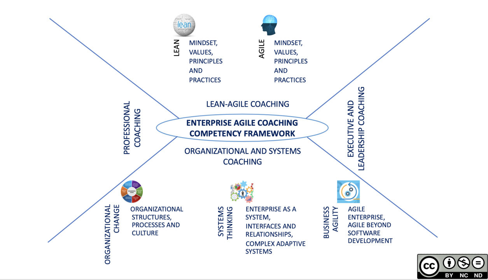

###### [Home](https://github.com/RyKaj/Documentation/blob/master/README.md) | [Agile](https://github.com/RyKaj/Documentation/tree/master/Agile/README.md) |
------------

Agile : Coaching 
================

Implementing agile can help streamline processes, but it  [isn't easy to make significant changes](https://www.cio.com/article/3245504/leadership-management/8-ways-youre-failing-at-change-management.html) in
an organization. Encouraging everyone to get on board with a new
methodology requires significant effort on the part of management.

"Having a coach in place to give guidance can help a team navigate
through the rough patches in the early period when the team or
management questions the value of agile," says Minh Le, managing
director of TINYpulse, where they hired an agile trainer to work with
individual teams.

An agile coach will keep businesses on task while they embark on
building internal agile development teams --- which can help save time,
money and resources. The coach serves as an objective party to help
navigate common roadblocks and pain points in the adoption process.
Before they leave, the goal is to have a fully functioning agile team
that is energized and ready to embrace the methodology.

The role of agile coach can be temporary or permanent, depending on the
organization's needs. Larger businesses, with multiple agile teams might
want to keep an agile coach on staff to help oversee the methodology
long term, but the position is typically temporary or contracted. For
most businesses, especially midsize and small organizations, it's more
useful to hire an agile coach on a contract basis to help get an agile
team up and running, later parting ways once everyone has adjusted.

Agile coaches aren't just responsible for organizing an agile team; they
also help the company embrace agile as a culture shift. To properly
implement the methodology, an agile coach needs to encourage buy-in from
employees and key stakeholders.

Coach Responsibilities
======================

Agile coaches pull from their own background in  [project management](https://www.cio.com/article/3243005/project-management/project-management-tips-strategies-best-practices.html),
IT and other related fields to understand what will work for the
business. Since some employees might be unfamiliar with agile, it's
important to focus on the fundamentals and to make the agile framework
accessible to everyone.

"Part of \[the job\] is leveraging our experience and teaching the
basics to bring people up to speed with an agile way of working," says
Fabiano Morais, a delivery coach at Envato.

As an agile coach, you'll need to have strong communication and
interpersonal skills, since you'll be working closely with employees
across the entire company, including leadership. Chances are, you'll
find it difficult to convert some workers to the agile methodology. In
these instances, you'll need to know how to navigate the corporate
culture to help the organization realize its goals.

"A good coach knows how to work with the team and the leadership to
change the environment. Managers and management is often quietly
resistant to agile because it fundamentally challenges their power and
control. The coach works with the leadership to see the future and be
patient along the journey. The coach also works with the team to help
them transform to being self-managing and accountable. These are big
changes," says Zuker.

According to PayScale, the most common responsibilities for an agile
coach include:

-   Coach agile teams in the methodology
-   Integrate related methodologies within the company
-   Develop standards and requirements for the agile process
-   Provide training to employees on the agile process
-   Help teams navigate agile tools and software
-   Encourage employee and stakeholder buy-in

The most important skills for an agile coach include:

-   Strong understanding of  [Scrum and Kanban](https://www.cio.com/article/3175445/project-management/comparing-agile-project-management-frameworks.html)
-   Experience as a  [Scrum Master](https://www.cio.com/article/3223139/project-management/what-is-a-scrum-master-a-key-role-for-project-success.html) or
    with the agile methodology
-   Knowledge of agile software development
-   Strong communication and problem-solving skills
-   Interpersonal skills and patience

Improve Agile Processes in Your Project Team
--------------------------------------------

If you run into any problems related to Agile in your team, an Agile
coach is one of the best people to consult with. Maybe you feel that
daily standups are not providing real value or maybe the team finds it
hard to understand why they should use story points for estimation. An
Agile coach has seen many situations throughout their career and should
be able to guide you in the right direction. Ask them to do a workshop
or a lecture on a particular Agile topic that is relevant to you.

Even if you don't feel like you have any major problems in your Agile
process, it might be a good idea to invite the Agile coach to sit in on
your main ceremonies and do a soft audit. They might provide valuable
feedback on what could be improved or even unearth some problems that
you were unaware of.

Removing Dependencies
---------------------

Being Agile often requires removing or mitigating external dependencies.
However, sometimes, those dependencies stem from other teams and there
is not a lot a PM can do about them. Since an Agile coach has a
higher-level view of Agility in the whole organization, they should be
the person to contact in order to help to initiate the resolution of the
dependencies.

Types Of Agile Coaches
======================

There are many different role names that are in use, which can sometimes
be confusing. Agile coaches are sometimes called: Agile facilitators,
Scrum masters, Scrum coaches, iteration managers, Kanban coaches, or
enterprise Agile coaches. The easiest way to think about Agile coaching
is through the lens of who is being coached by whom. The Agile Coaching
Institute offers  [three certification levels for Agile coaching](http://agilecoachinginstitute.com/coaching-courses-industry-certifications/), which align with three most common scenarios.

Team Coach
----------

The focus of an Agile team facilitator is on a single team.  [Scrum master](https://www.toptal.com/project-managers/scrum-master), 
[Scrum coach](https://www.toptal.com/project-managers/scrum-coach),
iteration manager,  [Kanban coach](https://www.toptal.com/project-managers/kanban)---all
of these perhaps more common titles fall into this category. The goal of
the  [Agile team facilitator](https://www.toptal.com/project-managers/agile-team-lead) (whatever their official title may be) is to help the single team transition to
Agile and ultimately increase the team's productivity.

The Agile team facilitator might need to have the technical proficiency
to be an effective coach, more so than the other two coach types
discussed below. Since the coach will be constantly working with the
team, the discussion will inevitably become very detailed. Being able to
participate in such discussions is key for a coach to be able to
understand and influence the team dynamics. For example, the team might
have the React vs. Angular debate. In theory, you don't need to know
what these are to facilitate a meeting about them, yet in reality, the
facilitation will be much more effective and the participants will trust
the coach more if the coach can show at least a high-level understanding
of the subject matter.

This is why you typically see Scrum masters, the most popular form of
Agile team facilitators, being developers who code but also spend some
time on maintaining and improving the Agile process within the team.

Ultimately, the role of an Agile team facilitator is to make sure that
Agile works within the team. Their job is not to only introduce daily
standups or retrospectives but to also make sure that these ceremonies
deliver value to the team. While Agile previously appeared in many
companies via a bottom-up approach, we are now witnessing more Agile
implementations being introduced via a top-down approach. In such a
setting, where team member motivations to change might be mixed, it is
very important that an Agile team facilitator is able to explain the
value of Agile to the whole team.

Agile Coach
-----------

Most Agile coaches have some prior experience as an Agile team
facilitator as it is a natural stepping stone in the process of becoming
an Agile coach. An Agile coach is concerned with spreading Agile at a
multi-team level and throughout the organization. While sometimes an
Agile coach might engage with teams on an individual basis, more often
they will work with Agile team facilitators and other internal
ambassadors of Agile to identify and remove any obstacles hindering the
implementation of Agile.

Typical undertakings of an Agile coach are:

-   Integrating Agile teams or departments within the wider processes of
    a predominantly non-Agile company.
-   Encouraging the proliferation of Agile best practices between
    different teams.
-   Mentoring and coaching of Agile team facilitators.
-   Overcoming resistance from top management due to a perceived
    reduction of control.
-   Measuring the results of transitioning to Agile.

Enterprise Agile Coach
----------------------

As described by the name, enterprise Agile coaches work at an enterprise
level. While the underlying skills of coaching are similar to that of an
Agile coach, an  [enterprise Agile coach](https://www.toptal.com/project-managers/enterprise-coaching) has
to possess knowledge of organizational design, enterprise change
management, and executive leadership coaching. At the same time, they
also should have a good grasp of at least some enterprise Agile
frameworks like Scaled Agile Framework (SAFe), Large-scale Scrum (LeSS)
or Disciplined Agile Delivery (DaD).

An enterprise Agile coach is less involved in the day to day tasks of
helping teams to implement Agile and is more concerned with helping to
change the overall structure of the company to facilitate the Agile
principles. This task requires working with the senior leadership and
helping them understand the benefits of Agile as well as the structure
needed to make it sustainable within the organization.

Coach the Coach
---------------

### Enterprise Coaching Framework

Enterprise Agile Coaching is quite a misused term in today's coaching
world. In absence of consistent guidelines regarding how Agile Coaches
can grow into Enterprise Agile Coaches by adding the right skills and
knowledge from new domains to their existing skills and knowledge, most
of the Agile Coaches just start believing and calling themselves as
Enterprise Agile Coaches after some years of experience as Agile
Coaches. This limits the potential of agile coaches as well as the
Enterprise to achieve what they can with the right knowledge and skills.

**Enterprise Agile Coaching Competency Framework **provides guidance to
Agile Coaches, Agile Leaders and the Enterprise as a whole, regarding
the competencies needed to successfully lead and coach Agile
Transformation in the Enterprise.

This paper provides the first version of Enterprise Agile Coaching
Competency Framework, which will be evolving with feedback from the
community using it and upcoming developments in the discipline of
Enterprise Agile Coaching.

Overview of the Framework 
-------------------------

The Framework consists of 4 quadrants -- each quadrant representing a
competency in Coaching respectively:

1.  Lean-Agile Coaching
2.  Professional Coaching
3.  Organizational and Systems Coaching
4.  Executive and Leadership Coaching

An Enterprise Agile Coach has, ideally, knowledge of all these areas,
while might not be an expert in all the areas and works with other
Enterprise Agile Coaches with expertise in different areas to lead and
coach the Agile Transformation.

Some of the Coaching competencies involve Knowledge Areas -- like Lean
and Agile for Lean-Agile Coaching and Organizational Change, Systems
Thinking and Business Agility for Organizational and Systems Coaching.
The Enterprise Agile Coaches must be knowledgeable about these areas and
should have relevant experience to develop an expertise in the
respective Coaching competency.

Overview of each Coaching Competency
------------------------------------

### Lean-Agile Coaching

Lean-Agile Coaching is core to the discipline of Enterprise Agile
Coaching. It is based on the knowledge of Lean and Agile Mindset,
Values, Principles and Practices. Lean-Agile Coaches not only has the
knowledge of Lean and Agile practices but also live and demonstrate Lean
and Agile Values in everything they do. After being a role model for
Lean and Agile, they become the catalyst for instigating Lean and Agile
Mindset, Values and Principles along with the practices in the
Enterprise.

#### Lean

Understanding of Lean Philosophy becomes even more important when we
talk about Enterprise. Learnings from The Toyota Way by Jeffrey Liker,
Toyota Kata by Mike Rother and Taiichi Ohno's Workplace Management help
to understand the Lean Philosophy which is beyond Lean Manufacturing.
Lean is an important Knowledge Area for Enterprise Agile Coaching
discipline because of its applicability not only to the teams but also
to the Enterprise. Lean concepts including dealing with wastes, limiting
Work-In-Progress and leading the organization to Kaizen Culture, etc.
are helpful in making a strategy for Agile Transformation. Lean Product
Development Flow as advocated by Don Reinertson and Kanban Method by
David Anderson is the adaptation of Lean as applied to Product
Development in today's innovative world. Enterprise Agile Coaching
benefits a lot from these as well.

#### Agile

Agile as driven by its Manifesto, Values, and Principles ( [1.0 Agile
Standards and Process](1.0-Agile-Standards-and-Process_451821467.html)
section Methodology \> Agile Methodology) applies as much to the
Enterprise as to the teams. Knowledge of Agile Frameworks and Practices
for small, medium and large enterprises and their applicability based on
Agile Values and Principles guides the Enterprise Agile Coaches to
assess the current state of the Enterprise and the future steps for the
Agile Transformation.

### Professional Coaching 

Professional Coaching is another core competency for Enterprise Agile
Coaching. Enterprise Agile Coaches work with complete organizations.
However, they still need to coach individuals who form these
organizations. The Enterprise Agile Coaches create a Coach-Coachee
partnership with people who are part of the Agile Transformation and
other stakeholders. Professional Coaching is a discipline and a
profession in itself with its own professional code of ethics and
standards ( <https://coachfederation.org/>)

### Organizational and Systems Coaching

Organizational Coaching is a competency which aims at cultivating
systemic transformation within organizations. Organizational Coaching is
the driver for organizational and hence, cultural change in the
Enterprise. Since, the Enterprise or an organization is a System in its
own, Systems Coaching goes hand in hand with Organizational Coaching.
Systems Coaching focuses on working with coachee's relationship with
different systems with the purpose of illuminating and releasing the
entanglements in the system. Organizational and Systems Coaching works
on the interfaces and the relationships within the Organizational
Systems and everyone and everything surrounding it.

#### Organizational Change

Organizational Change is an important knowledge area for Organizational
and Systems Coaches. Great work pioneered by John Kotter in the field of
Organizational Change like "Leading Change" and "Accelerate" provides
guidance to Enterprise Agile Coaching discipline in leading and coaching
Agile Transformation. Organizational Change is not limited to change in
process, technology or business but also includes a change in culture,
leadership, and relationship between people at different levels in the
Organization. Effectively, it's not the organizations which transform
but the underlying people who run these organizations. Hence, it's
important for Organizational and Systems Coaches to look at it from both
perspectives -- transforming organizations and transforming individuals.

#### Systems Thinking

An Enterprise is a System. Hence, it's important to understand the
System Dynamics for everyone involved in an Agile Transformation of the
Enterprise. Remarkable work like "Thinking in Systems" by Donella
Meadows, The Fifth Discipline by Peter Senge and others, provide the
Organizational and Systems Coaches with the understanding of how
organizational and human systems work. It's important for them to look
at every engagement from a System's perspective. Not only this, they
bring the awareness of the System to the coachee as well so that the
coachee understands his/her interfaces and relationships within and
outside the system. Understanding the Leverage Points in a System helps
the Organizational and Systems Coaches to use these for the benefit of
the Enterprise during an Agile Transformation.

#### Business Agility

Business agility is the ability of an organization to adapt quickly to
market changes - internally and externally, respond rapidly and flexibly
to customer demands, adapt and lead change in a productive and
cost-effective way without compromising quality. To become an agile
Enterprise, agility is not only limited to technology but also needed
for other functions in the Enterprise like Finance, Procurement, HR,
Sales, Operations, Marketing, etc. As a part of developing
Organizational and Systems Coaching competency, Enterprise Agile Coaches
should have the knowledge and relevant experience of applying agility to
these functions to ensure agility for the Enterprise and not only for a
silo or two. They also need to ensure and communicate to the relevant
stakeholders, how these functions, when not agile, can be huge
impediments in the way of Agile Transformation.

### Executive and Leadership Coaching

Executive and Leadership Coaching is one of the important competencies
for Enterprise Agile Coaches and are the most established experts in the
corporate world. Both the expertise, though separate, have a lot in
common. Agile Transformation can only be successful with support from
the Leadership and the Executives in the Enterprise. The Executive and
Leadership Coaches help Executives with organizational and management
concerns. Hence, they also need to have a strong experience as an
Executive themselves or a prior business experience of their own,
including a good understanding of the politics at the workplace.
Enterprise Agile Coaches with Executive and Leadership Coaching
competency help the Executives to transform to Servant Leaders which is
the next level move in an Agile Transformation. Coaching can be
delivered as one-on-one coaching or in the form of seminars and
workshops for specific chosen Executives.

#### Using of the Framework

The framework can be used as a tool for self-assessment for Agile
Coaches and Enterprise Agile Coaches to determine the level of
competency and knowledge areas they have currently and planning for the
next level that they want to achieve. This will provide them guidance to
determine the competencies and knowledge areas, they want for their
career development.

#### Conclusion

The Enterprise Agile Coaching Competency Framework gives a broad
overview of the competencies and the corresponding knowledge areas for
Enterprise Agile Coaching discipline. For more details regarding every
competency and knowledge areas, please refer the sources mentioned in
the reference.

##### Training

-   [Coach Federation](https://coachfederation.org/)
-   [CRR Globa](https://www.crrglobal.com/orsc.html)
-   [Institute of Coaching - Introduction leadership and executive coaching](https://instituteofcoaching.org/resources/introduction-leadership-and-executive-coaching)
-   [Institute of Coaching - Introduction organizational coaching](https://instituteofcoaching.org/resources/introduction-organizational-coaching)

###### References

-   [Methods and tools - Agile Coaching Tips](http://www.methodsandtools.com/archive/archive.php?id=96)
-   [CIO - agile coach role defined](https://www.cio.com/article/3294700/agile-coach-role-defined.html)
-   [Toptal - What is an agile coach](https://www.toptal.com/project-managers/agile/what-is-an-agile-coach)
-   [LinkedIn - Enterprise agile coaching competency framework By Amit Singh](https://www.linkedin.com/pulse/enterprise-agile-coaching-competency-framework-amit-singh/)

