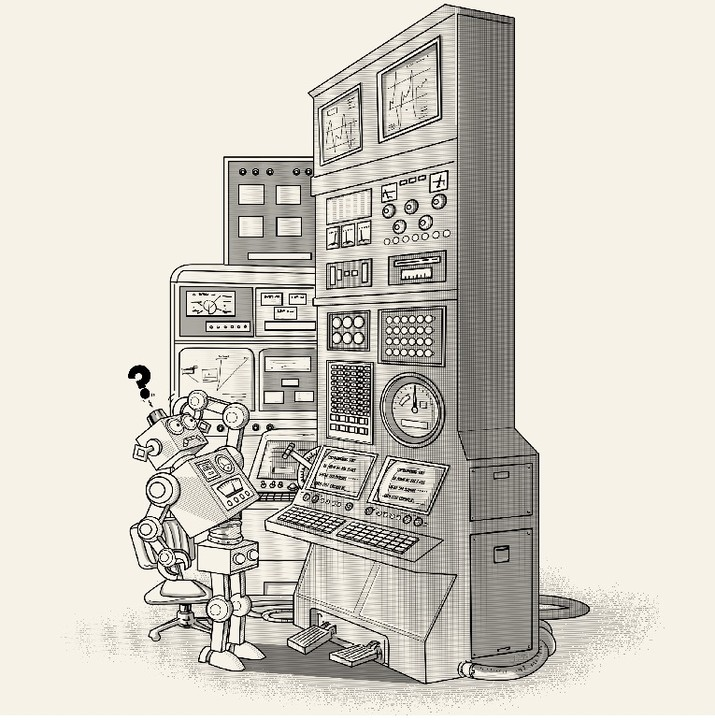
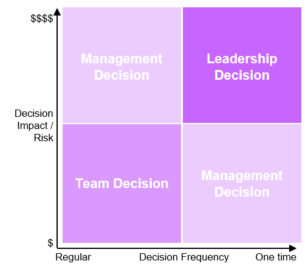
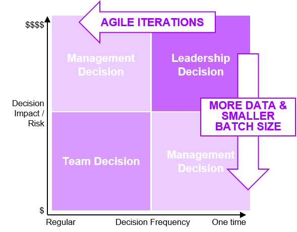

###### [Home](https://github.com/RyKaj/Documentation/blob/master/README.md) | [Agile](https://github.com/RyKaj/Documentation/tree/master/Agile/README.md) |
------------

Agile : Enterprises Decision 
============================

In traditional enterprises, it takes time for someone to make a decision. A request from the team-level is carried up to the management level. There important information is missing and misery takes its course. Companies cannot always afford to make a decision with high quality information which involves all the stakeholders. The market is changing too fast, companies can not wait anymore.

Agile Enterprises are empowering people and teams. This empowerment is based on the idea that decisions should be made by the people nearest to the information required for the decision. By transforming an organization into an Agile Enterprise, managers have to manage their teams so that they can make their own decisions to speed up the enterprise. But this has side effects. Company processes and policies have to be fundamentally changed. Changing policies can have legal implications (who has the authority to sign for what) and can have a security impact (the use of a new tool, a framework or uploading some data into the cloud).

The Agile Decision Dilemma: let the teams decide but be responsible for the outcome
-------------------------------------------------------------------------------------

In enterprises a decision has two main components: the impact and the
frequency

-   The impact of a decision can be measured in dollars. Part of the impact is obvious, and part is a risk, which has to be added on top     as a risk factor. 
-   The frequency is how often we have to make 'more or less' the same decision. This can be renting a car for travel to another location     or implementing a new feature in a product.

Inspired by the Eisenhower Box, the decision matrix is agnostic to the kind of decision itself. The matrix works for IT, product, or company designs.

Teams should decide on questions which are common and have low impact. Management or higher ranked experts should decide on common tasks with a high impact and on one-time tasks with a low impact. The leadership is responsible for one-time decisions with a high impact.

Taking the example of decisions in product management shows the impact of data analytics
----------------------------------------------------------------------------------------

By shifting to an Agile Enterprise, companies are getting more data from their customers. That's because an Agile Enterprise is focusing on the needs of their customers, they are customer centric. The agile teams are testing new features permanently by running experiments. Customer data is not new, it was always there but two things have changed: the quality of the data and the readiness of the leadership to use that data. 

In a decision process, data is pushed more and more into the foreground. It's the new player on the field, and it's responsible for the most spectacular field goals. Is a decision backed up by hard data or do I make the decision intuitively?

Decisions on all levels are driven by data analytics and agile pilots. Before the launch of a larger program, a pilot is started to gather the initial data. With the information from the pilot, a large program gets adjusted before the start. That reduces the risk and breaks a large program into iterations.

To accelerate enterprises, a data-driven product culture needs to be established from the teams to the leadership. On that basis, the decision matrix is leveraged. Fewer decisions will be taken on the leadership level and the management level, because of three agile components:

-   Customer experiments
-   Delivering in small batches
-   Delivering in iterations

There are fewer decisions at the leadership and management level. Tasks are broken down into smaller batches, delivered in short iterations and data is used for risk reduction.

Prototypes help to break down decisions into small iterations, to collect first hand data and quickly turn around learnings. Collected data from real customers beats all high paid experts and calculations in a spreadsheet and helps the company to be first in the market.

To enable teams to create inspiring products, companies have to change the decision management process. Accelerations can only be achieved if more decisions are made on a team level. Running experiments and practicing a data-driven product culture are the main enablers. This shows the importance of analytic skills in Agile Enterprises. 

###### References

-   [Linkedin Florian Hoeppner - Making Decisions Agile Enterprise](https://www.linkedin.com/pulse/making-decisions-agile-enterprise-florian-hoeppner/)

