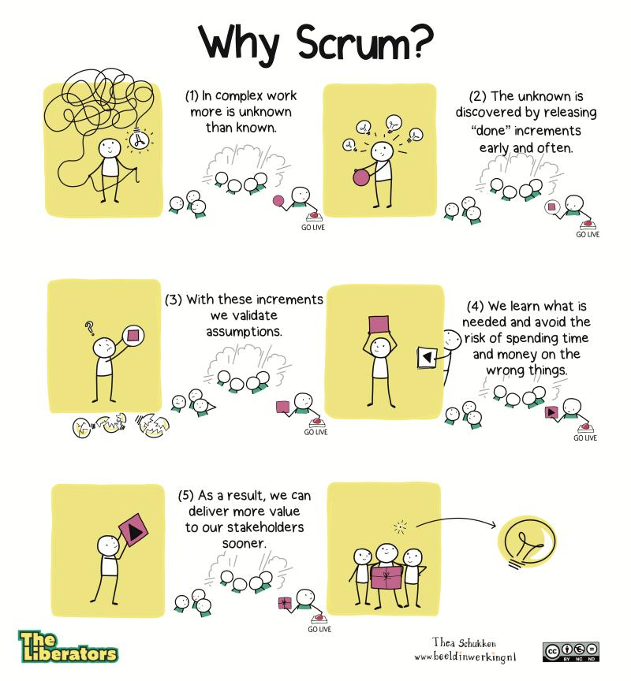

###### [Home](https://github.com/RyKaj/Documentation/blob/master/README.md) | [Agile](https://github.com/RyKaj/Documentation/tree/master/Agile/README.md) |
------------

Agile : Frameworks 
==================

Frameworks
==========

<kbd>
<kbd>

Scrum
-----

<kbd>
[T]{style="color: rgb(0,128,0);"}eams commit to ship working software
through set intervals called sprints. Their goal is to create learning
loops to quickly gather and integrate customer feedback. Scrum teams
adopt specific roles, create special artifacts, and hold regular
ceremonies to keep things moving forward. Scrum is best defined in
[The Scrum Guide](https://www.scrumguides.org/scrum-guide.html).

Scrum is a framework that helps teams work together. Which enables
people to address complex adaptive problem. It aims to productively and
creatively deliver products of the highest possible value through
iterations and increments in a time-box setting.

Much like a rugby team (where it gets its name) training for the big
game, Scrum encourages teams to learn through experiences, self-organize
while working on a problem, and reflect on their wins and losses to
continuously improve.

Scrum is a subset of Agile and one of the most popular process
frameworks for implementing Agile. It is an iterative software
development model used to manage complex software and product
development. Fixed-length iterations, called sprints lasting one to two
weeks long, allow the team to ship software on a regular ### Cadence. At the
end of each sprint, stakeholders and team members meet to plan next
steps. 

Scrum follows a set of roles, responsibilities, and meetings that never
change. For example, Scrum calls for four ceremonies that provide
structure to each sprint: sprint planning, daily stand-up, sprint demo,
and sprint retrospective. During each sprint, the team will use visual
artifacts like task boards or burndown charts to show progress and
receive incremental feedback.

Jeff Sutherland created the Scrum process in 1993, taking the term
"Scrum" from an analogy in a 1986 study by Takeuchi and Nonaka published
in the Harvard Business Review. In the study, Takeuchi and Nonaka
compare high-performing, cross-functional teams to the Scrum formation
used by Rugby teams. The original context for this was manufacturing,
but Sutherland, along with John Scumniotales and Jeff McKenna, adapted
the model for software development.

<kbd>

The mind map diagram below outlines some of the main concepts of Scrum

<kbd>
### Scrum Values

Scrum is a simple yet incredibly powerful set of principles and
practices that help teams deliver products in short cycle, enabling fast
feedback, continual improvement, and rapid adaption to change.

<kbd>

### Scrum Principles

Scrum is a prescriptive, incremental and iterative framework for
developing software that applies Agile principles. The Scrum values and
principles are outlined in the charts below and have significant
alignment with Lean and Agile values and principles

<kbd>

### Cadence

Scrum moves fast, with sprints of two to at most four weeks with clear
start and finish dates. The short time frame forces complex tasks to be
split into smaller stories, and helps your team learn quickly. A key
question is this: Can your team ship useable code that fast?

Sprints are punctuated by the sprint planning, sprint review,
and retrospectivemeetings and peppered with daily scrum(standup)
meetings. These scrum ceremonies are lightweight and run on a continuous
basis.

<kbd>
<kbd>

### Product backlog

The Product Owner and Scrum Team meet to prioritize the items on the
product backlog (the work on the product backlog comes from user stories
and requirements). The product backlog is not a list of things to be
completed, but rather it is a list of all the desired features for the
product. The development team then pulls work from the product backlog
to complete during each sprint.

### Sprint planning

Before each sprint, the Scrum Master facilitates a meeting iwth the
scrum team and product owner, where the product owner identifies the
objectives of tehupcoming sprint, and the team then plans their work
according to the objectives. Product Owner presents the top items on the
backlog to the team in a sprint planning meeting. The team then chooses
which work they can complete during the sprint and moves the work from
the product backlog to the sprint backlog (which is a list of tasks to
complete in the sprint).

### Backlog refinement/grooming

At the end of one sprint, the team and Product Owner meet to make sure
the backlog is ready for the next sprint. The team may remove user
stories that aren't relevant, create new stories, reassess the priority
of stories, or split user stories into smaller tasks. The purpose of
this "grooming" meeting is to ensure the backlog only contains items
that are relevant and detailed, and that meet the project's objectives.

### Daily Scrum meetings

The Daily Scrum is a 15-minute stand-up meeting where each team member
talks about their goals and any issues that have come up. The Daily
Scrum happens every day during the sprint and helps keep the team on
track. Three questions each scrum team member answers:

1.  What did you do yesterday
2.  What are you planning to do today
3.  Are there any impediments preventing you from completing your work

### Sprint review meeting

At the end of each sprint, the team presents the work they have
completed at a sprint review meeting. This meeting should feature a live
demonstration, not a report or a PowerPoint presentation.

### Sprint retrospective meeting

Also at the end of each sprint, the team reflects on how well Scrum is
working for them and talks about any changes that need to be made in the
next sprint. The team may talk about what went well during the sprint,
what went wrong, and what they could do differently.

### Scrum Roles

<kbd>
<kbd>
<kbd>

#### Scrum Master (close reference in Waterfall role Project Manager)

<kbd>

Often considered the coach for the team, the Scrum Master helps the team
do their best possible work. This means organizing meetings, dealing
with roadblocks and challenges, and working with the Product Owner to
ensure the product backlog is ready for the next sprint. The Scrum
Master also makes sure the team follows the Scrum process. He or she
doesn't have authority over the team members, but he or she does have
authority over the process. The scrum master help to keep the team
accountable to their commitments to the business and also remove any
roadblocks that might impede the team's productivity. They met with the
team on a regular basis to review work and deliverables, most often in a
weekly Cadence. The role of a scrum master is to coach and motivate team
member, not enforce rules to them.  The scrum master is the team role
responsible for ensuring the team lives agile values and principles and
follows the processes and practices that the team agreed they would use.

The responsibilities of this role include:

-   Clearing obstacles
-   Establishing an environment where the team can be effective
-   Addressing team dynamics
-   Ensuring a good relationship between the team and  [product owner](https://www.agilealliance.org/glossary/product-owner/) as
    well as others outside the team
-   Protecting the team from outside interruptions and distractions
-   To facilitate daily scrum, sprint planning, sprint demo, and
    retrospective meeting
-   Resolve conflicts by focusing on scrum values of openness, honesty,
    and respect
-   Forecast the number of deliverable possible in an iteration based on
    evidence
-   Estimate and plan for the whole software development project
-   Coach the team in agile practices; emphasize on individuals &
    interactions over process & tools
-   Help the team members in clarifying goals and actions to achieve the
    goals
-   Shield the team from any distractions and interference
-   Ensure the correct application of the scrum process
-   Scrum Master serves his team rather than direct the team

The scrum master role was created as part of the Scrum framework.  The name was initially intended to indicate someone who is an expert at [Scrum](https://www.agilealliance.org/glossary/scrum/) and can therefore coach others.

The role does not generally have any actual authority. People filling
this role have to lead from a position of influence, often taking a
servant-leadership stance.

Scrum master is typically the term used to refer to this role, even by
teams not explicitly following Scrum.  Other terms used infrequently
include iteration manager, agile coach, or team coach.

#### Product Owner ( closes reference in Waterfall role Business Analysis)

As the product owner, you should directly interact with the customers
and users, the development team, and other key stakeholders, as the
picture below shows.

<kbd>

The Product Owner has the vision of what he or she wants to build and
conveys that vision to the team. The Product Owner focuses on business
and market requirements, prioritizing all the work that needs to be
done. He or she builds and manages the backlog, provides guidance on
which features to ship next, and interacts with the team and other
stakeholders to make sure everyone understands the items in the product
backlog. The Product Owner is not a project manager. Instead of managing
the status and progress, his or her job is to motivate the team with a
goal and vision. The Product Owner is the Team member who knows what the
customer wants and the relative business value of those wants. He or she
can then translate the customer's wants and values back to the Scrum
team. The Product Owner must know the business case for the product and
what features the customers' wants. He must be available to consult with
the team to make sure they are correctly implementing the product
vision.

The product owner is a role on a product development team responsible
for managing the product backlog in order to achieve the desired outcome
that a product development team seeks to accomplish.  Key activities to
accomplish this include:

-   Clearly identify and describe product backlog items in order to
    build a shared understanding of the problem and solution with the
    product development team
-   Make decisions regarding the priority of product backlog items in
    order to deliver maximum outcome with minimum output
-   Determine whether a product backlog item was satisfactorily
    delivered
-   Ensure transparency into the upcoming work of the product
    development team.

The product owner role was created as part of the Scrum framework in
order to address challenges that product development teams had with
multiple, conflicting direction, or no direction at all with respect to
what to build.

Many infer that a product owner is someone who can spend a considerable
amount of time with the product development team providing clarification
on product backlog items, and making decisions about which product
backlog items to do and regarding the specifics of those particular
product backlog items.

The Product Backlog is dynamic and constantly evolves in \"an ongoing
process in which the Product Owner and the Development Team collaborate
on the details of Product Backlog items\". This means that the Product
Owner and Development team can prioritize the backlog, should have the
oversight of Product Owner to ensure the team does not veer to far off
course.

#### Scrum Teams

<kbd>
<kbd>

The Scrum Team is comprised of five to seven members. Everyone on the
project works together, helps each other, and shares a deep sense of
camaraderie. Unlike traditional development teams, there are not
distinct roles like programmer, designer, or tester. Everyone completes
the set of work together. The Scrum Team owns the plan for each sprint;
they anticipate how much work they can complete in each iteration.

The Development Team consists of professionals who do the work of
delivering a potentially releasable Increment of \"Done\" product at the
end of each Sprint. A \"Done\" increment is required at the Sprint
Review. Only members of the Development Team create the Increment.

Development Teams are structured and empowered by the organization to
organize and manage their own work. The resulting synergy optimizes the
Development Team's overall efficiency and effectiveness.

Development Teams have the following characteristics:

-   They are self-organizing. No one (not even the Scrum Master) tells
    the Development Team how to turn Product Backlog into Increments of
    potentially releasable functionality;
-   Development Teams are cross-functional, with all the skills as a
    team necessary to create a product Increment;
-   Scrum recognizes no titles for Development Team members, regardless
    of the work being performed by the person;
-   Scrum recognizes no sub-teams in the Development Team, regardless of
    domains that need to be addressed like testing, architecture,
    operations, or business analysis; and,
-   Individual Development Team members may have specialized skills and
    areas of focus, but accountability belongs to the Development Team
    as a whole.

### Self-Organizing

Choose how to best accomplish their work, rather than being directed by
others outside the team

To building a self-organizing team, the organization should ensure that
it provides the necessary infrastructure, training, and incentive system
to keep employees motivated at work. Creating a self-organizing team can
be considered a three-step process

<kbd>

### Training

Proper training can help satisfy many of the principles that
self-organizing teams require. Specifically, hard skills training can
ensure competency and provide the necessary framework to conduct tests
that lead to regular improvements. Meanwhile, soft skills training can
help lay the groundwork for high levels of communication, collaboration,
commitment, and confidence.

### Coaching

Before becoming a true self-organizing team, groups need coaching. They
may require more support and guidance at the beginning. These are the
indicators of your team getting more and more mature such as: Scrum
ceremonies are productive, the team enjoys the work and members help
each other, new ideas are forthcoming, and teams are pulling work for
themselves. Finally, the role of the coach should diminish over time as
team members learn how to take ownership and begin to collaborate with
and trust one another in a self-organizing way.

### Mentoring

Once a team starts self-organizing, the journey has only just begun.
Assign mentors who can help the team go to the next level, so that the
growth of the team will to be sustain in longer run. For example, job
rotations can be an important aspect of keeping employees involved and
of encouraging continuous learning, as this kind of mentoring could help
with continuity by ensuring everyone grows together and remains
motivated.

### Cross-Functional

Have all competencies needed to accomplish the work without depending on
others not part of the team. The team model in Scrum is designed to
optimize flexibility, creativity, and productivity.

Traditionally, a project is organized around component teams (i.e. UX,
Dev, Business, Tester, and ...), any release that requires a range of
component expertise will need to involve multiple component teams.
Typically, different teams will have different sets of priorities, which
inevitably leads to bottlenecks in the product release cycle.

According to Wikipedia, a cross-functional team is a group of people
with different functional expertise working toward a common goal. One of
the best ways to improve the quality of your team is to make it cross
functional.  A cross functional team has all the necessary skills to
turn an idea into a working product.

The [Scrum](https://www.visual-paradigm.com/scrum/scrum-in-3-minutes/) Guide indicates "The  [Scrum Team](https://www.visual-paradigm.com/scrum/what-is-scrum-team/) consists of a  [Product Owner](https://www.visual-paradigm.com/scrum/what-is-project-owner-role-in-scrum/), the Development Team, and a  [Scrum Master](https://www.visual-paradigm.com/scrum/what-is-scrum-master/). Scrum Teams are self-organizing and cross-functional. In contrast to the component team approach, a cross functional teams are groups consisting of people from different functional areas of the company. -- it should be formed not only with technical specialists (Back-end, Front-end developers, QA engineers, etc.), but also consists of member like Business Analysts, Marketing and UX specialists or anyone else taking an active part in the project.

<kbd>

Cross functional teams are one of the key ingredients that help make
scrum teams successful and productive.  Cross functional teams have more
flexibility, can react faster to changing needs, and can better handle
ongoing support and maintenance.

According to Mike Cohn, "Perhaps the most prevalent and persistent myth
in  [agile](https://www.visual-paradigm.com/scrum/what-is-agile-software-development/) is
that a cross-functional team is one on which each person possesses every
skill necessary to complete the work. This is simply not true ... A
cross-functional team has members with a variety of skills, but that
does not mean each member has all of the skills"

In reality, Agile cross functional teams not only means that the team
itself is cross functional, but also that each team members can
preferably play multiple [roles](https://www.visual-paradigm.com/scrum/what-are-the-three-scrum-roles/) as
well.  Being a specialist does not mean a member know one thing at the
expense of knowing other things, ideally, the talent profile should be T
shaped, in that he / she have depth in one area of expertise, and
breadth across other areas.

<kbd>

Dandys Agile Infographic
========================

Enabling Business Agility in a Nutshell -- Free Infographic Poster

How to create human and flexible organizations for more value
-------------------------------------------------------------

In this poster we cover the combination of the people perspective and
the business perspective and how new perspectives and ways of working
can enable business agility. Only once these two perspectives are in
sync we can truly empower people and build learning organizations that
not just handle complexity better -- but even uses it as a business
advantage.

To create this poster I have worked with two of the front runners within
both of the areas (together with Managers) that most of all have to
change to enable Business Agility, [Bjarte Bogsnes](https://www.linkedin.com/in/bjarte-bogsnes-41557910/) within
Finance and [Pia-Maria Thorén](https://www.linkedin.com/in/piamia/) within HR.

Here you can download the[Enabling Business Agility Poster](http://bit.ly/2TkHwyS)

[<kbd>](http://bit.ly/2TkHwyS)

Pia-Maria Thorén - Inspiration Director at Agile People and Bjarte
Bogsnes - Chairman Beyond Budgeting Roundtable.  [Björn Sandberg](https://www.linkedin.com/in/btjsandberg/) has
also contributed with his elegant model for learning organizations.

**TRAINING:** Don´t miss learning all about how to do this at the 
[awesome training "Enabling Business Agility"](https://dandypeople.com/training/enabling-business-agility-through-finance-and-hr-1-day-training/) with
Pia-Maria and Bjarte Bogsnes at Dandy People in Stockholm!

Beyond Budgeting Principles
---------------------------

<kbd>

Separating Business processes to enable Business Agility
--------------------------------------------------------

Separate conflicting purposes into different processes and then improve each one <kbd>

People Perspective -- Theory X and Y 
------------------------------------

<kbd>

If we have an X view on people we believe they are lazy and don't want
to do a good job. They need to be managed and controlled to do their
work and have very little creativity. This is reflecting how traditional
management processes are set up.

If we have an Y view on people we believe that under the right
conditions people like to work and that they are creative. People are
motivated when they take ownership and set their own goals. This is a
modern management view for the knowledge era of today.

# Agile Coaching in a Nutshell

The content of the Agile Coaching in a Nutshell poster
------------------------------------------------------

**The Agile Coaching Competency Framework\
**The framework that I find best describe the complexity of the role in
a great way is the  [Agile Coaching Competency Framework](http://agilecoachinginstitute.com/agile-coaching-resources/) by
Lyssa Adkins and Michale Spayd at agile Coaching Institute. I have
tweaked it a bit  to be able to use it on a broader perspective then
within software development. My hope is that it can be used by Agile Coaches across the
organization. The way they explain it is that every Agile Coach should
master at least one area within the 4 main areas.

**[<kbd>](https://media.dandypeople.com/2019/02/Ska%CC%88rmavbild-2019-02-03-kl.-17.58.09.png)**

**Choosing a Coaching Stance**\
This 9 grid is based on the orginal paper from 1985, Principles and
Dynamics of Matching Role to Situation. Douglas P. Champion, David H.
Kiel and Jean A. McLendon. This one has also been modified to better fit
our way of working today when our stances may vary all the way from
visionary Agile leaders to hands on experts.

[<kbd>](https://media.dandypeople.com/2019/02/Ska%CC%88rmavbild-2019-02-03-kl.-17.58.58.png)

**Levels of Agile Coaching**\
This is a description of how we work at different levels in the
organization. When we combine our efforts and also work as a team in
paralell -- thats when we can get great results moving forward changing
the culture. The most important for all organizations who wants to
become Agile is to get leadership across the organization onboard and to
support the Agile teams to become high performing by removing hinders
continiously, this is often the focus for Enterprise Agile Coaches. Also
enabling Business Agility by transforming functions such as finance and
HR to support Agility -- strategic process improvement and leading the
Agile Coaches group. Agile coaches on teamlevel work with building high
performing teams as well as supporting needs in between teams in
organizations with several teams. Team facilitators handle the
facilitation of the team ceremonies. This is also orinally a model from
Lyssa Adkins and Michael Spayd that we have altered too and added the
strategic level.

[<kbd>](https://media.dandypeople.com/2019/02/Ska%CC%88rmavbild-2019-02-03-kl.-18.00.24.png)

**The Agile Coaches Group**\
The group of Agile Coaches work individually in their roles within
different areas, but also together as a team with shared goals to take a
organizational and long term strategic responsibility for improvements.
The group is named differently in different frameworks, but the purpose
is always the same; to work strategic and operational with process
improvements and do coaching, training and mentoring.

[<kbd>](https://media.dandypeople.com/2019/02/Ska%CC%88rmavbild-2019-02-03-kl.-18.00.17.png)

**Areas of Agile Coaching**\
In Agile organisations a leader is responsible only in one area. Either
PEOPLE, PRODUCT, TECHNOLOGY or PROCESS. Agile coaches coach in the
process in all areas to improve value and flow continuously. This is
something we both often see as a subject of misunderstanding and fear to
many traditional leaders where they previously in their line manager
role might have had managing both strategy, people and technology. This
does not mean they will loose their job, or become less valuable, it
just means they can focus more, become better leaders who are less
stressed, enabling the organizational to be more innovative and people
friendly.

[<kbd>](https://media.dandypeople.com/2019/02/Ska%CC%88rmavbild-2019-02-03-kl.-17.59.29.png)

**Shu-Ha-Ri
**This is a classic way to visualize the different levels of Lean Agile
maturity on an individual level that I use a lot in my coaching. We
often work to get as many as possible up to HA-level, thats when we get
a strong foundation for an Agile Mindset in an organization. If too many
people stay on SHU-level and the Agile Coaches leave, thats when the
organization starts to fall back to previously behaviours and
structures.

-   **SHU -- Follow the rules** The student who is starting to learn and practices by the book.
-   ***HA -- Bending the rules***  The practitioner who reflect on Agile values and principles. Can choose when to use what for best result.

***RI -- Is the rule*** The master who adapts and invent emerging practices for new contexts and situations.

1.  [<kbd>](https://media.dandypeople.com/2019/02/Ska%CC%88rmavbild-2019-02-03-kl.-19.12.13.png)

**Some last coaching advice**

-   Listen to understand, not to answer
-   Be tough on the problem, but kind to the people
-   Support those who want support
-   Inspire to change, never use force

# Agile HR in a Nutshell

We've teamed up with the talented  *Riina Hallström* and  *Natal Dank* --co-founders of the  **Agile HR Community**  --  to create the first Agile HR in a Nutshell free infographic resource.

Here you can download the [Agile HR in a Nutshell poster](http://bit.ly/2Klxjgs)

[<kbd>](http://bit.ly/2Klxjgs)

Customer Journey Product Organization
The Over all Structure of the Customer Journey Product Organization
-------------------------------------------------------------------

We have captured the over all visualization of how the organization can
work hoping to give you a goal picture and a common understanding.

Here you can download [Customer Journey Product Organziation](http://bit.ly/2VyNFVA)

[<kbd>](http://bit.ly/2VyNFVA)

At Dandy People we support teams and organizations to become Agile to be
able to focus on the business strategies and to mobilize the brain power
in the teams to deliver value continuously. We call these value driven
Agile teams for " *Lean Teams*" since they own the process end 2 end to
deliver value, and that they also own the part of the service or product
end 2 end. These teams work hypothesis based and have clear missions for
6-12 months with clear KPIs that gives them mandate to decide what to do
when and enables them to have a ongoing learning process -- all which is
needed in a fast paced world if you desire to be the leading product or
service within your niche. Crucial for these teams are of course the
T-shape of the team members. The T-shape is something that enables the
team to work as a team and it creates a really strong teams without
dependencies to people within the team -- and it also prevents the team
to not do mini-waterfall in the team (just doing their part and handing
over to the next). You can read more about  [T-shape here and how to grow it as a leader](https://dandypeople.com/blog/t-shaped-employees-and-how-to-grow-it-as-an-agile-leader/).
**\
In this post you can download the poster for free and learn more
about:**

-   Lean Teams Connected to the Customer Journey with Missions
-   User research, Planning and Delivery across the Organization --
    connects as never before
-   Slicing for Value with User Story Mapping to create Alignment
-   The different type of teams
-   Cross-functional competences is needed in the Lean Team
-   Modern Agile and Continuous improvement of the System
-   Choosing what type of Organization you want to have Together
-   Avanza Leads the way with Lean Teams and Customer Journey
    Organization
-   Presentation on the Customer Journey Product Organization

Lean Teams Connected to the Customer Journey with Missions
----------------------------------------------------------

<kbd>
-------------------------------------------------------------------------------------------------------------------------------------------------------------------------------------------------------------------------------------

The Lean Teams  *(as in Lean UX and Lean Startup)* are connected to the
most important business strategies via the customer journey -- or they
take ownership of specific products. These teams will need support from
other teams, such as a platform team and support teams who's mission is
to support the needs from the Lean Teams and when needed enable self
service so the Lean Teams can work as independently as possible
delivering fast with high quality. This makes the organization and the
teams fast at delivering whats needed, when it´s needed without having
to have someone to tell them what to do when. "Lean" in Lean Team also
refers to Lean UX and Lean Startup, the team works with both discovery
AND delivery end to end to always learn what solutions are needed, with
a long term mission, they can stop delivering on one idea when they see
a change on connecting KPI´s and move on to the next thing that now is
the most important opportunity. This approach creates truly high
performing team with all skills needed, that can work really well
together in all different parts of the process as well as great product
ownership (as in the process).\
Many organizations will have to start to transform from a silos based
organization to cross functional Lean Teams -- and that journey must
start both top down and bottom up. If the leadership (management) don't
enable this and start changing the system surrounding the teams, the
people in the teams will not be able to do the changes needed.

User research, Planning and Delivery across the Organization -- connects as never before 
----------------------------------------------------------------------------------------

<kbd>

The Customer Journey Product Organization with Lean Teams is a way to
scale an organization to support customer focus, agile mindset and
principles -- increasing speed AND value to the max. This type of
organization done well, is always on it´s toes to understand and learn
about the users needs, experimenting and learning about new behaviors,
as well as taking car of existing customers. The Customer Journey
organization format is by default well connected with user research
methods such as Service Design, Customer Journey Mapping and Design
Thinking enabling the teams to align as well keeping the teams
autonomous. To plan the work needed to solve customer pain points found
in the user research (in the customer journey) the organization can
easily use  [User Story Mapping](https://dandypeople.com/blog/lean-kravstallning-av-kungliga-operans-planeringssystem/) to
plan all the work needed across the organization in a visual and
adaptive way to enable agile sliced deliveries based on customer
scenarios. This is the wet dream for any control freak -- so yes, you
too should get super exited. No more worries about if the organization
is working on the right things. This way of working will save the
organization so much work not having to do any project management, not
doing any reports on progress (because that is visual to everyone in the
organization on [storysonboard.com)](https://storiesonboard.com/) or
doing any estimates with story points (if the teams don´t want too).
Visualization like this gives focus and enables collaboration to solve
tricky customer problems in complex technical and restricted domains. If
you once have worked like this, I can promise you never wan´t to go back
to any other way of working. Here you can download the [ Agile User Experience poster](https://dandypeople.com/blog/agile-user-experience-with-a-dash-of-lean-ux-free-poster/) for
free for more on this topic.

Slicing for Value with User Story Mapping to create Alignment
-------------------------------------------------------------

The User Scenario is the core in the Customer Journey -- we tell the
story of the user. The Scenarios are the base for the planning. All
scenarios belong to a role or a persona. This helps to understand the
context, as well as to slice for value. The same scenarios are also used
as a base for testing.

The Backbone of the User Story Map goes across the timeline. Its the
high level process, usually it stays the same year after year, the only
thing that changes is the solution in how we serve our customers.

User Story Mapping is a method created by Jeff Patton. It can be
digitzed in [storiesonboard.com](http://storiesonboard.com) and
imported slice by slice to Trello or Jira if needed still keeping the
big picture intact.

When working like this it´s easy for the team to get an overview of what
they are delivering on as a team, but also across teams. Make sure to
involve the teams in creating the user story map too so that you can use
their brain power in actually solving the user problems and finding the
best solutions doing so, then everyone knows why they are doing what and
for who, and they can all help out to make smart tactical and
operational decisions.

<kbd>

The different type of teams 
---------------------------

<kbd>

-   **Customer Journey Teams** -- Delivers on Strategies connected to the customer journey, such as Increasing New Customers, LTV or Increased Usage.
-   **Product Teams** -- Delivers on Strategies connected to specific products & maintain the platform for long term high quality & speed.
-   **Platform Teams** -- Platform Teams delivers functionality in the platform to support needs from the Customer Journey -- & Product Teams.
-   **Support Teams** -- Support Teams acts to deliver self service for all other teams. Could also coach, train, mentor and support in alignment and strategic input.

Cross-functional competences is needed in the Lean Team 
-------------------------------------------------------

<kbd>

The competences needed in a Lean Team is based on what Mission the team
has. It will differ from team to team, and from organization to
organization. Compared with a traditional silos organization, this
organization is a matrix organization. It might not even be needed to do
a "re-organization" to shift to this organization. Of course you have to
change who you sit and work with, but you might could keep the same
manager. Managers who take care of the people are preferably put within
a "skill".

Since the team in "on a Mission" they need to be really great at team
work. Therefore roles and titles are usually removed from the team.
What´s is important is to solve the mission together, not who is doing
what. This creates the environment for really high performance teams.
The roles in a Lean Team (just as in a normal Scrum Team) is the Product
Owner, The Scrum Master (yes, you probably still will work in Scrum) and
then, all the rest is simply -- the team. The Scrum Master Role might
though be a rotating "hat", meaning the team might have several team
members that can act as Scrum Master and rotate as they like. Perhaps
these teams also might come up with new "hats" or in the future. Since
Lean UX and Design Thinking together with facilitation skills will be
highly important for these teams, that might also be a "hat" in the team
to be able to coach and facilitate these activities in the team.

The Managers job is first of all to take care of the needs of the people
and supporting the skill to learn from each other between the teams,
gain new knowledge and to remove obstacles for the teams to enable
mastery and high performance. The manager in a skill does not need to be
expert herself within that area of expertise but rather have a growth
mindset, helping people to grow and support them when they need support
outside the team. The manager does not have anything to do with WHY,
WHAT or HOW the teams do their product development work. Having managers
horizontally across teams makes it easier for team members to join new
teams, otherwise the employees need to change manager to move between
teams, and that usually makes the organization less flexible over time.
Also it makes the transformation from a traditional organization more
smooth.

The Manager too belong to a team, the Leadership Team, having stand-ups
and working to always improve the system in the organization. In the
long run though, the role of the Leadership Team can perhaps grow in to
a Agile coaching unit that coaches in between teams and supports in
removing impediments outside the team. But then there need to be support
teams to supporting the full needs of the teams, or the teams take on
those tasks as well. You should always view it as an emerging process,
start where you are at and work together to create a safe environment,
mobilize the brain power in the organization and improve as you go
along.

Support Teams
-------------

If the teams are in need of more support within a specific skill a
support team should be created. Such a support teams Mission is to
enable self service to the teams, to support in competence development
across all teams and to improve what´s going on "in-between-teams". An
example on such a team could be Design Ops.

**Example of a mission for a Design Ops Team**
*"We make it easy for all Teams to see the "big picture" for the
customer, to quickly create usable design on all platforms and to
support an aligned user experience across teams".*

**Example of ** **activities ** **for a Design ** **Ops Team**

-   Create and update design framework to align the user experience and
    make it easier for the teams
-   Visualize data and insights from all teams
-   Coach and train all teams and leaders in design activities and skill
    set if needed
-   Input and support for Strategic Company Bets or to teams when needed

Modern Agile and Continuous improvement of the System
-----------------------------------------------------

<kbd>

The values of Modern Agile works really well with this type of customer
focused organization and with the way of working in the Lean Teams. Lean
teams will not work without the 4 values in place.

Modern Agile together with the Lean Team concept also gives a freshness
to the view on Agile that can be needed in many organizations today who
might have been struggling with making the Scrum Teams on IT work
smoothly with the customer.

At Dandy People we created a visualization around Modern Agile to make
it easier for  Leaders to see how they can apply this in their daily
work to enable the values of Modern Agile. We call it the Modern Agile
Flower. It aims to show the big picture from a leadership perspective.

**What the organization need to focus on to enable Modern Agile is:**

-   Leadership
-   Way of Working
-   Organization
-   Competence Development
-   Improvement of Everything

Choosing what type of Organization you want to have Together
------------------------------------------------------------

About a year and half ago we had a couple of workshops together with
Avanza where we supported them in creating an understanding about the
different type of organizations you can have, how they work and how the
different ways to organize would affect their own deliveries. We had
about 35-40 people signing up and joining in doing experienced based
learnings and theory to enable them to make the decision together. They
visualized their customer journey and all their products together as a
basis for shared knowledge. One of the things we also did was to
facilitate a session where they came up with 7 guiding principles on how
they wanted their perfect organization to work. The day after we used
these guiding principles to evaluate how well their current organization
would perform in delivering 3 different type of common deliveries. The
different type of organizations evaluated was value stream based,
customer journey based and component team based organization -- as well
as their current silos based. All work was done in small cross
functional groups: We could see that all groups thought that their
current organization performed really bad on all principles as well on
all deliveries, and that customer journey based organization with Lean
Teams would be the best 🙂 Here you can rad about the  [specific workshop where they compared the different organizations](https://dandypeople.com/blog/transforming-to-a-people-and-innovation-friendly-organisation-using-agile/)

Avanza Leads the way with Lean Teams and Customer Journey Organization 
----------------------------------------------------------------------

Now we have also seen the results at one of our lovely and brave
clients, Avanza (FinTech product company), who has managed to do this.
They have reached their vision with the change, that the team feels like
they are a startup! Avanza recently shared their story on how they
managed to do the transformation at a meet-up in their office here in
Stockholm. They have also shared the video from the presentation which
you can watch here too (thank you every one at Avanza, we love you!).
They have gone from having a normal organization with Marketing, IT,
Product, Operations in separate silos giving them too long lead times
and inability to deliver value as they wanted, having and average of 5.8
teams involved in a normal release -- to now after the transformation
only 1.2 teams! This is truly amazing since it means these teams can
truly deliver customer value end to end without dependencies. The
organization now has Lean Teams that are truly cross-functional, that
work with Lean UX having as short feedback loops as possible and the
mandate to deliver what they find valuable to the customer based on the
teams mission. Employee happiness index too has gone up and people feel
much more engaged.

Presentation on the Customer Journey Product Organization
---------------------------------------------------------

The presentation that I have had around this topic "Customer focus with
an Agile mindset" is describing why old organizations with silos cant
deliver value any more, why that is, and what you can do about it.  I
talk about how to go from being a snail to becoming a shark. The seminar
has been very popular with fully booked monthly breakfast seminars at
our HQ in Stockholm for over a year as well as talks at conferences such
as Agile Days Istanbul, Agila Örebro, Sundsvall 42 and Agile Islands.
I´ve also been invited to speak internally at organizations across
Sweden to inspire and give new perspectives of what Agility means for
the entire organization, on a organizational as well as strategic level,
and what leadership is needed to support this. This is clear signals on
how important this is for many organizations right now.

# Seated for Agile

Activity Based Seating vs Flexible Seating 
------------------------------------------

### Activity Based Seating 

-   Flow optimized, aligned with Lean & Agile thinking.
-   If there are Agile Teams, one activity the office is optimized for is Agile Teamwork.
-   <kbd> More desks than people to optimize for flow.
-   Can be re-arranged quickly for new team members or team collaboration.
-   The goal is high performance teams.

### Flexible Seating 

-   Resource optimization, against Lean & Agile thinking.
-   No personal desks, fewer seats than employees, clean desk & wall  policy.
-   Optimized for individual work, not team work.
-   Many organizations say they do ABS, but it is in fact FS.
-   The organization is "blind" and teamwork is banned.
-   The goal is to save space, and money, but deliveries from teams will fail and stress will increase.

The Optimal Seating for an Agile Team 
-------------------------------------

[<kbd>](https://media.dandypeople.com/2018/06/team-home-zone.png)

Shared Learnings 
----------------

<kbd>

-   Have more seats than team members to enable collaboration with
    people outside of the team.
-   Get teams their own Home Zones for min. 6 months.
-   Let the teams decide how they want their Home Zone.
-   Have few rules, and don't punish everyone if someone can't follow
    them.
-   If teams can move around, it makes it easy to get team seated next
    to each other if close collaboration is needed -- and they can
    easily self organize.
-   The problems you think you will get, are not what will trouble you
    in the end, so think of it as a starting point, not the end
    solution, always improve.
-   Make sure to optimize for the type of activity the organization will
    have, team zones, quiet rooms, conference call rooms, workshop areas
    etc.
-   It's important that people feel they can influence their situation
    or they will get demotivated & stressed.
-   Invest in really good digital tools for visualization and
    collaboration if you want the teams to be able to move around.
-   Get both monitors and white boards on wheels if you want the teams
    to be able to move around as a team.
-   Show this to your Manager or the HR department, and ask them to
    involve people with Agile Mindset in the process to ensure securing
    delivery.

The truth -- numbers from the survey -- 1 Positive and 9 Negative
-----------------------------------------------------------------

[<kbd>](https://media.dandypeople.com/2018/06/result-1-pos-vs-9-neg.png) 
-------------------------------------------------------------------------------------------------------------------------------------------------------------------------------------------------------------------------------------------------------------------------------------------

What we learned about how Flexible Seating affect our ability to do a good job

Is it a Success or Failure? 
---------------------------

Saved \$ on space shows instantly, but decreasing deliveries and quality
as well as stressed employees takes about 6-9 months.

The True Purpose is Important 
-----------------------------

The positive examples of ABS we've see has been made from other reasons
then savings. If you are doing Flexible Seating to save money, be open
and clear about that. Don't make excuses to try to convince people
otherwise.

# Leadership

To Lead in Complexity 
---------------------

The basis for Agile leadership is that we need to have a leadership that
works in complexity -- that support flexibility, transparency,
collaboration and authonomy to enable the "workers" to make smart
tactical and operative decisions to reach well defined impact goals.
There are several common leadership concepts that support this kind of
leadership;

-   Catalyst Leadership
-   Management 3.0
-   Systems Thinking
-   Servant Leadership

Three leadership Styles
-----------------------

In the poster there are three leadership styles visualized;

-   Catalyst Leadership (Best for Agile)
-   Achiever
-   Expert

The infographic contains numerous of illustrations to visualize some of
the behaviours of each leadership style. I believe (without perhaps any
support from research) that you can change leadership style to become a
Catalyst Leader if  you make this decision, practice and work on it. I
also believe that the environment we live and act in shapes how we
behave and what we might see as good leadership.

Agile Mindset and what it might mean in Reality
-----------------------------------------------

When you understand that Agile actually is a way of thinking, a mindset,
and not a process ot tools, it usually unlocks the "next level" in your
game. But many leaders might find it quite difficult to put the Agile
mindset to practice in reality. What does it really mean for governance?
How do we build organizations, create good salary models, plan our
projects, grow our staffs knowledge, build teams...? I have covered just
a tiny part of that in this poster, the list could go on forever I know.

Need Coaching and Training for Agile Leadership? 
------------------------------------------------

<kbd>

If you need help to reshape the leadership in your organization to
support your Agile journey, let us know and we'll happily join forces
with you to coach and train your managers and every one else who can
become leaders.

# User Experience

What does UX mean? 
------------------

UX stands for ***User Experience***. Basically, the expected and needed
user experience of the service or digital product to meet user and
business goals. To connect user needs and business goals is basic when
working with user experience, it is basic to meet users and understand
who they are -- and involve and understand stakeholders. Any team can
work with UX as long as they get to do this, and have the methods and
processes to do it in a structured and effective way.

What does Agile UX mean?
------------------------

***Agile UX*** is about the collaboration between humans to find usable
and feasible solutions. The collaboration in Agile teams is key to find
good solutions. the more diverge the team is doing ideating, the better
the solutions will be.

What does Lean UX mean? 
-----------------------

***Lean UX*** is about getting quick feedback, work hypothesis driven,
do user centric experiments, work data driven and deliver in really
small batches and often. It works very well wth Agile, and the Agile
### Cadence in Scrum, and brings a lot of intelligence to the team to make
smart decisions. It often means that a Scrum teams needs to change they
idea of the solution more often than an "old school Scrum team". That's
why I call it a "Agile Lean Team" instead of a "Scrum Team" or an "Agile
Team".

To be able to work with Lean UX and be data driven, an organization
needs to be mature in the sense it has to set clear measurable goals, be
transparent and give mandate and support to teams to meet the goals --
an Agile Lean team working with Lean UX knows the solution will change
quickly, but the goal and the problem will not, and it´s up to the teams
to solve the puzzle.

Do you do "UX" and then development? 
------------------------------------

Many Agile teams also struggle with how to combine the discovery work
(user research, finding solutions and testing) with delivery (building,
coding, and designing solutions) when working in Scrum, and because this
is often difficult to integrate without friction,  many designers and
design teams find them selves cut of from the agile process, leaving
them to work in their own silo with their own process -- just as the
development team find them self cut of from ideating and becoming more
or less development robots. This is usually never a good situation for
anyone -- and especially not for the user who usually experience bad
user experience when there is hand offs in the process.

When design teams are places in silos they usually deliver design,
strategy and prototypes that are well thought through in usability and
look and feel -- but it might not be feasible, which makes it bad user
experience in the end anyway. This also makes it difficult to do
incremental and iterative delivery -- and usually very little
collaboration between competences and learning what solution solves user
problems or not.

Is UX a Role? 
-------------

***UX, or User Experience*** is not a role, it´s a competence, and a
responsibility for the full Agile Lean Team. It´s the teams responsible
to meet users to understand needs and behaviors and to find and build
usable, feasible, and sellable solutions. Though there are as we know
many product designers calling them selves UXers, and these people
usually have a wide spread of competences from strategy, user research,
information architecture, interaction design, graphic design, art
direction, A/B testing, and front end development. But to have a user
perspective you also need to meet the user, have empathy for users or
have some way to understand the user. Designers have a basic need to
understand needs to design solutions, and this process needs to be
combined with Agile to become collaborative and effectively generate
feedback to the team.

### Product Ownership
As Agile practices proves to work better than other practices and
spreads, it starts to involve the organization outside of IT or the
development department. When companies start moving towards a more Agile
organization across the silos, they might realize they are missing
actual product owners and a product owner organization with
representation from the business, and they bring in people from the
business side to the PO role. What might strike many new product owners
is how different the Agile way of working is (usually they love it), and
how different the PO role is from their earlier experiences, maybe as a
mid level manager. The product ownership is about NOT managing the
details, NOR the people. It´s NOT EVEN about knowing what the solution
should be. It might off course seem a bit frightening and confusing to
some people, depending of the company culture off course, to focus on
vision and learning along the way what is the right thing to do.

The Agile Product Ownership (not role) is about trusting in the
capabilities of the team, and the process of learning as a team,
prototyping and testing to find what is valuable and deliver piece by
piece. The every day of Agile business and working as a Product Owner is
about delivering value. And it is so rewarding when you know that you
can do that, even though you in the early stages had no idea what the
solution would feel like or look like, and that was probably the only
thing you could agree about 🙂 Being able to trust that process and using
proper methods to learn and deliver valuable solutions piece by piece,
and doing it over and over again. That is what good product ownership is
about -- and it´s teamwork, not a one mans job.

As you already understand I don´t see the product ownership as A role, I
see it as a process. I know a share that with my colleague Tomer Shalit
(maybe you as well), who co created this poster with me as a result of
many discussions, trainings and workshops.

The product ownership process goes all the way from being a Agile leader
with a catalyst leadership, creating a vision, clear and measurable
goals, to learning what problems needed to be solved to reach the goals,
for who and in what context. To planning and breaking it down to smaller
releases that can be supported by the technical infrastructure and then
following up if you reached the goals or not. In contrary from what many
might say, I don´t think the the Product Owner has nothing to do with
the actual solution. The solution is up to the team to create. To manage
this, obviously, the team need have a clear picture of what problem they
are solving, and for who... otherwise the team can´t learn what is a
good solution or not, or even what´s a good enough solution, and they
definitely can´t innovate. If this works, the PO and the team can manage
in uncertainty and deliver early business value and do continuous
discovery and delivery. Giving them the super powers to always being
able to deliver on time and creating valuable solutions that over time
that can be scaled and cater for all type of business and user needs. As
I see it, this is the ultimate goal for Agile teams, and the Product
Owner is the enabler for that.

### Change Management

While many change management methodologies contain proven methods based
on substantial experience and research, not enough is done to cater for
the highly complex nature of change where you can't simply
"plan-and-execute" and get it right the first time. An iterative
approach with rapid feedback and gradual learning is therefore suggested
here.

Similarly, lean or agile methods risk being not deep enough if only
focusing on basic PDCA. We want to include best practice in defining the
problem to be solved together with assessment of the change capability
of the people and organization going through the change. To assert that
improvement has happened beyond a shadow of a doubt in a high-variation
environments, statistical significance between baseline and new
performance data should be established.

At Dandy People we have therefore combined the best parts of both
approaches into what we label Agile Change Management and condensed it
into one poster. At the center is the Agile Change Process which is made
up of an outer circle representing a change that is needed. It contains
both a **people track** and a **systemtrack** as both dimensions are
needed for change to happen quickly and ensure return on investment. The
inner circle is the iterative discovery of what **actually **works in
terms of bringing people and system to work in a new and improved
way. The poster is based on concepts from Lean, Agile, DMAIC and the
Standard by ACMP.

### Monotasking

### Agile in a Nutshell

**References**

URLs

-   [Waterfall vs. Agile: Which is the Right Development Methodology for Your Project?](https://www.seguetech.com/waterfall-vs-agile-methodology/)
-   [Smartsheet - What\'s the Difference? Agile vs Scrum vs Waterfall vs Kanban](https://www.smartsheet.com/agile-vs-scrum-vs-waterfall-vs-kanban)
-   [Scrum Guides - Scrum Guides](https://www.scrumguides.org/scrum-guide.html#team-sm)
-   [CMS Wire - Agile vs Scrum vs Kanban Weighing the Differences](https://www.cmswire.com/information-management/agile-vs-scrum-vs-kanban-weighing-the-differences/)
-   [Scrum Org - Agile Leadership](https://www.scrum.org/resources/blog/agile-leadership-brief-overview-concepts-and-ideas)
-   [Agile Alliance - Scrum Master](https://www.agilealliance.org/glossary/scrum-master/#q=~(infinite~false~filters~(postType~(~%27page~%27post~%27aa_book~%27aa_event_session~%27aa_experience_report~%27aa_glossary~%27aa_research_paper~%27aa_video)~tags~(~%27scrum*20master))~searchTerm~%27~sort~false~sortDirection~%27asc~page~1))
-   [Scrum Guides - Scrum Guides](https://www.agilealliance.org/glossary/scrum-master/#q=~(infinite~false~filters~(postType~(~%27page~%27post~%27aa_book~%27aa_event_session~%27aa_experience_report~%27aa_glossary~%27aa_research_paper~%27aa_video)~tags~(~%27scrum*20master))~searchTerm~%27~sort~false~sortDirection~%27asc~page~1))
-   [Visual Paradigm - what is scrum team](https://www.visual-paradigm.com/scrum/what-is-scrum-team/)
-   [Visual Paradigm - How scrum team works](https://www.visual-paradigm.com/scrum/how-scrum-team-works/)
-   [Visual Paradigm - how to be good product owner in scrum](https://www.visual-paradigm.com/scrum/how-to-be-good-product-owner-in-scrum/)
-   [Visual Paradigm - what is project owner role in scrum](https://www.visual-paradigm.com/scrum/what-is-project-owner-role-in-scrum/)\
-   [Visual Paradigm - how to become qualified scrum master](https://www.visual-paradigm.com/scrum/how-to-become-qualified-scrum-master/)
-   [Visual Paradigm  - What are the three scrum roles](https://www.visual-paradigm.com/scrum/what-are-the-three-scrum-roles/)
-   [Visual Paradigm - what is scrum master](https://www.visual-paradigm.com/scrum/what-is-scrum-master/)
-   [Visual Paradigm - what is cross functional team in agile](https://www.visual-paradigm.com/scrum/what-is-cross-functional-team-in-agile/)
-   [Visual Paradigm - project manager vs scrum master vs project owner](https://www.visual-paradigm.com/scrum/project-manager-vs-scrum-master-vs-project-owner/)
-   [Rothman  - agile project manager scrum master or product owne](https://www.jrothman.com/mpd/2019/12/agile-project-manager-scrum-master-or-product-owner/?utm_source=feedburner&utm_medium=feed&utm_campaign=Feed%3A+ManagingProductDevelopment+%28Managing+Product+Development%29)

eBooks

[<kbd>](/download/attachments/451818035/Age-of-Product-Scrum-Guide-Reordered-v103.pdf?version=1&modificationDate=1565615060860&api=v2)

## Key Metrics

Velocity---the number of [story points](https://www.atlassian.com/agile/project-management/estimation) completed
in a sprint---is the central metric for scrum teams. It guides future
sprint commitments, or how much work the scrum team takes on in future
sprints. If the team completes an average of 35 story points per sprint
(Velocity = 35), it won't agree to a sprint backlog that contains 45
points.

## Change Philosophy

Teams strive to not make scope changes during a sprint. Scrum teams
sometimes get feedback and learn that what they're working on isn't as
valuable to the customer as they thought. In such cases, the scope of
the sprint *should *change to reflect the importance of shipping value
to the customer first and foremost. During the sprint retrospective,
scrum teams should discuss how to limit change in future, as changes put
the potentially shippable increment at risk.

## Release Methodology

Nowadays, it\'s common to have ad-hoc releases in scrum, but it\'s long
been a best practice to release at the end of each sprint. Teams set an
objective for each sprint, the sprint goal, and either approves it for
release in the [sprint review meeting](https://www.atlassian.com/agile/scrum/sprint-reviews), or don't.

#  Tools & Artifacts

Scrum board 
-----------

You can visualize your sprint backlog with a Scrum task board. The board
can have different forms; it traditionally involves index cards, Post-It
notes, or a whiteboard. The Scrum board is usually divided into three
categories: to do, work in progress, and done. The Scrum Team needs to
update the board throughout the entire sprint. For example, if someone
comes up with a new task, she would write a new card and put it in the
appropriate column. 

User stories 
------------

A user story describes a software feature from the customer's
perspective. It includes the type of user, what they want, and why they
want it. These short stories follow a similar structure: as a \<type of user\>, I want to \<perform some task\> so that I can \<achieve some goal.\> The development team uses these stories to create code that will
meet the requirements of the stories.

Burndown chart
--------------

A burndown chart represents all outstanding work. The backlog is usually
on the vertical axis, with time along the horizontal axis. The work
remaining can be represented by story points, ideal days, team days, or
other metrics. A burndown chart can warn the team if things aren't going
according to plan and helps to show the impact of decisions. 

Large-Scale Scrum (LeSS) 
------------------------

If you want to scale elements of Scrum to hundreds of developers, the
Large-Scale Scrum (LeSS) framework helps extend the rules and guidelines
without losing the core of Scrum. The principles are taken directly from
Scrum, however focuses on scaling up without adding additional overhead
(like adding more roles, artifacts, or processes).

Timeboxing 
----------

A timebox is a set period of time during which a team works towards
completing a goal. Instead of letting a team work until the goal is
reached, the timebox approach stops work when the time limit is reached.
Time-boxed iterations are often used in Scrum and Extreme Programming.

Icebox 
------

 Any user stories that are recorded but not moved to development are
stored in the icebox.\
The term "icebox" was created by Pivotal Tracker, an Agile project
management tool. 

Scrum vs RUP
------------

While both Scrum and Rational Unified Process (RUP) follow the Agile
framework, RUP involves more formal definition of scope, major
milestones, and specific dates (Scrum uses a project backlog instead of
scope). In addition, RUP involves four major phases of the project
lifecycle (inception, elaboration, construction, and transition),
whereas Scrum dictates that the whole "traditional lifecycle" fits into
one iteration. 

Lean vs Scrum 
-------------

Scrum is a software development framework, while Lean helps optimize
that process. Scrum's primary goal is on the people, while Lean focuses
on the process. They are both considered Agile techniques, however Lean
introduces two major concepts: eliminating waste and improving flow.

# Advantages / Disadvantages
 
Advantages 
----------

-   **Greater predictability:** Scrum involves more planning, so
    depending on your personality, you may find this to be an advantage
    or a disadvantage. As a product manager, I wanted to control the
    release of various software features to align with specific business
    goals for each quarter. Scrum also requires work to be completed
    within the sprint, so you have more visibility into when work will
    get done. It's possible to do this in kanban, but the greater
    coordination in scrum meant I could better prep other teams, such as
    sales and marketing, on upcoming features.
-   **Rapid improvement:** Scrum allows for fast iterations and rapid
    improvement because of its sprint structure. A piece of work is
    completed, released, and if real-world data suggests changes are
    required, they can be made in a subsequent sprint.
-   **Greater collaboration:** Because teams are coordinating on the
    work throughout the process, team members are routinely
    communicating and collaborating to get the work done within the time
    constraints of the sprint.
-   **Self-organizing:** Scrum teams are self-organizing, meaning that
    they manage themselves and the work they do. There isn't a need for
    management oversight, allowing for faster decision-making. So scrum
    works well in a structure where less oversight is desired.

Disadvantages
-------------

-   **Involves a specific structure:** Scrum has more meetings and
    specific processes than kanban, so it's not as easily applicable to
    every business scenario. Its use of specific roles and processes,
    such as sprint reviews and scrum masters, means a team will have to
    retool their approach to accommodate scrum. Also, since sprints are
    clearly defined, adding and removing work during a sprint is not
    possible.
-   **Meeting overkill:** Each sprint is short yet involves many
    check-in points, so if these meetings are taken too far, it can sap
    team bandwidth for the work that needs to be completed. For
    instance, I worked on a scrum team where the daily stand-ups could
    go for an hour. A stand-up is meant to take no more than 15 minutes.
    It's a chance for teams to align on work for the day. If it goes too
    long, team members are taken away from time to actually do the work.
-   **Requires ramp up:** Scrum requires ramp up time. If you've never
    used its concepts, such as estimating the level of effort required
    for a piece of work, it will take a few sprints to work through the
    kinks and become familiar with the process.
-   **Necessitates proper workload planning:** If work is not properly
    broken down into small enough components to fit the timeframe of a
    sprint, it won't get done when anticipated, causing delays in the
    project. So scrum requires rigor at the sprint planning phase to
    provide the right balance to the team's workload.

## Kanban

It is all about visualizing your work, limiting [work in progress](https://www.atlassian.com/agile/kanban/wip-limits),
and maximizing efficiency(or flow). Kanban teams focus on reducing the
time it takes to take a project (or [user story](https://www.atlassian.com/agile/project-management/user-stories))
from start to finish. They do this by using a [kanban board](https://www.atlassian.com/agile/kanban/boards) and
continuously improving their flow of work.

A strategy for optimizing the flow of stakeholder value through a
process that uses a visual, work - in - progress limited pull system.
Central to the definition of Kanban is the concept of \"flow.\" Flow is
the movement of customer value throughout the product development
system. Kanban optimizes flow by improving the overall efficiency,
effectiveness, and predictability of a process.

These same ideas apply to software teams and IT projects today. In this
context, development work-in-progress (WIP) takes the place of
inventory, and new work can only be added when there is an "empty space"
on the team's visual Kanban board. Kanban matches the amount of WIP to
the team's capacity, improving flexibility, transparency, and output.

A Kanban board is a tool to implement the Kanban method for projects.
Traditionally, this tool has been a physical board, with magnets,
plastic chips, or sticky notes on a whiteboard to represent work items.
However, in recent years, more and more project management software
tools have created online Kanban boards.

A Kanban board, whether it is physical or online, is made up of
different swim lanes or columns. The simplest boards have three columns:
to do, in progress, and done. The columns for a software development
project may consist of backlog, ready, coding, testing, approval, and
done columns.

Kanban cards (like sticky notes) represent the work and each card is
placed on the board in the lane that represents the status of that work.
These cards communicate status at a glance. You could also use different
color cards to represent different details. For example, green cards
could represent a feature and orange cards could represent a task. 
Kanban is a workflow management method designed to help you maximise
efficiency through continuous visualisation of your work. The word
literally translates to "*billboard"*, in Japanese*.* Originating from
manufacturing, it later made its way into agile software development
teams.

<kbd>
<kbd>

### Cadence

Kanban is based on a continuous workflow structure that keeps teams
nimble and ready to adapt to changing priorities. Work
items---represented by cards--- are organized on a [kanban board ](https://www.atlassian.com/agile/kanban/boards)where
they flow from one stage of the workflow(column) to the next. Common
workflow stages are *To Do, In Progress, In Review,
Blocked,* and *Done*. But that's boring.

The best part of Kanban is making custom columns for how your team
works. My team ships content, so our columns(simplified) go
from *Backlog*, to *Prioritized*, to *Outlines Ready*,
to *Writing*, *Designing*, *Technical Review*, and *Shipped*. Our board
helped us learn that we ship about one piece of content per week, and
where our bottlenecks are (looking at you *Technical Review!).*

Visualize the workflow 
----------------------

A visual representation of your work allows you to understand the big
picture and see how the flow of work progresses. By making all the work
visible, including blockers and queues, you can identify issues early on
and improve collaboration.

Limit work in progress (WIP)
----------------------------

Work in progress limits (WIP limits) determine the minimum and maximum
amount of work for each column on the board or for each workflow. By
putting a limit on WIP, you can increase speed and flexibility, and
reduce the need for prioritizing tasks.

Manage and enhance the flow 
---------------------------

The flow of work (the movement of work) throughout the Kanban board
should be monitored and improved upon. Ideally, you want a fast, smooth
flow, which shows that the team is creating value quickly. The team
should analyze problems in the flow then implement changes.

Make process policies explicit 
------------------------------

In order for collaborative change to occur in the Kanban system, the
processes need to be explicit. Everyone needs to understand how things
work or what "done" really means. You can modify the board to make these
processes more clear; for example, you could redesign it to specify how
the work should flow.

Continuously improvement
--------------------

The Kanban method encourages small, continuous changes that stick. Once
the Kanban system is in place, the team will be able to identify and
understand issues and suggest improvements. Teams measure their
effectiveness by tracking flow, measuring cycle time, and increasing
quality of work.

### Key Metrics

Lead time and cycle time are important metrics for kanban teams. The
deal with the average amount of time that it takes for a task to move
from start to finish. Improving cycle times indicates the success of
kanban teams.

The Cumulative Flow Diagram (CFD) is another analytical tool used by
kanban teams to understand the number of work items in each state. CFDs
help identify specific bottlenecks that need to be resolved for better
throughput.

Another way to deal with bottlenecks is through [Work In Progress(WIP) limits](https://www.atlassian.com/agile/kanban/wip-limits).
A WIP limit caps the number of cards that can be in any one column at
one time. When you reach your WIP limit, a tool like Jira Software caps
that column and the team swarms on those items to move them forward.

### Kanban Roles

The whole team owns the kanban board. Some teams enlist an agile
coach but, unlike scrum, there is no single "kanban master" who keeps
everything running smoothly. It's the collective responsibility of the
entire team to collaborate on and deliver the tasks on the board.

### Change Philosophy

A kanban workflow can change at any time. New work items can get added
to the backlog and existing cards can get blocked or removed all
together based on prioritization. Also, if the team capacity changes,
WIP limit can be recalibrated and work items adjusted accordingly. It's
all about being flexible in kanban.

### Release Medthology

In kanban, updates are released whenever they are ready, without a
regular schedule or predetermined due dates.

In theory, kanban does not prescribe a fixed time to deliver a task. If
the task gets completed earlier (or later), it can be released as needed
without having to wait for a release milestone like sprint review.

# Advantages / Disadvantages

Advantages 
----------

-   **Increased throughput:** Because team members are not waiting for
    work to be assigned, there's no idle time. Kanban provides an
    optimal way to generate high throughput and efficiency from a team.
-   **Improved communication:** Team members can see status across the
    group on the board easily. Also, the daily stand-ups ensure frequent
    team check-ins and a forum for surfacing workflow challenges,
    allowing the team to collaboratively find solutions.
-   **High flexibility:** Kanban is a very flexible framework. You can
    add and remove work items at any time so long as it's not already in
    progress. It's also designed to fit into existing company workflows.
    There are not a lot of rules in the system so it's easy to apply. No
    formal roles exist, so it can accommodate your existing team
    structure. As a result, it can be applied to many types of projects.
    Moreover, once applied, it can be revised and molded as you see fit
    to make it work in your specific scenario.
-   **Reduced waste:** Because team members are working efficiently, the
    process reduces time wasted on activities that do not relate to
    getting tasks done. This is one of the benefits my software
    developers enjoyed about kanban.

Disadvantages 
-------------

-   **Can break down quickly:** You've got to have a well-defined
    process, and everyone on the team must know their roles to make
    kanban work. If you don't have these two components, kanban will
    fall apart quickly. If a team member is unclear about their role,
    work may sit unattended, causing a domino effect on other team
    members.
-   **Necessitates constant work:** Because throughput is high, the team
    requires a constant flow of work. Otherwise, again, the process
    starts to break down. So if the project has intervals of uneven
    work, it can leave team members with nothing to do.
-   **No time constraints:** Kanban has no time parameters, so a task
    takes as long as necessary to finish. This can create problems for
    project deadlines. To combat this, your team can estimate a
    timeframe for each piece of work on a card, and deadlines can be
    added to each card.
-   **High priority work can be missed:** Because the team grabs their
    own tasks, they may choose work that is low priority to the
    business. So work provided to the team must be thoroughly vetted and
    prioritized correctly to avoid working on tasks that are not
    important to the business.

Extreme Programming - XP / Par Programming (PP or Paring)

Extreme Programming (XP) is an agile software development framework that
aims to produce higher quality software, and higher quality of life for
the development team. XP is the most specific of the agile frameworks
regarding appropriate engineering practices for software development.

Pair programming (also known as "pairing") is part of the Extreme
Programming (XP) practices. It is when two programmers share a single
workstation, which includes sharing one screen, keyboard, and mouse. The
purpose of this technique is to encourage better communication,
clarification of the problem, and understanding of the solution. Pairing
is often used in Agile projects to quickly deliver high-quality
products, but is it always required? 

The answer depends on your programmers, company, and goals. For some
projects and programmers, pairing might improve productivity. However,
it may not always be appropriate for every project. The best thing to do
is experiment and see if it works for you.

### Cadence

XP (and Scrum) are founded on the notion of iterations (or Sprints),
fixed length time boxes within which a chunk of development is done.
Their creators believed that a short fixed time box is an enabling
constraint, in that teams learn to slice out just enough work to fit in
the time box, and that they learn to ship a running increment that's
ready to go. I do agree with that, at least in part. The iteration time
box often does enable teams to learn to build an Increment.

### Key Metrics

Increased Productivity 
----------------------

Team achieves more in the given time, as they are working with
collective knowledge, more focus, varied experience on the
project/domain.

Reduced Defects
---------------

Continuous review of the work, debugging and testing the code together
produce fewer errors.

Improved Quality
----------------

Enforcing the coding standards and best practices during the Pair
programming process helps the team to avoid rework. Pair could
discuss/debate and implement the best design patterns, data structures,
and optimal logic to produce a high-quality product.

Reduced time 
------------

When there is a critical need to finish the work quickly like
troubleshooting a production issue or analyzing a tricky scenario, PP
helped to solve the puzzles in an easy way.

Learning for better 
-------------------

During Pair Programming, when a member uses some tricks and techniques
to achieve the goal, that helps the other person to learn those concepts
and use them in the future.

Training/On-boarding 
--------------------

PP helps in transitioning the knowledge and works great when you have
new members on the team. Navigator plays a contributor role while the
driver is the receiver. This approach indirectly reduces the training
cost of the new members.

Knowledge sharing 
-----------------

Team members with heavy knowledge of the project tend to have more
dependency, as they are knowledge-towers. It is always a good idea to
spread that knowledge to others to reduce the dependency of those
people. When these heavy-lifters pair with others, it helps to spread
the knowledge easily.

Team bonding 
------------

Pair programming done positively works like a team-building activity as
well and creates team bonding.

Better communication 
--------------------

PP encourages breaking the silence and communicates more about code,
project, company, client, workflow and anything required. This helps the
team to improve their communication skills and soft skills.

Increased Confidence 
--------------------

Increased quality and productivity has a positive effect on the team
members - Their confidence levels have increased multi-fold.

Increased Satisfaction 
----------------------

Complex issues are solved in a systematic way by the right pair of
people and it gives them great satisfaction.

Change Philosophy
-   **Pair-Jelling:** The initial period may take more time when the
    programmers are adjusting to working together.
-   **Scheduling:** Programmers find it difficult to find a common time
    to meet and perform because of their time preferences.
-   **Partner Compatibility:** Most commonly observed because of partner
    personality clash, habits, different skill level, experience level,
    programming style, self-esteem, etc.,
-   **Personal Space: **Some developers feel they are losing their
    personal space and also can't concentrate well.
-   **Adaptation:** When the team does not buy the concept of
    pair-programming, it seems like a waste of time.
-   **Co-location**: Pair programming requires a lot of communication
    and expression to code, review, debug and test the work. When teams
    are distributed and working remotely and there are no right tools to
    collaborate, it becomes difficult to progress the work.
-   **Role**-P**reference**: Some prefer being a navigator all the time
    and just want to provide the guidance to the driver and it may
    frustrate the driver to play that role always.
-   **Pair-Pressure**: When one of the partners is rushing to complete
    the task and do a poor job, it results in errors and low quality,
    which leads to dissatisfaction.
-   Management needs to realize the benefits of the Pair programming
    practice to implement it in the organization. There will be a
    learning and adaptation phases for the teams and Managers need to
    support the teams during these phases.
-   Pair programming doesn't have to be for an entire team --- the team
    can decide the right percentage of the practice in a sprint or a
    day.
-   Conduct training sessions on the [Pair Programming ](https://solutions.pyramidci.com/services/quality-assurance/rigorous-qa-analysis/)concepts
    and the ways to benefit from this practice.
-   The schedule of the team members play a good role in implementing
    this so, find a common time for this activity. Acquire the right
    communication tools for collaboration when the team is distributed.
    One advantage of the distributed team is that the schedule may
    become easy.
-   What type of work is qualified for Pair programming?
-   What are the best times in the day for activity?
-   Mock/Experiment sessions of Pair programming helps the team to
    understand the approach and can clarify their doubts for readiness.
-   As there will be a lot of conversation between the pair of members,
    the team needs to be prepared for a certain level of noise.
    Alternatively, a specific desk/room can be allocated for the pair
    programming activity to reduce the noise levels.
-   Both partners should take ownership to finish the work.
-   Understand that there will be a slight increase in the development
    costs (20%+) in this approach but there are long term benefits with
    it.
-   Take feedback from the pairs to improve/change the process for
    better results.
-   Define the ground rules on how to do pair programming. Some of the
    aspects to be included in the rules:
    -   What activities are allowed?
    -   What activities are not allowed?
    -   What are the expectations of the pair?
    -   How long a session can go?
    -   How to define the goal for the session?
    -   How to find a partner?

### Release Methodology

Start with the smallest useful feature set. Release early and often, adding a few features each time.

# Feature-Driven Development - FDD

This iterative and incremental software development process blends
industry best practices into one approach. There are five basic
activities in FDD: develop overall model, build feature list, plan by
feature, design by feature, and build by feature.Feature Driven
Development (FDD) is a production process which highly oriented on
resulting out small blocks of client valued functionality. This drives
developers to come up with working features once every two weeks
typically and it can track down the project progress with precision.
FDD, which is one of a number of agile development processes, is an
iterative and incremental software development process having the main
purpose of delivering tangible working software repeatedly in a timely
manner.

### Candence

### Key Metrics

### Change Philosophy

Develop Overall Model 
---------------------

The modeling team comprises development members, domain experts and the
chief programmers. Development members are guided by an experienced
Chief Architect. Initially a high-level walkthrough is done followed by
a detailed walk-through which gives an overview of the domain.

Small groups should be formed which each group is responsible in
composing a model. The Chief Architect can propose a \"strawman\" model
to make possible the progress of the teams. A member from each small
group presents that groups proposed model for the domain area. The Chief
Architect may also propose further model alternatives. The modeling team
selects a proposed model or composes a model by merging ideas from the
proposed models.

Outcome

-   Class diagrams with Methods and attributes identified
-   Sequence Diagrams

Build Feature List 
------------------

The team needs to identify the features. Features are rough functions
expressed\
in client-valued terms using this naming template:\
\<action\> \<result\> \<object\>\
For example, calculate the total quantity sold by a retail outlet\
A feature will not take more than two weeks to complete. When a business
activity step looks larger than two weeks, the step is broken into
smaller steps that then become features.

Outcome

-   Features List
-   A list of subject areas and list the corresponding business activities

Plan By Feature 
---------------

The project manager, development manager and the chief programmers plan
the order that the features to be implemented. It is decided considering
the feature dependencies; load across the development team and also on
the complexity of the features to be implemented.
Chief programmers are the owners of business activities. They are
assigned considering the development sequence , dependencies between
features in terms of classes involved , balancing load across class
owners , complexity of the features to be implemented.
The planning team can assign developers as class owners. Developers may
own multiple classes.

Outcome

-   Business activities with completion dates
-   Chief programmers assigned to business activities
-   Subject areas with completion dates
-   The list of classes and the developers that own them

Design By Feature 
-----------------

The features that need to be developed can be assigned to the Chief
Programmer. The Chief Programmer selects features for development from
the assigned features. He can choose multiple features which use the
same classes.
The Chief Programmer forms a Feature Team by identifying the owners of
the classes likely to be involved in the development of the features
which was selected for development. Then the team produces the Sequence
Diagrams for the features. The Chief Programmer refines the
Object Model based on the sequence diagrams.

Outcome

-   Successfully inspected Design Package.( The design package includes
    a covering memo, or paper, that integrates and describes the design
    package)

Build By Feature
----------------

The development class owners implement the items necessary for their
class to support the design for the feature. Once the code is developed,
carry on unit testing and code inspection. After a successful code
inspection, the code can be build.

Outcome

-   Successfully code inspected classes and/or methods
-   Classes that have been promoted to the build

### Release Methodology

Adaptive System Development - ASD

Adaptive system development represents the idea that projects should
always be in a state of continuous adaptation. ASD has a cycle of three
repeating series: speculate, collaborate, and learn.

Adaptive Software Development is a move towards adaptive practices,
leaving the deterministic practices in the context of complex systems
and complex environments. Adaptive Software Development focuses on
collaboration and learning as a technique to build complex systems. It
is evolved from the best practices of Rapid Application Development
(RAD) and Evolutionary Life Cycles. Adaptive Software Development was
then extended to include adaptive approaches for the management, with
speculation replacing Planning.

### Candence

### Key Metrics

### Change Philosophy

Adaptive Software Development is cyclical like the Evolutionary model,
with the phase names reflecting the unpredictability in the complex
systems. The phases in the Adaptive development life cycle are −

-   Speculate
-   Collaborate
-   Learn

These three phases reflect the dynamic nature of Adaptive Software
Development. The Adaptive Development explicitly replaces Determinism
with Emergence. It goes beyond a mere change in lifecycle to a deeper
change in management style. Adaptive Software Development has a dynamic
Speculate-Collaborate-Learn Lifecycle.

The Adaptive Software Development Lifecycle focuses on results, not
tasks, and the results are identified as application features.

<kbd>

### Speculate

The term plan is too deterministic and indicates a reasonably high
degree of certainty about the desired result. The implicit and explicit
goal of conformance to plan, restricts the manager\'s ability to steer
the project in innovative directions.

In Adaptive Software Development, the term plan is replaced by the term
speculate. While speculating, the team does not abandon planning, but it
acknowledges the reality of uncertainty in complex problems. Speculate
encourages exploration and experimentation. Iterations with short cycles
are encouraged.

### Collaborate

Complex applications are not built, they evolve. Complex applications
require that a large volume of information be collected, analyzed, and
applied to the problem. Turbulent environments have high rates of
information flow. Hence, complex applications require that a large
volume of information be collected, analyzed, and applied to the
problem. This results in diverse Knowledge requirements that can only be
handled by team collaboration.

Collaborate would require the ability to work jointly to produce
results, share knowledge or make decisions.

In the context of project management, Collaboration portrays a balance
between managing with traditional management techniques and creating and
maintaining the collaborative environment needed for emergence.

# Lean

The Learn part of the Lifecycle is vital for the success of the project.
Team has to enhance their knowledge constantly, using practices such as

-   Technical Reviews
-   Project Retrospectives
-   Customer Focus Groups

Reviews should be done after each iteration. Both, the developers and
customers examine their assumptions and use the results of each
development cycle to learn the direction of the next. The team learns −

-   About product changes

-   More fundamental changes in underlying assumptions about how the
    products are being developed

The iterations need to be short, so that the team can learn from small
rather than large mistakes.

### Release Medthology

### Dynamic System Development Method - DSDM

This Agile project delivery framework is used for developing software and
non-IT solutions. It addresses the common failures of IT projects, like
going over budget, missing deadlines, and lack of user involvement. The
eight principles of DSDM are: focus on the business need, deliver on
time, collaborate, never compromise quality, build incrementally from
firm foundations, develop iteratively, communicate continuously and
clearly, and demonstrate control.

### Candence

### Key Metrics

### Change Philosophy

### Release Medthology

# Lean Software Development - LSD

<kbd>

Lean Software Development takes Lean manufacturing and Lean IT
principles and applies them to software development. It can be
characterized by seven principles: eliminate waste, amplify learning,
decide as late as possible, deliver as fast as possible, empower the
team, build integrity in, and see the whole.

<kbd>

### Candence

### Key Metrics

### Change Philosophy

### Release Medthology

This model places Agile in context to the wider Product lifecycle and
provides organisations a simple way to observe and orient where they are
and form a plan to take the next steps to improve their product
delivery.

The LEAN Enterprise approach helps you maximise value from your existing
business models over the immediate term utilising Lean and Agile
techniques. Design Thinking and Lean start-up can assist organisations
to innovate by exploring new markets and business models for the
longer-term horizon through rapid experimentation and validated learning
cycles.

As new products and features cross the chasm ([The Chasm](https://www.amazon.com/Crossing-Chasm-Marketing-High-Tech-Mainstream/dp/0066620023))between
an early adoption stage and mainstream majority in the Technology
Adoption lifecycle (see below), DevOps becomes the means to achieve
reliability and quality as we grow.

<kbd>

Let's look at the product lifecycle in more detail and why these
practices can help.

### Discover

During product discovery, we explore the customer problem. Design
thinking can help us remove our own confirmation bias as we identify,
empathise and engage with our customers. As we observe their behaviours
we can quickly ideate through their real customer problems to form
prototypes. Ideally, we find a connection between a strong customer
problem (desirable), and a technically feasible value creation
opportunity (viability) for the enterprise.

Design thinking can reduce the risk of taking the wrong ideas forward
and fleshes out unmet needs that may generate completely new business
models.

### Define

Define ensures the right tools are applied to gain a whole-of-business
perspective on the problem and that solutions address the right areas of
the value stream.

Lean problem solving provides a rapid and systematic method to develop
solution ideas to identified problems and opportunities. The technique
of Value Stream Mapping enables the organisation to collaboratively
visualise the combination of people, processes, technology and
information which come together to deliver value to the customer. Root
cause analysis tools discourage superficial treatment and look to
prevent problems from recurring, particularly from the customer's
standpoint.

> "Improvement means doing something we have not done before" --- Shigeo Shingo

Collaboration across the entire value stream translates into an
optimisation of the overall system with investment being directed to the
areas that will provide the greatest return. Kaizen blitzes or events
can lead to incremental process-based improvements which build the
organisation's confidence and ability to deliver change successfully,
whilst working towards transformational change or a new operating model.

### Solve

LEAN start-up assists us to take the right product to market and
focusses on testing that we have the correct problem-solution fit (Value
hypotheses). In other words, will our customers use the product? Equally
important we must validate we have the correct product-market fit
(Growth Hypotheses). Will our customers recommend the product to others?

**"**MVP (minimal viable product) is that version of the product that
enables a full turn of the Build-Measure-Learn loop with a minimum
amount of effort and the least amount of development time." Eric Ries,
Lean Start-Up

> "The goal of the MVP is to **begin** the process of learning, not end it."Eric Ries, Lean Start-Up

As the risk decreases and confidence increases, experiments can be
scaled until eventually, the products create new business models
generating both revenue and cash flow. More and more organisations are
seeing the value of a Test and learn capability and adjusting budgets,
culture, goals and metrics to accommodate for these high growth
businesses inside the enterprise portfolio.

### Deliver

Agile enables teams to collaborate on increments of value across a
series of timeboxes. Iterative delivery techniques can be applied
anywhere in the product life cycle and provides the rigour required to
learn and adapt quickly. Agile builds on many of the LEAN principles
including prioritising based on value from the customers perspective,
pull versus push work, and working solutions early and continuously. A
number of commercial frameworks such as SCRUM and SAFE have led to Agile
practises, techniques and to some extent, values being widely adopted.
When combined with product discovery and experimentation techniques your
organisation can ensure you get the right products efficiently into the
hands of your customers sooner.

###  Grow

Reliability and quality become increasingly important as you scale your
customer base. If your company is going to succeed it is important to
continuously innovate faster than your competitors to retain those
customers. DevOps can assist by reducing delivery cycles, increasing
team ownership of the whole software development process and increasing
quality.

> Market changes and tech disruption requires us to move 10 times faster at 10 times the scale while holding operations teams stable --- Accelerate by Nicole Forsgren, Jez Humble, and Gene Kim

DevOps relies on the integration of development and operations which
requires the establishment of shared goals across teams. Historically
development teams were measured on speed to market and operations teams
were measured on the ability to keep systems stable. One of the
foundations for DevOps is introducing a culture of shared responsibility
which means common business goals for both development and operations
teams.

The CALMS conceptual framework (credited to Jez Humble, co-author of The
DevOps Handbook) emphasises culture alongside four other pillars
required for an organisation to be ready for the adoption of DevOps. The
five pillars of the CALMS framework include:

*Culture*: There exists a culture of shared responsibility for the
customer value chain.

*Automation*: The team explores ways to automate as much of the software
pipeline as possible. Automation plays a key role in keeping operations
costs down as you scale. Automating the process to move software from
code check-in to running reliably in production means teams have full
visibility of the release pipeline and can respond proactively to
defects detected as close to the source of creation as possible.

*Lean*: Lean brings attention to the flow of changes through the whole
system and looks to visualise WIP(Work in progress), limit batch sizes,
and manage queue lengths.

*Measurement*: Monitoring across applications and infrastructure allows
data to be collected across everything and system health to be
proactively checked and maintained. While there are many metrics that
can be valuable to customers, the organisation research and extensive
data analysis completed as part of the book *Accelerate *by Forsgren, et
al., describe four key software delivery performance metrics:

-   Lead time for changes
-   Deployment frequency
-   Time to restore service
-   Change failure rate

*Sharing*: A sharing focus means removing barriers to effective
communication and increasing collaboration. This could mean co-location
of your teams, common collaboration tools, and common ways of working.

[Whiteboard people](http://www.whiteboardpeople.com/) exists to help
Enterprise move their Ideas to Value sooner. Collaboration and co-design
are at the heart of how we work and as such we have collaborated on this
article with [S3 Consult](http://www.s3consult.com.au/). S3 Consult specialises in the application of Lean methods across a
variety of business sectors.

# Crystal Clear

Crystal Clear is part of the Crystal family of methodologies. It can be
used with teams of six to eight developers and it focuses on the people,
not processes or artifacts. Crystal Clear requires the following:
frequent delivery of usable code to users, reflective improvement, and
osmotic communication preferably by being co-located.

### Candence

### Key Metrics

### Change Philosophy

### Release Medthology

**Difference Between Fameworks**

<kbd>

 
# Scrum & Kanban

Differences Between Scrum & Kanban 
----------------------------------

Scrum and Kanban are two terms that are often (incorrectly) used
interchangeably or thought to be two sides of the same coin. In reality,
there are significant differences between these two Agile methodologies.
Understanding these differences is key to choosing the path that will
work best for your environment. In a nutshell, [what is Scrum](https://www.cprime.com/resources/what-is-agile-what-is-scrum/)?
Without getting too detailed, Scrum is a tool used to organize work into
small, manageable pieces that can be completed by a cross-functional
team within a prescribed time period (called a sprint, generally 2-4
weeks long). To plan, organize, administer, and optimize this process,
Scrum relies on at least three prescribed roles: the Product Owner
(responsible for initial planning, prioritizing, and communication with
the rest of the company), the [Scrum Master](https://www.cprime.com/training/certified-scrum-master/) (responsible
for overseeing the process during each sprint), and the Team Members
(responsible to carry out the purpose of each sprint, such as producing
software code.) Another common tool used by scrum teams is the Scrum
Board -- a visual representation of the work flow, broken down into
manageable chunks called "stories", with each story moved along the
board from the "Backlog" (the to-do list), into work-in-progress (WIP),
and on to completion.

Both Scrum and Kanban break down large and complex tasks to complete
them efficiently. Both place extreme importance on continual
improvement, optimization of the work and the process. And both share
the very similar focus on a highly visible workflow that keeps all team
membe3rs in the loop on the \"Work In Progress\".

|Scrum||Kanban|
|--- |--- |--- |
|A Scrum Master, Product Owner and Team Members make up a Scrum Team.|Team Roles|No set roles are defined. Roles are not required to be cross functional.|
|Columns are labeled to reflect periods in the work flow from beginning through the team’s definition of doneA Scrum board is reset between each sprint|Work Boards|Columns are likewise labeled to show work flow states, but also publish the max number of stories allowed in column at onceA kanban board is persistent|
|Scrum processes place heavy emphasis on schedule with a prioritized list of story points. This iterative process enables accurate estimations of work flow and effective management of multiple projects.Regular fixed length sprints (ie, 2 weeks)|Scheduling/ Cadence|There are no required time boxes or iterations. While the Kanban method is iterative in nature, the continual improvement is expected to occur in an evolutionary fashion as work is continually completed.Continuous flow|
|At the end of each sprint|Release methodology|Continuous delivery|
|VelocityUses Velocity as default metric for planning and process improvementBurndown chart prescribedWIP limited indirectly (per sprint)|Key Metrics|Lead timecycle timeWIPUses Lead time as default metric for planning and process improvementNo particular type of diagram is prescribed|
|Every member of the scrum team has a fixed job description and responsibilities that come with itPrescribes 3 roles (PO/SM/Team)|Roles & Responsibilities|Kanban does not have set roles and it portrays complete flexibility in terms of individual responsibilities.Doesn’t prescribe any roles|
|Members are required to commit to a specific amount of workTimeboxed iterations prescribedTeam commits to a specific amount of work for this iterationItems must be broken down so they can be completed within 1 sprint|Teams & Commitment / Timebox|Commitment is an option and not a compulsion for teamsTimeboxed iterations optional. Can have separate cadences for planning, release, and process improvement. Can be event-driven instead of timeboxedCommitment optionalNo particular item size is prescribed|
|Any obstacles or challenges that arise need to be immediately dealt with.|Addressing Challenges|Hurdles are avoided to ensure smooth flow of work.|
|Cross-functional teams are necessary for Scrum.|Types of Teams / Cross-functional|In Kanban, specialized teams are encouraged. Cross-functional teams optional. Specialist teams allowed|
|Teams focus to collaborate and complete the tasks to produce something of greater value.|Objective of the Team|Teams strive to achieve goals and reduce the amount of time taken to complete the entire process.|
|One cannot add new items to ongoing iterations|Iterations|New items can be continuously added whenever additional capacity is available|
|One team owns the backlog at a time|Ownership|Kanban boards have no ownership|
|Estimation prescribed|Estimation|Estimation optional|
|A sprint backlog is owned by one specific team|Backlog|A kanban board may be shared by multiple teams or individuals|
|Prescribes a prioritized product backlog|Priority|Prioritization is optional|

<kbd>
-----------------------------------------------------------------------------------------------------------------------------------------------------------------------------------------------------

# Lean, Agile and Scrum

LEAN and AGILE are not exactly methodologies. The LEAN and AGILE
principles are a basis that can be applied to different methods (e.g.
SCRUM and Kanban), so it would be wiser to refer to them as
philosophies.

Lean, Agile and Scrum concepts 
------------------------------

Agile, Scrum and Lean are names that are already part of the day to day
of several managers. And in this sense, knowing how to handle the
differences between agile methodologies is fundamental so that the
company can make the most appropriate choice for its profile.

Whenever you talk about Agile methods, many associate it with those
colorful post-its, which are stuck to a whiteboard when tasks are
assigned and removed once completed. In fact, this is just one of many
ways to conduct and apply Agile methodology in a project, team and
business management.

<kbd>

In general, the objective of Agile methods is to reach the goals
through **continuous, easy to measure processes**, integrating the
participants and the tools in a collaborative way, always remembering
the needs of the final client and exchanging feedback so that everyone
can always be on the same page.

We have listed below the concepts of LEAN, AGILE and SCRUM, to better
clarify their concepts, values, principles, and processes.

### Definition of Lean

**Management philosophy** inspired by Toyota system practices and
results is characterized by a process structure where there is an
attempt to **minimize risk and waste** while maximizing customer value.
Lean is the foundation of Agile and can be perfectly applied across
multiple business areas.

### Definition of Agile 

Iterative **philosophy focused on time** that makes it possible to build
a product incrementally, step-by-step, delivering it in smaller pieces.
The main focus of Agile is to make processes more** flexible and capable
of adapting to change quickly**. Thus, the delivery of results becomes
faster and starts to be made from Agile decision-making routines and
communicated in a simple way.

In other words, Agile creates a work environment that adapts and
embraces change quickly. A system of "prioritization" of what will be
delivered is adopted and all steps are structured in a simpler way. In
Agile, teams have more autonomy and work with a smaller number of
members.

Integration is a key step since it facilitates the exchange of
information and enables problem resolution with agility. Thus, everyone
can act to achieve the expected goals.

### Definition of Scrum 

Agile, incremental and iterative development method, documented in the
Scrum framework, which is a **set of practices, roles, events,
artifacts, and rules** designed to guide the team in the execution of
the project.

Scrum is one of the most used methods in the IT environment. Thus,
through lean teams, Scrum intends to give more agility to the execution
of IT processes avoiding problems such as gaps, conflicts and lack of
integration. In addition, Scrum seeks to create a solid division of
roles.

There is the position of Product Owner (which acts as the point between
the enterprise and the client), Team Member (related to the development
team) and** Scrum Master** (responsible for managing the routines of all
teams), for example.

The origin of Agile methods 
---------------------------

The Agile methods are more than a set of rules or procedures, it is
a** way of thinking**, almost a philosophy. Basically, the agile methods
are based on 3 main aspects:

-   **Customer focus** (which must be constantly consulted)
-   **Working with small incremental advances**, called iterations
-   **Testing progressand validation** before proceeding

Agile thinking proposes to organize productive efforts in order to
generate value in advance, to facilitate adherence to changing
requirements and to maintain constant and accurate visibility during the
execution of a project. As a result of this thinking, organizations are
able to significantly reduce the risk associated with product
development and maximize return on investment.

<kbd>

In fact, Agile came out of the Agile Manifesto, an initiative by
software developers who were tired of casting and unproductive methods
for their industry.

We can say that the Agile method would be an **"umbrella" under which
are Scrum**, Kanban, and other methodologies, with **Lean**, for
example.

The Agile Manifesto was created by software developers who were tired of
working under rigid corporate rules that were holding back their
creativity and making the process bureaucratic and predictable.

Therefore, they created the manifesto for Agile development, which
preaches 4 premises that establish what should be really valued:

-   Individuals and interactions rather than processes and tools
-   Software in operation rather than comprehensive documentation
-   Collaboration with the client rather than contract negotiation
-   Responding to changes more than following a plan

Although it was originally created for software development, the concept
has been adapted and evolved to the development of any type of product
or service.

The key is to **stay focused** on customer needs, **test** every stage
of project evolution, and **make changes** if necessary, only to take
one more step and add one more improvement to the product or service
being developed.

Over the time, Agile began to be adopted in several areas, such as team
and project management, product development and even so-called agile
marketing management.

The objective of Lean methods 
-----------------------------

In fact, Lean came much earlier than the Agile Manifesto. It emerged in
postwar Japan in automobile factories that wanted to be more productive.

It turns out that Lean projects are quite effective if they incorporate
Agile concepts into their execution. After all, Lean means lean, without
excess or waste, something that meets all that the Agile methodologies
propose.

There are a number of Lean tools (such as the *5S* and *Just-in-time*)
that should be used to combat the 8 wastes that bring inefficiency and
reduce productivity in companies.

See what these 8 wastes are:

1.  Wait
2.  Defect
3.  Transport
4.  Movement
5.  Excess Inventory
6.  Excess production
7.  Unnecessary processing
8.  Unused talent

Later, the Lean concept was adapted by Eric Ries in his famous
book, Lean Startup.

<kbd>

Scrum -- framework, not methodology 
===================================

The Agile Scrum framework is more an evolution of previous methods and
is also widely used in software development.

Scrum and Agile often get confused, but should not because Scrum is a
framework tested and consolidated by the market **to structure Agile
development** teams.

The main characteristics of Scrum are:

-   Set up multidisciplinary teams
-   Working as a team
-   Create a list of tasks that must be fulfilled (backlog)
-   Adopt a regular and daily feedback routine
-   Organize for "sprints" of work, with determined time to finish

In this case, incremental iterations and customer validation are taken
to their extreme, by some rules and procedures, here are some of them:

-   **Product Owner**: a member of the team that must act as a supporter
    of clients and do everything to ensure that the project meets their
    interests.
-   **Scrum Master**: responsible for compliance with Scrum procedures
    without deviations or shortcuts.
-   **Daily Scrum**: a quick meeting in the morning, before starting
    work, so that everyone can discuss the challenges of the previous
    day.
-   **Sprint Review**: The iterations in Scrum are divided into sprints.
    In a sprint review, everything that was implemented by the team
    members in that period is presented to the rest of the group.
-   **Sprint Retrospective**: Planning the next sprint based on the
    learning acquired in the previous one.

<kbd>

As you have seen, Scrum is quite specific and well structured, but the
important thing is to understand that, regardless of your workflow,
there will be a more appropriate way to employ these methodologies or
others, more suitable for your business.

Remember, in all of them the important thing is to stay true to the
customer's needs and make the tasks flow without unnecessary
disruptions.

Lean, Agile and Scrum benefits! 
-------------------------------

Regardless of the differences between these three terms, we can say that
the benefits of adopting agile concepts are great.

When the organization reaches a certain level of maturity in Lean and
Agile adoption, it begins to enjoy the benefits below:

-   **Reducing development and maintenance costs**: By significantly
    reducing the incidence of bugs, effectively identifying risks and
    ensuring better assertiveness, it is possible to significantly
    reduce the cost of a project over its lifetime;
-   **Anticipation of return on investment**: the proposed model is
    based on the frequent delivery of functional software, ready to be
    used in production. Combined with reliable prioritization and
    planning techniques, it is possible to extract value from the
    software delivered in the first development iterations;
-   **Productivity 2 to 3 times greater compared to traditional
    approaches**: elimination of waste, reduction of complexity and
    improvement in the quality of the code allows a considerable
    increase in the productivity of the development team;
-   **Total control, visibility, and manageability of the development
    cycle**: the process provides accurate information about the
    progress of projects at any time, enhancing management and enabling
    better decision making;
-   **Greater assertiveness and adherence**: changes are always welcome
    and your project is constantly adapted to your business needs;
-   **Less uncertainty**: short planning and delivery cycles, more
    assertive estimates, and a build with integrity at all stages of the
    development process make it possible to increase predictability and
    decrease uncertainty in software development;
-   **Better quality of the final product**: the quality management
    processes that take place from the early stages of product design
    and through the entire development guarantee a final product with
    superior quality.
-   **Continuous improvement**: in addition to being a resilient process
    that adapts to the needs of different types of projects, the
    proposed process is based on a continuous cycle of improvement,
    through retrospectives and methods of inspection and adaptation
    applied throughout the entire lifecycle of the project.

References

-   [Atlassian - Kanban vs  Scrum](https://www.atlassian.com/agile/kanban/kanban-vs-scrum)
-   [Cprime - 3 Differences Between Scrum & Kanban You Need To Know](https://www.cprime.com/2015/02/3-differences-between-scrum-and-kanban-you-need-to-know/)
-   [Smartsheet - What\'s the Difference? Agile vs Scrum vs Waterfall vs Kanban](https://www.smartsheet.com/agile-vs-scrum-vs-waterfall-vs-kanban)
-   [DZone - How to Practice Pair Programming for Great Results](https://dzone.com/articles/how-to-practice-pair-programming-for-great-results?utm_medium=feed&utm_source=feedpress.me&utm_campaign=Feed:%20dzone%2Fagile)
-   [Medium rebecca.harris1 - A lean organisation underpinned by trust and validated learning](https://medium.com/@rebecca.harris1/a-lean-organisation-underpinned-by-trust-and-validated-learning-e6787d487fac)
-   [Medium techcatch - modern agile is the agile manifesto outdated](https://medium.com/techcatch/modern-agile-is-the-agile-manifesto-outdated-c207bb960606)
-   [Edureka - scrum vs kanban](https://www.edureka.co/blog/scrum-vs-kanban/)
-   [infoq - kniberg kanban v scrum](https://www.infoq.com/news/2009/05/kniberg-kanban-v-scrum/)
-   [Brainhub.eu -  differences lean agile scrum](https://brainhub.eu/blog/differences-lean-agile-scrum/)
-   <https://www.fool.com/the-blueprint/kanban-vs-scrum/>

