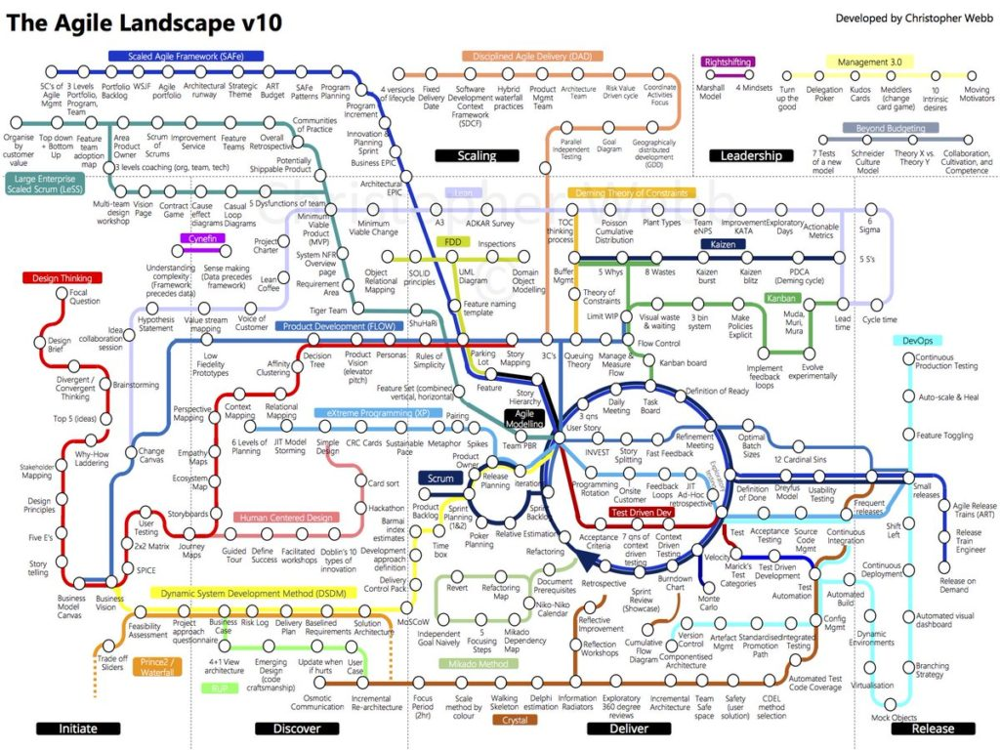

###### [Home](https://github.com/RyKaj/Documentation/blob/master/README.md) | [Infrastructure Architecture](https://github.com/RyKaj/Documentation/tree/master/Agile/README.md) |
------------

Agile : Methodology 
===================

>     “agile” is a state of being, not a process. It is a feeling that drives development and delivery. In teams I would consider agile, none of them operated exactly like the others; and some actions that would improve agility in one team would harm it in another. Some companies are able to mimic that feeling by embracing agile principles, and others aren’t. The important part isn’t the specific methodology that others say will help you achieve max productivity for your team, it’s the process that aligns with your culture and your software and your customer.

Agile is an umbrella term used to describe a project management
methodology which breaks down large complex projects into smaller
manageable chunks. Agile project management has been used in software
development to speed up the completion of projects, but now, we see
these practices being applied in a multitude of industries. \" [Agile is
a set of guiding principles developed in 2001 published as
the ] [[Agile
Manifesto](http://agilemanifesto.org/)] [.
Scrum and Kanban, on the other hand, are two methodologies which are
considered to be Agile. Or to put it another way, if you want to work in
an agile fashion, Scrum and Kanban are two ways to do it.]"
said Nicholas Carrier, Associate Partner at London-based 
[Prophet](https://www.prophet.com/).

A structured and iterative approach to project management and product
development. It recognizes the volatility of product development, and
provides a methodology for self-organizing teams to respond to change
without going off the rails. Today, agile is hardly a competitive
advantage. No one has the luxury to develop a product for years or even
months in a black box. This means it's more important than ever to get
it right.

Agile software development is based on an incremental, iterative
approach. Instead of in-depth planning at the beginning of the project,
Agile methodologies are open to changing requirements over time and
encourages constant feedback from the end users. Cross-functional teams
work on iterations of a product over a period of time, and this work is
organized into a backlog that is prioritized based on business or
customer value. The goal of each iteration is to produce a working
product.

In Agile methodologies, leadership encourages teamwork, accountability,
and face-to-face communication. Business stakeholders and developers
must work together to align the product with customer needs and company
goals.

Agile Manifesto
===============

*We are uncovering better ways of developing software by doing it and
helping others do it.*

*Through this work we have come to value:*

***Individuals and interactions** over processes and tools*

***Working software** over comprehensive documentation*

***Customer collaboration** over contract negotiation*

***Responding to change** over following a plan*

*That is, while there is value in the items on the right, we value the items on the left more.*

 

Human Resource Manifesto
------------------------

We follow these principles:

Support people to engage, grow,

and be happy in their workplace.

Encourage people to welcome change

and adapt when needed.

Help to build and support networks of empowered,

self-organising and collaborative teams.

Nourish and support the people's and team's motivation

and capabilities, help them build the environment they need,

and trust them to get the job done.

Facilitate and nurture personal growth,

to harness employee's different strengths and talents.

12 Principles
=============

1.  Our highest priority is to satisfy the customer through early and
    continuous delivery of valuable software.
2.  Welcome changing requirements, even late in development. Agile
    processes harness change for the customer's competitive advantage.
3.  Deliver working software frequently, from a couple of weeks to a
    couple of months, with a preference to the shorter timescale.
4.  Business people and developers must work together daily throughout
    the project.
5.  Build projects around motivated individuals. Give them the
    environment and support they need, and trust them to get the job
    done.
6.  The most efficient and effective method of conveying information to
    and within a development team is face-to-face conversation.
7.  Working software is the primary measure of progress.
8.  Agile processes promote sustainable development. The sponsors,
    developers, and users should be able to maintain a constant pace
    indefinitely.
9.  Continuous attention to technical excellence and good design
    enhances agility.
10. Simplicity--the art of maximizing the amount of work not done--is
    essential.
11. The best architectures, requirements, and designs emerge from
    self-organizing teams.
12. At regular intervals, the team reflects on how to become more
    effective, then tunes and adjusts its behavior accordingly.

Agile Leadership
================

1.  When there are leadership and guidance, not command & control.
2.  When there is alignment across the organization instead of the
    pursuit of local optimization efforts or personal agendas.
3.  When the collaboration of all participants beyond hierarchies is the
    norm, not an exception.
4.  When we acknowledge that management principles of the 19th century
    are unsuited to solve complex problems of the 21st century.
5.  When managers become servant leaders.

The following paragraphs focus on the main concepts related to agile
leadership: from servant leadership to the agile mindset to creating a
learning organization. The lists are not supposed to be comprehensive
but provide the interested reader with a starting point for further
research.

Servant Leadership
------------------

"A Servant Leader shares power puts the needs of the employees first and
helps people develop and perform as highly as possible. Instead of the
people working to serve the leader, the leader exists to serve the
people."

Source:  [Wikipedia on Servant
Leadership](https://en.wikipedia.org/wiki/Servant_leadership "Wikipedia on Servant Leadership").

Servant leadership is a suitable approach to dealing with complexity.
Complexity --- the unknown unknowns --- determines decision-making
processes and is characterized by:

-   More unpredictability than predictability.
-   Emergent answers.
-   Many competing ideas.
-   Cause and effect can only be determined in retrospect.

For a much more elaborate approach to complexity, see the  [Cynefin
framework by Dave
Snowden](https://cognitive-edge.com/ "Agile Leadership: Cynefin framework").

Servant leadership is not a new concept:

"A leader is best when people barely know he exists when his work is
done, his aim fulfilled, they will say: we did it ourselves." ( [Lao
Tzu, 4th century
BC.](https://en.wikipedia.org/wiki/Laozi) )

Servant leadership is characterized by:

-   Service to others.
-   Promotion of community.
-   Creation of a shared vision.
-   A holistic approach to work.
-   A shared decision-making process.

Servant leadership thus seems suited to overcome the industrial
paradigm. Source: [Wikipedia](https://en.wikipedia.org/wiki/Servant_leadership "Wikipedia on Servant Leadership").

Intent-based Leadership
-----------------------

The principles of intent-based leadership according to David Marquet are as follows:

-   Create leaders, not followers.
-   Resist the urge to resolve the problems of your people.
-   Take deliberate action.
-   Learn everywhere at any time.
-   Specify goals, not methods.
-   Don't empower, emancipate.

Source:  [10 Insights on Intent-Based Leadership --- David Marquet](https://www.slideshare.net/InspirationalMoments/10-insights-on-intentbased-leadership-david-marquet).

Reading tip:  [Turn the Ship Around](https://www.amazon.com/Turn-Your-Ship-Around-Implementing/dp/1591847532).

Agile Mindset
=============

As to what "having an Agile mindset" means, things were initially
unclear. Some resorted to the Supreme Court's approach to defining
pornography: "You know it when you see it." Yet over time, the nature
and content of the Agile mindset have clarified, particularly by way of
contrast to the  *bureaucratic mindset* that is still prevalent in many
large organizations.

Practitioners are thus said to have  *an Agile mindset* when they are
preoccupied---and sometimes obsessed---with innovating and delivering
steadily more  *customer* value, with getting work done in small
self-organizing  *teams*, and with collaborating together in an
interactive  *network*. Such organizations have been shown to have the
capacity to adapt rapidly to a quickly shifting marketplace.

The bureaucracy that ensues from such a mindset often finds it hard to
adapt to a world in massive rapid change.

The two different kinds of mindsets exert a powerful influence on the
behavior of their respective organizations and can be seen as having
the  *de facto* force of organizational laws, as shown here.

It's not that those with a  *bureaucratic mindset* don't care about the
customer: it's just that they generally focus more on making money for
the company and its shareholders. Nor do they never use teams; it's that
in a bureaucracy, self-organizing teams are the exception, not the rule.
Nor is operating as a network unknown in a bureaucracy: it's just that
maintaining the pyramid of layers and divisions is seen as more
important.

A bureaucratic mindset, when shared by tens of thousands of staff, tends
to create a radically different---and less adaptable---kind of
organization than one peopled by those with an Agile mindset.

### Agile As A Professional Mindset 

It may be better to think of the Agile mindset as something akin to the
mindset of a profession, such as that of a lawyer, a doctor or an
economist. Thus, lawyers, doctors, and economists think about certain
problems in characteristic ways. They notice certain kinds of
information, data, and concerns in their respective subjects. They
analyze the issues in their respective ways. They pursue their
respective kinds of solutions. These different ways of thinking,
perceiving and acting as lawyers, doctors, and economists, are acquired
over years of training and practice, which in turn generate
characteristic attitudes, values, modes of thought and approaches to
problems. Professional mindsets are not things that can be acquired
overnight or a two-day training course.

Similarly, those managers with an Agile mindset also pay attention to
certain kinds of information, data, and concerns. They analyze problems
in particular ways. They tend to pursue certain kinds of
solutions---focusing on value for customers, working in small teams and
operating as a network. Their ways of thinking, perceiving and acting
are often acquired over a period of years of practice. We should not be
surprised that the Agile mindset too isn't something that can be
acquired overnight or a two-day training course.

What we are talking about with the Agile mindset is the emergence of
management itself---finally---becoming a real profession.

### The Nature Of The Agile Mindset 

The Agile mindset is an attribute of practitioners more than theorists.
It is pragmatic and action-oriented more than a theoretical philosophy.
It goes beyond a set of beliefs and becomes a tool for diagnosis and the
basis for action. It tends to be built on the hard-won knowledge of
experience and crafted from the lessons of trying to cope with massive
change in the face of incomprehensible complexity.

The Agile mindset might also be called a framework, a paradigm, or a
common model. Yet "mindset" seems a better choice of word, reflecting a
coherent tradition of exploration, paths of analysis and patterns of
reasoning.

The Agile mindset reflects ways of thinking that have developed over
time. It is a certain cast of mind that emphasizes some things over
others. It should continue to grow and evolve. It reflects attitudes and
viewpoints that tend to endure. Over time, it leads to people being seen
as having a certain makeup or character. Once we have understood the
Agile mindset, we can anticipate types of behavior that should occur.

The 'agile mindset' discussion seems to be centered around five areas:
complexity and planning, delivering value, self-organization, fostering
collaboration, and cross-functionality of teams:

### Mindset, Complexity, and Planning

-   The definition of mindset: "[The established set of attitudes held
    by
    someone](https://en.oxforddictionaries.com/definition/mindset "The Oxford Disctionaries on Mindset")."
-   The complexity challenge:
    -   The  [scientific management
        methodology](https://en.wikipedia.org/wiki/Scientific_management "Wikipedia on Scientific Management") of
        Frederick Taylor does not apply to "creative work."
    -   Problem-solving in a complex environment cannot be achieved with
        "more" planning.
    -   The future in the complex or chaotic domain cannot be predicted.
    -   Hence different approaches need to be employed when dealing with
        creative solutions in unchartered territory, for example, 
        [Empiricism](https://www.britannica.com/topic/empiricism "The Encyclopedia Britannica on Empiricism") or 
        [Lean](https://www.lean.org/WhatsLean/).

### Focus on Delivering Value

-   Continuous value delivery to customers; outcome over output.
    (Manifesto of Agile Software Development: " [Working software is the
    primary measure of
    progress](https://agilemanifesto.org/principles.html "Principles behind the Agile Manifesto").")
-   Continuous learning & applying empiricism:
    -   Deming:  [PDCA
        cycle](https://en.wikipedia.org/wiki/PDCA).
    -   Empiricism: Transparency, inspection, adaptation.
    -   Iterative, incremental.
    -   Accepting that failure is more than an option but inevitable.
    -   Willingness to adapt to change.

### Self-Organization

-   Teams can best decide how to accomplish work and achieve the goal.
-   Teams outperform individuals.
-   Team building is a crucial success factor: The team wins, the team
    fails.
-   [Optimize for flow not
    utilization](https://www.youtube.com/watch?v=CostXs2p6r0),
    and move from push to flow.
-   The importance of values:  [courage, commitment, focus, openness,
    respect](https://scrumguides.org/scrum-guide.html#values "The Scrum Guide on Scrum Values").

### Fostering collaboration

-   Creating psychological safety and equal speaking opportunity.
-   Respect for individuals.
-   Inclusion and diversity.
-   [Core
    Protocols](https://liveingreatness.com/core-protocols/ "Jim and Michele McCarthy: The Core Protocols"):
    Opt-in, opt-out, law of 2 feet --- creative work requires voluntary
    participation.
-   Prime directive: stop protecting the organization by assuming people
    come to the office to "rip you off."
-   [Give people a voice, provide an opportunity to be
    heard](https://management30.com/podcast/the-secret-to-creating-high-performing-teams/).

Further reading:  [How to build the perfect
team](https://www.nytimes.com/2016/02/28/magazine/what-google-learned-from-its-quest-to-build-the-perfect-team.html "What Google Learned From Its Quest to Build the Perfect Team").
\[NYTimes.\]

### Cross-functional Teams

-   End-to-end (value) delivery capability of teams.
-   The autonomous pursuit of customer value balanced with
    accountability.
-   Abandoning functional silos in favor of focusing on delivering
    value.
-   Avoidance of local optimization.
-   A cornerstone on the path to achieving business agility.

#### More Articles on Agile Leadership:

-   [What Exactly is the Agile
    Mindset](https://www.infoq.com/articles/what-agile-mindset)?
-   [A Leader's Framework for Decision
    Making](https://hbr.org/2007/11/a-leaders-framework-for-decision-making).
-   [The New New Product Development
    Game](https://hbr.org/1986/01/the-new-new-product-development-game "Hirotaka Takeuchi and Ikujiro Nonaka: The New New Product Development Game").

Creating a Learning Organization
================================

Peter Senge is a Senior Lecturer in Leadership and Sustainability at the
MIT Sloan School of Management and coined the term 'learning
organization' in his book ' [The Fifth
Discipline](https://www.amazon.com/Fifth-Discipline-Practice-Learning-Organization/dp/0385517254/ref=sr_1_fkmr2_1 "Peter Senge: The Fifth Discipline: The Art & Practice of The Learning Organization"):'

-   " [The only sustainable competitive advantage is an organization\'s
    ability to learn faster than the
    competition](https://www.goodreads.com/author/quotes/21072.Peter_M_Senge "Peter Senge on the Learning Organization")."
-   "People working together at their best. It's a continuous,
    relentless process."
-   There are two mindsets that can infiltrate an organization: control
    and learning.

These are the characteristics of a learning organization according to
Peter Senge:

-   System thinking: assessing businesses as a system of bounded
    objects.
-   Personal mastery: the commitment of an individual to the process of
    learning.
-   Mental models: assumptions and generalizations held by individuals
    and organizations.
-   Shared vision: Creating a collective identity to provide focus and
    energy for learning.
-   Team learning: The accumulation of individual learning.

Harvard Business School professor David A. Garvin defines a learning
organization as follows:

-   "A learning organization is an organization skilled at creating,
    acquiring, and transferring knowledge, and at modifying its behavior
    to reflect new knowledge and insights."
-   New ideas, insights or moments of creativity are necessary to
    trigger organizational change. They are not sufficient, though to
    create a learning organization. The changes to the way work are
    accomplished need to follow suit.

-   Sources:  [Building a Learning Organization](https://hbr.org/1993/07/building-a-learning-organization "David A. Garvin: Building a Learning Organization"), and  [Wikipedia](https://en.wikipedia.org/wiki/Learning_organization "Wikipedia on the learning organization").

Traditional vs. Agile Leadership Behaviour - A Cheat Sheet
==========================================================

We can aggregate and condense the before mentioned concepts and
principles into a comparison of the traditional management style and
agile leadership:

Traditional Management \<=\> Agile Leadership
---------------------------------------------

1.  Predictive, long-term planning \<=\> Provision of vision, strategy,
    and direction
2.  Control of work, task assignment \<=\> Fostering self-organization
3.  Maximize utilization and capacity \<=\> Supporting teams by removing
    what is impeding them
4.  The go-to problem fixer for subordinates \<=\> Let those closest to
    the problem figure out a solution
5.  Motivating others by extrinsic incentives (bonuses, titles, etc.)
    \<=\> Motivating others by enabling autonomy, mastery, and purpose
6.  Information flows up the hierarchy (reports, meetings) \<=\>
    Management moves to where the information is, for example, by
    participation in Sprint Reviews.

Subway Map to Agile Practices
-----------------------------

test1

References

-   [Agile Manifesto](https://agilemanifesto.org/)
-   [Agile Alliance](https://www.agilealliance.org/agile101/)
-   [Innovify - how agile is redefining mobile app development](https://www.innovify.com/blogs/how-agile-is-redefining-mobile-app-development)
-   [Agile HR Manifesto](https://www.agilehrmanifesto.org/)
-   [George Stocker - agile cant save us](https://georgestocker.com/2019/10/30/agile-cant-save-us/?utm_source=rss&utm_medium=rss&utm_campaign=agile-cant-save-us)
-   [Medium techcatch - modern agile is the agile manifesto outdated](https://medium.com/techcatch/modern-agile-is-the-agile-manifesto-outdated-c207bb960606)

