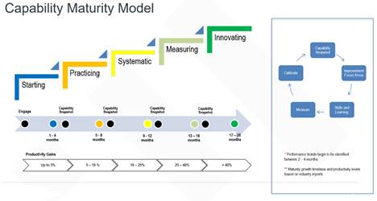

# **Capability Maturity Model (CMM)**
The **Capability Maturity Model** (**CMM**) is a methodology used to develop and refine an organization's software development process. The **model** describes a five-level evolutionary path of increasingly organized and systematically more mature processes.
# **Value**
- To assess any engineering team, understand how it works, what kind of problems does it have and how to fix those problems
- To achieve transparency about the level of engineering capabilities and maturity across all tribes and establish sustainable improvements process
- To understand the correlation between established engineering culture and business value through the collection and analysis of metrics and other engineering data
- Delivery Key **Metrics** are identified and collected and serve to support the Capability Areas defined for high performing technology, teams and processes: 

# **Levels**
Levels serve as the pillars of the CMM visualization (Heat Map) shows the achieved levels and the improvement path towards continues improvement (Major level: L1, L3, L5; Transition level: L2, L4)

</kbd>

**Capability Areas (Example)**

Capability areas required for high performance technology, teams and process

</kbd>

