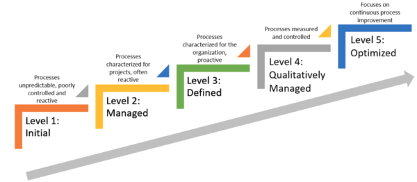
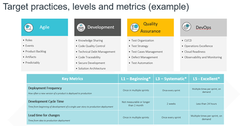

# **Capability Maturity Model (CMM)**
The **Capability Maturity Model** (**CMM**) is a methodology used to develop and refine an organization's software development process. The **model** describes a five-level evolutionary path of increasingly organized and systematically more mature processes.
# **Value**
- To assess any engineering team, understand how it works, what kind of problems does it have and how to fix those problems
- To achieve transparency about the level of engineering capabilities and maturity across all tribes and establish sustainable improvements process
- To understand the correlation between established engineering culture and business value through the collection and analysis of metrics and other engineering data
- Delivery Key **Metrics** are identified and collected and serve to support the Capability Areas defined for high performing technology, teams and processes: 

# **Levels**
Levels serve as the pillars of the CMM visualization (Heat Map) shows the achieved levels and the improvement path towards continues improvement (Major level: L1, L3, L5; Transition level: L2, L4)

</kbd>

| Levels 	| Focus 	| Key Process Areas 	|  
| ------------ | ------------ | ------------ |
| 5: Optimized  | Continual process improvement  |  - Defect prevention   - Technology change management   - Process change management |
| 4: Qualitatively Managed |  Product and process quality | - Quantitative process management  - Software quality management  |
| 3: Defined | Engineering processes and organization support  | - Organization process focus   - Organization process definition  -Training program   - Integrated software management   - Software product engineering   - Intergroup coordination   - Peer reviews  |
| 2: Managed  | Project management processes  | - Requirements management   - Software project planning   -Software project tracking and oversight   - Software subcontract managemnet   - Software quality assurance   - Software configuration management   |
| 1: Initial |  Compentent people (and heroics) | -   |

**Software CMM Key process areas and their purpose **

| Key Process Areas  | Purpose  |
| ------------ | ------------ |
|   | **Maturity Level 2: Managed**  |
| Requirements Management  | Establish a common understanding between the customer and software project team about the customer’s requirements.  |
| Software Project Planning  | Establishe dreasonable plans for software engineering and overall project management  |
| Software project tracking and oversight  | Provide adequate visibility into actual progress so that management can act effectively when the software project’s performance deviates significantly from the software plans  |
| Software subcontract management  | Select qualified software subcontractors and manage them effectively  |
| Software quality assurance  | Establish and maintain the integrity of software products throughout the projects software life cycle.  |
|   | **Maturity Level 3: Defined**  |
| Organization process focus  | Establish organizational responsibility for software process activities that improve the organization’s overall software process capability.  |
| Organization process definition  |  Develop and maintain a usable set of software process assets that improve process performance across theprojects and provide a basis for cumulative, long-term organizational benefits. |
| Training Program  | Develop individuals’ skills and knowledge so they can perform their roles effectively and efficiently  |
| Integrated Software Management  | Integrate the software engineering and management activities into a coherent, defined software process based on the organization’s standard software process and related process assets.  |
| Software product engineering   | Consistently use a well-defined engineering process that integrates all the software engineering activities to produce correct, consistent software products effectively and efficiently  |
| Integrated software management  | Integrate the software engineering and management activities into a coherent, defined software process based on the organization’s standard software process and related process assets.  |
| Software Product Engineering  | Consistently use a well-defined engineering process that integrates all the software engineering activities to produce correct, consistent software products effectively and efficiently.  |
| intergroup coordination  |  Establish a way for the software engineering group to participate actively with other engineering groups so that the project can effectively and efficiently satisfy customer needs.  |
| Peer reveiws  | Remove defects from the software work products early and efficiently. An important corollary effect is to develop a better understanding of the software products and the preventable defects  |
|   | **Maturity Level 4: Qualitatively Managed** |
| Quantitative process management  |  Quantitatively control the performance of the software project’s process. Software process performance represents the actual results achieved from following a software process. |
| Software quality management  | Quantify the quality of the project's software products and achieve specific quality goals  |
|   | **Maturity Level 5: Optimized**  |
| Defect Prevention  | Identify the cause of defects and prevents them from recurring  |
| Technology chanage management  | Identify new technologies (such as tools, methods, and process) and introduce them into the organization in an orderly manner  |
| Process change management  | Continually improve the organization's software processes with the gaol of improving software quality, increasing productivity, and decreasing the product-development cycle time  |

**Capability Areas (Example)**

Capability areas required for high performance technology, teams and process

</kbd>

References:
https://www.researchgate.net/publication/3247744_Extreme_Programming_from_a_CMM_Perspective
https://citeseerx.ist.psu.edu/viewdoc/download?doi=10.1.1.1067.4141&rep=rep1&type=pdf

