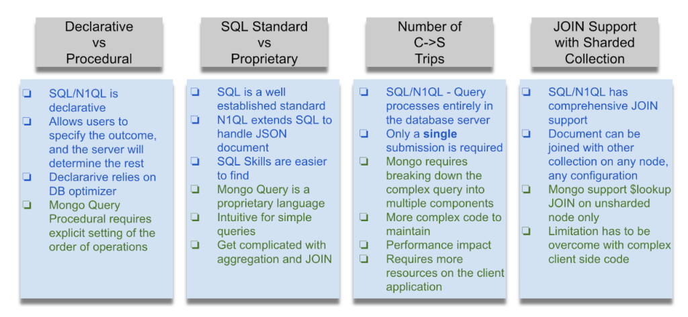
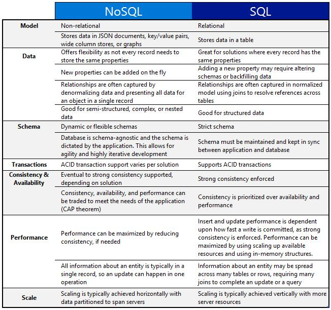

###### [Home](https://github.com/RyKaj/Documentation/blob/master/README.md) | [Database](https://github.com/RyKaj/Documentation/tree/master/Database/README.md) |
------------

# Database : SQL and NoSQL

<kbd></kbd>

## Relational Database

A ***relational database*** is a set of formally described tables ( *lists* in our example ) from which ***data***can be accessed or reassembled 
in many different ways without having to reorganize the ***database*** tables. There are many different types of relational databases — lined paper, 
sadly, not being one of them\!

A hallmark feature of the most popular relational databases is a query
language called SQL (Standard Query Language). Meaning that, if Grandma upgrades her remembering system to a computer, she’d be able to quickly
answer questions like, “Who hasn’t visited me in the last year, is married, and doesn’t have any hobbies?”

Among the world’s most popular choices for a SQL Database Management System is MySQL, which is open-source. It is implemented primarily as a
Relational Database Management System (RDBMS) for web-based software applications.

Some key features of MySQL include:

  - It’s really well known, commonly used, and thoroughly tested.
  - There’s a lot of qualified developers experienced in SQL and relational databases.
  - Data gets stored in various tables, allowing easy relations using primary and foreign keys (fancy speak for*id*s).
  - It’s easy to use and performant, making it ideal for big and small businesses.
  - The source code is under the GNU General Public License agreement.

## No SQL

Many **NoSQL **(“not only” SQL) ** databases** exist. In our examples, we exemplified a  *Document database. *NoSQL databases model data in
ways that exclude the tabular relations provided in relational databases. These databases became popular in the early 2000s amongst
companies that required cloud-based database clustering due to their sheer scaling requirements (i.e. Facebook). In such applications, having
data consistency was a lot less important than performance and scalability.

In the early days, NoSQL databases often got used for super focused data management tasks. Mainly when it came to web and cloud apps, NoSQL DB’s
have been proven to process and distribute significant volumes of data. Engineers building with NoSQL have also liked the flexible data schema
(or complete lack thereof), so that fast changes to apps being updated often were possible.

The key features of NoSQL include:

  - A highly flexible way of persisting data
  - Horizontal scaling to clusters
  - Eventual consistency on persistence/propagation
  - Documents that are identified using unique keys

The huge data set has introduced the challenges of data storage, data
management, data analysis, etc. Moreover, it becomes semi-structured and sparse. In the case of RDBMS, there is a need for upfront schema and
relational references.

To resolve these problems related to semi-structured or unstructured data, a range of new database products has emerged during the last few
years. The new class of database products consists of column-based data stores, key-value pair databases, and document databases, etc. When used
together, these databases are called NoSQL consist of diverse products each having a unique set of features and propositions.

Other than this, NoSQL databases can be scaled out easily when compared to SQL databases. The load is distributed among multiple hosts as shown
below whenever load increases.

<kbd></kbd>

### Features of NoSQL database

#### Non-Relational

  - NoSQL databases never follow the relational database models.
  - It never provides a table with fixed column records.
  - It works with self-contained aggregates.
  - It does not require any data normalization or object-relational mapping.
  - There are no complex features like relational databases.

#### Distributed Computing

  - It is possible to execute multiple databases in a distributed manner.
  - It offers fail-over capabilities and auto-scaling features.
  - It can be used with all programming language, or there is no standard query to use with NoSQL databases.
  - It provides eventual consistency.
  - It provides no synchronous replication among distributed nodes.
  - It enables maximum distribution and less coordination among data
	nodes.

<kbd></kbd>

#### Schema-Free

  - NoSQL databases either have relaxed schemas or it is schema-free.
  - It does not require any definition for the schema of the data.
  - It offers heterogeneous data structures for the same domains.

<kbd></kbd>

#### Simple API

  - It offers easy to use interface for data storage and data query.
  - It allows low-level selection methods and low-level data manipulation.
  - It uses text-based protocols with HTTP and JSON.
  - It has no standard-based query language.
  - It is a web-enabled database running as internet-facing services.

### NoSQL Database Types you should know

<kbd></kbd>

There are four classes of NoSQL databases with their unique attributes and limitations. You should understand each of them in depth first and
choose the best one that suits your requirements the most. Let us see each of them one by one.

#### Key-value pair based

This database is designed to manage heavy loads and a lot of data gracefully. It stores data in key-value pairs where each key is unique
and value can be anything like object, string JSON, etc. Here is one quick example of the database given below.

<kbd></kbd>

It is the most basic type of database that can be used as collections,
arrays, dictionaries, etc. It helps developers to store the schema-less data. It works best for shopping cart content.

#### Column-based NoSQL Database

This database is column-oriented where each column is treated
separately, and values are stored contiguously. Here is the simple example of how column-based NoSQL database looks like:

<kbd></kbd>

It works best for aggregation queries like SUM, Count, MAX, MIN, AVG, etc. It helps to find data quickly in columns. This database is majorly
used for managing catalogs, data warehouse, BI projects, CRM, or library, etc.

#### Document-Oriented NoSQL Database

It stores and retrieves the data as key-value pair, but the value is
stored in documents in XML or JSON formats. A database itself understands or queries the data. In the diagram, you can see a table
where data is stored in row and column format. And the right-hand side is covered by documents where data is stored in JSON format. Here, you
don’t have to define columns which makes it more flexible as compared to relational databases.

<kbd></kbd>

It is mostly used for blogging platforms, CRM systems, or real-time
analytics, etc. it is used for complex transactions that require multiple operations against varying aggregate functions.

### Graph-based NoSQL Databases

<kbd></kbd>

This database stores the entity and defines the relationship among
different entities. The stored entity is named as the node, and the relationship is defined as the edge. Each node and edge must have a
unique identifier. Here, tables are multi-relational in nature, not loosely connected. Traversing relationship is much faster in NoSQL
databases when compared to relational databases. It is mostly used for logistics, networks, and spatial data.

#### Query Mechanism tools for NoSQL Database

The data retrieval mechanism in NoSQL database is REST-based  the value is retrieved based on key/ID with the GET resource. Document stores the
most difficult queries as they use the key-value pair to store the data. For example, Couch DB define views with the MapReduce.

#### What is the CAP Theorem?

This theorem is given by the Brewer which states that it is not possible
for distributed data stores to give more than two out of total three
guarantees. These are consistency, partition tolerance, and availability.

1.  Consistency:
	
	The data should remain consistent even after the execution of an
	operation, it means once data is written, any future read request should be able to access the same data. For example, once you update
	the status of an order, the client should be able to check the same data.

2.  Partition Tolerance:
	
	If communication among servers is not stable even then the system
	should be able to work properly, it is called the partition tolerance. For example, when the server is divided into multiple
	partitions, they may or may not communicate together. If one part of
	the database is unavailable even then other parts should not be affected.

3.  Availability:
	
	The database should be highly responsive and available without any 	downtime.

#### Eventual Consistency

The term eventual consistency means multiple data copies are available on different machines to get higher availability and scalability. If
some changes are made to one file, it should automatically be reflected other replicas.

Data replication is not instantaneous because a few copies are updated frequently and a few over time. But you have to make sure content is the
same for all replicas. Hence, the name of this phenomenon is given as eventual consistency.

BASE: Basically Available, Soft state, Eventual consistency

<kbd></kbd>

  - Here basically available means DB is available all the time as per 	the assumption of CAP theorem.
  - Soft state means the state of a system may change without an input.
  - Eventual consistency means system become consistent over time.

#### Advantages of NoSQL Database

The desired technical characteristics for NoSQL database are given as below.

##### Primary and Analytic Data Source Capability

The first criteria for any NoSQL solution are that it must serve as the
primary or active data source that receives data from different business apps. It should act as the secondary data source or analytical database
to enhance the overall functionalities of business apps. Further, it should be capable of integrating with different types of data like
structured, semi-structured, or unstructured. Additionally, it can execute complex queries too.

##### Big Data Capability

NoSQL databases are good with Big data, and they can be scaled quickly to manage voluminous data from terabytes to petabytes. Additionally, it
delivers high performance for data velocity, data complexity, and the data variety.

##### Continuous Availability

NoSQL database is always available without any single point of failure. All nodes in the cluster can read request even if some machine is down.
It can replicate data among different physical machines within a data center. It avoids hardware outages too.

##### Multi-Data Center Capability

Business enterprises need highly distributed databases that are spread
across multiple data centers or graphical locales without any performance issues. The solution includes the ability to handle multiple
data centers without concerning the overall occurrences of read and write operations. A good NoSQL database supports multiple data centers
and provides configuration options to maintain a proper balance between consistency and performance.

##### Separate Cache layer is not required

A good NoSQL database uses and distributes data among different participating nodes. It does not have a separate cache layer to store
the data. The memory cache of multiple participating nodes stores data quickly for immediate I/O access. It eliminates the problems of
synchronizing cache data with the persistent database. In this way, it supports higher scalability with fewer management issues.

##### Cloud-Ready

The adoption of cloud platforms is increasing daily by leading enterprises worldwide. This is the reason why every robust platform must
be cloud-ready. NoSQL databases like MongoDB are cloud-ready able to work in a cloud setting when necessary. It supports the hybrid solution
when one part of the database is hosted within the enterprise, and another part is hosted in the cloud.

##### High Performance and Scalability

NoSQL databases can enhance performance by adding multiple nodes to the
cluster. Usually, the performance of a database system goes down with additional nodes to a cluster. However, a good NoSQL database increases
performance for both read and write operations when new nodes are added, and performance gains are linear in nature.

Here, we have listed the major benefits of the NoSQL database but there
a few more as discussed by enterprises like easy to implement, easy to  use, supports multiple languages & platforms, thriven open source community, etc.

## NoSQL - Couchbase or Mongo

<kbd></kbd>

## SQL vs NoSQL

<kbd></kbd>

<table>
	<thead>
		<tr class="header">
			<th>RDBMS</th>
			<th>NOSQL</th>
		</tr>
	</thead>
	<tbody>
		<tr class="odd">
			<td>
				<ul>
					<li>Data is stored in a relational model, with rows and columns.</li>
					<li>A row contains information about an item while columns contain specific information, such as 'Model', 'Date of Manufacture', 'Color'.</li>
					<li>Follows fixed schema. Meaning, the columns are defined and locked before data entry. In addition, each row contains data for each column.</li>
					<li>Supports vertical scaling. Scaling an RDBMS across multiple servers is a challenging and time-consuming process</li>
					<li>Atomicity, Consistency, Isolation &amp; Durability(ACID) Compliant</li>
				</ul>
			</td>
			<td>
				<ul>
					<li>Data is stored in a host of different databases, with different data storage models.</li>
					<li>Follows dynamic schemas. Meaning, you can add columns anytime</li>
					<li>Supports horizontal scaling. You can scale across multiple servers. Multiple servers are cheap commodity hardware or cloud instances, which make scaling cost-effective compared to vertical scaling</li>
					<li>Not ACID Compliant</li>
				</ul>
			</td>
		</tr>
	</tbody>
</table>

References

  - [Medium - Explaining sql and nosql to grandma](https://medium.com/swlh/explaining-sql-and-nosql-to-grandma-9d7a69378be8)
  - [Janbask Training - nosql-tutorial](https://www.janbasktraining.com/blog/nosql-tutorial/)
  - [Linkedin - Anurag Vishwa - NoSQL vs SQL](https://www.linkedin.com/feed/update/urn:li:activity:6640200672052596736/)
  - [Couchbase - sql to nosql 7 metrics to compare query language](https://blog.couchbase.com/sql-to-nosql-7-metrics-to-compare-query-language/)

