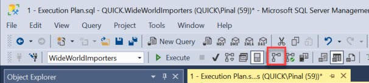
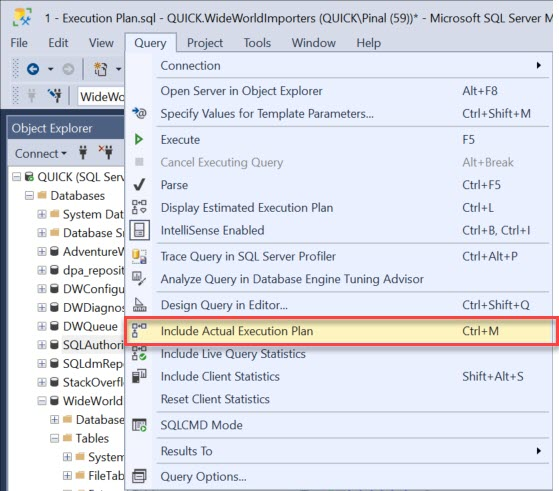
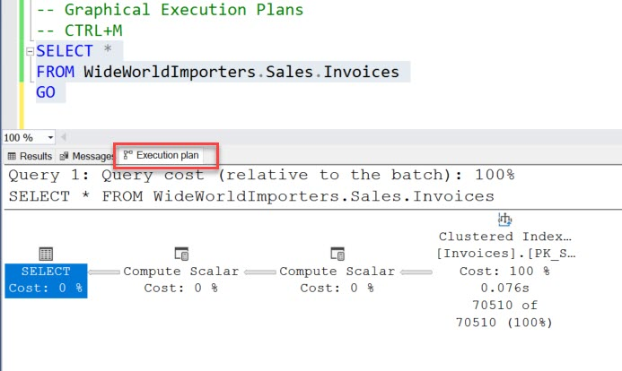
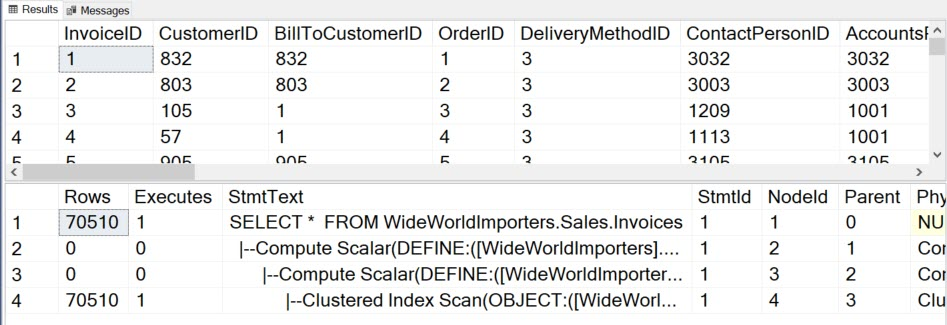
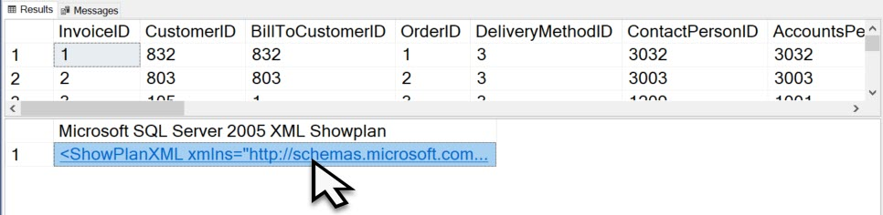

###### [Home](https://github.com/RyKaj/Documentation/blob/master/README.md) | [Database](https://github.com/RyKaj/Documentation/tree/master/Database/README.md) |
------------

# Database : SQL Execution/Query Plans

## Overview

A query execution plan is a definition of the following:

  - The sequence in which the source tables are accessed. Typically, there are many sequences in which the database server can
	access the base tables to build the result set. For example, if a `SELECT` statement references three tables, the database server
	could first access `TableA`, use the data from `TableA` to extract 	matching rows from `TableB`, and then use the data from `TableB` to
	extract data from `TableC`. The other sequences in which the database server could access the tables are:
	
	  - `TableC`, `TableB`, `TableA`
	  - `TableB`, `TableA`, `TableC`
	  - `TableB`, `TableC`, `TableA`
	  - `TableC`, `TableA`, `TableB`

  - The methods used to extract data from each table. Generally, there are different methods for accessing the data in
	each table. If only a few rows with specific key values are required, the database server can use an index. If all the rows in
	the table are required, the database server can ignore the indexes and perform a table scan. If all the rows in a table are required
	but there is an index whose key columns are in an `ORDER BY`, performing an index scan instead of a table scan may save a separate
	sort of the result set. If a table is very small, table scans may be the most efficient method for almost all access to the table.

## Estimated and Actual Execution Plans

There are two types of execution plans:

1.  **Estimated execution plan**: Estimated plans provide an estimation of the work that SQL server is expected to perform to get the data.
2.  **Actual execution plan**: Actual execution plans are generated after the Transact-SQL queries or the batches are executed. Because
	of this, an actual execution plan contains runtime information, such as the actual resource usage metrics and any runtime warnings.

## Estimated Execution Plans

The estimated execution plan, for all practical purposes, uses statistics and many other parameters based on what is available on this
server and generates the plan.

This is an estimated plan and not specifically the plan that has been generated by SQL Server.

This is synonymous to the first analogy that we had given about the weather forecast.

Next we’ll review various display options for estimated execution plans

An estimated execution plan does not contain any runtime information, such as actual resource usage metrics or runtime warnings. Instead, the
execution plan that is generated displays the query execution plan that SQL Server Database Engine would most probably use if the queries were
actually executed, and displays the estimated rows flowing through the several operators in the plan.

## Actual Execution Plan

We said that the estimated execution plan is like the weather forecast, so the actual execution plan is where you can realize whether it
actually rained or not.

It shows what SQL Server actually does to get the result of your query.

Here we’ll review the display options for actual execution plans

Actual execution plans are generated after the Transact-SQL queries or batches execute. Because of this, an actual execution plan contains
runtime information, such as actual resource usage metrics and runtime warnings (if any). The execution plan that is generated displays the
actual query execution plan that the SQL Server Database Engine used to execute the queries.

## Different Ways to Explore Execution Plan

### Graphical Execution Plan

You can enable Graphical actual execution plan via typing keyboard shortcut CTRL+M.

In SSMS you can also enable a graphical execution plan via clicking on the icon on the toolbar.

<kbd></kbd>

If you go to the ***Main Menu*** on the top go-to ***Query*** menu and click on the ***Include Actual Execution Plan***.

<kbd></kbd>

Once you follow any one of the above advice, you can run any query in the query editor in SSMS and it will display actual execution plan in
the separate window in your SSMS resultset.

<kbd></kbd>

Once you are looking at your execution plan, you can follow the same method to disable the execution plan.

### Text Plan

This is another method to see the execution plan. We will use the STATISTICS PROFILE to see the actual execution plan.

You can execute the following query and in the resultset area, you will see the execution plan in the text format.

-- Text Execution Plans
> SET STATISTICS PROFILE ON 
> GO
> SELECT * 
> FROM WideWorldImporters.Sales.Invoices 
> GO 
> SET STATISTICS PROFILE OFF
>  GO

You need to scroll down bellow the execution plan to see the text-based execution plan which will be displayed in the grid format.

<kbd></kbd>

### XML Plan

The XML execution plan is very popular as we can save them and send to another person and they can easily see the exact same operations which
we see on our machine. We will use the STATISTICS XML to see the actual execution plan.

<kbd></kbd>

You can execute the following query and in the resultset area, you will see the execution plan in the XML format. You can also click on the XML
execution plan and open the graphical execution plan as well.

## Interpreting the Plan

### Reading the Plan

While the query plan is helpful, it’s also slightly difficult to read. There are roughly 80 operations that will represent the different
actions making up a query plan. The SELECT icon is very common and usually can be ignored. It’s the final result and has to do with
formatting the output. A Table scan is when the Optimizer must walk through an entire table and either return everything it finds, or
identify the appropriate rows to return to the output. The more the table grows, the more taxing this operation becomes.

Query Execution Plans are typically read *right to left top to bottom*. There is also arrows between operations which represent the data flowing
between the objects. The thickness of the arrow also indicates how much data is being processed.

The percentage displayed below each of the operations is the estimated execution time that will take for the operation to complete. The cost
associated to the operation is a ration so 100% cost is relative to the batch. The table scan is doing nearly all the work for the plan.

### Operator Descriptions

<table>
	<thead>
		<tr class="header">
			<th>Graphical Execution Plan Icon</th>
			<th>Showplan Operator</th>
			<th>Description</th>
		</tr>
	</thead>
	<tbody>
		<tr class="odd">
			<td>
				
			</td>
			<td>
				<strong>Adaptive Join</strong>
			</td>
			<td>The 
				<strong>Adaptive Join</strong> operator enables the choice of a hash join or nested loops join method to be deferred until the after the first input has been scanned. The 
				<strong>Adaptive Join</strong> operator is a physical operator. For more information, see 
				<a href="https://docs.microsoft.com/en-us/sql/relational-databases/performance/joins?view=sql-server-2017#adaptive">Understanding Adaptive joins</a>.
			</td>
		</tr>
		<tr class="even">
			<td>None</td>
			<td>
				<strong>Aggregate</strong>
			</td>
			<td>The 
				<strong>Aggregate</strong> operator calculates an expression containing MIN, MAX, SUM, COUNT or AVG. The 
				<strong>Aggregate</strong> operator can be a logical operator or a physical operator.
			</td>
		</tr>
		<tr class="odd">
			<td>
				
			</td>
			<td>
				<strong>Arithmetic Expression</strong>
			</td>
			<td>The 
				<strong>Arithmetic Expression</strong> operator computes a new value from existing values in a row. 
				<strong>Arithmetic Expression</strong> is not used in SQL Server 2017.
			</td>
		</tr>
		<tr class="even">
			<td>None</td>
			<td>
				<strong>Async Concat</strong>
			</td>
			<td>The 
				<strong>Async Concat</strong> operator is used only in remote queries (distributed queries). It has 
				<em>n</em> children and one parent node. Usually, some of the children are remote computers that participate in a distributed query. 
				<strong>Async Concat</strong> issues 
				<code>open()</code> calls to all of the children simultaneously and then applies a bitmap to each child. For each bit that is a 1, 
				<strong>Async Concat</strong> sends the output rows to the parent node on demand.
			</td>
		</tr>
		<tr class="odd">
			<td>
				
			</td>
			<td>
				<strong>Assert</strong>
			</td>
			<td>The 
				<strong>Assert</strong> operator verifies a condition. For example, it validates referential integrity or ensures that a scalar subquery returns one row. For each input row, the 
				<strong>Assert</strong> operator evaluates the expression in the 
				<strong>Argument</strong> column of the execution plan. If this expression evaluates to NULL, the row is passed through the 
				<strong>Assert</strong> operator and the query execution continues. If this expression evaluates to a nonnull value, the appropriate error will be raised. The 
				<strong>Assert</strong> operator is a physical operator.
			</td>
		</tr>
		<tr class="even">
			<td>
				
			</td>
			<td>
				<strong>Assign</strong>
			</td>
			<td>The 
				<strong>Assign</strong> operator assigns the value of an expression or a constant to a variable. 
				<strong>Assign</strong> is a language element.
			</td>
		</tr>
		<tr class="odd">
			<td>
				
			</td>
			<td>
				<strong>Bitmap Create</strong>
			</td>
			<td>The 
				<strong>Bitmap Create</strong> operator appears in the Showplan output where bitmaps are built. 
				<strong>Bitmap Create</strong> is a logical operator.
			</td>
		</tr>
		<tr class="even">
			<td>
				
			</td>
			<td>
				<strong>Bitmap</strong>
			</td>
			<td>SQL Server uses the 
				<strong>Bitmap</strong> operator to implement bitmap filtering in parallel query plans. Bitmap filtering speeds up query execution by eliminating rows with key values that cannot produce any join records before passing rows through another operator such as the 
				<strong>Parallelism</strong> operator. A bitmap filter uses a compact representation of a set of values from a table in one part of the operator tree to filter rows from a second table in another part of the tree. By removing unnecessary rows early in the query, subsequent operators have fewer rows to work with, and the overall performance of the query improves. The optimizer determines when a bitmap is selective enough to be useful and in which operators to apply the filter. 
				<strong>Bitmap</strong> is a physical operator.
			</td>
		</tr>
		<tr class="odd">
			<td>
				
			</td>
			<td>
				<strong>Bookmark Lookup</strong>
			</td>
			<td>The 
				<strong>Bookmark Lookup</strong> operator uses a bookmark (row ID or clustering key) to look up the corresponding row in the table or clustered index. The 
				<strong>Argument</strong> column contains the bookmark label used to look up the row in the table or clustered index. The 
				<strong>Argument</strong> column also contains the name of the table or clustered index in which the row is looked up. If the WITH PREFETCH clause appears in the 
				<strong>Argument</strong> column, the query processor has determined that it is optimal to use asynchronous prefetching (read-ahead) when looking up bookmarks in the table or clustered index.
				 
				 
				Starting with SQL Server 2005 (9.x), 
				<strong>Bookmark Lookup</strong> is not used. Instead, 
				<strong>Key Lookup</strong> and 
				<strong>RID Lookup</strong> provide bookmark lookup functionality.
			</td>
		</tr>
		<tr class="even">
			<td>None</td>
			<td>
				<strong>Branch Repartition</strong>
			</td>
			<td>In a parallel query plan, sometimes there are conceptual regions of iterators. All of the iterators within such a region can be executed by parallel threads. The regions themselves must be executed serially. Some of the 
				<strong>Parallelism</strong> iterators within an individual region are called 
				<strong>Branch Repartition</strong>. The 
				<strong>Parallelism</strong> iterator at the boundary of two such regions is called 
				<strong>Segment Repartition</strong>. 
				<strong>Branch Repartition</strong> and 
				<strong>Segment Repartition</strong> are logical operators.
			</td>
		</tr>
		<tr class="odd">
			<td>None</td>
			<td>
				<strong>Broadcast</strong>
			</td>
			<td>
				<strong>Broadcast</strong> has one child node and 
				<em>n</em> parent nodes. 
				<strong>Broadcast</strong> sends its input rows to multiple consumers on demand. Each consumer gets all of the rows. For example, if all of the consumers are build sides of a hash join, then 
				<em>n</em> copies of the hash tables will be built.
			</td>
		</tr>
		<tr class="even">
			<td>
				
			</td>
			<td>
				<strong>Build Hash</strong>
			</td>
			<td>Indicates the build of a batch hash table for an xVelocity memory optimized columnstore index.</td>
		</tr>
		<tr class="odd">
			<td>None</td>
			<td>
				<strong>Cache</strong>
			</td>
			<td>
				<strong>Cache</strong> is a specialized version of the 
				<strong>Spool</strong> operator. It stores only one row of data. 
				<strong>Cache</strong> is a logical operator. 
				<strong>Cache</strong> is not used in SQL Server 2017.
			</td>
		</tr>
		<tr class="even">
			<td>
				
			</td>
			<td>
				<strong>Clustered Index Delete</strong>
			</td>
			<td>The 
				<strong>Clustered Index Delete</strong> operator deletes rows from the clustered index specified in the Argument column of the query execution plan. If a WHERE:() predicate is present in the Argument column, then only those rows that satisfy the predicate are deleted. 
				<strong>Clustered Index Delete</strong> is a physical operator.
			</td>
		</tr>
		<tr class="odd">
			<td>
				
			</td>
			<td>
				<strong>Clustered Index Insert</strong>
			</td>
			<td>The 
				<strong>Clustered Index Insert</strong> Showplan operator inserts rows from its input into the clustered index specified in the Argument column. The Argument column also contains a SET:() predicate, which indicates the value to which each column is set. If 
				<strong>Clustered Index Insert</strong> has no children for insert values, the row inserted is taken from the 
				<strong>Insert</strong> operator itself. 
				<strong>Clustered Index Insert</strong> is a physical operator.
			</td>
		</tr>
		<tr class="even">
			<td>
				
			</td>
			<td>
				<strong>Clustered Index Merge</strong>
			</td>
			<td>The 
				<strong>Clustered Index Merge</strong> operator applies a merge data stream to a clustered index. The operator deletes, updates, or inserts rows from the clustered index specified in the 
				<strong>Argument</strong> column of the operator. The actual operation performed depends on the runtime value of the 
				<strong>ACTION</strong> column specified in the 
				<strong>Argument</strong> column of the operator. 
				<strong>Clustered Index Merge</strong> is a physical operator.
			</td>
		</tr>
		<tr class="odd">
			<td>
				
			</td>
			<td>
				<strong>Clustered Index Scan</strong>
			</td>
			<td>The 
				<strong>Clustered Index Scan</strong> operator scans the clustered index specified in the Argument column of the query execution plan. When an optional WHERE:() predicate is present, only those rows that satisfy the predicate are returned. If the Argument column contains the ORDERED clause, the query processor has requested that the output of the rows be returned in the order in which the clustered index has sorted it. If the ORDERED clause is not present, the storage engine scans the index in the optimal way, without necessarily sorting the output. 
				<strong>Clustered Index Scan</strong> is a logical and physical operator.
			</td>
		</tr>
		<tr class="even">
			<td>
				
			</td>
			<td>
				<strong>Clustered Index Seek</strong>
			</td>
			<td>The 
				<strong>Clustered Index Seek</strong> operator uses the seeking ability of indexes to retrieve rows from a clustered index. The 
				<strong>Argument</strong> column contains the name of the clustered index being used and the SEEK:() predicate. The storage engine uses the index to process only those rows that satisfy this SEEK:() predicate. It can also include a WHERE:() predicate where the storage engine evaluates against all rows that satisfy the SEEK:() predicate, but this is optional and does not use indexes to complete this process.
				 
				 
				If the 
				<strong>Argument</strong> column contains the ORDERED clause, the query processor has determined that the rows must be returned in the order in which the clustered index has sorted them. If the ORDERED clause is not present, the storage engine searches the index in the optimal way, without necessarily sorting the output. Allowing the output to retain its ordering can be less efficient than producing nonsorted output. When the keyword LOOKUP appears, then a bookmark lookup is being performed. In SQL Server 2008 and later versions, the 
				<strong>Key Lookup</strong> operator provides bookmark lookup functionality. 
				<strong>Clustered Index Seek</strong> is a logical and physical operator.
			</td>
		</tr>
		<tr class="odd">
			<td>
				
			</td>
			<td>
				<strong>Clustered Index Update</strong>
			</td>
			<td>The 
				<strong>Clustered Index Update</strong> operator updates input rows in the clustered index specified in the 
				<strong>Argument</strong> column.If a WHERE:() predicate is present, only those rows that satisfy this predicate are updated. If a SET:() predicate is present, each updated column is set to this value. If a DEFINE:() predicate is present, the values that this operator defines are listed. These values may be referenced in the SET clause or elsewhere within this operator and elsewhere within this query. 
				<strong>Clustered Index Update</strong> is a logical and physical operator.
			</td>
		</tr>
		<tr class="even">
			<td>
				
			</td>
			<td>
				<strong>Collapse</strong>
			</td>
			<td>The 
				<strong>Collapse</strong> operator optimizes update processing. When an update is performed, it can be split (using the 
				<strong>Split</strong> operator) into a delete and an insert. The 
				<strong>Argument</strong> column contains a GROUP BY:() clause that specifies a list of key columns. If the query processor encounters adjacent rows that delete and insert the same key values, it replaces these separate operations with a single more efficient update operation. 
				<strong>Collapse</strong> is a logical and physical operator.
			</td>
		</tr>
		<tr class="odd">
			<td>
				
			</td>
			<td>
				<strong>Columnstore Index Scan</strong>
			</td>
			<td>The 
				<strong>Columnstore Index Scan</strong> operator scans the columnstore index specified in the 
				<strong>Argument</strong> column of the query execution plan.
			</td>
		</tr>
		<tr class="even">
			<td>
				
			</td>
			<td>
				<strong>Compute Scalar</strong>
			</td>
			<td>The 
				<strong>Compute Scalar</strong> operator evaluates an expression to produce a computed scalar value. This may then be returned to the user, referenced elsewhere in the query, or both. An example of both is in a filter predicate or join predicate. 
				<strong>Compute Scalar</strong> is a logical and physical operator.
				 
				 
				<strong>Compute Scalar</strong> operators that appear in Showplans generated by SET STATISTICS XML might not contain the 
				<strong>RunTimeInformation</strong> element. In graphical Showplans, 
				<strong>Actual Rows</strong>, 
				<strong>Actual Rebinds</strong>, and 
				<strong>Actual Rewinds</strong> might be absent from the 
				<strong>Properties</strong> window when the 
				<strong>Include Actual Execution Plan</strong> option is selected in SQL Server Management Studio. When this occurs, it means that although these operators were used in the compiled query plan, their work was performed by other operators in the run-time query plan. Also note that the number of executes in Showplan output generated by SET STATISTICS PROFILE is equivalent to the sum of rebinds and rewinds in Showplans generated by SET STATISTICS XML.
			</td>
		</tr>
		<tr class="odd">
			<td>
				
			</td>
			<td>
				<strong>Concatenation</strong>
			</td>
			<td>The 
				<strong>Concatenation</strong> operator scans multiple inputs, returning each row scanned. 
				<strong>Concatenation</strong> is typically used to implement the Transact-SQL UNION ALL construct. The 
				<strong>Concatenation</strong> physical operator has two or more inputs and one output. Concatenation copies rows from the first input stream to the output stream, then repeats this operation for each additional input stream. 
				<strong>Concatenation</strong> is a logical and physical operator.
			</td>
		</tr>
		<tr class="even">
			<td>
				
			</td>
			<td>
				<strong>Constant Scan</strong>
			</td>
			<td>The 
				<strong>Constant Scan</strong> operator introduces one or more constant rows into a query. A 
				<strong>Compute Scalar</strong> operator is often used after a 
				<strong>Constant Scan</strong> to add columns to a row produced by the 
				<strong>Constant Scan</strong> operator.
			</td>
		</tr>
		<tr class="odd">
			<td>
				
			</td>
			<td>
				<strong>Convert</strong>
			</td>
			<td>The 
				<strong>Convert</strong> operator converts one scalar data type to another. 
				<strong>Convert</strong> is a language element.
			</td>
		</tr>
		<tr class="even">
			<td>None</td>
			<td>
				<strong>Cross Join</strong>
			</td>
			<td>The 
				<strong>Cross Join</strong> operator joins each row from the first (top) input with each row from the second (bottom) input. 
				<strong>Cross Join</strong> is a logical operator.
			</td>
		</tr>
		<tr class="odd">
			<td>None</td>
			<td>
				<strong>Cursor</strong>
			</td>
			<td>The 
				<strong>Cursor</strong> logical and physical operators are used to describe how a query or update involving cursor operations is executed. The physical operators describe the physical implementation algorithm used to process the cursor; for example, using a keyset-driven cursor. Each step in the execution of a cursor involves a physical operator. The logical operators describe a property of the cursor, such as the cursor is read only.
				 
				 
				Logical operators include Asynchronous, Optimistic, Primary, Read Only, Scroll Locks, and Secondary and Synchronous.
				 
				 
				Physical operators include Dynamic, Fetch Query, Keyset, Population Query, Refresh Query and Snapshot.
			</td>
		</tr>
		<tr class="even">
			<td>
				
			</td>
			<td>
				<strong>catchall</strong>
			</td>
			<td>The catchall icon is displayed when a suitable icon for the iterator cannot be found by the logic that produces graphical showplans. The catchall icon does not necessarily indicate an error condition. There are three catchall icons: blue (for iterators), orange (for cursors), and green (for Transact-SQL language elements).</td>
		</tr>
		<tr class="odd">
			<td>
				
			</td>
			<td>
				<strong>Declare</strong>
			</td>
			<td>The 
				<strong>Declare</strong> operator allocates a local variable in the query plan. 
				<strong>Declare</strong> is a language element.
			</td>
		</tr>
		<tr class="even">
			<td>
				
			</td>
			<td>
				<strong>Delete</strong>
			</td>
			<td>The 
				<strong>Delete</strong> operator deletes from an object rows that satisfy the optional predicate in the 
				<strong>Argument</strong> column.
			</td>
		</tr>
		<tr class="odd">
			<td>
				
			</td>
			<td>
				<strong>Deleted Scan</strong>
			</td>
			<td>The 
				<strong>Deleted Scan</strong> operator scans the deleted table within a trigger.
			</td>
		</tr>
		<tr class="even">
			<td>None</td>
			<td>
				<strong>Distinct Sort</strong>
			</td>
			<td>The 
				<strong>Distinct Sort</strong> logical operator scans the input, removing duplicates and sorting by the columns specified in the DISTINCT ORDER BY:() predicate of the 
				<strong>Argument</strong> column. 
				<strong>Distinct Sort</strong> is a logical operator.
			</td>
		</tr>
		<tr class="odd">
			<td>None</td>
			<td>
				<strong>Distinct</strong>
			</td>
			<td>The 
				<strong>Distinct</strong> operator removes duplicates from a rowset or from a collection of values. 
				<strong>Distinct</strong> is a logical operator.
			</td>
		</tr>
		<tr class="even">
			<td>
				
			</td>
			<td>
				<strong>Distribute Streams</strong>
			</td>
			<td>The 
				<strong>Distribute Streams</strong> operator is used only in parallel query plans. The 
				<strong>Distribute Streams</strong> operator takes a single input stream of records and produces multiple output streams. The record contents and format are not changed. Each record from the input stream appears in one of the output streams. This operator automatically preserves the relative order of the input records in the output streams. Usually, hashing is used to decide to which output stream a particular input record belongs.
				 
				 
				If the output is partitioned, then the 
				<strong>Argument</strong> column contains a PARTITION COLUMNS:() predicate and the partitioning columns. 
				<strong>Distribute Streams</strong> is a logical operator
			</td>
		</tr>
		<tr class="odd">
			<td>
				
			</td>
			<td>
				<strong>Dynamic</strong>
			</td>
			<td>The 
				<strong>Dynamic</strong> operator uses a cursor that can see all changes made by others.
			</td>
		</tr>
		<tr class="even">
			<td>
				
			</td>
			<td>
				<strong>Fetch Query</strong>
			</td>
			<td>The 
				<strong>Fetch Query</strong> operator retrieves rows when a fetch is issued against a cursor.
			</td>
		</tr>
		<tr class="odd">
			<td>
				
			</td>
			<td>
				<strong>Filter</strong>
			</td>
			<td>The 
				<strong>Filter</strong> operator scans the input, returning only those rows that satisfy the filter expression (predicate) that appears in the 
				<strong>Argument</strong> column.
			</td>
		</tr>
		<tr class="even">
			<td>None</td>
			<td>
				<strong>Flow Distinct</strong>
			</td>
			<td>The 
				<strong>Flow Distinct</strong> logical operator scans the input, removing duplicates. Whereas the 
				<strong>Distinct</strong> operator consumes all input before producing any output, the 
				<strong>FlowDistinct</strong> operator returns each row as it is obtained from the input (unless that row is a duplicate, in which case it is discarded).
			</td>
		</tr>
		<tr class="odd">
			<td>
				
			</td>
			<td>
				<strong>Foreign Key References Check</strong>
			</td>
			<td>The 
				<strong>Foreign Key References Check</strong> operator performs referential integrity checks in place, by comparing the modified row to the rows in the referencing tables to verify that the modification will not break the referential integrity. The 
				<strong>Foreign Key References Check</strong> operator is used when more than 253 foreign key references exist on the same primary or unique key. 
				<strong>Foreign Key References Check</strong> is a logical and physical operator.
			</td>
		</tr>
		<tr class="even">
			<td>None</td>
			<td>
				<strong>Full Outer Join</strong>
			</td>
			<td>The 
				<strong>Full Outer Join</strong> logical operator returns each row satisfying the join predicate from the first (top) input joined with each row from the second (bottom) input. It also returns rows from:
				 
				 
				-The first input that had no matches in the second input.
				 
				 
				-The second input that had no matches in the first input.
				 
				 
				The input that does not contain the matching values is returned as a null value. 
				<strong>Full Outer Join</strong> is a logical operator.
			</td>
		</tr>
		<tr class="odd">
			<td>
				
			</td>
			<td>
				<strong>Gather Streams</strong>
			</td>
			<td>The 
				<strong>Gather Streams</strong> operator is only used in parallel query plans. The 
				<strong>Gather Streams</strong> operator consumes several input streams and produces a single output stream of records by combining the input streams. The record contents and format are not changed. If this operator is order preserving, all input streams must be ordered. If the output is ordered, the 
				<strong>Argument</strong> column contains an ORDER BY:() predicate and the names of columns being ordered. 
				<strong>Gather Streams</strong> is a logical operator.
			</td>
		</tr>
		<tr class="even">
			<td>
				
			</td>
			<td>
				<strong>Hash Match</strong>
			</td>
			<td>The 
				<strong>Hash Match</strong> operator builds a hash table by computing a hash value for each row from its build input. A HASH:() predicate with a list of columns used to create a hash value appears in the 
				<strong>Argument</strong> column. Then, for each probe row (as applicable), it computes a hash value (using the same hash function) and looks in the hash table for matches. If a residual predicate is present (identified by RESIDUAL:() in the 
				<strong>Argument</strong> column), that predicate must also be satisfied for rows to be considered a match. Behavior depends on the logical operation being performed:
				 
				 
				-For any joins, use the first (top) input to build the hash table and the second (bottom) input to probe the hash table. Output matches (or nonmatches) as dictated by the join type. If multiple joins use the same join column, these operations are grouped into a hash team.
				 
				 
				-For the distinct or aggregate operators, use the input to build the hash table (removing duplicates and computing any aggregate expressions). When the hash table is built, scan the table and output all entries.
				 
				 
				-For the union operator, use the first input to build the hash table (removing duplicates). Use the second input (which must have no duplicates) to probe the hash table, returning all rows that have no matches, then scan the hash table and return all entries.
				 
				<strong>Hash Match</strong> is a physical operator. For more information, see 
				<a href="https://docs.microsoft.com/en-us/sql/relational-databases/performance/joins?view=sql-server-2017#hash">Understanding Hash joins</a>.
			</td>
		</tr>
		<tr class="odd">
			<td>
				
			</td>
			<td>
				<strong>If</strong>
			</td>
			<td>The 
				<strong>If</strong> operator carries out conditional processing based on an expression. 
				<strong>If</strong> is a language element.
			</td>
		</tr>
		<tr class="even">
			<td>None</td>
			<td>
				<strong>Inner Join</strong>
			</td>
			<td>The 
				<strong>Inner Join</strong> logical operator returns each row that satisfies the join of the first (top) input with the second (bottom) input.
			</td>
		</tr>
		<tr class="odd">
			<td>
				
			</td>
			<td>
				<strong>Insert</strong>
			</td>
			<td>The 
				<strong>Insert</strong> logical operator inserts each row from its input into the object specified in the 
				<strong>Argument</strong> column. The physical operator is either the 
				<strong>Table Insert</strong>, 
				<strong>Index Insert</strong>, or 
				<strong>Clustered Index Insert</strong> operator.
			</td>
		</tr>
		<tr class="even">
			<td>
				
			</td>
			<td>
				<strong>Inserted Scan</strong>
			</td>
			<td>The 
				<strong>Inserted Scan</strong> operator scans the 
				<strong>inserted</strong> table. 
				<strong>Inserted Scan</strong> is a logical and physical operator.
			</td>
		</tr>
		<tr class="odd">
			<td>
				
			</td>
			<td>
				<strong>Intrinsic</strong>
			</td>
			<td>The 
				<strong>Intrinsic</strong> operator invokes an internal Transact-SQL function. 
				<strong>Intrinsic</strong> is a language element.
			</td>
		</tr>
		<tr class="even">
			<td>
				
			</td>
			<td>
				<strong>Iterator</strong>
			</td>
			<td>The 
				<strong>Iterator</strong> catchall icon is displayed when a suitable icon for the iterator cannot be found by the logic that produces graphical Showplans. The catchall icon does not necessarily indicate an error condition. There are three catchall icons: blue (for iterators), orange (for cursors), and green (for Transact-SQL language constructs).
			</td>
		</tr>
		<tr class="odd">
			<td>
				
			</td>
			<td>
				<strong>Key Lookup</strong>
			</td>
			<td>The 
				<strong>Key Lookup</strong> operator is a bookmark lookup on a table with a clustered index. The 
				<strong>Argument</strong> column contains the name of the clustered index and the clustering key used to look up the row in the clustered index. 
				<strong>Key Lookup</strong> is always accompanied by a 
				<strong>Nested Loops</strong> operator. If the WITH PREFETCH clause appears in the 
				<strong>Argument</strong> column, the query processor has determined that it is optimal to use asynchronous prefetching (read-ahead) when looking up bookmarks in the clustered index.
				 
				 
The use of a 
				<strong>Key Lookup</strong> operator in a query plan indicates that the query might benefit from performance tuning. For example, query performance might be improved by adding a covering index.
			</td>
		</tr>
		<tr class="even">
			<td>
				
			</td>
			<td>
				<strong>Keyset</strong>
			</td>
			<td>The 
				<strong>Keyset</strong> operator uses a cursor that can see updates, but not inserts made by others.
			</td>
		</tr>
		<tr class="odd">
			<td>
				
			</td>
			<td>
				<strong>Language Element</strong>
			</td>
			<td>The 
				<strong>Language Element</strong> catchall icon is displayed when a suitable icon for the iterator cannot be found by the logic that produces graphical Showplans. The catchall icon does not necessarily indicate an error condition. There are three catchall icons: blue (for iterators), orange (for cursors), and green (for Transact-SQL language constructs).
			</td>
		</tr>
		<tr class="even">
			<td>None</td>
			<td>
				<strong>Left Anti Semi Join</strong>
			</td>
			<td>The 
				<strong>Left Anti Semi Join</strong> operator returns each row from the first (top) input when there is no matching row in the second (bottom) input. If no join predicate exists in the 
				<strong>Argument</strong> column, each row is a matching row. 
				<strong>Left Anti Semi Join</strong> is a logical operator.
			</td>
		</tr>
		<tr class="odd">
			<td>None</td>
			<td>
				<strong>Left Outer Join</strong>
			</td>
			<td>The 
				<strong>Left Outer Join</strong> operator returns each row that satisfies the join of the first (top) input with the second (bottom) input. It also returns any rows from the first input that had no matching rows in the second input. The nonmatching rows in the second input are returned as null values. If no join predicate exists in the 
				<strong>Argument</strong> column, each row is a matching row. 
				<strong>Left Outer Join</strong> is a logical operator.
			</td>
		</tr>
		<tr class="even">
			<td>None</td>
			<td>
				<strong>Left Semi Join</strong>
			</td>
			<td>The 
				<strong>Left Semi Join</strong> operator returns each row from the first (top) input when there is a matching row in the second (bottom) input. If no join predicate exists in the 
				<strong>Argument</strong> column, each row is a matching row. 
				<strong>Left Semi Join</strong> is a logical operator.
			</td>
		</tr>
		<tr class="odd">
			<td>
				
			</td>
			<td>
				<strong>Log Row Scan</strong>
			</td>
			<td>The 
				<strong>Log Row Scan</strong> operator scans the transaction log. 
				<strong>Log Row Scan</strong> is a logical and physical operator.
			</td>
		</tr>
		<tr class="even">
			<td>
				
			</td>
			<td>
				<strong>Merge Interval</strong>
			</td>
			<td>The 
				<strong>Merge Interval</strong> operator merges multiple (potentially overlapping) intervals to produce minimal, nonoverlapping intervals that are then used to seek index entries. This operator typically appears above one or more 
				<strong>Compute Scalar</strong> operators over 
				<strong>Constant Scan</strong> operators, which construct the intervals (represented as columns in a row) that this operator merges. 
				<strong>Merge Interval</strong> is a logical and physical operator.
			</td>
		</tr>
		<tr class="odd">
			<td>
				
			</td>
			<td>
				<strong>Merge Join</strong>
			</td>
			<td>The 
				<strong>Merge Join</strong> operator performs the inner join, left outer join, left semi join, left anti semi join, right outer join, right semi join, right anti semi join, and union logical operations.
				 
				 
In the 
				<strong>Argument</strong> column, the 
				<strong>Merge Join</strong> operator contains a MERGE:() predicate if the operation is performing a one-to-many join, or a MANY-TO-MANY MERGE:() predicate if the operation is performing a many-to-many join. The 
				<strong>Argument</strong> column also includes a comma-separated list of columns used to perform the operation. The 
				<strong>Merge Join</strong> operator requires two inputs sorted on their respective columns, possibly by inserting explicit sort operations into the query plan. Merge join is particularly effective if explicit sorting is not required, for example, if there is a suitable B-tree index in the database or if the sort order can be exploited for multiple operations, such as a merge join and grouping with roll up. 
				<strong>Merge Join</strong> is a physical operator. For more information, see 
				<a href="https://docs.microsoft.com/en-us/sql/relational-databases/performance/joins?view=sql-server-2017#merge">Understanding Merge joins</a>.
			</td>
		</tr>
		<tr class="even">
			<td>
				
			</td>
			<td>
				<strong>Nested Loops</strong>
			</td>
			<td>The 
				<strong>Nested Loops</strong> operator performs the inner join, left outer join, left semi join, and left anti semi join logical operations. Nested loops joins perform a search on the inner table for each row of the outer table, typically using an index. The query processor decides, based on anticipated costs, whether to sort the outer input in order to improve locality of the searches on the index over the inner input. Any rows that satisfy the (optional) predicate in the 
				<strong>Argument</strong> column are returned as applicable, based on the logical operation being performed. When the OPTIMIZED attribute is set to 
				<strong>True</strong>, it means that an Optimized Nested Loops (or Batch Sort) is used. 
				<strong>Nested Loops</strong> is a physical operator. For more information, see 
				<a href="https://docs.microsoft.com/en-us/sql/relational-databases/performance/joins?view=sql-server-2017#nested_loops">Understanding Nested Loops joins</a>.
			</td>
		</tr>
		<tr class="odd">
			<td>
				
			</td>
			<td>
				<strong>Nonclustered Index Delete</strong>
			</td>
			<td>The 
				<strong>Nonclustered Index Delete</strong> operator deletes input rows from the nonclustered index specified in the 
				<strong>Argument</strong> column. 
				<strong>Nonclustered Index Delete</strong> is a physical operator.
			</td>
		</tr>
		<tr class="even">
			<td>
				
			</td>
			<td>
				<strong>Index Insert</strong>
			</td>
			<td>The 
				<strong>Index Insert</strong> operator inserts rows from its input into the nonclustered index specified in the 
				<strong>Argument</strong> column. The 
				<strong>Argument</strong> column also contains a SET:() predicate, which indicates the value to which each column is set. 
				<strong>Index Insert</strong> is a physical operator.
			</td>
		</tr>
		<tr class="odd">
			<td>
				
			</td>
			<td>
				<strong>Index Scan</strong>
			</td>
			<td>The 
				<strong>Index Scan</strong> operator retrieves all rows from the nonclustered index specified in the 
				<strong>Argument</strong> column. If an optional WHERE:() predicate appears in the 
				<strong>Argument</strong> column, only those rows that satisfy the predicate are returned. 
				<strong>Index Scan</strong> is a logical and physical operator.
			</td>
		</tr>
		<tr class="even">
			<td>
				
			</td>
			<td>
				<strong>Index Seek</strong>
			</td>
			<td>The 
				<strong>Index Seek</strong> operator uses the seeking ability of indexes to retrieve rows from a nonclustered index. The 
				<strong>Argument</strong> column contains the name of the nonclustered index being used. It also contains the SEEK:() predicate. The storage engine uses the index to process only those rows that satisfy the SEEK:() predicate. It optionally may include a WHERE:() predicate, which the storage engine will evaluate against all rows that satisfy the SEEK:() predicate (it does not use the indexes to do this). If the 
				<strong>Argument</strong> column contains the ORDERED clause, the query processor has determined that the rows must be returned in the order in which the nonclustered index has sorted them. If the ORDERED clause is not present, the storage engine searches the index in the optimal way (which does not guarantee that the output will be sorted). Allowing the output to retain its ordering may be less efficient than producing nonsorted output. 
				<strong>Index Seek</strong> is a logical and physical operator.
			</td>
		</tr>
		<tr class="odd">
			<td>
				
			</td>
			<td>
				<strong>Index Spool</strong>
			</td>
			<td>The 
				<strong>Index Spool</strong> physical operator contains a SEEK:() predicate in the 
				<strong>Argument</strong> column. The 
				<strong>Index Spool</strong> operator scans its input rows, placing a copy of each row in a hidden spool file (stored in the 
				<strong>tempdb</strong> database and existing only for the lifetime of the query), and builds a nonclustered index on the rows. This allows you to use the seeking capability of indexes to output only those rows that satisfy the SEEK:() predicate. If the operator is rewound (for example, by a 
				<strong>Nested Loops</strong> operator) but no rebinding is needed, the spooled data is used instead of rescanning the input.
			</td>
		</tr>
		<tr class="even">
			<td>
				
			</td>
			<td>
				<strong>Nonclustered Index Update</strong>
			</td>
			<td>The 
				<strong>Nonclustered Index Update</strong> physical operator updates rows from its input in the nonclustered index specified in the 
				<strong>Argument</strong> column. If a SET:() predicate is present, each updated column is set to this value. 
				<strong>Nonclustered Index Update</strong> is a physical operator.
			</td>
		</tr>
		<tr class="odd">
			<td>
				
			</td>
			<td>
				<strong>Online Index Insert</strong>
			</td>
			<td>The 
				<strong>Online Index Insert</strong> physical operator indicates that an index create, alter, or drop operation is performed online. That is, the underlying table data remains available to users during the index operation.
			</td>
		</tr>
		<tr class="even">
			<td>None</td>
			<td>
				<strong>Parallelism</strong>
			</td>
			<td>The 
				<strong>Parallelism</strong> operator (or Exchange Iterator) performs the distribute streams, gather streams, and repartition streams logical operations. The 
				<strong>Argument</strong> columns can contain a PARTITION COLUMNS:() predicate with a comma-separated list of the columns being partitioned. The 
				<strong>Argument</strong> columns can also contain an ORDER BY:() predicate, listing the columns to preserve the sort order for during partitioning. 
				<strong>Parallelism</strong> is a physical operator. For more information about the Parallelism operator, see 
				<a href="https://blogs.msdn.microsoft.com/craigfr/tag/parallelism/">Craig Freedman's blog series</a>.
				 
				 
				<strong>Note:</strong> If a query has been compiled as a parallel query, but at run time it is run as a serial query, the Showplan output generated by SET STATISTICS XML or by using the 
				<strong>Include Actual Execution Plan</strong> option in SQL Server Management Studio will not contain the 
				<strong>RunTimeInformation</strong> element for the 
				<strong>Parallelism</strong> operator. In SET STATISTICS PROFILE output, the actual row counts and actual number of executes will display zeroes for the 
				<strong>Parallelism</strong> operator. When either condition occurs, it means that the 
				<strong>Parallelism</strong> operator was only used during query compilation and not in the run-time query plan. Note that sometimes parallel query plans are run in serial if there is a high concurrent load on the server.
			</td>
		</tr>
		<tr class="odd">
			<td>
				
			</td>
			<td>
				<strong>Parameter Table Scan</strong>
			</td>
			<td>The 
				<strong>Parameter Table Scan</strong> operator scans a table that is acting as a parameter in the current query. Typically, this is used for INSERT queries within a stored procedure. 
				<strong>Parameter Table Scan</strong> is a logical and physical operator.
			</td>
		</tr>
		<tr class="even">
			<td>None</td>
			<td>
				<strong>Partial Aggregate</strong>
			</td>
			<td>
				<strong>Partial Aggregate</strong> is used in parallel plans. It applies an aggregation function to as many input rows as possible so that writing to disk (known as a "spill") is not necessary. 
				<strong>Hash Match</strong> is the only physical operator (iterator) that implements partition aggregation. 
				<strong>Partial Aggregate</strong> is a logical operator.
			</td>
		</tr>
		<tr class="odd">
			<td>
				
			</td>
			<td>
				<strong>Population Query</strong>
			</td>
			<td>The 
				<strong>Population Query</strong> operator populates the work table of a cursor when the cursor is opened.
			</td>
		</tr>
		<tr class="even">
			<td>
				
			</td>
			<td>
				<strong>Refresh Query</strong>
			</td>
			<td>The 
				<strong>Refresh Query</strong> operator fetches current data for rows in the fetch buffer.
			</td>
		</tr>
		<tr class="odd">
			<td>
				
			</td>
			<td>
				<strong>Remote Delete</strong>
			</td>
			<td>The 
				<strong>Remote Delete</strong> operator deletes the input rows from a remote object. 
				<strong>Remote Delete</strong> is a logical and physical operator.
			</td>
		</tr>
		<tr class="even">
			<td>
				
			</td>
			<td>
				<strong>Remote Index Scan</strong>
			</td>
			<td>The 
				<strong>Remote Index Scan</strong> operator scans the remote index specified in the Argument column. 
				<strong>Remote Index Scan</strong> is a logical and physical operator.
			</td>
		</tr>
		<tr class="odd">
			<td>
				
			</td>
			<td>
				<strong>Remote Index Seek</strong>
			</td>
			<td>The 
				<strong>Remote Index Seek</strong> operator uses the seeking ability of a remote index object to retrieve rows. The 
				<strong>Argument</strong> column contains the name of the remote index being used and the SEEK:() predicate. 
				<strong>Remote Index Seek</strong> is a logical physical operator.
			</td>
		</tr>
		<tr class="even">
			<td>
				
			</td>
			<td>
				<strong>Remote Insert</strong>
			</td>
			<td>The 
				<strong>Remote Insert</strong> operator inserts the input rows into a remote object. 
				<strong>Remote Insert</strong> is a logical and physical operator.
			</td>
		</tr>
		<tr class="odd">
			<td>
				
			</td>
			<td>
				<strong>Remote Query</strong>
			</td>
			<td>The 
				<strong>Remote Query</strong> operator submits a query to a remote source. The text of the query sent to the remote server appears in the 
				<strong>Argument</strong> column. 
				<strong>Remote Query</strong> is a logical and physical operator.
			</td>
		</tr>
		<tr class="even">
			<td>
				
			</td>
			<td>
				<strong>Remote Scan</strong>
			</td>
			<td>The 
				<strong>Remote Scan</strong> operator scans a remote object. The name of the remote object appears in the 
				<strong>Argument</strong> column. 
				<strong>Remote Scan</strong> is a logical and physical operator.
			</td>
		</tr>
		<tr class="odd">
			<td>
				
			</td>
			<td>
				<strong>Remote Update</strong>
			</td>
			<td>The 
				<strong>Remote Update</strong> operator updates the input rows in a remote object. 
				<strong>Remote Update</strong> is a logical and physical operator.
			</td>
		</tr>
		<tr class="even">
			<td>
				
			</td>
			<td>
				<strong>Repartition Streams</strong>
			</td>
			<td>The 
				<strong>Repartition Streams</strong> operator (or exchange iterator) consumes multiple streams and produces multiple streams of records. The record contents and format are not changed. If the query optimizer uses a bitmap filter, the number of rows in the output stream is reduced. Each record from an input stream is placed into one output stream. If this operator is order preserving, all input streams must be ordered and merged into several ordered output streams. If the output is partitioned, the 
				<strong>Argument</strong> column contains a PARTITION COLUMNS:() predicate and the partitioning columns.If the output is ordered, the 
				<strong>Argument</strong> column contains an ORDER BY:() predicate and the columns being ordered. 
				<strong>Repartition Streams</strong> is a logical operator. The operator is used only in parallel query plans.
			</td>
		</tr>
		<tr class="odd">
			<td>
				
			</td>
			<td>
				<strong>Result</strong>
			</td>
			<td>The 
				<strong>Result</strong> operator is the data returned at the end of a query plan. This is usually the root element of a Showplan. 
				<strong>Result</strong> is a language element.
			</td>
		</tr>
		<tr class="even">
			<td>
				
			</td>
			<td>
				<strong>RID Lookup</strong>
			</td>
			<td>
				<strong>RID Lookup</strong> is a bookmark lookup on a heap using a supplied row identifier (RID). The 
				<strong>Argument</strong> column contains the bookmark label used to look up the row in the table and the name of the table in which the row is looked up. 
				<strong>RID Lookup</strong> is always accompanied by a NESTED LOOP JOIN. 
				<strong>RID Lookup</strong> is a physical operator. For more information about bookmark lookups, see " 
				<a href="https://go.microsoft.com/fwlink/?LinkId=132568">Bookmark Lookup</a>" on the MSDN SQL Server blog.
			</td>
		</tr>
		<tr class="odd">
			<td>
				
			</td>
			<td>
				<strong>Row Count Spool</strong>
			</td>
			<td>The 
				<strong>Row Count Spool</strong> operator scans the input, counting how many rows are present and returning the same number of rows without any data in them. This operator is used when it is important to check for the existence of rows, rather than the data contained in the rows. For example, if a 
				<strong>Nested Loops</strong> operator performs a left semi join operation and the join predicate applies to inner input, a row count spool may be placed at the top of the inner input of the 
				<strong>Nested Loops</strong> operator. Then the 
				<strong>Nested Loops</strong> operator can determine how many rows are output by the row count spool (because the actual data from the inner side is not needed) to determine whether to return the outer row. 
				<strong>Row Count Spool</strong> is a physical operator.
			</td>
		</tr>
		<tr class="even">
			<td>None</td>
			<td>
				<strong>Right Anti Semi Join</strong>
			</td>
			<td>The 
				<strong>Right Anti Semi Join</strong> operator outputs each row from the second (bottom) input when a matching row in the first (top) input does not exist. A matching row is defined as a row that satisfies the predicate in the 
				<strong>Argument</strong> column (if no predicate exists, each row is a matching row). 
				<strong>Right Anti Semi Join</strong> is a logical operator.
			</td>
		</tr>
		<tr class="odd">
			<td>None</td>
			<td>
				<strong>Right Outer Join</strong>
			</td>
			<td>The 
				<strong>Right Outer Join</strong> operator returns each row that satisfies the join of the second (bottom) input with each matching row from the first (top) input. It also returns any rows from the second input that had no matching rows in the first input, joined with NULL. If no join predicate exists in the 
				<strong>Argument</strong> column, each row is a matching row. 
				<strong>Right Outer Join</strong> is a logical operator.
			</td>
		</tr>
		<tr class="even">
			<td>None</td>
			<td>
				<strong>Right Semi Join</strong>
			</td>
			<td>The 
				<strong>Right Semi Join</strong> operator returns each row from the second (bottom) input when there is a matching row in the first (top) input. If no join predicate exists in the 
				<strong>Argument</strong> column, each row is a matching row. 
				<strong>Right Semi Join</strong> is a logical operator.
			</td>
		</tr>
		<tr class="odd">
			<td>
				
			</td>
			<td>
				<strong>Segment</strong>
			</td>
			<td>
				<strong>Segment</strong> is a physical and a logical operator. It divides the input set into segments based on the value of one or more columns. These columns are shown as arguments in the 
				<strong>Segment</strong> operator. The operator then outputs one segment at a time.
			</td>
		</tr>
		<tr class="even">
			<td>
				
			</td>
			<td>
				<strong>Sequence</strong>
			</td>
			<td>The 
				<strong>Sequence</strong> operator drives wide update plans. Functionally, it executes each input in sequence (top to bottom). Each input is usually an update of a different object. It returns only those rows that come from its last (bottom) input. 
				<strong>Sequence</strong> is a logical and physical operator.
			</td>
		</tr>
		<tr class="odd">
			<td>
				
			</td>
			<td>
				<strong>Sequence Project</strong>
			</td>
			<td>The 
				<strong>Sequence Project</strong> operator adds columns to perform computations over an ordered set. It divides the input set into segments based on the value of one or more columns. The operator then outputs one segment at a time. These columns are shown as arguments in the 
				<strong>Sequence Project</strong> operator. 
				<strong>Sequence Project</strong> is a logical and physical operator.
			</td>
		</tr>
		<tr class="even">
			<td>None</td>
			<td>
				<strong>Segment Repartition</strong>
			</td>
			<td>In a parallel query plan, sometimes there are conceptual regions of iterators. All of the iterators within such a region can be executed by parallel threads. The regions themselves must be executed serially. Some of the 
				<strong>Parallelism</strong> iterators within an individual region are called 
				<strong>Branch Repartition</strong>. The 
				<strong>Parallelism</strong> iterator at the boundary of two such regions is called 
				<strong>Segment Repartition</strong>. 
				<strong>Branch Repartition</strong> and 
				<strong>Segment Repartition</strong> are logical operators.
			</td>
		</tr>
		<tr class="odd">
			<td>
				
			</td>
			<td>
				<strong>Snapshot</strong>
			</td>
			<td>The 
				<strong>Snapshot</strong> operator creates a cursor that does not see changes made by others.
			</td>
		</tr>
		<tr class="even">
			<td>
				
			</td>
			<td>
				<strong>Sort</strong>
			</td>
			<td>The 
				<strong>Sort</strong> operator sorts all incoming rows. The 
				<strong>Argument</strong> column contains either a DISTINCT ORDER BY:() predicate if duplicates are removed by this operation, or an ORDER BY:() predicate with a comma-separated list of the columns being sorted. The columns are prefixed with the value ASC if the columns are sorted in ascending order, or the value DESC if the columns are sorted in descending order. 
				<strong>Sort</strong> is a logical and physical operator.
			</td>
		</tr>
		<tr class="odd">
			<td>
				
			</td>
			<td>
				<strong>Split</strong>
			</td>
			<td>The 
				<strong>Split</strong> operator is used to optimize update processing. It splits each update operation into a delete and an insert operation. 
				<strong>Split</strong> is a logical and physical operator.
			</td>
		</tr>
		<tr class="even">
			<td>
				
			</td>
			<td>
				<strong>Eager Spool</strong>
			</td>
			<td>The 
				<strong>Eager Spool</strong> operator takes the entire input, storing each row in a hidden temporary object stored in the 
				<strong>tempdb</strong> database. If the operator is rewound (for example, by a 
				<strong>Nested Loops</strong> operator) but no rebinding is needed, the spooled data is used instead of rescanning the input. If rebinding is needed, the spooled data is discarded and the spool object is rebuilt by rescanning the (rebound) input. The 
				<strong>Eager Spool</strong> operator builds its spool file in an "eager" manner: when the spool's parent operator asks for the first row, the spool operator consumes all rows from its input operator and stores them in the spool. 
				<strong>Eager Spool</strong> is a logical operator.
			</td>
		</tr>
		<tr class="odd">
			<td>
				
			</td>
			<td>
				<strong>Lazy Spool</strong>
			</td>
			<td>The 
				<strong>Lazy Spool</strong> logical operator stores each row from its input in a hidden temporary object stored in the 
				<strong>tempdb</strong> database. If the operator is rewound (for example, by a 
				<strong>Nested Loops</strong> operator) but no rebinding is needed, the spooled data is used instead of rescanning the input. If rebinding is needed, the spooled data is discarded and the spool object is rebuilt by rescanning the (rebound) input. The 
				<strong>Lazy Spool</strong> operator builds its spool file in a "lazy" manner, that is, each time the spool's parent operator asks for a row, the spool operator gets a row from its input operator and stores it in the spool, rather than consuming all rows at once. Lazy Spool is a logical operator.
			</td>
		</tr>
		<tr class="even">
			<td>
				
			</td>
			<td>
				<strong>Spool</strong>
			</td>
			<td>The 
				<strong>Spool</strong> operator saves an intermediate query result to the 
				<strong>tempdb</strong> database.
			</td>
		</tr>
		<tr class="odd">
			<td>
				
			</td>
			<td>
				<strong>Stream Aggregate</strong>
			</td>
			<td>The 
				<strong>Stream Aggregate</strong> operator groups rows by one or more columns and then calculates one or more aggregate expressions returned by the query. The output of this operator can be referenced by later operators in the query, returned to the client, or both. The 
				<strong>Stream Aggregate</strong> operator requires input ordered by the columns within its groups. The optimizer will use a 
				<strong>Sort</strong> operator prior to this operator if the data is not already sorted due to a prior 
				<strong>Sort</strong> operator or due to an ordered index seek or scan. In the SHOWPLAN_ALL statement or the graphical execution plan in SQL Server Management Studio, the columns in the GROUP BY predicate are listed in the 
				<strong>Argument</strong> column, and the aggregate expressions are listed in the 
				<strong>Defined Values</strong> column. 
				<strong>Stream Aggregate</strong> is a physical operator.
			</td>
		</tr>
		<tr class="even">
			<td>
				
			</td>
			<td>
				<strong>Switch</strong>
			</td>
			<td>
				<strong>Switch</strong> is a special type of concatenation iterator that has 
				<em>n</em> inputs. An expression is associated with each 
				<strong>Switch</strong> operator. Depending on the return value of the expression (between 0 and 
				<em>n</em>-1), 
				<strong>Switch</strong> copies the appropriate input stream to the output stream. One use of 
				<strong>Switch</strong> is to implement query plans involving fast forward cursors with certain operators such as the 
				<strong>TOP</strong> operator. 
				<strong>Switch</strong> is both a logical and physical operator.
			</td>
		</tr>
		<tr class="odd">
			<td>
				
			</td>
			<td>
				<strong>Table Delete</strong>
			</td>
			<td>The 
				<strong>Table Delete</strong> physical operator deletes rows from the table specified in the 
				<strong>Argument</strong> column of the query execution plan.
			</td>
		</tr>
		<tr class="even">
			<td>
				
			</td>
			<td>
				<strong>Table Insert</strong>
			</td>
			<td>The 
				<strong>Table Insert</strong> operator inserts rows from its input into the table specified in the 
				<strong>Argument</strong> column of the query execution plan. The 
				<strong>Argument</strong> column also contains a SET:() predicate, which indicates the value to which each column is set. If 
				<strong>Table Insert</strong> has no children for insert values, then the row inserted is taken from the Insert operator itself. 
				<strong>Table Insert</strong> is a physical operator.
			</td>
		</tr>
		<tr class="odd">
			<td>
				
			</td>
			<td>
				<strong>Table Merge</strong>
			</td>
			<td>The 
				<strong>Table Merge</strong>operator applies a merge data stream to a heap. The operator deletes, updates, or inserts rows in the table specified in the 
				<strong>Argument</strong>column of the operator. The actual operation performed depends on the run-time value of the 
				<strong>ACTION</strong>column specified in the 
				<strong>Argument</strong>column of the operator. 
				<strong>Table Merge</strong>is a physical operator.
			</td>
		</tr>
		<tr class="even">
			<td>
				
			</td>
			<td>
				<strong>Table Scan</strong>
			</td>
			<td>The 
				<strong>Table Scan</strong>operator retrieves all rows from the table specified in the 
				<strong>Argument</strong>column of the query execution plan. If a WHERE:() predicate appears in the 
				<strong>Argument</strong>column, only those rows that satisfy the predicate are returned. 
				<strong>Table Scan</strong>is a logical and physical operator.
			</td>
		</tr>
		<tr class="odd">
			<td>
				
			</td>
			<td>
				<strong>Table Spool</strong>
			</td>
			<td>The 
				<strong>Table Spool</strong>operator scans the input and places a copy of each row in a hidden spool table that is stored in the 
				<a href="https://docs.microsoft.com/en-us/sql/relational-databases/databases/tempdb-database?view=sql-server-2017">tempdb</a>database and existing only for the lifetime of the query. If the operator is rewound (for example, by a 
				<strong>Nested Loops</strong>operator) but no rebinding is needed, the spooled data is used instead of rescanning the input. 
				<strong>Table Spool</strong>is a physical operator.
			</td>
		</tr>
		<tr class="even">
			<td>
				
			</td>
			<td>
				<strong>Window Spool</strong>
			</td>
			<td>The 
				<strong>Window Spool</strong>operator expands each row into the set of rows that represents the window associated with it. In a query, the OVER clause defines the window within a query result set and a window function then computes a value for each row in the window. 
				<strong>Window Spool</strong>is a logical and physical operator.
			</td>
		</tr>
		<tr class="odd">
			<td>
				
			</td>
			<td>
				<strong>Table Update</strong>
			</td>
			<td>The 
				<strong>Table Update</strong>physical operator updates input rows in the table specified in the 
				<strong>Argument</strong>column of the query execution plan. The SET:() predicate determines the value of each updated column. These values may be referenced in the SET clause or elsewhere within this operator as well as elsewhere within this query.
			</td>
		</tr>
		<tr class="even">
			<td>
				
			</td>
			<td>
				<strong>Table-valued Function</strong>
			</td>
			<td>The 
				<strong>Table-valued Function</strong>operator evaluates a table-valued function (either Transact-SQL or CLR), and stores the resulting rows in the 
				<a href="https://docs.microsoft.com/en-us/sql/relational-databases/databases/tempdb-database?view=sql-server-2017">tempdb</a>database. When the parent iterators request the rows, 
				<strong>Table-valued Function</strong>returns the rows from 
				<strong>tempdb</strong>.
				 
				 
				Queries with calls to table-valued functions generate query plans with the 
				<strong>Table-valued Function</strong>iterator. 
				<strong>Table-valued Function</strong>can be evaluated with different parameter values:
				 
				 
-
				 
				<strong>Table-valued Function XML Reader</strong>inputs an XML BLOB as a parameter and produces a rowset representing XML nodes in XML document order. Other input parameters may restrict XML nodes returned to a subset of XML document.
				 
				 
- 
				<strong>Table Valued Function XML Reader with XPath filter</strong>is a special type of 
				<strong>XML Reader Table-valued Function</strong>that restricts output to XML nodes satisfying an XPath expression.
				 
				 
				<strong>Table-valued Function</strong>is a logical and physical operator.
			</td>
		</tr>
		<tr class="odd">
			<td>None</td>
			<td>
				<strong>Top N Sort</strong>
			</td>
			<td>
				<strong>Top N Sort</strong>is similar to the 
				<strong>Sort</strong>iterator, except that only the first 
				<em>N</em>rows are needed, and not the entire result set. For small values of 
				<em>N</em>, the SQL Server query execution engine attempts to perform the entire sort operation in memory. For large values of 
				<em>N</em>, the query execution engine resorts to the more generic method of sorting to which 
				<em>N</em>is not a parameter.
			</td>
		</tr>
		<tr class="even">
			<td>
				
			</td>
			<td>
				<strong>Top</strong>
			</td>
			<td>The 
				<strong>Top</strong>operator scans the input, returning only the first specified number or percent of rows, possibly based on a sort order. The 
				<strong>Argument</strong>column can contain a list of the columns that are being checked for ties. In update plans, the 
				<strong>Top</strong>operator is used to enforce row count limits. 
				<strong>Top</strong>is a logical and physical operator.
			</td>
		</tr>
		<tr class="odd">
			<td>
				
			</td>
			<td>
				<strong>UDX</strong>
			</td>
			<td>Extended Operators (UDX) implement one of many XQuery and XPath operations in SQL Server. All UDX operators are both logical and physical operators.
				 
				 
				Extended operator (UDX) 
				<strong>FOR XML</strong>is used to serialize the relational row set it inputs into XML representation in a single BLOB column in a single output row. It is an order sensitive XML aggregation operator.
				 
				 
				Extended operator (UDX) 
				<strong>XML SERIALIZER</strong>is an order sensitive XML aggregation operator. It inputs rows representing XML nodes or XQuery scalars in XML document order and produces a serialized XML BLOB in a single XML column in a single output row.
				 
				 
				Extended operator (UDX) 
				<strong>XML FRAGMENT SERIALIZER</strong>is a special type of 
				<strong>XML SERIALIZER</strong>that is used for processing input rows representing XML fragments being inserted in XQuery insert data modification extension.
				 
				 
				Extended operator (UDX) 
				<strong>XQUERY STRING</strong>evaluates the XQuery string value of input rows representing XML nodes. It is an order sensitive string aggregation operator. It outputs one row with columns representing the XQuery scalar that contains string value of the input.
				 
				 
				Extended operator (UDX) 
				<strong>XQUERY LIST DECOMPOSER</strong>is an XQuery list decomposition operator. For each input row representing an XML node it produces one or more rows each representing XQuery scalar containing a list element value if the input is of XSD list type.
				 
				 
				Extended operator (UDX) 
				<strong>XQUERY DATA</strong>evaluates the XQuery fn:data() function on input representing XML nodes. It is an order sensitive string aggregation operator. It outputs one row with columns representing XQuery scalar that contains the result of 
				<strong>fn:data()</strong>.
				 
				 
				Extended operator 
				<strong>XQUERY CONTAINS</strong>evaluates the XQuery fn:contains() function on input representing XML nodes. It is an order sensitive string aggregation operator. It outputs one row with columns representing XQuery scalar that contains the result of 
				<strong>fn:contains()</strong>.
				 
				 
				Extended operator 
				<strong>UPDATE XML NODE</strong>updates XML node in the XQuery replace data modification extension in the 
				<strong>modify()</strong>method on XML type.
			</td>
		</tr>
		<tr class="even">
			<td>None</td>
			<td>
				<strong>Union</strong>
			</td>
			<td>The 
				<strong>Union</strong>operator scans multiple inputs, outputting each row scanned and removing duplicates. 
				<strong>Union</strong>is a logical operator.
			</td>
		</tr>
		<tr class="odd">
			<td>
				
			</td>
			<td>
				<strong>Update</strong>
			</td>
			<td>The 
				<strong>Update</strong>operator updates each row from its input in the object specified in the 
				<strong>Argument</strong>column of the query execution plan. 
				<strong>Update</strong>is a logical operator. The physical operator is 
				<strong>Table Update</strong>, 
				<strong>Index Update</strong>, or 
				<strong>Clustered Index Update</strong>.
			</td>
		</tr>
		<tr class="even">
			<td>
				
			</td>
			<td>
				<strong>While</strong>
			</td>
			<td>The 
				<strong>While</strong>operator implements the Transact-SQL while loop. 
				<strong>While</strong>is a language element
			</td>
		</tr>
	</tbody>
</table>

## Clustered Index Scan Operator

<kbd></kbd>

I want to take some time here to review each of the metrics offered in this, the first tooltip we've looked at so far.  From here we will only
focus on the new / different line items in subsequent tooltips for each operation.  You'll see that the tooltip presents the type of operation
as well as a standardized description of the operation initially. This is followed by (in the case of estimated execution plans) estimated
operational metrics.  If this was an *actual*execution plan you would have also seen the Actual Number of Rows involved in the operation after
the Physical Operation and Logical Operation metrics.

  - Physical Operation- the physical operation for this part of the execution plan, such as joins, seeks, scans...
  - Logical Operation- the logical operation for this part of the execution plan
  - Estimated I/O Cost- these are relative values used for presenting whether a given operation is I/O intensive.  The Query Optimizer
	assigns these values during parsing and they serve only as a comparative tool to aid in determining where the costs of a given
	operation lie.  The larger the value, the more cost-intensive the process.
  - Estimated CPU Cost- these are relative values used for presenting whether a given operation is CPU intensive.  The Query Optimizer
	assigns these values during parsing and they serve only as a comparative tool to aid in determining where the costs of a given
	operation lie.  The larger the value, the more cost-intensive the process.
  - Estimated Operator Cost- This is the summation of the I/O and CPU estimated costs.  This is the value that is also presented under
	each operation icon in the graphical execution plan. 
  - Estimated Subtree Cost- This is the total of this operation's cost as well as all other operations that preceded it in the query to this point.
  - Estimated Number of Rows- This value is derived based upon the statistics available to the Query Optimizer at the time the
	execution plan is drafted.  The more current (and the larger the sampling size of the statistics) the more accurate this metric and
	others will be when compared to the actual data. 
 - Estimated Row Size- Also based upon the statistics available at the time of parsing, this value corresponds to how wide the Query
	Optimizer believes the affected rows to be.  The same rule applies to statistics here as well as with the Estimated Number of Rows -
	the more current and descriptive the data set used to generate the statistics - the more accurate this value will be in comparison to
	the actual data.  Good stats also lead to better (more accurate) decisions made by the Query Optimizer when actually processing your
	queries.
  - Ordered- is a Boolean value signifying whether the rows are ordered in the operation.
  - NodeID- Is the ordinal value associated with this particular operation in the query execution plan.  Oh, and thank you for the
	confusion Microsoft for numbering the operations in a left-to-right fashion, even though we are to read the execution plans
	right-to-left.  Greatly appreciated\!

Other items available in actual execution plans

  - Actual Number of Rows- The actual number of rows if the query was run.
  - Actual Rebindsand Actual Rewinds- The topic of rebinds and rewinds is outside the scope of this tip.  Suffice to say the value is
	incremented in different manners when a given operation process is initialized.  A change in correlated parameters within a join would
	be noted as a rebind - the join would need to be re-evaluated, whereas a rewind count is incremented if these parameters are not
	changed and the existing join can be used for subsequent processing.  What compounds the complexity of this subtopic is that
	not all operations present rebinds and rewinds to the Query Optimizer.  I will point you many times to an excellent book by a
	good friend of mine and outstanding SQL Server Professional, [Grant Fritchey](http://scarydba.wordpress.com/).  His book on the subject
	of query execution plans is a fantastic wealth of information and is widely available as [either a hard copy or as a free digital
	download](http://www.sqlservercentral.com/articles/books/65831/).  He does a good job of explaining the topic of rebinds and
	rewinds. Any attempt I would make to do so would just be a re-hashing of the material he provides in his book.

These line items are then followed by the Predicate, Object, and Output List of columns for the operator.  *Predicate*is the term used to
describe the portion of a query used to filter, describe, or compare sets of data.  In this case it the portion of the query that filters the
results for just those rows where the country of interest is equivalent to 'Germany'.  The object used as a tool to accomplish this task for
this specific operator was the primary key on the Customers table.  The output list is just that, the list of columns that are output from the
process being described:  CustomerID, CompanyName, City, and Region (the columns that are to be returned in our SELECT statement.

## Data Flow Arrow: Clustered Index Scan Operator to Sort Operator

<kbd></kbd>

Can you tell by just this tooltip whether we're reviewing an actual or an estimated graphical execution plan?  It's not as simple as you would
expect.  Both types of graphical execution plans provide these rows in their tooltip.  However, the actual query plan also includes the Actual
Number of Rows:

<kbd></kbd>

The tooltips associated with the data flow arrows are quite simple, they provide information relating to the estimated (or actual) data moving
between operations in a query.

## Data Flow Arrow: Sort Operator to SELECT Operator

<kbd></kbd>

Identical in content (but not necessarily values) we next encounter the data flow arrow between the Sort and SELECT operations.  We're almost done\!

## SELECT Operator

Take note that the SELECT operator's tooltip is drastically different from the other operator tooltips we've seen so far - the DML (Data
Modification Language actions such as INSERT UPDATE DELETE) will also differ compared to the other operators we've seen to date as well as the
SELECT operator presented here.  We will look at the other DML operator's tooltips as they come into the discussion in future tips.  In
the case of the SELECT operator we have a new line item: Cached plan size.  Cached plan size denotes the amount of memory this query plan is
consuming in the stored procedure cache.  This value is useful if you are troubleshooting memory issues specifically-related to cache performance.

There you have it.  Our initial dive into reading the wealth of information presented in the tooltips for the graphical query execution
plans in Microsoft SQL Server.  These tooltips provide us with substantially more information than the graphic portion of the execution
plan.  From costing information to amount of actual data affected at each step of the process, the tooltips give us a greater insight into
why and how the Query Optimizer responds to our T/SQL code.  Our next tip in the series will focus on the Properties window available to us in
SQL Server Management Studio as it pertains to execution plans.

## Sort Operator

<kbd></kbd>

The tooltip for the Sort operator and Clustered Index Scan operator are identical in the metrics they capture.  Obviously the values for these
metrics differ.  You'll see that the Estimated Subtree Cost has now been incremented by the cost of this operation as well as all preceding
operations.

## Table Scan / Index Scan

Since a scan touches every row in the table, whether or not it qualifies, the cost is proportional to the total number of rows in the
table. Thus, a scan is an efficient strategy if the table is small or if most of the rows qualify for the predicate.

An index scan or table scan is when SQL Server has to scan the data or index pages to find the appropriate records.  A scan is the opposite of
a seek, where a seek uses the index to pinpoint the records that are needed to satisfy the query.  The reason you would want to find and fix
your scans is because they generally require more I/O and also take longer to process.  This is something you will notice with an
application that grows over time.  When it is first released performance is great, but over time as more data is added the index scans take
longer and longer to complete.

## Clustered Index Scan

A clustered table is a table that has a predefined clustered index on one column or multiple columns of the table that defines the storing
order of the rows within the data pages and the order of the pages within the table, based on the clustered index key.

## Clustered Index Seek Operator

<https://www.sqlservergeeks.com/wp-content/uploads/kanchanbhattacharyya/sql-server-clustered-index-seek-operator/CISeek.jpg>
<https://www.sqlservergeeks.com/wp-content/uploads/kanchanbhattacharyya/sql-server-clustered-index-seek-operator/CISeekToolTip.jpg>

An index seek does not scan entire index, instead it navigates the B-tree structure to find one or more records quickly. An Index Seek be
it clustered or non-clustered (we will cover in future post) takes place when SQL Server query optimizer able to locate an appropriate index to
fetch required records that is, it sends an instruction to SQL engine to look up values based on the index keys.

A clustered index stores key structure as well as the data itself.

## Non-clustered Index Scan Operator

A Non-Clustered Index Scan occurs when columns are part of the non-clustered index and the query goes about accessing a large amount of 
data across this particular index

## Non-clustered Index Seek Operator

Non-Clustered Index Seek occurs when Columns part of non-clustered index accessed in query and rows located in the B+ tree

## RID Lookup Operator

You may come across the RID lookup operator as part of an execution plan. With Management Studio, RID lookups are displayed with the
following icon (sort of … I fancied it up a little).

A RID Lookup is a lookup into a heap using a Row ID. The Row is included with entries in a non-clustered index in order to find the rest of a
table’s data in a heap. (Remember, with a heap, the table data is stored unordered so a Row ID is needed for the correlation).

## Key Lookup Operator

Is a bookmark lookup on a table with a clustered index. Key Lookups can be quite expensive, so you should try to eliminate them when you can. Of
course, you should consider your overall workload, and how often the query with the key lookup is executed.

## Aggregate Operator – Stream Aggregate

The Stream Aggregate operator is one of the two operators that perform aggregation on their input. It has a single input and a single output,
and typically the number of rows in its output is far less then in its input because it returns just a single row for each group of rows in the input.

Stream Aggregate is the most effective of the two aggregation operators. However, it requires its input data to be sorted by the grouping
columns. Often this means that a Stream Aggregate can’t be used without adding an extra Sort operator.

## Compute Scalar Operator

Operator performs a scalar computation and returns computed value. This calculation can be as simple as conversion of value or could be
concatenation of value. Most of the times, this operator represents minimal cost as compared to the execution plan and hence overlooked. It
is recommended to have a proper look when we are dealing with complex loops, cursors and if we are experiencing CPU bottlenecks.

## Concatenation Operator

Receives one or more inputs and returns all the rows from each input stream. In general we can see this in action while using UNION ALL. We
can say, concatenation can receive more than one input and is both logical and physical operator.

## Assert Operator

Is used to verify one or more conditions that should never return True. If any of them do, execution of the query is stopped and an error
message is triggered. Assert operators are typically found in execution plans for `INSERT`, `UPDATE`, `DELETE`, and `MERGE`statements to verify
that no `CHECK`and `FOREIGN KEY`constraints were violated. They can also occur in `SELECT`statements, though.

The Assert operator can only verify conditions based on the data in the current row.

## Hash Match Join Operator

Continuing with the above example, the output of the two index scans is combined through a **Hash Match join**, the second most expensive
operation of this execution plan.

<kbd></kbd>

Before we can talk about what a Hash Match join is, we need to understand two new concepts: **hashing** and **hash table**. Hashing is
a programmatic technique where data is converted into a symbolic form that makes it easier to be searched for quickly. For example, a row of
data in a table can be programmatically converted into a unique value that represents the contents of the row. In many ways it is like taking
a row of data and encrypting it. Like encryption, a hashed value can be converted back to the original data. Hashing is often used within SQL
Server to convert data into a form that is more efficient to work with, or in this case, to make searching more efficient.

A hash table, on the other hand, is a data structure that divides all of the elements into equal-sized categories, or buckets, to allow quick
access to the elements. The hashing function determines which bucket an element goes into. For example, you can take a row from a table, hash it
into a hash value, then store the hash value into a hash table.

Now that we understand these terms, a **Hash Match** join occurs when SQL Server joins two tables by hashing the rows from the smaller of the
two tables to be joined, and then inserting them into a hash table, then processing the larger table one row at a time against the smaller hashed
table, looking for  matches where rows need to be joined. Because the smaller of the tables provides the values in the hash table, the table
size is kept at a minimum, and because hashed values instead of real values are used, comparisons can be made very quickly. As long as the
table that is hashed is relatively small, this can be a quick process. On the other hand, if both tables are very large, a Hash Match join can
be very inefficient as compared to other types of joins.

## Hash Match Aggregate operator

the Hatch Match operator for joins. This same Hatch Match operator also can occur when aggregations occur within a query.

There is no **WHERE** clause to filter the rows. These rows then need to be aggregated in order to perform the requested **COUNT** aggregate
operation. In order for the query optimizer to count each row for each separate city, it must perform a Hatch Match operation. Notice that
underneath Hatch Match in the execution plan that the word “aggregate” is put between parentheses. This is to distinguish it from a Hatch Match
operation for a join. As with a Hatch Match with a join, a Hatch Match with an aggregate causes SQL Server to create a temporary hash table in
memory in order to count the number of rows that match the **GROUP BY**column, which in this case is “City.” Once the results are
aggregated, then the results are passed back to us.

Quite often, aggregations with queries can be expensive operations. About the only way to “speed” the performance of an aggregation via code
is to ensure that you have a restrictive **WHERE**clause to limit the number of rows that need to be aggregated, thus reducing the amount of
aggregation that needs to be done.

## Merge Join Operator

A Merge Join occurs on tables where the join columns are presorted. For example, in the ToolTip window for the Merge Join, shown in figure 18,
we see that the join columns are Sales  and CustomerID . In this case, the data in the join columns are presorted in order. A Merge Join is an
efficient way to join two tables, when the join columns are presorted but if the join columns are not presorted, the query optimizer has the
option of a) sorting the join columns first, then performing a Merge Join, or b) performing a less efficient Hash Join. The query optimizer
considers all the options and generally chooses the execution plan that uses the least resources.

<kbd></kbd>

nce the Merge Join has joined two of the tables, the third table is joined to the first two using a Hash Match Join, which was discussed
earlier. And finally, the joined rows are returned.

The key to performance of a Merge Join is that the joined columns are already presorted. If they are not, and the query optimizer chooses to
sort the data before it performs a Merge Join, and this might be an indication that a Merge Join is not an ideal way to join the tables, or
it might indicate that you need to consider some different indexes.

## Nested Loops Join Operator

A Nested Loops join is a standard type of join and by itself does not indicate any performance issues. In this case, because a Key Lookup
operation is required, the Nested Loops join is needed to combine the rows of the Index Seek and Key Lookup. If the Key Lookup was not needed
(because a covering index was available), then the Nested Loops operator would not be needed and would not appear in the graphical execution
plan.

<kbd></kbd>

## Segment Operator

## Table Spool Operator (Lazy Spool) / Eager Spool operator

Eager Spool  (a form of a Table Spool ). This obscure sounding operator essentially takes each of the rows to be updated and stores them in a
hidden temporary object stored in the tempdb database. Later in the execution plan, if the operator is rewound (say due to the use of a
Nested Loops operator in the execution plan) and no rebinding is required, the spooled data can be reused instead of having to rescan the
data again (which means the non-clustered Index Scan has to be repeated, which would be an expensive option). In this particular query, no rewind
operation was required.

## Merge Interval Operator

## Filter Operator

**HAVING**clause, the Filter operator has been added to the execution plan. We see that the **Filter**operator is applied to limit the output
to those values of the column, **City**, that are greater than 1. One useful bit of knowledge to take away from this plan is that the
**HAVING**clause is not applied until all the aggregation of the data is complete.

## Online Index Insert Operator

## Sequence Project Operator

## Parallelism Operator

References

  - [MS Docs - Execution plans](https://docs.microsoft.com/en-us/sql/relational-databases/performance/execution-plans?view=sql-server-2017)
  - [MS Docs - Actual Execution Plan](https://docs.microsoft.com/en-us/sql/relational-databases/performance/display-an-actual-execution-plan?view=sql-server-2017)
  - [MS Docs - Estimation Execution Plan](https://docs.microsoft.com/en-us/sql/relational-databases/performance/display-the-estimated-execution-plan?view=sql-server-2017)
  - [MS Docs - Execution Plan Icon meaning](https://docs.microsoft.com/en-us/sql/relational-databases/showplan-logical-and-physical-operators-reference?view=sql-server-2017)
  - [Sql Authority - 3 different ways to explore actual execution plans](https://blog.sqlauthority.com/2019/08/22/sql-server-3-different-ways-to-explore-actual-execution-plans/)
  - [SQL Shack - Sql server query execution plan beginners types options](https://www.sqlshack.com/sql-server-query-execution-plan-beginners-types-options/)
  - [Sql Shack - Sql server execution plan operators part 1](https://www.sqlshack.com/sql-server-execution-plan-operators-part-1/)
  - [Sql Shack - Sql server execution plan operators part 2](https://www.sqlshack.com/sql-server-execution-plan-operators-part-2/)
  - [Sql Shack - Sql server execution plan operators part 3](https://www.sqlshack.com/sql-server-execution-plan-operators-part-3/)
  - [Sql Shack - Sql server execution plan operators part 4](https://www.sqlshack.com/sql-server-execution-plan-operators-part-4/)
  - [MS SQL Tips - how to read sql server graphical query execution plans](https://www.mssqltips.com/sqlservertip/1873/how-to-read-sql-server-graphical-query-execution-plans/)

