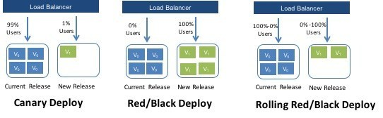
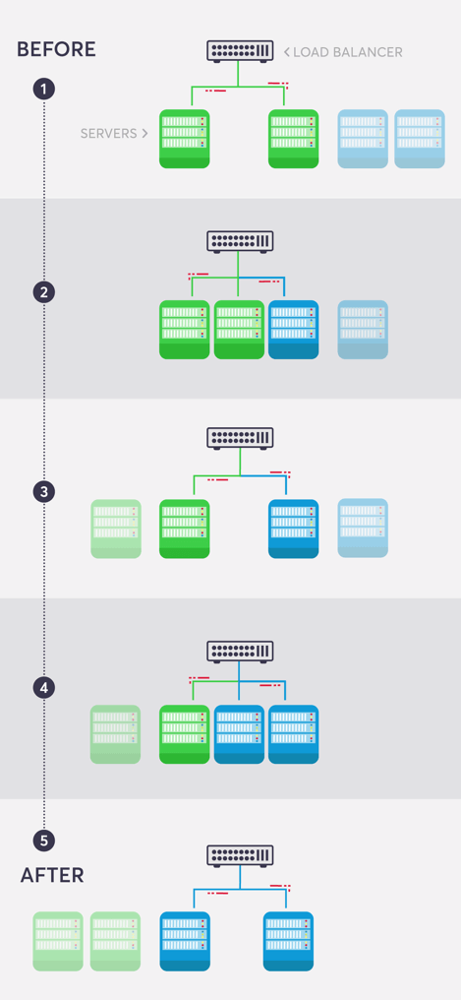

###### [Home](https://github.com/RyKaj/Documentation/blob/master/README.md) | [DevOps](https://github.com/RyKaj/Documentation/tree/master/DevOps/README.md) |
------------

# Continuous Deployment - Advance Deployment Patterns
  

## Rolling Deployments

Rolling deployments are a pattern whereby, instead of deploying a package to all servers at once, we slowly roll out the release by deploying it to each server one-by-one. In load balanced scenarios, this allows us to reduce overall downtime.

Normally, when executing a deployment process with multiple steps, Octopus runs all of the steps **sequentially**; it waits for the first step to finish before starting the second, and so on.

When a single step targets multiple machines, the step is run on those machines **in parallel**. So to recap:

*   Deployment steps are run in sequence
*   The actions performed by each step are performed in parallel on all deployment targets

However, sometimes this isn't desired. If you are deploying to a farm of 10 web servers, it might be nice to deploy to one machine at a time, or to batches of machines at a time. This is called a **rolling deployment**.

## Guided Failures

When deployments encounter errors, they will typically fail. However, the **guided failure** mode provides an option to prompt a user to intervene when a deployment encounters an error so that the deployment can continue. With guided failure mode enabled, the user can fail the process, and retry or ignore any steps that failed the first time.

### Blue Green Deployments

"Blue-green deployment is a technique that reduces downtime and risk by running two identical production environments called Blue and Green."- cloudfoundry. Could not have said it better myself. Two environments, both production. One might have version 1.0.0 (green) while blue has 1.0.1. Many times traffic is slowly increased to blue while watching for errors or undesirable changes in user behavior. Once all the traffic is moved off from the green (1.0.0) version the environment is shut down. At that point "blue" becomes "green" and the cycle starts over.

The **blue-green deployment** approach does this by ensuring you have two production environments, as identical as possible. At any time one of them, let's say blue for the example, is live. As you prepare a new release of your software you do your final stage of testing in the green environment. Once the software is working in the green environment, you switch the router so that all incoming requests go to the green environment - the blue one is now idle.

In a blue-green deployment model, the production environment changes with each release:

<kbd>  </kbd>
<kbd>  </kbd>

As well as reducing downtime, Blue-Green can be a powerful way to use extra hardware compared to having a dedicated staging environment:

*   Staging: when blue is active, green becomes the staging environment for the next deployment.
*   Rollback: we deploy to blue and make it active. Then a problem is discovered. Since green still runs the old code, we can roll back easily.
*   Disaster recovery: after deploying to blue and we're satisfied that it is stable, we can deploy the new release to green too. This gives us a standby environment ready in case of disaster.

Blue-green deployment also gives you a rapid way to rollback - if anything goes wrong you switch the router back to your blue environment. There's still the issue of dealing with missed transactions while the green environment was live, but depending on your design you may be able to feed transactions to both environments in such a way as to keep the blue environment as a backup when the green is live. Or you may be able to put the application in read-only mode before cut-over, run it for a while in read-only mode, and then switch it to read-write mode. That may be enough to flush out many outstanding issues.

The two environments need to be different but as identical as possible. In some situations they can be different pieces of hardware, or they can be different virtual machines running on the same (or different) hardware. They can also be a single operating environment partitioned into separate zones with separate IP addresses for the two slices.

Once you've put your green environment live and you're happy with its stability, you then use the blue environment as your staging environment for the final testing step for your next deployment. When you are ready for your next release, you switch from green to blue in the same way that you did from blue to green earlier. That way both green and blue environments are regularly cycling between live, previous version (for rollback) and staging the next version.

An advantage of this approach is that it's the same basic mechanism as you need to get a hot-standby working. Hence this allows you to test your disaster-recovery procedure on every release. (I hope that you release more frequently than you have a disaster.)

The fundamental idea is to have two easily switchable environments to switch between, there are plenty of ways to vary the details. One project did the switch by bouncing the web server rather than working on the router. Another variation would be to use the same database, making the blue-green switches for web and domain layers.

Databases can often be a challenge with this technique, particularly when you need to change the schema to support a new version of the software. The trick is to separate the deployment of schema changes from application upgrades. So first apply a [database refactoring](https://martinfowler.com/books/refactoringDatabases.html) to change the schema to support both the new and old version of the application, deploy that, check everything is working fine so you have a rollback point, then deploy the new version of the application. (And when the upgrade has bedded down remove the database support for the old version.)

Blue-green releasing is simpler and faster.

You _can_ do a blue-green release if you’ve tested the new version in a testing environment and are very certain that the new version will function correctly in production. Always using [feature toggles](http://martinfowler.com/bliki/FeatureToggle.html) is a good way to increase your confidence in a new version, since the new version functions exactly like the old until someone flips a feature toggle. Breaking your application into small, independently releasable services is another since there is less to test and less that can break.

You _need to_ do a _canary release_ if you’re not completely certain that the new version will function correctly in production. Even if you are a thorough tester, the Internet is a large and complex place and is always coming up with unexpected challenges. Even if you use feature toggles, one might be implemented incorrectly.

Deployment automation takes effort, so most organizations will plan to use one strategy or the other every time.

So do blue-green deployment if you’re committed to practices that allow you to be confident in doing so. Otherwise, send out the canary.

The essence of blue-green is deploying all at once and the essence of canary deployment is deploying incrementally, so given a single pool of users I can’t think of a process that I would describe as doing both at the same time. If you had multiple independent pools of users, e.g. using different regional data centers, you could do blue-green within each data center and canary across data centers. Although if you didn’t need canary deployment within a data center, you probably wouldn’t need it across data centers.

## Best Practices

### Choose Load Balancing Over DNS Switching

When switching between environments, you need to make your domain to eventually point to different servers. Don’t go to the [DNS](https://www.blazemeter.com/blog/how-use-static-hosting-feature-jmeter-32?utm_source=blog&utm_medium=BM_blog&utm_campaign=five-blue-green-deployment-best-practices-for-a-smooth-release) records and make changes in the DNS management interface. It can take browsers a long time, even hours, until they get the new IP address. This is called “propagation time” and it will result in a long traffic “tail” (clients still addressing the old servers) to your previous environment . This means that some of your users will still be served by the old environment, and that you are not in full control where your traffic is routed to.

Instead, use load balancing. Load balancers enable you to set your new servers immediately, without having to depend on the DNS mechanism. The DNS record will always point to the Load Balancer - and you only change the servers behind it. This way you can be absolutely sure that all traffic comes to the new production environment instead of the old one.

### Execute a Rolling Update

Switching all your servers from an old version to a new one at once may result in downtime.  
To avoid that, you can execute a “rolling update”. This means that instead of switching from all Blue servers to all Green servers in a single cut-off, you can work with an integrated environment. Add one new server, retire one old server, and repeat this until all the new servers are inside (see image below):

One thing to make sure though, is that your new code can run alongside your old code, because they will be running together side-by-side (see more on backward and forward compatibility below).

Note that you will need to use connection draining on your Load Balancer so requests processed by the old servers will have a chance to finalize before the old server is disconnected.

### Monitor Your Environments With the Correct Alerts

Monitoring production is obvious, but monitoring the the non-production environment is also important - you want to catch those issues before they reach production, right? However, the non-production monitoring is less critical - you don’t want to wake up at night because of an issue on this environment, you just want to be aware of it the next morning.

Since the same environment can play both as production and non-production - you will need an easy way to toggle the [alerting](https://www.blazemeter.com/blog/how-incorporate-slack-alerts-your-development-process?utm_source=blog&utm_medium=BM_blog&utm_campaign=five-blue-green-deployment-best-practices-for-a-smooth-release) between the two states. This can be achieved by using a different [API](https://www.blazemeter.com/api-testing?utm_source=blog&utm_medium=BM_blog&utm_campaign=five-blue-green-deployment-best-practices-for-a-smooth-release) token for production/non-production reporting to your APM solution, or by programmatically changing the alert policy on the APM of an environment when its role changed.

### Automate, Automate, Automate

Script as many actions as possible in the switch process, instead of doing manual set of actions.

This has huge benefits:

*   **Quicker** - the switch will happen faster if its steps are automated
*   **Easier** - nothing needs to be remembered - just press a button
*   **Safer** - manual work is more error prone
*   **Enables self-service** - having a switch button running an automated script enables everyone with the right permissions to do it, without being dependant on someone that knows the exact steps that need to take place.

### Make Your Code Backward and Forward Compatible

Because new and old versions are going to run side-by-side during the switch process, it is important to make sure both versions can co-exist. Take a database schema change for example; in many cases the same code will not be able to work with an altered schema.

In order to avoid downtime, you can break the update into a few “mini-updates”. For example, let’s say you’re changing a database field name from “user\_name” to “username”.

This type of release will require the following steps:

*   Release an intermediate version of the code, that can find and work with both “user\_name” and “username” with some logic around it.
*   Run data migration - rename the field to “username” across the all records/documents in the database (this can take seconds or days, it depends on the the dataset size)
*   Release the final version of the code, supporting only “username”, and remove completely the old code supporting “user\_name”.

#### Blue Green and Red Black Deployment

Then deploying new versions of a centralized application like a web service, there is a strategy you can use to direct production traffic to the new version only after it has been successfully deployed and optionally tested. This strategy goes by the name blue/green or red/black, with each color representing a copy of the target environment. Traffic is routed to one color or the other (or potentially both in a canary deployment or during A/B testing, but that's a story for another time). Having two environments running side by side hosting different versions of an application means traffic can be switched over, and back again if an issue is found, with little to no downtime.

So why is this strategy referred to as both green/blue and red/black? Do these colors imply technical differences? In blue-green deployment, both versions may be getting requests at the same time temporarily, while in red-black only one of the versions is getting traffic at any point in time

But red-black deployment is a newer term being used by Netflix, Istio, and other frameworks/platforms that support container orchestration

Netflix treats blue/green and red/black as the same thing. The documentation even includes a nice diagram colored in blue and green to drive the point home.

<kbd> </kbd>

#### A/B Testing

A/B testing is **NOT** blue-green deployments. I’ve run into groups that mistake this. A/B testing is a way of _testing features in your application_ for various reasons like usability, popularity, noticeability, etc, and how those factors influence the bottom line. It’s usually associated with UI parts of the app, but of course, the backend services need to be available to do this. You can implement this with application-level switches (ie, smart logic that knows when to display certain UI controls), static switches (in the application), and also use Canary releases (as discussed below).

A/B testing (also known as _[split testing](https://www.optimizely.com/optimization-glossary/split-testing/)_ or _[bucket testing](https://www.optimizely.com/optimization-glossary/bucket-testing/)_) is a method of comparing two versions of a webpage or app against each other to determine which one performs better. AB testing is essentially an experiment where two or more variants of a page are shown to users at random, and statistical analysis is used to determine which variation performs better for a given conversion goal.

The number of visitors on your website equals the number of opportunities you have to expand your business by acquiring new customers and build relationships by catering to existing ones. And it is your conversion funnel that decides whether your website gets good traffic and if it converts more visitors. Businesses want visitors to take an action (also called a conversion) on their website and the rate at which a website can drive this is called its "conversion rate". The more optimized your funnel, higher is the visitors’ chance to convert.

One way to optimize your website’s funnel is A/B testing. A/B testing (also sometimes referred to as split testing) is the practice of showing 2 variants of the same web page to different segments of visitors at the same time and comparing which variant drives more conversions. Typically, the one that gives higher conversions is the winning variant, applying which can help you optimize your site for better results.

  
<kbd> </kbd>

The difference between blue-green deployments and A/B testing is A/B testing is for measuring functionality in the app. Blue-green deployments are about releasing new software safely and rolling back predictably. You can obviously combine them: use blue-green deployments to deploy new features in an app that can be used for A/B testing.

The number of visitors on your website equals the number of opportunities you have to expand your business by acquiring new customers and build relationships by catering to existing ones. And it is your conversion funnel that decides whether your website gets good traffic and if it converts more visitors. Businesses want visitors to take an action (also called a conversion) on their website and the rate at which a website can drive this is called its "conversion rate". The more optimized your funnel, higher is the visitors’ chance to convert.

One way to optimize your website’s funnel is A/B testing. A/B testing (also sometimes referred to as split testing) is the practice of showing 2 variants of the same web page to different segments of visitors at the same time and comparing which variant drives more conversions. Typically, the one that gives higher conversions is the winning variant, applying which can help you optimize your site for better results.

#### A/B Testing Works

In an A/B test, you take a webpage or app screen and modify it to create a second version of the same page. This change can be as simple as a single headline or button, or be a complete redesign of the page. Then, half of your traffic is shown the original version of the page (known as the control) and half are shown the modified version of the page (the variation).

<kbd> </kbd>

As visitors are served either the control or variation, their engagement with each experience is measured and collected in an analytics dashboard and analyzed through a statistical engine.  You can then determine whether changing the experience had a positive, negative, or no effect on visitor behavior.

  

## Canary Release

  

Canary release is a technique to reduce the risk of introducing a new software version in production by slowly rolling out the change to a small subset of users before rolling it out to the entire infrastructure and making it available to everybody.

Similar to a [Blue-Green Deployment](https://martinfowler.com/bliki/BlueGreenDeployment.html), you start by deploying the new version of your software to a subset of your infrastructure, to which no users are routed.

A way of sending out a new version of your app into production that plays the role of a “canary” to get an idea of how it will perform (integrate with other apps, CPU, memory, disk usage, etc). It’s another release strategy that can mitigate the fact that regardless of the immense level of testing you do in lower environments you will still have some bugs in production. Canary releases let you test the waters before pulling the trigger on a full release.

<kbd> </kbd>

The faster feedback you get, the faster you can fail the deployment, or proceed cautiously. For some of the same reasons as the blue-green deployments, be careful of things above to watch out for; ie, database changes can still trip you up.

  

<kbd> </kbd>

When you are happy with the new version, you can start routing a few selected users to it. There are different strategies to choose which users will see the new version: a simple strategy is to use a random sample; some companies choose to release the new version to their internal users and employees before releasing to the world; another more sophisticated approach is to choose users based on their profile and other demographics.

<kbd> </kbd>

As you gain more confidence in the new version, you can start releasing it to more servers in your infrastructure and routing more users to it. A good practice to rollout the new version is to repurpose your existing infrastructure using [PhoenixServers](https://martinfowler.com/bliki/PhoenixServer.html) or to provision new infrastructure and decommission the old one using [ImmutableServers](https://martinfowler.com/bliki/ImmutableServer.html).

Canary release is an application of [ParallelChange](https://martinfowler.com/bliki/ParallelChange.html), where the migrate phase lasts until all the users have been routed to the new version. At that point, you can decomission the old infrastructure. If you find any problems with the new version, the rollback strategy is simply to reroute users back to the old version until you have fixed the problem.

<kbd> </kbd>

A benefit of using canary releases is the ability to do capacity testing of the new version in a production environment with a safe rollback strategy if issues are found. By slowly ramping up the load, you can monitor and capture metrics about how the new version impacts the production environment. This is an alternative approach to creating an entirely separate capacity testing environment, because the environment will be as production-like as it can be.

Although the name for this technique might not be familiar [\[1\]](https://martinfowler.com/bliki/CanaryRelease.html#footnote-origin), the practice of canary releasing has been adopted for some time. Sometimes it is referred to as a **phased rollout** or an **incremental rollout**.

In large, distributed scenarios, instead of using a router to decide which users will be redirected to the new version, it is also common to use different partitioning strategies. For example: if you have geographically distributed users, you can rollout the new version to a region or a specific location first; if you have multiple brands you can rollout to a single brand first, etc. Facebook chooses to use a strategy with multiple canaries, the first one being visible only to their internal employees and having all the [FeatureToggles](https://martinfowler.com/bliki/FeatureToggle.html) turned on so they can detect problems with new features early.

<kbd> </kbd>

Canary releases can be used as a way to implement A/B testing due to similarities in the technical implementation. However, it is preferable to avoid conflating these two concerns: while canary releases are a good way to detect problems and regressions, A/B testing is a way to test a hypothesis using variant implementations. If you monitor business metrics to detect regressions with a canary [\[2\]](https://martinfowler.com/bliki/CanaryRelease.html#footnote-cluster-immune-system), also using it for A/B testing could interfere with the results. On a more practical note, it can take days to gather enough data to demonstrate statistical significance from an A/B test, while you would want a canary rollout to complete in minutes or hours.

One drawback of using canary releases is that you have to manage multiple versions of your software at once. You can even decide to have more than two versions running in production at the same time, however it is best to keep the number of concurrent versions to a minimum.

Another scenario where using canary releases is hard is when you distribute software that is installed in the users' computers or mobile devices. In this case, you have less control over when the upgrade to the new version happens. If the distributed software communicates with a backend, you can use [ParallelChange](https://martinfowler.com/bliki/ParallelChange.html) to support both versions and monitor which client versions are being used. Once the usage numbers fall to a certain level, you can then contract the backend to only support the new version.

Managing database changes also requires attention when doing canary releases. Again, using [ParallelChange](https://martinfowler.com/bliki/ParallelChange.html) is a technique to mitigate this problem. It allows the database to support both versions of the application during the rollout phase.

## Kubernetes

Containers provide a best way to bundle and run your applications. Containers allow developers to easily deploy any image in OS. In production management, you need containers that run the applications without any downtime. For instance, if one container goes down, another container needs to restart. To handle this kind of instance Kubernetes comes into existence

Kubernetes is  basically an open-source system which allows you to run containers, manage them, automate and scale deploys, deploy stateful and stateless applications and many other things. It is designed to grow from tens, thousand and millions of containers. Usually, you can launch one (or) more instances and install Kubernetes to operate them as a single cluster. Kubernetes can utilize the resources to a maximum extent. It can manage the Rocket Containers today.

Used as a platform for automating deployment, scaling, and management of containerized applications. There are several ways to set up a Kubernetes cluster, but for simplicity.

  
### How it works

<kbd> </kbd>

It's no secret that the popularity of running [containerized applications](https://www.redhat.com/en/topics/containers/whats-a-linux-container) has exploded over the past several years. Being able to iterate and release an application by provisioning its dependencies through code is a big win. [According to Gartner](https://www.gartner.com/smarterwithgartner/6-best-practices-for-creating-a-container-platform-strategy/), “More than 75% of global organizations will be running containerized applications in production” by 2022.

For organizations that operate at a massive scale, a single Linux container instance isn't enough to satisfy all of their applications’ needs. It's not uncommon for sufficiently complex applications, such as ones that communicate through microservices, to require multiple Linux containers that communicate with each other. That architecture introduces a new scaling problem: how do you manage all those individual containers? Developers will still need to take care of scheduling the deployment of containers to specific machines, managing the networking between them, growing the resources allocated under heavy load, and much more.

Enter Kubernetes, a container orchestration system — a way to manage the lifecycle of containerized applications across an entire fleet. It's a sort of meta-process that grants the ability to automate the deployment and scaling of several containers at once. Several containers running the same application are grouped together. These containers act as replicas, and serve to load balance incoming requests. A container orchestrator, then, supervises these groups, ensuring that they are operating correctly.

In Kubernetes, there is a master node and multiple worker nodes, each worker node can handle multiple pods. Pods are just a bunch of containers clustered together as a working unit. You can start designing your applications using pods. Once your pods are ready, you can specify pod definitions to the master node, and how many you want to deploy. From this point, Kubernetes is in control. It takes the pods and deploys them to the worker nods.

If a worker node goes down, Kubernetes starts new pods on a functioning worker node. This makes the process of managing the containers easy and simple. It makes it easy to build and add more features and improving the application to attain higher customer satisfaction. Finally, no matter what technology you’re invested in, Kubernetes can help you.

  

<kbd>  </kbd>
<kbd>  </kbd>

A container orchestrator is essentially an administrator in charge of operating a fleet of containerized applications. If a container needs to be restarted or acquire more resources, the orchestrator takes care of it for you.

That's a fairly broad outline of how most container orchestrators work. Let's take a deeper look at all the specific components of Kubernetes that make this happen.

### Containers Change How we Deploy Software

In the old days, software deployment was hard, time-consuming, and error-prone. To install an application, you need to purchase a number of physical machines and pay for CPU and memory than you might actually need. A few years later, virtualization was dominant. This saved you some costs as one powerful bare-metal server can host multiple machines. Thus, CPU and memory could be shared. In modern days, machines can be split into even smaller parts than virtual servers: **containers**. Containers became so popular only a few years ago. So, what exactly is a Linux container? And where does Docker fit?

<kbd> </kbd>

A container provides a type of virtualization just like virtual machines. However, while a hypervisor provides a hardware isolation level, containers offer _process_ isolation level. To understand this difference, let’s return to our example.

Instead of creating a virtual machine for Apache and another for MySQL, you decide to use containers. Now, your stack looks like below illustration.

<kbd> </kbd>

A container is nothing but a set of processes on the operating system. A container works in complete isolation from other processes/containers through Linux kernel features, such as [cgroups](https://en.wikipedia.org/wiki/Cgroups), [chroot](https://en.wikipedia.org/wiki/Chroot), [UnionFS](https://en.wikipedia.org/wiki/UnionFS), and [namespaces](https://en.wikipedia.org/wiki/Linux_namespaces),.

This means you’ll only pay for one physical host, install one OS, and run as many containers as your hardware can handle. Reducing the number of operating systems that you need to run on the same host means less storage, memory and CPU wasted.

In 2010, Docker was founded. Docker may refer to both the company and the product. Docker made it very easy for users and companies to utilize containers for software deployment. An important thing to note, though, is that Docker is not the only tool in the market that does this. Other applications exist like [rkt](https://github.com/rkt/rkt), [Apache Mesos](http://mesos.apache.org/), [LXC](https://en.wikipedia.org/wiki/LXC) among others. Docker is just the most popular one.

### Containers and Microservices: The Need For An Orchestrator

The ability to run complete services in the form of processes (a.k.a containers) on the same OS was revolutionary. It brought a lot of possibilities of its own:

*   Because containers are way cheaper and faster than virtual machines, large applications could now be broken down into small, interdependent components, each running in its own container. This architecture became known as [microservices](https://microservices.io/).
*   With the microservices architecture becoming more dominant, applications had more freedom to get larger and richer. Previously, a monolithic application grew till a certain limit where it became cumbersome, harder to debug, and very difficult to be re-deployed. However, with the advent of containers, all what you need to do to add more features to an application is to build more containers/services. With IaC ([Infrastructure as Code](https://en.wikipedia.org/wiki/Infrastructure_as_code)), deployment is as easy as running a command against a configuration file.
*   Today, it is no longer acceptable to have a downtime. The user simply does not care if your application is experiencing a network outage or your cluster nodes crashed. If your system is not running, the user will simply switch to your competitor.
*   Containers are processes, and processes are ephemeral by nature. What happens if a container crashed?
*   To achieve high availability, you create more than one container for each component. For example, two containers for Apache, each hosting a web server. But, which one of them will respond to client requests?
*   When you need to update your application, you want to make use of having multiple containers for each service. You will deploy the new code on a portion of the containers, recreate them, then do the same on the rest. But, it’s very hard to do this manually. Not to mention, it’s error-prone.
*   Container provisioning.
*   Maintaining the state (and number) of running containers.
*   Distribute application load evenly on the hardware nodes by moving containers from one node to the other.
*   Load balancing among containers that host the same service.
*   Handling container persistent storage.
*   Ensuring that the application is always available even when rolling out updates.

All the above encourages IT professionals to do one thing: create as many containers as possible. However, this also has its drawbacks:

You use containers to make the best use of the hardware at hand. However, with so many containers dispersed on your nodes without being managed, your infrastructure may look as shown in below illustration.

<kbd> </kbd>

You need a container orchestrator!

### Kubernetes terminology and architecture

Kubernetes is a Greek word that [stands for helmsman](https://en.wikipedia.org/wiki/Kubernetes) or captain. It is the governor of your cluster, the maestro of the orchestra. To be able to do this critical job, Kubernetes was designed in a highly modular manner. Each part of the technology provides the necessary foundation for the services that depend on it. The illustration below represents a high overview of how the application works. Each module is contained inside a larger one that relies on it to function. Let’s dig deeper into each one of these.

Let’s now have an overview of the landscape of Kubernetes as a system.

<kbd> </kbd>

Kubernetes Core Features

Also referred to as the control plane, it is the most basic part of the whole system. It offers a number of [RESTful](https://en.wikipedia.org/wiki/Representational_state_transfer) APIs that enable the cluster to do its most basic operations. The other part of the core is _execution_. Execution involves a number of controllers like [replication controller](https://kubernetes.io/docs/concepts/workloads/controllers/replicationcontroller/), [replicaset](https://kubernetes.io/docs/concepts/workloads/controllers/replicaset/), [deployments](https://kubernetes.io/docs/concepts/workloads/controllers/deployment/)...etc. It also includes the [kubelet](https://kubernetes.io/docs/reference/command-line-tools-reference/kubelet/), which is the module responsible for communicating with the container runtime.

The core is also responsible for contacting other layers (through kubelet) to fully manage containers. Let’s have a brief look at each of them:

  
### Container Runtime

Kubernetes uses [Container Runtime Interface](https://kubernetes.io/blog/2016/12/container-runtime-interface-cri-in-kubernetes/) **(CRI)** to transparently manage your containers without necessarily having to know (or deal with) the runtime used. When we discussed containers, we mentioned that Docker, despite its popularity, is not the only container management system available. Kubernetes uses [containerd](https://containerd.io/) (pronounced _container d_) by default as a container runtime. This is how you are able to issue standard Docker commands against Kubernetes containers. It also uses **rkt** as an alternative runtime. Don’t be too confused at this part. This is the very inner workings of Kubernetes that, although you need to understand, you won’t have to deal with almost entirely. Kubernetes abstracts this layer through its rich set of APIs.

### The Network Plugin

As we discussed earlier, a container orchestration system is responsible (among other things) for managing the network through which containers and services communicate. Kubernetes uses a library called [Container Network Interface](https://github.com/containernetworking/cni) **(CNI)** as an interface between the cluster and various network providers. There are a number of network providers that can be used in Kubernetes. This number is constantly changing. To name a few:

*   [Weave net](https://www.weave.works/oss/net/)
*   [Contiv](https://contiv.io/)
*   [Flannel](https://github.com/coreos/flannel/)
*   [Calico](https://www.projectcalico.org/calico-networking-for-kubernetes/)

The list is too long to mention here. You might be asking: why does Kubernetes need more than one networking provider to choose from? Kubernetes was designed mainly to be deployed in diverse environments. A Kubernetes node can be anything from a bare metal physical server, a virtual machine, or a cloud instance. With such diversity, you have a _virtually_ endless number of options for how your containers will communicate with each other. This requires more than one to choose among. That is why Kubernetes designers chose to abstract the network provider layer behind CNI.

## The Volume Plugin

A volume broadly refers to the storage that will be availed for the [pod](https://kubernetes.io/docs/concepts/workloads/pods/pod/). A pod is one or more containers managed by Kubernetes as one unit. Because Kubernetes was designed to be deployed in multiple environments, there is a level of abstraction between the cluster and the underlying storage. Kubernetes also uses the CSI ([Container Storage Interface](https://github.com/container-storage-interface/spec)) to interact with various storage plugins that are already available.

## Image Registry

Kubernetes must contact an image registry (whether public or private) to be able to pull images and spin out containers.

## Cloud Provider

Kubernetes can be deployed on almost any platform you may think of. However, the majority of users resort to cloud providers like AWS, Azure, or GCP to save even more costs. Kubernetes depends on the cloud provider APIs to perform scalability and resources provisioning tasks, such as provisioning load balancers, accessing cloud storage, utilizing the inter-node network and so on.

## Identity Provider

If you’re provisioning a Kubernetes cluster in a small company with a small number of users, authentication won’t be a big issue. You can create an account for each user and that’s it. But, if you’re working in a large enterprise, with hundreds or even thousands of developers, operators, testers, security professionals...etc. then having to manually create an account for each person may quickly turn into a nightmare. Kubernetes designers had that in mind when working on the authentication mechanism. You can use your own identity provider system to authenticate your users to the cluster as long as it uses [OpenID connect](https://openid.net/connect/).

## Kubernetes Controllers Layer

This is also referred to as the service fabric layer. It is responsible for some higher level functions of the cluster: routing, self-healing, load balancing, service discovery, and basic deployment(for more info, [https://kubernetes.io/docs/concepts/services-networking](https://kubernetes.io/docs/concepts/services-networking/), and [https://kubernetes.io/docs/concepts/workloads/controllers/deployment](https://kubernetes.io/docs/concepts/workloads/controllers/deployment/) ), among other things.

## Management Layer

This is where policy enforcement options are applied. In this layer, functions like metrics collection, and autoscaling are performed. It also controls authorization, and quotas among different resources like the network and storage. You can learn more about resource quotas [here](https://kubernetes.io/docs/concepts/policy/resource-quotas/).

## The Interface Layer

In this layer, we have the client-facing tools that are used to interact with the cluster. [kubectl](https://kubernetes.io/docs/reference/kubectl/overview/) is the most popular client-side program out there. Behind the scenes, it issues RESTful API requests to Kubernetes and displays the response either in JSON or YAML depending on the options provided. _kubectl_ can be easily integrated with other higher level tools to facilitate cluster management.

In the same area, we have [helm](https://helm.sh/), which can be thought of as an application package manager running on top of Kubernetes. Using **helm-charts**, you can build a full application on Kubernetes by just defining its properties in a configuration file.

## The DevOps and Infrastructure Environment

Kubernetes is one of the busiest open-source projects out there. It has a large, vibrant community and it’s constantly changing to adapt to new requirements and challenges. Kubernetes provides a tremendous number of features. Although it is only a few years old, it is able to support almost all types of environments. Kubernetes is used in many modern software building/deployment practices including:

*   [DevOps](https://en.wikipedia.org/wiki/DevOps)**:** provisioning ephemeral environments for testing and QA is easier and faster.
*   [CI/CD](https://en.wikipedia.org/wiki/CI/CD)**:** building continuous integration/deployment, and even delivery pipelines is more seamless using Kubernetes-managed containers. You can easily integrate tools with the Kubernetes cluster to build/test/deploy your applications and other cloud components.
*   [ChatOps](https://www.atlassian.com/blog/software-teams/what-is-chatops-adoption-guide)**:** chat applications like [Slack](https://slack.com/) can easily be integrated with the rich API set provided by Kubernetes to monitor and even manage the cluster.
*   Cloud-managed Kubernetes: Most cloud providers offer products that already has Kubernetes installed.
*   [GitOps](https://github.com/weaveworks/flux): Everything in Kubernetes is managed through code (YAML files). Using version control systems like [Git](https://git-scm.com/), you can easily manage your cluster through pull requests. You don’t even have to use _kubectl_.

  

Kubernetes introduces a lot of vocabulary to describe how your application is organized. We'll start from the smallest layer and work our way up.

### Pods

A Kubernetes pod is a group of containers, and is the smallest unit that Kubernetes administers. Pods have a single IP address that is applied to every container within the pod. Containers in a pod share the same resources such as memory and storage. This allows the individual Linux containers inside a pod to be treated collectively as a single application, as if all the containerized processes were running together on the same host in more traditional workloads. It’s quite common to have a pod with only a single container, when the application or service is a single process that needs to run. But when things get more complicated, and multiple processes need to work together using the same shared data volumes for correct operation, multi-container pods ease deployment configuration compared to setting up shared resources between containers on your own.

<kbd> </kbd>

For example, if you were working on an image-processing service that created GIFs, one pod might have several containers working together to resize images. The primary container might be running the non-blocking microservice application taking in requests, and then one or more auxiliary (side-car) containers running batched background processes or cleaning up data artifacts in the storage volume as part of managing overall application performance.

### Deployments

Kubernetes deployments define the scale at which you want to run your application by letting you set the details of how you would like pods replicated on your Kubernetes nodes. Deployments describe the number of desired identical pod replicas to run and the preferred update strategy used when updating the deployment. Kubernetes will track pod health, and will remove or add pods as needed to bring your application deployment to the desired state.

A deployment in Kubernetes consists of a ReplicaSet with its Pod template. Consider that we have a ReplicaSet “A” with V1 of our app. And we want to deploy V2. We can update the ReplicaSet to use the new version of our container, but this will cause all V1 Pods to be killed immediately at the time we are provisioning the new V2 Pods. If we don’t want to disrupt our service like that, we create a deployment.

<kbd> </kbd>

The deployment will create a new ReplicaSet B of the V2 template with only 1 instance. And once this instance got created, it will scale down ReplicaSet A by 1 instance, and will keep doing that scaling up B and scaling down A, until B is fully populated and healthy and A reaches 0 instances. This is called rolling update deployment and helps keeping the old version of the service running while the new version is being provisioned.

### Services

The lifetime of an individual pod cannot be relied upon; everything from their IP addresses to their very existence are prone to change. In fact, within the DevOps community, there’s the notion of treating servers as either “pets” or “cattle.” A pet is something you take special care of, whereas cows are viewed as somewhat more expendable. In the same vein, Kubernetes doesn’t treat its pods as unique, long-running instances; if a pod encounters an issue and dies, it’s Kubernetes’ job to replace it so that the application doesn’t experience any downtime.

A service is an abstraction over the pods, and essentially, the only interface the various application consumers interact with. As pods are replaced, their internal names and IPs might change. A service exposes a single machine name or IP address mapped to pods whose underlying names and numbers are unreliable. A service ensures that, to the outside network, everything appears to be unchanged.

<kbd> </kbd>

A service provides a permanent IP and DNS name for a group of Pods. So if your web application exposes port 80 on 2 Pods. You should create a service named “WebServer” for example with port 80, this service will have its own IP inside the cluster that will not change by changing the Pods inside, and will have a DNS name that will be accessible inside the cluster network and will forward traffic (TCP, http or any protocol) to the underlying Pods.

A service refers to the backend Pods by using labels, as per the earlier example a service with label app=website will route traffic to all Pods having this label. This will allow other services inside the cluster to access [http://WebServer:80/](http://webserver/) to reach any Pod inside that group without caring about where they are hosted, their IPs and how many are they.

Services simplify network communications for a microservices architected solution.

### Nodes

A Kubernetes node manages and runs pods; it's the machine (whether virtualized or physical) that performs the given work. Just as pods collect individual containers that operate together, a node collects entire pods that function together. When you're operating at scale, you want to be able to hand work over to a node whose pods are free to take it.

### Master Server

This is the main entry point for administrators and users to manage the various nodes. Operations are issued to it either through HTTP calls or connecting to the machine and running command-line scripts.

### Cluster

A cluster is all of the above components put together as a single unit. Consists of nodes (real machines or VMs). One or more of these nodes are master(s) which control the others.

<kbd> </kbd>

Each node has an app called **kubelet** that communicates to the cluster master node, take commands and controls the containers running inside the node. Each node also uses **docker** to run the containers.

The master node, has a kubelet plus an API server which provides REST APIs to control objects in Kubernetes. Then as a user who wants to run something, you use an app called **kubectl** which is a client command line tool that runs on your PC and allows you to submit commands to the Kubernetes APIs. We will go into more details about kubectl in the next post.

One more thing to note before moving from here, is that each node in the cluster obviously has an IP address, MAC address and can communicate together and with external network/internet. This is the external network of cluster. On the other hand, inside the cluster there is an internal virtual network. That will assign a different space of network IPs to the containers inside. The internal cluster network, allows different containers to communicate with each other using internal IPs. And if they want to expose services to the outside world, we must use something to expose that, coming shortly.

ReplicaSets

A ReplicaSet is a Kubernetes controller, which runs in the background and makes sure that there are specific number of Pods running from a specific application. For example we need a web application to have 2 instances running at the same time. This means we will create a ReplicaSet with a Pod template that runs our web application container, and tells the ReplicaSet that we need 2 instances. Once we defined this in Kubernetes as the **desired state** (you will hear this word a lot), the ReplicaSet will now create 2 Pods using this template, and it will keep monitoring if one of them goes down for any reason, it will kill it and will create a new Pod instead. Whenever you need to scale this web application to 3 instances, you will modify the ReplicaSet number of replicas property which indicates the desired state and the ReplicaSet will always try to achieve this state by provisioning new Pods or removing Pods.

Note that ReplicaSets are only concerned about deploying, monitoring and scaling Pods.

## Kubernetes components

With a general idea of how Kubernetes is assembled, it's time to take a look at the various software components that make sure everything runs smoothly. Both the master server and individual worker nodes have three main components each.

When you deploy Kubernetes, you get a cluster.  A cluster may be a set of machines, called nodes, that run containerized applications managed by Kubernetes. A cluster has at least one worker node and one master node

The worker node(s) host the pods that are the components of the application. The master node(s) deals with the worker nodes and the pods in the cluster. Various master nodes are utilized to provide a cluster with failover and high accessibility.

Here’s a diagram of a Kubernetes cluster with all the components tied together.

<kbd> </kbd>

Master components provide the cluster’s control plane. Master components make global decisions about the cluster (for example, scheduling), and that they detect and answer cluster events (for example, beginning a replacement pod when a deployment’s _replicas_ field is unsatisfied).

Master components are often run on any machine within the cluster. However, for simplicity, found out scripts typically start all master components on an equivalent machine, and don’t run user containers on this machine. See Building High-Availability Clusters, for instance, multi-master-VM setup.

These master components comprise a master node:

*   **Kube-API server.** Exposes the API.
*   **Etcd.** Key-value stores all cluster data. (Can be run on the same server as a master node or on a dedicated cluster.)
*   **Kube-scheduler.** Schedules new pods on worker nodes.
*   **Kube-controller-manager.** Runs the controllers.
*   **Cloud-controller-manager.** Talks to cloud providers.

Node components run on every node, maintaining running pods and providing the Kubernetes runtime environment.

*   **Kubelet.** The agent that ensures containers in a pod is running.
*   **Kube-proxy.** Keeps network rules and perform forwarding.
*   **Container runtime.** Runs containers.

  

## Master server components

### API Server

The API server exposes a REST interface to the Kubernetes cluster. All operations against pods, services, and so forth, are executed programmatically by communicating with the endpoints provided by it.

### Scheduler

The scheduler is responsible for assigning work to the various nodes. It keeps watch over the resource capacity and ensures that a worker node’s performance is within an appropriate threshold.

### Controller Manager

The controller-manager is responsible for making sure that the shared state of the cluster is operating as expected. More accurately, the controller manager oversees various controllers which respond to events (e.g., if a node goes down).

### Worker node components

#### Kubelet

A Kubelet tracks the state of a pod to ensure that all the containers are running. It provides a heartbeat message every few seconds to the master server. If a replication controller does not receive that message, the node is marked as unhealthy.

#### Kube Proxy

The Kube proxy routes traffic coming into a node from the service. It forwards requests for work to the correct containers.

####  etcd

[etcd](https://coreos.com/etcd/docs/latest/) is a distributed key-value store that Kubernetes uses to share information about the overall state of a cluster. Additionally, nodes can refer to the global configuration data stored there to set themselves up whenever they are regenerated.

## What happens when you create a Pod on a Kubernetes Cluster?

In a matter of seconds, the Pod is up and running on one of the cluster nodes. However, a lot has happened within those seconds. Let’s see:

1.  While scanning the [API server](https://kubernetes.io/docs/reference/command-line-tools-reference/kube-apiserver/) (which it is continuously doing), the [Kubernetes Scheduler](https://kubernetes.io/docs/concepts/scheduling/kube-scheduler/) detects that there is a new Pod without a nodeName parameter. The nodeName is what shows which node should be owning this Pod.
2.  The Scheduler selects a suitable node for this Pod and updates the Pod definition with the node name (though the nodeName parameter).
3.  The [kubelet](https://kubernetes.io/docs/reference/command-line-tools-reference/kubelet/) on the chosen node is notified that there is a pod that is pending execution.
4.  The kubelet executes the Pod, and the latter starts running on the node.

## How Kubernetes Selects the Right node?

Perhaps the hardest part of the above steps is when the Scheduler decides which node it should select for running the pod. Indeed, this part takes the most work as there are several algorithms that the Scheduler must use to make this decision. Some of those algorithms depend on user-supplied options, while Kubernetes itself calculates others. They can be explained like a set of questions that the Scheduler asks the node to decide it.

### Do you have what it takes to run this pod (predicate)?

A node may be overloaded with so many busy pods consuming most of its CPU and memory. So, when the scheduler has a Pod to deploy, it determines whether or not the node has the necessary resources. If a Pod was deployed to a node that does not have enough memory (for example) that the Pod is requesting, the hosted application might behave unexpectedly or even crash.

Sometimes, the user needs to make this decision on behalf of Kubernetes. Let’s say that you’ve recently purchased a couple of machines equipped with SSD disks, and you want to use them explicitly for the MongoDB part of the application. To do this, you select the nodes through the node labels in the pod definition. When a node does not match the provided label, it is not chosen for deploying the Pod.

<kbd> </kbd>

As demonstrated in the above graph, the predicate decision resolves to either True (yes, deploy the pod on that node) or False (no, don’t deploy on that one).

## Are you a better candidate for having this pod (priorities)?

In addition to true/false decisions a.k.a predicates, the scheduler executes some calculations (or functions) to determine which node is more suited to be hosting the pod in question.

For example, a node where the pod image is already present (like it’s been pulled before in a previous deployment) has a better chance of having the pod scheduled to it because no time will be wasted downloading the image again.

Another example is when the scheduler favors a node that does not include other pods of the same Service. This algorithm helps spread the Service pods on multiple nodes as much as possible so that one node failure does not cause the entire Service to go down. Such a decision-making method is called the spreading function.

Several decisions, like the above examples, are grouped, and weight is calculated for each node based on the final decision. The node with the highest priority wins the pod deployment.

## The final decision

You may be asking, if there are so many factors that the Kubernetes Scheduler must consider before selecting a node for deploying the pod, how does it get to choose the right one?

1.  Well, the decision process is done as follows:
2.  The scheduler determines all the nodes that it knows they exist and are healthy.
3.  The scheduler runs the predicate tests to filter out nodes that are not suitable. The rest of the nodes form a group of possible nodes.
4.  The scheduler runs priority tests against the possible nodes. Candidates are ordered by their score with the highest ones on the top. At this point, the highest-scoring possible node gets chosen. But sometimes there may be more than one node with the same score.
5.  If nodes have the same score, they are moved to the final list. The Kubernetes Scheduler selects the winning node in a round-robin fashion to ensure that it equally spreads the load among the machines.

## What if that was not the best decision?

In busy Kubernetes Clusters, the time between the Scheduler choosing the right node and the kubelet on that node executing the pod may be sufficient for changes to occur on the nodes. Even if that time is no more than a few milliseconds, a pod may get terminated on one of the nodes that were filtered out due to insufficient memory. That node could’ve had a higher score on the priority test only if it wasn’t overloaded back then. But now, perhaps a less-suitable node was selected for the pod.

Some projects aim at addressing this situation like the Kubernetes Descheduler Project. In this application, the pod is automatically evicted from the node if another node proved to be a better choice for pod-scheduling. The pod is returned to the schedule to deploy it again to the right node.

Perhaps a more difficult situation could occur when the opposite scenario happens. Let’s say that a node was tested against whether or not it could provide 2 GB of memory. At the time the Scheduler was doing the predicate check, the node did have some spare RAM. However, while kubelet is executing the pod against the node, a DaemonSet was deployed to the same node. This DaemonSet entailed some resource-heavy operation that consumed the remaining 2 GB. Now, when the pod tries to run, and since it is missing the amount of memory it requires to function correctly, it fails. If this pod was deployed using just a pod definition, then the application that it runs on would fail to start, and Kubernetes could do nothing about it. However, if this pod was part of a pod controller like a [Deployment](https://kubernetes.io/docs/concepts/workloads/controllers/deployment/) or a [ReplicaSet](https://kubernetes.io/docs/concepts/workloads/controllers/replicaset/), then once it fails, the controller will detect that there is a smaller number of replicas than it should be handling. Accordingly, the controller will request another pod to be scheduled. The Scheduler will run all the checks again and schedules the pod to a different node. This is one of the reasons why it is always advised to use a higher-level object like Deployments when creating pods.

## User-defined decision-making

Earlier in this article, we mentioned that a user could simply choose to run a pod on a specific node using the  [.spec.nodeSelector](https://kubernetes.io/docs/concepts/configuration/assign-pod-node/) parameter in the Pod definition or template. The

nodeSelector selects nodes that have specific one or more labels. However, sometimes, user

requirements get more complicated. A nodeSelector, for example, selects nodes that have all the labels defined in the parameter. What if you want to make a more flexible selection?

## Node Affinity

Let’s consider our earlier example when we wanted to schedule our pod to run on the machines with the SSD disks. Let’s say that we want them also to use the eight-cored hosts. Node affinity allows for flexible decisions like this.

### The requiredDuringSchedulingIgnoredDuringExecution option

There’s a new option here: [requiredDuringSchedulingIgnoredDuringExecution](https://kubernetes.io/docs/concepts/configuration/assign-pod-node/). It’s is easier than it looks. It means that we need to run those pods only on nodes labeled feature=ssd or feature=eight-cores. We don’t want the scheduler to make decisions outside of this set of nodes. This is the same behavior as the nodeSelector but with a more expressive syntax.

### The preferredDuringSchedulingIgnoredDuringExecution option

Let’s say that we’re interested in running the pod on our selected nodes. But, since launching the pod is of an absolute priority, we demand to run it even if the selected nodes are not available. In this case, we can use the [preferredDuringSchedulingIgnoredDuringExecution](https://kubernetes.io/docs/concepts/configuration/assign-pod-node/) option. This option will try to run the pod on the nodes specified by the selector. But if those nodes are not available (failed the tests), the Scheduler will try to run the pod on the next best node.

##  The Node Anti-Affinity

Some scenarios require that you don’t use one or more nodes except for particular pods. Think of the nodes that host your monitoring application. Those nodes shouldn’t have many resources due to the nature of their role. Thus, if other pods than those which have the monitoring app are scheduled to those nodes, they hurt monitoring and also degrades the application they are hosting. In such a case, you need to use node anti-affinity to keep pods away from a set of nodes.

## Nodes taints and Tolerations

While nodes anti-affinity patterns allow you to prevent pods from running on specific nodes, they suffer from a drawback: the pod definition must explicitly declare that it shouldn’t run on those nodes. So, what if a new member joins the development team, writes a Deployment for her application, but forgets to exclude the monitoring nodes from the target nodes? Kubernetes administrators need a way to repel pods from nodes without having to modify every pod definition. That’s the role of [taints and tolerations](https://kubernetes.io/docs/concepts/configuration/taint-and-toleration/).

When you taint a node, it is automatically excluded from pod scheduling. When the schedule runs the predicate tests on a tainted node, they’ll fail unless the pod has toleration for that node.

An important thing to notice, though, is that tolerations may enable a tainted node to accept a pod but it does not guarantee that this pod runs on that specific node. In other words, the tainted node mon01 will be considered as one of the candidates for running our pod. However, if another node has a higher priority score, it will be chosen instead. For situations like this, you need to combine the toleration with nodeSelector or node affinity parameters.

*   The Kubernetes Scheduler is the component in charge of determining which node is most suitable for running pods.
*   It does that using two main decision-making processes:

*   Predicates: which are a set of tests, each of them qualifies to true or false. A node that fails the predicate is excluded from the process.
*   Priorities: where each node is tested against some functions that give it a score. The node with the highest score is chosen for pod deployment.

*   The Kubernetes Scheduler also honors user-defined factors that affect its decision:

*   Node Selector: the .spec.nodeSelector parameter in the pod definition narrows down node selection to those having the labels defined in the nodeSelector.
*   Node affinity and anti-affinity: those are used for greater flexibility in node selection as they allow for more expressive selection criteria. Node affinity can be used to guarantee that only the matching nodes are used or only to set a preference.

*   Taints and tolerations work in the same manner as node affinity. However, their default action is to repel pods from the tainted nodes unless the pods have the necessary tolerations (which are just a key, a value, and an effect). Tolerations are often combined with node affinity or node selector parameters to guarantee that only the matched nodes are used for pod scheduling.

## State of the Pods

### The difference between a Statefulset and a Deployment

A Statefulset is a Kubernetes controller that is used to manage and maintain one or more Pods. However, so do other controllers like ReplicaSets and, the more robust, Deployments. So what does Kubernetes use StatefulSets for? To answer this question, we need to discuss stateless versus stateful applications.

A stateless application is one that does not care which network it is using, and it does not need permanent storage. Examples of stateless apps may include web servers (Apache, Nginx, or Tomcat).

On the other hand, we have stateful apps. Let’s say you have a Solr database cluster that is managed by several Zookeeper instances. For such an application to function correctly, each Solr instance must be aware of the Zookeeper instances that are controlling it. Similarly, the Zookeeper instances themselves establish connections between each other to elect a master node. Due to such a design, Solr clusters are an example of stateful applications. If you deploy Zookeeper on Kubernetes, you’ll need to ensure that pods can reach each other through a unique identity that does not change (hostnames, IPs...etc.). Other examples of stateful applications include MySQL clusters, Redis, Kafka, MongoDB, and others.

Given this difference, Deployment is more suited to work with stateless applications. As far as a Deployment is concerned, Pods are interchangeable. While a StatefulSet keeps a unique identity for each Pod it manages. It uses the same identity whenever it needs to reschedule those Pods.

<kbd> </kbd>

### Exposing a StatefulSet

A Kubernetes Service acts as an abstraction layer. In a stateless application like an Nginx web server, the client does not (and should not) care which pod receives a response to the request. The connection reaches the Service, and it routes it to any backend pod. This is not the case in stateful apps. In the above diagram, a Solr pod may need to reach the Zookeeper master, not any pod. For this reason, part of the Statefulset definition entails a [Headless Service](https://www.magalix.com/blog/kubernetes-services-101-the-pods-interfaces). A Headless Service does not contain a ClusterIP. Instead, it creates several Endpoints that are used to produce DNS records. Each DNS record is bound to a pod. All of this is done internally by Kubernetes, but it’s good to have an idea about how it does it.
### Storage Class

Storage classes are Kubernetes objects that let the users specify which type of storage they need from the cloud provider. Different storage classes represent various service quality, such as disk latency and throughput, and are selected depending on the scenario they are used for and the cloud provider’s support. Persistent Volumes and Persistent Volume Claims use Storage Classes.

### Persistent Volumes and Persistent Volume Claims

Persistent volumes act as an abstraction layer to save the user from going into the details of how storage is managed and provisioned by each cloud provider (in this example, we are using Google GCE). By definition, StatefulSets are the most frequent users of Persistent Volumes since they need permanent storage for their pods.

### Cluster Networking

Kubernetes is a technology that helps you get the most out of your hardware. Containers are deployed on several nodes, making sure that every CPU cycle, every byte of memory, and every block of storage is not wasted. However, this is no easy task. Several challenges must be addressed when designing how the cluster will handle networking among containers:

*   How the same pod containers can communicate with each other. This is handled through the loopback interface. For more information, please refer to our earlier article [Kubernetes pods 101](https://www.magalix.com/blog/kubernetes-pods-101-the-cluster-sailors).
*   How a container can contact a service. This is managed through [Kubernetes Services](https://www.magalix.com/blog/kubernetes-services-101-the-pods-interfaces).
*   How the cluster can receive external traffic. This topic is also covered by [Kubernetes Services](https://www.magalix.com/blog/kubernetes-services-101-the-pods-interfaces).
*   How a pod can contact another pod on the same node or on a different one, which is the main focus of this article.

#### Kubernetes Networking Rules

Kubernetes is a highly modular, open-source project. Several components were left to the community to develop. In particular, implementing a cluster-networking solution must conform to a set of high-level rules. They can be summarized as follows:

*   Pods scheduled on the same node must be able to communicate with other pods without using NAT (Network Address Translation).
*   All system daemons (background processes, for example, [kubelet](https://kubernetes.io/docs/concepts/overview/components/)) running on a particular node can communicate with the pods running on the same node.
*   Pods that use the [host network](https://docs.docker.com/network/host/) must be able to contact all other pods on all other nodes without using NAT. Notice that the host network is only supported on Linux hosts.

To appreciate the simplicity of this design, let’s see how we can manually create a number of containers (using Docker, for example) that will be distributed on a number of physical hosts, and how they can communicate without the Kubernetes design. First, you’ll need to use NAT to ensure that no port collision happens when more than one container tries to use the same port. Let’s say two Apache containers, both are running on port 80. None of those containers can receive traffic by exposing port 80 on the host; as a port collision will occur. This is only possible through NAT. Using NAT means that the container will not communicate through its own IP address or port. Rather, its IP will be hidden behind the NAT IP, and a unique port on the NAT interface (for example, 8080) will forward traffic to port 80 on the container. The second container will use the same NAT IP but with a different port and so on. The following graph depicts how Kubernetes implements its networking model versus the traditional way.

<kbd> </kbd>

So, as you can see Kubernetes eliminates the need for NAT or link containers.

There are a number of networking models that adhere to the above rules. In this article, we’ll select some of them for discussion. But, before listing the different network plugin examples, let’s have a quick overview of some important Kubernetes networking terms.

#### What Is An Overlay Network?

In general, we can define networks as underlay and overlay types:

#### Underlay network

Underlay network is closer to the physical layer. It includes switches, routers, VLANs and so on. It is the basis on which overlay networks are built. It tends to be less scalable due to technical limitations. However, since it’s closer to the actual hardware, it is slightly faster than an overlay.

#### Overlay network

Overlay network refers to the virtual network layer. In this type, you’ll hear terms like veth (virtual eth or virtual network interface), and [VxLAN](https://en.wikipedia.org/wiki/Virtual_Extensible_LAN). It is designed to be highly scalable than the underlying network. For example, while VLANs in the underlying network support only 4096 identifiers, [VxLAN can reach up to 16 million ones](https://whatis.techtarget.com/definition/VXLAN).

Kubernetes supports both networking models, so you can base your model of choice on other factors than whether or not the cluster can handle it.

## What is a Container Network Interface (CNI)?

A CNI is simply a link between the container runtime (like Docker or rkt) and the network plugin. The network plugin is nothing but the executable that handles the actual connection of the container to or from the network, according to a set of rules defined by the CNI. So, to put it simply, a CNI is a set of rules and [Go](https://en.wikipedia.org/wiki/Go_(programming_language)) libraries that aid in container/network-plugin integration.

All of the CNIs can be deployed by simply running a pod or a daemonset that launches and manages their daemons. Let’s have a look now at the most well-known Kubernetes networking solutions.

Calico
------

[Calico](https://www.projectcalico.org/) is a scalable and secure networking plugin. It can be used to manage and secure network policies not only for Kubernetes, but also for containers, virtual machines, and even bare metal servers. Calico works on Layer 3 of the network stack. It works by implementing a vRouter (as opposed to a vSwitch) on each node. Since it is working on L3, it can easily use the Linux kernel’s native forwarding functionality. The _Felix_ agent is responsible for programming L3 Forwarding Information base with the IP addresses of the pods scheduled on the node where it is running.

Calico uses vRouters to allow pods to connect to each other across different nodes using the physical network (underlay). It does not use overlay, tunneling or [VRF tables](https://en.wikipedia.org/wiki/Virtual_routing_and_forwarding). Also, it does not require NAT since each pod can be assigned a public IP address that is accessible from anywhere as long as the security policy permits it.

Deployment differs based on the type of environment or the cloud provider where you’ll be hosting your cluster. This [document](https://docs.projectcalico.org/v3.7/getting-started/kubernetes/installation/) contains all the supported Calico deployment methods.

Cilium
------

[Cilium](https://cilium.io/) uses layers 3, 4 (network), and layer 7 (application) to function. It brings a solution that is not only aware of the packets that pass through, but also the application and protocol (for example, HTTP) that those packets are using. Having such a level of inspection allows Cilium to control and enforce network and application security policies. Be aware, though that for this plugin to work, you must be using a Linux kernel that is equal to or higher than 4.8. That’s because Cilium uses a new kernel feature [Berkeley Packet Filter (BPF)](https://en.wikipedia.org/wiki/Berkeley_Packet_Filter), which can replace iptables.

Cilium runs a daemon called cillium-agent on each node. It compiles the BPF filters and transfers them to the kernel for further processing.

For different ways to install Cilium, which includes using your own machine (through minikube or microk8s), please follow this [guide](https://cilium.readthedocs.io/en/latest/gettingstarted/#gs-install).

Weave Net from WeaveWorks
-------------------------

[Weave Net](https://www.weave.works/docs/net/latest/concepts/how-it-works/) is an easy-to-use, resilient, and fast-growing network plugin that can be used for more than just container networking. When installed, Weave Net creates a virtual router on each host (called peer). Those routers start communicating with each other to establish protocol handshake and, later, learn the network topology. The plugin also creates a bridge interface on each host. All pods get attached to this interface, and they are assigned IP addresses and netmasks. Within the same node, Weave Net uses the kernel to move packets from one pod to another. This protocol is called the [fast data path](https://www.weave.works/docs/net/latest/tasks/manage/fastdp). When the packet is destined to a pod on another host, the plugin uses the sleeve protocol, in which UDP is used to contact the router on the destination host to transfer packets. Subsequently, those packets are captured by the kernel and passed to the target pod.

[One way](https://www.weave.works/blog/weave-net-kubernetes-integration/) to install Weave Net on a Kubernetes cluster is to apply a [daemonset](https://kubernetes.io/docs/concepts/workloads/controllers/daemonset/) which will automatically install the necessary containers for running the plugin on each node. Once up and running, all pods will use this network for their communication. The peers are self-configuring, so you can add more nodes to the cluster and they’ll use the same network without further configuration from your side.

Flannel
-------

[Flannel](https://github.com/coreos/flannel) is a networking plugin created by CoreOS. It implements cluster networking in Kubernetes by creating an overlay network. It starts a daemon called _flanneld_ on each node. This daemon runs under a pod whose name starts with kube-flannel-ds-\*. When assigning IP addresses, Flannel allocates a small subset of IPs of each host (by default, 10.244.X.0/24). This subset is brought from a larger, preconfigured address space. This subset is used to assign an IP address of each pod on the node.

Flannel uses Kubernetes API server or the cluster’s [etcd](https://github.com/etcd-io/etcd) database directly to store information about the assigned subnets, network configuration, and the host IP address.

Packet forwarding among hosts is done through several protocols like UDP and [VXLAN](https://en.wikipedia.org/wiki/Virtual_Extensible_LAN).

For the specific instructions of installing and running Flannel, please use this [document](https://github.com/coreos/flannel#flannel).

In this article, we provided a gentle introduction to Kubernetes networking. The way Kubernetes was designed gives the user much freedom in choosing which components work together best (while still abiding by some governing rules). In the first part of this article, we started by explaining how Kubernetes designers thought about how networking should be implemented within the cluster.

Then we briefly discussed some of the Kubernetes networking concepts that help you understand the variety of networking plugins offered by the community. In the second part, we listed a sample of the most well-known networking plugins that are available for Kubernetes, how each of them was designed, and how they implement networking within the cluster.

Deciding on which network plugin to use with your coming project largely depends on what this project is, its network requirements, and the level and type of network security it needs to implement.

What Is a Pod in Kubernetes?
============================

A [pod](https://kubernetes.io/docs/concepts/workloads/pods/pod/) is the smallest unit in a Kubernetes cluster. A pod may contain one or more containers. Pods can be scheduled (in Kubernetes terminology, scheduling means deploying) to a [node](https://kubernetes.io/docs/concepts/architecture/nodes/). When you first learn about pods, you may think of them as containers, yet they aren’t. As a container, a pod is a self-contained logical process, with an isolated environment. It has its own IP address, storage, hostname...etc. However, a pod can host more than one container. So, a pod can be thought of as a _container of containers_.

When And Why Host More Than One Container In A Pod?
===================================================

In the microservices architecture, each module should live in its own space and communicate with other modules following a set of rules. But, sometimes we need to deviate a little from this principle.

Suppose that you have an [Nginx](https://www.nginx.com/) web server running - see below illustration. We need to analyze Nginx logs in real-time. The logs we need to parse are obtained from [GET requests](https://developer.mozilla.org/en-US/docs/Web/HTTP/Methods) to the web server. The developers created a log watcher application that will do this job, and they built a container for it. In typical conditions, you’d have a pod for Nginx and another for the log watcher. However, we need to eliminate any network latency so that the watcher can analyze logs the moment they are available. A solution for this is to place both containers on the same pod

<kbd> </kbd>

Having both containers on the same pod allows them to communicate through the loopback interface as if they were two processes running on the same host. They also share the same storage volume.

<kbd> </kbd>

# FAQs

## Resources: FAQs + further reading

There's _a lot_ more to cover when it comes to Kubernetes. For more information on how Kubernetes works, you can read [this extensive breakdown from DigitalOcean](https://www.digitalocean.com/community/tutorials/an-introduction-to-kubernetes), as well as posts from the [Cloud Native Computing Foundation](https://www.cncf.io/newsroom/blog/). And, don’t miss Sensu CEO Caleb Hailey’s [webinar on August 13 @ 10am PT on monitoring Kubernetes](https://zoom.us/webinar/register/2615639142591/WN_EbMfvUzkSOuSTF-6foa1Mg), hosted by the CNCF.

### What is Kubernetes used for?

Kubernetes keeps track of your container applications that are deployed into the cloud. It restarts orphaned containers, shuts down containers when they’re not being used, and automatically provisions resources like memory, storage, and CPU when necessary.

### How does Kubernetes work with Docker?

Actually, Kubernetes supports several base container engines, and Docker is just one of them. The two technologies work great together, since Docker containers are an efficient way to distribute packaged applications, and Kubernetes is designed to coordinate and schedule those applications.

### How do I use Kubernetes?

If you’re interested in trying Kubernetes out, you can install [Minikube](https://kubernetes.io/docs/tutorials/hello-minikube/) as a local testing environment. When you’re ready to try Kubernetes out for real, you’ll use [kubectl](https://kubernetes.io/docs/tutorials/kubernetes-basics/deploy-app/deploy-intro/) to deploy your application managed by Kubernetes.

#### Benefits does Kubernetes offer

<kbd> </kbd>

Out of the box, K8S provides several key features that allow us to run immutable infrastructure. Containers are often killed, replaced, and self-heal automatically, and therefore the new container gets access to those support **volumes, secrets, configurations,** etc.that make it function.

These key **K8S** features make your containerized application scale efficiently:

1.  **Horizontal scaling.** Scale your application as required from the command line or UI.
2.  **Automated rollouts and rollbacks.** Roll out changes that monitor the health of your application — ensuring all instances don’t fail or go down simultaneously. If something goes wrong, K8S automatically rolls back the change. Get More info At [**Kubernetes certification**](https://onlineitguru.com/kubernetes-training.html) course
3.  **Service discovery and load balancing.** Containers get their own IP so you can put a set of containers behind a single DNS name for load balancing.
4.  **Storage orchestration.** Consequently, mount local or public cloud or network storage.
5.  **Secret and configuration management.** Create and update secrets and configs without rebuilding your image.
6.  **Self-healing.** The platform heals many problems: restarting failed containers, replacing and rescheduling containers as nodes die, killing containers that don’t respond to your user-defined health check and waiting to advertise containers to clients until they’re ready.
7.  **Batch execution.** Manage your batch and Continuous Integration workloads and remove and replace failed containers.
8.  **Automatic binpacking.** Automatically schedules containers based on resource

  

  

## Kubernetes vs Docker

Container orchestration is fast evolving and Kubernetes and Docker Swarm are the two major players in this field. Both Kubernetes and Docker Swarm are important tools that are used to deploy containers inside a cluster. Kubernetes and Docker Swarm has many their prominent niche USPs and Pros in the field and they are here to stay. Though both of them have quite a different and unique way to meet the goals, at the end of the day their endpoint remains quite near.

### Overview of Kubernetes

Kubernetes is based on years of Google’s experience of running workloads at a huge scale in production. As per Kubernetes website, “Kubernetes is an open-source system for automating deployment, scaling, and management of containerized applications.”

<kbd> </kbd>

It groups containers that make up an application into logical units for easy management and discovery. Kubernetes builds upon [15 years of experience of running production workloads at Google](http://queue.acm.org/detail.cfm?id=2898444), combined with best-of-breed ideas and practices from the community.

### Overview of Docker Swarm

Docker swarm is Docker’s own container’s orchestration system. It uses the standard Docker API and networking, making it easy to drop into an environment where you’re already working with the Docker containers. Docker Swarm is designed to work around four key principles:

1.  Less cluttered/heavy and with just working methodology
2.  No Single Point of Failure option for Docker Swarm
3.  Secure due to auto-generation of security certificates.
4.  Compatibility with Backward versions easily.

  

### If both are same, which one to use?

Although both of the orchestration tools are quite similar there are some technical and functional variations and differences which make them different and also good or bad in their own niches. Some of those points are listed below.

*   **Installation and set-up**

In Kubernetes, installation is manual and it takes serious planning to make Kubernetes up and running. Installation instructions differ from OS to OS. Cluster configuration like IP addresses of a node or which node takes what role is needed to know in advance in Kubernetes. Various 3rd party packages like minikube/microk8s and kubectl/kubeadm are needed to be installed for the working and development of kubernetes.

Whereas; Docker Swarm is simple to install as compared to Kubernetes. With Docker, only one set of tools is required to learn to build upon environment and configuration. Docker Swarm also provides flexibility by allowing any new node to join an existing cluster as either a manager or a worker. Docker swarm moreover has the added advantage of using Docker API and common commands and underlying architecture remains the same.

*   **Working on two systems**

It requires knowing CLI (Command Line Interface) to run Kubernetes on top of Docker. You should know Docker CLI to navigate within a structure and then supplemental Kubernetes common language infrastructure to run for those programs.

Since Docker Swarm is a tool of Docker, a same common language is used to navigate within a structure. This provides variability and speed to this tool and gives Docker a significant usability edge.

*   **Logging and monitoring**

Kubernetes supports multiple versions of logging and monitoring when the services are deployed within the cluster:

*   ELK Stack — ElasticSearch, Logstash, Kibana.
*   Heapster/Grafana/ Influx for monitoring in the container

Docker Swarm is supported for only monitoring with third-party applications. It is recommended to use Docker with [Reimann](https://blog.docker.com/2016/03/realtime-cluster-monitoring-docker-swarm-riemann/) for monitoring, however since Docker Swarm has an open API, it makes easier to connect with plenty of apps.

*   **Scalability**

Kubernetes is more of an all-in-one framework for distributed systems. It is a complex system as it offers a unified set of APIs and strong guarantees about the cluster state, which slows down container deployment and scaling.

As compared to Kubernetes, Docker Swarm can deploy containers faster; this allows fast reaction times to scale on demand.

*   **Networking**

Kubernetes network is flat, as it enables all pods to communicate with one another. In Kubernetes, the model requires two CIDRs( Classless Inter-Domain Routing). The first one requires pods to get an IP address, the other is for services.

In a Docker Swarm, a node joining a cluster creates an overlay network of services that span all of the hosts in the Swarm and a host only Docker bridge network for containers. In Docker Swarm, users have the option to encrypt container data traffic when creating an overlay network by on their own.

### Benefits & drawbacks of Kubernetes

<kbd> </kbd>

#### Benefits of Kubernetes

*   Kubernetes is backed by the Cloud Native Computing Foundation (CNCF).
*   Kubernetes has an impressively huge community among container orchestration tools. Over 50,000 commits and 1200 contributors.
*   Kubernetes is an open source and modular tool that works with most OS.
*   Kubernetes provides easy service organization with pods

#### Drawbacks of Kubernetes

*   When doing it yourself, Kubernetes installation can be quite complex with steep learning curve. An option to solve this issue is to opt for a managed Kubernetes-as-a-service such as ours.
*   In Kubernetes, it is required to have a separate set of tools for management, including kubectl CLI.
*   It is incompatible with existing Docker CLI and Compose tools

#### Benefits & drawbacks of Docker Swarm

*   Kubernetes is backed by the Cloud Native Computing Foundation (CNCF).
*   Kubernetes has an impressively huge community among container orchestration tools. Over 50,000 commits and 1200 contributors.
*   Kubernetes is an open source and modular tool that works with most OS.
*   Kubernetes provides easy service organization with pods

#### Drawbacks of Kubernetes

*   When doing it yourself, Kubernetes installation can be quite complex with steep learning curve. An option to solve this issue is to opt for a managed Kubernetes-as-a-service such as ours.
*   In Kubernetes, it is required to have a separate set of tools for management, including kubectl CLI.
*   It is incompatible with existing Docker CLI and Compose tools

### Benefits & drawbacks of Docker Swarm

#### Benefits of Docker Swarm

*   Docker Swarm is easy to install with a fast setup
*   Docker Swarm is a lightweight installation. It is simpler to deploy and Swarm mode is included in the Docker engine.
*   Docker Swarm has an easier learning curve.
*   Docker Swarm smoothly integrates with Docker Compose and Docker CLI. That’s because these are native Docker tools. Most of the Docker CLI commands will work with Swarm.

#### Drawbacks of Docker Swarm

*   Docker Swarm provides limited functionality.
*   Docker Swarm has limited fault tolerance.
*   Docker Swarm have smaller community and project as compared to Kubernetes community
*   In Docker Swarm, services can be scaled manually.

   

## Patterns

### Best Practice Patterns

These patterns advocates usage of additional containers to complement the **primary / main container** and have these containers form an **atomic unit**. The usage of additional containers as recommended by design patterns are based on some of the following **design guidelines**:

*   Separation of concerns
*   Containers’ reusability (Cohesive containers); Recall Uncle Bob’s ([Robert Martin](https://en.wikipedia.org/wiki/Robert_C._Martin)) single responsibility principle (SOLID) when working with object-oriented programming

#### Sidecar Pattern

Sidecar design pattern is a form of **single-node, multiple containers application patterns**. Sidecar pattern advocates the usage of additional container for extending or enhancing the main container. This container can be called as a **sidecar pattern**.

The following are some of the related examples:

*   A web-server container can be deployed with an another (sidecar) container that reads the web server logs generated by web-server container from file system and sends the log/stream the logs to the remote server. The sidecar container complements the webserver container by processing its logs. One can argue that why not the web server process its own logs? The answer lies in some of the following:
    
    *   **Separation of concerns**: Let each container take care of their core concern. Web server container would be serving web pages while sidecar container would be processing server logs. This would be helpful during issues resolution stages when issues related to one concern should not conflict with other concern.
    *   **Single responsibility principle**: A container has primarily got one reason for change. In other words, each container do one thing well. Based on this principle, one can have separate teams work on different containers as their concerns are segregated well enough.
    *   **Cohesiveness/Reusability**: With sidecar containers for processing logs, this container can as well be reused at other places in the application.
    
    Following diagram represents the same:
    
    <kbd> </kbd>
    Figure 1. Sidecar container (logging)  _{image credit: [design patterns](https://www.usenix.org/system/files/conference/hotcloud16/hotcloud16_burns.pdf)}_
    

*   Another example could be to use have web server deployed with a sidecar container that synchronizes file system with git repository; Notice the reusability of git synchronizer container. Application container is simply connecting to a Redis server on localhost. Following diagram represents the same  
    <kbd> </kbd>
    
    

#### Ambassador Pattern

Ambassador pattern is another form of **single-node, multiple containers application patterns**. This pattern advocates usage of additional containers as proxies to the external group/cluster of servers. The primary goal is to **simplify the access of external servers** using the ambassador container. This container can be grouped as a logical atomic unit such that the application container can invoke this ambassador/proxy container which can, then, invoke the cluster of servers. The following is primary advantage of using ambassador container:

*   Let ambassador container takes care of connecting to cluster of servers; Application container connects the ambassador container using “localhost” paradigm.
*   Above enables using standalone server (and not cluster of servers) in the development environment. Application container opens the connection to the server on “localhost” and find the proxy without any service discovery.

The following are some of the examples:

*   Ambassador container acting as a proxy to Memcached servers; Following diagram represents the same:  
    <kbd>   </kbd>
    Figure 3. Ambassador (memcached) container  
      
    
*   Ambassador container acting as a proxy to redis cluster of servers; Ambassador container becomes responsible for splitting reads and writes and sending them on to the appropriate servers.Following diagram represents the same:

<kbd> </kbd>

Figure 4. Ambassador (redis) container {_image credit: [Kubernetes](http://blog.kubernetes.io/2015/06/the-distributed-system-toolkit-patterns.html)_}

#### Adapter Pattern

Adapter pattern is yet another form of **single-node, multiple containers application patterns**. It advocates usage of additional containers to **present a simplified, homogenized view of an application running within a container**. These containers can be called as adapter container. The main container communicates with the adapter container through localhost or a shared local volume. This is unlike ambassador container which simply the access to external servers.

A concrete example of the adapter pattern is adapters that ensure all containers in a system have the same monitoring interface. The following diagram represents usage of adapter container for monitoring:

<kbd> </kbd>

Figure 5. Adaptor (monitoring) container

#### Container Patterns for Kubernetes Pods

Applying above container design patterns, Kuberentes pods can comprise of following containers in addition to main / application container.

*   One or more containers running within a pod for enhancing the main container functionality (logger container, git synchronizer container); These are **sidecar** container
*   One or more containers running within a pod for accessing external applications/servers (Redis cluster, memcache cluster); These are called **ambassador** container
*   One or more containers running within a pod to allow access to application running within the container (Monitoring container); These are called as **adapter** containers

#### Anti Patterns

1.  **Data or logs in containers** – Containers are ideal for stateless applications and are meant to be ephemeral. This means no data or logs should be stored in the container otherwise they’ll be lost when the container terminates. Instead use [volume mapping](http://blog.couchbase.com/2016/october/persisting-couchbase-data-across-container-restarts) to persist them outside the containers. [ELK stack](http://blog.arungupta.me/getting-started-elk-stack-wildfly/) could be used to store and process logs. If managed volumes are used during early testing process, then remove them using `-v` switch with the `docker rm` command.
2.   **IP addresses of container** – Each container is assigned an IP address. Multiple containers communicate with each other to create an application, for example an application deployed on an application server will need to talk with a database. Existing containers are terminated and new containers are started all the time. Relying upon the IP address of the container will require constantly updating the application configuration. This will make the application fragile. Instead create services. This will provide a logical name that can be referred independent of the growing and shrinking number of containers. And it also provides a basic load balancing as well.
3.  **Run a single process in a container** – A `Dockerfile` has use one `CMD` and `ENTRYPOINT`. Often, CMD will use a script that will perform some configuration of the image and then start the container. Don’t try to start multiple processes using that script. Its important to follow _separation of concerns_ pattern when creating Docker images. This will make managing your containers, collecting logs, updating each individual process that much harder. You may consider breaking up application into multiple containers and manage them independently.
4.  **Don’t use `docker exec`** – The `docker exec` command starts a new command in a running container. This is useful for attaching a shell using the docker exec -it {cid} bash. But other than that the container is already running the process that its supposed to be running.
5.  **Keep your image lean** – Create a new directory and include Dockerfile and other relevant files in that directory. Also consider using .dockerignore to remove any logs, source code, logs etc before creating the image. Make sure to remove any downloaded artifacts after they are unzipped.
6.  **Create image from a running container** – A new image can be created using the `docker commit` command. This is useful when any changes in the container have been made. But images created using this are non-reproducible. Instead make changes in the Dockerfile, terminate existing containers and start a new container with the updated image.
7.  **Security credentials in Docker image** – Do not store security credentials in the Dockerfile. They are in clear text and checked into a repository. This makes them completely vulnerable. Use `-e` to specify passwords as runtime environment variable. Alternatively `--env-file` can be used to read environment variables from a file. Another approach is to used `CMD` or `ENTRYPOINT` to specify a script. This script will pull the credentials from a third party and then configure your application.
8.  **`latest` tag**: Starting with an image like `couchbase` is tempting. If no tags are specified then a container is started using the image `couchbase:latest`.  This image may not actually be latest and instead refer to an older version. Taking an application into production requires a fully controller environment with exact version of the image. Read this [Docker: The latest confusion](http://container-solutions.com/docker-latest-confusion/) post by fellow Docker Captain [@adrianmouat](http://twitter.com/adrianmouat).  Make sure to always use tag when running a container. For example, use `couchbase:enterprise-4.5.1` instead of just `couchbase`.
9.  **Impedance mismatch** – Don’t use different images, or even different tags in dev, test, staging and production environment. The image that is the “source of truth” should be created once and pushed to a repo. That image should be used for different environments going forward. In some cases, you may consider running your unit tests on the WAR file as part of maven build and then create the image. But any system integration testing should be done on the image that will be pushed in production.
10.  **Publishing ports** – Don’t use `-P` to publish all the exposed ports. This will allow you to run multiple containers and publish their exposed ports. But this also means that all the ports will be published. Instead use `-p` to publish specific ports.
11.  **Root user** – Don’t run containers as root user. The host and the container share the same kernel. If the container is compromised, a root user can do more damage to the underlying hosts. Use `RUN groupadd -r couchbase && useradd -r -g couchbase couchbase` to create a group and a user in it. Use the `USER` instruction to switch to that user. Each `USER` creates a new layer in the image. Avoid switching the user back and forth to reduce the number of layers. Thanks to [@Aleksandar\_78](https://twitter.com/Aleksandar_78/status/792997901488234496) for this tip!
12.  **Dependency between containers** – Often applications rely upon containers to be started in a certain order. For example, a database container must be up before an application can connect to it. The application should be resilient to such changes as the containers may be terminated or started at any time. In this case, have the application container wait for the database connection to succeed before proceeding further. Do not use wait-for scripts in Dockerfile for the containers to startup in a specific order. Particularly waiting for a certain number of seconds for a particular container to start is very fragile. Thanks to [@ratnopam](https://twitter.com/ratnopam/status/793115894004129792) for this tip!

## Capacity Planning

### Storage Dependency

Let’s explore the most common runtime requirement of an application: persistent storage. By default, any modifications made to the filesystem of a running container are lost when the container is restarted. Kubernetes provides two solutions to ensure that changes persist: emptyDir and Persistent Volumes.

Using Persistent Volumes, you can store data that does not get deleted even if the whole Pod was terminated or restarted. There are several methods by which you can provision a backend storage to the cluster. It depends on the environment where the cluster is hosted (on-prem or in the cloud and the cloud provider). In the following lab, we use the host’s disk as the persistent volume backend storage. Provisioning storage using Persistent Volumes involves two steps:

1.  Creating the Persistent Volume: this is the disk on which Pods _claim_ space. This step differs depending on the hosting environment.
2.  Creating a Persistent Volume Claim: this is where you actually provision the storage for the Pod by claiming space on the Persistent Volume.

#### The hostPort Dependency

If you are using the [hostPort](http://alesnosek.com/blog/2017/02/14/accessing-kubernetes-pods-from-outside-of-the-cluster/) option, you are explicitly allowing the internal container port to be accessible from outside the host. A Pod that uses hostPort cannot have more than one replica on the same host because of port conflicts. If no node can provide the required the port (let’s say it is a standard port number like port 80 or 443), then the Pod using in the hostPort option will never get scheduled. Additionally, this creates a one-to-one relationship between the Pod and its hosting node. So, in a cluster with four nodes, you can only have a maximum of four Pods that use the hostPort option (provided that the port is available on each node).

#### Configuration Dependency

Almost all applications are designed so that they can be customized through variables. For example, MySQL needs at least the initial root credentials; WordPress needs the database host and name, and so on. Kubernetes provides configMaps for injecting variables to containers inside Pods and Secrets for supplying confidential variables like account credentials.

#### Resource Dependencies
  

<kbd> </kbd>

So far we discussed the different runtime dependencies that affect which node will the Pod get scheduled (if at all) and the various prerequisites that must be availed for the Pod to function correctly. However, you must also take into consideration that capacity requirement of the containers.

Controllable and Uncontrollable Resources

When designing an application, we need to be aware of the type of resources that this application may consume. Generally, resources can be classified into two main categories:

*   **Shareable:** those are the resources that can be shared among different consumers and, thus, limited when required. Examples of this are CPU and network bandwidth.
*   **Non-shareable:** resources that cannot be shared by nature. For example, memory. If a container tries to use more memory than its allocation, it will get killed.

Declaring Pods Resources Requirements

The distinction between both resource types is crucial for a good design. Kubernetes allows you to declare the amount of CPU and memory the Pod requires to function. There are two parameters that you can use for this declaration:

*   **requests:** this is the minimum amount of resources that the Pod needs. For example, you may already have the knowledge that the hosted application will fail to start if it does not have access to at least 512 MB of memory.
*   **limits:** the limits define the maximum amount of resources that you need to supply for a given Pod.

## How Are the Resource Requests and Limits Calculated?

Memory is calculated in bytes, but you are allowed to use units like Mi and Gi to specify the requested amount. Notice that you should not specify a memory limit that is higher than the amount of memory on your nodes. If you did, the Pod would never get scheduled. Additionally, since memory is a non-shareable resource as we discussed, if a container tried to request more memory than the limit, it will get killed. Pods that are created through a higher controller like a ReplicaSet or a Deployment have their containers restarted automatically when they crash or get terminated. Hence, it is always recommended that you create Pods through a controller.

CPU is calculated through _millicores_. 1 core = 1000 millicores. So, if you expect your container needs at least half a core to operate, you set the request to 500m. However, since CPU belongs to shareable resources when the container requests more CPU than the limit, it will not get terminated. Rather, the Kubelet _throttles_ the container, which may negatively affect its performance. It is advised here that you use liveness and readiness probes to ensure that your application’s latency does not affect your business requirements.

What Happens When You (not) Specify Requests and Limits?

Most of the Pod definitions examples ignore the requests and limits parameters. You are not strictly required to include them when designing your cluster. Adding or ignoring requests and limits affects the Quality of Service (QoS) that the Pod receives as follows:

**Lowest priority pods:** when you do not specify requests and limits, the Kubelet will deal with your Pod in a _best-effort_ manner. The Pod, in this case, has the lowest priority. If the node runs out of non-shareable resources, best-effort Pods are the first to get killed.

**Medium priority pods:** if you define both parameters and set the requests to be less than the limit, then Kubernetes manages your Pod in the _Burstable_ manner. When the node runs out of non-shareable resources, the Burstable Pods will get killed only when there are not more best-effort Pods running.

**Highest priority pods:** your Pod will be deemed as of the most top priority when you set the requests and the limits to equal values. It’s as if you’re saying, “I need this Pod to consume no less and no more than x memory and y CPU.” In this case, and in the event of the node running out of shareable resources, Kubernetes does not terminate those Pods until the best-effort, and the burstable Pods are terminated. Those are the highest priority Pods.

We can summarize how the Kubelet deals with Pod priority as follows:

<kbd> </kbd>

Pod Priority and Preemption

Sometimes you may need to have more fine-grained control over which of your Pods get evicted first in the event of resource starvation. You can guarantee that a given Pod get evicted last if you set the request and limit to equal values. However, consider a scenario when you have two Pods, one hosting your core application and another hosting its database. You need those Pods to have the highest priority among other Pods that coexist with them. But you have an additional requirement: you want the application Pods to get evicted _before_ the database ones do. Fortunately, Kubernetes has a feature that addresses this need: Pod Priority and preemption. Pod Priority and preemption is stable as of Kubernetes 1.14 or higher. The feature is enabled by default since Kubernetes version 1.11 (beta release). If your cluster version is less than 1.11, you will need to enable this feature explicitly.

## How Pods Get scheduled Given their PriorityClass Value?

When we have multiple Pods with different PriorityClass values, the admission controller starts by sorting Pods according to their priority. Highest priority Pods (those having the highest PriorityClass numbers) get scheduled first as long as no other constraints are preventing their scheduling.

Now, what happens if there are no nodes with available resources to schedule a high-priority pod? The scheduler will evict (preempt) lower priority Pods from the node to give enough room for the higher priority ones. The scheduler will continue lower-priority Pods until there is enough room to accommodate the more upper Pods.

This feature helps you when you design the cluster so that you ensure that the highest priority Pods (for example, the core application and database) are never evicted unless no other option is possible. At the same time, they also get scheduled first.

## Things to Consider in Your Design When Using QoS and Pod Priority

You may be asking what happens when you use resources and limits (QoS) combined with the PriorityClass parameter. Do they overlap or override each other? In the following lines, we show you some of the essential things to note when influencing the schedule decisions:

*   The Kubelet uses QoS to control and manage the node’s limited resources among the Pods. QoS eviction happens only when the node starts to run out of shareable resources (see the earlier discussion in this article). The Kubelet considers QoS before considering Preemption priorities.
*   The scheduler considers the PriorityClass of the Pod before the QoS. It does not attempt to evict Pods unless higher-priority Pods need to be scheduled and the node does not have enough room for them.
*   When the scheduler decides to preempt lower-priority pods, it attempts a clean shutdown and respects the grace period (thirty seconds by default). However, it does not honor[PodDisruptionBudget](https://kubernetes.io/docs/concepts/workloads/pods/disruptions/), which may lead to disrupting the cluster quorum of several low priority Pods.

### Application Process Management

#### What is Application Lifecycle Management

Many programming languages frameworks implement the concept of lifecycle management. The term refers to how the platform can interact with the component it creates right after it starts or before it stops.

This implementation is important because sometimes we may need to perform some actions on the Pod such as testing for connectivity to one or more of its dependencies. Similarly, the Pod may need to undergo cleanup activities before the Pod is destroyed.

In the application process management pattern, we ensure that our containerized application is aware of its environment and correctly responds to the different signals that the platform (Kubernetes) sends to it.

<kbd> </kbd>

#### How Kubernetes Terminates Pods

Through its lifecycle, a container may get terminated. Perhaps because the Pod it belongs to is being shut down or failing one or both of the liveness or readiness probes. In all cases, Kubernetes follows a standard way of destroying a running container: by sending kill signals. In the end, a container is just a process running on the machine.

First, Kubernetes sends the SIGTERM signal. The SIGTERM signal is sent by default when you issue the kill command against a process running on your Linux system.

SIGTERM allows the running process to perform any required cleanup activities before shutdown such as releasing file locks, closing database and network connections, and so on.

Even so, sometimes the process (the container in our case) does not respond to the SIGTERM signal. Either because of a code bug that put the process in an infinite loop or for other reasons.

Because of this, Kubernetes waits for a grace period of thirty seconds (which is an overridable metric) before it sends the more aggressive signal SIGKILL.

SIGKILL is the same signal sent to a running process when you issue the popular kill -9 command and hand it the process id. The process does not receive a SIGKILL signal but by the underlying operating system.

Once the kernel detects this signal, it stops provisioning any resources to the process in question. The kernel also stops any CPU threads currently in use by the dangling process. In other words, it cuts the power off the process, forcing it to die.

#### Communicating with Containers

So far, Kubernetes treats containers the same way any Linux system administrator deals with the running process: sending signals to the process or the kernel. But, because containers are part of larger applications with complex functions and tasks, signals are not enough. For that reason, Kubernetes offers postStart and preStop hooks.

#### When Containers Starts with postStart Hook

You can think of a hook as a placeholder for executing code at a specific stage. You may or may not use the hook depending on your needs. The postStart hook is a placeholder for any logic that you need to execute as soon as the container starts. Example use cases are many:

*   If the container is a client to an external API, you have to make sure that the API is up and running and capable of responding to requests before your container comes to service.
*   When the container needs to execute some activities before the primary process launches such as resetting users’ passwords or logging events to a log or database.
*   When there is a need to fulfil a specific condition before the container comes into service, for example, you may probe an external API for several seconds; if the check fails after that number of seconds passes, the prober returns a non-zero exit code. When the non-zero exit code is returned, Kubernetes automatically kills the container’s main process.

#### This is what happened in sequence:

1.  Kubernetes pulled the nginx image
2.  It created the container and prepared to start it
3.  Because we have a lifecycle stanza within the definition, Kubernetes executes the postStart hook and scheduled bringing the container up till the hook script is finished.
4.  The postStart script pauses the thread for ten seconds before it returns a non-zero exit status.
5.  When Kubernetes detects the non-zero exit status, it kills and restarts the container again, and the whole cycle repeats indefinitely.

#### postStart Script Methods

postStart script uses the following methods for running the checks:

*   **exec:** Used in the preceding example, the exec method executes one or more arbitrary commands against the container. The exit status specifies whether or not the check has passed.
*   **httpGet:** Opens an HTTP connection to a local port on the container. You can optionally supply a path. For example, if we can modify the preceding example to check whether or not port 8080 is open (let’s say a hypothetical REST service) and the /status endpoint path returns a valid success response:

<kbd> </kbd>

Why not use an init container instead?

Good question! init container is a Kubernetes feature that allows a container to start and do one or more tasks, then it gets terminated. The init container starts and stops before other containers do, making it the right candidate for performing any pre-launch tasks.

However, while postStart hooks and init containers appear to do similar jobs, the implementation is mostly different. Let’s have a quick comparison between both methods and demonstrate possible use cases for each:

*   postStart scripts are executed using the same image as of the main container. Init containers can use the same or a different image than the one used by subsequent containers. So, if the tasks that you need to perform require a different base image, then you’d better use init containers.
*   postStart scripts are executed inside the same container. So, if the script you need to run is tightly coupled with the container, for example, you need to make configuration changes to the container itself, you should use postStart scripts.
*   All init containers must finish before the primary containers start. On the other hand, postStart scripts are specific to each container. So, container A uses its postStart scripts and launches, container B executes its postStart scripts and starts and so on. So, if you are hosting more than one container on the same Pod and you need to run one or more container-agnostic tasks, you should use init containers. However, if each init script is specific to its container, then a postStart hook is the suitable choice.
*   Init containers start and stop before any other container starts. postStart scripts get executed in parallel with their containers. This means that the script may or may not run before the ENTRYPOINT of the container kicks in. If you need to be confident that the pre-launch logic is always executed before the main container does, then use init containers.
*   Because of how they are designed, postStart scripts may run many times. The application logic should be able to deal with this numerous execution possibility. For example, if the postStart script adds a new temporary user account before the container runs, then it should first check whether the user has already been created so that it does not return an incorrect non-zero exit status.

Executing commands agaist the container before it terminates using the preStop hook

Earlier in this article, we learned about the different signals that Kubernetes sends to the running containers inside the Pods when it wants to bring them down.

However, although the container receives the SIGTERM and it allows the container to shut down for up to thirty seconds - by default, this may not be sufficient for complex scenarios.

Let’s continue with our preceding example, and let’s say that the RESTful API service that is running in parallel with our nginx service needs to perform several steps before it shuts down.

The API designers were smart enough to expose an endpoint specifically for this purpose: executing the shutdown procedure. Kubernetes provides the preStop hook, which gets called right before the SIGTERM signal is sent to the container. The preStop hook also provides the same check methods as the postStart hook: httpGet and exec.

However, unlike the postStart hook, if Kubernetes detects a non-zero exit status or a non-success HTTP code, it will continue the shutdown procedure and send the SIGTERM signal.

  

<kbd> </kbd>

  

**Best Practices**

Update Kubernetes to the latest version

If you haven’t already done so, update your Kubernetes deployments to the latest version (1.16), which includes several [new and exciting features](https://www.stackrox.com/post/2019/09/kubernetes-1.16-important-features-for-operational-excellence/). Every new release is typically bundled with a host of different security features. Be sure to check out our blog post that highlights [7 reasons](https://www.stackrox.com/post/2019/01/critical-kubernetes-security-issues-resolved-in-recent-kubernetes-versions/) why you should upgrade Kubernetes to the latest version.

Use Pod Security Policies to prevent risky containers/Pods from being used

`PodSecurityPolicy` is a cluster-level resources available in Kubernetes (via kubectl) that is highly recommended. You must enable the `PodSecurityPolicy` admission controller to use it. Given the nature of admission controllers, you must authorize at least one policy - otherwise no pods will be allowed to be created in the cluster.

Pod Security Policies address several critical security use cases, including:

*   Preventing containers from running with privileged flag - this type of container will have most of the capabilities available to the underlying host. This flag also overwrites any rules you set using CAP DROP or CAP ADD.
*   Preventing sharing of host PID/IPC namespace, networking, and ports - this step ensures proper isolation between Docker containers and the underlying host
*   Limiting use of volume types - writable hostPath directory volumes, for example, allow containers to write to the filesystem in a manner that allows them to traverse the host filesystem outside the `pathPrefix`, so `readOnly: true` must be used
*   Putting limits on host filesystem use
*   Enforcing read only for root file system via the ReadOnlyRootFilesystem
*   Preventing privilege escalation to root privileges
*   Rejecting containers with root privileges
*   Restricting Linux capabilities to bare minimum in adherence with least privilege principles

Some of these attributes can also be controlled via `securityContext`. You can learn more about security context [here](https://kubernetes.io/docs/tasks/configure-pod-container/security-context/). However, it’s generally recommended that you shouldn’t customize the pod-level security context but should instead use Pod Security Policies (see Recommendation #6 on how to apply these controls).

You can learn more about Pod Security Policies [here](https://kubernetes.io/docs/concepts/policy/pod-security-policy/).  
You can learn more about admission controllers [here](https://kubernetes.io/blog/2019/03/21/a-guide-to-kubernetes-admission-controllers/) and [here](https://www.stackrox.com/post/2019/03/11-tips-to-operationalizing-kubernetes-admission-controllers-for-better-security/).

Use Kubernetes namespaces to properly isolate your Kubernetes resources

Namespaces give you the ability to create logical partitions and enforce separation of your resources as well as limit the scope of user permissions. You can learn more about namespaces [here](https://kubernetes.io/docs/concepts/overview/working-with-objects/namespaces/).

Use Network Policies to segment and limit container and pod communication

Network Policies are used to determine how pods are allowed to communicate. Check out our blog post that takes a deep dive into building secure [Kubernetes Network Policies](https://www.stackrox.com/post/2019/04/setting-up-kubernetes-network-policies-a-detailed-guide/).

Create policies to govern image provenance using the ImagePolicyWebhook

Prevent unapproved images from being used with the admission controller `ImagePolicyWebhook` to reject pods that use unapproved images including:

*   Images that haven’t been scanned recently
*   Images that use a base image that’s not whitelisted
*   Images from insecure registries

You can learn more about `ImagePolicyWebhook` [here](https://kubernetes.io/docs/reference/access-authn-authz/admission-controllers/#imagepolicywebhook).

Securely configure the Kubernetes API server

The Kubernetes API server handles all the REST API calls between external users and Kubernetes components.

Run the below command on your master node:

> ps -ef | grep kube-apiserver

In the output, check to ensure that the:

*   `--anonymous-auth` argument shows as `false`. This setting ensures that requests not rejected by other authentication methods are not treated as anonymous and therefore allowed against policy.
*   `--basic-auth-file` argument isn’t there. Basic auth uses plaintext credentials, instead of the preferred tokens or certificates, for authentication.
*   `--insecure-allow-any-token` argument isn’t there. This setting will ensure that only secure tokens that are authenticated are allowed.
*   –`kubelet-https` argument either isn’t there or shows as `true`. This configuration ensures that connections between the API server and the kubelets are protected in transit via Transport Layer Security (TLS).
*   `--insecure-bind-address` argument isn’t there. This configuration will prevent the API Server from binding to an insecure address, preventing non-authenticated and unencrypted access to your master node, which minimizes your risk of attackers potentially reading sensitive data in transit.
*   `--insecure-port` argument shows as `0`. This setting will prevent the API Server from serving on an insecure port, which would prevent unauthenticated and unencrypted access to the master node and minimize the risk of an attacker taking control of the cluster.
*   `--secure-port` argument either doesn’t exist or shows up as an integer between 1 and 65535. The goal here is to make sure all your traffic is served over https with authentication and authorization.
*   `--profiling` argument shows as `false`. Unless you’re experiencing bottlenecks or need to troubleshoot something that needs investigation, there’s no need for the profiler, and having it there unnecessarily opens you to exposure of system and program details.
*   `--repair-malformed-updates` argument shows as `false`. This setting will ensure that intentionally malformed requests from clients are rejected by the API Server.
*   `--enable-admission-plugins` argument is set with a value that doesn’t contain `AlwaysAdmit`. If you configure this setting to always admit, then it will admit requests even if they’re not explicitly allowed by the admissions control plugin, which would decrease the plugin’s effectiveness.
*   `--enable-admission-plugins` argument is set with a value that contains `AlwaysPullImages`. This configuration ensures that users aren’t allowed to pull images from the node to any pod by simply knowing the name of the image. With this control enabled, images will always be pulled prior to starting a container, which will require valid credentials.
*   `--enable-admission-plugins` argument is set with a value that contains `SecurityContextDeny`. This control ensures that you can’t customize pod-level security context in a way not outlined in the Pod Security Policy. See the Pod Security Policy section (#2) for additional information on security context.
*   `--disable-admission-plugins` argument is set with a value that does not contain `NamespaceLifecycle`. You don’t want to disable this control, because it ensures that objects aren’t created in non-existent namespaces or in those namespaces set to be terminated.
*   `--audit-log-path` argument is set to an appropriate path where you want your audit logs to be stored. It’s always a good security practice to enable auditing for any Kubernetes components, when available, including the Kubernetes API server.
*   \-`-audit-log-maxage` argument is set to `30` or whatever number of days you must store your audit log files to comply with internal and external data retention policies.
*   `--audit-log-maxbackup` argument is set to `10` or any number that helps you meet your compliance requirements for retaining the number of old log files.
*   `--audit-log-maxsize` argument is set to `100` or whatever number that helps you meet your compliance requirements. Note that number 100 represents 100 MB.
*   `--authorization-mode` argument is there and is not set to `AlwaysAllow`. This setting ensures that only authorized requests are allowed by the API Server, especially in production clusters.
*   `--token-auth-file` argument is not there. This argument, when present, uses static token-based authentication, which have several security flaws; use alternate authentication methods instead, such as certificates.
*   `--kubelet-certificate-authority` argument is there. This setting helps prevent a man-in-the-middle attack when there’s a connection between the API Server and the kubelet.
*   `--kubelet-client-certificate` and `--kubelet-client-key` arguments are there. This configuration ensures that the API Server authenticates itself to the kubelet’s HTTPS endpoints. (By default, the API Server doesn’t take this step.)
*   `--service-account-lookup` argument is there and set to `true`. This setting helps prevent an instance where the API Server verifies only the validity of the authentication token without ensuring that the service account token included in the request is present in etcd.
*   `--enable-admission-plugins` argument is set to a value that contains `PodSecurityPolicy`. See above section on Pod Security Policies (#2) for more details.
*   `--service-account-key-file` argument is there and is set to a separate public/private key pair for signing service account tokens. If you don’t specify public/private key pair, it will use the private key from the TLS serving certificate, which would inhibit your ability to rotate the keys for service account tokens.
*   `--etcd-certfile` and `--etcd-keyfile` arguments are there so that the API server identifies itself to the etcd server using client cert and key. Note that etcd stores objects that are likely sensitive in nature, so any client connections must use TLS encryption.
*   `--disable-admission-plugins` argument is set and doesn’t contain `ServiceAccount`. This configuration will make sure that when a new pod is created, it will not use a default service account within the same namespace.
*   `--tls-cert-file` and `--tls-private-key-file` arguments are there such that the API Server serves only HTTPS traffic via TLS.
*   `--client-ca-file` argument exists to ensure that TLS and client cert authentication is configured for Kube cluster deployments.
*   `--etcd-cafile` argument exists and it is set such that the API Server must verify itself to the etcd server via SSL Certificate Authority file.
*   `--tls-cipher-suites` argument is set in a way that uses strong crypto ciphers.
*   `--authorization-mode` argument is there with a value containing `Node`. This configuration limits which objects kubelets can read associated with their nodes.
*   `--enable-admission-plugins` argument is set and contains the value `NodeRestriction`. This plugin ensures that a kubelet is allowed to modify only its own Node API object and those Pod API objects associated to its node.
*   `--encryption-provider-config` argument is set to a `EncryptionConfig` file and this file should have all the needed resources. This setting ensures that all the REST API objects stored in the etcd key-value store are encrypted at rest.
*   Make sure `aescbc` encryption provider is utilized for all desired resources as this provider of encryption is considered the strongest.
*   `--enable-admission-plugins` argument contains the value `EventRateLimit` to set a limit on the number of events accepted by the API Server for performance optimization of the cluster.
*   `--feature-gates` argument is not set with a value containing `AdvancedAuditing=false`. In other words, make sure advanced auditing is not disabled for auditing and investigation purposes.
*   `--request-timeout` argument is either not set or set to an appropriate value (neither too short, nor too long). Default value is 60 seconds.
*   `--authorization-mode` argument exists and is set to a value that includes `RBAC`. This setting ensures that Role-based access control (RBAC) is turned on. Beyond simply turning it on, you should follow [several other recommendations](https://www.stackrox.com/post/2019/09/5-kubernetes-rbac-mistakes-you-must-avoid/) for how to best use Kubernetes RBAC, including:
    *   Avoid giving users cluster-admin role because it gives very broad powers over the environment and should be used very sparingly, if at all.
    *   Audit your role aggregation rules to ensure you’re using them properly
    *   Don’t grant duplicated permissions to subjects because it can make access revocation more difficult
    *   Regularly remove unused Roles

Securely configure the kube-scheduler

As the default scheduler for Kubernetes, kube-scheduler selects the node that a newly created Pod should run on. You can learn more about kube-scheduler [here](https://kubernetes.io/docs/concepts/scheduling/kube-scheduler/).

Run the below command on your master node:

>     ps -ef | grep kube-scheduler
>     

In the output, check to ensure that the:

*   `--profiling` argument is set to `false` so that you have a reduced attack surface. While profiling can be useful when you have a performance bottleneck by identifying the bottleneck, it can also be exploited to reveal details about your system.
*   `--address` argument is set to 127.0.0.1 so that the scheduler is not bound to a non-loopback insecure address, since the scheduler API service is available without authentication or encryption.

Securely configure the kube-controller-manager

Run the below command on your master node:

>     ps -ef | grep kube-controller-manager 

In the output, check to ensure that the:

*   `--terminated-pod-gc-threshold` argument is set to a value that ensures you have enough resources available and performance isn’t degraded.
*   `--profiling`argument is set to `false`.
*   `--use-service-account-credentials` argument is set to `true`. When combined with RBAC, this setting ensures that control loops run with minimum permissions required to adherence to least privilege design principles.
*   `--service-account-private-key-file` argument is set such that a separate public/private key pair is used for signing service account tokens.
*   `--root-ca-file` argument exists and is set to a cert file containing the root cert for the API Server’s serving cert, which will allow pods to verify the API Server’s serving cert before making a connection.
*   `RotateKubeletServerCertificate` argument is there and set as `true`, and applies only when kubelets get their certs from the API Server.
*   `--address` argument is set to 127.0.0.1, so that the controller manager service is not bound to non-loopback insecure addresses.

Secure the configuration files on the master node

**Secure the API server pod specification file permissions.**
-------------------------------------------------------------

Run the following command on the master node (specifying your file location on your system):

>     stat -c %a /etc/kubernetes/manifests/kube-apiserver.yaml

In the output, check to ensure that permissions are `644` or more restrictive to maintain the integrity of the file.

Secure the API Server pod specification file ownership.
-------------------------------------------------------

Run the following command on the master node (specifying your file location on your system):

>     stat -c %U:%G /etc/kubernetes/manifests/kube-apiserver.yaml

In the output, check to ensure that ownership is set as `root:root` to maintain the integrity of the file.

Secure the controller manager pod specification file permissions.
-----------------------------------------------------------------

Run the following command on the master node (specifying your file location on your system):

>     stat -c %a /etc/kubernetes/manifests/kube-controller-manager.yaml

In the output, check to ensure that permissions are `644` or more restrictive to maintain the integrity of the file.

Secure the controller manager pod specification file ownership.
---------------------------------------------------------------

Run the following command on the master node (specifying your file location on your system):

>     stat -c %U:%G /etc/kubernetes/manifests/kube-controller-manager.yaml

In the output, check to ensure that ownership is set as `root:root` to maintain the integrity of the file.

Secure the scheduler pod specification file permissions.
--------------------------------------------------------

Run the following command on the master node (specifying your file location on your system):

>     stat -c %a /etc/kubernetes/manifests/kube-scheduler.yaml

In the output, check to ensure that permissions are `644` or more restrictive to maintain the integrity of the file.

Secure the scheduler pod specification file ownership.
------------------------------------------------------

Run the following command on the master node (specifying your file location on your system):

>     stat -c %U:%G /etc/kubernetes/manifests/kube-scheduler.yaml

In the output, check to ensure that ownership is set as `root:root` to maintain the integrity of the file.

Secure the etcd pod specification file permissions.
---------------------------------------------------

Run the following command on the master node (specifying your file location on your system):

>     stat -c %a /etc/kubernetes/manifests/etcd.yaml

In the output, check to ensure that permissions are `644` or more restrictive to maintain the integrity of the file. As a reminder on a topic already discussed, etcd is a key-value store, and protecting it is of the utmost importance, since it contains your REST API objects.

Secure the etcd pod specification file ownership.
-------------------------------------------------

Run the following command on the master node (specifying your file location on your system):

>     stat -c %U:%G /etc/kubernetes/manifests/etcd.yaml

In the output, check to ensure that ownership is set as `root:root` to maintain the integrity of the file.

Secure the Container Network Interface file permissions.
--------------------------------------------------------

Run the following command on the master node (specifying your file location on your system):

>     stat -c %a <path/to/cni/files>

In the output, check to ensure that permissions are `644` or more restrictive to maintain the integrity of the file.

Secure the Container Network Interface file ownership.
======================================================

Run the following command on the master node (specifying your file location on your system):

>     stat -c %U:%G <path/to/cni/files>

In the output, check to ensure that ownership is set as `root:root` to maintain the integrity of the file.

Secure the etcd data directory permissions.
-------------------------------------------

First run the following command to the get etcd data directory:

>     ps -ef | grep etcd

Now run the following command based on the etcd data directory you found from the previous command:

>     stat -c %a /var/lib/etcd

In the output, check to ensure that permissions are `700` or more restrictive to ensure your etcd data directory is protected against unauthorized reads/writes.

Secure the etcd data directory ownership.
-----------------------------------------

First run the following command to the get etcd data directory:

>     ps -ef | grep etcd

Now run the following command based on the etcd data directory you found from the previous command:

>     stat -c %U:%G /var/lib/etcd

In the output, check to ensure that ownership is `etcd:etcd` to ensure your etcd data directory is protected against unauthorized reads/writes.

Secure the admins.conf file permissions.
----------------------------------------

Run the following command on the master node (specifying your file location on your system):

>     stat -c %a /etc/kubernetes/admin.conf

In the output, check to ensure that permissions are `644` or more restrictive to maintain the integrity of the file.

Secure the admins.conf file ownership.
--------------------------------------

Run the following command on the master node (specifying your file location on your system):

>     stat -c %U:%G /etc/kubernetes/admin.conf

In the output, check to ensure that ownership is set as `root:root` to maintain the integrity of the file.

Secure the scheduler.conf file permissions.
-------------------------------------------

Run the following command on the master node (specifying your file location on your system):

>     stat -c %a /etc/kubernetes/scheduler.conf

In the output, check to ensure that permissions are `644` or more restrictive to maintain the integrity of the file.

Secure the scheduler.conf file ownership.
-----------------------------------------

Run the following command on the master node (specifying your file location on your system):

> stat -c %U:%G /etc/kubernetes/scheduler.conf

In the output, check to ensure that ownership is set as `root:root` to maintain the integrity of the file.

###### Secure the controller-manager.conf file permissions.

Run the following command on the master node (specifying your file location on your system):

>     stat -c %a /etc/kubernetes/controller-manager.conf

In the output, check to ensure that permissions are `644` or more restrictive to maintain the integrity of the file.

Secure the controller-manager.conf file ownership.
--------------------------------------------------

Run the following command on the master node (specifying your file location on your system):

>     stat -c %U:%G /etc/kubernetes/controller-manager.conf

In the output, check to ensure that ownership is set as `root:root` to maintain the integrity of the file.

Secure the Kubernetes PKI directory and file ownership.
-------------------------------------------------------

Run the following command on the master node (specifying your file location on your system):

>     ls -laR /etc/kubernetes/pki/
>     

In the output, check to ensure that ownership is set as `root:root` to maintain the integrity of the file.

Secure the Kubernetes PKI directory and file permissions.
---------------------------------------------------------

Run the following command on the master node (specifying your file location on your system):

>     ls -laR /etc/kubernetes/pki/*.crt
>     

In the output, check to ensure that permissions are 644 or more restrictive to maintain the integrity of the file.

Secure the Kubernetes PKI key file permissions.
-----------------------------------------------

Run the following command on the master node (specifying your file location on your system):

>     ls -laR /etc/kubernetes/pki/*.key
>     

In the output, check to ensure that permissions are `600` to maintain the integrity of the file.

Securely configure etcd

As mentioned in previous sections, etcd (a [CNCF project](https://www.cncf.io/blog/2018/12/11/cncf-to-host-etcd/)) is a key-value store (a [CNCF project](https://www.cncf.io/blog/2018/12/11/cncf-to-host-etcd/)) used by distributed systems such as Kubernetes for data access. etcd is considered the source of truth for Kubernetes, and you can read data from and write into etcd as needed. Securely configuring etcd and communications to its servers are of utmost criticality.

Run the following command on the etcd server node:

>     ps -ef | grep etcd

In the output, check to ensure that the:

*   `--cert-file` and the `--key-file` arguments are set as needed to ensure client connections are served only over TLS (in transit encryption).
*   `--client-cert-auth` argument shows as `true` to ensure all access attempts from clients include a valid client cert.
*   `--auto-tls` argument is there and is not `true`, or isn’t there at all, which will prohibit clients from using self-signed certs for TLS.
*   If you’re using a etcd cluster (instead of a single etcd server), check to see that `--peer-cert-file` and `--peer-key-file` arguments are appropriately set to ensure etcd peer connections is encrypted within the etcd cluster. In addition, check that `--peer-client-cert-auth` argument is set to `true`, as this setting would ensure that only authenticated etcd peers can access the etcd cluster. Lastly verify that if `--peer-auto-tls` argument is there, it is not set to `true`.
*   As a best practice, don’t use the same certificate authority for etcd as you do for Kubernetes. You can ensure this separation by verifying that the file referenced by the `--client-ca-file` for API Server is different from the `--trusted-ca-file` used by etcd.

Securely configure the Kubelet

The [kubelet](https://kubernetes.io/docs/reference/command-line-tools-reference/kubelet/) is the main “node agent” running on each node. Misconfiguring kubelet can expose you to a host of security risks, as [this Medium](https://medium.com/handy-tech/analysis-of-a-kubernetes-hack-backdooring-through-kubelet-823be5c3d67c) article last year outlines. You can either use arguments on the running kubelet executable or a kubelet config file to set the configuration of your kubelet.

To find the kubelet config file, run the following command:

>     ps -ef | grep kubelet | grep config

Look for `--config argument`, which will give you the location of the kubelet config file.

Then run the following command on each node:

>     ps -ef | grep kubelet

In the output, make sure that the:

*   `--anonymous-auth` argument is `false`. In the kubelet article previously referenced, one of the misconfigurations exploited was one where anonymous (and unauthenticated) requests were allowed to be served by the kubelet server.
*   `--authorization-mode` argument shows as `AlwaysAllow` if it’s there. If it is not there, make sure there’s a kubelet config file specified by `--config` and that file has set `authorization: mode` to something besides `AlwaysAllow`.
*   `--client-ca-file` argument is there and set to the location of the client certificate authority file. If it’s not there, make sure there’s a kubelet config file specified by `--config` and that file has set `authentication: x509: clientCAFile` to the location of the client certificate authority file.
*   `--read-only-port` argument is there and set to `0`. If it’s not there, make sure there’s a kubelet config file specified by `--config`, and `readOnlyPort` is set to `0` if it’s there.
*   `--protect-kernel-defaults` shows as `true`. If it’s not there, make sure there’s a kubelet config file specified by `--config`, and that file has set `protectKernelDefaults` as `true`.
*   `--hostname-override` argument is not there, to ensure that the TLS setup between the kubelet and the API Server doesn’t break.
*   `--event-qps` argument is there and set to `0`. If it’s not there, make sure there’s a kubelet config file specified by `--config` and `eventRecordQPS` shows as `0`.
*   `--tls-cert-file` and `--tls-private-key-file` arguments are set appropriately or the kubelet config specified by `--config` contains appropriate settings for `tlsCertFile` and `tlsPrivateKeyFile`. This configuration ensures that all connections happen over TLS on the kubelets.
*   `RotateKubeletServerCertificate` and `--rotate-certificates` is set to `true` if your kubelets get their certs from the API Server, and make sure your kubelet uses only strong crypto ciphers.

Secure the worker node configuration files

Secure the kubelet service file permissions.
--------------------------------------------

Run the following command on each worker node (specifying your file location on your system):

>     stat -c %a /etc/systemd/system/kubelet.service.d/10-kubeadm.conf

In the output, check to ensure that permissions are `644` or more restrictive to maintain the integrity of the file.

Secure the kubelet.conf file permissions.
-----------------------------------------

Run the following command on each worker node (specifying your file location on your system):

>     stat -c %a /etc/kubernetes/kubelet.conf

In the output, check to ensure that permissions are `644` or more restrictive to maintain the integrity of the file.

Secure the kubelet.conf file ownership.
---------------------------------------

Run the following command on each worker node (specifying your file location on your system):

>     stat -c %U:%G /etc/kubernetes/kubelet.conf

In the output, check to ensure that ownership is set as `root:root` to maintain the integrity of the file.

Secure the kublete service file ownership.
------------------------------------------

Run the following command on each worker node (specifying your file location on your system):

>     stat -c %U:%G /etc/systemd/system/kubelet.service.d/10-kubeadm.conf

In the output, check to ensure that ownership is set as `root:root` to maintain the integrity of the file.

Secure the proxy kubeconfig file permissions.
---------------------------------------------

Run the following command to first find the kubeconfig file being used:

>     ps -ef | grep kube-proxy

Get the kube-proxy file location (if it’s running) from `--kubeconfig`, then run the following command on each worker node (specifying your file location on your system).

>     stat -c %a <proxy kubeconfig file>

In the output, check to make sure permissions are `644` or more restrictive to maintain the integrity of the file.

Secure the proxy kubeconfig file ownership.
-------------------------------------------

Run the following command first to find the kubeconfig file being used:

>     ps -ef | grep kube-proxy

Get the kube-proxy file location (if it’s running) from `--kubeconfig`, then run the following command on each worker node (specifying your file location on your system):

>     stat -c %U:%G <proxy kubeconfig file>

In the output, check to make sure ownership is set as `root:root` to maintain the integrity of the file.

Secure the certificate authorities file permissions.
----------------------------------------------------

Run the following command first:

>     ps -ef | grep kubelet

Look for the file name that’s identified by `--client-ca-file` argument. Then run the following command, specifying the previous file name:

>     stat -c %a <filename>
>     

In the output, check to make sure permissions are `644` or more restrictive to maintain the integrity of the file.

Secure the client certificate authorities file ownership.
---------------------------------------------------------

Run the following command first:

>     ps -ef | grep kubelet

Look for the file name that’s identified by -`-client-ca-file` argument. Then run the following command, specifying the previous file name:

>     stat -c %U:%G <filename>

In the output, check to make sure ownership is set as`root:root` to maintain the integrity of the file.

Secure the kubelet configuration file permissions.
--------------------------------------------------

First locate the kubelet config file with following command:

>     ps -ef | grep kubelet | grep config

In the output, you may see the location of the config file if it exists. It would look something like /var/lib/kubelet/configuration.yaml.

Using the location of the file (we’ll use the file location from this previous example), run the following command to identify the file’s permissions:

>     stat -c %a /var/lib/kubelet/configuration.yaml

In the output, check to make sure permissions are set to `644` or more restrictive to ensure the integrity of the file.

Secure the kubelet configuration file ownership.
------------------------------------------------

Run the following command:

>     ps -ef | grep kubelet | grep config

In the output, you may see the location of the config file if it exists - it would look something like /var/lib/kubelet/configuration.yaml.

Using the location of the file (we’ll use the file location from this previous example), run the following command to identify the file’s permissions:

>     stat -c %U:%G /var/lib/kubelet/configuration.yaml

In the output, check to make sure ownership is set to `root:root` to maintain the integrity of the file.

This cloud-native stack offers compelling capabilities for building the most secure applications we’ve ever created - we just need to make sure we’ve got all the knobs and dials set correctly. Leverage these configurations, code examples, and detailed recommendations to avoid the security risks associated with the most common Kubernetes misconfigurations.

**CI / CD Pipleline**

<kbd> </kbd>

The completed application will show the power and ease with which Kubernetes manages both apps and infrastructure, creating a sandbox where you can build, deploy, and spin up many instances under load.

  

Get Kubernetes Up and Running

The first step in building our application is to set up Kubernetes and get comfortable with running containers in a pod. We’ll install several tools explained along the way: Docker, Minikube, and Kubectl.

Install Docker
--------------

### Install Docker on Linux

Commands can be found here [https://docs.docker.com/install](https://docs.docker.com/install/)

> sudo apt-get update
> curl -fsSL https://get.docker.com/ | s

  
After installation, [create a Docker group](https://docs.docker.com/engine/installation/linux/linux-postinstall/#/manage-docker-as-a-non-root-user) so you can run Docker commands as a non-root user (you’ll need to log out and then log back in after running this command):  
  

References

*   [Developers Redhat - top 10 must know kubernetes design patterns](https://developers.redhat.com/blog/2020/05/11/top-10-must-know-kubernetes-design-patterns/)
*   [Subscription packtpub - kubernetes design patterns](https://subscription.packtpub.com/book/virtualization_and_cloud/9781789619270/1/ch01lvl1sec10/kubernetes-design-patterns)
*   [Kubernetes.io - what is kubernetes](https://kubernetes.io/docs/concepts/overview/what-is-kubernetes/)
*   [Arungupta.me - docker container anti patterns](http://blog.arungupta.me/docker-container-anti-patterns/)
*   [https://vitalflux.com/container-design-patterns-kubernetes-pods-design](https://vitalflux.com/container-design-patterns-kubernetes-pods-design/)
*   [https://blog.sensu.io/how-kubernetes-works](https://blog.sensu.io/how-kubernetes-works)
*   [Magalix - Kkubernetes Scheduler 101](https://www.magalix.com/blog/kubernetes-scheduler-101)
*   [Magalix - Kubernetes deployments 101](https://www.magalix.com/blog/kubernetes-deployments-101)
*   [Magalix - Kubernetes cluster networking 101](https://www.magalix.com/blog/kubernetes-cluster-networking-101)
*   [Magalix -  Kubernetes pods 101 the cluster sailors](https://www.magalix.com/blog/kubernetes-pods-101-the-cluster-sailors)
*   [Magalix - Kubernetes 101 concepts and why it matters](https://www.magalix.com/blog/kubernetes-101-concepts-and-why-it-matters)
*   [Magalix  - kubernetes patterns application process management](https://www.magalix.com/blog/kubernetes-patterns-application-process-management-1) 
*   [Magalix -  kubernetes patterns capacity planning](https://www.magalix.com/blog/kubernetes-patterns-capacity-planning)
*   [Medium  - what is kubernetes](https://medium.com/microservices-for-net-developers/what-is-kubernetes-69281e4bc4b4)
*   [Medium sindhujacynixit - what benefits does kubernetes offer](https://medium.com/@sindhujacynixit/what-benefits-does-kubernetes-offer-c94192fb15b7)
*   [Medium - kubernetes components](https://medium.com/faun/kubernetes-components-ca583ddedeb6)
*   [Stackrox - 12 kubernetes configuration best practices](https://www.stackrox.com/post/2019/09/12-kubernetes-configuration-best-practices/)
*   [Onlineitguru - kubernetes training](https://onlineitguru.com/kubernetes-training.html)
*   I[tnext.io - successful short kubernetes stories for devops architects](https://itnext.io/successful-short-kubernetes-stories-for-devops-architects-677f8bfed803)
*   [Linkedin -  sangambiradar14 kubernetes activity](https://www.linkedin.com/posts/sangambiradar14_kubernetes-activity-6627496268497285121-fBGU/)
*   [Octopus Deploy - advanced-deployment-patterns](https://octopus.com/advanced-deployment-patterns)
*   [Octopus Deploy  - blue green deployments](https://octopus.com/docs/deployment-patterns/blue-green-deployments)
*   [Octopus Deploy - Blue green red black](https://octopus.com/blog/blue-green-red-black)
*   [Octopus Deploy - Guide Failures](https://octopus.com/docs/deployment-process/releases/guided-failures)
*   [Dev.to David J. Eddy - Whats the difference ab testing vs bluegreen deployment](https://dev.to/david_j_eddy/whats-the-difference-ab-testing-vs-bluegreen-deployment-3p77)
*   [Testing Excellence - Difference between greenblue deployments ab testing and canary releases](https://www.testingexcellence.com/difference-between-greenblue-deployments-ab-testing-and-canary-releases/)
*   [Blazemeter - five blue green deployment best practices for a smooth release/](https://www.blazemeter.com/blog/five-blue-green-deployment-best-practices-for-a-smooth-release/)
*   [Martin Fowler - Blue Green Deployment](https://martinfowler.com/bliki/BlueGreenDeployment.html)
*   [Martin Fowler - Canary Release](https://martinfowler.com/bliki/CanaryRelease.html)
*   [Cloud Foundry Document - Using Blue-Green Deployment to Reduce Downtime and Risk](https://docs.cloudfoundry.org/devguide/deploy-apps/blue-green.html)
*   [Sweetibharti - red black deployment on aws](https://sweetibharti.wordpress.com/2016/11/11/red-black-deployment-on-aws/)
*   [Rollout - blue green deployment/](https://rollout.io/blog/blue-green-deployment/)
*   [Optimizely - ab testing](https://www.optimizely.com/optimization-glossary/ab-testing/)
*   [vwo - What is A/B Testing](https://vwo.com/ab-testing/)
*   [UnBounce - what is ab testing](https://unbounce.com/landing-page-articles/what-is-ab-testing/)
*   [How](https://blog.hubspot.com/marketing/how-to-do-a-b-testing) to do a AB Testing
*   [Techcrunch](https://techcrunch.com/2014/06/29/ethics-in-a-data-driven-world/) - The Morality of AB Testing
*   [Kubernetes - what is kubernetes](https://kubernetes.io/docs/concepts/overview/what-is-kubernetes/)
*   [Opsmx - Setup automated release analysis spinnaker](https://blog.opsmx.com/setup-automated-release-analysis-spinnaker/)
*     
