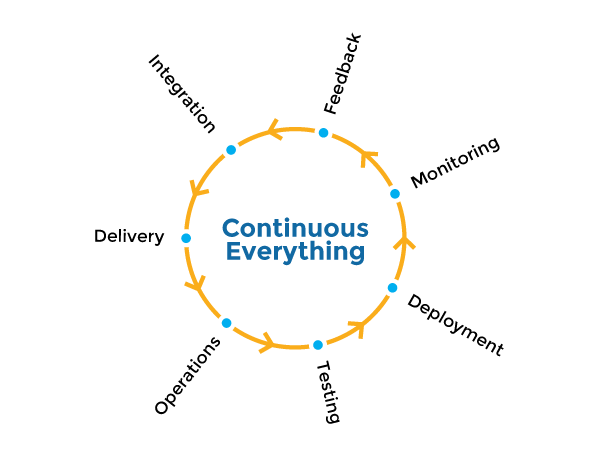

###### [Home](https://github.com/RyKaj/Documentation/blob/master/README.md) | [DevOps](https://github.com/RyKaj/Documentation/tree/master/DevOps/README.md) |
------------

# DevOps : Business Purpose

As it was put in the [DevOps Handbook](https://www.amazon.com/DevOps-Handbook-World-Class-Reliability-Organizations/dp/1942788002/), DevOps can be distilled into three main patterns when it comes to business processes. The first of which is systems thinking, meaning that performance of the entire system is always above the performance of a specific department. The work from development to operations should be streamlined in small batches, trying to keep work in progress limited and increase change frequency. Next, there is a so called shift-left feedback loop, which requires you to integrate automated testing into every development and operations activity. This way you can shorten and amplify your feedback loop to make changes constant and safe. Finally, your team needs to practice systematic experimentation, which is basically a fail fast mentality that I’ve mentioned earlier. You can embrace it by allocating time to improve daily work, rewarding the team for taking risks and injecting faults to your system to increase its resilience.

Having these three DevOps patterns in mind let’s now unwrap DevOps software creation lifecycle phase by phase. Every stage is focused around agility and automation with an aim to shorten software delivery process and increase its quality.

<kbd>  </kbd>
<kbd></kbd>
<kbd></kbd>

## The DevOps Way

To deploy a successful cloud strategy, businesses need to embrace a collaborative, communicative, and continuous software development culture. No more silos, and no more slow, arduous rollouts – this is about getting ideas out the door as efficiently as possible with no impact on quality.

And as my colleague Gunnar Menzel explored in a recent article, enterprise DevOps is the key to automation success – with 75% of Fast Movers reporting improved revenue, and 86% reporting improved customer experiences. But to achieve true enterprise DevOps, you must create a culture that celebrates continuous development, testing, and deployment.

Almost three-quarters (73%) of Fast Movers have automated their application testing processes, allowing them to continuously test and tweak software performance, functionality, and more – with the flexibility for developers to create new QA tests at any time.

### Automated end-to-end testing

One such Fast Mover advises that to respond to today’s rapid technological disruption, businesses must create an automation layer, “an industrialized and frictionless assembly line that deals with continuous integration, continuous testing, and continuous deployment.

Within this framework, you can automate and accelerate key processes in the application release trajectory. But, as is the nature of DevOps, this “layer” demands a high level of coordination among teams – ultimately breaking down the boundaries of responsibility for every role.

By working together, everyone is responsible for the quality of their software. From business to development and operations, every team member can seamlessly root out errors and enable continuity throughout the entire software development lifecycle. And when implemented properly, continuous testing encourages initiatives such as:

*   Seamless communication and error flagging
*   Parallel software development and QA testing
*   Uniform software release acceptance testing
*   24/7 application efficiency monitoring.

### Higher-value Testing

With everyone’s finger on the same pulse, this continuous, automated approach can help free up resources to focus on higher-value tasks throughout the business. In fact, 59% of Fast Movers have redeployed staff thanks to automation, including leading organizations such as CA-SILCA, Securitas, and Cisco.

Automation can also help you expand the software coverage of your QA testers. Typically, QA staff spend hours waiting for testing environments to be provisioned. It’s anything but agile. By automating testing and provisioning, testers are free to significantly ramp up their coverage – far outpacing the few companies today who test more than 70% of their apps.

Of course, if your organization’s apps don’t warrant the additional testing, QA resources can be redeployed to more relevant areas, such as test environment management. Likewise, developers can spend more time writing better code, free from the roadblocks of infrastructure provisioning.

### Stay Secure, Test More

Integrating DevOps with your security teams, DevSecOps, can ease the transition to the cloud while keeping everything secure and on schedule. Part of this process involves security-as-code, in which security teams use tools to bake best practices into every software build.

But for DevSecOps to work, testing must be thorough – or rather, continuous. You can never guarantee your code is error-free, even when automated, which is why continuous testing is needed to address cloud security flaws in enterprise DevOps.

### The Hallmark of DevOps

To truly achieve the automation advantage, you need to realize the hallmark of DevOps: continuous delivery. By automating your software testing, you’re taking a significant step to becoming a Fast Mover, enabling a development culture better suited to compete in a market built on rapid innovation and disruption.

## Continuous Integration vs. Continuous Delivery/Deployment

### What Is Continuous Integration?

Continuous integration is all about how a developer will handle alterations to their software. It refers to the process of frequently merging new changes back into the main branch of software. When a software development company uses continuous integration, they tend to send changes to a central repository multiple timers per day.

### What is Continuous Delivery?

Continuous delivery is often viewed as the next stage after continuous integration. It involves additional automation. Every continuous delivery process will involve continuous integration, but it will also go ahead and automate part of the release process. After a change is merged into the main build, continuous delivery will go ahead and prepare and track your release for production. Once you have continuous delivery in place, a software developer can deploy the changes to their clients at any time by simply clicking a button.

### The Uses of Continuous Delivery and Integration

Due to their differences, continuous integration and delivery have their own unique uses. The main function of continuous integration is for testing. It allows developers to detect any integration bugs as soon as possible, so major issues do not pop up on the release date. This makes it easy to identify which new build is causing the error, so they do not have to spend a lot of time testing later on. Developers can also check how their code push is affecting other parts of the software, allowing for rigorous quality assurance.

Continuous delivery provides most of the uses of continuous integration, but it is less about testing and more about product readiness and convenience. With continuous delivery, you can deploy any version of your software with the push of a button. This makes it easy to track progress across multiple departments. Smaller changes can be deployed frequently, so you do not have the risk of a large deployment where a lot of things can go wrong.

#### Continuous Monitoring - tomorrow’s app today

You can’t manage what you can’t measure. Continuous Monitoring will help you keep your CI/CD pipelines flowing smoothly, giving you more confidence in your deployments and allowing you to react to changing customer needs even faster. By monitoring your system and its environment you will know immediately whether your application is performing as desired, or if its performance has degraded. You can then react accordingly.

When implementing continuous monitoring the right way you need to track several layers of your system at once:

*   You want to track **development milestones** to know how effectively your team is operating and how well is your DevOps adoption process going.
*   You want to feel the pulse of your **infrastructure health**, like server uptime, performance and available resources.
*   You want to be alerted ASAP when your **code build** fails for not to jam your CI/CD pipeline.
*   You want to see all the errors and exceptions in your **application log** in real time and make them traceable by your code commit tag.
*   You want to spot any **code vulnerabilities**, whether that‘s a third party dependency issue or insecure coding practice of your developers.
*   You want to log your **user activity** for feature improvements and scalability purposes.

A lion’s share of your monitoring process should be automated not only to provide you with continuous feedback in real time, but also to allow your system to take proactive actions. You don’t want to be reacting manually each time something happens. Life’s more beautiful when you have clearly defined your triggers and created what-if automation rules to ensure self-improvement of your system.

#### Virtualization and containerization – let’s go micro-services

Virtualization is basically just another abstraction layer. It abstracts away physical hardware components to create aggregated pools of resources. Speaking about server virtualization, the main goal is to achieve greater computing density by overbooking hardware resources. It means you trade off the consistency of your workloads for cheaper hardware. It’s the main reason of why Virtual Machines have thrived for the last decade, despite of the noisy neighbor problem and some inherent security vulnerabilities they possess.

DevOps pushes virtualization a step further by introducing containerization. [Docker Containers](https://www.docker.com/resources/what-container) have similar resource isolation and allocation benefits like VMs, but containers are more portable and efficient. Each container packs up your code along with its dependencies to run it as a single process. Multiple containers can run on the same host machine and share the same OS kernel.

Containers simplify the CI/CD pipeline by a substantial margin. They make development, testing and production environments consistent. This not only eliminates “it works on my machine” problem, but also makes collaboration between teams easier. Containers make it dead simple to deliver constant updates to your application. Just kill one of your containers and spin up a new one leaving other parts of your micro-services application intact. Finally, containers allow you to mix different frameworks or even programming languages altogether, thanks to their platform agnostic nature. If your system is past the minimum viable product stage, I strongly recommend containerizing your application to level up your business agility.
