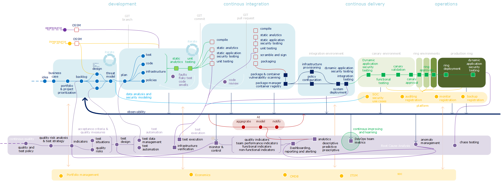

###### [Home](https://github.com/RyKaj/Documentation/blob/master/README.md) | [DevOps](https://github.com/RyKaj/Documentation/tree/master/DevOps/README.md) |
------------

# DevOps : Delivering Continuous Value

</kbd>
 

## Continous

Delivering continuous value is the mantra that DevOps brings to the principles of Agile development. Everything in DevOps is continuous: continuous integration, delivery, deployment, documentation, operations and testing.

Continuous testing is the practice of testing across every activity to uncover and fix unexpected behaviors as soon as they materialize. It embeds testing as a fundamental and ongoing aspect of every activity through the application lifecycle, from requirements through production. The objective is to ensure the business value is being achieved as expected.

Continous integration, the build (CI) process creates packages which are used for deployment to all environments, only configuration will differ. This deployment package can contain all kind of executables or scripts to get the application on the infrastructure. For container technology the same, and often in an easier way, concept is followed, the Continous integration process creates the container with the application which is provisioned to all different platforms.

Automated and continuously provisioning of the underlying infrastructure in a release pipeline is one of the most important activities of DevOps. Immutable infrastructure, create the infrastructure for the application over and over again from the same file(s), only the configuration differs. All cloud providers (private and public) have or should have API’s which make it possible to provision the infrastructure in an automated way. Terraform, Cloud Formation and Azure Resource manager are common template languages to describe infrastructures.

<kbd></kbd>

  

## Everything As Code

Continuous ‘everything’ is only possible when cloud adoption also focuses on the everything as code paradigm. Coding practices should be performed on all artifacts that make, build and run the systems, the code, the infrastructure, the documentation and the operational practices. The same code generates the same application, and the same infrastructure is created every time. The same as documentation and automation scripts, they should follow the same principles as developers do with code and should live next to the code in the describing and automating the same version.

However, successful continuous everything and everything as code is not necessarily easy to achieve. That’s because it requires far more than simply writing code. It entails building a team that’s innovative, has discipline, and can create long-term, sustainable automation. With a DevOps team responsible for its own infrastructure, it has a “You build it you run it” mindset. Teams adopting the ‘as code paradigm’ for everything maximize the speed of delivery and predictability of systems.

## Architecting Cloud Adoption

Having looked at the role of continuous and everything as code in enterprise cloud adoption, there is just one more aspect I want to cover in this blog series – the need for a cloud reference architecture. To bring the structure an enterprise needs for its cloud journey, it’s important to describe how and why the enterprise is adopting cloud. This should include a description of the landing zone, along with the principles and practices to follow. As an enterprise you need to be aware of your drivers to adopt cloud and new digital innovations. Considering both the benefits and the risk of the cloud, a framework is needed to ensure the enterprise can take advantage of the benefits for the long term. A cloud reference architecture is more than a set of principles. It needs to present highly accessible building-block definitions, provide templates (technical building blocks) and cycles down to the automation via continous everything and everything as code. This combination accelerates the implementation of the cloud within enterprises and improves both the efficiency and manageability of the cloud environment.

## Delivering Value from Your Enterprise Cloud

To gain maximum benefits and business value from the cloud, teams need be able to provision and decommission a cloud infrastructure flexibly and fast. This can be achieved using the automation capabilities from the cloud, everything as code. Practices such as Infrastructure as Code and continuous integration, testing and delivery are also mandatory for teams operating in the enterprise cloud.

A cloud reference architecture combined with building blocks and a catalog of cloud resources conforming to the reference architecture will support consistency, predictability and governance in a cloud enterprise landscape. Further, a landing zone built from the catalog and reference architecture will hold platform capabilities needed for governance and regulatory compliance.

I have used this blog (and the two previous ones) to focus attention on some of the key requirements for adopting enterprise cloud – and how best to accelerate adoption.
