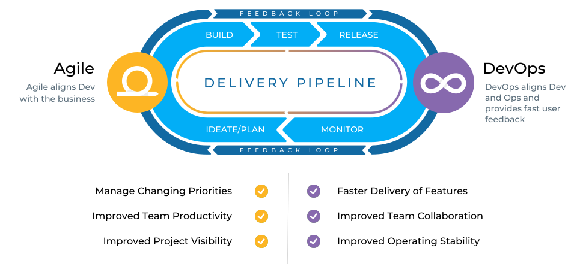

###### [Home](https://github.com/RyKaj/Documentation/blob/master/README.md) | [DevOps](https://github.com/RyKaj/Documentation/tree/master/DevOps/README.md) |
------------

DevOps : Enterprises
=============================================

Over the last decade, **DevOps processes and technology have matured and proven to both accelerate software delivery and improve its quality**. With its significant benefits, DevOps is quickly becoming the standard software development methodology. However, adopting DevOps decentralized development and loosely coupled teams is not always straightforward for an enterprise. It is a transformational operating model after all. It makes sense that implementation can be tricky. Just as the DevOps matured, so have the processes that support its implementation at scale, including value stream management (VSM). VSM extends the continuous improvement through small iterations fundamental to DevOps to its implementation. This helps enterprises navigate their digital transformation journey to begin realizing the benefits of Agile + DevOps.

**DevOps at Scale gives you a background on DevOps, and how it is now implemented at the enterprise level.** In every organization, the transition to DevOps begins with an individual or team to champion its introduction. Your organization’s DevOps journey starts with you. Explore DevOps benefits, processes, and tools to discover what DevOps in your enterprise could achieve.

  

**Value Stream Management**

Agile + DevOps + Measured Outcomes
----------------------------------

Intermix and transition traditional application delivery pipelines with Agile + DevOps methods improving delivery velocity, quality and compliance with complete transparency and business alignment

The Perfect Blend of Methodologies
----------------------------------

  

