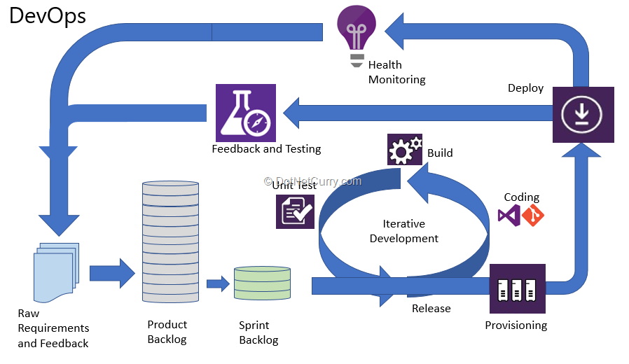

DevOps :  Principles, Practices, Values  

###### [Home](https://github.com/RyKaj/Documentation/blob/master/README.md) | [DevOps](https://github.com/RyKaj/Documentation/tree/master/DevOps/README.md) |
------------

DevOps :  Principles, Practices, Values
=============================================================

<kbd> </kbd>
<kbd> </kbd>
<kbd></kbd>

 

## Pillars

### People

It is essential to restructure teams, drive a culture that values transparency and accountability while ensuring that teams receive proper training.

### Break down Silos & Introduce Security Champions

Security champions allow teams to decide when it is the right time and how they must attend to any security concerns. The security champion is predominantly responsible for:

*   Empowering all teams with regard to security concerns
*   Incorporating the security mindset across teams
*   Ensuring that security is not a hindrance to development
*   Figuring out mitigation strategies with regard to AppSec team
*   Assisting the teams with Quality Assurance & Testing
*   Helping with the development of CI (Continuous Integration) environments

### Training

In order to have an effective security team and thereby, a successful DevOps program, train your teams as well as new hires with the appropriate guidelines and provide them with the required tools. We again re-iterate here — siloed mentality and lack of transparency will only lead to chaos and nothing more. Learning needs to be transparent, flexible and personalized.

### Culture

Training, having security champions across teams, incorporating DevSecOps processes will only be fruitful if they are effectively utilized. Once the process is completely accepted, the process will not only have a single security team but will have it across all teams.

## Process
  

<kbd></kbd>

  

Processes within various organizations are typically siloed eventually leading to miscommunication and delay. Incorporating DevSecOps will align and implement processes that will facilitate cooperation and ensure a secure development process. Best practices include:

**Integration of Processes** — Incorporating a shift left methodology, reducing the costs related to implementing security

**Compliance** — Creating metadata wrt compliance requirement and integrating it into the assets

**Version Control, Metadata, and Orchestration** — Make sure that adequate versioning, metadata is in place for all changes to be traceable and measurable, ensuring that orchestration software is the primary source of information for every operational team

**Security Tooling in CI/CD** — Enable operations teams to run security tools a part of the pipeline

**Incident Management** — Create proper workflow and action place well ahead to properly measure an incident

**Red Teams, Blue Teams and Bug Bounties** — Test effectiveness of security programs, defend attacks, provide solution and reward whoever finds and reports a bug in a software product

## Technology

Implementing the right technology and tools enables People to execute an effective DevSecOps Process. Best practices include:

**Automation and Configuration Management** — Leverage automation and orchestration to make auditing simpler via metadata
`
**Secure coding practices/Security as Code** — Check and verify all coding standards against new security to detect vulnerabilities sooner

**Host Hardening** — Ensures that there will be a considerable reduction in the services and applications being unnecessarily exposed to the Internet

**CI/CD for Patching** — Use metadata associated with each asset to implement patching at the CI/CD level

**Application-level Auditing and Scanning** — A vital feature of DevSecOps to get to know about risk posture

**Automated Vulnerability Management Scanning** — Vulnerability management software should be able to integrate via API for infrastructure and web application scanning

**Automated Compliance Scan** — Achieved using automated security configuration assessments to overcome risks and maintain continuous compliance, thereby cutting costs associated with the same.

**Managing Secrets** — Primarily used to avoid a potential human error while maintaining private information. Such information (third-party APIs etc) must be generated on a temporary basis with the help of specific authentication mechanisms.

## Principles

### Automate everything

The eventual goal is to automate everything. Time and again it’s been proven that automation will result is lower costs and efforts. Removal of manual steps in the process is also extremely helpful in speeding up delivery by reduction in bottlenecks.  
While traditional governance frameworks (still) offer value in today’s digital environment, we are often divided between asking for permission (following them religiously and slowing down value delivery) or forgiveness (damning the consequences, delivering value, and negotiating after – often with consequences). One way to circumvent the risks associated with either approach is automation.  
Automation helps ensure quality and consistency with changes. For example, if there are visible transparent processes to verify work i.e. automated testing, trust can easily be built. Having control points automated encourages business confidence as there is less variability, less cost but greater visibility of compliance even in remaining manual processes.  
Digitally ready, high-performing organizations automate heavily across areas such as configuration management, testing, deployments, and change management. This enables measurement, metrics and monitoring.This leads to more time for innovation, higher rates of collaboration, faster feedback cycles, and greater reliability.

### Auto-Scale

Since DevOps enables an organization to manage the development, test, staging and production environment using infrastructure as code in an efficient manner, it’s easy to automatically scale the system. Imagine using [Docker](https://www.cazton.com/consulting/enterprise/docker) as a container and using [Kubernetes](https://www.cazton.com/consulting/enterprise/kubernetes) to orchestrate it while using Terraform to safely and predictably create, change, and improve infrastructure. This will help scale the entire development and operations at scale.

### Collaboration

One of the best benefits of DevOps is improved collaboration.DevOps succeeds in enterprising and dynamic environments. Thinking about how right-sized your IT controls are against the flexibility you are providing to your DevOps team is key. A partnership and collaborative approach to refining those controls is key.This partnership means creating parameters with teams so we right-size the amount of freedom to pursue solutions they believe will work. This also means reducing the stringent KCIs (key control indicators) to the point where they are not blockers for change and innovation but facilitators. This ensures balance.Consider acceptable thresholds and limits to your controls. This could mean empowering teams to use tools they prefer from an approved toolbox or even identifying and standardizing tools without unnecessary approvals.A “sandbox” of flexible KCIs that allow your DevOps teams have enough wiggle room to experiment and respond to feedback and changing market needs. This enables them to tackle legacy issues that often riddle enterprise transformation.

### Continuous Integration and Delivery

In a DevOps environment, the key is automation. Functional changes can be independently tested and deployed using good practices like continuous integration and delivery. This improves the overall reliability of the system.

### Continuous Learning and Improvement

You might have heard of continuous testing, continuous integration and continuous deployment or delivery. In short, continuous improvement collectively encompasses all the above and many other practices. The bottom line is to make sure not only that we incorporate all the practices we are aware of, but also make sure we are open to introducing new patterns and practices we learn as we go.

### Done means released

DevOps mindset emphasizes on the fact that nothing short of release can be called done.

### Fail fast

Setting up the right DevOps strategy can take some time. However, once it’s done it increases the team’s velocity. This helps them deliver working applications and modules faster than ever. This makes them get feedback early in the game and eventually make decisions based on that. Failing fast is a highly recommended strategy especially for software products.

### In-built quality

One of the major principles of DevOps is to make sure that quality is first priority in the process. Speeding up while introducing technical debt is not a very good strategy; so, rather than having multiple backlogs for feature development, bugs and technical debt we need to have one backlog and improve quality as we go.

### Repeatable and reliable

The process for releasing software has to be repeatable and reliable. This implies that the process needs to be thoroughly tested. Anyone should be able to use it reliably and should provide expected results.

### Responsibility

DevOps culture makes every single member of the team responsible for the delivery process. Conciliation and collaboration over confrontation is the key to success. There is no room for blame game.

### Security

If DevOps is done right, security becomes an integral component of the entire lifecycle. Many companies make the mistake of having a siloed security team. Despite all their guidelines and practices, they end up having nothing more than a layer to prevent attacks. If containers are used correctly, security could be easily built into the containers and then scaled automatically. Introducing multiple security layers as and when needed can be easily done through DevOps

### Speed of delivery

Imagine waiting for months before a new feature could be delivered? Compare that to a DevOps enabled microservices model that enables delivering independent services multiple times a day. DevOps, if done right, can help the organization deliver multiple features pretty much on-demand. For more details regarding microservices based development, please read our [detailed article](https://cazton.com/consulting/enterprise/microservices)

### Tackle harder problems first

In traditional software development organizations, the harder problems are tackled manually and then ignored. DevOps preaches tackling the harder problems first and brining the pain forward.

**Practices**

Self service project via project configuration portals

Policy configuration for Security, service levels, frameworks, usage, topology concerns

Automated platform provisioning via service tier templates, frameworks, and policy enforcement points (PEP)

Process automation with Continuous build, test, and deployment. Code promotion and synchronization across environments and servers

## Dependency analysis and impact analysis

### Security

This is a top concern for organizations of all types and sizes, as bigger breaches now seem to be happening more often. CI/CD databases are likely to be prime targets because, in short, they hold the keys to many locks. [This is what happened to Uber in October 2016](https://www.wired.com/story/uber-paid-off-hackers-to-hide-a-57-million-user-data-breach/) when hackers accessed the company’s AWS credentials via its GitHub repository and went on to steal the personal information of more than 55 million users and 600,000 drivers.

**To protect yourself and your data, consider isolating CI/CD systems on secure internal networks**, and make sure you are using VPNs, access management, two-factor identification, and other security protocols.

### Version Control and Tracking

There are a few tools you need to be able to do this effectively. Two of the most common are [source](https://www.itmethods.com/github/) control, which allows you to track changes in the code-base and makes rollbacks easier, and [Jira](https://www.itmethods.com/jira-software/), which gives you better visibility into project progress.

### Commit to Daily Branching

One of the most time-consuming activities for developers tends to be merging a significant number of branches into the trunk just before release. **To overcome this, developers need to commit to the main branch at least once per day — enabling them to spend more time on development and less on version control overall.**

### Build Once

As part of an effective and efficient CI/CD and DevOps framework, source code should only be built _once_. **This will reduce oversight and minimize the risk that errors could be introduced later**.

### Release Often

The best practice here is to add a deployment stage that closely resembles your production environment. Common approaches include:

*   **Canary**: Release to a subset of users, test there, and roll it out if it’s successful.
*   **Blue Green**: Start with two identical production environments, one live in production and one idle. Push updates to the idle environment, and then switch them (idle becomes live and live becomes idle). The benefit of this method is that it’s easy to roll changes back if necessary.
*   **A/B**: Test different features with a version A and a version B. The one that performs better is the winner.

Evaluate your needs to determine which option will be best for you.

### Employ On-Demand Test Environments

Run tests in containers so QA teams can reduce the number of potential variables and changes between environments. This boosts agility, since your QA team no longer needs to build CI servers and install separate testing environments. It’s also easier to spin up containers and destroy them when they’re not needed.

## Values

### Foundation

Time and effort to create new application environment

### Time to redeploy application

Time to promote application into a new lifecycle phase

### Optimize

Dynamically right-size infrastructure scale

Re-use existing platform services and business services from resource pool instead of re-building solution stack

### Transformation

Time and effort required integrating business process, event processor – creating a complex app.

Time and effort required to apply policy across tenant(s)

Cost to operate application per user or transaction

## Culture

Business culture is a predominant mindset spanning across an organization. It’s the way we collectively think about our mutual efforts in a company. Obviously, an organization needs to be well-aligned around its vision, goals and processes to act effectively and be profitable. DevOps culture is centered around collaboration. In a team where everyone focuses on the same goal and communicates extensively no barriers, tensions or silos exist. Forget the blame game — product owners, developers, QA and IT operations — all work hand in hand towards delivering higher quality releases at a faster pace.

## Not Buzzwords

Continuous integration and continuous delivery have measurable outcomes, they aren’t buzzwords. I often hear people use “CI/CD” when they mean build tool automation and don’t even get me started on “DevOps”.

> We’ve created a DevOps team to implement CI/CD pipelines and manage the releases. We’re DevOps now!”

<kbd></kbd>

How many of you just cringed?

Continuous integration is behavior, not a tool (Team City, Jenkins, CircleCI, Travis, or any other tool). CI is how we apply these tools and CI is the key to transforming teams - not an environment. However, to be effective, we need to be explicit about CI definitions and how we measure our ability to execute.

### Ubiquitous Language

> Each developer submits tested, backwards compatible changes that are Integrated to the trunk daily.

This definition creates constructive constraints and rapidly uncovers cultural, technical, and process challenges. Asking continuously, “why can’t we do this?” drives the improvement conversation. The common challenges are basic but take discipline to solve.

Workflow isn’t managed correctly with too many things in progress, lack of prioritization, and lack of teamwork to drive things to completion.

Work hasn’t been refined to the detail required to deliver it.

Testing is manual, requires handoffs to a testing team, or just doesn’t exist. All of these impact quality and delivery speed. To fix them, we start with some simple improvements.

### Establish Policies

Explicit policies are important for keeping everyone aligned. Keep them concise, clear, and always visible. Policies stored on a file share do not exist. Print them and post them.

### CI Working Agreement

A working agreement focused on CI highlights the real priority, **sustainable** delivery of decreasing batch size with high quality and rapid development feedback.

This will not happen on day one. The team should be asking daily, “what’s the main reason we cannot do this?” and apply fixes until they can.

### Definition of Ready

For any step, there must be exit criteria to prevent rejection from downstream steps. For refining work, it must be clear enough to prevent questions, guessing about what requirements mean, or [gold plating](https://en.wikipedia.org/wiki/Gold_plating_(project_management)) during development.

With these policies in place, the team can begin removing other roadblocks.

### Visualize Metrics

Until you know where you are, you cannot chart a path. Metrics are meaningless unless they are always visible. We use [Hygieia](https://www.capitalone.com/tech/solutions/hygieia) to monitor CI outcomes, before that, we built [Graphana](https://grafana.com/) views. No matter what method you choose, current metrics must be kept visible to everyone.

- How frequently are pull requests integrating to Master?
- What’s the average branch age?
- How long does it take to fix broken builds?
- How stable is the build?
- Is the build taking too long?
- How many tests are running and is that number increasing?

Track them, gamify them, make them better, and understand the goal is continuous improvement. Metrics are indicators, not goals.

### Clear Impediments

Now the real work of changing habits begins. Habits change when previous habits no longer deliver value. When there is no pressure to integrate more frequently, re-refining work in progress doesn’t cause much pain. Integrating code once a week or longer with multi-hour code reviews and regular merge conflicts seem normal and acceptable. With our new drive to deliver code to the trunk daily, things must change.

### Improve Refining

Improperly refined work has cascading impacts on quality outcomes. If work isn’t refined to the level of testable acceptance criteria, then there are too many uncertainties and delivery pressure results in guesswork during development. This impact [proper testing](https://medium.com/walmartlabs/5-minute-devops-effective-testing-bd38fab50564) since poorly refined work drives developers into a constant “proof of concept” mindset with exploratory coding as the primary flow. It’s very common to see retry loops in a value stream map after development has started where developers are waiting on clarification. This, in turn, incentivizes increased WIP as they pick up new work while they wait and additional delivery delays as they context switch back or just park the original work until he lower priority WIP is completed.

[Behavior Driven Development](https://lizkeogh.com/category/bdd/) is an important tool for changing the culture and improving outcomes. BDD focuses on collaborating with all stakeholders to uncover the real business needs. Outcomes are owned by **all** of the stakeholders, not just the developers. We don’t finger point, we problem solve and focus on improvement. We also learn together that we’d rather fail small.

> Simplicity — the art of maximizing the amount of work not done — is essential. [https://agilemanifesto.org/principles.html](https://agilemanifesto.org/principles.html)

DD gives us declarative, unambiguous acceptance criteria that can be tested. Now we have feature level functional tests that decompose into component level functional tests easily identifiable contract changes. We have a much higher level of confidence for what the business wants because they helped us define it and own the outcomes. We also know what NOT to develop since anything we develop beyond what we agreed to is a defect.

With a hard definition of done and clear delivery goals, we can easily swarm the work as a team. Which services will be impacted? Will new services be required? How can we collaborate to deliver those changes as a team?

### Improve Testing Process

CI/CD is a quality process, not build automation. [In a previous “5 Minute DevOps”, I spoke about the layers of tests required to execute CI/CD correctly.](https://medium.com/walmartlabs/5-minute-devops-effective-testing-bd38fab50564) To add to that, two quotes from one of my favorite books.

Real CI requires that testing primarily happens **before** code commit. It also means that manual testing and/or handoffs to a “testing team” now are breaking us. We cannot meet our goals that way. Habits must change.

Since the team defined how the feature will work to a testable level during refining, all that’s required is to implement the tests. Instead of struggling to come up with what to test, developers can spend time designing HOW to most efficiently test against the goal. This results in more downstream improvement.

Code reviews improve. There is no need to code review for functionality, that’s what tests are for. Code review can focus on readability and verifying that the tests match what was agreed to as a team. The tests validate the new functionality and protect that behavior on every subsequent build. As we reduce the time between merges, changes are smaller and code review is more effective and can be completed in minutes instead of hours.

The increased confidence that we can make change without breaking existing features makes development faster. We sleep better at night because we know we can triage and fix things faster at 3:00 am without risking breaking things even more.

Test suites are less likely to become spaghetti code because we need our tests to run quickly. Test code is code and requires constant design and refactoring. The need for rapid test results helps this happen. [Michael Nygard](https://www.michaelnygard.com/) once told me that he created a test that would fail the test suite if it ran for longer than 15 minutes to force refactoring of the tests. Brilliant.

### Workflow Management

Imagine a football team where everyone was measured only by how often they scored. Everyone will be focused on getting the ball, scoring, and being a hero instead of helping the teammate who has the ball. The same happens on a development team.

Have you seen a team where everyone has assigned tasks instead of pulling work or where individuals are measured based on how many tasks they complete? With everyone focused on their task list or making themselves appear to be heroes, they aren’t focused on helping to deliver the next value item. You’ll see this in long wait times on pull requests, cherry-picking low priority, easy to complete work or increased work in progress. They look busy, but value delivery is minimal.

The teamwork expectations and time box constraints in the CI working agreement along with leadership understanding how to incentivize better outcomes result in lower lead time and increased throughput. The team only **looks** less busy.

### Only Outcomes Matter

> Working software is the primary measure of progress. [https://agilemanifesto.org/principles.html](https://agilemanifesto.org/principles.html)

The customers only care about how quickly they can see value from the next feature. As development leaders, the goal is to help the teams find better ways to deliver value and to align the process in ways that encourage this. CI is an effective way to do this if the correct policies are in place. It provides easily measurable outcomes that allow rapid feedback for any improvement experiment. Because of the level of teamwork required to execute at a high level, it’s also an effective way for a new team to more quickly evolve from “forming” to “performing”. We’ve witnessed this repeatedly.

One note to this: Teams grow and learn as organisms. Team members are not legos. Adding or removing **anyone** from a team reduces the team’s effectiveness. [Team change should be done carefully](https://medium.com/faun/5-minute-devops-designing-product-teams-33b82e6c1c5c) and infrequently unless improved outcomes isn’t a goal.

### Excuses

Some may assert that CI works quite well using an “integration branch” or [GitFlow](https://medium.com/@bdfinst/five-minute-devops-gitflow-best-practices-a6cd1265de24), that integrating every week or once a sprint is fine, or that only complete work should be integrated, I’ve heard all of those excuses before. I’ve also failed that way. Real CI drives real results. Culture changes because the underlying behaviors change. The reverse is never true. Don’t allow lack of knowledge, lack of testing, or fear prevent improvement. Fix the problems.

  