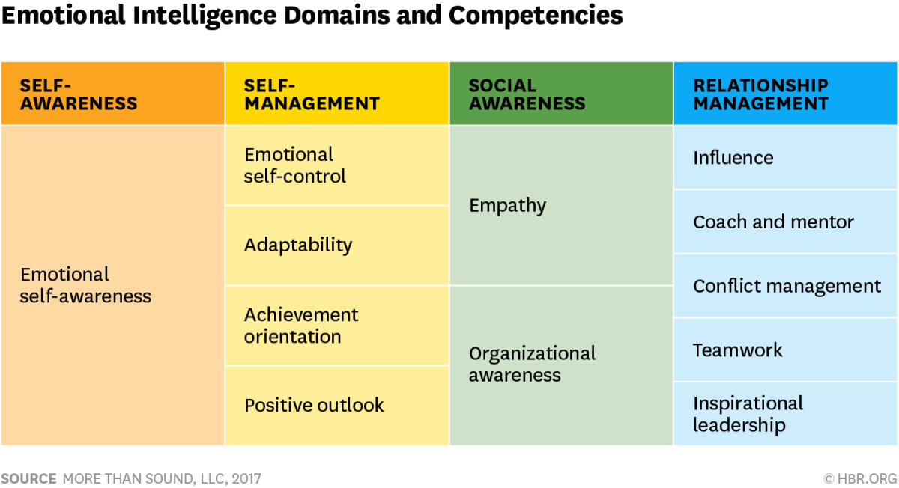

###### [Home](https://github.com/RyKaj/Documentation/blob/master/README.md) | [Leadership](https://github.com/RyKaj/Documentation/tree/master/Leadership/README.md) |
------------

# Information Technology : Emotional Intelligence - Emotional Quotient

## Measured in the Emotional Quotient (EQ) inventory, is composed of five categories, each with three subcategories

<kbd></kbd>

## Self-Preception

How you perceive yourself -- your self-perception -- colors your
interactions with the rest of the world.  *Self-regard *makes up the
first subcategory. The confidence and respect you have for yourself
impacts your decisions and communications with others. 
*Self-actualization*, the second subcategory, concerns your pursuit of
meaning and self-improvement. If you’re fully self-actualized, you’ve
become the “largest” version of yourself -- someone who’s fully living
out what you view to be your life’s purpose. The third subcategory is 
*emotional self-awareness*. Being aware of your emotions isn’t
self-indulgent -- it’s necessary for healthy and happy living. Repressed
emotions manifest as sickness, disagreements with others, constant
anxiety, and a host of other unpleasant symptoms that hamper your
ability to live and work at the level you seek.

  - Self-Regard: Respecting oneself; having confidence
  - Self-Actualization: The pursuit of meaning, self-improvement
  - Emotional Self-Awareness: Understanding one’s own emotions

### Self-Expression

Your perception of yourself -- your s *elf-expression -- *influences how
you express yourself. The first part of this is emotional expression.
Once you’re aware of your emotions (as noted in the 
*self-perception *category), you must be able to express them. Healthy
individuals can express their emotions and take responsibility for them
without blaming others. Assertiveness makes up the second part of 
*self-expression*: Can you communicate your feelings and beliefs in a
way that causes no harm to others, yet honors your desires and needs?
And the final component is  *independence*. If you’re independent,
you’re self-directed and free from emotional dependency on other
people. You maintain steadiness regardless of the moods or opinions that
are prevailing around you, and you don’t require validation from others.

  - Emotional Expression: Being able to constructively express emotions
  - Assertiveness: Communicating feelings and beliefs in a non-offensive manner
  - Independence: Being self-directed, free from emotional dependency

### Interpersonal

The  *interpersonal *category deals with how the self interacts with
others.  *Interpersonal relationships* addresses how you can adapt your
ability to evolve and adapt all relationships from the meaningful people
in your life to how you impact others. The second subcategory is 
*empathy*, meaning how well you can be understanding and appreciative of
how others feel. Without empathy, you can’t form satisfying
interpersonal relationships. Next is  *social responsibility*. This
builds on the previous two concepts: If you have positive, empathetic
relationships with other individuals, you can strive to help the larger
community, both locally and globally.

  - Interpersonal Relationships: Able to maintain mutually satisfying relationships
  - Empathy: Quality of being understanding, appreciative of how others feel
  - Social Responsibility: Developing a social conscience, helping the larger community

### Decision Making

Pop science claims the average human makes about 35,000 decisions each
day. An emotionally intelligent person can make decisions with less
inner turmoil. The first subcategory of  *decision making *is  *problem
solving*: Every time we make a decision, we have to tackle a myriad of
emotions to reach a solution. When we understand our own emotional
cycle, we can hijack the approach and improve our decision-making
skills. The second category is  *reality testing*. If you have strong
reality-testing skills, you can be objective and see situations for what
they really are without getting caught up in made-up stories, magical
thinking, or worst-case scenarios. The third subcategory is  *impulse
control*. In a people leader, a lack of impulse control can do serious
harm to organizational morale. Say a CEO is a sucker for new
technologies, so he invests in the newest and best tools—every six
months. Employees must continually learn and adapt, victims of the
boss’s “shiny object syndrome.” By contrast, a CEO with strong impulse
control carefully considers the technologies available, chooses the best
option for his company, and sticks with it.

  - Problem Solving: Ability to find solutions when emotions are involved
  - Reality Testing: Ability to be objective; see things as they really are
  - Impulse Control: Ability to resist or delay the impulse to act

### Stress Management

We all have stressors in our lives, but we can choose how much they
affect us. Have you ever known someone who flies off the handle at the
smallest provocation -- say, if the coffee pot is empty? Then there’s
the person who lives like he’s in the eye of the hurricane: The whole
world could be falling to pieces around him, yet he retains an almost
unnatural calm.

*Flexibility*, the first subcategory of  *stress management*, refers to
your ability to adapt your thoughts and behaviors to a given situation.
It’s how you respond and react in the moment. It’s about the hundreds of
course corrections you make throughout the day to maintain emotional
steadiness.  *Stress tolerance* encompasses how well you cope with
stressful situations. Reflect honestly on yourself: Are you closer to an
“eye of the hurricane” person, or a “coffee pot freakout” person? The
answer will give you insight into your level of stress tolerance. The
third subcategory is  *optimism*, or how well you maintain a positive
outlook on life. Optimism breeds resilience. If you have a healthy
baseline level of optimism and you encounter setbacks, you have
confidence that things will right themselves in time.

These five categories of emotional intelligence serve as a useful
barometer for people leaders in the workplace by helping them identify
the source of tension or stress. Where discomfort and tension exist, you
can peel them apart and see which component of EQ is under stress.

  - Flexibility: Adapting emotions, thoughts, and behaviors
  - Stress Tolerance: Coping with stressful situations
  - Optimism: Maintaining a positive attitude and outlook on life

## Things EQ people dont do at work

Emotional intelligence and the workplace might seem like oil and water,
but they are inextricably linked. Self-awareness and social intelligence
are similar, and arguably quite important – especially at your job.

People are sensitive about work in the way they are sensitive about
money – it’s common to assume that each make moral or hierarchical
statements about who we are. This leads to a lot of self-consciousness,
fear and projection, all of which can easily seed itself beneath the
surface of day-to-day life and make us more sensitive to ordinary
interactions that we may not need to be.

For many, a job is more than a means to an end, it is an identity. It
gives us a feeling of security, defines us as individuals, and offers us
purpose. It’s easy to see why we can often take things too personally,
try to overcompensate, or become too attached to an arbitrary outcome.
However, there is another way to approach some common anxieties
surrounding your career.

### They don’t ascribe intent

The boss had a bad morning at the Q2 budget meeting. A coworker is
stressed and seems short. There was an error in the last memo that went
out and someone should have caught it, but didn’t, and now a supervisor
is mad.

People have a tendency to take things too personally at work, assuming
every transgression against them is a sign of their incompetence, or
worse, how unnecessary they are. (How many people do you know who still
freeze up when the boss asks to speak to them privately?)

“Ascribing intent” is when we assume things are about us when they
aren’t. It’s like the spotlight effect, which is that we overestimate
how much people are thinking about us (this is exacerbated by social
media). It also often occurs as a confirmation bias: if we are afraid we
are incompetent, we are unconsciously searching for evidence to prove
it. Emotionally intelligent people can differentiate their biases from
reality, and recognize that nobody is as focused on them as they are
focused on themselves.

### They don’t try to prove their importance

People who are constantly trying to communicate how busy and stressed
they are not trying to send you a message about their schedule, they are
trying to highlight how important and needed they are. This can also
come out as being overly critical: people who always want to point out
what you’re doing wrong want to place themselves in a position of
authority, even if they don’t have one.

Emotionally intelligent people show their importance because they know
their importance.

They recognize that it is less powerful to talk about how hard the work
is, and more powerful to simply show the end result. They recognize that
proving oneself as integral to a team involves being positive,
supportive, and showcasing their ability to handle high stress. They
recognize that the very behaviors some people rely on to prove their
importance can have the opposite effect.

### They don’t conflate their whole identity with their job

The first thing someone will ask you after where you’re from is what you
do, which is a perfect example of how intricately identities are tied to
jobs. However, when this is the case, what happens when you lose a job?
When you underperform one quarter? When you have a midlife career
change?

The answer, of course, is that you think you are losing part of
yourself. It’s this fear that holds people back from seeing their losses
as opportunities to find new or better work. Fear is paralyzing, and
never more so than when you think that by losing your job, you are
losing yourself.

Of course, you existed before this job and you will exist after it. What
you do is part of who you are, not the entirety of it.

### They give respect to get respect

Everyone wants to be respected at work, but few people talk about the
importance of giving respect as well. If you are in the presence of
someone who has been in the field for 25+ years, acting as though their
opinions are irrelevant because you have a hot, new take isn’t going to
go over well. If you want your ideas to be respected, you need to
recognize and respect those of others, even if you don’t agree with
them.

### They understand where their money is coming from

Emotional intelligence very often has to do with basic awareness.
Emotionally intelligent people tend to have a more grounded
understanding of how compensation works, which is to say that they do
not take receiving a check for granted: they understand it’s something
that they have to work, and continue working, to earn.

Likewise, they do not expect a three figure salary at the first year at
a startup, or on the other hand, take a weak excuse for denying a raise
at a major company at which many of their peers are compensated better
than they are.

Yes, your time and your work are worth something, and you should be
aware of that. But you also need to be aware of the company’s financial
structure and understand that you are not going to be given what you
aren’t giving. You have a salary (or a paycheck) because you earn it,
not because you are so invaluable to a company that they would lose
money just to keep you around.

### They treat losses as opportunities

Most people are terrified of loss because they see it as a finality or a
judgment of their character. However, it is possible to look at it
differently: if you lose out on a promotion, perhaps you weren’t best
suited for the position. If you lose your job altogether, perhaps it is
an opportunity to begin your own business, or seek employment somewhere
you’ll feel more appreciated. What you lose isn’t a loss, it’s an
opportunity to try again.

### They maintain humility

The single most striking and powerful trait that you can harness in your
career is humility. No matter what position you hold, how much you make,
or how well respected you become in your field, if you don’t maintain
your humility, you’ll become immune to the critiques and ideas of others
– which is to say you will stop growing.

There is nothing more insufferable than someone who is closed to
evolving as their field does because they want to be correct. Humility
begs the question: Would you rather be right, or would you rather be
good?

### They can handle pressure healthily

Dealing with workplace pressures and functioning well under stress
demands an ability to manage our emotions. People with higher levels of
emotional intelligence are more aware of their internal thermometer and
therefore better able to manage their stress levels. They tend to have
better-developed coping mechanisms and healthy support systems that keep
working effectively even in tough situations. The increasing rate of
change in the workplace is likely to increase work-related stress and
boost the value of those who can manage it.

### They understand and cooporate with others

> People with highly developed emotional intelligence are less defensive
> and more open to feedback, especially when it involves areas of
> improvement.

As teamwork becomes increasingly important in the workplace, people who
are able to understand and get along with others will become ever more
sought after. Highly emotionally intelligent people have well-developed
people skills that let them build relationships with a diverse range of
people across many cultures and backgrounds. That’s an asset in an
increasingly globalized workplace.

### They're Good Listeners

Everyone wants to be heard and understood. The ability to listen well
and respond to others is crucial for developing strong working
relationships. Many of us, though, aren’t as good as we could be at
really listening to what others are saying. Because of their ability to
understand others, highly emotionally intelligent people are in a better
position to put their own emotions and desires aside and take others
into account. Their ability to pick up on people’s emotions, through
tone of voice and body language, come in handy in team settings.

### They're More Open To Feedback

Open, timely, and honest feedback is essential to job
performance–especially at a time when annual performance reviews are
in decline. People with highly developed emotional intelligence are less
defensive and more open to feedback, especially when it involves areas
of improvement. Their high level of self-regard lets them look
positively at areas where they can do better, rather than taking
feedback personally.

### They're Empathetic

> Highly emotionally intelligent people are in a better position to put
> their own emotions and desires aside and take others’ into account.

Collaboration doesn’t just present logistical issues–it also comes down
to responding to teammates’ feelings. People with high emotional
intelligence are able to use their sensitivity to where others are
coming from to build trust and cohesiveness. This allows teams to focus
on the task at hand rather than become embroiled in internal bickering
and politics. Their sensitivity to the needs of others acts as a
lubricant that helps team members work together.

### They set an Example for Others to Follow

Highly emotionally intelligent people don’t get easily flustered when
things don’t go according to plan. And their knack for getting along
with others makes it more likely that others will take note and try to
emulate them. That’s why high emotional intelligence is a key to
influencing people in an organization regardless of official title. An
ability to rise above daily irritations earns people with high emotional
intelligence the respect from those above them as well as from their
colleagues.

### They Make more Thoughtful and thorough decisions

Because of their ability to see things clearly from another’s point of
view, highly emotionally intelligent people are able to make better
judgements about how their decisions will impact others. Not only does
this result in better decision making overall, but it also helps manage
damage control when certain decisions lead to negative consequences.
Being able to judge the outcomes of their choices lets highly
emotionally intelligent people behave more proactively.

People who show an enhanced ability to adapt to change, manage their
emotions, and work well with a diverse range of people are already
valuable in most workplaces. But with the rates of change and pressures
in the workplace rising, they’ll become even more sought after than
ever.

## Signs of High Emotional Intelligence

### You think about feelings

Emotional intelligence begins with what is called self- and social
awareness, the ability to recognize emotions (and their impact) in both
yourself and others.

That awareness begins with reflection. You ask questions like:

  - What are my emotional strengths? What are my weaknesses?
  - How does my current mood affect my thoughts and decision making?
  - What's going on under the surface that influences what others say or
    do?

  

Pondering questions like these yield valuable insights that can be used
to your advantage.

### You pause

The pause is as simple as taking a moment to stop and think before you
speak or act. (Easy in theory, difficult in practice.) This can help
save you from embarrassing moments or from making commitments too
quickly.

In other words, pausing helps you refrain from making a permanent
decision based on a temporary emotion.

### You Strive to control your thoughts

You don't have much control over the emotion you experience in a given
moment. But you can control your reaction to those emotions--by focusing
on your thoughts. (As it's been said: You can't prevent a bird from
landing on your head, but you  *can* keep it from building a nest.)

By striving to control your thoughts, you resist becoming a slave to
your emotions, allowing yourself to live in a way that's in harmony with
your goals and values.

### You benefit from criticism

Nobody enjoys negative feedback. But you know that criticism is a chance
to learn, even if it's not delivered in the best way. And even when it's
unfounded, it gives you a window into how others think.

When you receive negative feedback, you keep your emotions in check and
ask yourself: How can this make me better?

### You show authenticity

Authenticity doesn't mean sharing everything about yourself, to
everyone, all of the time. It  *does *mean saying what you mean, meaning
what you say, and sticking to your values and principles above all else.

You know not everyone will appreciate your sharing your thoughts and
feelings. But the ones who matter will.

### You demostrate empathy

The ability to  [show
empathy, ](https://www.inc.com/justin-bariso/empathy-the-basic-quality-many-leaders-keep-getting-wrong.md)which
includes understanding others' thoughts and feelings, helps you connect
with others. Instead of judging or labeling others, you work hard to see
things through their eyes.

Empathy doesn't necessarily mean agreeing with another person's point of
view. Rather, it's about striving to understand--which allows you to
build deeper, more connected relationships.

### You praise others

All humans crave acknowledgement and appreciation. When you commend
others, you satisfy that craving and build trust in the process.

This all begins when you focus on the good in others. Then, by sharing
specifically what you appreciate, you inspire them to be the best
version of themselves.

### You give helpful feedback

Negative feedback has great potential to hurt the feelings of others.
Realizing this, you reframe criticism as constructive feedback, so the
recipient sees it as helpful instead of harmful.

### You apologize

It takes strength and courage to be able to say you're sorry. But doing
so demonstrates humility, a quality that will naturally draw others to
you.

Emotional intelligence helps you realize that apologizing doesn't always
mean you're wrong. It  *does* mean valuing your relationship more than
your ego.

### You forgive and forget

Hanging on to resentment is like leaving a knife inside a wound. While
the offending party moves on with their life, you never give yourself
the chance to heal.

When you forgive and forget, you prevent others from holding your
emotions hostage--allowing you to move forward.

### You keep your commitments

It's common nowadays for people to break an agreement or commitment when
they feel like it. Of course, bailing on an evening of Netflix with a
friend will cause less harm than breaking a promise to your child or
missing a major business deadline.

But when you make a habit of keeping your word--in things big and
small--you develop a strong reputation for reliability and
trustworthiness.

### You help others

One of the greatest ways to positively impact the emotions of others is
to help them.

Most people don't really care where you graduated from, or even about
your previous accomplishments. But what about the hours you're willing
to take out of your schedule to listen or help out? Your readiness to
get down in the trenches and work alongside them?

Actions like these build trust and inspire others to follow your lead
when it counts.

### You protect yourself from emotional sabotage

You realize that  [emotional intelligence also has a dark
side](https://www.inc.com/justin-bariso/10-ways-manipulators-use-emotional-intelligence-for-evil-and-how-to-fight-back.md)--such
as when individuals attempt to manipulate others' emotions to promote a
personal agenda or for some other selfish cause.

And that's why you continue to sharpen your own emotional
intelligence--to protect yourself when they do.

## Ways Manipulators Emotional Intelligence for Evil

Organizational psychologist and best-selling author Adam Grant
identified EI at its worst in his essay for  *The Atlantic*, [The Dark
Side of Emotional
Intelligence](http://www.theatlantic.com/health/archive/2014/01/the-dark-side-of-emotional-intelligence/282720/):

> Recognizing the power of emotions...one of the most influential
> leaders of the 20th century spent years studying the emotional effects
> of his body language. Practicing his hand gestures and analyzing
> images of his movements allowed him to become "an absolutely
> spellbinding public speaker," says the historian Roger Moorhouse--"it
> was something he worked very hard on."
> 
> His name was Adolf Hitler.

The last thing anyone wants is to be manipulated, whether it's by
politicians, colleagues, or even those who claim to be our friends.

Below, I've listed 10 ways emotional intelligence can be used against
you. Of course, these actions and characteristics don't always identify
a lack of ethics; a person may practice them unintentionally.
Nonetheless, increasing awareness of these behaviors will equip you to
deal with them strategically, and sharpen your own EQ in the process.

### They Play on Fear

A manipulator will exaggerate facts and overemphasize specific points in
an effort to scare you into action.

**Strategy:** Beware of statements that imply you lack courage or
attempts to instill a fear of missing out. Make sure you have the whole
picture of a situation before taking action.

### They Deceive

All of us value transparency and honesty, but manipulators hide the
truth or try to show you only one side of the story. For example,
consider the manager or employee who purposefully spreads unconfirmed
rumors and gossip to gain a strategic advantage.

**Strategy: **Don't believe everything you hear. Rather, base your
decisions on reputable sources and ask questions when details aren't
clear.

### They take advantage when you're happy

Often, we're tempted to say yes to anything when we're in an especially
good mood, or jump on opportunities that look really good at the time
(but that we haven't really thought through). Manipulators know how to
take advantage of those moods.

**Strategy: **Work to increase awareness of your positive emotions just
as much as your negative emotions. When it comes to making decisions,
strive to achieve balance.

### They take advantage of Reciprocity

Manipulators know it's harder to say no if they do something for you--so
they may attempt to flatter, butter you up, or say yes to small
favors...and then ask you for big ones.

**Strategy:** For sure, giving brings more joy than receiving.

But it's also important to know your limitations. And don't be afraid to
say no when appropriate.

### They push for home-court advantage

"A manipulative individual may insist on you meeting and interacting in
a physical space where he or she can exercise more dominance and
control," says Preston Ni, author of  *[How to Successfully Handle
Manipulative People](http://nipreston.com/new/publications/)* .

These people may push to negotiate in a space where they feel ownership
and familiarity, like their office, home, or any other place you might
feel less comfortable.

**Strategy:** If you need to negotiate, offer to do so in a neutral
space. If you must meet the person on his or her home turf, ask for a
drink of water and engage in small talk upon arrival, to help you get
your bearings.

### They ask lots of questions

It's easy to talk about ourselves. Manipulators know this, and they take
advantage by asking probing questions with a hidden agenda--discovering
hidden weaknesses or information they can use to their advantage.

**Strategy: **Of course, you shouldn't assume wrong motives in everyone
who wants to get to know you better. But beware of those who only ask
questions--while refusing to reveal the same information about
themselves.

### They speak quickly

At times, manipulators will speak at a faster pace or use special
vocabulary and jargon in an attempt to gain advantage.

**Strategy:** Don't be afraid to ask people to repeat their point, or to
ask questions for clarity. You can also repeat their point in your
words, or ask them to name an example--allowing you to regain control of
the conversation.

### They display negative emotions

Some people purposefully raise their voice or use strong body language
to show they're upset, in an effort to manipulate your emotions. (
[Basketball coaches are masters at
this.](https://www.inc.com/justin-bariso/emotional-intelligence-101-warriors-coach-steve-kerr-gives-a-lesson-in-using-ang.md))

**Strategy:** Practice  [the
pause](https://www.inc.com/justin-bariso/emotional-intelligence-101-practicing-this-one-thing-will-dramatically-increase-.md).
If someone demonstrates strong emotion, take a moment before reacting.
In some instances, you may even walk away for a few minutes.

### They give you an extremely limited time to act

An individual may try and force you to make a decision within a very
unreasonable amount of time. In doing so, he or she wants to coerce you
into a decision before you have time to weigh the consequences.

**Strategy:** Don't submit to unreasonable demands. If your partner
refuses to give you more time, you're better off looking for what you
need somewhere else.

### They give you the silent treatment

"By deliberately not responding to your reasonable calls, text messages,
emails, or other inquiries, the manipulator presumes power by making you
wait, and intends to place doubt and uncertainty in your mind," says Ni.
"The silent treatment is a head game, where silence is used as a form of
leverage."

**Strategy: **After you've attempted communication to a reasonable
degree, give your partner a deadline. In situations where alternatives
are unavailable, a frank discussion addressing his or her communication
style may be necessary.

### Putting into Practice

There will always be those who work to increase their emotional
awareness--in both themselves and others. Sometimes, they'll use that
power for manipulative influence.

And that's exactly why you should sharpen your own emotional
intelligence--to protect yourself when they do.

References

  - [Entrepreneur - Navigating Your Best Leadership Path with
    EQ](https://www.entrepreneur.com/article/339155)
  - [Forbes - 7 things emotionally intelligent people dont do at
    work](https://www-forbes-com.cdn.ampproject.org/c/s/www.forbes.com/sites/briannawiest/2018/02/02/7-things-emotionally-intelligent-people-dont-do-at-work/amp/)
  - [Harvard Business Review - emotional intelligence has 12 elements
    which do you need to work
    on](https://hbr.org/2017/02/emotional-intelligence-has-12-elements-which-do-you-need-to-work-on)
  - [Fast Company - 7 reasons why emotional intelligence is one of the
    fastest growing job
    skills](https://www.fastcompany.com/3059481/7-reasons-why-emotional-intelligence-is-one-of-the-fastest-growing-job-skills)
  - [Inc  - 13 things emotionally intelligent people
    do](https://www.inc.com/justin-bariso/13-things-emotionally-intelligent-people-do.md)
  - [Inc - 10 ways manipulators use emotional intelligence for evil and
    how to fight
    back](https://www.inc.com/justin-bariso/10-ways-manipulators-use-emotional-intelligence-for-evil-and-how-to-fight-back.md)

