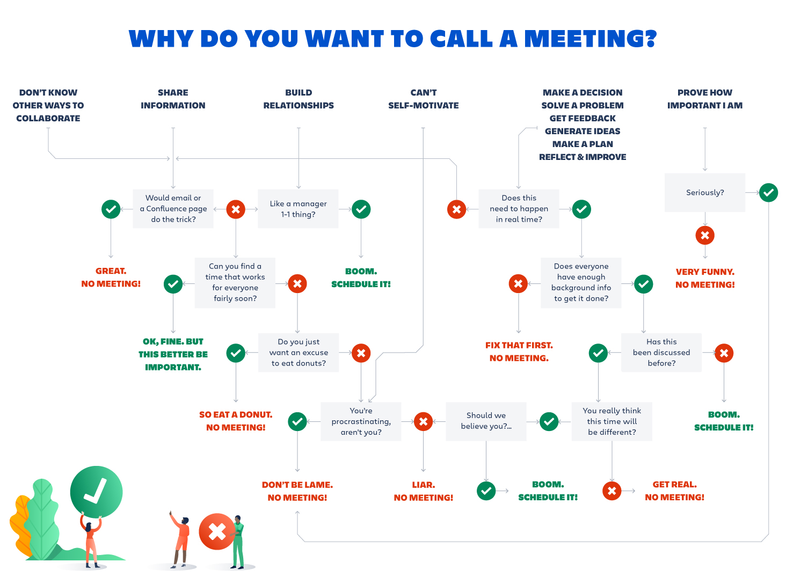

###### [Home](https://github.com/RyKaj/Documentation/blob/master/README.md) | [Leadership](https://github.com/RyKaj/Documentation/tree/master/Leadership/README.md) |
------------

# Leadership : Run Effective Meetings

## Run Effective Meetings

### Set the Agenda

It may seem like an obvious requirement, but a lot of meetings start
with no clear sense of purpose. The meeting’s agenda can be summarized
on a handout, written on a whiteboard or discussed explicitly at the
outset, but everyone should know why they’ve gathered and what they’re
supposed to be accomplishing. **The agenda provides a compass for the
conversation,** so the meeting can get back on track if the discussion
wanders off course. 

If leaders make sure there is an agenda before a meeting starts,
everyone will fall in line quickly.

Have a clear purpose - vague intentions to have a discussion on a topic
rarely end on a productive note. If you are just getting started with
agendas, start with a point form list of topics to be discussed and make
sure that material is provided to attendees at least one day before the
meeting. For better results, provide background information on the
agenda so that everyone attending has the same information.

What about when you are asked to attend a meeting without an agenda?
Ask, “Can you please send me an agenda for the meeting so that I can
prepare?”

**Tip:** For frequently held meetings such as a weekly status meeting on
a project, you can save time by creating a meeting template. Once you
have that in place, preparing an agenda becomes a matter of filling in
the blanks.

### Review The Attendee List

The people in the meeting room make or break your effectiveness. I have
been in MANY meetings where the key person – a manager or executive – is
not present. As a result, no significant decisions can be made.

For Meeting Organizers: limit the number of people attending the
meeting. The purpose of meetings is to make decisions and get work done.
For the most part, meetings are not the best way to simply share
information (exception: meetings are helpful to share sensitive
information)

For Meeting Attendees: read the attendee list before you walk into the
room. Do you see any unfamiliar names? If so, consider looking them up
in your organization’s directory (or on LinkedIn). Surprises are not
your friend when it comes to meetings.

Manage The Meeting By the Clock

Watching the clock is important in an effective meeting. When nobody
takes charge of managing time, it is easy to become careless and
unfocused. Remember – when people attend a meeting they cannot do
anything else. Make the time count\!

#### Meeting Organizer - Start on Time. End on Time.

Nothing can drain the energy from a room quite like waiting for the
person in charge to show up. Why do so many in positions of power fall
into the bad habit of being late for meetings? Is it just that they’re
so busy? Or is there a small thrill in keeping everyone waiting for
them, a reminder that their time is somehow more valuable than everyone
else’s?

Just as important as starting on time is ending on time. A definitive
end time will help ensure that you accomplish what’s on your agenda and
get people back to their work promptly. “I like to have an agenda that
we think through,” Mr. Lundgren added, “and we say, ‘This meeting’s
going to go for two hours,’ and we force ourselves to carve through the
agenda.’”

#### Meeting Attendees

Start by arriving early at the meeting (I suggest 5 minutes for in
person meetings and 1-2 meetings for conference calls). That means
avoiding back to back committments on your calendar whenever possible.

### Use The Parking Lot To Manage Off Topic Discussion

This helpful device performs two useful functions:

1.  it serves to keep the meeting focused on the stated agenda
2.  the parking lot acknowledges important points raised by attendees.

Warning: The Parking Lot habit must be combined with the Follow Up habit
if you wish to be truly effective. Otherwise, you are likely to gain a
reputation for simply making a show of acknowledging other people.

As a meeting organizer, here are a few steps to use the parking lot concept.

1.  At the beginning of the meeting, explain you expect everyone to
    focus their discussions on the agenda. Further, explain that this
    rule will help the meeting stay productive and end on time.
2.  Keep the meeting agenda document in front of you as a guide.
3.  Go through each agenda item
4.  Monitor and contribute to the discussion
5.  When someone raises an interesting point that does not relate to the
    agenda, say the following: “Thank you for that point, Tim. However,
    Microsoft Visual Studio tools go beyond the purpose of this meeting.
    Let me write down that item in the parking lot and I will include it
    in the meeting notes that I will send out by email so we can explore
    that point at the right time.”

### Keep Attendees Engaged

[It’s okay to start the meeting by setting the expectation that everyone
is 100% focused on what’s going on in the room. Let the group know that
if someone has work that is so pressing they’d be tempted to multi-task,
they have permission to go do that work and catch up on what happened in
the meeting later. They’ll produce better work, and you’ll have more
engaged participants.
Win-win](https://twitter.com/intent/tweet?source=webclient&amp;via=atlassian&amp;text=It%E2%80%99s%20okay%20to%20start%20the%20meeting%20by%20setting%20the%20expectation%20that%20everyone%20is%20100%%20focused%20on%20what%E2%80%99s%20going%20on%20in%20the%20room.%20Let%20the%20group%20know%20that%20if%20someone%20has%20work%20that%20is%20so%20pressing%20they%E2%80%99d%20be%20tempted%20to%20multi-task,%20they%20have%20permission%20to%20go%20do%20that%20work%20and%20catch%20up%20on%20what%20happened%20in%20the%20meeting%20later.%20They%E2%80%99ll%20produce%20better%20work,%20and%20you%E2%80%99ll%20have%20more%20engaged%20participants.%20Win-win&amp;url=https://www.atlassian.com/blog/teamwork/how-to-run-effective-meetings)

When I first started facilitating these types of meetings, I ran myself
ragged writing on whiteboards, capturing notes, and moving flip chart
sheets around. I was working up a sweat and everyone else was just
sitting in their chairs. I thought that I needed to be doing all of the
work in order to be a valuable facilitator.

I now know that it's the opposite. I assign roles for the meeting and
make them do the work. They write on the flip charts themselves, I
designate a scribe to take notes, and I even assign someone to be a DJ
to play music during breakout sessions. This keeps them engaged and
moving around and it allows me to focus on observing the team dynamics
and tracking the overall agenda.

### Manage The Team's Energy

One of the main issues with full-day or multi-day meetings is managing
the level of energy in the room. Mental focus and blood sugar level will
wax and wane dramatically throughout the day. It is important to keep
the energy high and avoid running into ruts.

I like to start mornings and afternoons with a physical exercise.
Anything that gets people out of their chairs and moving around is
helpful. For example, I will ask people to stand around a flipchart to
discuss rather than sit in their seats. You can also create exercises
that get people moving around the room or even do breakout sessions
outside so people can walk around. The idea is to keep them moving.

### Take Notes for Yourself

Taking notes in meetings is an essential skill yet I am often struck by
how often people forget to do it. The key reason to take notes in a
meeting is to record any questions or assignments that have been
directed to you. Let’s look at how attendees and organizers can act on
notes.

Take notes in a paper notebook rather than using a computer, tablet or
other device. Even if you have fantastic abilities to focus on the
meeting, other people may assume that you are “catching up on email”
instead of paying attention to the meeting if you take notes on a
computer.

#### Meeting Organizers

if you plan to send minutes or a summary of the meeting to attendees,
say this at the start of the meeting and explain what you will include.
Sending out meeting minutes, even a few paragraphs or bullet points, is
a best practice.

#### Meeting Attendees

bring a copy of the agenda and use that document to guide your note
taking. Focus on the decisions made in the meeting and items that
require further investigation or action on your part.

### End with an Action Plan

**Leave the last few minutes of every meeting to discuss the next
steps.** This discussion should include deciding who is responsible for
what, and what the deadlines are. Otherwise, all the time you spent on
the meeting will be for naught.

## Follow Up On The Meeting

The art and science of follow up is vital professional habit and it also
matters in the context of meetings. When it comes to meeting tips,
following up in a timely basis is a great way to manage stress and make
a good impression on others. For the best results, I suggest following
up (e.g. making a phone call, writing an email etc) the same day as the
meeting. For very important matters, make a note on your calendar or
task management tool of choice to continue following up until you reach
a resolution.

## Kill Unproductive Meetings

Meetings are almost always a huge drain on your time, and should be
killed on sight. 

A productive meeting would be if ideas could be communicated and agreed
upon faster than through phones or email, not longer. A productive
meeting would have a clearly stated purpose, be as short as possible,
and have an outcome with assigned tasks to be completed after the
meeting.  **In all the organizations I’ve worked for or been involved
with, those meetings are truly rare — if they even exist.**

Instead, kill the meetings in your life, and get tons more done. Here’s
how:

  - **Don’t hold meetings**. If you’re the boss, or you’re in charge of
    scheduling meetings, you have the authority to cancel them. Try
    going one day without them. Instead, have the same purposes be
    accomplished through email. Do you have a meeting where people give
    you progress reports? Have them email you a progress report daily,
    at a specified time each day, and have your assistant collect them
    compile an overall daily report for you. A meeting at a glance.
  - **Communicate through email, phone, then person-to-person**. Make
    email your default communication mode. If someone wants to set up a
    meeting, ask them to email you with their questions instead. If
    that’s not good enough, agree to talk on the phone about it. As a
    last resort, agree to a 5-minute face-to-face, standing up. Don’t
    agree to coffee or lunch — most of the time, you’re just chit
    chatting. And when you do talk on the phone or in person, get to the
    point quickly — eliminate the preliminary friendly chatting. Just
    dive right in: OK, what needs to be done here? What are we trying to
    accomplish? What tasks will be done by whom? And then you’re done.
  - **Beg off**. If you’re not the boss, you might not control whether
    meetings are held or not. In that case, ask to skip it. Say that
    you’ve got an urgent project on deadline, and you won’t be able to
    make the meeting. If your boss tries to insist that you make it, ask
    if he or she would like to grant you an extension on your project.
  - **Accomplish the agenda**. Before the meeting, ask for a copy of the
    agenda. Then accomplish whatever’s on the agenda before the meeting
    even takes place. For example, if the meeting is to discuss a
    report, annotate the report thoroughly with your comments, and put
    your recommended actions at the bottom. Email that to your boss, and
    say that you’ve already done what’s required, so you can work on
    another project instead. Eliminate the need for you to be at the
    meeting.
  - **The Puppydog Technique**. Tim Ferriss, author of  [The 4-hour
    Workweek](http://www.fourhourworkweek.com/blog/), suggests that you
    use the Puppydog sales technique to get out of meetings. Basically,
    this technique was originally used by pet shops to make a sale — if
    the customer is wavering, tell them to just take home the puppy and
    give it a try, and if it doesn’t work out, they can bring the puppy
    back. Many people will agree to this little trial — and they rarely
    bring the puppy back. Ask your boss if you can skip the meeting,
    just for today, as you need to finish something urgent. Just this
    once is hard to turn down. Eventually, your boss will realize that
    you don’t need to go to the meeting and that you’re more productive
    if you don’t.
  - **Work from home**. Convince your boss to let you work from home,
    and you can skip all meetings. This, of course, is ideal. Just make
    sure you’re more productive at home than at the office.
  - **Get stuff done**. If you are able to skip a meeting, actually get
    stuff done — important stuff. Be 10 times as productive as the
    people who went to the meeting.
  - **Show proof**. When the boss comes out of the meeting you skipped,
    turn in that big report or project. Show that you were super
    productive without the meeting — with cold, hard proof. Do this
    enough times, and you will impress your boss and the unproductive
    meeting will be a distant memory.

### Team Understanding

  - A good team is formed out of necessity, they work with what they got
    in the skills arena.
  - A superb team understands each members’ psychology. In other words,
    they know how to adjust their communication according to each
    personality.
  - An excellent team grasps the philosophical foundations of the
    member’s decisions making. They understand what makes everyone
    tick.

### Avoidance of Conflict

What often happens in smaller companies and organizations which do not
have a large pool to fish out off, that they use two metrics to create
functional teams.

  - Like in any team, the skill sets have to be diversified, to move
    with greater speed.
  - To then accomplish the increase of pace, compared to that of an
    individual, they strive to align interest as to avoid decision
    fatigue.

Decision fatigue can decrease cognition, productivity, social awareness
of any team member in any kind of team.

Problem is that mutual agreement leads to bias, tunnel vision,
conventional creativity of thought.

<kbd></kbd>

[Source:
https://www.atlassian.com/blog/teamwork/how-to-run-effective-meetings](https://www.atlassian.com/blog/teamwork/how-to-run-effective-meetings)

References

  - [How to Run a More Effective Meeting](https://www.nytimes.com/guides/business/how-to-run-an-effective-meeting)
  - [7 Tips To More Productive Meetings](http://projectmanagementhacks.com/meeting-tips/)
  - [Running effective meetings: a guide for humans](https://www.atlassian.com/blog/teamwork/how-to-run-effective-meetings)
  - [Inc -  6 ways to run productive meetings employees actually want to go to](https://www.inc.com/bruce-eckfeldt/6-ways-to-run-productive-meetings-employees-actually-want-to-go-to.md?cid=hmhero)
  - [Sources of Insight - how to have more effective meetings](http://sourcesofinsight.com/how-to-have-more-effective-meetings/?utm_source=feedburner&utm_medium=feed&utm_campaign=Feed%3A+SourcesOfInsight+%28Sources+of+Insight%29)

