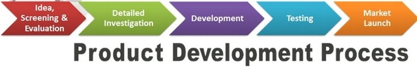

# **Lean Canvas**

**Description**

<kbd>[Lean Product Canvas Template (.pptx)](./attachments/Lean%20Product%20Canvas%20Template.pptx)</kbd>

A Lean Canvas is a lightweight business case which helps us make decisions relating to which customer and technology problems we want to solve, and what approach we will take to solving a specific problem. ​ The Lean Canvas template is applicable to the Identify, Validate and Plan stages of the [Product Creation Process](file:///C:/confluence/display/ATX/Product+Creation+Process).

There are 5 key stages on the PCP as outlined in the diagram below. It is important to note that the diagram below is represented as a cycle, Feedback from metrics obtained in production metrics via the core product features or experimentation - should feed into future iterations of the product. The length of the cycles will depend on the specific initiative - however the general goal will be to always reduce the feedback loop time from ideation to learning via feature deployment.

## Idea, Screening & Evaluation
Investigate the customer probelm using data, insights, and develop an hypothesis which we will later test in Detailed Investigation phase.

## Detailed investigation
Test our hypothesis using data and experimentation. We then assess solution options for desirability, feasibility and viability.

Plan the solution that will land customer value through N iterations. As we are using an Agile approach, the plan is an initial version which will evolve as the initiative moves through build.  

## Development
Develop features into production. 

## Testing
Test features into production. 

## Market Launch
Launch features to customers. There is a strong focus on Product Metrics to assess whether the features land as anticipated in the Validate stage and what new insights we can glean from the data.
