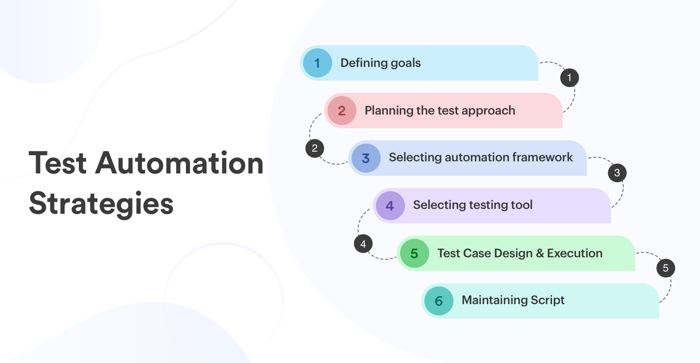
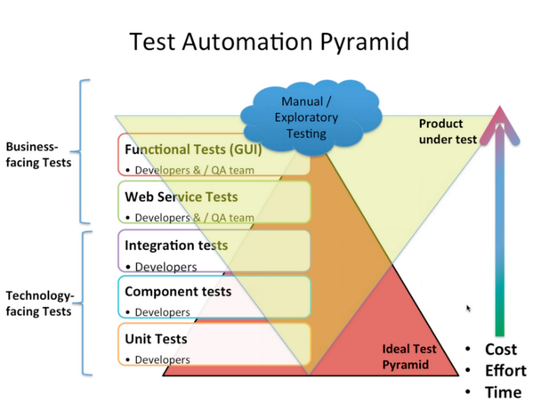

###### [Home](https://github.com/RyKaj/Documentation/blob/master/README.md) | [Quality Assurance (QA)](https://github.com/RyKaj/Documentation/tree/master/QA/README.md) |
------------

# Quality Assurance (QA) : Test Automation Standards

Production-ready software requires testing before it goes into
production. As the discipline of software development matured, software
testing approaches have matured too. Instead of having myriads of manual
software testers, development teams have moved towards automating the
biggest portion of their testing efforts. Automating their tests allows
teams to know whether their software is broken in a matter of seconds
and minutes instead of days and weeks.

The drastically shortened feedback loop fuelled by automated tests goes
hand in hand with agile development practices, continuous delivery and
DevOps culture. Having an effective software testing approach allows
teams to move fast and with confidence.

## Importance of Test Automation

Software has become an essential part of the world we live in. It has
outgrown its early sole purpose of making businesses more efficient.
Today companies try to find ways to become first-class digital
companies. As users everyone of us interacts with an ever-increasing
amount of software every day. The wheels of innovation are turning
faster.

If you want to keep pace you'll have to look into ways to deliver your
software faster without sacrificing its quality. **Continuous
delivery**, a practice where you automatically ensure that your software
can be released into production any time, can help you with that. With
continuous delivery you use a **build pipeline** to automatically test
your software and deploy it to your testing and production environments.

Building, testing and deploying an ever-increasing amount of software
manually soon becomes impossible — unless you want to spend all your
time with manual, repetitive work instead of delivering working
software. Automating everything — from build to tests, deployment and
infrastructure — is your only way forward.

<kbd></kbd>

Figure 1: Use build pipelines to automatically and reliably get your
software into production

Traditionally software testing was overly manual work done by deploying
your application to a test environment and then performing some
black-box style testing e.g. by clicking through your user interface to
see if anything's broken. Often these tests would be specified by test
scripts to ensure the testers would do consistent checking.

It's obvious that testing all changes manually is time-consuming,
repetitive and tedious. Repetitive is boring, boring leads to mistakes
and makes you look for a different job by the end of the week.

Luckily there's a remedy for repetitive tasks: *automation*.

Automating your repetitive tests can be a big game changer in your life
as a software developer. Automate these tests and you no longer have to
mindlessly follow click protocols in order to check if your software
still works correctly. Automate your tests and you can change your
codebase without batting an eye. If you've ever tried doing a
large-scale refactoring without a proper test suite I bet you know what
a terrifying experience this can be. How would you know if you
accidentally broke stuff along the way? Well, you click through all your
manual test cases, that's how. But let's be honest: do you really enjoy
that? How about making even large-scale changes and knowing whether you
broke stuff within seconds while taking a nice sip of coffee? Sounds
more enjoyable if you ask me.

The figure shows the initial time & efforts it takes in learning the
best practices of test automation. But we can see how it saves the
overall effort and time spent.

<kbd></kbd>

## Test Pyramid

Test Pyramid is a great visual metaphor telling you to think about
different layers of testing. It also tells you how much testing to do on
each layer.

Stick to the pyramid shape to come up with a healthy, fast and
maintainable test suite: Write *lots* of small and fast *unit tests*.
Write *some* more coarse-grained tests and *very few* high-level tests
that test your application from end to end. Watch out that you don't end
up with a [test ice-cream cone](https://watirmelon.blog/testing-pyramids/) that will be a
nightmare to maintain and takes way too long to run.

Don't become too attached to the names of the individual layers in
Cohn's test pyramid. In fact they can be quite misleading: *service
test* is a term that is hard to grasp (Cohn himself talks about the
observation that [a lot of developers completely ignore this layer](https://www.mountaingoatsoftware.com/blog/the-forgotten-layer-of-the-test-automation-pyramid)
). In the days of single page application frameworks like react,
angular, ember.js and others it becomes apparent that *UI tests* don't
have to be on the highest level of your pyramid - you're perfectly able
to unit test your UI in all of these frameworks.

<kbd></kbd>

**Legends**

  - Colors: does not have any meaning
  - The size of the diamond face represents the test coverage in each
    phase
  - On the left, there is a hypothesis of test type (change it to fit
    needs)
  - Some other type of test like performance, stability, soak, code
    validation, security investigations, infrastructure checks, … should
    be added.

Automated Test should cover mostly critical functionalities (for example
the Order Flow, the Customer Care channels, the delivery process, ….)
and must cover deep investigations on the visible User interface and in
the invisible backend systems, databases, virtual environments,
integration with external systems, …

It is not an easy job\! It cannot be done only by a traditional test
gate.

Confidence in testing can be eroded by doubts: are we testing the right
things, are a test-set at the proper coverage, are the integration tests
executes in production-like setup, and so on. As mitigation we can:

  - At the Planning phase, decide which is the minimum set of test that
    has to be passed to declare the work done and ready for the next
    stage.
  - During each DevOps stage to look at the set of test and fill any gap
    or modify test things
  - At the Release stage (if using the Release on-demand) someone has
    the duty to approve the Deployment. He/She need a clear and
    synthetic view of the test results. So, taking track of all the
    testing results is crucial.
  - Reporting of historical results and their comparisons help in
    improvements
  - Learn from Production exceptions
  - On some stages, it is crucial to simulate some behavior (an
    integrated service is not available, not ready, unstable, under
    maintenance or not reachable), a service virtualization solution
    should help in doing things faster and with confidence. My thoughts
    are here…

## Eye of Providence

<kbd></kbd>

## Testing Cloud

<kbd></kbd>

## Anti Pattern

### Ice-cream Cone

<kbd></kbd>

References

  - [Medium - Agility in it development requires the use of test automation](https://medium.com/@davide.cilano/agility-in-it-development-requires-the-use-of-test-automation-d11503db3508)
  - [Watirmelon - Testing pyramids](https://watirmelon.blog/testing-pyramids/)
  - [Martin Fowler - Practical test pyramid](https://martinfowler.com/articles/practical-test-pyramid.md)
  - [Simform - test automation Strategy](https://www.simform.com/test-automation-strategy/)

