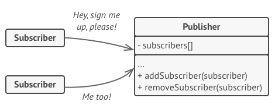
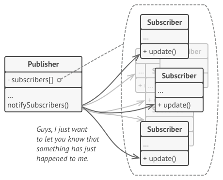
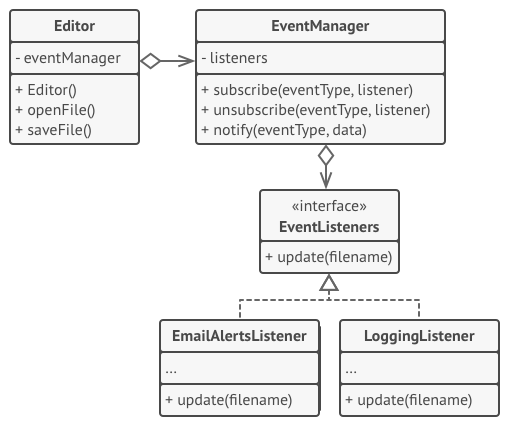

###### [Home](https://github.com/RyKaj/Documentation/blob/master/README.md) | [Software Development](https://github.com/RyKaj/Documentation/tree/master/SoftwareDevelopment/README.md) | [Design Patterns](https://github.com/RyKaj/Documentation/tree/master/SoftwareDevelopment/Design%20Patterns/README.md) |
------------

# Information Technology : Observer Pattern

## Observer

### Intent

**Observer** is a behavioral design pattern that lets you define a
subscription mechanism to notify multiple objects about any events that
happen to the object they’re observing.

<kbd></kbd>

## Problem

Imagine that you have two types of objects: a `Customer` and a `Store`.
The customer is very interested in a particular brand of product (say,
it’s a new model of the iPhone) which should become available in the
store very soon.

The customer could visit the store every day and check product
availability. But while the product is still en route, most of these
trips would be pointless.

<kbd></kbd>

On the other hand, the store could send tons of emails (which might be
considered spam) to all customers each time a new product becomes
available. This would save some customers from endless trips to the
store. At the same time, it’d upset other customers who aren’t
interested in new products.

It looks like we’ve got a conflict. Either the customer wastes time
checking product availability or the store wastes resources notifying
the wrong customers.

### Solution

The object that has some interesting state is often called *subject* ,
but since it’s also going to notify other objects about the changes to
its state, we’ll call it *publisher*. All other objects that want to
track changes to the publisher’s state are called *subscribers*.

The Observer pattern suggests that you add a subscription mechanism to
the publisher class so individual objects can subscribe to or
unsubscribe from a stream of events coming from that publisher. Fear
not\! Everything isn’t as complicated as it sounds. In reality, this
mechanism consists of 1) an array field for storing a list of references
to subscriber objects and 2) several public methods which allow adding
subscribers to and removing them from that list.

<kbd></kbd>

Now, whenever an important event happens to the publisher, it goes over
its subscribers and calls the specific notification method on their
objects.

Real apps might have dozens of different subscriber classes that are
interested in tracking events of the same publisher class. You wouldn’t
want to couple the publisher to all of those classes. Besides, you might
not even know about some of them beforehand if your publisher class is
supposed to be used by other people.

That’s why it’s crucial that all subscribers implement the same
interface and that the publisher communicates with them only via that
interface. This interface should declare the notification method along
with a set of parameters that the publisher can use to pass some
contextual data along with the notification.

<kbd></kbd>

If your app has several different types of publishers and you want to
make your subscribers compatible with all of them, you can go even
further and make all publishers follow the same interface. This
interface would only need to describe a few subscription methods. The
interface would allow subscribers to observe publishers’ states without
coupling to their concrete classes.

### Structure

<kbd></kbd>

### Pseudocode

<kbd></kbd>

### Real world example

A good example would be the job seekers where they subscribe to some job
posting site and they are notified whenever there is a matching job
opportunity.

### In plain words

Defines a dependency between objects so that whenever an object changes
its state, all its dependents are notified.

### Wikipedia says

The observer pattern is a software design pattern in which an object,
called the subject, maintains a list of its dependents, called
observers, and notifies them automatically of any state changes, usually
by calling one of their methods.

### Pros and Cons


<table>
<thead>
    <tr class="header">
        <th>Pros</th>
        <th>Cons</th>
    </tr>
    </thead>
    <tbody>
        <tr class="odd">
            <td><em>Open/Closed Principle</em>. You can introduce new subscriber classes without having to change the publisher’s code (and vice versa if there’s a publisher interface).</td>
            <td>Subscribers are notified in random order.</td>
        </tr>
        <tr class="even">
            <td>You can establish relations between objects at runtime.</td>
            <td><br /></td>
        </tr>
    </tbody>
</table>


### Programmatic Example

#### C\#


Translating our example from above. First of all we have job seekers
that need to be notified for a job posting

> 
> 
> ``` 
> class JobPost
> {
>     public string Title { get; private set; }
> 
>     public JobPost(string title)
>     {
>         Title = title;
>     }
> }
> class JobSeeker : IObserver <JobPost>
> {
>     public string Name { get; private set; }
> 
>     public JobSeeker(string name)
>     {
>         Name = name;
>     }
> 
>     //Method is not being called by JobPostings class currently
>     public void OnCompleted()
>     {
>         //No Implementation
>     }
> 
>     //Method is not being called by JobPostings class currently
>     public void OnError(Exception error)
>     {
>         //No Implementation
>     }
> 
>     public void OnNext(JobPost value)
>     {
>         Console.WriteLine($"Hi {Name} ! New job posted: {value.Title}");
>     }
> }
>                     
> ```

Then we have our job postings to which the job seekers will subscribe

> 
> 
> ``` 
> class JobPostings : IObservable<JobPost>
> {
>   private List <IObserver <JobPost>> mObservers;
>   private List <JobPost> mJobPostings;
> 
>   public JobPostings()
>   {
>     mObservers = new List<IObserver<JobPost>>();
>     mJobPostings = new List<JobPost>();
>   }
> 
>   public IDisposable Subscribe(IObserver<JobPost> observer)
>   {
>     // Check whether observer is already registered. If not, add it
>     if (!mObservers.Contains(observer))
>     {
>       mObservers.Add(observer);
>     }
>     return new Unsubscriber<JobPost>(mObservers, observer);
>   }
> 
>   private void Notify(JobPost jobPost)
>   {
>     foreach(var observer in mObservers)
>     {
>       observer.OnNext(jobPost);
>     }
>   }
> 
>   public void AddJob(JobPost jobPost)
>   {
>     mJobPostings.Add(jobPost);
>     Notify(jobPost);
>   }
> 
> }
> 
> internal class Unsubscriber<JobPost> : IDisposable
> {
>   private List<IObserver<JobPost>> mObservers;
>   private IObserver<JobPost> mObserver;
> 
>   internal Unsubscriber(List<IObserver<JobPost>> observers, IObserver<JobPost> observer)
>   {
>     this.mObservers = observers;
>     this.mObserver = observer;
>   }
> 
>   public void Dispose()
>   {
>     if (mObservers.Contains(mObserver))
>       mObservers.Remove(mObserver);
>   }
> }
>                         
> ```

Then it can be used as

> 
> 
> ``` 
> //Create Subscribers
> var johnDoe = new JobSeeker("John Doe");
> var janeDoe = new JobSeeker("Jane Doe");
> 
> //Create publisher and attch subscribers
> var jobPostings = new JobPostings();
> jobPostings.Subscribe(johnDoe);
> jobPostings.Subscribe(janeDoe);
> 
> //Add a new job and see if subscribers get notified
> jobPostings.AddJob(new JobPost("Software Engineer"));
> 
> //Output
> // Hi John Doe! New job posted: Software Engineer
> // Hi Jane Doe! New job posted: Software Engineer
> 
> Console.ReadLine();
>                     
> ```


#### JavaScript


Translating our example from above. First of all we have job seekers
that need to be notified for a job posting

> 
> 
> ``` 
> const JobPost = title => ({
>     title: title
> })
> 
> class JobSeeker {
>     constructor(name) {
>         this._name = name
>     }
> 
>     notify(jobPost) {
>         console.log(this._name, 'has been notified of a new posting :', jobPost.title)
>     }
> }
>                     
> ```

Then we have our job postings to which the job seekers will subscribe

> 
> 
> ``` 
> class JobBoard {
>     constructor() {
>         this._subscribers = []
>     }
> 
>     subscribe(jobSeeker) {
>         this._subscribers.push(jobSeeker)
>     }
> 
>     addJob(jobPosting) {
>         this._subscribers.forEach(subscriber => {
>             subscriber.notify(jobPosting)
>         })
>     }
> }
>                     
> ```

Then it can be used as

> 
> 
> ``` 
> // Create subscribers
> const jonDoe = new JobSeeker('John Doe')
> const janeDoe = new JobSeeker('Jane Doe')
> const kaneDoe = new JobSeeker('Kane Doe')
> 
> // Create publisher and attach subscribers
> const jobBoard = new JobBoard()
> jobBoard.subscribe(jonDoe)
> jobBoard.subscribe(janeDoe)
> 
> // Add a new job and see if subscribers get notified
> jobBoard.addJob(JobPost('Software Engineer'))
> 
> // Output
> // John Doe has been notified of a new posting : Software Engineer
> // Jane Doe has been notified of a new posting : Software Engineer
>                     
> ```


#### PHP


Translating our example from above. First of all we have job seekers
that need to be notified for a job posting

> 
> 
> ``` 
> class JobPost
> {
>     protected $title;
> 
>     public function __construct(string $title)
>     {
>         $this->title = $title;
>     }
> 
>     public function getTitle()
>     {
>         return $this->title;
>     }
> }
> 
> class JobSeeker implements Observer
> {
>     protected $name;
> 
>     public function __construct(string $name)
>     {
>         $this->name = $name;
>     }
> 
>     public function onJobPosted(JobPost $job)
>     {
>         // Do something with the job posting
>         echo 'Hi ' . $this->name . '! New job posted: '. $job->getTitle();
>     }
> }
>                     
> ```

Then we have our job postings to which the job seekers will subscribe

> 
> 
> ``` 
> class EmploymentAgency implements Observable
> {
>     protected $observers = [];
> 
>     protected function notify(JobPost $jobPosting)
>     {
>         foreach ($this->observers as $observer) {
>             $observer->onJobPosted($jobPosting);
>         }
>     }
> 
>     public function attach(Observer $observer)
>     {
>         $this->observers[] = $observer;
>     }
> 
>     public function addJob(JobPost $jobPosting)
>     {
>         $this->notify($jobPosting);
>     }
> }
>                     
> ```

Then it can be used as

> 
> 
> ``` 
> // Create subscribers
> $johnDoe = new JobSeeker('John Doe');
> $janeDoe = new JobSeeker('Jane Doe');
> 
> // Create publisher and attach subscribers
> $jobPostings = new EmploymentAgency();
> $jobPostings->attach($johnDoe);
> $jobPostings->attach($janeDoe);
> 
> // Add a new job and see if subscribers get notified
> $jobPostings->addJob(new JobPost('Software Engineer'));
> 
> // Output
> // Hi John Doe! New job posted: Software Engineer
> // Hi Jane Doe! New job posted: Software Engineer
>                     
> ```


#### Python


> ``` 
> #!/usr/bin/env python
> # -*- coding: utf-8 -*-
> 
> """
> http://code.activestate.com/recipes/131499-observer-pattern/
> 
> *TL;DR
> Maintains a list of dependents and notifies them of any state changes.
> 
> *Examples in Python ecosystem:
> Django Signals: https://docs.djangoproject.com/en/2.1/topics/signals/
> Flask Signals: http://flask.pocoo.org/docs/1.0/signals/
> """
> 
> from __future__ import print_function
> 
> 
> class Subject(object):
>     def __init__(self):
>         self._observers = []
> 
>     def attach(self, observer):
>         if observer not in self._observers:
>             self._observers.append(observer)
> 
>     def detach(self, observer):
>         try:
>             self._observers.remove(observer)
>         except ValueError:
>             pass
> 
>     def notify(self, modifier=None):
>         for observer in self._observers:
>             if modifier != observer:
>                 observer.update(self)
> 
> 
> # Example usage
> class Data(Subject):
>     def __init__(self, name=''):
>         Subject.__init__(self)
>         self.name = name
>         self._data = 0
> 
>     @property
>     def data(self):
>         return self._data
> 
>     @data.setter
>     def data(self, value):
>         self._data = value
>         self.notify()
> 
> 
> class HexViewer:
>     def update(self, subject):
>         print(u'HexViewer: Subject %s has data 0x%x' % (subject.name, subject.data))
> 
> 
> class DecimalViewer:
>     def update(self, subject):
>         print(u'DecimalViewer: Subject %s has data %d' % (subject.name, subject.data))
> 
> 
> # Example usage...
> def main():
>     """
>     >>> data1 = Data('Data 1')
>     >>> data2 = Data('Data 2')
>     >>> view1 = DecimalViewer()
>     >>> view2 = HexViewer()
>     >>> data1.attach(view1)
>     >>> data1.attach(view2)
>     >>> data2.attach(view2)
>     >>> data2.attach(view1)
> 
>     >>> data1.data = 10
>     DecimalViewer: Subject Data 1 has data 10
>     HexViewer: Subject Data 1 has data 0xa
> 
>     >>> data2.data = 15
>     HexViewer: Subject Data 2 has data 0xf
>     DecimalViewer: Subject Data 2 has data 15
> 
>     >>> data1.data = 3
>     DecimalViewer: Subject Data 1 has data 3
>     HexViewer: Subject Data 1 has data 0x3
> 
>     >>> data2.data = 5
>     HexViewer: Subject Data 2 has data 0x5
>     DecimalViewer: Subject Data 2 has data 5
> 
>     # Detach HexViewer from data1 and data2
>     >>> data1.detach(view2)
>     >>> data2.detach(view2)
> 
>     >>> data1.data = 10
>     DecimalViewer: Subject Data 1 has data 10
> 
>     >>> data2.data = 15
>     DecimalViewer: Subject Data 2 has data 15
>     """
> 
> 
> if __name__ == "__main__":
>     import doctest
>     doctest.testmod()
>                     
> ```

