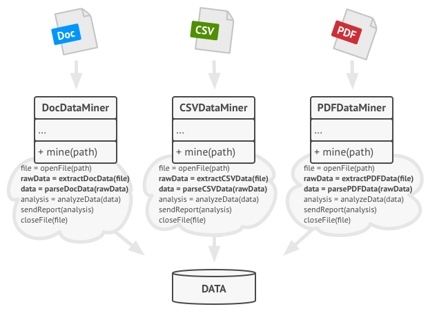
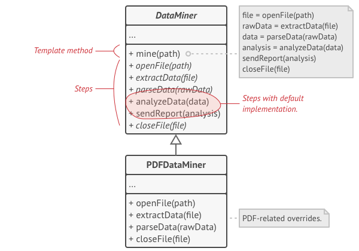
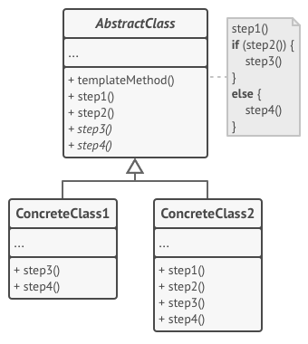
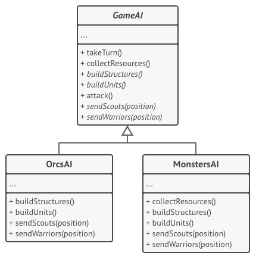

###### [Home](https://github.com/RyKaj/Documentation/blob/master/README.md) | [Software Development](https://github.com/RyKaj/Documentation/tree/master/SoftwareDevelopment/README.md) | [Design Patterns](https://github.com/RyKaj/Documentation/tree/master/SoftwareDevelopment/Design%20Patterns/README.md) |
------------

# Information Technology : Template Method Pattern


## Template Method

### Intent

**Template Method** is a behavioral design pattern that defines the
skeleton of an algorithm in the superclass but lets subclasses override
specific steps of the algorithm without changing its structure.

<kbd></kbd>

### Problem

Imagine that you’re creating a data mining application that analyzes
corporate documents. Users feed the app documents in various formats
(PDF, DOC, CSV), and it tries to extract meaningful data from these docs
in a uniform format.

The first version of the app could work only with DOC files. In the
following version, it was able to support CSV files. A month later, you
“taught” it to extract data from PDF files.

<kbd></kbd>

At some point, you noticed that all three classes have a lot of similar
code. While the code for dealing with various data formats was entirely
different in all classes, the code for data processing and analysis is
almost identical. Wouldn’t it be great to get rid of the code
duplication, leaving the algorithm structure intact?

There was another problem related to client code that used these
classes. It had lots of conditionals that picked a proper course of
action depending on the class of the processing object. If all three
processing classes had a common interface or a base class, you’d be able
to eliminate the conditionals in client code and use polymorphism when
calling methods on a processing object.

### Solution

The Template Method pattern suggests that you break down an algorithm
into a series of steps, turn these steps into methods, and put a series
of calls to these methods inside a single “template method.” The steps
may either be `abstract`, or have some default implementation. To use
the algorithm, the client is supposed to provide its own subclass,
implement all abstract steps, and override some of the optional ones if
needed (but not the template method itself).

Let’s see how this will play out in our data mining app. We can create a
base class for all three parsing algorithms. This class defines a
template method consisting of a series of calls to various
document-processing steps.

<kbd></kbd>

At first, we can declare all steps `abstract`, forcing the subclasses to
provide their own implementations for these methods. In our case,
subclasses already have all necessary implementations, so the only thing
we might need to do is adjust signatures of the methods to match the
methods of the superclass.

Now, let’s see what we can do to get rid of the duplicate code. It looks
like the code for opening/closing files and extracting/parsing data is
different for various data formats, so there’s no point in touching
those methods. However, implementation of other steps, such as analyzing
the raw data and composing reports, is very similar, so it can be pulled
up into the base class, where subclasses can share that code.

As you can see, we’ve got two types of steps:

  - *abstract steps* must be implemented by every subclass
  - *optional steps* already have some default implementation, but still
	can be overridden if needed

There’s another type of step, called *hooks*. A hook is an optional step
with an empty body. A template method would work even if a hook isn’t
overridden. Usually, hooks are placed before and after crucial steps of
algorithms, providing subclasses with additional extension points for an
algorithm.

The template method approach can be used in mass housing construction.
The architectural plan for building a standard house may contain several
extension points that would let a potential owner adjust some details of
the resulting house.

Each building step, such as laying the foundation, framing, building
walls, installing plumbing and wiring for water and electricity, etc.,
can be slightly changed to make the resulting house a little bit
different from others.

### Structure

<kbd></kbd>

### Pseudocode

In this example, the **Template Method** pattern provides a “skeleton”
for various branches of artificial intelligence in a simple strategy
video game.

<kbd></kbd>

### Real world example

Suppose we are getting some house built. The steps for building might
look like

  - Prepare the base of house
  - Build the walls
  - Add roof
  - Add other floors

The order of these steps could never be changed i.e. you can't build the
roof before building the walls etc but each of the steps could be
modified for example walls can be made of wood or polyester or stone.

### In plain words

Template method defines the skeleton of how a certain algorithm could be
performed, but defers the implementation of those steps to the children
classes.

### Wikipedia says

In software engineering, the template method pattern is a behavioral
design pattern that defines the program skeleton of an algorithm in an
operation, deferring some steps to subclasses. It lets one redefine
certain steps of an algorithm without changing the algorithm's
structure.

### Pros and Cons

<table>
	<colgroup>
		<col />
		<col />
	</colgroup>
	<tbody>
		<tr>
			<th>Pros</th>
			<th>Cons</th>
		</tr>
		<tr>
			<td>
				You can let clients override only certain parts of a large algorithm, making them less affected by changes that happen to other parts of the algorithm.
			</td>
			<td>
				Some clients may be limited by the provided skeleton of an algorithm.
			</td>
		</tr>
		<tr>
			<td>
				You can pull the duplicate code into a superclass.
			</td>
			<td>
				You might violate the
				<em>Liskov Substitution Principle</em>
				by suppressing a default step implementation via a subclass.
			</td>
		</tr>
		<tr>
			<td></td>
			<td>
				Template methods tend to be harder to maintain the more steps they have.
			</td>
		</tr>
	</tbody>
</table>

#### Programmatic Example

#### C\#


Imagine we have a build tool that helps us test, lint, build, generate
build reports (i.e. code coverage reports, linting report etc) and
deploy our app on the test server.

First of all we have our base class that specifies the skeleton for the
build algorithm

> 
> 
> ``` 
> abstract class Builder
> {
>     // Template method
>     public void Build()
>     {
>         Test();
>         Lint();
>         Assemble();
>         Deploy();
>     }
> 
>     abstract public void Test();
>     abstract public void Lint();
>     abstract public void Assemble();
>     abstract public void Deploy();
> }
>
> ```

Then we can have our implementations

> 
> 
> ``` 
> class AndroidBuilder : Builder
> {
>     public override void Assemble()
>     {
>         Console.WriteLine("Assembling the android build");
>     }
> 
>     public override void Deploy()
>     {
>         Console.WriteLine("Deploying android build to server");
>     }
> 
>     public override void Lint()
>     {
>         Console.WriteLine("Linting the android code");
>     }
> 
>     public override void Test()
>     {
>         Console.WriteLine("Running android tests");
>     }
> }
> 
> class IosBuilder : Builder
> {
>     public override void Assemble()
>     {
>         Console.WriteLine("Assembling the ios build");
>     }
> 
>     public override void Deploy()
>     {
>         Console.WriteLine("Deploying ios build to server");
>     }
> 
>     public override void Lint()
>     {
>         Console.WriteLine("Linting the ios code");
>     }
> 
>     public override void Test()
>     {
>         Console.WriteLine("Running ios tests");
>     }
> }
>
> ```

And then it can be used as

> 
> 
> ``` 
> var androidBuilder = new AndroidBuilder();
> androidBuilder.Build();
> 
> // Output:
> // Running android tests
> // Linting the android code
> // Assembling the android build
> // Deploying android build to server
> 
> var iosBuilder = new IosBuilder();
> iosBuilder.Build();
> 
> // Output:
> // Running ios tests
> // Linting the ios code
> // Assembling the ios build
> // Deploying ios build to server
>
> ```


#### JavaScript


Imagine we have a build tool that helps us test, lint, build, generate
build reports (i.e. code coverage reports, linting report etc) and
deploy our app on the test server.

First of all we have our base class that specifies the skeleton for the
build algorithm

> 
> 
> ``` 
> class Builder {
>     // Template method 
>     build() {
>         this.test()
>         this.lint()
>         this.assemble()
>         this.deploy()
>     }
> }
> 
>
> ```

Then we can have our implementations

> 
> 
> ``` 
> class AndroidBuilder extends Builder {
>     test() {
>         console.log('Running android tests')
>     }
>     
>     lint() {
>         console.log('Linting the android code')
>     }
>     
>     assemble() {
>         console.log('Assembling the android build')
>     }
>     
>     deploy() {
>         console.log('Deploying android build to server')
>     }
> }
> 
> class IosBuilder extends Builder {
>     test() {
>         console.log('Running ios tests')
>     }
>     
>     lint() {
>         console.log('Linting the ios code')
>     }
>     
>     assemble() {
>         console.log('Assembling the ios build')
>     }
>     
>     deploy() {
>         console.log('Deploying ios build to server')
>     }
> }
>
> ```

And then it can be used as

> 
> 
> ``` 
> const androidBuilder = new AndroidBuilder()
> androidBuilder.build()
> 
> // Output:
> // Running android tests
> // Linting the android code
> // Assembling the android build
> // Deploying android build to server
> 
> const iosBuilder = new IosBuilder()
> iosBuilder.build()
> 
> // Output:
> // Running ios tests
> // Linting the ios code
> // Assembling the ios build
> // Deploying ios build to server
> 
>
> ```


#### Python


> 
> 
> ``` 
> #!/usr/bin/env python
> # -*- coding: utf-8 -*-
> 
> """
> An example of the Template pattern in Python
> 
> *TL;DR
> Defines the skeleton of a base algorithm, deferring definition of exact
> steps to subclasses.
> 
> *Examples in Python ecosystem:
> Django class based views: https://docs.djangoproject.com/en/2.1/topics/class-based-views/
> """
> 
> 
> def get_text():
>     return "plain-text"
> 
> 
> def get_pdf():
>     return "pdf"
> 
> 
> def get_csv():
>     return "csv"
> 
> 
> def convert_to_text(data):
>     print("[CONVERT]")
>     return "{} as text".format(data)
> 
> 
> def saver():
>     print("[SAVE]")
> 
> 
> def template_function(getter, converter=False, to_save=False):
>     data = getter()
>     print("Got `{}`".format(data))
> 
>     if len(data) <= 3 and converter:
>         data = converter(data)
>     else:
>         print("Skip conversion")
> 
>     if to_save:
>         saver()
> 
>     print("`{}` was processed".format(data))
> 
> 
> def main():
>     """
>     >>> template_function(get_text, to_save=True)
>     Got `plain-text`
>     Skip conversion
>     [SAVE]
>     `plain-text` was processed
> 
>     >>> template_function(get_pdf, converter=convert_to_text)
>     Got `pdf`
>     [CONVERT]
>     `pdf as text` was processed
> 
>     >>> template_function(get_csv, to_save=True)
>     Got `csv`
>     Skip conversion
>     [SAVE]
>     `csv` was processed
>     """
> 
> 
> if __name__ == "__main__":
>     import doctest
>     doctest.testmod()
> 
>
> ```

