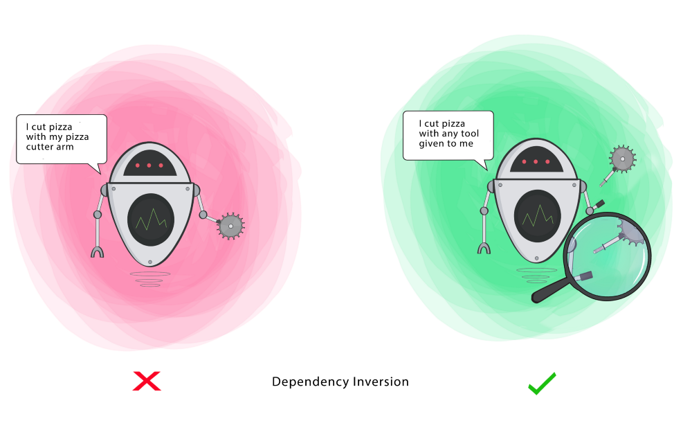

###### [Home](https://github.com/RyKaj/Documentation/blob/master/README.md) | [Software Development](https://github.com/RyKaj/Documentation/tree/master/SoftwareDevelopment/README.md) | [Design Patterns](https://github.com/RyKaj/Documentation/tree/master/SoftwareDevelopment/Design%20Patterns/README.md) |
------------

# Information Technology : SOLID Principles


## SOLID Design
  - **S**ingle Responsibility Principle (SRP)
      - A class should have a single responsibility and this responsibility should be entirely encapsulated by the class.
      - A class should have one, and only one, reason to change.
      - Domain classes must be isolated from Cross-Cutting Concerns: code responsible for persistence, validation, log, authentication, error handling, threading, caching…
      - When implementing your domain, favor POCO classes that do not have any dependency on an external framework. Note that a POCO class is not necessarily a  *fields and properties only* class, but can implement logic/behavior related to its data.
      - Use your understanding of the Domain to partition code: logics related to different business functions should be kept separated to avoid interference.
      - Regularly check the *Lack of Cohesion Of Methods* (LCOM) score of your classes.
      - Regularly check for too large and too complex classes.
  - **O**pen/Closed Principle (OCP)
      - Objects and entities should be open for extensions, but closed for modifications
      - You should be able to extended a classes behavior, without modifying it
      - A module will be said to be **open** if it is still available for extention
      - A module will be side to be **closed** if it is available for use by other modules
  - **L**iskov Substitution Principle (LSP)
      - The parent class should be able to refer child objects seamlessly during run time polymorphism
      - Derived classes must be substitute for their base classes
  - **I**nterface Segregation Principle (ISP)
      - A client should never be forced to implement an interface that it doesn't use or clients shouldn't be forced to depend on methods they do not use
      - Make fine grained interfaces that are client specific
  - **D**ependency Inversion Principle (DIP)
      - Entities must depend on abstractions not on concretions. It states that the high level module must not depend on the low level module, but they should depend on abstractions.
          - High-level modules should not depend on low-level modules. Both should depend on abstractions.
          - Abstractions should not depend on details. Details should depend on abstractions
  - **D**on’t repeat yourself (DRY)

> *A **cargo cult** is a belief system among members of a relatively undeveloped society in which adherents practice superstitious rituals hoping to bring modern goods supplied by a more technologically advanced society*

## Single Responsbility Principle (SRP)


### SRP and Concerns

Typically the [ActiveRecord pattern](https://en.wikipedia.org/wiki/Active_record_pattern) is used to exhibit a typical SRP violation. An ActiveRecord class has two responsibilities:

  - First an ActiveRecord object stores in-memory data retrieved from a relational database.
  - Second the record is active in the sense that data in-memory and data in the relational database are kept mirrored. For that, the CRUD (Create Read Update Delete) operations are implemented by the  ActiveRecord.

To make things concrete an ActiveRecord class can look like that:


> ``` 
> public class Employee {
>     public string Name { get; set; }
>     public string Address { get; set; }
>     ...
> 
>     public static Employee LoadFromName(string name) {
>     //below query will get only a value from DB
>     string sqlQuery = "SELECT * FROM Employee WHERE Name = '" + name + "' LIMIT 1;";
> 
>     // get value from DB and fill this employee with obtained value
>     Employee record = new Employee() { Name =  name, Address = ...};
>     return record;
>     }
>
>     public bool Create() {
>     // create the record in DB
>     }
>     public bool Update() {
>     // update the record in DB ...
>     }
>     public bool Delete() {
>     // delete the record in DB ...
>     }
> }
> ```

If Employee was a [POCO class](https://en.wikipedia.org/wiki/Plain_old_CLR_object) that doesn’t know about persistence and if the persistence was handled in a dedicated persistence layer the API would be improved because:

  - Not all Employee consumer wants to deal with persistence.
  - More importantly an Employee consumer really needs to know when an expensive DB roundtrip is triggered: if the Employee class is responsible for the persistence who knows if the data is persisted as soon as a setter is invoked?

Hence better isolate the persistence layer accesses and make them more explicit. This is why at NDepend we promote rules like  [UI layer shouldn’t use directly DB types](https://www.ndepend.com/default-rules/NDepend-Rules-Explorer.html?ruleid=ND1403#!) that can be easily adapted to enforce any sort of code isolation.

Persistence is what we call a  [cross-cutting concerns](https://en.wikipedia.org/wiki/Cross-cutting_concern), an aspect of the  implementation that tends to spawn all over the code. We can expect that most domain objects are concerned with persistence. Other cross-cutting-concerns we want to separate domain objects from include: validation, log, authentication, error handling, threading, caching. The need to separate domain entities from those cross-cutting concerns can be handled by some OOP pattern like  [the pattern decorator](https://en.wikipedia.org/wiki/Decorator_pattern) for example. Alternatively some [Object-Relational Mapping (ORM)](https://en.wikipedia.org/wiki/Object-relational_mapping) frameworks and some [Aspect-Oriented-Programming](https://en.wikipedia.org/wiki/Aspect-oriented_programming) (AOP) frameworks can be used.

### SRP and Reason to Change

Let’s consider this version of Employee:

> ``` 
> public class Employee {
>     public string Name { get; set; }
>     public string Address { get; set; }
>     ...
>     public void ComputePay() { ... }
>     public void ReportHours() { ...}
> }
> ```

The  *ComputePay()* behavior is under the responsibility of the finance people and the  *ReportHours()* behavior is under the responsibility of the operational people. Hence if a financial person needs a change to be implemented in  *ComputePay() *we can assume this change won’t affect the  *ReportHours()* method. Thus according to the version of SRP that states “a * class should have one reason to change”*, it is wise to declare these methods in different dedicated modules. As a consequence a change in  *ComputePay()* has no risk to affect the behavior of  *ReportHours()* and vice-versa. In other words we want these two parts of the code to be independent because they will evolve independently.

### SRP and High-Cohesion

The SRP is about encapsulating logic and data in a class because they  *fit well* together.  *Fit well* means that the class is cohesive in the sense that most methods use most fields. Actually cohesion of a class can be measured with the  [Lack of Cohesion Of Methods (LCOM) metric](https://www.ndepend.com/docs/code-metrics#LCOM).  See below an explanations of LCOM ( extracted from  [this great Stuart Celarier placemat](https://www.hanselman.com/blog/content/binary/NDepend%20metrics%20placemats%201.1.pdf) ) What matters is to understand that if all methods of a class are using all instances fields, the class is considered utterly cohesive and has the best LCOM score, which is 0 or close to 0.


Typically the effect of a SRP violation is to partition a class methods and fields into groups with few connections. The fields needed to compute the pay of an employee are not the same than the fields needed to report pending work. This is why the LCOM metric can be used to  measure adherence to SRP and take actions. You can use the rule  [Avoid types with poor cohesion](https://www.ndepend.com/default-rules/NDepend-Rules-Explorer.html?ruleid=ND1007#!) to track classes with poor cohesion between methods and fields.

## SRP and Fat Code Smells

While we can hardly find an easy definition for what is a 
*responsibility* we noticed that adhering to SRP usually results in classes with a good LCOM score. On the other hand, not adhering to SRP usually leads to the  [God class](https://en.wikipedia.org/wiki/God_object) phenomenon: a class that  *knows too much*and  *does too much*. Such god class is usually *too* large: violations of rules like  
[Avoid types too big](https://www.ndepend.com/default-rules/NDepend-Rules-Explorer.html?ruleid=ND1000#!),  [Avoid types with too many methods](https://www.ndepend.com/default-rules/NDepend-Rules-Explorer.html?ruleid=ND1001#!),  [Avoid types with too many fields](https://www.ndepend.com/default-rules/NDepend-Rules-Explorer.html?ruleid=ND1002#!) are good candidate to spot god classes and refactor into a finer-grained design.

## Open-Close Principle (OCP)


## The classical code example to explain OCP

The classical code example to explain OCP can be translated...

> ``` 
> public class Circle { }
>  
> public class Square { }
>  
> public static class Drawer {
>    public static void DrawShapes(IEnumerable<object> shapes) {
>       foreach (object shape in shapes) {
>          if (shape is Circle) {
>             DrawCircle(shape as Circle);
>          } else if (shape is Square) {
>             DrawSquare(shape as Square);
>          }
>       }
>    }
>    private static void DrawCircle(Circle circle) { /*Draw circle*/ }
>  
>    private static void DrawSquare(Square square) { /*Draw Square*/ }
> }
> ```

I find this example a bit gross. I believe one must have no idea of what OOP is to write such code. It can  *obviously* be refactored to something like this:

> ``` 
> public interface IShape { void Draw(); }
> 
> public class Circle : IShape { public void Draw() { /*Draw circle*/ } }
> 
> public class Square : IShape { public void Draw() { /*Draw Square*/ } }
> 
> public static class Drawer {
>     public static void DrawShapes(IEnumerable<IShape> shapes) {
>         foreach (IShape shape in shapes) {
>             shape.Draw();
>         }
>     }
> }
>
> ```

Let’s look at the implication of this refactoring:

  - We introduced a new abstraction  *IShape* to represent a concept that we already had in mind. Indeed,  in the first code sample the method  *DrawShapes()* already accepted a sequence of shapes. With the new  *IShape* abstraction our design is now  **open** to accept more shapes like  *Triangle* or  *Pentagone*.
  - The method  *DrawShapes()* will draw any new shape without any need for modification. In other words the  *DrawShapes()* method implementation is  **closed**.

Here is how the OCP is usually presented. It is all about **anticipating** the future changes in the system in a way that:

  - When a change occurs existing code is left untouched. Existing code here is  *DrawShapes()* concrete method body,  *IShape* interface and  *Circle* and  *Square* classes.
  - When a change occurs new code to implement changes is written in new classes that implement existing abstraction. New classes here could be *Triangle* and  *Pentagone*.

### The Point of Variation principle

Another way to see the OCP is the  [Point of Variation](http://codecourse.sourceforge.net/materials/The-Importance-of-Being-Closed.pdf) (PV) principle that states:

> Identify points of predicted variation and create a stable interface around them.

I find PV more understandable than OCP because it is actionable. First identify potential variations, second build the proper abstractions around these variations.

### The real challenge: Anticipation

But the real challenge is  **anticipation**, anticipating is hard. If anticipation was easy we’d be all billionaire in bitcoins. In real world, when you anticipate the risk is high that:

1.  We do anticipate variations that won’t vary. This is what the [YAGNI principle](https://en.wikipedia.org/wiki/You_aren%27t_gonna_need_it) says ( *You aren’t gonna need it*):  *Always implement things when you actually need them, never when you just foresee that you need them. *Developing and maintaining an abstraction has a cost and if we won’t need it this cost is negative.
2.  The risk is also high that we don’t anticipate the variation that will really be needed. But once the need for variation becomes real this is your developer responsibility to refactor and create the right abstractions and the right stable code that will act upon these abstractions. This is the  **fool me once, don’t fool me twice** idea: I am not supposed to foresee what I’ll need but I am supposed to identify and then write the right abstraction when I need it.

### OCP in the real world

Here is a pragmatic approach to OCP:

  - In any case the KISS principle applies ( *Keep It Simple Stupid*): don’t underestimate the difficulty of anticipating and don’t waste your resources creating abstractions you won’t need.
  - Write automatic tests: one of the greatest benefit of writing tests is that for a while, you must look at your code from the client perspective. If your code contains some area difficult to cover by tests, it certainly means that your code should be refactored to be easily 100% testable. Experience shows that when refactoring from poorly testable code to fully testable code, the need for right abstractions naturally pops up.
  - Some static analyzers can help you pinpoint typical OCP violations:
      - when downcasting reference (i.e casting from a base class or interface to a subclass or leaf class.),
      - when using the *is* or  *as* operators (as in the first example above).
      - NDepend has the rule  [Base class should not use derivatives](https://www.ndepend.com/default-rules/NDepend-Rules-Explorer.html?ruleid=ND1201#!): matches of this rules are obvious violation of the OCP.
  - Keep in mind the  **fool me once, don’t fool me twice** idea. You must refactor code as soon as the need to abstract some concepts is identified. Of course sometime it is not possible if tons of client code depend upon your API: in this situation you cannot easily refactor and often you’ll have to live with wrong design. This is why public API design is such a sensitive topic: you have no other choice than doing your best to anticipate and to accept to live with your past design mistake.

### Be open to more than one variation with the Visitor pattern

Finally let’s underline that in the real world, data objects (like the shapes here) don’t implement themselves algorithm such as drawing. Experience tells that this is a clear violation of OCP because when a new algorithm is needed on data objects, like persistence in addition of drawing for example, all shape classes must be modified again. This is also a violation of the Single Responsibility Principle (SRP, the S in SOLID) because a shape class has now two responsibilities: 1) holding the shape data 2) drawing the shape.

Hence we now two variations: we  need a way to abstract both the shapes and the algorithms applied on the shapes, in order to to write something like  *algorithm.ApplyOn(shape)*. This sort of call on two abstractions is named a  **double dispatching** call: the implementation really invoked depends both on the  *IShape* object’s type and the  *IAlgorithm *object’s type. If you have N shapes and M algorithms you need \[N x M\] implementations.

Fortunately the [visitor pattern](https://en.wikipedia.org/wiki/Visitor_pattern) helps implementing double dispatching. The code with the new persistence algorithm would then look like:

> ``` 
> // Shapes elements
> //
> public interface IShape { void Accept(IVisitor visitor); }
> public class Circle : IShape {
>     public void Accept(IVisitor visitor) { visitor.Visit(this); }
> }
> public class Square : IShape {
>     public void Accept(IVisitor visitor) { visitor.Visit(this); }
> }
> 
> // Visitors algorithms on shapes elements
> // don't use the IAlgorithm terminology to keep up with the classical visitor pattern terminology
> public interface IVisitor {
>     void Visit(Circle circle);
>     void Visit(Square square);
> }
>
> public class DrawAlgorithm : IVisitor {
>     public void Visit(Circle circle) { /*Draw circle*/}
>     public void Visit(Square square) { /*Draw square*/}
> }
>
> public class PersistAlgorithm : IVisitor {
>     public void Visit(Circle circle) { /*Persist circle*/}
>     public void Visit(Square square) { /*Persist square*/}
> }
> 
> public static class Program {
>     public static void ApplyVisitorAlgorithmOnShapesElements(IEnumerable shapes, IVisitor visitor) {
>         foreach (IShape shape in shapes) {
>             // Double dispatching:
>             //   shape can be both: Circle or Square
>             //   visitor can be both Draw or Persist
>             shape.Accept(visitor);
>         }
>     }
> }
> ```

## Liskov Substitution Principle (LSP)


The Liskov substitution principle is the  **L** in the well known **SOLID** acronym. The original principle definition is:

> Methods that use references to base classes must be able to use objects of derived classes without knowing it.

At first glance this principle is pretty easy to understand. At second glance it seems redundant with the OOP concept of polymorphism. After all, the whole point of polymorphism is to consume an abstraction without knowing the implementation behind isn’t it?

However it is a good thing that the community emphases the  *Liskov substitution principle*. This principle is in fact a caveat for developers that polymorphism is both powerful and tricky : in the real world, the usage of polymorphism often leads to a dead-end situation, it must be wisely used.

LSP is often summarized with a counter-example of [Duck Test](https://en.wikipedia.org/wiki/Duck_test):  *“If it looks like a duck, quacks like a duck, but needs batteries – you probably have the wrong abstraction”*


Let’s details some common polymorphism pitfalls that the *Liskov substitution principle *attempts to prevent by reminding the developer to adopt the client perspective.

### Prevent situations where a method cannot be implemented

When a class implements an interface or derives from a base class, refactor tooling like Visual Studio refactor tools, Resharper or CodeRush propose to insert abstract methods stubs to implement. Typically the default body of such inserted method is  *throw NotImplementedException()*.

Obviously this behavior must remain temporary and must not be released in production. Client code that hold a reference on the interface or the base class doesn’t expect to get a  *NotImplementedException *raised upon a method call. This is why NDepend has a default rule named  [Do implement methods that throw NotImplementedException](https://www.ndepend.com/default-rules/NDepend-Rules-Explorer.html?ruleid=ND1312#!), to prevent such situation.

On the other hand, if it doesn’t make sense to implement an abstract method, it clearly means that the design is wrong. Here is such wrong design, assuming that all birds can fly:  

> ``` 
> public abstract class Bird {
>     public abstract void Fly();
> }
>
> public class Parrot : Bird {
>     public override void Fly() { throw new NotImplementedException(); } // To implement
> }
>
> public class Ostrich : Bird {
>     public override void Fly() { throw new NotImplementedException(); } // How to implement this, Ostrih can't fly??
> }
> ```

This code could then be refactored to:

> ``` 
> public abstract class Bird {
> }
>
> public abstract class FlyingBird : Bird {
>     public abstract void Fly();
> }
>
> public class Parrot : FlyingBird {
>     public override void Fly() { throw new NotImplementedException(); }
> }
>
> public class Ostrich : Bird {
> }
> ```

The problem was that  *Bird* with its  *Fly()* method was too coarse, we needed some refinement because not all bird can fly. From my experience such wrong assumptions on interfaces and base classes happen quite often in the real world. When you stumble on such situation, see it as a good starting point for refactoring … if possible. Indeed, sometime refactoring is not an option if many clients depend already on the wrong design.

### Example of a LSP violation in the .NET framework design

.IsReadOnly](https://docs.microsoft.com/en-us/dotnet/api/system.collections.generic.icollection-1.isreadonly?view=netframework-4.8) is *false* before modifying a collection through a reference of *IList\<T\>* or a  *ICollection\<T\> *but frankly this is an error-prone design. I can remember having stumbled on this situation quite a few times during the last 15 years I am programming with C\#/.NET.

Moreover refactoring this original design mistake is not an option anymore, even when .NET Core was introduced, since millions of programs are relying on this API. 
[IReadOnlyCollection\<T\>](https://docs.microsoft.com/en-us/dotnet/api/system.collections.generic.ireadonlycollection-1?view=netframework-4.8) has been introduced with .NET v4.5 in 2012 but the original design cannot be changed.

### Think twice before applying the ISA trick

Another common example to explain the  *Liskov substitution principle *is the Rectangle/Square paradigm. A square **is-a** rectangle isn’t it? So we should be able to write such code:

> ``` 
> public class Rectangle {
>     public virtual int Width { get; set; }
>     public virtual int Height { get; set; }
> }
>
> public class Square : Rectangle {
>     // Need to make sure that a Square width and height remain equal!
>     public override int Width { set { this.Width = value; this.Height = value; } }
>     public override int Height { set { this.Height = value; this.Width = value; } }
> }
>
> public void Method(Rectangle rect) {
>     rect.Width = 2;
>     rect.Height = 3;
>     Debug.Assert(rect.Width == 2); // If rect references a Square object this legitimate client assertion is violated!!!
> }
>
> ```

Clearly this is a wrong usage of the ISA principle: yes a square is a rectangle but the client doesn’t expect that when modifying the height of the rectangle, the width gets modified also.

Here also such wrong design emerges quite often in the real world. For example when dealing with a complex control hierarchy with dozens of fields to maintain at various level, it can become quite tricky to maintain coherence in your objects’ states at runtime.

## Code Contract to help?

In theory code contract could help here. A contract is one or several assertions that prevent corrupted state. When a corrupted state is reached at runtime (whether in production or at test run time), such assertion must deadly fail because continuing running with corrupted state can potentially lead to more corrupted states.

Often contracts are used at interface level to improve the semantic by adding constraints to classes that implement the interface. We might want to force all implementations of  *IRectangle.set\_Width* to let the  *Height* value untouched. By using  [Microsoft Code Contracts](https://docs.microsoft.com/en-us/dotnet/framework/debug-trace-profile/code-contracts) we could try to write something like that:

> ``` 
> using System.Diagnostics.Contracts;
>
> [ContractClass(typeof(IRectangleContract))]
> public interface IRectangle {
>     int Width { get; set; } 
>     int Height { get; set; }
> }
> 
> [ContractClassFor(typeof(IRectangle))]
> public class IRectangleContract : IRectangle {
>     public int Width { 
>         get;
>         set { Contract.PreserveValue(this.Height), "Height must not be changed when assigning Width"); }
>
>     public int Height { 
>         get;
>         set { Contract.PreserveValue(this.Width), "Width must not be changed when assigning Height"); }
>     }
> }
>
> ```

Unfortunately, as far as I know, Microsoft Code Contracts has no support for such  *PreserveValue()* possibility. More generally it seems that [Microsoft Code Contracts doesn’t receive much love nowadays](https://github.com/Microsoft/CodeContracts/issues/409)  despite how useful code contract can be. Ok  [C\#8 non-nullable reference](https://docs.microsoft.com/en-us/dotnet/csharp/nullable-references)  addresses many of the situations usually verified through contracts or assertions, but not all contracts are about nullable reference, as this example suggests.

## Use polymorphism with great caution

These classical Bird and Rectangle examples show well how polymorphism and inheritance can quickly lead to rotten design, even in apparently simple situations. The  *Array* class implementing  *ICollection\<T\>* situation shows that in practice LSP violations just happen.

In my point of view,  **what the  *Liskov substitution principle *really says is that when writing an API relying on polymorphism, you should first take the point of view of the client of your API before writing any interface and any class hierarchy** .
  - Do really all birds can fly? What happen if I try to call *Fly()* on a bird that cannot fly?
  - Is a square really a rectangle? What happen if I change the width on a square?

In the real world this looks like:
  - Can all collections really be modified? What happen if I add or remove an element to an array?
  - Do all controls are scrollable? What happen if a scrollbar is displayed on a control that should not scroll?
  - Do withdrawal applies to all bank account? What happen if we try to withdraw money from a locked long term deposit account? Should we fail withdrawal badly in this situation or should we prevent such situation with an  *IAccountThatAuthorizeWithdraw*abstraction?

A pattern emerges here: for each members of your interface you should question yourself: **Do this member applies seamlessly to all objects that will implement this interface?**

Notice that API writing principle is more general, it doesn’t only apply to polymorphism: **when writing an API first take the point of view of the client of your API.** This is the only way to achieve elegant API that clients will love to consume. This is another way to explain Test-Driven Development (TDD), where client code must be written for test and design purposes before writing the code itself.

In a previous post I explained [why your classes should be declared as sealed when possible](https://blog.ndepend.com/ensure-that-your-classes-are-declared-as-sealed-when-possible/)  and why NDepend proposes the default rule [Class with no descendant should be sealed if possible](https://www.ndepend.com/default-rules/NDepend-Rules-Explorer.html?ruleid=ND1203#!). In the real world, a class is never well designed for inheritance by chance and thus should be sealed by default. Designing well a class for inheritance requires quite an extensive understanding of your domain. As for everything in life, it requires a lot of effort to build something that others will find easy to use.


## Interface Segregation Principle (ISP)


The ISP definition is:

> *Client should not be forced to depend on methods it does not use.*

It is all about  *interface*, the common abstractions available in most OOP language such as C\#, VB.NET or Java. A more complete and actionable explanation of ISP is:

> *ISP splits interfaces that are very large into smaller and more specific ones so that clients will only have to know about the methods that are of interest to them. Such shrunken interfaces are also called role interfaces.*


### Roles and Responsibilities

When a class implements several shrunken role interfaces, it has several roles which might lead to think that such class has several responsibilities: it would then violate the Single Responsibility Services.

But a role is a finer-grained concept than a responsibility. An example of a role is the  [*IDisposable*](https://docs.microsoft.com/en-us/dotnet/api/system.idisposable?view=netframework-1.1)  interface:

> ``` 
> public interface IDisposable {
>     void Dispose();
> }
>
> ```

This interface has a single method but it is implemented by a wide variety of classes: DB or network connections that need to be closed gracefully, UI elements that need to deallocate some bitmaps in memory… The only thing the  *IDisposable* interface says to clients is that instances of  *IDisposable* class needs a graceful shutdown.

Hence *IDisposable* represents a technical detail that the client needs to be aware of. It is much finer-grained concept than a responsibility.

## A small interface is not necessarily a good abstraction

A single method interface often makes sense, an  *IExecutor* that  *Execute()*, an  *IVisitor* that  *Visit()*, an  *IParent* that exposes  *Children { get; }*. Often, such minimalist interface should be generic. For example the interface  [*ICloneable*](https://docs.microsoft.com/en-us/dotnet/api/system.icloneable?view=netframework-1.1)  available since the .NET Framework v1.1 is nowadays considered as a code smell: when using it the client needs to downcast the cloned  *Object* reference returned to do anything useful with the cloned instance.

> ``` 
> public interface ICloneable {
>     object Clone();
> }
> ```

*ICloneable* has another major drawback: it doesn’t inform the client if the clone operation is  [deep or shallow](https://stackoverflow.com/a/184745/27194).  This problem is even more serious than the  *Object* reference downcasting one: it is a real design problem. As we can see a minimalist interface is not necessarily a good abstraction. In this example, the lack of information means ambiguity for the client. This would have been better design:

> ``` 
> public interface IDeepCloneable <T> { 
>    T DeepClone(); 
> }
>
> public interface IShallowCloneable <T> { 
>    T ShallowClone();
> }
>
> ```

### A fat interface is not necessarily a design flaw

A rule like  [Avoid too large interfaces](https://www.ndepend.com/default-rules/NDepend-Rules-Explorer.html?ruleid=ND1200#!)  can certainly pinpoint most of the ISP violations. A threshold of 10 methods is proposed by default to define a too large interface.

However, as always with code metrics and static analysis, such rule can also spit some false positives. For example this fat interface is valid:


In such case the  [SuppressMessageAttribute](https://www.ndepend.com/docs/suppress-issues)  can be used with a proper justification. Such justification embeds in the code itself the design decisions. It makes the source code more understandable and more maintainable:

> ``` 
> [SuppressMessage("NDepend", "ND1200:AvoidInterfacesTooBig", Justification="This interface is fat because it needs to support all primitive types"]
> public interface IConvertible {
> ...
>
> ```

### ISP and the Liskov Substitution Principle (LSP)

ISP and LSP are like 2 faces of the same coin:

  - ISP is the client perspective: If an interface is too fat probably the client sees some behaviors it doesn’t care for.
  - LSP is the implementer perspective: If an interface is too fat probably a class that implements it won’t implement all its behaviors. Some behavior will end up throwing something like a *NotSupportedException*.

Remember the  *ICollection\<T\>* interface already discussed in the  [LSP article](https://blog.ndepend.com/solid-design-the-liskov-substitution-principle/). This interface forces all its implementers to implement an *Add()* method. From the  *Array* class perspective, implementing  *ICollection\<T\>* is a violation of the LSP because array doesn’t support element adding:


The same way many clients will only need a read-only view of consumed collections.  *ICollection\<T\>* also violates the ISP: it forces those clients to  **be coupled with** *Add() / Insert()* / * Remove()* methods they don’t need. The introduction of  *IReadOnlyCollection\<T\>* solved both ISP and LSP violations.

This example also shows that ISP doesn’t necessarily mean that a class should implement several lightweight interfaces. It is fine to nest interfaces like  *russian-nesting-dolls*.  *ICollection\<T\>* is a bit fat, it does a lot, read, add, insert, remove, count… But this interface is well-adapted both for classes that are read/write collections and for clients that work on read/write collection. It makes more sense to nest both read/write behaviors into  *ICollection\<T\>* than to decompose both behaviors into  *IReadOnlyCollection\<T\> *and an hypothetical  *IWriteOnlyCollection\<T\> *interface *.*

Btw, maybe you noticed that  *ICollection\<T\>* actually doesn’t implement  *IReadOnlyCollection\<T\>*. In an ideal world  **it should implement it** but  *IReadOnlyCollection\<T\> *was introduced several years after  *ICollection\<T\> *and backward compatibility must be preserved: for example this class would have been broken if  *ICollection\<T\> *was implementing  *IReadOnlyCollection\<T\>,* because of the explicit interface implementation usage on *ICollection\<T\>.Count*:

> ``` 
> class MyCollection <T> : ICollection <T> {
>    int ICollection <T>.Count { get { return 0; } }
>    // ...
> }
>
> ```

### Conclusion

ISP is about preventing inadvertent coupling between a client and some behaviors he/she won’t need. Being coupled with something unneeded is a problem:

  - In the best case it is a waste: this forces the client to consume precious brain-cycles to consider something he/she doesn’t need.
  - In the worst case it is error-prone: the client ends-up misusing the extra behaviors, like attempting to add an element to an array through  *ICollection\<T\>.Add()*.

As for all SOLID principles, ISP is better applied if you practice test-first, or at least, if you write tests and code at the same time. ISP is about the client perspective and writing tests transforms you for a while into a client of your code.

Out of curiosity I wrote this [code query](https://www.ndepend.com/features/cqlinq#CQL) that can be re-used to attempt to measure compliance with the ISP.

> ``` 
> from @interface in Application.Types.Where(t => t.IsInterface && t.Methods.Any() && t.IsInternal)
> let tUsers = @interface.TypesUsingMe.Where(t => !t.IsAbstract && !t.Implement(@interface))
> where tUsers.Any()
> let nbMethodsUsed = tUsers.Sum(t => @interface.Methods.UsedBy(t).Count())
> let maximumUsage = tUsers.Count() * @interface.Methods.Count()
> select new { 
>    @interface, 
>    score = (double) nbMethodsUsed /  (double) maximumUsage,
>    tUsers,
>    interfaceMethods = @interface.Methods
> }
>
> ```

This query estimates the ratio of usage of the methods of an interface over the  *maximum usage* (maximum usage being when all types consuming an interface call all methods of the interface). Some work would be needed to transform this experimental query into a formal rule. For example the query needs to be smart about methods overloaded that can arguably be considered as a single method.

Nevertheless here are the raw results for  *non-public* interfaces of the .NET framework implementation.

## Dependency Inversion Principle (DIP)



The  **DIP** definition is:

> a. High-level modules should not depend on low-level modules. Both should depend on abstractions.  
> b. Abstractions should not depend on details  *(concrete implementation)*. Details should depend on abstractions.

The DIP has been introduced in the 90s by  [Robert C Martin](https://en.wikipedia.org/wiki/Robert_C._Martin).  [Here](https://drive.google.com/file/d/0BwhCYaYDn8EgMjdlMWIzNGUtZTQ0NC00ZjQ5LTkwYzQtZjRhMDRlNTQ3ZGMz/view)  is the original article.


### A Dependency is a Risk

As all SOLID principles DIP is about system  *maintainability* and  *reusability*. Inevitably some parts of the system will evolve and will be modified. We want a design that is  *resilient* to changes. To avoid that a change breaks too much, we must:

  - first identify parts of the code that are changes-prone.
  - second avoid dependencies on those changes-prone code portion.

The [Liskov Substitution Principle (LSP)](https://blog.ndepend.com/solid-design-the-liskov-substitution-principle/)  and the [Interface Segregation Principle (ISP)](https://blog.ndepend.com/solid-design-the-interface-segregation-principle-isp/)  articles explains that interfaces must be carefully thought out. Both principles are 2 faces of the same coin:

  - ISP is the client perspective: If an interface is too fat probably the client sees some behaviors it doesn’t care for.   - LSP is the implementer perspective: If an interface is too fat probably a class that implements it won’t implement all its     behaviors. Some behavior will end up throwing something like a *NotSupportedException*.

Efforts put in applying ISP and LSP result in interfaces  *stability*. As a consequence these well-designed interfaces are less subject to changes than concrete classes that implement them.

Also having stable interfaces results in improved reusability. I am pretty confident that the interface  *IDisposable* will never change. My classes can safely implement it and this interface is re-used all over the world.

In this context, the DIP states that depending on interfaces is  *less risky* than depending on concrete implementations. DIP is about transforming this code:

> ``` 
> static void ClientCode(SqlConnection sqlConnection) {
>     sqlConnection.Open();
> }
>
> ```

into this code:

> static void ClientCode(IDbConnection dbConnection) {
>      dbConnection.Open(); 
> }

DIP is about removing dependencies  *from* high-level code (like the *ClientCode() *method)  *to* low-level code, low-level code being implementation details like the  *SqlConnection* class. For that we create interfaces like  *IDbConnection*. Then both high-level code * and*low-level code depend on these interfaces. The key is that *SqlConnection* is not visible anymore from the  *ClientCode()*. This way the client code won’t be impacted by implementation changes, like when replacing the  *SQL Server* RDBMS implementation with  *MySql* for example.

Let’s underline that this minimal code sample doesn’t do justice to the word  *Inversion* in the DIP acronym. The inversion is about interfaces introduced (to be consumed by high-level code) and implementation details: implementation details depends on the interfaces, not the opposite, here is the inversion.

### DIP and Dependency Injection (DI)

The acronym DI is used for  *Dependency Injection* and since it is almost the same as the DIP acronym this provokes confusion. The  *I* is used for  *Inversion* or  *Injection* which might add up confusion. Hopefully DI and DIP are very much related.

  - DIP states that classes that implement interfaces are *not visible* to the client code.
  - DI is about binding classes behind the interfaces consumed by client code.

DI means that some code, external to client code, configures which classes will be used at runtime by the client code. This is simple DI:

> ``` 
> static void DICode() {
>     IDbConnection dbConnection = new SqlConnection();
>     ClientCode(dbConnection);
> }
>
> static void ClientCode(IDbConnection dbConnection) { // Client code has no idea what's behind IDbConnection
>     dbConnection.Open();
> }
>
> ```

Many .NET DI frameworks exist to offer flexibility in binding classes behind interfaces. Those frameworks are based on reflection and thus, they offer some kind of magic. The syntax looks like:
> 
> ``` 
> // Autofac DI
> var builder = new ContainerBuilder();
> builder.RegisterInstance(new SqlConnection()).As<IDbConnection>();
> 
> // UnityContainer DI
> IUnityContainer container = new UnityContainer();
> container.RegisterType<IDbConnection, SqlConnection>();
> 
> // NInject DI
> public class Bindings : NinjectModule {
>     public override void Load() {
>         Bind
>         <IDbConnection>().To<SqlConnection>();
>     }
> }
>
> ```

And then comes what is called a  *Service Locator*. The client can use the locator to create instances of the concrete type without knowing it. It is like invoking a constructor on an interface:

>```
> IDbConnection dbConnection = Locator.Resolve<IDbConnection>();
> ```

Thus while DIP is about  *maintainable* and  *reusable* design, DI is about *flexible* design. Both are very much related. Let’s notice that the flexibility obtained from DI is especially useful for testing purposes. Being DIP compliant improves the testability of the code:

> ``` 
> class MockConnection : IDbConnection {
> void Open() { ... }
> ...
> }
>
> [Test]
> public void MyTest() {
> IDbConnection dbConnection = new MockConnection(); // Abstract the test from the database layer
> var result = ClientCode(dbConnection);
> Assert.ThingsOn(result);
> }
>
> static Result ClientCode(IDbConnection dbConnection) {
> dbConnection.Open();
> // ... do interesting stuff
> return result;
> }
>
> ```

### DIP and Inversion of Control (IoC)

The *Inversion* word is used both in D **I**P and  **I**oC acronyms. This provokes confusion. Remember that the word  *Inversion *in the DIP acronym is about implementation details depending on interfaces, not the opposite. The  *Inversion* word in the IoC acronym is about calls to  *Library* transformed into callbacks from  *Framework*.

IoC is what differentiates a  *Framework* from a  *Library*. A library is typically a collection of functions and classes. On the other hands a framework also offers reusable classes but massively relies on *callbacks*. For example UI frameworks offers many callback points through graphical events:

> ``` 
> class MyForm : FrameworkForm {
>    private Button m_Button = new Button();
>    public MyForm() {
>       m_Button.OnClick += m_ButtonOnClick;
>    }
>    private void m_ButtonOnClick(Sender sender) { ... }
> }
> 
>
> ```

The method  *m\_ButtonOnClick()* bound to the  *Button.OnClick* event is a callback method. Instead of client code calling a framework method, the framework is responsible for calling back client code. This is an *inversion* in the control flow.

We can see that IoC is not related to DIP. However we can see *Dependency Injection *has a specialization of IoC:  DI is an IoC used specifically to manage dependencies.

### DIP and the Level metric

Several code metrics can be used to measure, and thus constraint, the usage of DIP. One of these metric is the [Level metric](https://www.ndepend.com/docs/code-metrics#Level). The Level metric is defined as followed:


From this diagram we can infer that:

  - The Level metric is not defined for components involved in a dependency cycle. As a consequence  *null* values can help tracking [component dependency cycles](https://www.ndepend.com/default-rules/NDepend-Rules-Explorer.html?ruleid=ND1401#!).
  - The Level metric is defined for any dependency graph. Thus a Level metric can be defined for various granularity: methods, types, namespaces, assemblies.

DIP mostly states that types with Level 0 must be interfaces and enumerations (note that interfaces using others interfaces have a Level value higher than 0). If we say that a component is a group of types (like a namespace or an assembly) the DIP states that components with Level 0 must contain mostly interfaces and enumerations. With a quick   [code query](https://www.ndepend.com/features/cqlinq#CQL)  like this one you can have a glance at types Level and check if most of low level types are interfaces:

> ``` 
> from t in JustMyCode.Types
> where t.Level != null
> orderby t.Level ascending
> select new { t, t.Level }
>
> ```


The Level metric can also be used to track classes with high Level values: it is a good indication that some interfaces must be introduced to break the long chain of concrete code calls:


The class *Program* has a Level of 8 and if we look at the  [dependency graphs of types used](https://www.ndepend.com/docs/visual-studio-dependency-graph#Call) from  *Program *we can certainly see opportunities to introduce abstractions to be more DIP compliant:


### DIP and the Abstractness vs. Instability Graph

Robert C. Martin not only coined the DIP but also proposed some code metrics to measure the DIP compliance. See these metrics definitions  [here](https://www.ndepend.com/docs/code-metrics#RelationalCohesion). From these metrics an intriguing  *Abstractness vs. Instability diagram* can be plotted. Here we plotted the  [3 assemblies of the OSS eShopOnWeb application](https://github.com/dotnet-architecture/eShopOnWeb/tree/master/src). This diagram has been obtained from an [NDepend report](https://www.ndepend.com/sample-reports/):


  - The 
    [*Abstractness*](https://www.ndepend.com/docs/code-metrics#Abstractness) metric is normalized : it takes its values in the range \[0,1\]. It measures the interfaces / classes ratio (1 means the assembly contains only interfaces and enumerations).
  - The [*Instability*](https://www.ndepend.com/docs/code-metrics#Instability) metric is normalized and measures the assembly’s resilience to change. In this context, being  *stable* means that a lot of code depends on you (which is wrong for a concrete class and fine for an interface) and being  *unstable* means the opposite: not much code depends on you (which is fine for a concrete class and wrong for an interface, a poorly used interface is potentially a waste of design efforts).

This diagram shows a balance between the two metrics and defines some green/orange/red zones:

  - A dot in the red  *Zone of Pain* means that the assembly is mostly concrete and used a lot. This is a pain because all those concrete classes will likely undergo a lot of changes and each change will potentially impact a lot of code. An example of a class living in the  *Zone of Pain* would be the  *String* class. It is massively used but it is concrete: if a change should occur today in the *String* class the entire world would be impacted. Hopefully we can count on the  *String* implementation to be both performance-wise and bug-free.
  - A dot in the red  *Zone of Uselessness* means that the assembly contains mostly interfaces and enumerations and is not much used. This makes these abstractions useless. 
  - The Green zone revolves around the *Main Sequence* line. This line represents the right balance between both metrics. Containing mostly interfaces and being used a lot is fine. Containing mostly classes and not being used much is fine. And then comes all intermediate well balanced values between these 2 extremes represented by the *Main Sequence* line. The [Distance from Main Sequence](https://www.ndepend.com/docs/code-metrics#DitFromMainSeq)  metric can be normalized and measures this balance. A value close to 0 means that the dot is near the line, in the green zone, and that the DIP is respected.

### Conclusion

As the Open-Close Principle (OCP), the Liskov Substitution Principle (LSP) and the Interface Segregation Principle (ISP) the DIP is a key principle to wisely harness the OOP abstraction and polymorphism concepts in order to improve the  *maintainability*, the  *reusability *and the * testability *of your code. No principle is an island (except maybe the Single Responsibility Principle (SRP)) and they must be applied hands-in-hands.

This article concludes this SOLID posts serie. Being aware of SOLID principles is not enough: they must be kept in mind during every design decision. But they also must be constrained by the KISS principle, *Keep It Simple Stupid*, because as we explained in the post  [Are SOLID principles Cargo Cult?](https://blog.ndepend.com/are-solid-principles-cargo-cult/)  it is easy to write entangled code in the name of SOLID principles. Then one can learn from experience. With years, identifying the right abstractions and partitioning properly the business needs in well balanced classes is becoming natural.

## SOLID Principles vs. OOP Patterns

We must remember that SOLID principles emerged in the 80s and 90s from the work of world-class OOP experts like  [Robert C. Martin (Uncle Bob)](https://en.wikipedia.org/wiki/Robert_C._Martin)  and [Bertrand Meyer](https://en.wikipedia.org/wiki/Bertrand_Meyer). 
Software writing is often considered as an art. Terminologies such as  *clean code* or  *beautiful code*have been widely used. But art is a subjective activity. In this context, SOLID principles necessarily remain vague and subject to interpretation. And this is what makes the difference between a SOLID principle and an OOP pattern:

  - A SOLID Principle is  *subjective*. It helps to guide the usage of powerful concepts of Object Oriented Programming (OOP).
  - An OOP Pattern is  *objective.* It is a set of recipes to implement a well identified situation with the OOP concepts.

Despite a restraint number of keywords and operators, the OOP toolbelt of languages such as C\# or Java is very rich. With a few dozens of characters it is possible to write code that puzzle experts. C\# especially gets richer and richer with many syntactic sugars to express complex situations with just a few characters. This power is a double edged sword: seasoned developers can write neat and compact code. But on the other hand it is easy to misuse this power, especially for junior developers and all those that write code just to pay their bills.

## Always keep in mind the KISS principle

Someone wrote in comments:  *“SOLID encourages abstraction, and abstraction increases complexity. It’s not always worth it, but it’s always presented as the non-plus ultra of good approaches.”*

The only reason to be for abstraction in OOP is to simplify the implementation of a complex business rule.

  - Abstracting  *Circle*,  *Rectangle* and  *Triangle* with an *IShape* interface will dramatically simplify the implementation of a shape drawing software.
  - On the other hand, creating an interface for each class is a waste of resource: not every concepts in your program deserve an abstraction.

This is why the [Keep It Simple Stupid KISS principle](https://en.wikipedia.org/wiki/KISS_principle)  should be always kept in mind: don’t add up extra implementation complexity on top of the business complexity.

## SOLID and Static Analysis

I am in the .NET static analysis industry since 2004. At that time I was consulting for large companies with massive legacy apps that were very costly to maintain. Books like [Robert Martin’s Agile Principles, Patterns, and Practices](https://www.amazon.com/Agile-Principles-Patterns-Practices-C/dp/0131857258)  made me realize that the source code is data. This data can be measured with  [code metrics](https://www.ndepend.com/docs/code-metrics).  And the same way relational data can be crawled with SQL queries, code as data can be crawled with  [code queries](https://www.ndepend.com/features/cqlinq#CQL). 
For example:

> ``` 
> from m in Application.Methods
> where m.CyclomatiComplexity > 15 && m.PercentageCoverage < 100
> select new { m, m.CyclomatiComplexity, m.PercentageCoverage }
>
> ```

This query will  *objectively* match complex methods not fully covered by tests. There are situations where one can argue that static analysis returns false positives but there is no justification for *complex methods not well tested*.

Not all aspects of SOLID principles can be objectively measured and verified. However static analysis can help bring objectiveness. For example:

  - A class with many methods and fields and with a poor [Lack of Cohesion Of Method (LCOM)](https://www.ndepend.com/docs/code-metrics#LCOM) score certainly has too many responsibilities.
  - A [base class that uses some of its derivative](https://www.ndepend.com/default-rules/NDepend-Rules-Explorer.html?ruleid=ND1201#!) is objectively a violation of the 
    [Open Close Principle (OCP)](https://blog.ndepend.com/solid-design-the-open-close-principle-ocp/).
  - A method that overrides a base method and [that throws NotImplementedException or NotSupportedException](https://www.ndepend.com/default-rules/NDepend-Rules-Explorer.html?ruleid=ND1312#!) is
    objectively a violation of the [Liskov Substitution Principle](https://blog.ndepend.com/solid-design-the-liskov-substitution-principle/).
  - An  [interface presenting a dozen of method](https://www.ndepend.com/default-rules/NDepend-Rules-Explorer.html?ruleid=ND1200#!) is objectively a violation of the Interface Segregation Principle (ISP).
  - Some [code metric exists](https://www.ndepend.com/docs/code-metrics#MetricsOnAssemblies) to measure both coupling over implementations and over abstractions. Those metrics can help pinpoint violations of the     Dependency Inversion Principle (DIP).

## SOLID and Testability

Regularly applying such rules will avoid taking SOLID too far to the point it becomes detrimental. However there are still all those aspects of SOLID, and code design in general, that must be left to creativity and interpretation. Experience in software development helps a lot here: over the years one refines his/her gut feeling about which design will increase flexibility and maintainability.

By definition juniors developer have no experience. However anyone can relentlessly struggle for 100% code coverage by tests. Being able to fully cover your code means, by definition, that your code is testable. Testability doesn’t come by chance. The properties that leads to full testability are the same properties that leads to high maintainability. Those properties include:

  - Easiness to use API
  - Domain classes well isolated
  - Careful map of logic to classes
  - Short classes and short methods
  - Cohesive classes
  - Abstractions and polymorphism used judiciously
  - Careful management of states mutability

###### References

  - [SOLID Principles: The Software Developer's Framework to Robust & Maintainable code with Examples](https://khalilstemmler.com/articles/solid-principles/solid-typescript/)
  - [NDepend - SOLID design: The Single Responsibility Principle (SRP)](https://blog.ndepend.com/solid-design-the-single-responsibility-principle-srp/)
  - [NDepend - SOLID Design: The Open-Close Principle (OCP)](https://blog.ndepend.com/solid-design-the-open-close-principle-ocp/)
  - [NDepend - SOLID design: The Liskov Substitution Principle (LSP)](https://blog.ndepend.com/solid-design-the-liskov-substitution-principle/)
  - [NDepend - SOLID design - Interface Segregation Pprinciple (ISP)](https://blog.ndepend.com/solid-design-the-interface-segregation-principle-isp/)
  - [NDepend - SOLID design: The Dependency Inversion Principle](https://blog.ndepend.com/solid-design-the-dependency-inversion-principle-dip/)
  - [NDepend - SOLID Cargo Cult](https://blog.ndepend.com/are-solid-principles-cargo-cult/)
  - [Clean Coder -  Single ReponsibilityPrinciple](https://blog.cleancoder.com/uncle-bob/2014/05/08/SingleReponsibilityPrinciple.html)
  - [Medium - The S.O.L.I.D Principles in Pictures](https://medium.com/backticks-tildes/the-s-o-l-i-d-principles-in-pictures-b34ce2f1e898)
  - 
