+###### [Home](https://github.com/RyKaj/Documentation/blob/master/README.md) | [Software Development](https://github.com/RyKaj/Documentation/tree/master/SoftwareDevelopment/README.md) | [Design Patterns](https://github.com/RyKaj/Documentation/tree/master/SoftwareDevelopment/Design%20Patterns/README.md) |
------------


# Information Technology : Structural Design Patterns

<kbd>


## Adapter

<kbd></kbd>

### Intent

**Adapter** is a structural design pattern that allows objects with
incompatible interfaces to collaborate.

<kbd></kbd>

### Problem

Imagine that you’re creating a stock market monitoring app. The app
downloads the stock data from multiple sources in XML format and then
displays nice-looking charts and diagrams for the user.

At some point, you decide to improve the app by integrating a smart
3rd-party analytics library. But there’s a catch: the analytics library
only works with data in JSON format.

<kbd></kbd>

You could change the library to work with XML. However, this might break
some existing code that relies on the library. And worse, you might not
have access to the library’s source code in the first place, making this
approach impossible.

### Solution

You can create an *adapter*. This is a special object that converts the
interface of one object so that another object can understand it.

An adapter wraps one of the objects to hide the complexity of conversion
happening behind the scenes. The wrapped object isn’t even aware of the
adapter. For example, you can wrap an object that operates in meters and
kilometers with an adapter that converts all of the data to imperial
units such as feet and miles.

Adapters can not only convert data into various formats but can also
help objects with different interfaces collaborate. Here’s how it works:

1.  The adapter gets an interface, compatible with one of the existing
	objects.
2.  Using this interface, the existing object can safely call the
	adapter’s methods.
3.  Upon receiving a call, the adapter passes the request to the second
	object, but in a format and order that the second object expects.

Sometimes it’s even possible to create a two-way adapter that can
convert the calls in both directions.

<kbd></kbd>

Let’s get back to our stock market app. To solve the dilemma of
incompatible formats, you can create XML-to-JSON adapters for every
class of the analytics library that your code works with directly. Then
you adjust your code to communicate with the library only via these
adapters. When an adapter receives a call, it translates the incoming
XML data into a JSON structure and passes the call to the appropriate
methods of a wrapped analytics object.

When you travel from the US to Europe for the first time, you may get a
surprise when trying to charge your laptop. The power plug and sockets
standards are different in different countries. That’s why your US plug
won’t fit a German socket. The problem can be solved by using a power
plug adapter that has the American-style socket and the European-style
plug.

### Structure

#### Object adapter

This implementation uses the object composition principle: the adapter
implements the interface of one object and wraps the other one. It can
be implemented in all popular programming languages.

<kbd>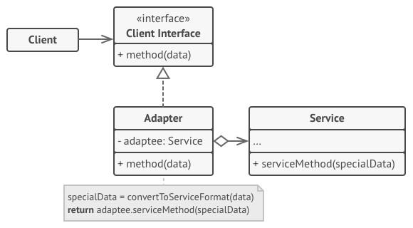</kbd>

#### Class adapter

This implementation uses inheritance: the adapter inherits interfaces
from both objects at the same time. Note that this approach can only be
implemented in programming languages that support multiple inheritance,
such as C++.

<kbd>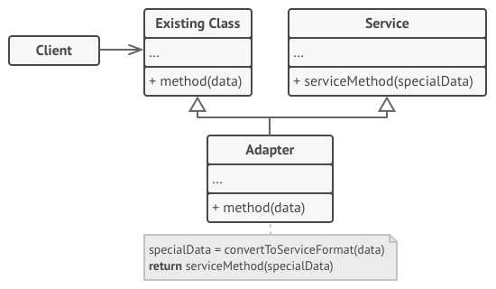</kbd>

### Pseudocode

This example of the **Adapter** pattern is based on the classic conflict
between square pegs and round holes.

<kbd></kbd>

### Real world example

Consider that you have some pictures in your memory card and you need to
transfer them to your computer. In order to transfer them you need some
kind of adapter that is compatible with your computer ports so that you
can attach memory card to your computer. In this case card reader is an
adapter. Another example would be the famous power adapter; a three
legged plug can't be connected to a two pronged outlet, it needs to use
a power adapter that makes it compatible with the two pronged outlet.
Yet another example would be a translator translating words spoken by
one person to another

### In plain words

Adapter pattern lets you wrap an otherwise incompatible object in an
adapter to make it compatible with another class.

### Wikipedia says

In software engineering, the adapter pattern is a software design
pattern that allows the interface of an existing class to be used as
another interface. It is often used to make existing classes work with
others without modifying their source code.

### Pros and Cons


<table>
	<thead>
		<tr class="header">
			<th>Pros</th>
			<th>Cons</th>
		</tr>
	</thead>
	<tbody>
		<tr class="odd">
			<td><em>Single Responsibility Principle</em>. You can separate the interface or data conversion code from the primary business logic of the program.</td>
			<td>The overall complexity of the code increases because you need to introduce a set of new interfaces and classes. Sometimes it’s simpler just to change the service class so that it matches the rest of your code.</td>
		</tr>
		<tr class="even">
			<td><em>Open/Closed Principle</em>. You can introduce new types of adapters into the program without breaking the existing client code, as long as they work with the adapters through the client interface.</td>
			<td><br /></td>
		</tr>
	</tbody>
</table>


### Programmatic Example

#### C\#


Consider a game where there is a hunter and he hunts lions.

First we have an interface `Lion` that all types of lions have to
implement

> interface ILion { void Roar(); } class AfricanLion : ILion { public
> void Roar() {} } class AsiaLion : ILion { public void Roar() { } }

And hunter expects any implementation of `Lion` interface to hunt.

> 
> 
> ``` 
> class Hunter
> {
>     public void Hunt(ILion lion) { }
> }
>                     
> ```

Now let's say we have to add a `WildDog` in our game so that hunter can
hunt that also. But we can't do that directly because dog has a
different interface. To make it compatible for our hunter, we will have
to create an adapter that is compatible

> 
> 
> ``` 
>  // This needs to be added to the game
> class WildDog
> {
>     public void bark() { }
> }
> 
> // Adapter around wild dog to make it compatible with our game
> class WildDogAdapter : ILion
> {
>     private WildDog mDog;
>     public WildDogAdapter(WildDog dog) {
>         this.mDog = dog;
>     }
>     public void Roar() {
>         mDog.bark();
>     }
> }
>                     
> ```

And now the `WildDog` can be used in our game using `WildDogAdapter`.

> 
> 
> ``` 
> var wildDog = new WildDog();
> var wildDogAdapter = new WildDogAdapter(wildDog);
> 
> var hunter = new Hunter();
> hunter.Hunt(wildDogAdapter);
>                     
> ```


#### Java


First we have interfaces `RowingBoat` and `FishingBoat`

> 
> 
> ``` 
> public interface RowingBoat {
>     void row();
> }
> 
> public class FishingBoat {
>     private static final Logger LOGGER = LoggerFactory.getLogger(FishingBoat.class);
>     public void sail() {
>         LOGGER.info("The fishing boat is sailing");
>     }
> }
>                     
> ```

And captain expects an implementation of `RowingBoat` interface to be
able to move

> 
> 
> ``` 
> public class Captain implements RowingBoat {
>     private RowingBoat rowingBoat;
>     public Captain(RowingBoat rowingBoat) {
>         this.rowingBoat = rowingBoat;
>     }
> 
>     @Override
>     public void row() {
>         rowingBoat.row();
>     }
> }
>                     
> ```

Now let's say the pirates are coming and our captain needs to escape but
there is only fishing boat available. We need to create an adapter that
allows the captain to operate the fishing boat with his rowing boat
skills.

> 
> 
> ``` 
> public class FishingBoatAdapter implements RowingBoat {
>     private static final Logger LOGGER = LoggerFactory.getLogger(FishingBoatAdapter.class);
>     private FishingBoat boat;
>     public FishingBoatAdapter() {
>         boat = new FishingBoat();
>     }
> 
>     @Override
>     public void row() {
>         boat.sail();
>     }
> }
>                     
> ```

And now the `Captain` can use the `FishingBoat` to escape the pirates.

> 
> 
> ``` 
> Captain captain = new Captain(new FishingBoatAdapter());
> captain.row();
>                 
> ```


#### JavaScript


Consider a game where there is a hunter and he hunts lions.

First we have an interface `Lion` that all types of lions have to
implement

``` 
/*
Lion interface : roar()
*/

class AfricanLion  {
	roar() {}
}

class AsianLion  {
	roar() {}
}
				
```

And hunter expects any implementation of `Lion` interface to hunt.

``` 
class Hunter {
	hunt(lion) {
		// ... some code before
		lion.roar()
		//... some code after
	}
}
				
```

Now let's say we have to add a `WildDog` in our game so that hunter can
hunt that also. But we can't do that directly because dog has a
different interface. To make it compatible for our hunter, we will have
to create an adapter that is compatible

``` 
// This needs to be added to the game
class WildDog {
	bark() {
	}
}

// Adapter around wild dog to make it compatible with our game
class WildDogAdapter {

	constructor(dog) {
		this.dog = dog;
	}
	
	roar() {
		this.dog.bark();
	}
}
				
```

And now the `WildDog` can be used in our game using `WildDogAdapter`.

``` 
wildDog = new WildDog()
wildDogAdapter = new WildDogAdapter(wildDog)

hunter = new Hunter()
hunter.hunt(wildDogAdapter)
				
```


#### PHP


Consider a game where there is a hunter and he hunts lions.

First we have an interface  `Lion` that all types of lions have to
implement interface

``` 
														   
interface Lion {  
	public function roar(); 
} 
class AfricanLion implements Lion {  
	public function roar()  {  
	} 
} 
class AsianLion implements Lion {  
	public function roar()  {  } 
}
				
```

And hunter expects any implementation of `Lion` interface to hunt.

``` 
class Hunter
{
	public function hunt(Lion $lion)
	{
		$lion->roar();
	}
}
				
```

Now let's say we have to add a `WildDog` in our game so that hunter can
hunt that also. But we can't do that directly because dog has a
different interface. To make it compatible for our hunter, we will have
to create an adapter that is compatible

``` 
// This needs to be added to the game
class WildDog
{
	public function bark() { }
}

// Adapter around wild dog to make it compatible with our game
class WildDogAdapter implements Lion
{
	protected $dog;
	public function __construct(WildDog $dog) {
		$this->dog = $dog;
	}

	public function roar() {
		$this->dog->bark();
	}
}
				
```

And now the `WildDog` can be used in our game using `WildDogAdapter`.

``` 
$wildDog = new WildDog();
$wildDogAdapter = new WildDogAdapter($wildDog);

$hunter = new Hunter();
$hunter->hunt($wildDogAdapter);                                                 
				
```


#### Python


``` 
#!/usr/bin/env python
# -*- coding: utf-8 -*-

"""
*What is this pattern about?
The Adapter pattern provides a different interface for a class. We can
think about it as a cable adapter that allows you to charge a phone
somewhere that has outlets in a different shape. Following this idea,
the Adapter pattern is useful to integrate classes that couldn't be
integrated due to their incompatible interfaces.

*What does this example do?

The example has classes that represent entities (Dog, Cat, Human, Car)
that make different noises. The Adapter class provides a different
interface to the original methods that make such noises. So the
original interfaces (e.g., bark and meow) are available under a
different name: make_noise.

*Where is the pattern used practically?
The Grok framework uses adapters to make objects work with a
particular API without modifying the objects themselves:
http://grok.zope.org/doc/current/grok_overview.html#adapters

*References:
http://ginstrom.com/scribbles/2008/11/06/generic-adapter-class-in-python/
https://sourcemaking.com/design_patterns/adapter
http://python-3-patterns-idioms-test.readthedocs.io/en/latest/ChangeInterface.html#adapter

*TL;DR
Allows the interface of an existing class to be used as another interface.
"""

class Dog(object):
	def __init__(self):
		self.name = "Dog"

	def bark(self):
		return "woof!"

class Cat(object):
	def __init__(self):
		self.name = "Cat"

	def meow(self):
		return "meow!"

class Human(object):
	def __init__(self):
		self.name = "Human"

	def speak(self):
		return "'hello'"

class Car(object):
	def __init__(self):
		self.name = "Car"

	def make_noise(self, octane_level):
		return "vroom{0}".format("!" * octane_level)

class Adapter(object):
	"""
	Adapts an object by replacing methods.
	Usage:
	dog = Dog()
	dog = Adapter(dog, make_noise=dog.bark)
	"""

	def __init__(self, obj, **adapted_methods):
		"""We set the adapted methods in the object's dict"""
		self.obj = obj
		self.__dict__.update(adapted_methods)

	def __getattr__(self, attr):
		"""All non-adapted calls are passed to the object"""
		return getattr(self.obj, attr)

	def original_dict(self):
		"""Print original object dict"""
		return self.obj.__dict__

def main():
	"""
	>>> objects = []
	>>> dog = Dog()
	>>> print(dog.__dict__)
	{'name': 'Dog'}

	>>> objects.append(Adapter(dog, make_noise=dog.bark))

	>>> objects[0].__dict__['obj'], objects[0].__dict__['make_noise']
	(<...Dog object at 0x...>, <bound method Dog.bark of <...Dog object at 0x...>>)

	>>> print(objects[0].original_dict())
	{'name': 'Dog'}

	>>> cat = Cat()
	>>> objects.append(Adapter(cat, make_noise=cat.meow))
	>>> human = Human()
	>>> objects.append(Adapter(human, make_noise=human.speak))
	>>> car = Car()
	>>> objects.append(Adapter(car, make_noise=lambda: car.make_noise(3)))

	>>> for obj in objects:
	...    print("A {0} goes {1}".format(obj.name, obj.make_noise()))
	A Dog goes woof!
	A Cat goes meow!
	A Human goes 'hello'
	A Car goes vroom!!!
	"""

if __name__ == "__main__":
	import doctest
	doctest.testmod(optionflags=doctest.ELLIPSIS)
				
```


## Bridge

<kbd></kbd>

### Intent

**Bridge** is a structural design pattern that lets you split a large
class or a set of closely related classes into two separate
hierarchies—abstraction and implementation—which can be developed
independently of each other.

<kbd></kbd>

### Problem

*Abstraction?* *Implementation?* Sound scary? Stay calm and let’s
consider a simple example.

Say you have a geometric `Shape` class with a pair of subclasses:
`Circle` and `Square`. You want to extend this class hierarchy to
incorporate colors, so you plan to create `Red` and `Blue` shape
subclasses. However, since you already have two subclasses, you’ll need
to create four class combinations such as `BlueCircle` and `RedSquare`.

<kbd></kbd>

Adding new shape types and colors to the hierarchy will grow it
exponentially. For example, to add a triangle shape you’d need to
introduce two subclasses, one for each color. And after that, adding a
new color would require creating three subclasses, one for each shape
type. The further we go, the worse it becomes.

### Solution

This problem occurs because we’re trying to extend the shape classes in
two independent dimensions: by form and by color. That’s a very common
issue with class inheritance.

The Bridge pattern attempts to solve this problem by switching from
inheritance to the object composition. What this means is that you
extract one of the dimensions into a separate class hierarchy, so that
the original classes will reference an object of the new hierarchy,
instead of having all of its state and behaviors within one class.

<kbd></kbd>

Following this approach, we can extract the color-related code into its
own class with two subclasses: `Red` and `Blue`. The `Shape` class then
gets a reference field pointing to one of the color objects. Now the
shape can delegate any color-related work to the linked color object.
That reference will act as a bridge between the `Shape` and `Color`
classes. From now on, adding new colors won’t require changing the shape
hierarchy, and vice versa.

### Abstraction and Implementation

The GoF book introduces the terms *Abstraction* and *Implementation* as
part of the Bridge definition. In my opinion, the terms sound too
academic and make the pattern seem more complicated than it really is.
Having read the simple example with shapes and colors, let’s decipher
the meaning behind the GoF book’s scary words.

*Abstraction* (also called *interface*) is a high-level control layer
for some entity. This layer isn’t supposed to do any real work on its
own. It should delegate the work to the *implementation* layer (also
called *platform*).

Note that we’re not talking about *interfaces* or *abstract classes*
from your programming language. These aren’t the same things.

When talking about real applications, the abstraction can be represented
by a graphical user interface (GUI), and the implementation could be the
underlying operating system code (API) which the GUI layer calls in
response to user interactions.

Generally speaking, you can extend such an app in two independent
directions:

  - Have several different GUIs (for instance, tailored for regular
	customers or admins).
  - Support several different APIs (for example, to be able to launch
	the app under Windows, Linux, and MacOS).

In a worst-case scenario, this app might look like a giant spaghetti
bowl, where hundreds of conditionals connect different types of GUI with
various APIs all over the code.

<kbd></kbd>

You can bring order to this chaos by extracting the code related to
specific interface-platform combinations into separate classes. However,
soon you’ll discover that there are *lots* of these classes. The class
hierarchy will grow exponentially because adding a new GUI or supporting
a different API would require creating more and more classes.

Let’s try to solve this issue with the Bridge pattern. It suggests that
we divide the classes into two hierarchies:

  - Abstraction: the GUI layer of the app.
  - Implementation: the operating systems’ APIs.

<kbd></kbd>

The abstraction object controls the appearance of the app, delegating
the actual work to the linked implementation object. Different
implementations are interchangeable as long as they follow a common
interface, enabling the same GUI to work under Windows and Linux.

As a result, you can change the GUI classes without touching the
API-related classes. Moreover, adding support for another operating
system only requires creating a subclass in the implementation
hierarchy.

### Structure

<kbd></kbd>

### Pseudocode

This example illustrates how the **Bridge** pattern can help divide the
monolithic code of an app that manages devices and their remote
controls. The `Device` classes act as the implementation, whereas the
`Remote`s act as the abstraction.

<kbd></kbd>

The base remote control class declares a reference field that links it
with a device object. All remotes work with the devices via the general
device interface, which lets the same remote support multiple device
types.

You can develop the remote control classes independently from the device
classes. All that’s needed is to create a new remote subclass. For
example, a basic remote control might only have two buttons, but you
could extend it with additional features, such as an extra battery or a
touchscreen.

The client code links the desired type of remote control with a specific
device object via the remote’s constructor.

### Real world example

Consider you have a website with different pages and you are supposed to
allow the user to change the theme. What would you do? Create multiple
copies of each of the pages for each of the themes or would you just
create separate theme and load them based on the user's preferences?
Bridge pattern allows you to do the second i.e.

<https://cloud.githubusercontent.com/assets/11269635/23065293/33b7aea0-f515-11e6-983f-98823c9845ee.png>

### In Plain Words

Bridge pattern is about preferring composition over inheritance.
Implementation details are pushed from a hierarchy to another object
with a separate hierarchy.

### Wikipedia says

The bridge pattern is a design pattern used in software engineering that
is meant to "decouple an abstraction from its implementation so that the
two can vary independently"

### Pros and Cons


<table>
	<thead>
		<tr class="header">
			<th>Pros</th>
			<th>Cons</th>
		</tr>
	</thead>
	<tbody>
		<tr class="odd">
			<td>You can create platform-independent classes and apps.</td>
			<td>You might make the code more complicated by applying the pattern to a highly cohesive class.</td>
		</tr>
		<tr class="even">
			<td>The client code works with high-level abstractions. It isn’t exposed to the platform details.</td>
			<td><br /></td>
		</tr>
		<tr class="odd">
			<td><em>Open/Closed Principle</em>. You can introduce new abstractions and implementations independently from each other.</td>
			<td><br /></td>
		</tr>
		<tr class="even">
			<td><em>Single Responsibility Principle</em>. You can focus on high-level logic in the abstraction and on platform details in the implementation.</td>
			<td><br /></td>
		</tr>
	</tbody>
</table>


#### Programmatic Example

#### C\#


<div id="expander-content-863576251" class="expand-content">

Translating our WebPage example from above. Here we have the 
`WebPage` hierarchy interface

> 
> 
> ``` 
> IWebPage { string GetContent(); 
> } 
> class About : IWebPage { 
>     protected ITheme theme; 
>     public About( ITheme theme) { 
>         this. theme = theme; 
>     } 
>     public string GetContent() { 
>         return $"About page in {
>             theme.GetColor()}"; 
>         } 
>     } 
> class Careers : IWebPage { 
>     protected ITheme theme; 
>     public Careers( ITheme theme) { 
>         this. theme = theme; 
>     } 
>     public string GetContent() { 
>     return $"Careers page in {theme.GetColor()}"; 
>     } 
> }
>                         
> ```

And the separate theme hierarchy

> 
> 
> ``` 
> interface ITheme {
>     string GetColor();
> }
> 
> class DarkTheme : ITheme {
>     public string GetColor() {
>         return "Dark Black";
>     }
> }
> 
> class LightTheme : ITheme {
>     public string GetColor() {
>         return "Off White";
>     }
> }
> 
> class AquaTheme : ITheme {
>     public string GetColor()
>     {
>         return "Light blue";
>     }
> }
>                         
> ```

And both the hierarchies

> 
> 
> ``` 
> var darkTheme = new DarkTheme();
> var lightTheme = new LightTheme();
> 
> var about= new About(darkTheme);
> var careers = new Careers(lightTheme);
> 
> Console.WriteLine(about.GetContent()); //Output: About page in Dark Black
> Console.WriteLine(careers.GetContent()); //Output: Careers page in Off White
>                         
> ```


#### Java


Translating our weapon example from above. Here we have the `Weapon`
hierarchy

``` 
public interface Weapon {
	void wield();
	void swing();
	void unwield();
	Enchantment getEnchantment();
}

public class Sword implements Weapon {
	private final Enchantment enchantment;

	public Sword(Enchantment enchantment) {
		this.enchantment = enchantment;
	}

	@Override
	public void wield() {
		LOGGER.info("The sword is wielded.");
		enchantment.onActivate();
	}

	@Override
	public void swing() {
		LOGGER.info("The sword is swinged.");
		enchantment.apply();
	}

	@Override
	public void unwield() {
		LOGGER.info("The sword is unwielded.");
		enchantment.onDeactivate();
	}

	@Override
	public Enchantment getEnchantment() {
		return enchantment;
	}
}

public class Hammer implements Weapon {
	private final Enchantment enchantment;

	public Hammer(Enchantment enchantment) {
		this.enchantment = enchantment;
	}

	@Override
	public void wield() {
		LOGGER.info("The hammer is wielded.");
		enchantment.onActivate();
	}

	@Override
	public void swing() {
		LOGGER.info("The hammer is swinged.");
		enchantment.apply();
	}

	@Override
	public void unwield() {
		LOGGER.info("The hammer is unwielded.");
		enchantment.onDeactivate();
	}

	@Override
	public Enchantment getEnchantment() {
		return enchantment;
	}
}
					
```

And the separate enchantment hierarchy

``` 
public interface Enchantment {
	void onActivate();
	void apply();
	void onDeactivate();
}

public class FlyingEnchantment implements Enchantment {
	@Override
	public void onActivate() {
		LOGGER.info("The item begins to glow faintly.");
	}

	@Override
	public void apply() {
		LOGGER.info("The item flies and strikes the enemies finally returning to owner's hand.");
	}

	@Override
	public void onDeactivate() {
		LOGGER.info("The item's glow fades.");
	}
}

public class SoulEatingEnchantment implements Enchantment {
	@Override
	public void onActivate() {
		LOGGER.info("The item spreads bloodlust.");
	}

	@Override
	public void apply() {
		LOGGER.info("The item eats the soul of enemies.");
	}

	@Override
	public void onDeactivate() {
		LOGGER.info("Bloodlust slowly disappears.");
	}
}
					
```

And both the hierarchies in action

``` 
Sword enchantedSword = new Sword(new SoulEatingEnchantment());
enchantedSword.wield();
enchantedSword.swing();
enchantedSword.unwield();
// The sword is wielded.
// The item spreads bloodlust.
// The sword is swinged.
// The item eats the soul of enemies.
// The sword is unwielded.
// Bloodlust slowly disappears.

Hammer hammer = new Hammer(new FlyingEnchantment());
hammer.wield();
hammer.swing();
hammer.unwield();
// The hammer is wielded.
// The item begins to glow faintly.
// The hammer is swinged.
// The item flies and strikes the enemies finally returning to owner's hand.
// The hammer is unwielded.
// The item's glow fades.
					
```


#### JavaScript


Translating our WebPage example from above. Here we have the `WebPage`
hierarchy

``` 
/*
Webpage interface :
constructor(theme)
getContent()
*/

class About{ 
	constructor(theme) {
		this.theme = theme
	}

	getContent() {
		return "About page in " + this.theme.getColor()
	}
}

class Careers{
	constructor(theme) {
		this.theme = theme
	}
   
	getContent() {
		return "Careers page in " + this.theme.getColor()
	} 
}
					
```

And the separate theme hierarchy

``` 
/*
Theme interface :

getColor()
*/

class DarkTheme{
	getColor() {
		return 'Dark Black'
	}
}
class LightTheme{
	getColor() {
		return 'Off white'
	}
}
class AquaTheme{
	getColor() {
		return 'Light blue'
	}
}
					
```

And both the hierarchies

``` 
const darkTheme = new DarkTheme()

const about = new About(darkTheme)
const careers = new Careers(darkTheme)

console.log(about.getContent() )// "About page in Dark Black"
console.log(careers.getContent() )// "Careers page in Dark Black"
					
```


#### PHP


``` 
interface WebPage {  
	public function __construct(Theme $theme);  
	public function getContent(); 
} 
class About implements WebPage {  
	protected $theme;  
	public function __construct(Theme $theme)  {  
		$this->theme = $theme;  
	}  
	public function getContent()  {  
		return "About page in " . $this->theme->getColor();  
	} 
} 
class Careers implements WebPage {  
	protected $theme;  
	public function __construct(Theme $theme)  {  
		$this->theme = $theme;  
	}  
	public function getContent()  {  
		return "Careers page in " . $this->theme->getColor();  
	} 
}
					
```

And the separate theme hierarchy

``` 
interface Theme {
	public function getColor();
}

class DarkTheme implements Theme {
	public function getColor() {
		return 'Dark Black';
	}
}
class LightTheme implements Theme {
	public function getColor() {
		return 'Off white';
	}
}
class AquaTheme implements Theme {
	public function getColor() {
		return 'Light blue';
	}
}
					
```

And both the hierarchies

``` 
$darkTheme = new DarkTheme();

$about = new About($darkTheme);
$careers = new Careers($darkTheme);

echo $about->getContent(); // "About page in Dark Black";
echo $careers->getContent(); // "Careers page in Dark Black";
					
```


#### Python


``` 
#!/usr/bin/env python
# -*- coding: utf-8 -*-

"""
*References:
http://en.wikibooks.org/wiki/Computer_Science_Design_Patterns/Bridge_Pattern#Python

*TL;DR
Decouples an abstraction from its implementation.
"""

# ConcreteImplementor 1/2
class DrawingAPI1(object):
	def draw_circle(self, x, y, radius):
		print('API1.circle at {}:{} radius {}'.format(x, y, radius))

# ConcreteImplementor 2/2
class DrawingAPI2(object):
	def draw_circle(self, x, y, radius):
		print('API2.circle at {}:{} radius {}'.format(x, y, radius))

# Refined Abstraction
class CircleShape(object):
	def __init__(self, x, y, radius, drawing_api):
		self._x = x
		self._y = y
		self._radius = radius
		self._drawing_api = drawing_api

	# low-level i.e. Implementation specific
	def draw(self):
		self._drawing_api.draw_circle(self._x, self._y, self._radius)

	# high-level i.e. Abstraction specific
	def scale(self, pct):
		self._radius *= pct

def main():
	shapes = (CircleShape(1, 2, 3, DrawingAPI1()), CircleShape(5, 7, 11, DrawingAPI2()))

	for shape in shapes:
		shape.scale(2.5)
		shape.draw()

if __name__ == '__main__':
	main()

### OUTPUT ###
# API1.circle at 1:2 radius 7.5
# API2.circle at 5:7 radius 27.5
					
```


## Composite

<kbd></kbd>

### Intent

**Composite** is a structural design pattern that lets you compose
objects into tree structures and then work with these structures as if
they were individual objects.

<kbd></kbd>

### Problem

Using the Composite pattern makes sense only when the core model of your
app can be represented as a tree.

For example, imagine that you have two types of objects: `Products` and
`Boxes`. A `Box` can contain several `Products` as well as a number of
smaller `Boxes`. These little `Boxes` can also hold some `Products` or
even smaller `Boxes`, and so on.

Say you decide to create an ordering system that uses these classes.
Orders could contain simple products without any wrapping, as well as
boxes stuffed with products...and other boxes. How would you determine
the total price of such an order?

<kbd>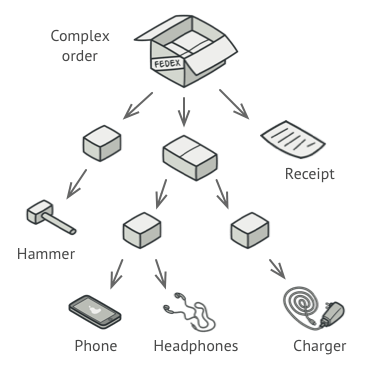</kbd>

You could try the direct approach: unwrap all the boxes, go over all the
products and then calculate the total. That would be doable in the real
world; but in a program, it’s not as simple as running a loop. You have
to know the classes of `Products` and `Boxes` you’re going through, the
nesting level of the boxes and other nasty details beforehand. All of
this makes the direct approach either too awkward or even impossible.

### Solution

The Composite pattern suggests that you work with `Products` and `Boxes`
through a common interface which declares a method for calculating the
total price.

How would this method work? For a product, it’d simply return the
product’s price. For a box, it’d go over each item the box contains, ask
its price and then return a total for this box. If one of these items
were a smaller box, that box would also start going over its contents
and so on, until the prices of all inner components were calculated. A
box could even add some extra cost to the final price, such as packaging
cost.

<kbd></kbd>

The greatest benefit of this approach is that you don’t need to care
about the concrete classes of objects that compose the tree. You don’t
need to know whether an object is a simple product or a sophisticated
box. You can treat them all the same via the common interface. When you
call a method, the objects themselves pass the request down the tree.

### Structure

<kbd>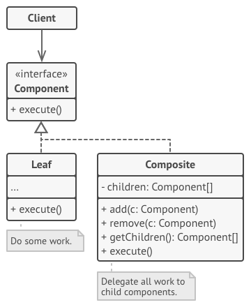</kbd>

### Pseudocode

In this example, the **Composite** pattern lets you implement stacking
of geometric shapes in a graphical editor.

<kbd>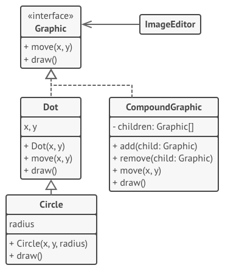</kbd>

The `CompoundGraphic` class is a container that can comprise any number
of sub-shapes, including other compound shapes. A compound shape has the
same methods as a simple shape. However, instead of doing something on
its own, a compound shape passes the request recursively to all its
children and “sums up” the result.

The client code works with all shapes through the single interface
common to all shape classes. Thus, the client doesn’t know whether it’s
working with a simple shape or a compound one. The client can work with
very complex object structures without being coupled to concrete classes
that form that structure.

### Real world example

Every organization is composed of employees. Each of the employees has
the same features i.e. has a salary, has some responsibilities, may or
may not report to someone, may or may not have some subordinates etc.

### In plain words

Composite pattern lets clients treat the individual objects in a uniform
manner.

### Wikipedia says

In software engineering, the composite pattern is a partitioning design
pattern. The composite pattern describes that a group of objects is to
be treated in the same way as a single instance of an object. The intent
of a composite is to "compose" objects into tree structures to represent
part-whole hierarchies. Implementing the composite pattern lets clients
treat individual objects and compositions uniformly.

### Pros and Cons


<table>
	<thead>
		<tr class="header">
			<th>Pros</th>
			<th>Cons</th>
		</tr>
	</thead>
	<tbody>
		<tr class="odd">
			<td>You can work with complex tree structures more conveniently: use polymorphism and recursion to your advantage.</td>
			<td>It might be difficult to provide a common interface for classes whose functionality differs too much. In certain scenarios, you’d need to overgeneralize the component interface, making it harder to comprehend.</td>
		</tr>
		<tr class="even">
			<td><em>Open/Closed Principle</em>. You can introduce new element types into the app without breaking the existing code, which now works with the object tree.</td>
			<td><br /></td>
		</tr>
	</tbody>
</table>


### Programmatic Example

Taking our employees example from above. Here we have different employee
types

#### C\#


> 
> 
> ``` 
> 
> interface IEmployee
> {
>     float GetSalary();
>     string GetRole();
>     string GetName();
> }
> 
> class Developer : IEmployee {
>     private string mName;
>     private float mSalary;
> 
>     public Developer(string name, float salary) {
>         this.mName = name;
>         this.mSalary = salary;
>     }
> 
>     public float GetSalary() {
>         return this.mSalary;
>     }
> 
>     public string GetRole() {
>         return "Developer";
>     }
> 
>     public string GetName() {
>         return this.mName;
>     }
> }
> 
> class Designer : IEmployee {
>     private string mName;
>     private float mSalary;
> 
>     public Designer(string name, float salary) {
>         this.mName = name;
>         this.mSalary = salary;
>     }
> 
>     public float GetSalary() {
>         return this.mSalary;
>     }
> 
>     public string GetRole() {
>         return "Designer";
>     }
> 
>     public string GetName() {
>         return this.mName;
>     }
> }
>                     
> ```

Then we have an organization which consists of several different types
of employees

> 
> 
> ``` 
> class Organization {
>     protected List <IEmployee> employees;
> 
>     public Organization() {
>         employees = new List<IEmployee>();
>     }
> 
>     public void AddEmployee(IEmployee employee) {
>         employees.Add(employee);
>     }
> 
>     public float GetNetSalaries() {
>         float netSalary = 0;
> 
>         foreach (var e in employees) {
>             netSalary += e.GetSalary();
>         }
>         return netSalary;
>     }
> }
>                     
> ```

And then it can be used as

> 
> 
> ``` 
> //Arrange Employees, Organization and add employees
> var developer = new Developer("John", 5000);
> var designer = new Designer("Arya", 5000);
> 
> var organization = new Organization();
> organization.AddEmployee(developer);
> organization.AddEmployee(designer);
> 
> Console.WriteLine($"Net Salary of Employees in Organization is {organization.GetNetSalaries():c}");
> //Ouptut: Net Salary of Employees in Organization is $10000.00
>                     
> ```


#### Java


Taking our sentence example from above. Here we have the base class and
different printable types

``` 
public abstract class LetterComposite {
	private List <LetterComposite> children = new ArrayList<>();
	public void add(LetterComposite letter) {
		children.add(letter);
	}
	public int count() {
		return children.size();
	}
	protected void printThisBefore() {}
	protected void printThisAfter() {}
	public void print() {
		printThisBefore();
		for (LetterComposite letter : children) {
			letter.print();
		}
		printThisAfter();
	}
}

public class Letter extends LetterComposite {
	private char c;
	public Letter(char c) {
		this.c = c;
	}
	@Override
	protected void printThisBefore() {
		System.out.print(c);
	}
}

public class Word extends LetterComposite {
	public Word(List<Letter> letters) {
		for (Letter l : letters) {
			this.add(l);
		}
	}
	@Override
	protected void printThisBefore() {
		System.out.print(" ");
	}
}

public class Sentence extends LetterComposite {
	public Sentence(List<Word> words) {
		for (Word w : words) {
			this.add(w);
		}
	}
	@Override
	protected void printThisAfter() {
		System.out.print(".");
	}
}
				
```

Then we have a messenger to carry messages

``` 
public class Messenger {
	LetterComposite messageFromOrcs() {
		List<Word> words = new ArrayList<>();
		words.add(new Word(Arrays.asList(new Letter('W'), new Letter('h'), new Letter('e'), new Letter('r'), new Letter('e'))));
		words.add(new Word(Arrays.asList(new Letter('t'), new Letter('h'), new Letter('e'), new Letter('r'), new Letter('e'))));
		words.add(new Word(Arrays.asList(new Letter('i'), new Letter('s'))));
		words.add(new Word(Arrays.asList(new Letter('a'))));
		words.add(new Word(Arrays.asList(new Letter('w'), new Letter('h'), new Letter('i'), new Letter('p'))));
		words.add(new Word(Arrays.asList(new Letter('t'), new Letter('h'), new Letter('e'), new Letter('r'), new Letter('e'))));
		words.add(new Word(Arrays.asList(new Letter('i'), new Letter('s'))));
		words.add(new Word(Arrays.asList(new Letter('a'))));
		words.add(new Word(Arrays.asList(new Letter('w'), new Letter('a'), new Letter('y'))));
		return new Sentence(words);
	}

	LetterComposite messageFromElves() {
		List<Word> words = new ArrayList<>();
		words.add(new Word(Arrays.asList(new Letter('M'), new Letter('u'), new Letter('c'), new Letter('h'))));
		words.add(new Word(Arrays.asList(new Letter('w'), new Letter('i'), new Letter('n'), new Letter('d'))));
		words.add(new Word(Arrays.asList(new Letter('p'), new Letter('o'), new Letter('u'), new Letter('r'), new Letter('s'))));
		words.add(new Word(Arrays.asList(new Letter('f'), new Letter('r'), new Letter('o'), new Letter('m'))));
		words.add(new Word(Arrays.asList(new Letter('y'), new Letter('o'), new Letter('u'), new Letter('r'))));
		words.add(new Word(Arrays.asList(new Letter('m'), new Letter('o'), new Letter('u'), new Letter('t'), new Letter('h'))));
		return new Sentence(words);
	}
}
				
```

And then it can be used as

``` 
LetterComposite orcMessage = new Messenger().messageFromOrcs();
orcMessage.print(); // Where there is a whip there is a way.
LetterComposite elfMessage = new Messenger().messageFromElves();
elfMessage.print(); // Much wind pours from your mouth.
				
```


#### JavaScript


Taking our employees example from above. Here we have different employee
types

``` 
/*
Employee interface :

constructor(name, salary)
getName()
setSalary()
getSalary()
getRoles()
*/

class Developer {
	constructor(name, salary) {
		this.name = name
		this.salary = salary
	}

	getName() {
		return this.name
	}

	setSalary(salary) {
		this.salary = salary
	}

	getSalary() {
		return this.salary
	}

	getRoles() {
		return this.roles
	}

	develop() {
		/* */
	}
}

class Designer {

	constructor(name, salary) {
		this.name = name
		this.salary = salary
	}

	getName() {
		return this.name
	}

	setSalary(salary) {
		this.salary = salary
	}

	getSalary() {
		return this.salary
	}

	getRoles() {
		return this.roles
	}

	design() {
		/* */
	}
}
				
```

Then we have an organization which consists of several different types
of employees

``` 
class Organization {
	constructor(){
		this.employees = []
	}

	addEmployee(employee) {
		this.employees.push(employee)
	}

	getNetSalaries() {
		let netSalary = 0

		this.employees.forEach(employee => {
			netSalary += employee.getSalary()
		})

		return netSalary
	}
}

				
```

And then it can be used as

``` 
// Prepare the employees
const john = new Developer('John Doe', 12000)
const jane = new Designer('Jane', 10000)

// Add them to organization
const organization = new Organization()
organization.addEmployee(john)
organization.addEmployee(jane)

console.log("Net salaries: " , organization.getNetSalaries()) // Net Salaries: 22000
				
```


#### PHP


``` 
interface Employee
{
	public function __construct(string $name, float $salary);
	public function getName(): string;
	public function setSalary(float $salary);
	public function getSalary(): float;
	public function getRoles(): array;
}

class Developer implements Employee
{
	protected $salary;
	protected $name;
	protected $roles;
 
	public function __construct(string $name, float $salary) {
		$this->name = $name;
		$this->salary = $salary;
	}

	public function getName(): string {
		return $this->name;
	}

	public function setSalary(float $salary) {
		$this->salary = $salary;
	}

	public function getSalary(): float {
		return $this->salary;
	}

	public function getRoles(): array {
		return $this->roles;
	}
}

class Designer implements Employee
{
	protected $salary;
	protected $name;
	protected $roles;

	public function __construct(string $name, float $salary)
	{
		$this->name = $name;
		$this->salary = $salary;
	}

	public function getName(): string
	{
		return $this->name;
	}

	public function setSalary(float $salary)
	{
		$this->salary = $salary;
	}

	public function getSalary(): float
	{
		return $this->salary;
	}

	public function getRoles(): array
	{
		return $this->roles;
	}
}
				
```

Then we have an organization which consists of several different types
of employees

``` 
class Organization
{
	protected $employees;

	public function addEmployee(Employee $employee) {
		$this->employees[] = $employee;
	}

	public function getNetSalaries(): float {
		$netSalary = 0;

		foreach ($this->employees as $employee) {
			$netSalary += $employee->getSalary();
		}

		return $netSalary;
	}
}
				
```

Then we have an organization which consists of several different types
of employees

``` 
// Prepare the employees
$john = new Developer('John Doe', 12000);
$jane = new Designer('Jane Doe', 15000);

// Add them to organization
$organization = new Organization();
$organization->addEmployee($john);
$organization->addEmployee($jane);

echo "Net salaries: " . $organization->getNetSalaries(); // Net Salaries: 27000
				
```


#### Python


``` 
#!/usr/bin/env python
# -*- coding: utf-8 -*-

"""
*What is this pattern about?
The composite pattern describes a group of objects that is treated the
same way as a single instance of the same type of object. The intent of
a composite is to "compose" objects into tree structures to represent
part-whole hierarchies. Implementing the composite pattern lets clients
treat individual objects and compositions uniformly.

*What does this example do?
The example implements a graphic class，which can be either an ellipse
or a composition of several graphics. Every graphic can be printed.

*Where is the pattern used practically?
In graphics editors a shape can be basic or complex. An example of a
simple shape is a line, where a complex shape is a rectangle which is
made of four line objects. Since shapes have many operations in common
such as rendering the shape to screen, and since shapes follow a
part-whole hierarchy, composite pattern can be used to enable the
program to deal with all shapes uniformly.

*References:
https://en.wikipedia.org/wiki/Composite_pattern
https://infinitescript.com/2014/10/the-23-gang-of-three-design-patterns/

*TL;DR
Describes a group of objects that is treated as a single instance.
"""

class Graphic:
	def render(self):
		raise NotImplementedError("You should implement this.")

class CompositeGraphic(Graphic):
	def __init__(self):
		self.graphics = []

	def render(self):
		for graphic in self.graphics:
			graphic.render()

	def add(self, graphic):
		self.graphics.append(graphic)

	def remove(self, graphic):
		self.graphics.remove(graphic)


class Ellipse(Graphic):
	def __init__(self, name):
		self.name = name

	def render(self):
		print("Ellipse: {}".format(self.name))

if __name__ == '__main__':
	ellipse1 = Ellipse("1")
	ellipse2 = Ellipse("2")
	ellipse3 = Ellipse("3")
	ellipse4 = Ellipse("4")

	graphic1 = CompositeGraphic()
	graphic2 = CompositeGraphic()

	graphic1.add(ellipse1)
	graphic1.add(ellipse2)
	graphic1.add(ellipse3)
	graphic2.add(ellipse4)

	graphic = CompositeGraphic()

	graphic.add(graphic1)
	graphic.add(graphic2)

	graphic.render()

### OUTPUT ###
# Ellipse: 1
# Ellipse: 2
# Ellipse: 3
# Ellipse: 4    
				
```
## Decorator

<kbd></kbd>

### Intent

**Decorator** is a structural design pattern that lets you attach new
behaviors to objects by placing these objects inside special wrapper
objects that contain the behaviors.

<kbd></kbd>

### Problem

Imagine that you’re working on a notification library which lets other
programs notify their users about important events.

The initial version of the library was based on the `Notifier` class
that had only a few fields, a constructor and a single `send` method.
The method could accept a message argument from a client and send the
message to a list of emails that were passed to the notifier via its
constructor. A third-party app which acted as a client was supposed to
create and configure the notifier object once, and then use it each time
something important happened.

<kbd>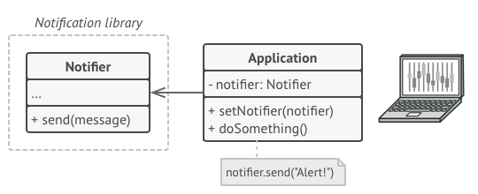</kbd>

At some point, you realize that users of the library expect more than
just email notifications. Many of them would like to receive an SMS
about critical issues. Others would like to be notified on Facebook and,
of course, the corporate users would love to get Slack notifications.

<kbd></kbd>

How hard can that be? You extended the `Notifier` class and put the
additional notification methods into new subclasses. Now the client was
supposed to instantiate the desired notification class and use it for
all further notifications.

But then someone reasonably asked you, “Why can’t you use several
notification types at once? If your house is on fire, you’d probably
want to be informed through every channel.”

You tried to address that problem by creating special subclasses which
combined several notification methods within one class. However, it
quickly became apparent that this approach would bloat the code
immensely, not only the library code but the client code as well.

<kbd></kbd>

You have to find some other way to structure notifications classes so
that their number won’t accidentally break some Guinness record.

### Solution

Extending a class is the first thing that comes to mind when you need to
alter an object’s behavior. However, inheritance has several serious
caveats that you need to be aware of.

  - Inheritance is static. You can’t alter the behavior of an existing
	object at runtime. You can only replace the whole object with
	another one that’s created from a different subclass.
  - Subclasses can have just one parent class. In most languages,
	inheritance doesn’t let a class inherit behaviors of multiple
	classes at the same time.

One of the ways to overcome these caveats is by using *Aggregation* or
*Composition* instead of *Inheritance*. Both of the alternatives work
almost the same way: one object *has a* reference to another and
delegates it some work, whereas with inheritance, the object itself *is*
able to do that work, inheriting the behavior from its superclass.

With this new approach you can easily substitute the linked “helper”
object with another, changing the behavior of the container at runtime.
An object can use the behavior of various classes, having references to
multiple objects and delegating them all kinds of work.
Aggregation/composition is the key principle behind many design
patterns, including Decorator. On that note, let’s return to the pattern
discussion.

<kbd>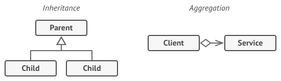</kbd>

*Wrapper* is the alternative nickname for the Decorator pattern that
clearly expresses the main idea of the pattern. A “wrapper” is an object
that can be linked with some “target” object. The wrapper contains the
same set of methods as the target and delegates to it all requests it
receives. However, the wrapper may alter the result by doing something
either before or after it passes the request to the target.

When does a simple wrapper become the real decorator? As I mentioned,
the wrapper implements the same interface as the wrapped object. That’s
why from the client’s perspective these objects are identical. Make the
wrapper’s reference field accept any object that follows that interface.
This will let you cover an object in multiple wrappers, adding the
combined behavior of all the wrappers to it.

In our notifications example, let’s leave the simple email notification
behavior inside the base `Notifier` class, but turn all other
notification methods into decorators.

<kbd></kbd>

The client code would need to wrap a basic notifier object into a set of
decorators that match the client’s preferences. The resulting objects
will be structured as a stack.

<kbd></kbd>

The last decorator in the stack would be the object that the client
actually works with. Since all decorators implement the same interface
as the base notifier, the rest of the client code won’t care whether it
works with the “pure” notifier object or the decorated one.

We could apply the same approach to other behaviors such as formatting
messages or composing the recipient list. The client can decorate the
object with any custom decorators, as long as they follow the same
interface as the others.

### Structure

<kbd></kbd>

### Pseudocode

In this example, the **Decorator** pattern lets you compress and encrypt
sensitive data independently from the code that actually uses this data.

<kbd>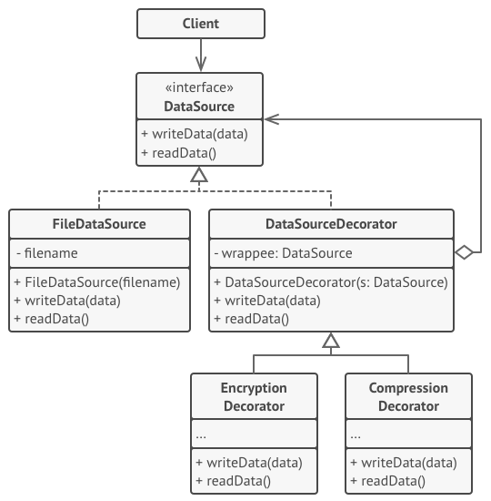</kbd>

The application wraps the data source object with a pair of decorators.
Both wrappers change the way the data is written to and read from the
disk:

  - Just before the data is **written to disk**, the decorators encrypt
	and compress it. The original class writes the encrypted and
	protected data to the file without knowing about the change.

  - Right after the data is **read from disk**, it goes through the same
	decorators, which decompress and decode it.

The decorators and the data source class implement the same interface,
which makes them all interchangeable in the client code.

### Real world example

Imagine you run a car service shop offering multiple services. Now how
do you calculate the bill to be charged? You pick one service and
dynamically keep adding to it the prices for the provided services till
you get the final cost. Here each type of service is a decorator.

### In plain words

Decorator pattern lets you dynamically change the behavior of an object
at run time by wrapping them in an object of a decorator class.

### Wikipedia says

In object-oriented programming, the decorator pattern is a design
pattern that allows behavior to be added to an individual object, either
statically or dynamically, without affecting the behavior of other
objects from the same class. The decorator pattern is often useful for
adhering to the Single Responsibility Principle, as it allows
functionality to be divided between classes with unique areas of
concern.

### Pros and Cons


<table>
	<thead>
		<tr class="header">
			<th>Pros</th>
			<th>Cons</th>
		</tr>
	</thead>
	<tbody>
		<tr class="odd">
			<td>You can extend an object’s behavior without making a new subclass.</td>
			<td>It’s hard to remove a specific wrapper from the wrappers stack.</td>
		</tr>
		<tr class="even">
			<td>You can add or remove responsibilities from an object at runtime.</td>
			<td>It’s hard to implement a decorator in such a way that its behavior doesn’t depend on the order in the decorators stack.</td>
		</tr>
		<tr class="odd">
			<td>You can combine several behaviors by wrapping an object into multiple decorators.</td>
			<td>The initial configuration code of layers might look pretty ugly.</td>
		</tr>
		<tr class="even">
			<td><em>Single Responsibility Principle</em>. You can divide a monolithic class that implements many possible variants of behavior into several smaller classes.</td>
			<td><br /></td>
		</tr>
	</tbody>
</table>


### Programmatic Example

Lets take coffee for example. First of all we have a simple coffee
implementing the coffee interface

#### C\#


> 
> 
> ``` 
> interface ICoffee
> {
>     int GetCost();
>     string GetDescription();
> }
> 
> class SimpleCoffee : ICoffee
> {
>     public int GetCost() {
>         return 5;
>     }
> 
>     public string GetDescription() {
>         return "Simple Coffee";
>     }
> }
>                     
> ```

We want to make the code extensible to allow options to modify it if
required. Lets make some add-ons (decorators)

> 
> 
> ``` 
> class MilkCoffee : ICoffee
> {
>     private readonly ICoffee mCoffee;
> 
>     public MilkCoffee(ICoffee coffee)
>     {
>         mCoffee = coffee ?? throw new ArgumentNullException("coffee", "coffee should not be null");
>     }
>     public int GetCost()
>     {
>         return mCoffee.GetCost() + 1;
>     }
> 
>     public string GetDescription()
>     {
>         return String.Concat(mCoffee.GetDescription(), ", milk");
>     }
> }
> 
> class WhipCoffee : ICoffee
> {
>     private readonly ICoffee mCoffee;
> 
>     public WhipCoffee(ICoffee coffee)
>     {
>         mCoffee = coffee ?? throw new ArgumentNullException("coffee", "coffee should not be null");
>     }
>     public int GetCost()
>     {
>         return mCoffee.GetCost() + 1;
>     }
> 
>     public string GetDescription()
>     {
>         return String.Concat(mCoffee.GetDescription(), ", whip");
>     }
> }
> 
> class VanillaCoffee : ICoffee
> {
>     private readonly ICoffee mCoffee;
> 
>     public VanillaCoffee(ICoffee coffee)
>     {
>         mCoffee = coffee ?? throw new ArgumentNullException("coffee", "coffee should not be null");
>     }
>     public int GetCost()
>     {
>         return mCoffee.GetCost() + 1;
>     }
> 
>     public string GetDescription()
>     {
>         return String.Concat(mCoffee.GetDescription(), ", vanilla");
>     }
> }
>                     
> ```

Lets make a coffee now

> 
> 
> ``` 
> var myCoffee = new SimpleCoffee();
> Console.WriteLine($"{myCoffee.GetCost():c}"); // $ 5.00
> Console.WriteLine(myCoffee.GetDescription()); // Simple Coffee
> 
> var milkCoffee = new MilkCoffee(myCoffee);
> Console.WriteLine($"{milkCoffee.GetCost():c}"); // $ 6.00
> Console.WriteLine(milkCoffee.GetDescription()); // Simple Coffee, milk
> 
> var whipCoffee = new WhipCoffee(milkCoffee);
> Console.WriteLine($"{whipCoffee.GetCost():c}"); // $ 7.00
> Console.WriteLine(whipCoffee.GetDescription()); // Simple Coffee, milk, whip
> 
> var vanillaCoffee = new VanillaCoffee(whipCoffee);
> Console.WriteLine($"{vanillaCoffee.GetCost():c}"); // $ 8.00
> Console.WriteLine(vanillaCoffee.GetDescription()); // Simple Coffee, milk, whip, vanilla
>                     
> ```


#### Java


Let's take the troll example. First of all we have a simple troll
implementing the troll interface

``` 
public interface Troll {
	void attack();
	int getAttackPower();
	void fleeBattle();
}

public class SimpleTroll implements Troll {
	private static final Logger LOGGER = LoggerFactory.getLogger(SimpleTroll.class);

	@Override
	public void attack() {
		LOGGER.info("The troll tries to grab you!");
	}

	@Override
	public int getAttackPower() {
		return 10;
	}

	@Override
	public void fleeBattle() {
		LOGGER.info("The troll shrieks in horror and runs away!");
	}
}
				
```

Next we want to add club for the troll. We can do it dynamically by
using a decorator

``` 
public class ClubbedTroll implements Troll {
	private static final Logger LOGGER = LoggerFactory.getLogger(ClubbedTroll.class);
	private Troll decorated;

	public ClubbedTroll(Troll decorated) {
		this.decorated = decorated;
	}

	@Override
	public void attack() {
		decorated.attack();
		LOGGER.info("The troll swings at you with a club!");
	}

	@Override
	public int getAttackPower() {
		return decorated.getAttackPower() + 10;
	}

	@Override
	public void fleeBattle() {
		decorated.fleeBattle();
	}
}
				
```

Here's the troll in action

``` 
// simple troll
Troll troll = new SimpleTroll();
troll.attack(); // The troll tries to grab you!
troll.fleeBattle(); // The troll shrieks in horror and runs away!

// change the behavior of the simple troll by adding a decorator
Troll clubbedTroll = new ClubbedTroll(troll);
clubbedTroll.attack(); // The troll tries to grab you! The troll swings at you with a club!
clubbedTroll.fleeBattle(); // The troll shrieks in horror and runs away!
				
```


#### JavaScript


Lets take coffee for example. First of all we have a simple coffee
implementing the coffee interface

``` 
/*
Coffee interface:
getCost()
getDescription()
*/

class SimpleCoffee{

	getCost() {
		return 10
	}

	getDescription() {
		return 'Simple coffee'
	}
}
				
```

We want to make the code extensible to allow options to modify it if
required. Lets make some add-ons (decorators)

``` 
class MilkCoffee {
	constructor(coffee) {
		this.coffee = coffee
	}
	getCost() {
		return this.coffee.getCost() + 2
	}
	getDescription() {
		return this.coffee.getDescription() + ', milk'
	}
}

class WhipCoffee {
	constructor(coffee) {
		this.coffee = coffee
	}
	getCost() {
		return this.coffee.getCost() + 5
	}
	getDescription() {
		return this.coffee.getDescription() + ', whip'
	}
}

class VanillaCoffee {
	constructor(coffee) {
		this.coffee = coffee
	}
	getCost() {
		return this.coffee.getCost() + 3
	}
	getDescription() {
		return this.coffee.getDescription() + ', vanilla'
	}
}
				
```

Lets make a coffee now

``` 
let someCoffee

someCoffee = new SimpleCoffee()
console.log(someCoffee.getCost())// 10
console.log(someCoffee.getDescription())// Simple Coffee

someCoffee = new MilkCoffee(someCoffee)
console.log(someCoffee.getCost())// 12
console.log(someCoffee.getDescription())// Simple Coffee, milk

someCoffee = new WhipCoffee(someCoffee)
console.log(someCoffee.getCost())// 17
console.log(someCoffee.getDescription())// Simple Coffee, milk, whip

someCoffee = new VanillaCoffee(someCoffee)
console.log(someCoffee.getCost())// 20
console.log(someCoffee.getDescription())// Simple Coffee, milk, whip, vanilla
				
```


#### PHP


``` 
interface Coffee
{
	public function getCost();
	public function getDescription();
}

class SimpleCoffee implements Coffee
{
	public function getCost() {
		return 10;
	}

	public function getDescription() {
		return 'Simple coffee';
	}
}
				
```

We want to make the code extensible to allow options to modify it if
required. Lets make some add-ons (decorators)

``` 
class MilkCoffee implements Coffee
{
	protected $coffee;
	public function __construct(Coffee $coffee)
	{
		$this->coffee = $coffee;
	}

	public function getCost()
	{
		return $this->coffee->getCost() + 2;
	}

	public function getDescription()
	{
		return $this->coffee->getDescription() . ', milk';
	}
}

class WhipCoffee implements Coffee
{
	protected $coffee;

	public function __construct(Coffee $coffee)
	{
		$this->coffee = $coffee;
	}

	public function getCost()
	{
		return $this->coffee->getCost() + 5;
	}

	public function getDescription()
	{
		return $this->coffee->getDescription() . ', whip';
	}
}

class VanillaCoffee implements Coffee
{
	protected $coffee;

	public function __construct(Coffee $coffee)
	{
		$this->coffee = $coffee;
	}

	public function getCost()
	{
		return $this->coffee->getCost() + 3;
	}

	public function getDescription()
	{
		return $this->coffee->getDescription() . ', vanilla';
	}
}
				
```

Lets make a coffee now

``` 
$someCoffee = new SimpleCoffee();
echo $someCoffee->getCost(); // 10
echo $someCoffee->getDescription(); // Simple Coffee

$someCoffee = new MilkCoffee($someCoffee);
echo $someCoffee->getCost(); // 12
echo $someCoffee->getDescription(); // Simple Coffee, milk

$someCoffee = new WhipCoffee($someCoffee);
echo $someCoffee->getCost(); // 17
echo $someCoffee->getDescription(); // Simple Coffee, milk, whip

$someCoffee = new VanillaCoffee($someCoffee);
echo $someCoffee->getCost(); // 20
echo $someCoffee->getDescription(); // Simple Coffee, milk, whip, vanilla
				
```


#### Python


``` 
#!/usr/bin/env python
# -*- coding: utf-8 -*-

"""
*What is this pattern about?
The Decorator pattern is used to dynamically add a new feature to an
object without changing its implementation. It differs from
inheritance because the new feature is added only to that particular
object, not to the entire subclass.

*What does this example do?
This example shows a way to add formatting options (boldface and
italic) to a text by appending the corresponding tags (<b> and
<i>). Also, we can see that decorators can be applied one after the other,
since the original text is passed to the bold wrapper, which in turn
is passed to the italic wrapper.

*Where is the pattern used practically?
The Grok framework uses decorators to add functionalities to methods,
like permissions or subscription to an event:
http://grok.zope.org/doc/current/reference/decorators.html

*References:
https://sourcemaking.com/design_patterns/decorator

*TL;DR
Adds behaviour to object without affecting its class.
"""

from __future__ import print_function


class TextTag(object):
	"""Represents a base text tag"""

	def __init__(self, text):
		self._text = text

	def render(self):
		return self._text

class BoldWrapper(TextTag):
	"""Wraps a tag in <b>"""

	def __init__(self, wrapped):
		self._wrapped = wrapped

	def render(self):
		return "<b>{}</b>".format(self._wrapped.render())

class ItalicWrapper(TextTag):
	"""Wraps a tag in <i>"""

	def __init__(self, wrapped):
		self._wrapped = wrapped

	def render(self):
		return "<i>{}</i>".format(self._wrapped.render())

if __name__ == '__main__':
	simple_hello = TextTag("hello, world!")
	special_hello = ItalicWrapper(BoldWrapper(simple_hello))
	print("before:", simple_hello.render())
	print("after:", special_hello.render())

### OUTPUT ###
# before: hello, world!
# after: <i><b>hello, world!</b></i>
				
```

## Factory Method

<kbd></kbd>

### Intent

**Factory Method** is a creational design pattern that provides an
interface for creating objects in a superclass, but allows subclasses to
alter the type of objects that will be created.

<kbd></kbd>

### Problem

Imagine that you’re creating a logistics management application. The
first version of your app can only handle transportation by trucks, so
the bulk of your code lives inside the `Truck` class.

After a while, your app becomes pretty popular. Each day you receive
dozens of requests from sea transportation companies to incorporate sea
logistics into the app.

<kbd></kbd>

Great news, right? But how about the code? At present, most of your code
is coupled to the `Truck` class. Adding `Ships` into the app would
require making changes to the entire codebase. Moreover, if later you
decide to add another type of transportation to the app, you will
probably need to make all of these changes again.

As a result, you will end up with pretty nasty code, riddled with
conditionals that switch the app’s behavior depending on the class of
transportation objects.

### Solution

The Factory Method pattern suggests that you replace direct object
construction calls (using the `new` operator) with calls to a special
*factory* method. Don’t worry: the objects are still created via the
`new` operator, but it’s being called from within the factory method.
Objects returned by a factory method are often referred to as
“products.”

<kbd></kbd>

At first glance, this change may look pointless: we just moved the
constructor call from one part of the program to another. However,
consider this: now you can override the factory method in a subclass and
change the class of products being created by the method.

There’s a slight limitation though: subclasses may return different
types of products only if these products have a common base class or
interface. Also, the factory method in the base class should have its
return type declared as this interface.

<kbd></kbd>

For example, both `Truck` and `Ship` classes should implement the
`Transport` interface, which declares a method called `deliver`. Each
class implements this method differently: trucks deliver cargo by land,
ships deliver cargo by sea. The factory method in the `RoadLogistics`
class returns truck objects, whereas the factory method in the
`SeaLogistics` class returns ships.

<kbd></kbd>

The code that uses the factory method (often called the *client* code)
doesn’t see a difference between the actual products returned by various
subclasses. The client treats all the products as abstract `Transport`.
The client knows that all transport objects are supposed to have the
`deliver` method, but exactly how it works isn’t important to the
client.

### Structure

<kbd></kbd>

### Pseudocode

This example illustrates how the **Factory Method** can be used for
creating cross-platform UI elements without coupling the client code to
concrete UI classes.

<kbd></kbd>

The base dialog class uses different UI elements to render its window.
Under various operating systems, these elements may look a little bit
different, but they should still behave consistently. A button in
Windows is still a button in Linux.

When the factory method comes into play, you don’t need to rewrite the
logic of the dialog for each operating system. If we declare a factory
method that produces buttons inside the base dialog class, we can later
create a dialog subclass that returns Windows-styled buttons from the
factory method. The subclass then inherits most of the dialog’s code
from the base class, but, thanks to the factory method, can render
Windows-looking buttons on the screen.

For this pattern to work, the base dialog class must work with abstract
buttons: a base class or an interface that all concrete buttons follow.
This way the dialog’s code remains functional, whichever type of buttons
it works with.

Of course, you can apply this approach to other UI elements as well.
However, with each new factory method you add to the dialog, you get
closer to the [Abstract
Factory](https://refactoring.guru/design-patterns/abstract-factory)
pattern. Fear not, we’ll talk about this pattern later.

### Real world example

Consider the case of a hiring manager. It is impossible for one person
to interview for each of the positions. Based on the job opening, she
has to decide and delegate the interview steps to different people.

### In plain words

It provides a way to delegate the instantiation logic to child classes.

### Wikipedia says

In class-based programming, the factory method pattern is a creational
pattern that uses factory methods to deal with the problem of creating
objects without having to specify the exact class of the object that
will be created. This is done by creating objects by calling a factory
method—either specified in an interface and implemented by child
classes, or implemented in a base class and optionally overridden by
derived classes—rather than by calling a constructor.

### Programmatic Example

Taking our hiring manager example above. First of all we have an
interviewer interface and some implementations for it

#### C\#


> 
> 
> ``` 
> interface IInterviewer
> {
>     void AskQuestions();
> }
> 
> class Developer : IInterviewer
> {
>     public void AskQuestions()
>     {
>         Console.WriteLine("Asking about design patterns!");
>     }
> }
> 
> class CommunityExecutive : IInterviewer
> {
>     public void AskQuestions()
>     {
>         Console.WriteLine("Asking about community building!");
>     }
> }
>                     
> ```

Now let us create our `HiringManager`

> 
> 
> ``` 
> abstract class HiringManager
> {
>     // Factory method
>     abstract protected IInterviewer MakeInterviewer();
>     public void TakeInterview() {
>         var interviewer = this.MakeInterviewer();
>         interviewer.AskQuestions();
>     }
> }
>                     
> ```

Now any child can extend it and provide the required interviewer

> 
> 
> ``` 
> class DevelopmentManager : HiringManager
> {
>     protected override IInterviewer MakeInterviewer() {
>         return new Developer();
>     }
> }
> 
> class MarketingManager : HiringManager
> {
>     protected override IInterviewer MakeInterviewer() {
>         return new CommunityExecutive();
>     }
> }
>                     
> ```

and then it can be used as

> 
> 
> ``` 
> var devManager = new DevelopmentManager();
> devManager.TakeInterview(); //Output : Asking about design patterns!
> 
> var marketingManager = new MarketingManager();
> marketingManager.TakeInterview();//Output : Asking about community building!
>                     
> ```


#### Java


``` 
public interface Blacksmith {
	Weapon manufactureWeapon(WeaponType weaponType);
}

public class ElfBlacksmith implements Blacksmith {
	public Weapon manufactureWeapon(WeaponType weaponType) {
		return new ElfWeapon(weaponType);
	}
}

public class OrcBlacksmith implements Blacksmith {
	public Weapon manufactureWeapon(WeaponType weaponType) {
		return new OrcWeapon(weaponType);
	}
}
				
```

Now as the customers come the correct type of blacksmith is summoned and
requested weapons are manufactured

``` 
Blacksmith blacksmith = new ElfBlacksmith();
blacksmith.manufactureWeapon(WeaponType.SPEAR);
blacksmith.manufactureWeapon(WeaponType.AXE);
// Elvish weapons are created
				
```


#### PHP


``` 
interface Interviewer {
	public function askQuestions();
}

class Developer implements Interviewer {
	public function askQuestions() {
		echo 'Asking about design patterns!';
	}
}

class CommunityExecutive implements Interviewer {
	public function askQuestions() {
		echo 'Asking about community building';
	}
}
				
```

Now let us create our `HiringManager`

``` 
abstract class HiringManager {
	// Factory method
	abstract protected function makeInterviewer(): Interviewer;

	public function takeInterview() {
		$interviewer = $this->makeInterviewer();
		$interviewer->askQuestions();
	}
}
				
```

Now any child can extend it and provide the required interviewer

``` 
class DevelopmentManager extends HiringManager {
	protected function makeInterviewer(): Interviewer {
		return new Developer();
	}
}

class MarketingManager extends HiringManager {
	protected function makeInterviewer(): Interviewer {
		return new CommunityExecutive();    
	}
}
				
```

and then it can be used as

``` 
$devManager = new DevelopmentManager();
$devManager->takeInterview(); // Output: Asking about design patterns

$marketingManager = new MarketingManager();
$marketingManager->takeInterview(); // Output: Asking about community building.
				
```


#### Python


``` 
#!/usr/bin/env python
# -*- coding: utf-8 -*-

"""*What is this pattern about?
A Factory is an object for creating other objects.

*What does this example do?
The code shows a way to localize words in two languages: English and
Greek. "get_localizer" is the factory function that constructs a
localizer depending on the language chosen. The localizer object will
be an instance from a different class according to the language
localized. However, the main code does not have to worry about which
localizer will be instantiated, since the method "localize" will be called
in the same way independently of the language.

*Where can the pattern be used practically?
The Factory Method can be seen in the popular web framework Django:
http://django.wikispaces.asu.edu/*NEW*+Django+Design+Patterns For
example, in a contact form of a web page, the subject and the message
fields are created using the same form factory (CharField()), even
though they have different implementations according to their
purposes.

*References:
http://ginstrom.com/scribbles/2007/10/08/design-patterns-python-style/

*TL;DR
Creates objects without having to specify the exact class.
"""

from __future__ import unicode_literals
from __future__ import print_function

class GreekLocalizer(object):
	"""A simple localizer a la gettext"""

	def __init__(self):
		self.translations = {"dog": "σκύλος", "cat": "γάτα"}

	def localize(self, msg):
		"""We'll punt if we don't have a translation"""
		return self.translations.get(msg, msg)

class EnglishLocalizer(object):
	"""Simply echoes the message"""

	def localize(self, msg):
		return msg

def get_localizer(language="English"):
	"""Factory"""
	localizers = {
		"English": EnglishLocalizer,
		"Greek": GreekLocalizer,
	}
	return localizers[language]()

def main():
	"""
	# Create our localizers
	>>> e, g = get_localizer(language="English"), get_localizer(language="Greek")

	# Localize some text
	>>> for msg in "dog parrot cat bear".split():
	...     print(e.localize(msg), g.localize(msg))
	dog σκύλος
	parrot parrot
	cat γάτα
	bear bear
	"""

if __name__ == "__main__":
	import doctest
	doctest.testmod()
				
```


### When to use?

Useful when there is some generic processing in a class but the required
sub-class is dynamically decided at runtime. Or putting it in other
words, when the client doesn't know what exact sub-class it might need.


## Flyweight

<kbd></kbd>

### Intent

**Flyweight** is a structural design pattern that lets you fit more
objects into the available amount of RAM by sharing common parts of
state between multiple objects instead of keeping all of the data in
each object.

<kbd></kbd>

### Problem

To have some fun after long working hours, you decided to create a
simple video game: players would be moving around a map and shooting
each other. You chose to implement a realistic particle system and make
it a distinctive feature of the game. Vast quantities of bullets,
missiles, and shrapnel from explosions should fly all over the map and
deliver a thrilling experience to the player.

Upon its completion, you pushed the last commit, built the game and sent
it to your friend for a test drive. Although the game was running
flawlessly on your machine, your friend wasn’t able to play for long. On
his computer, the game kept crashing after a few minutes of gameplay.
After spending several hours digging through debug logs, you discovered
that the game crashed because of an insufficient amount of RAM. It
turned out that your friend’s rig was much less powerful than your own
computer, and that’s why the problem emerged so quickly on his machine.

The actual problem was related to your particle system. Each particle,
such as a bullet, a missile or a piece of shrapnel was represented by a
separate object containing plenty of data. At some point, when the
carnage on a player’s screen reached its climax, newly created particles
no longer fit into the remaining RAM, so the program crashed.

<kbd>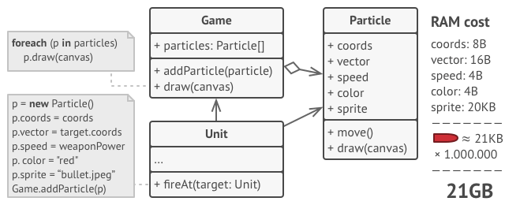</kbd>

### Solution

On closer inspection of the `Particle` class, you may notice that the
color and sprite fields consume a lot more memory than other fields.
What’s worse is that these two fields store almost identical data across
all particles. For example, all bullets have the same color and sprite.

<kbd></kbd>

Other parts of a particle’s state, such as coordinates, movement vector
and speed, are unique to each particle. After all, the values of these
fields change over time. This data represents the always changing
context in which the particle exists, while the color and sprite remain
constant for each particle.

This constant data of an object is usually called the *intrinsic state*.
It lives within the object; other objects can only read it, not change
it. The rest of the object’s state, often altered “from the outside” by
other objects, is called the *extrinsic state*.

The Flyweight pattern suggests that you stop storing the extrinsic state
inside the object. Instead, you should pass this state to specific
methods which rely on it. Only the intrinsic state stays within the
object, letting you reuse it in different contexts. As a result, you’d
need fewer of these objects since they only differ in the intrinsic
state, which has much fewer variations than the extrinsic.

<kbd>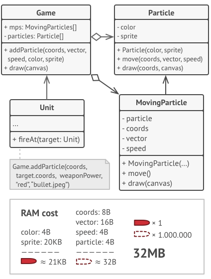</kbd>

Let’s return to our game. Assuming that we had extracted the extrinsic
state from our particle class, only three different objects would
suffice to represent all particles in the game: a bullet, a missile, and
a piece of shrapnel. As you’ve probably guessed by now, an object that
only stores the intrinsic state is called a flyweight.

### Extrinsic state storage

Where does the extrinsic state move to? Some class should still store
it, right? In most cases, it gets moved to the container object, which
aggregates objects before we apply the pattern.

In our case, that’s the main `Game` object that stores all particles in
the `particles` field. To move the extrinsic state into this class, you
need to create several array fields for storing coordinates, vectors,
and speed of each individual particle. But that’s not all. You need
another array for storing references to a specific flyweight that
represents a particle. These arrays must be in sync so that you can
access all data of a particle using the same index.

<kbd></kbd>

A more elegant solution is to create a separate context class that would
store the extrinsic state along with reference to the flyweight object.
This approach would require having just a single array in the container
class.

Wait a second\! Won’t we need to have as many of these contextual
objects as we had at the very beginning? Technically, yes. But the thing
is, these objects are much smaller than before. The most
memory-consuming fields have been moved to just a few flyweight objects.
Now, a thousand small contextual objects can reuse a single heavy
flyweight object instead of storing a thousand copies of its data.

### Flyweight and immutability

Since the same flyweight object can be used in different contexts, you
have to make sure that its state can’t be modified. A flyweight should
initialize its state just once, via constructor parameters. It shouldn’t
expose any setters or public fields to other objects.

### Flyweight factory

For more convenient access to various flyweights, you can create a
factory method that manages a pool of existing flyweight objects. The
method accepts the intrinsic state of the desired flyweight from a
client, looks for an existing flyweight object matching this state, and
returns it if it was found. If not, it creates a new flyweight and adds
it to the pool.

There are several options where this method could be placed. The most
obvious place is a flyweight container. Alternatively, you could create
a new factory class. Or you could make the factory method static and put
it inside an actual flyweight class.

### Structure

<kbd>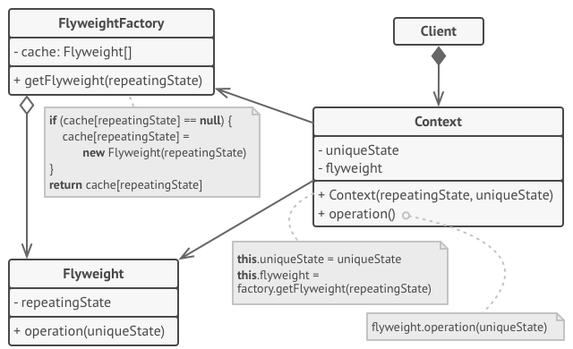</kbd>

### Pseudocode

In this example, the **Flyweight** pattern helps to reduce memory usage
when rendering millions of tree objects on a canvas.

<kbd>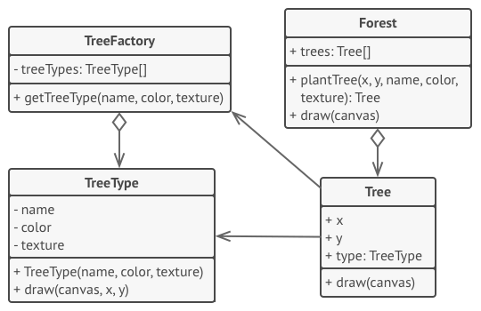</kbd>

The pattern extracts the repeating intrinsic state from a main `Tree`
class and moves it into the flyweight class `TreeType`.

Now instead of storing the same data in multiple objects, it’s kept in
just a few flyweight objects and linked to appropriate `Tree` objects
which act as contexts. The client code creates new tree objects using
the flyweight factory, which encapsulates the complexity of searching
for the right object and reusing it if needed.

### Real world example

Did you ever have fresh tea from some stall? They often make more than
one cup that you demanded and save the rest for any other customer so to
save the resources e.g. gas etc. Flyweight pattern is all about that
i.e. sharing.

### In plain words

It is used to minimize memory usage or computational expenses by sharing
as much as possible with similar objects.

### Wikipedia says

In computer programming, flyweight is a software design pattern. A
flyweight is an object that minimizes memory use by sharing as much data
as possible with other similar objects; it is a way to use objects in
large numbers when a simple repeated representation would use an
unacceptable amount of memory.

### Pros and Cons


<table>
	<thead>
		<tr class="header">
			<th>Pros</th>
			<th>Cons</th>
		</tr>
	</thead>
	<tbody>
		<tr class="odd">
			<td>You can save lots of RAM, assuming your program has tons of similar objects.</td>
			<td>You might be trading RAM over CPU cycles when some of the context data needs to be recalculated each time somebody calls a flyweight method.</td>
		</tr>
		<tr class="even">
			<td><br /></td>
			<td>The code becomes much more complicated. New team members will always be wondering why the state of an entity was separated in such a way.</td>
		</tr>
	</tbody>
</table>


### Programmatic example

Translating our tea example from above. First of all we have tea types
and tea maker

#### C\#


> // Anything that will be cached is flyweight.
> 
> ``` 
> // Anything that will be cached is flyweight.
> // Types of tea here will be flyweights.
> class KarakTea
> {
> }
> 
> // Acts as a factory and saves the tea
> class TeaMaker
> {
>     private Dictionary<string, KarakTea> mAvailableTea = new Dictionary<string, KarakTea>();
> 
>     public KarakTea Make(string preference)
>     {
>         if (!mAvailableTea.ContainsKey(preference)) {
>             mAvailableTea[preference] = new KarakTea();
>         }
> 
>         return mAvailableTea[preference];
>     }
> }
>                     
> ```

Then we have the `TeaShop` which takes orders and serves them

> 
> 
> ``` 
> class TeaShop
> {
>     private Dictionary<int,KarakTea> mOrders = new Dictionary<int,KarakTea>();
>     private readonly TeaMaker mTeaMaker;
> 
>     public TeaShop(TeaMaker teaMaker) {
>         mTeaMaker = teaMaker ?? throw new ArgumentNullException("teaMaker", "teaMaker cannot be null");
>     }
> 
>     public void TakeOrder(string teaType, int table) {
>         mOrders[table] = mTeaMaker.Make(teaType);
>     }
> 
>     public void Serve() {
>             foreach(var table  in mOrders.Keys ){
>             Console.WriteLine($"Serving Tea to table # {table}");
>         }
>     }
> }
>                     
> ```

And it can be used as below

> 
> 
> ``` 
> var teaMaker = new TeaMaker();
> var teaShop = new TeaShop(teaMaker);
> 
> teaShop.TakeOrder("less sugar", 1);
> teaShop.TakeOrder("more milk", 2);
> teaShop.TakeOrder("without sugar", 5);
> 
> teaShop.Serve();
> // Serving tea to table# 1
> // Serving tea to table# 2
> // Serving tea to table# 5
> 
>                     
> ```


#### Java


Translating our alchemist shop example from above. First of all we have
different potion types

``` 
public interface Potion {
	void drink();
}

public class HealingPotion implements Potion {
	private static final Logger LOGGER = LoggerFactory.getLogger(HealingPotion.class);
	
	@Override
	public void drink() {
		LOGGER.info("You feel healed. (Potion={})", System.identityHashCode(this));
	}
}

public class HolyWaterPotion implements Potion {
	private static final Logger LOGGER = LoggerFactory.getLogger(HolyWaterPotion.class);
  
	@Override
	public void drink() {
		LOGGER.info("You feel blessed. (Potion={})", System.identityHashCode(this));
	}
}

public class InvisibilityPotion implements Potion {
	private static final Logger LOGGER = LoggerFactory.getLogger(InvisibilityPotion.class);

	@Override
	public void drink() {
		LOGGER.info("You become invisible. (Potion={})", System.identityHashCode(this));
	}
}
				
```

Then the actual Flyweight object which is the factory for creating
potions

``` 
public class PotionFactory {
private final Map <PotionType, Potion> potions;

public PotionFactory() {
	potions = new EnumMap<>(PotionType.class);
}

Potion createPotion(PotionType type) {
	Potion potion = potions.get(type);
	if (potion == null) {
		switch (type) {
			case HEALING:
				potion = new HealingPotion();
				potions.put(type, potion);
				break;
			case HOLY_WATER:
				potion = new HolyWaterPotion();
				potions.put(type, potion);
				break;
			case INVISIBILITY:
				potion = new InvisibilityPotion();
				potions.put(type, potion);
				break;
			default:
				break;
		}
	}
	return potion;
	}
}
				
```

And it can be used as below

``` 
PotionFactory factory = new PotionFactory();
factory.createPotion(PotionType.INVISIBILITY).drink(); // You become invisible. (Potion=6566818)
factory.createPotion(PotionType.HEALING).drink(); // You feel healed. (Potion=648129364)
factory.createPotion(PotionType.INVISIBILITY).drink(); // You become invisible. (Potion=6566818)
factory.createPotion(PotionType.HOLY_WATER).drink(); // You feel blessed. (Potion=1104106489)
factory.createPotion(PotionType.HOLY_WATER).drink(); // You feel blessed. (Potion=1104106489)
factory.createPotion(PotionType.HEALING).drink(); // You feel healed. (Potion=648129364)
				
```


#### JavaScript


Translating our tea example from above. First of all we have tea types
and tea maker

``` 
// Anything that will be cached is flyweight. 
// Types of tea here will be flyweights.
class KarakTea {
}

// Acts as a factory and saves the tea
class TeaMaker {
	constructor(){
		this.availableTea = {}
	}

	make(preference) {
		this.availableTea[preference] = this.availableTea[preference] || (new KarakTea())
		return this.availableTea[preference]
	}
}
				
```

Then we have the `TeaShop` which takes orders and serves them

``` 
class TeaShop {
	constructor(teaMaker) {
		this.teaMaker = teaMaker
		this.orders = []
	}

	takeOrder(teaType, table) {
		this.orders[table] = this.teaMaker.make(teaType)
	}

	serve() {
		this.orders.forEach((order, index) => {
			console.log('Serving tea to table#' + index)
		})
	}
}
				
```

And it can be used as below

``` 
const teaMaker = new TeaMaker()
const shop = new TeaShop(teaMaker)

shop.takeOrder('less sugar', 1)
shop.takeOrder('more milk', 2)
shop.takeOrder('without sugar', 5)

shop.serve()
// Serving tea to table# 1
// Serving tea to table# 2
// Serving tea to table# 5
				
```


#### PHP


``` 
// Anything that will be cached is flyweight.
// Types of tea here will be flyweights.
class KarakTea
{
}

// Acts as a factory and saves the tea
class TeaMaker
{
	protected $availableTea = [];

	public function make($preference)
	{
		if (empty($this->availableTea[$preference])) {
			$this->availableTea[$preference] = new KarakTea();
		}

		return $this->availableTea[$preference];
	}
}
				
```

Then we have the `TeaShop` which takes orders and serves them

``` 
class TeaShop
{
	protected $orders;
	protected $teaMaker;

	public function __construct(TeaMaker $teaMaker)
	{
		$this->teaMaker = $teaMaker;
	}

	public function takeOrder(string $teaType, int $table)
	{
		$this->orders[$table] = $this->teaMaker->make($teaType);
	}

	public function serve()
	{
		foreach ($this->orders as $table => $tea) {
			echo "Serving tea to table# " . $table;
		}
	}
}
				
```

And it can be used as below

``` 
 $teaMaker = new TeaMaker();
$shop = new TeaShop($teaMaker);

$shop->takeOrder('less sugar', 1);
$shop->takeOrder('more milk', 2);
$shop->takeOrder('without sugar', 5);

$shop->serve();
// Serving tea to table# 1
// Serving tea to table# 2
// Serving tea to table# 5
				
```


#### Python


``` 
#!/usr/bin/env python
# -*- coding: utf-8 -*-

"""
*What is this pattern about?
This pattern aims to minimise the number of objects that are needed by
a program at run-time. A Flyweight is an object shared by multiple
contexts, and is indistinguishable from an object that is not shared.

The state of a Flyweight should not be affected by it's context, this
is known as its intrinsic state. The decoupling of the objects state
from the object's context, allows the Flyweight to be shared.

*What does this example do?
The example below sets-up an 'object pool' which stores initialised
objects. When a 'Card' is created it first checks to see if it already
exists instead of creating a new one. This aims to reduce the number of
objects initialised by the program.

*References:
http://codesnipers.com/?q=python-flyweights
https://python-patterns.guide/gang-of-four/flyweight/

*Examples in Python ecosystem:
https://docs.python.org/3/library/sys.html#sys.intern

*TL;DR
Minimizes memory usage by sharing data with other similar objects.
"""

import weakref

class Card(object):
	"""The Flyweight"""

	# Could be a simple dict.
	# With WeakValueDictionary garbage collection can reclaim the object
	# when there are no other references to it.
	_pool = weakref.WeakValueDictionary()

	def __new__(cls, value, suit):
		# If the object exists in the pool - just return it
		obj = cls._pool.get(value + suit)
		# otherwise - create new one (and add it to the pool)
		if obj is None:
			obj = object.__new__(Card)
			cls._pool[value + suit] = obj
			# This row does the part we usually see in `__init__`
			obj.value, obj.suit = value, suit
		return obj

	# If you uncomment `__init__` and comment-out `__new__` -
	#   Card becomes normal (non-flyweight).
	# def __init__(self, value, suit):
	#     self.value, self.suit = value, suit

	def __repr__(self):
		return "<Card: %s%s>" % (self.value, self.suit)

def main():
	"""
	>>> c1 = Card('9', 'h')
	>>> c2 = Card('9', 'h')
	>>> c1, c2
	(<Card: 9h>, <Card: 9h>)
	>>> c1 == c2
	True
	>>> c1 is c2
	True

	>>> c1.new_attr = 'temp'
	>>> c3 = Card('9', 'h')
	>>> hasattr(c3, 'new_attr')
	True

	>>> Card._pool.clear()
	>>> c4 = Card('9', 'h')
	>>> hasattr(c4, 'new_attr')
	False
	"""

if __name__ == "__main__":
	import doctest
	doctest.testmod()
				
```


## Proxy

<kbd></kbd>

### Intent

**Proxy** is a structural design pattern that lets you provide a
substitute or placeholder for another object. A proxy controls access to
the original object, allowing you to perform something either before or
after the request gets through to the original object.

<kbd></kbd>

### Problem

Why would you want to control access to an object? Here is an example:
you have a massive object that consumes a vast amount of system
resources. You need it from time to time, but not always.

<kbd>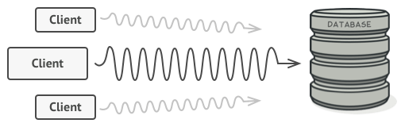</kbd>

You could implement lazy initialization: create this object only when
it’s actually needed. All of the object’s clients would need to
execute some deferred initialization code. Unfortunately, this would
probably cause a lot of code duplication.

In an ideal world, we’d want to put this code directly into our object’s
class, but that isn’t always possible. For instance, the class may be
part of a closed 3rd-party library.

### Solution

The Proxy pattern suggests that you create a new proxy class with the
same interface as an original service object. Then you update your app
so that it passes the proxy object to all of the original object’s
clients. Upon receiving a request from a client, the proxy creates a
real service object and delegates all the work to it.

<kbd>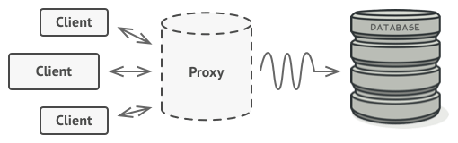</kbd>

But what’s the benefit? If you need to execute something either before
or after the primary logic of the class, the proxy lets you do this
without changing that class. Since the proxy implements the same
interface as the original class, it can be passed to any client that
expects a real service object.

### Structure

<kbd>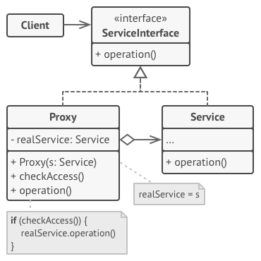</kbd>

### Pseudocode

This example illustrates how the **Proxy** pattern can help to introduce
lazy initialization and caching to a 3rd-party YouTube integration
library.

<kbd>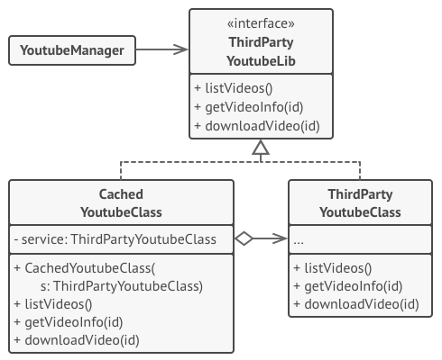</kbd>

The library provides us with the video downloading class. However, it’s
very inefficient. If the client application requests the same video
multiple times, the library just downloads it over and over, instead of
caching and reusing the first downloaded file.

The proxy class implements the same interface as the original downloader
and delegates it all the work. However, it keeps track of the downloaded
files and returns the cached result when the app requests the same video
multiple times.

### Real world example

Have you ever used an access card to go through a door? There are
multiple options to open that door i.e. it can be opened either using
access card or by pressing a button that bypasses the security. The
door's main functionality is to open but there is a proxy added on top
of it to add some functionality. Let me better explain it using the code
example below.

### In plain words

Using the proxy pattern, a class represents the functionality of another
class.

### Wikipedia says

A proxy, in its most general form, is a class functioning as an
interface to something else. A proxy is a wrapper or agent object that
is being called by the client to access the real serving object behind
the scenes. Use of the proxy can simply be forwarding to the real
object, or can provide additional logic. In the proxy extra
functionality can be provided, for example caching when operations on
the real object are resource intensive, or checking preconditions before
operations on the real object are invoked.

### Pros and Cons


<table>
	<thead>
		<tr class="header">
			<th>Pros</th>
			<th>Cons</th>
		</tr>
	</thead>
	<tbody>
		<tr class="odd">
			<td>You can control the service object without clients knowing about it.</td>
			<td>The code may become more complicated since you need to introduce a lot of new classes.</td>
		</tr>
		<tr class="even">
			<td>You can manage the lifecycle of the service object when clients don’t care about it.</td>
			<td>The response from the service might get delayed</td>
		</tr>
		<tr class="odd">
			<td>The proxy works even if the service object isn’t ready or is not available.</td>
			<td><br /></td>
		</tr>
		<tr class="even">
			<td><em>Open/Closed Principle</em>. You can introduce new proxies without changing the service or clients.</td>
			<td><br /></td>
		</tr>
	</tbody>
</table>


### Programmatic Example

Taking our security door example from above. Firstly we have the door
interface and an implementation of door

#### C\#


> 
> 
> ``` 
> interface IDoor
> {
>     void Open();
>     void Close();
> }
> 
> class LabDoor : IDoor
> {
>     public void Close()
>     {
>         Console.WriteLine("Closing lab door");
>     }
> 
>     public void Open()
>     {
>         Console.WriteLine("Opening lab door");
>     }
> }
>                     
> ```

Then we have a proxy to secure any doors that we want

> 
> 
> ``` 
> class SecuredDoor
> {
>     private IDoor mDoor;
> 
>     public SecuredDoor(IDoor door)
>     {
>         mDoor = door ?? throw new ArgumentNullException("door", "door can not be null");
>     }
> 
>     public void Open(string password)
>     {
>         if (Authenticate(password))
>         {
>             mDoor.Open();
>         }
>         else
>         {
>             Console.WriteLine("Big no! It ain't possible.");
>         }
>     }
> 
>     private bool Authenticate(string password)
>     {
>         return password == "$ecr@t";
>     }
> 
>     public void Close()
>     {
>         mDoor.Close();
>     }
> }
>                     
> ```

And here is how it can be used

> 
> 
> ``` 
> var door = new SecuredDoor(new LabDoor());
> door.Open("invalid"); // Big no! It ain't possible.
> 
> door.Open("$ecr@t"); // Opening lab door
> door.Close(); // Closing lab door
>                     
> ```


#### Java

Taking our wizard tower example from above. Firstly we have the wizard
tower interface and the ivory tower class

``` 
public interface WizardTower {
	void enter(Wizard wizard);
}

public class IvoryTower implements WizardTower {
	private static final Logger LOGGER = LoggerFactory.getLogger(IvoryTower.class);
	public void enter(Wizard wizard) {
		LOGGER.info("{} enters the tower.", wizard);
	}
}
			
```

Then a simple wizard class

``` 
public class Wizard {

	private final String name;

	public Wizard(String name) {
		this.name = name;
	}

	@Override
	public String toString() {
		return name;
	}
}
			
```

Then we have the proxy to add access control to wizard tower

``` 
public class WizardTowerProxy implements WizardTower {
	private static final Logger LOGGER = LoggerFactory.getLogger(WizardTowerProxy.class);
	private static final int NUM_WIZARDS_ALLOWED = 3;
	private int numWizards;
	private final WizardTower tower;

	public WizardTowerProxy(WizardTower tower) {
		this.tower = tower;
	}

	@Override
	public void enter(Wizard wizard) {
		if (numWizards < NUM_WIZARDS_ALLOWED) {
			tower.enter(wizard);
			numWizards++;
		} else {
			LOGGER.info("{} is not allowed to enter!", wizard);
		}
	}
}
			
```

And here is tower entering scenario

``` 
WizardTowerProxy proxy = new WizardTowerProxy(new IvoryTower());
proxy.enter(new Wizard("Red wizard")); // Red wizard enters the tower.
proxy.enter(new Wizard("White wizard")); // White wizard enters the tower.
proxy.enter(new Wizard("Black wizard")); // Black wizard enters the tower.
proxy.enter(new Wizard("Green wizard")); // Green wizard is not allowed to enter!
proxy.enter(new Wizard("Brown wizard")); // Brown wizard is not allowed to enter!
			
```


#### JavaScript


Taking our security door example from above. Firstly we have the door
interface and an implementation of door

``` 
/*
Door interface :
	open()
	close()
*/

class LabDoor {
	open() {
		console.log('Opening lab door')
	}

	close() {
		console.log('Closing the lab door')
	}
}
			
```

Then we have a proxy to secure any doors that we want

``` 
class Security {
	constructor(door) {
		this.door = door
	}

	open(password) {
		if (this.authenticate(password)) {
			this.door.open()
		} else {
			console.log('Big no! It ain\'t possible.')
		}
	}

	authenticate(password) {
		return password === 'ecr@t'
	}

	close() {
		this.door.close()
	}
}
			
```

And here is how it can be used

``` 
const door = new Security(new LabDoor())
door.open('invalid') // Big no! It ain't possible.

door.open('ecr@t') // Opening lab door
door.close() // Closing lab door

			
```


#### PHP


``` 
interface Door {
	public function open();
	public function close();
}

class LabDoor implements Door {
	public function open() {
		echo "Opening lab door";
	}

	public function close() {
		echo "Closing the lab door";
	}
}
			
```

Then we have a proxy to secure any doors that we want

``` 
class SecuredDoor
{
	protected $door;

	public function __construct(Door $door)
	{
		$this->door = $door;
	}

	public function open($password)
	{
		if ($this->authenticate($password)) {
			$this->door->open();
		} else {
			echo "Big no! It ain't possible.";
		}
	}

	public function authenticate($password)
	{
		return $password === '$ecr@t';
	}

	public function close()
	{
		$this->door->close();
	}
}
			
```

And here is how it can be used

``` 
$door = new SecuredDoor(new LabDoor());
$door->open('invalid'); // Big no! It ain't possible.

$door->open('$ecr@t'); // Opening lab door
$door->close(); // Closing lab door
			
```


Yet another example would be some sort of data-mapper implementation.
For example, I recently made an ODM (Object Data Mapper) for MongoDB
using this pattern where I wrote a proxy around mongo classes while
utilizing the magic method `  __call()  `. All the method calls were
proxied to the original mongo class and result retrieved was returned as
it is but in case of  `find` or `findOne` data was mapped to the
required class objects and the object was returned instead of `Cursor`.

#### Python


``` 
#!/usr/bin/env python
# -*- coding: utf-8 -*-

"""
*TL;DR
Provides an interface to resource that is expensive to duplicate.
"""

from __future__ import print_function
import time

class SalesManager:
	def talk(self):
		print("Sales Manager ready to talk")

class Proxy:
	def __init__(self):
		self.busy = 'No'
		self.sales = None

	def talk(self):
		print("Proxy checking for Sales Manager availability")
		if self.busy == 'No':
			self.sales = SalesManager()
			time.sleep(0.1)
			self.sales.talk()
		else:
			time.sleep(0.1)
			print("Sales Manager is busy")

class NoTalkProxy(Proxy):
	def talk(self):
		print("Proxy checking for Sales Manager availability")
		time.sleep(0.1)
		print("This Sales Manager will not talk to you", "whether he/she is busy or not")

if __name__ == '__main__':
	p = Proxy()
	p.talk()
	p.busy = 'Yes'
	p.talk()
	p = NoTalkProxy()
	p.talk()
	p.busy = 'Yes'
	p.talk()

### OUTPUT ###
# Proxy checking for Sales Manager availability
# Sales Manager ready to talk
# Proxy checking for Sales Manager availability
# Sales Manager is busy
# Proxy checking for Sales Manager availability
# This Sales Manager will not talk to you whether he/she is busy or not
# Proxy checking for Sales Manager availability
# This Sales Manager will not talk to you whether he/she is busy or not
				
```
