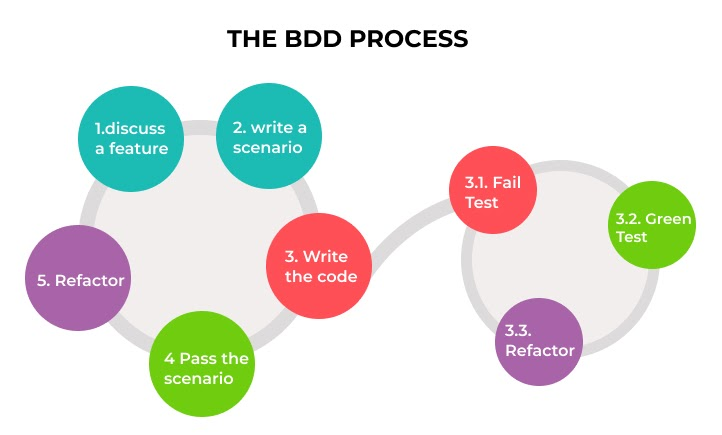

###### [Home](https://github.com/RyKaj/Documentation/blob/master/README.md) | [Software Development](https://github.com/RyKaj/Documentation/tree/master/SoftwareDevelopment/README.md) | [Unit Test](https://github.com/RyKaj/Documentation/tree/master/SoftwareDevelopment/UnitTest/README.md) |
------------

# Information Technology : Behavior-Driven Development (BBD)

Is a set of best practices for writing great tests. BDD can, and should
be, used together with TDD and unit testing methods.

One of the key things BDD addresses is implementation detail in unit
tests. A common problem with poor unit tests is they rely too much on
how the tested function is implemented. This means if you update the
function, even without changing the inputs and outputs, you must also
update the test. This is a problem because it makes doing changes
tedious.

Behavior-Driven Development addresses this problem by showing you how to
test. You should not test implementation, but instead behavior.

<kbd></kbd>

**Pros and Cons of Behavior-Driven Development (BDD)**
<table>
	<colgroup>
		<col style="width: 50%" />
		<col style="width: 50%" />
	</colgroup>
	<tbody>
		<tr class="odd">
			<td>
				

					<strong>Advantages</strong>
				

			</td>
			<td>
				

					<strong>Disadvantages</strong>
				

			</td>
		</tr>			
		<tr class="even">
			<td>
				

					<strong>Improved Communication:</strong> 
					Creating scenarios requires close coordination between clients, managers, developers, testers, etc. This unifies the team in understanding the product behavior.
				

			</td>
			<td>
				

					<strong>Requires more time than the traditional approach:</strong>
					Putting all the people together becomes difficult for teams. In addition, maintaining test scenarios also requires more time, which results in additional overhead.
				

			</td>
		</tr>
		<tr class="odd">
			<td>
				

					<strong>Reduced cost of Quality Control:</strong> 
					Automated acceptance tests are used to depict the scenarios, which in turn helps in reducing the costs involved in inspecting the product quality.
				

			</td>
			<td>
				

					<strong>Slowness in product development:</strong>
					To create a shared understanding, the management, testing, and development teams must collaborate. BDD adaptation becomes slow if there is no mutual understanding between these divisions within the enterprise.
				

			</td>
		</tr>
		<tr class="even">
			<td>
				

					<strong>Accurate task estimation:</strong> 
					Since the expected behavior is predicted before, there are few chances to change the software application’s architecture.
				

			</td>
			<td>
				

					<strong>Suited for large teams and less complex projects:</strong>
					If the team includes a couple of developers who are constantly in touch with testers and project managers, then the development of scenarios can be additional overhead. Doing a detailed analysis between TDD vs. BDD testing and developing test cases before development can be useful for smaller teams.
				

			</td>
		</tr>
		<tr class="odd">
			<td>
				

					<strong>Better user experience:</strong> 
					The scenarios and tests written before development take the user’s perspective into account. The focus is on the desired behavior rather than on the implementation of features.
				

			</td>
			<td>
				

					<strong>Implementation is necessary at the beginning of the project:</strong>
					There is no point in developing scenarios between the development process. This will decrease efficiency and make minimal business sense. Also, retrofitting scenarios in legacy systems is nearly impossible.
				

			</td>
		</tr>
		<tr class="even">
			<td>
				

					<strong>Excellent documentation:</strong> 
					When a certain test fails, the specification is updated, resulting in the detailed documentation.
				

			</td>
			<td>				
			</td>
		</tr>
	</tbody>
</table>