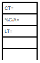
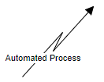
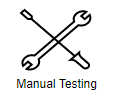

###### [Home](https://github.com/RyKaj/Documentation/blob/master/README.md) | 
------------

# Purpose of Template
The value stream mapping template's primary purpose is to share templates and standards to make it faster and easier for teams looking to implement the VSM. You can find below some examples of macro processes, and down the bottom, there is a link to VSM applied to some areas of our business.

## Map Template
This is a raw standard template that can be used to start any VSM process.

Example: Software Development

Example: Recuritment Process

# Value Stream Mapping Standard
Note: These are only a selected Icons and Symbols that can be used. 

These are the Icons and Symbols to be used in a Value Stream Map

|**Symbol**|**Name**|**Description**|
| :-: | :-: | :-: |
|**Processing Symbols**||||Customer/Supplier|When placed in the upper left corner of a value stream map, the typical starting place for material flow, this icon represents the supplier. When placed in the upper right corner, it represents the customer.|
|Dedicated Process|This icon represents a single department, process operation or machine with a fixed and continuous internal material flow.|
|Data Box|The data box is placed under other icons that require data to analyze the system. For example, a data box could go below a factory icon to show shipping frequency, product handling data, batch size or other information.|
|Push Arrow|This icon shows material being pushed downstream from one process to the next.|
|Information|A box with a name in it that indicates information flow.|
|Manual Process|Requires a human to manage and drive the process through every step and know whom to send it to.|
|Automated Process|Refers to the use of technology to perform a process or processes in order to accomplish a workflow or function.|
|Automated Testing|The use of software separate from the software being tested to control the execution of tests and the comparison of actual outcomes with predicted outcomes|
|Manual Testing|Requires a human to execute test cases manually and to document outcomes|
|Timeline|Commonly placed at the bottom of the value stream map, the timeline shows waiting times (the “troughs”) and processing times (the “hills”). It can be used to calculate lead time, total cycle time, and the percentage of time in value add.|

# Value Stream Mapping Report Template
Value Stream Mapping workshop for XXX Tribe. Document existing value stream, identify key inefficiencies.
[DOCX version ](./Resources/VSM%20Report%20Template.docx)

## **Workshop**

|**Date**|**Participants**|
| :-: | :-: |
||||

## **Glossary**
|**Abbreviation**|**Term**|**Meaning**|**Example**|
| :-: | :-: | :-: | :-: |
|CT|Cycle time|
Net effort needed for the work item to be completed

Synonym for VAT, which is Value-Adding Time.
|Net effort needed for developing a single feature.|
|WT|Wait time|Wait time spent between two subsequent work items|Waiting for code reviews.|
|TT|Transition time|Time it takes to make the step to next stage.|Code is complete, waiting for test to pick it up.|
|TCT|Total cycle time|Sum of all CTs.||
|TWT|Total wait time|Sum of all WTs and TTs.||
|PLT|Production lead time|PLT = TCT + TWT||
|-|Efficiency|
Ratio of net effort vs total time it takes to deliver value, expressed in %.

Efficiency = (TCT / PLT) \* 100.
|Efficiency = (2d / 10d) \* 100 = 20%.|
# **Value Stream Map**
TODO: add diagram here that was prepared during the workshop and finalized afterwards
# **Key Observations**
Priority may be High, Medium, Low. 

|**Observation**|**Priority**|**Recommendation**|
| :-: | :-: | :-: |
||||
|||||
# **Next Steps**

|**Next step**|**Addressed observation**|**Owner**|**Due Date**|**JIRA link**|
| :-: | :-: | :-: | :-: | :-: |
||||||
|||||||

